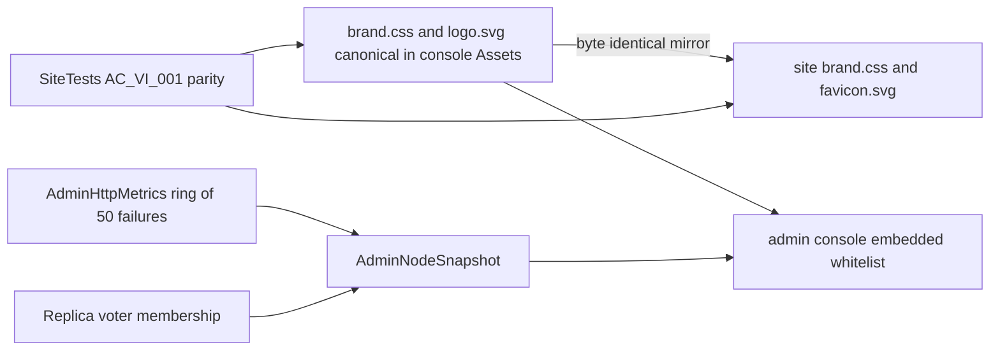

# ADR-053: one light KeyLoad visual identity for the console and the site

Status: Accepted. Date: 2026-10-02. Owner: KeyLoad lead. Related: REQ-AD-008..010 / AC-AD-008..010 ([AdminDashboard](../Features/AdminDashboard.md)), REQ-BC-029 / AC-BC-029 ([BenchmarkComparisons](../Features/BenchmarkComparisons.md)), ADR-040 site design, ADR-051 admin console.

## Context

The owner rejected the visuals of both surfaces:
- The runtime console (`/admin`) used a dark mint theme, a text monogram and a single polyline chart.
- The public site used a warm-paper/forest editorial style with serif display type.

The two surfaces shared no logo, palette, typography or components, so KeyLoad read as two unrelated products. The owner asked for:
- one style across both surfaces, starting with a simple, clear, light and attractive console;
- clear charts;
- convenient menus and categories;
- error logs, data volume, performance and nodes.

## Decision

- **One brand source.** `src/KeyLoad.Server/Features/AdminDashboard/Assets/brand.css` holds the tokens and the shared primitives (`kl-brand`, `kl-btn`, `kl-card`, `kl-glass`, `kl-badge`, `kl-chip`, reduced motion). It is mirrored byte-for-byte to `site/Features/BenchmarkComparisons/brand.css`, and `logo.svg` to `site/favicon.svg`. The SiteTests drift test `AC_VI_001` fails on any difference.
- **Style direction (owner, 2026-10-02).** Earlier candidates were rejected: a light-blue look, pastel/rainbow glass and a plain grey version. The adopted style is serious Apple-style Liquid Glass in the sibling brands' colours:
  - Managed Code: warm off-white, black ink and system typography.
  - Prostir: graphite instrument panels (`.kl-graphite`).
  - Accent: Managed Code's pastel iridescence (peach `#ffb08a` → lilac `#e3a6ff` → periwinkle `#9fb4ff`), used as a marker stroke, a selection edge, a status dot or the KeyLoad bar, never as a background wash. Green and lime are not brand colours (owner direction 2026-10-02; this supersedes the earlier lime accent).
  - Glass: translucent surfaces with specular top edges and large blur, capsule controls and large radii.
  - No Material Design and no decorative colour blobs.
  - The logo is a graphite squircle with white replica blocks and chevron, plus one iridescent replica.
  - Data colours: violet, peach-ink, periwinkle, orchid, graphite, amber, grey, red (`--kl-c1..c8`). There is no green data colour; the deep green `--kl-good` is reserved for semantic success status.
- **Surfaces.**
  - Design overhaul (owner direction 2026-10-02/03: a complete re-layout, not a restyle). Both surfaces share editorial paper, oversized black display type, mono uppercase eyebrows, graphite instrument panels and the iridescent marker.
  - The console is a "control room":
    - a floating Liquid Glass command bar (the `<aside>`) with three segmented navigation clusters; at ≤1320 px it collapses to icons, with a label on the active view only;
    - an editorial masthead with the view title and live controls;
    - a pulse strip of four KPI numerals with sparklines;
    - graphite instrument panels for request activity, throughput, console events and RF3 voters;
    - a persistent bottom status bar, a split connect screen and a right-hand inspector sheet for JSON details.
  - The site reads like a spec sheet. See the Site bullet below.
- **CSP and fonts.** System fonts only, no external fonts or CDNs. The console CSP is unchanged. Dynamic geometry uses CSSOM only.
- **Console information architecture.**
  - **Monitoring:**
    - Overview: KPI tiles with sparklines, a stacked request-activity chart, a storage donut, a node card, admission and recent errors.
    - Performance: throughput, latency and error-rate charts, lifetime totals and admission meters.
    - Errors & logs: the server failure log with status filters, plus session events.
  - **Data:** Catalog with kind chips, Collections, Queues and Blob storage.
  - **Infrastructure:** Nodes (RF3 voter figure and details) and Disk usage (category bar and largest files).
  - Every original `data-view` and pinned browser hook is preserved.
- **Real data only.** Charts plot at most 120 comparable session samples and reset on process change, failure or reconnect. The error log is a new bounded server observation: `AdminHttpSnapshot.RecentFailures`, at most 50 newest-first entries holding the route template, normalised method, status, aborted flag and duration. It never holds a raw path, query, payload or credential.
  - The voter figure uses configured membership (`AdminNodeSnapshot.LocalVoter`, `Voters`) and the reported leader. Peers are labelled as not observed from the executing node.
- **Site.** The landing is a new product page, not a restyle. Its numbered chapters (`01 — …`) run in this order:
  - a floating glass capsule navigation;
  - an editorial hero with an oversized black headline and an iridescent marker under "AI agents";
  - a glass stage holding the live Three.js scene: a carousel of eight data-shape cards around the KeyLoad core, a transparent canvas over the stage gradient, 19 draw calls and 37 triangles. It moves as soon as it is ready, except under reduced motion, and settles when paused;
  - a four-fact strip;
  - the anatomy of one agent call: a numbered timeline beside a graphite MCP/SDK terminal;
  - a data-shape bento of eight models with line art;
  - a graphite engine cross-section (callers → request grain → partition grains → three PartitionHosts);
  - the evidence instrument: a toolbar, segmented scenarios, the chart and table, and a perforated evidence receipt for provenance;
  - a ledger of "open by default" items and items "not claimed yet";
  - a method rail, a graphite reproduce terminal and an editorial wordmark footer with "Developed by Managed Code".

  Every tested hook, budget and lifecycle contract is unchanged.

## Alternatives

- Restyle each surface separately. Rejected because drift returns.
- A shared npm or MSBuild design package. Rejected: it adds tooling and dependencies, the Docker context holds only `src/`, and the site build is a separate pipeline.
- Inline the logo into each page. Rejected because the favicon and logo bytes must stay one fact.

## Implementation contract

1. **VI-L (lead):** brand tokens and logo, mirrored to the site. Done before the UI packets.
2. **VI-B (worker, sonnet):** ring buffer and middleware in `src/KeyLoad.Server/Features/AdminDashboard/AdminHttp*.cs`, with unit tests `AdminHttpMetricsTests` and `AdminHttpMetricsMiddlewareTests` written first. The DTO is frozen by the lead in Abstractions.
3. **VI-D (lead):** console `Assets/*` and the `AdminStaticAssets` whitelist. The lead also adds the voter membership fields and observer, and owns the `AdminDashboardRf3Tests` assertions.
4. **VI-S (lead):** site HTML/CSS/poster, colour constants in `measurements.mjs` and `scene-geometry.mjs`, `BUILD.assets` and SiteTests parity.
5. **VI-J (lead):** feature docs, this ADR, the Architecture map and exact-SHA CI evidence.

Dependencies:
- Contract additions are additive init properties with defaults. The SDK and the official MCP output pick them up from the DTO type.
- No schema, storage, routing or package change.

Migration, rollback and verification:
- **Rollout:** a single release. The console and the site deploy independently.
- **Rollback:** revert the assets and remove the three init properties. Stored data is untouched.
- **Verification:**
  - ci.yml unit tests: metrics ring and middleware.
  - RF3: failure-log route template and voter membership through the real SDK and official MCP.
  - Real Chrome console flow: existing hooks plus new views.
  - pages.yml SiteTests: unchanged hooks, budgets and the parity test.
  - Subjective beauty is judged from desktop/mobile screenshots of a real RF3 cluster (manual exception). It never replaces a functional gate.

Join points: shared enum/DTO edits are lead-only, and backend and UI write scopes are disjoint. This ADR stays Accepted until exact-SHA unit, RF3 browser and site qualification pass.
