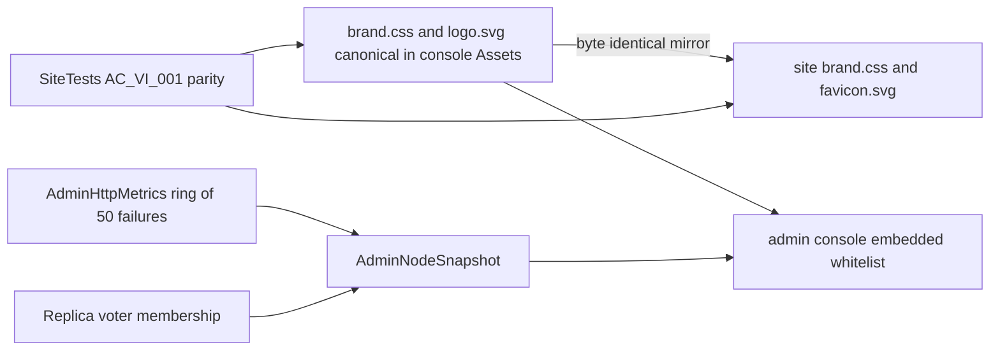

# ADR-053: one light KeyLoad visual identity for the console and the site

Status: Accepted. Date: 2026-10-02. Owner: KeyLoad lead. Related: REQ-AD-008..010 / AC-AD-008..010 ([AdminDashboard](../Features/AdminDashboard.md)), REQ-BC-029 / AC-BC-029 ([BenchmarkComparisons](../Features/BenchmarkComparisons.md)), ADR-040 site design, ADR-051 admin console.

## Context

The owner rejected the visuals of both surfaces:
- The runtime console (`/admin`) used a dark mint theme, a text monogram and a single polyline chart.
- The public site used a warm-paper/forest editorial style with serif display type.

The two surfaces shared no logo, palette, typography or components, so KeyLoad read as two unrelated products. The owner asked for:
- one style across both surfaces, starting with a simple, clear, light and attractive console;
- clear charts;
- convenient menus and categories;
- error logs, data volume, performance and nodes.

## Decision

- **One brand source.** `src/KeyLoad.Server/Features/AdminDashboard/Assets/brand.css` holds the tokens (surfaces, ink, brand blue/indigo gradient, reserved status colours, the dataviz-validated categorical chart order, radii, shadows, focus ring and system font stacks) and the shared primitives (`kl-brand`, `kl-btn`, `kl-card`, `kl-badge`, `kl-chip`, reduced motion).
  - The logo `logo.svg` is a rounded indigo→blue tile with a "K" whose stem is three stacked replica blocks (RF3) and whose arms form a forward chevron.
  - `site/Features/BenchmarkComparisons/brand.css` and `site/favicon.svg` are byte-identical mirrors.
  - The SiteTests drift test `AC_VI_001` fails on any difference. Both surfaces keep their own CSP-compatible, same-origin delivery: the console whitelists embedded assets, and the site build copies listed assets.
- **Light only.** System fonts only. No external fonts or CDNs. The console CSP is unchanged: styles and scripts are same-origin and SVG is drawn through DOM APIs. Dynamic geometry uses CSSOM properties only.
- **Console information architecture.**
  - **Monitoring:**
    - Overview: KPI tiles with sparklines, a stacked request-activity chart, a storage donut, a node card, admission and recent errors.
    - Performance: throughput, latency and error-rate charts, lifetime totals and admission meters.
    - Errors & logs: the server failure log with status filters, plus session events.
  - **Data:** Catalog with kind chips, Collections, Queues and Blob storage.
  - **Infrastructure:** Nodes (RF3 voter figure and details) and Disk usage (category bar and largest files).
  - Every original `data-view` and pinned browser hook is preserved.
- **Real data only.** Charts plot at most 120 comparable session samples and reset on process change, failure or reconnect. The error log is a new bounded server observation: `AdminHttpSnapshot.RecentFailures`, at most 50 newest-first entries holding the route template, normalised method, status, aborted flag and duration. It never holds a raw path, query, payload or credential.
  - The voter figure uses configured membership (`AdminNodeSnapshot.LocalVoter`, `Voters`) and the reported leader. Peers are labelled as not observed from the executing node.
- **Site.** The site gets the same tokens, logo, sans display type, cards, buttons, tabs, bars and tables. Engine colours and the Three.js scene colours move to the brand palette. All site hooks, budgets and lifecycle contracts are unchanged.

## Alternatives

- Restyle each surface separately. Rejected because drift returns.
- A shared npm or MSBuild design package. Rejected: it adds tooling and dependencies, the Docker context holds only `src/`, and the site build is a separate pipeline.
- Inline the logo into each page. Rejected because the favicon and logo bytes must stay one fact.

## Implementation contract

1. **VI-L (lead):** brand tokens and logo, mirrored to the site. Done before the UI packets.
2. **VI-B (worker, sonnet):** ring buffer and middleware in `src/KeyLoad.Server/Features/AdminDashboard/AdminHttp*.cs`, with unit tests `AdminHttpMetricsTests` and `AdminHttpMetricsMiddlewareTests` written first. The DTO is frozen by the lead in Abstractions.
3. **VI-D (lead):** console `Assets/*` and the `AdminStaticAssets` whitelist. The lead also adds the voter membership fields and observer, and owns the `AdminDashboardRf3Tests` assertions.
4. **VI-S (lead):** site HTML/CSS/poster, colour constants in `measurements.mjs` and `scene-geometry.mjs`, `BUILD.assets` and SiteTests parity.
5. **VI-J (lead):** feature docs, this ADR, the Architecture map and exact-SHA CI evidence.

Dependencies:
- Contract additions are additive init properties with defaults. The SDK and the official MCP output pick them up from the DTO type.
- No schema, storage, routing or package change.

Migration, rollback and verification:
- **Rollout:** a single release. The console and the site deploy independently.
- **Rollback:** revert the assets and remove the three init properties. Stored data is untouched.
- **Verification:**
  - ci.yml unit tests: metrics ring and middleware.
  - RF3: failure-log route template and voter membership through the real SDK and official MCP.
  - Real Chrome console flow: existing hooks plus new views.
  - pages.yml SiteTests: unchanged hooks, budgets and the parity test.
  - Subjective beauty is judged from desktop/mobile screenshots of a real RF3 cluster (manual exception). It never replaces a functional gate.

Join points: shared enum/DTO edits are lead-only, and backend and UI write scopes are disjoint. This ADR stays Accepted until exact-SHA unit, RF3 browser and site qualification pass.
