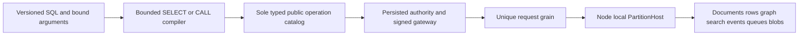

# ADR-054: Central SQL over canonical database operations

Status: Accepted under owner direction2026-10-02; implementation/qualification pending.

## Decision and contracts

One server/database serves AI agents across documents, typed rows, graphs,
vectors/text search, blobs, queues and events. SQL becomes the central versioned
language. Keep Q1 SELECT and AST1 backward compatible. Add SQL operation-envelope
version1: Q1 SELECT compiles to the existing QueryRequest; bounded
`CALL exact_public_operation(@arguments)` compiles using the sole public operation
catalog's strict typed decoder and enters the same signed Orleans gateway. The
argument is an object envelope containing existing `request` and, when required,
`commandId`; no-body operations use an empty envelope. Do not reflect arbitrary
methods, compose multiple statements, or allow SQL to call itself recursively.

SQL is a language adapter, never a parallel execution/authorization engine. Its
CALL result has the actual target operation type. Generic SQL MCP discovery uses
conservative non-read-only/non-idempotent/destructive hints. HTTP/MCP SQL wrapper
reserves the existing conservative heavy-read DATA lane before deserialize;
control CALLs may be rejected when it is saturated. Direct fenced control APIs
retain the reserved control lane. Exact target-route admission is a future
ingress-transfer optimization requiring bounded preclassification and qualification.

This first stage supplies procedural SQL for all implemented capabilities;
declarative multi-model SELECT sources/JOIN/fusion are required later contracts,
not implied by the new facade. SQL never performs generic writes to event/queue
internals. Existing command IDs, unknown outcome, leases, replay, redaction,
capability checks, cancellation, deadlines and bounds remain with target owners.

## Implementation contract

REQ-AISQL-001/003/004 -> AC-AISQL-001/005–010 in root acceptance;
QueryExecution owns language, existing model slices own effects. Ordered tasks:
TASK-AISQL-004 freezes DTOs/grammar;006 authors strict compiler tests and compiler;
007 preserves native equality planner efficiency;008 joins endpoint, SDK, official
MCP, conservative admission and RF3 differential tests. Exact ownership is the
root plan task graph. Worker changes cannot alter shared transport or authority.

Root owns Abstractions/Features/QueryExecution/SqlOperationContracts.cs,
Server query/catalog/admission joins, Client/Features/QueryExecution/, integration
tests and docs. SQL worker owns new Server/Features/QueryExecution/Sql* compiler
helpers and matching SqlOperation* unit files. Existing DTOs/route values retain
semantics. The adapter rejects unsupported versions and invalid CALL grammar,
targets or argument envelopes before routing. SELECT/EXPLAIN grammar is validated
once by the existing authorized Q1 request actor before a scan or effect; the
adapter does not repeat parsing. Deployment is
additive; rollback removes advertisement/new route, existing Q1 remains.

Dependencies: ADR-010/012/013/014/020/035/036/039/055. Tests: strict syntax/version/
parameter/name/recursion rejection; Q1 equality; actual SDK/MCP read/write/error/
retry/permission/cancellation/admission flows on RF3; comparison measurements.
Integration lead joins all worker diffs and owns GitHub exact-SHA proof/artifacts.
No acceleration, full SQL compatibility or production claim before qualification.
