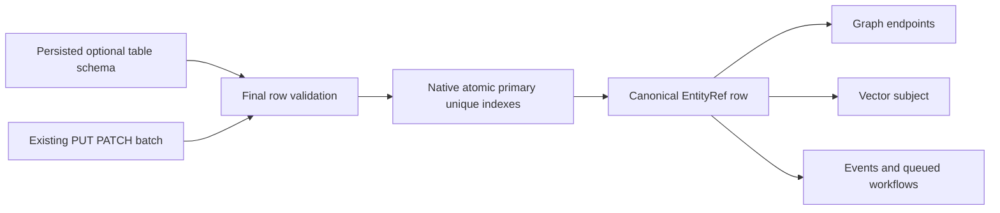

# ADR-055: Typed relational rows in canonical entity storage

Status: Accepted under owner direction2026-10-02; implementation/qualification pending.

Pre-delivery naming refinement: CA1720 rejected the new public enum members
Int64/Decimal in candidate6cfdadf38. Use WholeNumber (signed 64-bit integer) and
FixedPoint (exact .NET decimal range/scale). Preserve their ordinal values and
all scalar correctness contracts. This fixes the public identifiers rather than
suppressing the analyzer.

## Decision

Add optional null-omitted RelationalSchema metadata to Collection resources.
This is a typed table backed by the existing canonical document/entity keyspace,
not a second SQL storage engine or a new ResourceKind that breaks graph/vector
binding. Columns are immutable, unique and bounded. Initial scalar types: Text,
Boolean, Int64, Decimal and UtcTimestamp. A named nonnullable Text primary-key
column is mandatory and equals EntityRef.Id. Nullable columns accept absent/null;
other columns reject both. Rows are closed top-level JSON objects; unknown and
duplicate properties reject. Int64 and decimal must parse exactly into the stated
CLR scalar range; UTC timestamps carry explicit zero offset. Native configured
unique IndexDefinition constraints retain atomic-partition scope and SQL NULL
policy remains explicitly configured by IncludeNull/IncludeMissing. Q1 metadata
names cannot silently shadow row columns: `revision`, `*` and names starting `@`
are reserved; `id` is permitted only as the primary key matching EntityRef.Id.

Only Document-authority Collection resources can carry this schema. The same
PUT/PATCH final-image validation occurs before index updates in the existing
ordered atomic gate. Revision/authorization/replacement checks remain unchanged;
failed constraints roll back the complete mixed mutation batch. Canonical row
identities may be graph endpoints, vector subjects, event provenance and queued
workflow references. Blob lifecycle remains separate as ADR-038 defines.

PUT validates the original bounded JSON before numeric canonicalization. PATCH
preflights raw typed SET scalars, then validates the final image once; this rejects
decimal rounding/underflow before the original precision is lost. Both honor
configured document-byte/depth limits before parsing.

Foreign keys/checks/defaults/cascades and join planning need subsequent explicit
contracts and are not advertised by this typed-row stage. They remain
required relational product work, with partition/domain/policy/resource bounds.

## Implementation contract

REQ-REL-001/002/003 -> AC-AISQL-002–004/009/010 in
[RelationalStorage](../Features/RelationalStorage.md) and this ADR.
Ordered tasks:004 freezes metadata DTOs;005 writes real-ZoneTree schema/row/
atomicity/linkage regression sources then validators;008 joins configuration and
PUT/PATCH validation once per final image, client/MCP/RF3/evidence.

Root owns optional ResourceDefinition metadata and new immutable schema DTOs at
Abstractions/Features/RelationalStorage/, shared configuration/PUT/PATCH hooks,
all docs/SDK/routing joins. Worker owns only Core/Features/RelationalStorage/
validators and UnitTests/Features/RelationalStorage/ tests. Read views, physical
storage, grain ownership and existing mutation/public JSON values remain unchanged.

New resources opt in with the typed schema; changed resource schemas fail strict
configuration validation. Null metadata omission preserves the current resource
serialization. Rollout enables typed resources only where the active writer enforces
this schema. Rollback keeps persisted schema intact and fails closed whenever the
active source cannot validate or serve it; never silently discard a schema.

Tests map each column type/null/unknown/duplicate/primary condition, revision and
protected-write denial, unique conflict, full mixed-batch rollback, persistence
reopen, graph/vector row linkage, RF3 SDK/MCP SQL equivalence. CI only, no doubles.
GitHub build/format/analyzer/governance/units/recovery/RF3 and coverage evidence
join through root. Performance is validation of one final image plus existing
native indexes; speed/scale requires dedicated same-workload GitHub measurements.
