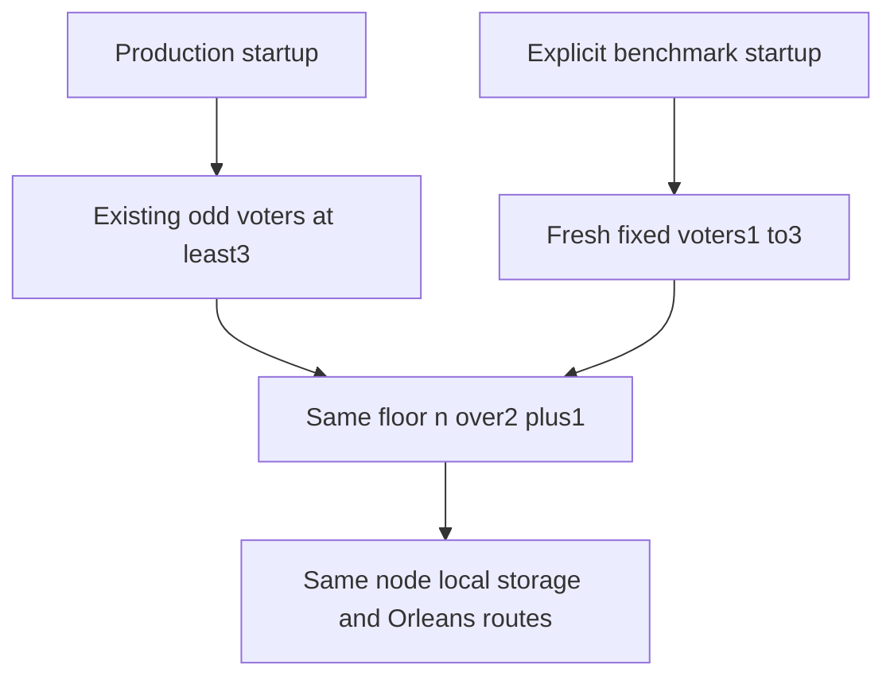
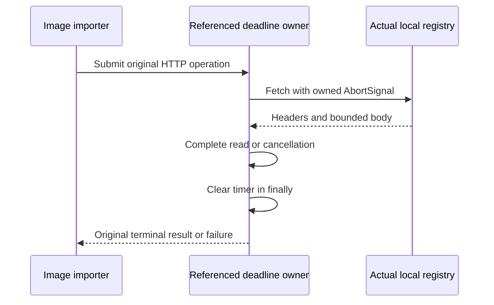
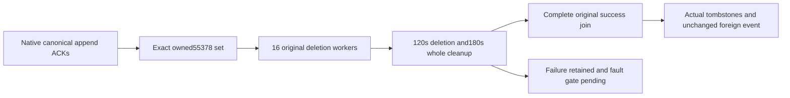
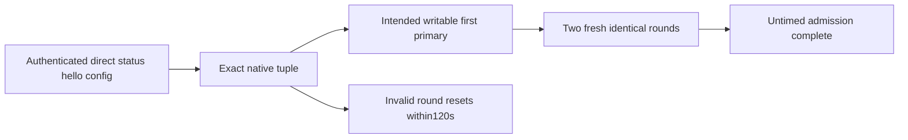

# ADR-056: Isolated Linux comparison cells and complete evidence aggregation

Status: Accepted. Owner: lead integration. Date:2026-10-03. Related: REQ-BC-050..058 / AC-ISO-001..009, [acceptance](ADR-056-isolated-linux-comparison-cells.md), [ordered task graph](ADR-056-isolated-linux-comparison-cells.md), [BenchmarkComparisons](../Features/BenchmarkComparisons.md). Refines ADR-007/034/040; no source or qualification claim follows from this decision.

## Decision

Every measured engine × actual node count1/2/3 × scenario × intensive profile is one ordinary isolated Linux GitHub runner job. The closed nine-engine catalog and ten scenarios produce270 cells for the initial intensive profile:108 CRUD and162 specialized, separate matrices below the256-job limit. One common deterministic workload/oracle/measurer serves all engines; each worker creates only its selected native engine topology and load generator. No resource/credential/database leakage across workers. Native Community topology unavailable (Neo4j2/3) produces a structured reason with no measurement, never independent standalone nodes posing as a cluster.

```mermaid
flowchart LR
    Plan[Closed cell plan] --> Linux[Separate Linux VM per cell]
    Linux --> Native[Selected native engine group]
    Native --> Oracle[Shared corpus and correctness]
    Oracle --> Raw[Per worker schema4 raw JSON]
    Raw --> Join[Authenticated complete aggregation]
    Join --> Site[Independent site qualification and generation]
    Site --> Pages[Freshness recheck and Pages deployment]
```

Worker selection/envelope/paths/intensity are frozen in acceptance. Preserve every raw nested report and real per-host runtime facts. The aggregate owns only complete plan/provenance/raw hash references, never synthesized one-host measurements or summed independent throughput/percentiles. All actual worker jobs/artifacts must succeed and correspond to the same run/attempt/source/plan/corpus/options. Unsupported capability is explicit and null; failed proof/timeout is failed evidence. Missing data never becomes a zero or invented winner.

## Fixed-membership benchmark topology contract

The owner explicitly requested actual1/2/3-node benchmark sets. Existing production validation continues to require odd groups≥3; default AppHost remainsRF3. Only explicit trusted server startup `BenchmarkTopology` enables benchmark groups1/2/3. ReplicaConfiguration receives the same explicit opt-in; no HTTP/SQL/client request can set it. The same consensus, Orleans distributed directory/migration/request actors, persisted membership/auth and node-local ZoneTree+journals apply. Majority stays floor(n/2)+1. RF1 has no replica fault tolerance; RF2 requires both voters for read/commit and offers no single-node-loss availability. RF3 retains its current majority/fault contracts. Never callRF1 orRF2 production-qualified from timing tests.

Every group has a fresh fixed incarnation and its own storage directories. Changed voter membership must not silently reopen an existing authority; existing persistent identity checks remain. Restart retains exactly the same set and ordered atomic apply. Real SDK/MCP topology, acknowledged-data restart,RF2 quorum-loss and unchangedRF3 gates are required. Compiler opt-ins remain scoped to the existing two Orleans calls; no analyzer suppression or alternate engine.

## Workload contract

DocumentWrite remains unique absent-ID creation. New DocumentUpdate and DocumentDelete get fresh owned initial state outside timing; measured operation IDs and warmup IDs are disjoint. Update asserts existence/affected cardinality and exact changed body; delete asserts prior existence/cardinality and post-delete absence; sentinel/unaffected records remain. Preparation, readback and oracle are outside timed requests. No retries hide faults. Every attempt and failed latency remains raw; useful throughput counts verified success. Existing vector/queue/graph/event oracles remain identical.

## Implementation and join contract

1. TASK-ISO-004 root owns architecture/spec/ADR, shared selection/envelope/scenario/contracts, central workflow/configuration/inventory and final integration. Existing historical evidence remains immutable. Static baseline identifies unresolved RF3 restart, comparison lifecycle and schema mismatch; they remain tracked.
2. TASK-ISO-005 topology worker owns only ReplicaConfiguration.cs, Server NodeOptions.cs, AppHost ClusterResources.cs, KeyLoadTarget.cs, KeyLoadTopology.cs and new BenchmarkTopology-prefixed UnitTests. Root serializes composition/endpoint joins. Extend only benchmark fixed membership; preserve production negative checks/majority and existing storage/fault contracts. Real tests in010/012 prove runtime.
3. TASK-ISO-006 aggregation worker owns only new `scripts/Features/BenchmarkComparisons/aggregate-*.mjs` modules and `tests/KeyLoad.UnitTests/Features/BenchmarkComparisons/IsolatedAggregate*` TUnit real Node/files regressions. Strict closed-cell identity/options/provenance/hash/sample validation, no authenticated-provider claim from supplied JSON. Root owns GitHub API transport and site join.
4. TASK-ISO-007 matrix worker owns only new `scripts/Features/BenchmarkComparisons/isolated-plan*.mjs` and `tests/KeyLoad.UnitTests/Features/BenchmarkComparisons/IsolatedPlan*` regressions. Emit exact270 cells split108/162, Linux-only closed target/node/scenario/intensity fields. Root owns ci/comparison/Pages YAML joins.
5. TASK-ISO-008 root and subsequent disjoint adapter workers integrate selected-scenario common runner, fresh CRUD oracle/target methods, strict selected host and raw envelope. No new dependency or obsolete all-engine path qualifies isolation.
6. TASK-ISO-009 root approves exact native adapter constructors/count/ACK contract before assigning disjoint engine resources/proof/CRUD workers. Requested count must be independently observed, including seeded data copies. Pin Community images from primary sources; no paid/native topology substitute.
7. TASK-ISO-010 joins all producers and creates one real TUnit/Aspire cell flow, bounded lifecycle/cleanup and required real SDK/MCP fault proofs. Workflow consumes closed plan, retains raw/image/native/test artifacts and authenticates every actual job/artifact/digest before aggregation.
8. TASK-ISO-011 evolves schema4 site/provenance consumers and closed source/coverage/archive inventory together. Preserve validated historicalschema2/3 and all existing site/browser/coverage/freshness intentions. Site/main and measured/source remain accurately separate. Only the successful complete aggregate replaces comparison-smoke as the new evidence producer.
9. TASK-ISO-012 root reviews every diff, resolves ownership conflicts and completes exact-SHA Linux full checks, native/intensive cohort, aggregate, site qualification and actual publication receipt. Every required task must be complete with artifacts, never inferred from idle/partial worker output.

Worker model/permissions/escalations are in the plan. Root approves each disjoint source contract before work; shared file writes are serialized. Test methodology is acceptance-derived positive/negative/edge/fault flows through actual native dependencies/TUnit/Node/browser, GitHub execution only. No local benchmark, mock target, test skip, fabricated metric or weakening of analyzers/coverage.

## Rollout and rollback

No database format/API migration. Benchmark opt-in is additive and defaults off. New complete evidence producer/aggregate/site protocol deploys atomically as a versioned route, with latest publication blocked until the first full qualified cohort. Source rollback removes the new route together and retains prior immutable historical evidence, sourceSHA and contract labels; no mixed format/latest pointer or hidden fallback. Temporary source stages remain Accepted and visibly unqualified until every criterion and delivery gate passes.

### TASK005 persisted membership refinement before opt-in implementation

Source audit found legacy hardstate carries incarnation but no exact voter list.
AC-ISO-004 cannot be met by validation alone. TASK005 additionally owns only
`ReplicaLogValidation.cs` and new `ReplicaBenchmarkMembership*` feature files/tests.
Use the existing node-owned replica ZoneTree IAtomicStore commit/WAL for a versioned
private guard containing incarnation and exact ordered voters. Fresh benchmark
stores commit it atomically with initial hardstate; no extra flat-file authority.
Existing hardstate without guard rejects benchmark opt-in; no guessed legacy
migration. Any existing guard is validated on every open, including opt-out, and
voter/incarnation drift or malformed metadata fails closed. Existing production
stores without guard keep their existing production contract. Canonical snapshot
installation does not replace the independent local replica metadata; reopen and
restore revalidate it. Source rollback cannot safely reopen benchmark1/2 with an old
runtime and is explicitly unsupported. No data/ACK/quorum/protocol substitution.
Real-ZoneTree persistence/corruption/reopen/atomic-commit tests plus native1/2/3
restart/quorum qualification are required before statusImplemented. This extends
the ordered005→010→012 join; root owns restore review and final evidence.
### TASK009QR native adapter join

The Qdrant/RabbitMQ implementation contract is frozen in acceptance before
delegation. Existing constructor and transport ownership remain; exact native
count/peer/copy policy and quorum acknowledgement apply equally to2/3 nodes.
TASK009QR owns only the six named adapters/proofs and new native response
regressions. Root joins selected host, Aspire startup and GitHub actual container
evidence. No response-only test establishes native runtime qualification.
### TASK008M common mutation join

Acceptance freezes the additive corpus initial-state API, disjoint input ranges
and bounded preparation/readback flow before implementation. Root owns this
shared path; adapter workers own native mutation cardinality. Existing session
contracts and failed raw attempt timings remain. Real native CRUD qualification
is required after all joins.
Native disabled Qdrant1 is verified as a standalone endpoint with RF1/WCF1 and
exact seeded count. Its unavailable distributed peer/shard endpoint is not
fabricated; enabled/distributed engines require the exact native peer/copy proof.
### TASK009PMOK native document and event adapters

Acceptance freezes count-derived native PostgreSQL/Mongo/OpenSearch/Kurrent
proofs and strict document mutation cardinality before delegation. The named
library/test ownership is disjoint from host, shared measurer and Aspire wiring.
Real native members/copies/quorum plus CRUD faults must be exercised by the
Linux integration/cell workflow before any measurement is publishable.
### Selected Aspire composition contract

Acceptance freezes the internal resource context/API before helper delegation.
The early route validates selection before any existing default RF3 creation;
only KeyLoad selects trusted benchmark RF1/RF2/RF3, while external cells allocate
no KeyLoad nodes. Root owns context/dispatcher and native helper join. Source-owned
bootstrap runs outside timing; observed member/copy/ACK proof remains mandatory.

## TASK-ISO-009PMOKR native composition join

REQ-BC-052/055, AC-ISO-002/003/006: only selected PostgreSQL, MongoDB,
OpenSearch or KurrentDB native nodes plus an explicitly labelled one-shot native
bootstrap client may be added. Root owns dispatcher and shared image/settings.
The worker owns NEW `IsolatedPostgres*`, `IsolatedMongo*`, `IsolatedOpenSearch*`,
`IsolatedKurrent*` AppHost slice files and NEW `IsolatedDocumentResource*` comparison
tests. Existing adapter constructors and all frozen settings remain unchanged.

PostgreSQL uses the pinned pgvector18 image, one primary, zero/one/two physical
streaming standbys, exact application names `benchmark_standby1/2`, PG18 native
data mount, fsync/on and synchronous_commit/on. The primary's official init path
adds a secret-free physical replication pg_hba rule. The superuser password is a
random secret Aspire parameter. Standby pg_basebackup uses PGPASSWORD, an owned
fresh directory and native -R/streaming WAL configuration. Quorum is established
by the existing untimed native adapter before seeding. No setup DDL waits for
standbys before they can bootstrap. Native bootstrap waits are bounded.

MongoDB uses official 8.3.9 digest
`81a1c8842a09589fc8d5f285266f3340bf4abdf66700ba22988f14cc9b2b3118`, verified
against official Registry OCI index on2026-10-03. One node is genuine authenticated
standalone; two/three use exactly one authenticated replica set. Random shared
root password and replication key are secret parameters/environment, never
command arguments or retained logs. A source-owned wrapper may write/chmod/chown
its private in-container key file before exec of official docker-entrypoint.
A same-image one-shot mongosh client establishes the native replica-set members
and bounded readiness before the runner. It is a bootstrap client, not a fourth
database node. No fake replicas, force reconfig or hidden operation retries.

OpenSearch uses pinned3.6 native discovery seed and cluster-manager lists, one
primary shard and n-1 copies qualified by the adapter. Heap512MiB per native
node, official entrypoint, private data volumes. Benchmark-only security-disabled
HTTP is explicit in report transport/auth metadata; no admin credentials are
claimed. Kurrent uses pinned free26.1.2 native cluster_size n, replication1112,
HTTP2113, all-interface binds and exact native advertised aliases/gossip seeds;
benchmark-only insecure transport is accurately reported. Two-node majorities
require both nodes and do not claim single-failure availability.

Tests precede implementation: actual Aspire CreateBuilder/Build resource models,
ExecutionConfigurationBuilder native callbacks, exact selected resource counts,
private paths, images, aliases, secret/env/argument boundaries, bootstrap wait
edges, single-node exclusions and rejection before allocation. They run in
GitHub only. Model assertions do not qualify a running cluster; root's genuine
isolated270-cell tests and raw native proof remain required. Worker may not edit
shared context, dispatch, projects, central pins, contracts, workflows, docs,
existing tests or other resource prefixes. Escalate any missing native setting
or image-specific UID requirement rather than weakening security/native proof.

PMOKR image-specific permission refinement: official PostgreSQL18 entrypoint
chowns PGDATA but does not chown its mounted parent. A source-owned wrapper may
chown only this cell's `/var/lib/postgresql` mount to image postgres user/group,
keep0700, then exec the official entrypoint with native args. The standby wrapper
owns the same narrowly scoped permission initialization before pg_basebackup.
Do not relax directory modes or impose a host UID on the PostgreSQL process.
Root approves this native startup refinement under AC-ISO-002/003/006; actual
GitHub container permission/copy proof remains mandatory.

PMOKR volume refinement: OpenSearch and Kurrent retain their official image user
and entrypoint. They may use new uniquely named Docker volumes scoped to this
one cell rather than unreadable host0700 binds. Volume names include an owned
random cell token; no volume is reused or shared. Root's runtime fixture records
actual mount names and removes only these owned volumes after stopping this app.
Model tests assert volume type, distinct per-node/per-cell names and official
user/entrypoint; actual native GitHub storage/copy proof remains mandatory.

## TASK-ISO-010I immutable image bundle

REQ-BC-050/056, AC-ISO-001/006/007: one trusted Linux job builds the server and
load generator once. All native cells import those exact image bytes into their
own local registry; no database or live process is shared. Frozen portable v1:
`{schemaVersion:1,sourceRevision,runId,attempt,repository,ref,images:{server:{archive:"server.tar",bytes,sha256},comparisons:{archive:"comparisons.tar",bytes,sha256}}}`.
A bundle contains original image-receipt.json, server/comparisons-manifest.json,
these two native Docker save archives and image-bundle.json; native command/
registry/cleanup evidence may also be retained. JSON must be strict, duplicate
keys rejected, SHA/IDs/source/cohort/constant base pins bound to the existing
receipt; no symlinks or existing output overwrite. Hash archives with bounded
streaming reads (4GiB maximum each); never parse a Docker archive in custom code.

`export-images.mjs` accepts no CLI options, uses the existing Linux GitHub run
context and prepared verified receipt, invokes native Docker image save with
bounded owned output paths, hashes regular files and exclusively writes the v1
bundle. `import-images.mjs --bundle=<absolute-existing-directory>` verifies the
input regular files/hashes/receipt/cohort and current clean source before native
Docker load. It starts only the existing owned local registry, verifies native
loaded config IDs/source labels, pushes the original tags, retrieves native
registry manifests and requires exact byte/digest equivalence to the original
manifests. Then it writes the existing local image receipt and original immutable
outputs. Any mismatch fails before Aspire/native database allocation. Original
build and import receipts are retained separately; supplied JSON never claims to
authenticate GitHub transport.

Root owns actual trusted GitHub job/artifact binding, workflows, image-contracts
and shared source exports. gates_audit owns only NEW `image-bundle-*`,
`export-images.mjs`, `import-images.mjs`, NEW UnitTests `ImageBundle*` and NEW
ComparisonTests `ImageBundle*` files. Root exposed verifySourceCheckout and
makeImageRecord from prepare-images for reuse; preserve all native checks.
TUnit tests precede implementation: real Node/file validation and negative
hash/source/manifest/unsafe-path/duplicate/output-preservation inputs, no HTTP
or Docker doubles. A real Docker export/registry-stop/remove-own-tags/import
round-trip in the trusted build job verifies archive consumption, native config,
source, manifest identity and outputs. Test filtering uses TUnit tree-node paths.
No local tests/build/start. Root review and exact-SHA GitHub proof are required.

TASK-ISO-010I retention filename: import exclusively retains original receipt bytes as `build-image-receipt.json` in its fresh owned local evidence directory; existing `image-receipt.json` remains the native verified import receipt. Existing strict aggregate-json parser may be reused as a generic duplicate-key reader; it does not authenticate transport.

TASK-ISO-010I directory join: export exclusively creates sibling `RUNNER_TEMP/keyload-image-bundle` for original receipt/manifests, tar archives and v1 bundle. `keyload-images` retains registry evidence. The real round-trip retains the original evidence as a distinct owned sibling, cleans only its registry/verified tags, then import recreates `keyload-images` and final native receipts/outputs. No supplied paths may overwrite either directory.

TASK-ISO-010I archive sha256 is raw lowercase64-hex; bytes is a positive safe integer at most4294967296. Existing native manifest/config digest IDs retain sha256: prefix. Export/import require no success stdout; workflow uses the fixed bundle/evidence paths and existing GITHUB_OUTPUT image outputs.

## TASK-ISO-010C native preflight before full cohort

Before allocating270 intense cells, qualify27 isolated Linux native cells, one
supported representative scenario per engine at each native node count. Each
preflight gets its own VM, the same frozen intensive options/image and all native
membership/copy and untimed CRUD negative probes where supported. Representatives:
KeyLoad/PostgreSQL/Redis/Neo4j/MongoDB/OpenSearch PointRead; Qdrant VectorExact;
RabbitMQ QueueCycle; KurrentDB StreamAppend. Neo4j2/3 remain runner-only explicit
unsupported topology. Preflight artifacts are `comparison-preflight-<id>` and
jobs `preflight / <id>`; they are retained but excluded from final aggregation.
The108CRUD/162specialized full matrices depend on successful complete preflight.
Every full cell is still measured on its own new VM and must pass; preflight never
substitutes for the270-cell cohort, RF3/public clients or remaining quality gates.
The closed270-cell plan schema remains unchanged. A derived preflight matrix has
exactly these27 existing canonical cells and is validated against that plan.

## TASK-ISO-010K public client qualification

AC-ISO-003/004/005: NEW ComparisonTests `IsolatedKeyLoadPublicRegression*` files
are owned by sql_audit. Entry `VerifyAsync(DistributedApplication app,int nodeCount,
CancellationToken token)` runs untimed after KeyLoad PointRead measurements for
actual RF1/2/3. Read only native model endpoints and persisted admin authority;
own native HTTP + official C# MCP SDK clients. Use a unique persisted partition.
Verify SDK create/MCP read/revision-fenced MCP update/SDK exact read/SQL CALL delete
and SDK/MCP absence, duplicate create/missing update+delete, persisted read-only
credential denial across SDK/MCP/SQL with exact canonical errors, stable CommandId
retry/receipt, atomic stream/queue plus SQL logical parity/nonconsuming inspect/
fenced ACK, genuine two-part blob hash and crossing range via SDK+official MCP,
and invalid hash rejected without publication. No transport/fixture copying or
mocks. Root adds explicit SDK project and centrally pinned official MCP package
references; worker may not edit contracts/projects/workflows/old fixtures/docs.

Root owns subsequent real native fault phase: RF1 native SIGKILL/restart restores
prior ACK, RF2 loses quorum with either voter stopped and rejects new quorum work,
restart preserves exact membership/authority and prior ACK; normal RF3 retained
snapshot/catch-up public-client gate remains mandatory. No snapshot-threshold
change or claimed process proof from activation restarts. The public helper alone
does not qualify process recovery, power loss or snapshot installation. Worker
writes meaningful actual caller assertions first; source inspection and exact-SHA
GitHub cases/fault receipts are required before the task joins as qualified.

## TASK-ISO-010G authenticated GitHub transport

AC-ISO-001/006/007: gates_audit owns only NEW `isolated-github-*` scripts and NEW
UnitTests/ComparisonTests `IsolatedGitHub*`. Root owns workflows and fixed shared
schemas. Use actual authenticated GitHub CLI REST (GH_TOKEN only in environment,
never argv/logs), fixed managedcode/KeyLoad canonical ci.yml/run/current attempt,
actual clean source/GITHUB_SHA and Linux. Retain exact raw run-attempt/jobs-pages/
artifacts-pages JSON. Complete bounded pagination, unique IDs and exact native
source/run/attempt/job/artifact associations are mandatory. Supplied metadata
never claims to authenticate transport. Reuse genuine existing hash/strict JSON/
process primitives where suitable; do not invent a ZIP parser or HTTP doubles.

`isolated-github-job.mjs` accepts no args, reads exact trusted
KEYLOAD_COMPARISON_JOB_NAME (`case / <canonical-id>`, `preflight / <canonical-id>`
or comparison-images for a native API test), captures current in-progress own
job, and appends only actual KEYLOAD_COMPARISON_JOB_ID to existing GITHUB_ENV.
Closed source/run/repo/ref/workflow context is checked against actual provider
response. Metadata capture lives under fresh RUNNER_TEMP/keyload-cell-github.
The derived canonical cell is checked against a strict plan when applicable.

`isolated-github-collect.mjs --plan=<absolute> --input=<NEW-absolute>` collects
all270 successful exact `case / <id>` jobs and all270 unique immutable unexpired
`comparison-worker-<id>` artifacts for this same current source/run/attempt,
plus successful `comparison-images` job and exact `comparison-image-bundle`.
Worker jobs must each contain exactly one successful Run isolated native case and
Retain isolated worker evidence step. Image job must contain successful Qualify
native image export and import and Retain common image bundle steps. Keep full
provider metadata; frozen schema1 proof projects only the two required worker
steps. Validate artifact workflow_run source/run and timestamps within own job.
Download native artifact ZIP bytes via bounded authenticated gh api; verify exact
API size and SHA256 digest before extraction. For workers use native `unzip -p`
for exactly worker.json into `input/workers/<id>/worker.json` (no archive paths
extracted); stream raw bytes with64MiB bound/hash and reject absent/duplicate raw
entry through native filename inventory. Retain verified ZIP archives separately
under input/archives and full API capture under input/github. Root aggregate
validator consumes strict input/workers and input/github/proof.json.

The image ZIP is separately bounded by both4GiB archives plus metadata, streamed
and retained with actual provider digest. Native unzip reads only its fixed JSON
receipt/bundle/manifests to establish source/config/manifest/cohort and common
report image identity; write input/github/image-proof.json with authenticated
actual image job/artifact/ZIP and raw-file hashes. Raw workers must name exactly
the verified image-receipt generator and KeyLoad server image where applicable.
Do not extend frozen aggregate proof/envelope shape. Fail closed before returning
success or before aggregate invocation if any cell/image evidence is missing,
foreign, partial, duplicate, expired, failed, changed or corrupt. Existing input
must remain unchanged; newly created partial capture is retained as failed
read-only evidence and cannot publish. Do not redownload/fallback to another run.

Tests first: actual Node/files strict projection and corrupt/foreign/duplicate/
missing/hash/step/source/cohort failures with controlled metadata clearly labelled
as parser inputs, no fake network. One real read-only GitHub current-job capture
TUnit case in trusted image job exercises authenticated provider CLI and exact
job identity; complete actual270 collection is final native positive proof. No
local tests/build/network qualification, commits, shared edits or secrets output.
Escalate ambiguous provider fields/ZIP entries rather than weaken proof. Root
retains least-privilege actions:read and trusted same-run artifact-ID download.

TASK-ISO-010G owning join refinements (before implementation): keep aggregate
inventory strict. Collector's --input is the NEW capture root; workers live at
`input/data/workers/<id>/worker.json`, full API proof at input/github/proof.json,
ZIPs at input/archives. Aggregate is invoked with --input=input/data and proof
outside it; no extra directory is admitted into aggregate source inventory.

Image-proof exact schema1:
`{schemaVersion:1,cohort,job,artifact,archive:{path:"archives/comparison-image-bundle.zip",bytes,sha256},files:[{path,bytes,sha256}],images:{server,loadGenerator}}`.
Cohort and job/artifact projections use the frozen worker-proof field shapes;
image job name comparison-images, exact two successful image steps. files are
exactly the four strict fixed JSONs under github/images: image-bundle.json,
image-receipt.json, server-manifest.json, comparisons-manifest.json. Paths are
relative to capture root; hashes lowercase64hex. images are actual native
verified receipt references. Capture all raw metadata and actual provider URLs.

Bounds:100 items/page, max20 pages and2000 unique jobs/artifacts each; metadata
16MiB per capture, worker ZIP128MiB, worker raw64MiB, image ZIP9GiB (two archives
individually at most4GiB plus fixed metadata/ZIP overhead), all worker ZIPs total
16GiB; gh metadata120s, downloads/native image ZIP600s, worker unzip120s. Stream
binary outputs/hashes, never unbounded buffering or native secret output.

An authenticated exact `/runs/{run}/attempts/{attempt}/jobs` route plus verified
native run-attempt response binds attempt when native jobs omit run_attempt;
if returned it must equal current. Artifact workflow_run has no attempt field:
exact own source/run/repository IDs, unique name/ID, immutable digest and created
within the exact current successful job interval bind it; another attempt's
artifact cannot qualify. Provider job html_url may be native actions/runs/run/job/id
or documented legacy runs/run/jobs/id; verify actual own IDs/repository and retain
raw URL, project the same actual IDs to frozen canonical actions URL. No alternate
run/attempt lookup or fallback. A changed pagination snapshot fails closed; setup
may make explicitly recorded bounded same-route fresh captures before allocation,
at most30s, never change source/cohort or retry measured database operations.

TASK-ISO-010 cleanup/privacy refinement: native constructor/configuration failures
must produce fixed safe host stderr, never a driver's connection text. Real
malformed Mongo/Kurrent parser TUnit cases cover the boundary. Session teardown
attempts every owned native session under the ordinary timeout outside timing;
cleanup failure marks a completed case failed while preserving its original
measurement/raw samples. It cannot erase earlier attempts or authorize metrics.
Caller/app teardown independently attempts raw retention, log closure, bounded
native Stop and owned cleanup; a stop failure preserves live mounted data and
fails the job. Native success paths are qualified by every genuine cell. Rare
unforced native-driver close failure has source control-flow review as explicit
manual exception until an actual reproducible native driver fault exists; do not
invent an IComparisonSession service double to produce that branch.

## TASK-ISO-011 approved compact publication contract, 2026-10-03

AC-ISO-008/009: the complete schema4 aggregate and its270 byte-preserved workers
remain GitHub Actions evidence. Pages publishes the exact original aggregate
manifest plus an explicitly derived schema1 projection, each hash-bound in a
separate isolated catalog. Raw samples are never copied to Pages or preloaded by
the browser. Each row links its actual successful job and the exact authenticated
artifact ID/digest/name; the UI labels raw evidence as a GitHub artifact requiring
GitHub download/access and subject to provider retention. It must not pretend
that an artifact page is a direct raw JSON download. Expired/missing artifacts
cannot qualify a new publication. This satisfies the native16GiB raw ceiling and
the official published Pages1GB ceiling without losing raw evidence.

Projection schema1 exact top-level fields: schemaVersion, cohort, profile,
options, datasetSha256, workers. It retains each original aggregate worker
verbatim plus one report field. report is the fully validated original schema3
report except each case omits samples; no other reported value is changed.
UnsupportedTopology has report:null. Projection output is at most4MiB. Producer
revalidates all270 raw envelopes/hashes/native proof sequentially using the
existing aggregate validators before stripping samples; never pool nodes or
engines. Browser validates closed270 IDs, cohort, options, target/node/scenario,
all5cases, native nodes/copies/ack metadata, exact measured/unsupported contracts,
finite consistent metrics and original job/artifact identity. Negative parser
inputs are explicitly validation inputs, never synthetic performance evidence.

Separate catalog schema1 fields: schemaVersion, generatedAt, siteSourceRevision,
measuredSourceRevision, evidenceUrl, cohort, aggregate, projection, rawLocation.
Website SHA is trusted main website source; measured SHA/cohort remain exact.
evidenceUrl is the exact managedcode/KeyLoad run URL. aggregate/projection each
have path and sha256 only, with paths isolated/aggregate.json and
isolated/projection.json; rawLocation is githubActionsArtifacts. Every fetched
projection is byte-hash verified before JSON validation. Catalog at most64KiB.

Approved exports: isolated-projection.mjs produceIsolatedProjection({input})
returns the validated derived projection from the aggregate directory;
isolated-loader.mjs validateIsolatedCatalog(value),
validateIsolatedProjection(value, catalog), loadIsolatedCatalog({catalogUrl,signal}),
loadIsolatedProjection({entry,baseUrl,signal}); isolated-measurements.mjs
selectedIsolatedRows(projection,scenario,nodeCount,repetition,metric,target)
returns selected engine rows, where target is exact engine or all, repetitions
are all or exact0..4, and metric keys preserve existing metrics. Every median
uses only that worker's five cases. isolated-lab.mjs
mountIsolatedLab({root,catalogUrl}) returns synchronously {dispose}; async native
fetch has owned errors, abort/generation control, atomic dependent-surface clearing.

Task graph: TASK-ISO-011W models_audit high-capability integration worker owns
ONLY NEW site Features/BenchmarkComparisons/isolated-*.mjs and NEW SiteIsolated*
TUnit test files; may split private helpers under the same prefixes. Root owns
HTML/bootstrap/build assets/shared inventories/Pages/source catalog joins. Start
condition: this contract, existing ADR056, acceptance and plan are approved under
the owner's requested work. Tests precede implementation. Preserve legacy schema2
contracts and all real-browser/TUnit gates; add no third-party packages, fake
fetch/server/measurement, framework, local tests or qualification. New sources
enter exact coverage inventory,80/70 aggregate and90 critical validation/UI gates.
Worker delivers exact source list, integration patch proposal, test mapping and
static evidence; root reviews and qualifies actual complete cohort in GitHub.

TASK-ISO-010G provider-budget refinement: current-job capture relies on genuine
fixed GitHub runner source/run/attempt/repository/main/workflow environment and
queries only its exact-attempt native jobs route, retaining visited pages and
stopping after the unique expected in-progress job. Final collector verifies
workflow and run-attempt provider source afresh and complete jobs/artifacts.
Preflight, CRUD and specialized phases are ordered for the repository-wide
1000/hour REST budget; every cell still has its own VM and independent native
resources. No alternate token, unauthenticated fallback, or measured retry.

Primary constraints: https://docs.github.com/en/pages/getting-started-with-github-pages/github-pages-limits
and https://docs.github.com/en/rest/using-the-rest-api/rate-limits-for-the-rest-api.

TASK-ISO-010G native rate-limit handling refinement: authenticated metadata and
artifact requests retain provider headers as well as exact bodies. Only an
actual403/429 with native x-ratelimit-remaining:0 and valid x-ratelimit-reset, or
a valid native Retry-After, may wait then repeat the identical route. This is
provider setup/collection outside every measured database interval; never retry
database operations or choose another source/token/run. Record every rejected
provider attempt and exact wait. Bound accumulated rate waits per CLI to3700s,
at most3 repeats per identical request and existing request/download bounds.
Other authorization/errors fail immediately. Respect reset/Retry-After and
prevent concurrent retry flooding; workflow matrix max-parallel6. Actual rate
headers are evidence, not an inferred fixed remaining budget. Cancellation kills
owned native process/wait; exhausted bounds retain failure and cannot publish.
Static/parser tests cover invalid headers, absent429 retry permission and bound
calculation; actual current-job and complete270 collector remain native proof.

Current-job context additionally requires the native GITHUB_WORKFLOW_REF value managedcode/KeyLoad/.github/workflows/ci.yml@refs/heads/main. Planner retains its exact schema1 wire while appending derived preflight_matrix to GitHub output; native TUnit validates all27 original cells/options and rejects drift.

## TASK-ISO-010F approved genuine fixed-membership fault qualification

AC-ISO-003/004/005: after KeyLoad PointRead timing and010K public regression,
call IsolatedKeyLoadFaultRegression.VerifyAsync(app,nodeCount,evidenceDirectory,
token). sql_audit owns ONLY NEW ComparisonTests IsolatedKeyLoadFaultRegression*
files. Reuse010K public SDK/MCP/identity assertions read-only; no old integration
fixture/transport copy or mock. Tests are caller-visible assertions in the real
isolated native test. Root owns call and evidence join; no shared edits/commits.

Create unique persisted collection/queue, ACK a sentinel and queue delivery,
retain full command receipts and scoped read-only credential in memory. Capture
every native Dashboard ordered Voters/LocalVoter/NodeId/incarnation/process ID.
Select actual leader/follower through native Dashboard, never assume node1 leader.
Close owned official MCP before faults and reconnect genuine client after recovery.
Resolve closed node1..n ContainerNameAnnotation to bounded native Docker inspect
full ID/configured image/image ID/start time/mount identity; inspect only selected
safe fields, never environment/whole inspect/secrets. SIGKILL the exact inspected
full ID and prove exited. Restart only a verified killed resource using native
Aspire StartCommand and WaitOnResourceUnavailable health wait, then native running
and new process start time with unchanged image and retained bind-mount authority.

RF1: sole native process exited before failed SDK attempts; read OwnershipLost
and write UnknownWriteOutcome cannot ACK. After restore, prior ACK data persists
and command not sent to any live process is absent before explicit same-ID retry.
RF2: separate stop/restore phases for EACH actual voter prove either stop loses
majority. Survivor public quorum reads/commands fail only the existing closed
OwnershipLost/UnknownWriteOutcome contracts; official MCP may fail genuine503
at its persisted auth/read barrier. Never demand canonical apply statistics from
quorum-blocked public status. While minority exists no successful public cut/ACK
is allowed. An unknown write may remain durable/uncommitted and later commit:
restore resolves that SAME retained command ID to one exact receipt/revision,
never asserts permanent absence or retries with a fresh ID. RF3: follower kill
preserves actual live majority ACK/read; restart/catch-up proves ordered membership
and Applied>=ACK plus exact data. No snapshot-threshold/storage modification.
Existing RF3 retained snapshot/cursor/outbox gate remains separate required proof;
process restore and append catch-up are not snapshot-install or power-loss proof.

After every restore, exact completed ACK same-ID/token returns stored receipt;
fresh-ID reuse of the old ACK token yields StaleLease, never TokenInvalidated.
Same persisted scoped credential succeeds through SDK/reconnected official MCP
and still rejects writes. Compare actual ordered voters/local authority and
incarnation with baseline. SDK unknown outcomes follow existing public contract.

Bounds: overall10min, native CLI30s with bounded readers/kill+exit/drain, native
exited20s, restart120s, public attempt30s, readiness reads90s/250ms. Recovery polling
and same-command resolution are untimed fault qualification, not benchmark retries.
Finally attempt every killed resource restoration with independent bounded cleanup
even if an earlier restoration fails; preserve the primary safe failure. Atomic
owned no-overwrite JSON retains actual cell/SHA/run/attempt/job, safe native IDs/
image/start/mount hashes, ordered membership and fixed failure categories, not
credentials/tokens/raw exception strings. Root reviews every prefix diff and
qualifies all1/2/3 actual native jobs at final SHA before completion.

TASK-ISO-011W clarified joins: projection loader entry is the whole validated
catalog. Rows preserve legacy row fields plus nodeCount and verbatim worker
metadata/report. isolated-contracts.mjs browser constants must match canonical
isolated-contract.json structurally in every producer invocation. Defaults are
PointRead/node3/target all/repetition all/throughput. DOM IDs: isolated-lab,
isolated-scenario, isolated-node-count, isolated-target, isolated-metric,
isolated-repetition, isolated-results, isolated-error, isolated-retry,
isolated-announcement; native labelled selects, role alert/error and polite
status announcement. Root joins HTML/bootstrap and --isolated aggregate option.
Genuine input env KEYLOAD_SITE_ISOLATED_AGGREGATE; native producer deadline300s,
max4MiB output, V8 coverage env retained. Reuse one immutable validated projection
within suite; real270 raw positive is mandatory, never skip/fabricate fallback.
New site modules join exact80/70 aggregate/90 critical source inventory. Imported
authoritative aggregate/planner modules retain their own TUnit tooling/native
cohort gates; site coverage is scoped to site-authored modules and existing
evidence tools without claiming unmeasured tooling coverage.

## TASK-ISO-012P approved isolated Pages evidence join

REQ-BC-056/057/058, AC-ISO-007/008/009. Root approves this additive contract
before implementation. Retain the independent genuine legacy comparison job,
12-file archive, three historical profiles and their complete tests. Their
actual earlier SHA is independent of the new isolated cohort; unavailable or
expired historical evidence fails rather than fabricating profiles.

Pages keeps its actual trusted native executor environment. A separate explicit
Pages context captures authenticated main-push CI metadata; never forge the
CI-only current-job environment. Selection is highest run number, then descending
attempt, with an actual completed/successful comparison-aggregate job. Missing or
failed aggregate permits bounded earlier search. Once success is selected,
missing/expired/ambiguous/invalid evidence fails without older fallback. Native
repository IDs, workflow path/ID, source, exact attempt route, jobs, artifacts,
creation intervals and closed successful steps are mandatory. Search is bounded
to2000 run records,2000 exact-attempt jobs/artifacts and2000 run-attempt pairs.
Retain every requested history page/pair. No alternate token/source/retry route.

Exact successful aggregate steps are Recreate the canonical complete intensive
plan; Collect exact authenticated native jobs and immutable raw artifacts;
Validate and retain all270 byte-preserved workers; Generate bounded native
performance metrics; Retain the generated native metrics candidate; Retain the
complete qualified comparison cohort; Retain authenticated provider and archive
integrity evidence. Provider artifact existence from always() alone proves nothing.

Download only authenticated comparison-isolated-suite and
comparison-isolated-provider-evidence ZIPs. Freshly verify all270 canonical worker
job/artifact identities and common image job/artifact against retained proof.json
and image-proof.json. Reuse strict image contracts to verify the four original
image JSONs, their hashes, source/cohort/config/manifests/references and every
worker image. Do not redownload270 worker ZIPs or the common9GiB image ZIP:
successful exact-step collector and immutable aggregate artifacts bind that chain.

Closed receipt schema1 fields: schemaVersion,state,mode,publishEligible,source
{website,measured,control},repository{id,fullName},workflow{id,path},run
{id,number,attempt,url},cohort,aggregateJob{id,name,url,startedAt,completedAt,steps},
artifacts{suite,provider},workers[{id,job,artifact}] exactly270,image{job,artifact},
metadataFiles[{path,bytes,sha256}],archives,inputFiles. Native artifacts retain
id,name,sizeInBytes,digest,expired,createdAt. Archives retain confined path,bytes,
sha256. metadata_verified has null archives/inputFiles; archive_verified has both
ZIP receipts and exactly277 extracted-file receipts. Website/measured/control
revisions remain independent. Fail on extra/duplicate fields or changed source.

Capture layout: metadata/; archives/comparison-isolated-suite.zip and
comparison-isolated-provider-evidence.zip; input/aggregate/aggregate.json plus
workers/<canonical ID>/worker.json; input/provider/proof.json,image-proof.json,
images/<four fixed original JSON files>; metadata-proof.json; archive-receipt.json.
Root supplies KEYLOAD_SITE_ISOLATED_CAPTURE and
KEYLOAD_SITE_ISOLATED_ARCHIVE_RECEIPT; the mandatory before-session BCL preparation
sets KEYLOAD_SITE_ISOLATED_AGGREGATE to its verified input/aggregate directory.

BCL ZipArchive inspects the complete native archive before creating output.
Suite file set is EXACT aggregate.json plus270 canonical worker paths, with only
their parent directory entries allowed. Provider must include the exact six
selected original proof/image files; other retained native capture entries are
bounded metadata only under the collector's closed capture naming convention.
Reject traversal, case-insensitive collisions, links/special files, unexpected
directories/types, duplicated entries, declared/streamed length drift and excess
bounds. Suite ZIP18GiB, provider ZIP128MiB, each raw64MiB, JSON4MiB, total raw16GiB;
metadata captures16MiB/page with finite inventories. Check required available disk
from actual declared extraction lengths plus1GiB reserve before extracting.
Exclusive fixed-path extraction retains all277 byte/hash receipts. No generic
unzip-to-directory or pre-extracted fallback. Verify archives/files unchanged
after the full suite and immediately before/after the final builder.

Public new CLI:
capture --input=<NEW absolute root> --mode=validate|publish
 --site-revision=<website SHA> --workflow-revision=<control SHA>
 [--requested-run=<validation-only run ID>]
verify-inputs --input=<capture root> --receipt=<archive receipt>
fresh --before=<qualified archive receipt> --after=<fresh metadata receipt>.
Fresh capture reselects latest eligibility and compares source/cohort, aggregate,
all270 workers, common image and both aggregate artifacts. Deletion/expiry,
changed identity or newer successful evidence blocks deployment. No ZIP download
for freshness. Native metadata120s/download600s/producer300s remain bounded.
Rate wait is the approved identical-route actual403/429 protocol,3700s accumulated,
3 repeats. Pages qualification timeout180min and deploy freshness90min accommodate
this wait without changing operation clocks.

gates_audit owns ONLY NEW scripts site-isolated-github-*.mjs (contract,context,
runs,proof,capture,fresh,CLI, plus narrowly split private helpers if400/200/50
requires) and NEW SiteIsolatedGitHub*.cs (archive setup/reader/receipt/file operations,
selection/proof/archive/freshness/native capture tests and bounded Node helper).
Root alone owns shared hooks/workflows/coverage inventories/source joins/docs.
Disjoint from models_audit SiteIsolated* UI/producer prefixes: NEW delegated names
must begin SiteIsolatedGitHub. No shared transport mutation, commits, local builds,
tests, providers, suppressions, doubles or skipped inputs. Escalate contract drift.

Tests-first methodology: genuine complete native metadata+two ZIPs and same
277 raw files are the positive input; independent C# assertions verify exact
identities/hash/source/fields, actual BCL extraction and native Node capture.
Controlled corrupt copies cover missing/extra/duplicate/path/type/hash/length/
cohort/image/job/artifact/source/expiry/newer-success/freshness failures, never
positive measurements or provider doubles. Root joins every new production module
to actual site80/70 aggregate and individual critical90 coverage and hashes the
executed dependency closure between control and website checkout. Existing tests
and denominators remain. Final builder takes both real archives, publication
receipt gains a separate isolated field, both native freshness checks precede the
same needs-gated Pages artifact deployment. Actual successful workflow/provider/
live metrics proof is required before AC completion.

TASK012P freshness entry refinement: add closed capture-metadata CLI verb with
the same capture arguments and actual provider environment. Export
captureSiteIsolatedMetadata({environment,args}); it performs the identical bounded
selection/native proof capture, emits metadata_verified and downloads no ZIPs.
capture uses that selection before downloading the two immutable ZIPs. Deploy
calls capture-metadata in publish mode, then fresh with the two receipt paths.

TASK012P provider archive refinement: bound the total declared AND streamed
decompressed provider metadata to128MiB,4096 entries, and16MiB per metadata entry
before any extraction. Selected original JSONs retain4MiB limits. Safe names and
actual lengths are checked for the entire archive, including metadata not emitted
to the fixed six-file output. Reject excess totals rather than ignoring them.

TASK-ISO-011R approved responsive refinement under AC-ISO-008/009: tests first
use genuine standalone native Chrome/270 projection at1440/768/390/320 widths.
Keep document scrollWidth<=clientWidth, all9 independent-oracle rows/statuses and
opened long provenance details. Table overflow belongs only to a labelled,
keyboard-focusable role=region wrapper (table-scroll isolated-table-scroll,
tabIndex0). Chart class isolated-chart and details isolated-worker use existing
brand tokens. models_audit owns only isolated-view.mjs, a NEW SiteIsolated layout
assertion helper and standalone test call; root owns scoped shared CSS. No value,
validation/provenance/source/schema/public contract changes or test omissions.
Root reviews complete prefix diff; actual GitHub Chrome/coverage remains required.

TASK012P original archive authority: BCL unchanged verification compares its
private in-memory original receipts and files, never a rewritten disk baseline.
CLI verify-inputs also revalidates retained authenticated metadata/proof identity
and hashes both original ZIPs against the selected native artifact digests.
Three bounded native unzip -p reads select ONLY original aggregate.json,
proof.json and image-proof.json into exclusively owned temporary files,4MiB each.
Their SHA256 must equal extraction receipts; original proof binds all270 actual
worker hashes and original image-proof binds all four actual image JSON hashes.
Reject rewritten receipts/raw/proofs rather than trusting their mutually changed
values. No new download, custom ZIP parser, general extraction or270 repeats.
Fresh predeploy authenticated metadata remains the final remote identity anchor.

TASK-ISO-013V joins AC-ISO-006 cleanup explicitly: capture and application
disposal each has a30s bound, independent failure-stage retention and late-fault
observation. No implicit disposer may override the primary assertion afterward.
Root owns IsolatedNativeCase/Teardown; every genuine cell exercises success.
Unforced simultaneous disposal failure has the existing native fault/control-flow
review exception, with no service double or fabricated runtime evidence.

TASK-ISO-012P native fixture ownership: controlled corruption may hardlink genuine
immutable archives/277 files into a confined private scope, replacing only a
mutated private link with an exclusive copy before writing. Original authority
and unchanged-source gates remain mandatory. The real native capture test still
downloads both authenticated ZIPs and checks their identities/digests, serialized
with actual ZIP-size-plus1GiB disk preflight and exclusive cleanup. It does not
repeat BCL277-file extraction. Parser tests copy metadata only. This reduces test
resource duplication without replacing genuine transport or coverage evidence.

TASK-ISO-016H approved AC-ISO-003/005/006 refinement after authentic cf630 failures:
the frozen16-client profile must explicitly configure bounded benchmark HTTP
admission, rather than run against the product's default8-per-principal limit.
Only isolated KeyLoad benchmark resources receive32 data requests per node/tenant/
principal,32 control requests per node/tenant/principal and2GiB modeled data-byte
admission. Keep default body/working/control-byte limits, product defaultRF3 and
all production limits unchanged. Admission is still finite and fail-closed;
over-capacity tests remain required. This is declared native benchmark configuration,
not retries or altered workload/ACK/consistency. Every configured bound must be
verified from the real SDK AdmissionStatusAsync response on each actual member and
retained as bounded nonsecret cluster observations before timing. Other engine
budgets and native contracts remain explicit; no fair-resource/winner claim.

Root owns new IsolatedKeyLoadAdmission helper and its resource/model/real-SDK
regressions, and the existing composition call. Source-only model/real-governor
tests precede the configuration change. Main270/versioned wire and generated
corpus remain unchanged. Native counters and all zero-error/fault checks must
still pass. OwnershipLost is a separate unresolved failure; increasing HTTP
capacity must not be presented as its repair.

Retain real per-node logs alongside the runner before teardown, bounded by exact
selected container names, per-resource line/byte caps and a30s owned shutdown.
Capture only native resource logs, no credentials/environment dumps or test hook.
Preserve primary errors and independently report capture/cleanup faults. Root
owns logger/teardown integration; native cells prove the lifecycle and retained
actual images/topology/admission. Without those facts, no guessed replica failure
or permissive identity comparison unblocks qualification.

Admission source join is internal to the benchmark slice: one immutable
IsolatedKeyLoadAdmissionProfile in Comparisons owns the exact finite limits and
validates actual HTTP status. Add only the AppHost friend assembly, and mark only
the isolated host-created KeyLoadTarget with an internal init flag. Existing public
constructor/default/legacy RF3 calls and wire schemas remain unchanged. AppHost
maps the profile's seven changed fields to explicit native node environment;
target initialization validates every actual SDK member before seeding and retains
its bounded admission observations with the actual topology after seeding.

TASK-ISO-016R approved AC-ISO-003/005 repair contract: retain the Aspire resource
name `primary`, but pass its actual native container endpoint hostname
`primary.dev.internal` as the closed replication hostname. The bootstrap validates
that exact value and writes the same value to `replicaof`; native INFO/ROLE identity
comparison, real copies, AOF and WAITAOF contracts remain strict. gates_audit owns
only IsolatedRedisResources.cs, IsolatedRedisBootstrap.sh and
IsolatedResourceTopologyRedisTests.cs. Write the 1/2/3-node regression first, retain
the primary-without-replica configuration and private directories, then change
composition/bootstrap. Root reviews all three diffs and joins exact-SHA native
Redis preflights plus the complete CRUD cohort. Static shell/model checks alone
do not establish replication readiness or mutation ACK performance. No retries,
synthetic provider evidence, local runtime/tests, Git writes, changes to validators,
shared configuration or workload/profile values are delegated.

TASK-ISO-016M-F approved AC-ISO-003/005 repair after actual cf630 native bootstrap
and identity failures: Mongo classic mongosh script must end with the retained
bootstrap promise expression; success exits0 only after bootstrap and failure logs
the existing fixed classification then exits1. Keep the original120s setup bound,
authentication, member-status and completion barrier. Kurrent node HTTP/replication
advertise, native gossip seeds and writer connection hosts use one closed
NativeHost(name)=name+`.dev.internal`, matching actual Aspire container endpoints.
Resource names/aliases, native membership/count/ACK/all-copy/redirect validators
and image pins remain unchanged. gates_audit owns only IsolatedMongoInitiate.js,
IsolatedDocumentResourceMongoTests.cs, IsolatedKurrentSettings.cs,
IsolatedKurrentResources.cs and IsolatedDocumentResourceKurrentTests.cs. Tests first
cover the real composition1/2/3 and retained bootstrap source/barriers, then change
those exact files; root reviews complete diff and authentic GitHub preflight1/2/3
plus full intensive cohort. Parse/source checks are not native readiness proof.
No local runtime/tests, provider doubles, validator relaxation, Git writes or
shared workflow/contracts/docs edits are delegated.

TASK-ISO-016N-F approved AC-ISO-003/005 native Neo4j2026.09.0 response and ownership
repair: successful QueryAPI v2 responses require exact HTTP202 and structurally
valid JSON/errors. HTTP202 or400 with nonempty valid native errors returns only
Neo4j:<validated native code>. Validate every error entry and unique critical
properties; never retain native error messages/credentials. HTTP400 without valid
errors, malformed success and other statuses including401/403/5xx fail closed.
Constraint creation grants cleanup authority only after HTTP202 and strict schema
acknowledgement: unique data, empty fields/values, queryType s, string-array bookmarks.
Unknown acknowledgement grants no authority to delete a preowned constraint.
Measured statements, parameters, deadlines and native image remain unchanged.

build_action_review owns only existing Neo4jTarget.cs; NEW canonical
Comparisons/Features/BenchmarkComparisons/Neo4jQueryProtocol.cs; existing ComparisonTests
Neo4jQueryResponse.cs, Neo4jHarnessRegression.cs, Neo4jHarnessProtocolTests.cs,
Neo4jHarnessConstants.cs and narrowly necessary SchemaFixture.cs call integration.
Tests first retain native genuine success/error/duplicate/malformed body probes,
then implement one production validator and delegate the existing test wrapper
to it. Controlled malformed actual bodies are negative parser inputs, never service
doubles or invented performance. Retain actual duplicate HTTP status and bounded
validated code only. Original native failures, foreign fixture retention and both
zero-sample failed target/runner flows remain strict. Root reviews all diffs and
joins genuine same-SHA native regression and complete cohort; no local runtime/
tests, Git writes, shared workflow/doc changes or broad cleanup are delegated.

TASK-ISO-013V-STOP-R41 is an approved AC-ISO-006 task-ownership refinement from
independent R38 source review. Root exclusively joins ComparisonTestLogCapture.cs
and IsolatedNativeTeardown.cs: StopAsync returns the same owned completion Task
for every caller; every bounded wait retains and observes its original Task on
failure/timeout. Output/disposal joins that same stop rather than a started latch.
Keep30s per-stage bounds, independent failedStages and the primary assertion.
A Luna worker owns only a NEW IsolatedResourceLogCaptureStopTests.cs: use a real
Aspire DistributedApplication and native logger services, no mocks or resources
started locally, and assert shared Task identity, completion and subsequent output
and repeated disposal. The existing unforced simultaneous native-fault exception
covers an unavailable reproducible delayed-fault driver; source control-flow review
and genuine native cells remain required, and no forced-fault pass is invented.
Root owns the combined development build/format/governance, exact-SHA GitHub
composition/native regression gates, full requested main checkpoint and review.

R41 regression synchronization uses an internal bounded owned-buffer observation,
HasCapturedLine(resource, marker), before canceling capture. A subscription event
alone does not prove a published native log batch was consumed. Wait for both
real markers under the existing finite test deadline; no scheduling sleeps as
proof, reflection, fake logger or output assertion weakening. Root owns this
small test-helper join; observation copies remain bounded by the existing buffers.

TASK-ISO-013V-STOP-SOURCE-R49 refines the same AC-ISO-006 regression ownership
after the actual full formatter/analyzer attempt reported CA2000 disposal and
CA1848 logger diagnostics. Root approves a preserving test-only repair: explicit
unconditional fixture disposal in finally, independent primary/cleanup failure
collection, genuine application/capture ownership at construction and shutdown,
and a cached LoggerMessage delegate for both native markers. Keep every shared
Task, marker-consumption, retained-file and repeated-disposal assertion and all
finite original-task fault observations. Split the fixture/helpers to meet the
numeric limits; never suppress or weaken these diagnostics.

Luna owns only IsolatedResourceLogCaptureStopTests.cs and new
IsolatedResourceLogCaptureStopFixture.cs plus, if needed, new
IsolatedResourceLogCaptureStopSupport.cs in ComparisonTests/BenchmarkComparisons.
No production logger/teardown, package, config, docs, Git, CI or local runtime/test/
build changes are delegated. Root reviews every line and repeats the integrated
source gates, then genuine exact-SHA GitHub composition/native qualification.
Unrelated pending ADR-060 source migration cannot be disguised as a passing
solution build or resolved by adding a compatibility fallback.
## Native b474 public document oracle correction

TASK-ISO-019J implements AC-ISO-004/005 under the existing canonical JSON contract
in ADR-035. Genuine run37087909605/job111105163526 completed all five10000-read
repetitions successfully, then failed Documents.cs27 because the test expected
input property order rather than the ordinal canonical stored body. The initial
input remains deliberately unsorted. Add independently written InitialStoredJson
and UpdatedStoredJson expectations in IsolatedKeyLoadPublicRegressionScenario;
Documents uses those exact strings for every corresponding SDK/MCP read. Keep
reference, revision, redaction, command replay, negative mutations, replacement,
deletion and sentinel checks unchanged. Do not normalize actual returned JSON.

Root owns these two existing shared regression files and this documentation join;
other available workers have disjoint active native/security and TimeSeries scopes,
so serial root integration avoids overlapping ownership. The already failing real
public regression is the acceptance regression; no mock or local test is added.
Verify scoped source format/build, then the complete native1/2/3 PointRead public
regressions and required exact-SHA CI. There is no product/schema/wire migration;
rollback removes only the wrong oracle's correction. Native2/3 failures remain
separately tracked and cannot be closed by this test correction.

## Accepted native subscriber task-ownership refinement (R59)

TASK-ISO-013V-SUBSCRIBER-R59 preserves AC-ISO-006 after the R57 independent
source review identified an original subscriber MoveNext task which could be
skipped when the preceding native PublishUpdate operation failed. The real
Aspire logger/notification flow and all marker, shared-stop, retained-output and
repeated-disposal assertions remain mandatory. Register each original move and
publication operation before awaiting either; failed synchronous publication must
still leave the already-created move owned. On failure cancel the real linked
subscriber lifetime, independently collect original-operation and subscriber
disposal failures, and retain the initiating failure first. Dispose the enumerator
only after its owned moves settle; if a bounded cleanup expires, retain and observe
the original operations and deferred disposal task rather than concurrently
disposing an active enumerator or reporting a timeout wrapper as completion.

Luna owns only the existing StopTests and StopSupport plus one optional new
IsolatedResourceLogSubscriberScope.cs under the same ComparisonTests slice.
Fixture, production capture/teardown, shared contracts/config/docs/Git/CI are
excluded. Root freezes this ownership refinement, reviews the whole diff and
repeats source gates and exact-SHA GitHub composition/native qualification. Native
normal logger/subscriber flow remains automated by the actual Aspire regression.
Unavailable deterministic simultaneous native faults remain the existing explicit
manual source-review/native-cell evidence exception; no fake logger, notification,
enumerator or invented forced-fault runtime result is allowed.

## TASK-ISO-020RM accepted diagnostics-first implementation contract

AC-ISO-003/005/006 retain every existing native identity, role, acknowledgement,
readiness, deadline and failure assertion. At b474/run37087909605, Redis2/3
failed RedisReplicaPrimaryIdentityMismatch; Mongo2/3 failed bootstrap after
genuine election. Their exact failed predicates were discarded. This stage
adds bounded evidence only; it cannot claim those failures repaired.

Ordered stages: acceptance-derived diagnostic tests; strict closed projections
at the original failure boundary; root source review/build; exact-SHA Linux
native Redis/Mongo1/2/3 preflights; inspect original failed predicate evidence
before authorizing any behavior repair; full270 remains a dependent gate.

Disjoint worker build_action_review owns Comparisons RedisReplicaProof.cs and
NEW RedisReplicaDiagnostics.cs; AppHost IsolatedMongoInitiate.js; ComparisonTests
NEW RedisReplicaDiagnosticTests.cs and MongoBootstrapDiagnosticTests.cs, plus
existing IsolatedDocumentResourceMongoTests.cs where necessary. Root owns docs,
Git, artifacts and integration. These are BenchmarkComparisons slice paths.
No connection-string/password/URI/environment/exception-message/stack/raw-body
logging. Redis projects only validated bounded configured/native host/port,
role/link/state/cardinality and a closed failed-predicate identifier. Mongo
retains only last bounded configured-member projection: stage/predicate, typed
nullable counts, validated expected member names/IDs/states/health/set, native
numeric code and bounded codeName. Print once on terminal failure alongside
existing classification; exceptions remain failed probes, never readiness.

No hostname normalization, polling/retry addition, budget extension, native
image/config/durability/schema/worker-provenance change, or assertion relaxation.
Keep original120s bootstrap promise barrier, zero-sample failures and owned
cleanup. Pure projection/privacy edge tests complement real native failures;
no mocked service/native success. All tests execute in GitHub only. Diagnostic
records use existing retained native logs; no new durable/wire format. Rollback
removes these diagnostics together without changing native state. ADR remains
Accepted; fresh original artifacts and all required gates are the join.

## TASK-ISO-022K accepted pinned native gossip build identity repair

AC-ISO-003/005/006 retain strict native membership/endpoint/role/acknowledgement.
The three original b474 Kurrent jobs fail membership with zero samples. Native
logs report26.1.2.3778 at server commit1eb5f66721e2a3848933485df8bd586016c16de1;
exact official MemberInfo.ToString prints ESVersion, ClientClusterInfo assigns
that same ESVersion and JsonCodec emits esVersion. Existing health comparison
against image tag26.1.2 therefore rejects the pinned native build identity. This
is a source-proved rejection; absent retained HTTP body means other readiness
conditions and a sole-cause claim remain unproved.

Disjoint build_action_review owns KurrentConstants.cs, KurrentClusterMembers.cs
and bounded existing/new Kurrent native-identity tests in the BenchmarkComparisons
slices (inventory exact test paths before writing). Add separate named exact
ExpectedGossipVersion26.1.2.3778 and use it only for native member health equality.
ExpectedServerVersion26.1.2 remains the exact image-tag/TargetProfile.Version
contract; raw ClusterEvidence retains four-part observed native versions. No
SemVer-prefix/range/suffix normalization, image/digest change, endpoint/role/
member-count/copy/checkpoint weakening, extra retry or timeout extension.

Tests first independently prove exact pinned gossip acceptance and wrong image/
build/neighboring version rejection, preserving all topology and unhealthy-member
negative cases. Pure member DTO values are algorithm inputs, not native HTTP
proof. Root full diff/build/format/governance joins exact-SHA native1/2/3 genuine
HTTP/member/copy flows and full270 before any site metrics. All tests GitHub only.
Additive constant and strict comparison have no schema/state/wire migration;
rollback restores the old source as a coherent unit and retains failed evidence.
ADR remains Accepted until every required gate is genuinely satisfied.

TASK-ISO-020RM root process-ownership join: after the worker's terminal source
packet, root serially refines MongoBootstrapDiagnosticTests only. Cleanup
independently collects child cancellation/reaping and both original stdout/
stderr tasks under finite bounds, observes unsettled originals, and preserves
the initiating failure first alongside cleanup failures. This is real owned
Node process lifecycle coverage for pure projection inputs; native Mongo
readiness/cause remains the exact-SHA real-container gate. No foreign logger/
teardown/subscriber source is part of this checkpoint.

## TASK-ISO-023L accepted bounded original replay diagnostic retention

REQ-BC-055 / AC-ISO-006 retain authentic original resource bytes in the existing
node .log entries and artifact/schema. Actual b474 RF2/RF3 node1 logs reached
2000 lines; a first rate-limited denial/configuration can otherwise be displaced
by thousands of ordinary errors before capture stops. Stop precedes app teardown,
so a disposal flush cannot prove this evidence retained.

Root freezes this disjoint three-file scope before writes: gates_audit owns only
ComparisonTests/Features/BenchmarkComparisons/ComparisonResourceLogBuffer.cs,
NEW ComparisonReplayDiagnosticLog.cs and NEW ComparisonReplayDiagnosticLogTests.cs.
Existing buffer tests, capture/teardown/Stop/subscriber files, logger/product
runtime, schemas, selectors, config, workflow and docs are excluded. Root owns
integration/docs/Git. Inherited capable model handles bounded collection/parser
risk; existing active slots and disjoint scope avoid another route.

Only closed full original lines can claim protected slots: strictly validated
28-character UTC yyyy-MM-ddTHH:mm:ss.fffffffZ followed by exactly seven ASCII
spaces, then the exact numeric ReplicaReplayConfigured or ReplicaReplayCapacity
message grammar. No arbitrary prefix/substring/category/header association,
secret-bearing trailing text or generated/reformatted line. b474 proves this
native console prefix; the new record itself awaits original native observation.
Unknown/truncated/malformed/extra/overflow/negative fields remain ordinary tail.
Configuration validates voters1..3, four positive capacities, exact summed
capacity*voters=nodeMaximum<=1048576. Capacity validates sender0..2/pool0..3/
method0..8, nonnegative counts/time/suppression, selected count=capacity>0,
counts sum<=voterMaximum, exact nodeMaximum/voterMaximum ratio1..3 and sender
within that ratio; all integer arithmetic rejects overflow. Where a retained
configuration exists, capacities/voter count must also agree. Do not infer
readiness, role or authenticated identity from this diagnostic grammar.

One chronological retained list plus fixed13 slots (one config and12 configured
sender/pool pairs) preserves the latest original line for each key. Replacement
keeps actual capture order. Evict oldest ordinary lines first under the original
maximumLines/maximumBytes/per-line UTF8 bounds; protected records additionally
have an8KiB cap and must also be evicted if tiny original budgets cannot hold
them. Never expand budgets, retain unbounded keys, discard failures from JSON,
change timing or append invented log metadata. Closed numeric lines contain no
payload/nonce/MAC/credentials/identity/address/exception text.

AC-ISO-006L pass/fail tests first:10k ordinary lines preserve original config/
latest quota bytes; repeated same key replaces while independent12 keys stay
bounded and ordered; exact total/protected/UTF8/tiny limits; malformed timestamp/
indent/unknown/duplicate/trailing/secret text/overflow/inconsistent counts/
capacity/voter/sender cannot displace protected evidence. Pure buffer inputs are
algorithm data, not mocked native services. Original independent resource/tail
regressions remain. Source full diff/build/format/governance precede exact-SHA
GitHub normal/scalar/comparison and real native1/2/3 original log proof. No local
tests or fabricated recorded success. Rollback removes this coherent source/test
unit; no persisted/wire migration. ADR stays Accepted until required evidence.

TASK-ISO-023L config-transition edge: a newly retained valid config demotes any
incompatible previously protected quota to ordinary in place, clears its fixed
slot and applies the unchanged budgets. Keep its original capture bytes/order;
future mismatching quotas remain ordinary. Protection requires full original
input grammar before truncation (or exact equality with bounded input); a tiny
line cap must never turn a valid prefix with extra/secret trailing text into a
protected record. Acceptance tests cover both arrival orders and truncation.

TASK-ISO-023L exact token hardening: explicitly require every numeric character
to be ASCII0..9 before parsing, rather than relying on BCL NumberStyles.None
alone (which is not the declared byte grammar). Embedded/trailing NUL, tabs
and non-ASCII digits fail recognition and cannot displace protected originals.
Same three-file ownership, no native format or pool behavior change; GitHub
cases and actual original prefix/record qualification remain required.

## TASK-ISO-023Q accepted actual GitHub regression selection join

REQ-BC-055 / AC-ISO-003/005/006/006L require execution of every new comparison
acceptance regression, not merely compilation. The existing comparison-images
job selects exact old admission/buffer classes and would omit the new replay
profile, Redis/Mongo projection and closed-retention classes. Root is sole
serialized owner of .github/workflows/ci.yml (currently no foreign diff) and adds
one explicit needs-gated contract step invoking those five exact TUnit classes
with the existing Release/no-build/no-restore command. Preserve all prior steps,
permissions, pinned actions, topology matrices, image semantics and no-skipped
suite requirement; no new test framework/local execution or green inference.
Tests continue against actual AppHost models, real owned Node projection process
and pure buffer/native DTO algorithm inputs; genuine native1/2/3 stays separate.
The job's retained original results/logs must show every selected case executed
at the repaired SHA before the dependent27 preflights and full270 can qualify.
Rollback removes only this additive selection step with its coherent test unit.
ADR remains Accepted until every source and actual runtime gate exists.

## TASK-ISO-026K accepted complete canonical payload oracle repair

REQ-BC-053/055 and AC-ISO-004/005 retain deliberate unsorted input and exact
SDK/official MCP/SQL event/queue parity. Genuine2f/run37093197474/attempt1
KeyLoad RF1 preflight111120507599 completes all50000 reads without failures,
then fails VerifyStreamAsync: returned payload is independently specified
InitialStoredJson, while the remaining Messaging oracle expects InitialJson.
Original worker artifact11262763634 has SHA256
90e7891725df6bd415431e09e6259b87152b582bb4acc9db7f9b677f071345f9.
Core Events and Messaging use JsonData.Validate for stored payloads. The previous
document-only assertion repair missed stream/inspection/delivery expectations.

Root owns the narrow existing IsolatedKeyLoadPublicRegressionMessaging.cs
change: all three returned stream/inspection/delivery payload assertions use
the independent InitialStoredJson constant. Submitted AppendEvents and
EnqueueMessage inputs stay InitialJson. Do not normalize actual output, change
product canonicalization, skip any protocol, weaken exact identity/head/receipt/
lease/cut/state/error assertions or touch unrelated serialization work. Search
every scenario.InitialJson/UpdatedJson use and classify request versus returned
output; no other returned noncanonical expectation may remain. The original
real RF1 failure is the failing regression; original native public SDK/MCP/SQL
flows on all1/2/3 topologies are the acceptance-derived rerun proof. No fake/pure
mirror oracle test or local runtime qualification. Ordered stages: preserve
original failure/sample bytes, root source correction/static/build/format,
scoped stable commit/push, exact-SHA full required gates and native1/2/3 public
regressions. No persistence/API migration; rollback reverts only this coherent
test-oracle correction. Root reviews every diff; ADR remains Accepted until
all native/evidence tasks complete.

## TASK-ISO-026R accepted native Redis readiness repair

REQ-BC-052/055, AC-ISO-002/003/006. Original2f run37093197474 jobs
111120507514/111120507593 fail the strict InfoLink identity predicate while
actual native replicas are still handshaking; their original logs prove full
sync completes about1.6seconds later. Native host/port identity matches, and
no credential/DNS defect is established. Preserve those original failures.

Root accepts the existing60second/200millisecond copy-observation barrier
before the unchanged strict final INFO/ROLE/AOF/identity checks. Poll native
INFO replication and require actual link-up before issuing direct GET, to avoid
reading during RDB loading. Do not infer readiness from TCP or wait a fixed
sleep. Native failures, caller cancellation, wrong role/host/port/version/runID,
AOF or missing copies remain failures; no measured retry, new timeout budget,
configuration change or weakened predicate. Final identity unchanged checks
and WAITAOF measurement remain intact. No persistence/public contract migration.

Disjoint gates_audit worker owns only RedisReplicaProof.cs and
RedisCopyObservation.cs under Comparisons/Features/BenchmarkComparisons, plus
NEW RedisNativeReadinessRegression*.cs under matching ComparisonTests. Root
serializes IsolatedNativeRegressions.cs join. Internal VerifyAsync(app,nodeCount,
token) consumes actual selected Redis resources, primary and0/1/2 direct replicas.
After the measured preflight, verify a unique expiring native primary probe
through the repaired full proof and direct copies. For replicated selections,
a different absent probe must await observations and respect a linked1second
caller cancellation, observing the original returned task and requiring
OperationCanceledException; no fake transport or local execution. Dispose every
owned connection and remove only the private probe. No topology mutation.
Existing original native setup failures are the baseline; these new genuine
regressions and isolated1/2/3 jobs prove the positive/cancellation flows.

Ordered stages: acceptance/docs before writes; new native regression source
first, two-file correction, worker source build/static review, root full diff
and complete Release/format/governance, scoped stable main delivery, exact-SHA
normal/scalar/RF3/comparison/native1/2/3 proof before full270 publication. Worker
has no Git/workflow/docs/other-source/runtime permissions, escalates undefined
contracts or overlap. Root owns integration and final evidence. Rollback removes
only this coherent correction/regression; retain original raw facts. ADR stays
Accepted until qualification completes.

TASK-ISO-026R execution-boundary refinement before worker writes: full strict
RedisReplicaProof executes inside the genuine selected comparison container,
where transport and observed primary.dev.internal:6379 are the native endpoints.
The new host-side regression uses actual external Aspire connection strings
only for direct-copy/cancellation operations; it must not call the full proof
with localhost and normalize the native identity. Native setup already requires
the unchanged full strict proof before any measured repetition. The additive
regression proves positive direct copies and absent-probe cancellation through
RedisCopyObservation with real connections. Do not change proof signatures,
invent in-network executors, translate identity or duplicate strict predicates.

## TASK-ISO-026PG accepted pre-reserved physical WAL slots

REQ-BC-052/055, AC-ISO-002/003/006. Original2f PostgreSQL3 job
111120507602 fails native pg_basebackup because WAL segment
000000010000000000000002 has already been removed after two parallel backup
checkpoints. Jobs1/2 pass. Original raw11263094777 hash
c554cd8e293bbc2391de57441ff9d52155fad098a563aaf2c3b757fc933d0f99
is retained. pg_basebackup's automatic temporary slot starts after obtaining
BASE_BACKUP startLSN; merely adding --create-slot leaves this boundary open.

Root owns existing IsolatedPostgresBootstrap.cs/Resources.cs/Entry.sh/
Replication.sh, existing resource-model test and IsolatedNativeRegressions.cs
join plus NEW IsolatedPostgresSlotRegression*.cs. Freeze exact0/1/2 permanent
physical slots benchmark_standby1/2 from validated selected nodeCount before
primary readiness, with pg_create_physical_replication_slot(name,true,false).
Each standby uses that already-reserved --slot=PGAPPNAME and --write-recovery-conf;
never --create-slot. Native max_slot_wal_keep_size=512MB applies to primary and
standbys; PostgreSQL enforces this at checkpoints, so this is not a hard total
pg_wal-directory byte quota. Slot loss/exceeded retention remains a failure.
Secret SCRAM, fsync=on, synchronous_commit=on, native120second bootstrap limit,
actual ACK1/2/2, direct1/2/3 copies, unique owned directories and productionRF3
remain unchanged. Closed shell selection rejects invalid counts/slot names.

Tests first: actual Aspire models require exact primary-only standby count,
slot binding, bounded setting and original contracts. New genuine per-engine
post-measure regression consumes the actual primary connection and selected
count; observe native exactly0/1/2 physical, nontemporary, active slots with
reserved restartLSN, safe nonlost WAL state, matching named streaming replicas,
and actual512MB retention. Force native WAL switch and CHECKPOINT, then verify
slots remain valid and replica flush/replay reaches the actual captured WAL cut
within the existing60second/200millisecond observation envelope. No sleeps that
stand in for readiness, fake database, standby identity translation, retries,
expanded budgets or ignored failure. Native setup's original parallel3-node
bootstrap is the failing regression and mandatory rerun proof. No API/product
persistence migration; rollback only this coherent isolated bootstrap/test unit.

Ordered stages: frozen acceptance before writes; model/native regression source,
root bootstrap repair, complete reviewed Release/format/governance; scoped main
commit/push then same-SHA GitHub required tests/native1/2/3/full270. Root owns
final integration/evidence; native facts and all source tests must pass before
qualification claim. ADR remains Accepted until complete.

## TASK-ISO-026M accepted native bootstrap reauthentication

REQ-BC-052/055, AC-ISO-002/003/006. Genuine2f run37093197474
Mongo2/3 jobs111120507627/111120507545 fail ReplicaStatus NativeException13
Unauthorized on node2. Original native logs show successful benchmark/admin
auth, initial sync dropping admin.system.users, then20245 UserNotFound11
clears that connection's authenticated user after UUID replacement. Bounded
cached admin(host) early-return then skips auth for every remaining poll.
Raw artifacts11263965303/11264085124 hashes bcb8460ad7ab6b4ac97f959eec7b9ed5f98d15e938292dea1ff4462625cf58db
and d40f25d8e4338ec60709e9f2c565c4286e6c770e59742550cc1e5ea5ab02e5e4
remain original evidence. Voting/count predicates have not yet been reached.

Disjoint gates_audit worker owns ONLY existing IsolatedMongoInitiate.js and
NEW MongoNativeAuthenticationRegression*.cs in matching ComparisonTests slice.
Retain exactly one actual Mongo/database shell object per closed configured
host; authenticate using actual credentials on every existing admin(host) call,
including cached objects. Retain the object in the bounded map before auth so
a failed auth cannot create unbounded shell objects. Pinned mongosh2.10.0 auth
renews its actual MongoClient and closes the prior connection; never construct
a fresh Mongo object per poll. Keep existing120s/500ms/2s native bounds, strict
SCRAM, exact memberships/voters/majorities/copy/ACK, no measured retries, no
credential/exception-message logging or normalized native counts.

New genuine post-measure helper VerifyAsync(app,nodeCount,password,token) uses
actual external Aspire endpoints of exactly1/2/3 selected containers, official
MongoDB C# driver direct connections, persisted benchmark/admin credentials,
retryReads/Writes=false,2second connect/server/socket bounds and maxpool4.
Read actual usersInfo with showCredentials=false/showCustomData=false and ping
on every node, require exactly one benchmark/admin user, no credentials in
returned result, native UUID binary subtype and identical actual userId across
replicas. Dispose every owned client and retain no secrets/native user documents.
Do not normalize identities or alter users/topology. Native bootstrap itself
reproduces initial sync; actual all1/2/3 setup and this real post-sync auth/user
identity regression prove the repair. No fake server or local execution.

Ordered stages: acceptance before writes, new native regression source first,
small shell-auth correction, worker source/static evidence, root serialized
native selector join/review/full Release/format/governance, scoped main delivery,
exact-SHA normal/scalar/RF3/comparison/native1/2/3 before270 publication. Root
owns shared docs/selection/workflow/Git; worker escalates undefined contracts/
upstream defect/overlap. No product persistence/API migration; rollback this
coherent auth/regression unit only. ADR remains Accepted until qualification.

## TASK-ISO-026KC accepted bounded native stream cleanup

REQ-BC-054/055, AC-ISO-005/006. Exact2f Kurrent1/2/3 jobs111120508748/
111120508753/111120509356 each retain50000 successful native appends and
complete strict version/member/copy/full-event proof, then fail target-owner
disposal after atomic worker.json. Source derives55378 tracked streams from
actual4096+5*(10000+256)+2 inputs; observed delete ACK counts are missing.
Specific timeout remains unproven; do not infer it from20second timing.

Disjoint build_action_review worker owns ONLY existing KurrentTarget.cs/
KurrentConstants.cs in Comparisons BenchmarkComparisons, NEW Kurrent*Cleanup*
helpers there, NEW KurrentCleanupDiagnosticTests.cs and
IsolatedKurrentCleanupRegression*.cs under matching ComparisonTests. Root owns
existing selector/docs/workflow/Git. Keep original aggregate20second deletion
budget and outer30second host envelope, every tracked stream, StreamState.Any,
original measurement/SDK/native image/auth/gossip/copy/ACK contracts.

At most16 fixed original cleanup tasks traverse the finite tracked name
snapshot; no task-per-stream, unbounded fanout, retry, sleep or extra allowance.
Await each original DeleteAsync response, count ACK only on native completion.
On first fault/deadline stop submissions, cancel linked owned operations, join
all original workers. Partial/unknown effects remain failure. Attempt every
owned native and HTTP client disposal independently, preserve initiating
exception and collect subsequent failures in bounded diagnostics. No abandoned
task may grant successful cleanup; source/native drain must fit existing30s.

Emit one closed owning-boundary final record, at most4096characters, with
schema/stage/outcome/reason, tracked/submitted/ACKed/faulted/pending counts,
peak concurrency, integer elapsed milliseconds, actual cleanup cancellation
and nullable actual numeric gRPC status, later disposal failure count. Never
include stream/run identity, address/URI, arbitrary native type/message/detail/
trailer/stack/credential or infer a code. Diagnostic-writer failure preserves
the original exception. Root can retain the original log without changing raw
schema or passing failed cohorts. Pure projection/counter validation tests are
algorithm inputs, not fake cleanup services. No local test execution.

Tests first: existing actual55378-stream teardown is intensive native regression.
New helper VerifyAsync(app,nodeCount,token), selected Kurrent StreamAppend job
after target cleanup while real nodes remain live, creates only a few unique
NoStream SDK streams plus one disjoint foreign probe. Read actual ready gossip
through external Aspire HTTP endpoints, select the actually observed Leader,
and bind the SDK directly to that mapped node with existing CreateDirectNode
TLS/endpoint guard; never normalize native advertised identity, use insecure
certificate bypass or invoke native full proof against translated identities.
Call actual production cleanup helper for the private selected streams, use
fresh direct SDK read to require StreamNotFound for every one, and preserve
foreign eventID/revision/fullpayload exactly. Finally remove only own foreign
probe and independently dispose owned clients. Native strict proof remains
mandatory inside the measured container. Missing leader/membership/version,
unknown ACK, deadline or cleanup error fails. Existing workload is not repeated.

Adjacent pre-ACK stream ownership tracking is explicitly an unresolved separate
correctness task; no collision-safety claim follows from unrelated-prefix probe
or these cleanup changes. Root tracks ACK/conflict/unknown-outcome ownership
repair with real same-prefix collision tests before overall completion. Worker
must not silently expand ownership semantics or soften existing failures.

Ordered stages: accepted contract before writes, pure/native tests, bounded
cleanup/closed diagnostic implementation, worker source/static evidence; root
full diff/lifetime review, complete Release/format/governance, scoped main
delivery then same-SHA required gates and realKurrent1/2/3 cleanup proof. Genuine
quorum-loss fault phase remains an explicit subsequent root-frozen task; source
changes alone cannot qualify failure drain behavior. No product persistence/API
migration; rollback only coherent cleanup unit, retain original failures. ADR
stays Accepted until required implementation and verification evidence exist.

026KC native host transport refinement before writes: preserve existing
KurrentGossipView.ReadAsync unchanged because it correctly rejects an advertised
native identity when compared with a mapped host endpoint. NEW regression gossip
helper fetches original JSON through each actual external Aspire HTTP endpoint,
redirects off, validates unmodified wrapper/member identities against each
source-owned containerName.dev.internal:2113, exact native version/live/readwrite/
unique members/oneLeader and nodeCount-1Followers plus cross-view agreement.
Reuse existing native member parsers/validators where their boundary permits;
never rewrite body identities. Only the observed owning Leader resource is
selected for mapped direct SDK transport. This additive helper is native test
transport proof, not a relaxation of measured full native cluster predicates.

026KC root execution join: comparison-images already selects closed Redis/Mongo
projections explicitly. Add the exact KurrentCleanupDiagnosticTests TUnit filter
to that existing gated step so new pure closed projection/counter cases actually
execute. Preserve all original filters/gates/images/matrices and permissions;
no missing-filter success inference. The separate native helper remains selected
only in its genuine Kurrent StreamAppend topology jobs after successful teardown.
## TASK-ISO-026KC source-diagnostic lifetime refinement

The scoped development build reports CA1031, CA2025 and CA2213 in the new
cleanup unit. Preserve the accepted first-error, original-task and finite-budget
contract: catches record the actual native failure and rethrow, while finally
independently schedules all actual disposals and emits the closed diagnostic.
An expired drain retains and observes original worker, cancellation-callback
and disposal tasks; their cancellation sources remain owned until those original
tasks settle. The target supplies its actual writer.DisposeAsync operation to
the internal lifetime helper and excludes that writer from the other-client
list, so the writer is disposed exactly once. This internal ownership join
introduces no configurable target or disposal double. No analyzer suppression,
new retry, extended deadline, native-error replacement or successful-drain claim
is allowed. The existing REQ-BC-054/055 and AC-ISO-005/006 tests and genuine
1/2/3 cleanup qualification remain mandatory; source compilation is not that
qualification. The worker owns only the already frozen Kurrent paths and the
new Kurrent*Cleanup* helper glob; root owns integration and final review.
### 026KC explicit native writer disposal integration

CA2213 does not recognize disposal delegated through a nested callback. Root
accepts a deletion-stage owner followed by a final original-task drain, using
the same cleanup clock, 20-second deletion budget and 30-second total budget.
KurrentTarget.DisposeAsync directly starts its actual writer.DisposeAsync
operation after the deletion stage and transfers that original task to the
shared drain. Other native and HTTP disposals start independently, so a writer
fault cannot prevent them. The deletion-stage owner retains the original
workers, callback task, cancellation sources and first EDI until final drain;
expired drain observes originals and defers source disposal until settlement.
Final diagnostic and rethrow preserve the initiating error. The small native
regression uses this same deletion/drain unit over actual SDK clients; no
configurable disposal callback or double remains. Only the accepted two Kurrent
files and Kurrent*Cleanup* helper glob are writable. Root reviews all structure
and native selector joins; genuine 1/2/3 cleanup evidence remains pending.

## TASK-ISO-027KA accepted narrow ACK ownership repair

REQ-BC-054/055, AC-ISO-005/006; supplemental AC-KO-001..005 below. Root
accepts OptionA from the read-only026KO source audit as a partial safety stage
before writes. Exact pinned SDK1.4/server26.1 proves NoStream identical EventId
idempotency; ACK is not universal new-creator proof. Metadata/EventId/wire/profile
changes are excluded. Foreign identical-ID/generation fencing and real unknown
quorum/transport qualification remain open; do not claim the entire ownership
workstream complete from this stage. Production/library public API remains.

Replace the pre-ACK byte dictionary with a finite concrete ownership ledger.
Initialize its checked capacity from actual dataset.Options.Documents +
Repetitions*(Warmup+Operations)+2 before IO, validate options and fail overflow/
invalid size. Capacity is a hard admission bound, not permission to allocate all
possible entries up front; retain only exact name/native EventId/closed state,
no full documents/payloads or arbitrary errors. A reservation is nondeletable.
Use one concrete real SDK append helper for all four creation paths, with original
token, NoStream precondition and existing EventData unchanged. Reserve before
submission; promote immediately after a real successful return, before any
checked cut conversion/progress/copy validation or success return. A native
WrongExpectedVersion records rejected; other original faults/unobserved/unknown
results remain nondeletable. Catch/rethrow original failures, never retry or
manufacture ACK from readback. Duplicate/mismatched reservations or transitions
fail closed. Known earlier ACK survives a later unrelated/copy failure.

Paths: first semantic append (second intentional negative stays direct and
unchanged), every seed append, copy-probe AppendAndCaptureCutAsync boundary,
each warmup/measured Session append. Thread concrete ledger through only the
existing verifier/probe signatures, no generic configurable success callback.
Target Dispose snapshots only acknowledged candidates. Frozen026KC delete/drain/
diagnostics/schema stay unchanged: those counters describe selected deletions
only, never all possible unknown-created namespace contents. Unknown workload
effects preserve a failed job/aggregation even if selected cleanup succeeds.
Fresh cell-owned private namespace/native instance provenance remains necessary;
the different-ID foreign rejection test is a bounded protection claim.

Owned existing library files: KurrentTarget/Session/ReplicaProbe/ClusterVerifier
and constants identifiers only. NEW KurrentStreamOwnership, cohesive Entry/State
if needed, KurrentOwnedStreamAppend. NEW ComparisonTests KurrentStreamOwnershipTests
and IsolatedKurrentOwnershipRegression* only; root owns native selector and
in-container qualification join/docs/Git/gates. No other cleanup file, public
contract, shared corpus/EventId, deadlines, request count/ACK/native identity/TLS
change. Limits400/200/50/depth3; escalate missing contract/overlap/SDK defect.

Tests first: pure finite ledger reserved/negative/unknown exclusion, positive
transition, duplicate/mismatched descriptor, capacity/checked overflow, independent
ACK retained after later error. Real selected1/2/3 native helper uses actual
mapped transports and unchanged original gossip, precreates a same-name foreign
stream with different native event ID, observes actual native conflict through
the production helper, includes an ordinary positive owned stream, deletes only
selected candidates via026KC and uses fresh reader to prove foreign original
ID/revision/full Data/type/content type/metadata unchanged and owned absence.
Fixture deletes only its independently ACKed foreign ownership; unknown effects
never retried. A helper test is not full Target.Initialize failure proof. Root
must separately join a real in-container target/setup conflict and native unknown
protocol before claiming all four path fault qualification. Identical-ID native
characterization must retain actual idempotency and uncertainty, not force a
false WrongExpectedVersion or delete the foreign candidate to make a test pass.

Rollback restores only this coherent ownership unit after original calls drain;
no persistence migration. Full source review/build/format/governance and exact-SHA
Linux pure/native1/2/3/270 remain required. No unchanged-cost or maximum-performance
claim; measured results capture actual ledger overhead. ADR remains Accepted.

## TASK-ISO-030H native image HTTP lifetime

REQ-BC-001/003/009/050/055/056, AC-IMAGE-006 and AC-ISO-001/002/003/006/007
map to supplemental AC-IMAGE-LIFE-001..004 in the BenchmarkComparisons feature.
Root accepts this narrow internal tooling repair before writes. Original d45
run37098964980 job111137427802 exits13 with unsettled top-level await after both
image loads/config/source checks and owned registry start, before first push or
any restore/build/database test. Original artifact11266105715 digest
bb71b310edc5c33e582e84b5c6b2102c9cf82668e1a2425aadc7666b0120634a
retains a running registry and successful owned cleanup. The exact pending fetch
versus body-cancel await and shell Node version are absent. Node's versioned
[timeout implementation](https://raw.githubusercontent.com/nodejs/node/v22.20.0/lib/internal/abort_controller.js)
uses an unreferenced timer. The source lifetime deficiency is supported; repair
of the observed native failure still needs an actual new-SHA GitHub run.

Ordered implementation: Luna authors only NEW UnitTests
`Features/BenchmarkComparisons/ImageHttpDeadline*` first; root then owns the
existing `scripts/Features/BenchmarkComparisons/image-manifest.mjs` HTTP join
and internal helper export, all contracts/docs/config/Git. Keeping this helper
in the already inventoried module preserves the mandatory trusted Pages49-file
closure; no dynamic-import shortcut or source-inventory policy change is needed.
Strong reviewer
independently joins actual source. The internal helper exports only
`withHttpDeadline(timeoutMs, operation)` for same-slice callers and genuine Node
lifecycle tests, with no CLI/service/public database API. Accept only positive
integer bounds at most30000ms before invoking the operation. Create a real
AbortController plus ordinary referenced timer before submission; timeout aborts
that original signal with a TimeoutError; await the original operation and clear
the timer only in finally after terminal body work. Do not detach a race loser,
substitute fetch, keep the process alive globally, or manufacture success.

Readiness uses its existing overall30000ms budget: cap each HTTP attempt and
250ms poll delay by the remaining time, with no submission/backoff after expiry.
The same owner covers fetch plus required response-body cancellation before
Ready. Manifest retrieval uses the existing30000ms bound across fetch, retained
headers, bounded body reads and error cancellation. Preserve original fixed
loopback/redirect/status/byte/manifest/config/source/tag/exclusive-output contracts
and verified original-image equivalence; no image pin, timeout increase, measured
retry, receipt schema or native registry cleanup change is authorized.

Tests exercise this exact helper through a real Node child with native controller,
events and timers: terminal abort exits0 rather than13; success/fault preserve
results/error identity and clear the long ref timer; no later abort after cleanup;
invalid bounds do not invoke work. Reuse the original bounded child/output owner,
not a fake HTTP/registry server or copied primitive. These are lifecycle tests,
not production HTTP/body proof. The existing genuine `ImageBundleRealTests`
archive/export/stop/remove/import/manifest equality roundtrip and actual isolated
imports supply native HTTP/image evidence in GitHub. Abort is only a cancellation
request; the original must actually settle, with existing finite process/drain/
kill fallback retained. Positive roundtrip does not prove every delayed-body edge.

Join: enabled full build/analyzers/complexity, required format/static governance,
ordinary full coherent main delivery, then same-SHA GitHub normal/scalar units,
real image roundtrip, recovery/RF3, native preflights and complete270 qualification.
Root retains original failed job/ZIP/raw measurements and all independent cleanup
failures. Missing/skipped/failed cells cannot publish site values. No persistence
migration; rollback is the coherent tooling/test unit after original operations
drain. Native/coverage/endurance/performance gates remain separate and pending.

## TASK-ISO-030K canonical Kurrent teardown budget and volume

Status: Accepted, source and native qualification pending. This implements REQ-BC-054/055 and AC-ISO-005/006; it preserves the original d45 failed native2 job111137429246 and its acknowledged30125/55378 streams at20017ms. Successful timed samples cannot certify a failed teardown.

The fixed untimed deletion allowance becomes120s and the whole cleanup allowance180s, both measured from the existing cleanup lifetime without per-stream resets. Concurrency stays16. Only the actual acknowledged ownership snapshot is submitted once; unknown/rejected/pending and foreign identities stay excluded. No native quorum, append ACK, driver retry, measured timing or product setting changes. A larger engineering allowance is not a throughput improvement or an extrapolated service guarantee.

AC-KC-030-001 requires genuine native1/2/3 full canonical volume: independent checked capacity4096+5*(256+10000)+2=55378, exact unique stream identities and original successful native NoStream append ACKs. NEW IsolatedKurrentVolumeRegression* helpers own this fixture; existing three-stream foreign-preservation and ownership regressions remain. Use at most16 original seed/read workers, one original operation per item, bounded identity lists, no Task-per-stream fanout, retries, fake SDK or timers as correctness proof. Native stream/event names use a fresh private fixture GUID. One independently owned foreign event must retain its original ID and bytes.

The fixture owns one overall900s linked setup/verification allowance, including its actual seed and readback; production cleanup retains its independent120/180s caps. Source and write ownership are KurrentConstants.cs named cleanup bounds plus NEW IsolatedKurrentVolumeRegression* files only. Root alone joins the existing StreamAppend selector for each native1/2/3 topology. Run actual production KurrentOwnedStreamCleanup once on the exact ACK set; require tracked=submitted=acknowledged=55378, faulted=pending=0, peak<=16, no cancellation/deadline/disposal failure, success only after the original production success join. Independently read every tombstoned stream and the foreign event through actual native SDK before successful fixture return. Preserve primary errors and attempt disposal of all owned clients; retain unknown deletion outcome as failed and do not retry uncertain deletions.

AC-KC-030-002 requires all five10000-operation native StreamAppend repetitions plus ordinary seed/warmup/probes and complete source/run/attempt-bound worker, qualification, native log and teardown diagnostic evidence on1/2/3 nodes. Original d45 failure stays unchanged.

AC-KC-030-003 explicitly retains a separate incomplete fault gate: the existing global drain-timeout branch registers original fault observations and defers CTS disposal; it does not synchronously await every original task before owner return. The bounds-only change cannot certify unconditional settlement, native quorum-loss/cancellation recovery or parent kill/reap. TASK-ISO-026KF must qualify that owned process boundary before claiming those behaviors. Source docs may describe the actual failed/deferred branch but cannot label it a complete drain. No policy or criterion is waived.

Ordered implementation: freeze this contract; write native full-volume assertions first; update named bounds; root review and selector join; development build/format/governance; scoped main delivery; exact-SHA GitHub full source gates, native1/2/3 volume and complete workload; authenticated artifact review. Rollback reverts this coherent fixture/budget/selector unit and leaves original receipts. Worker is cost-efficient capable implementation owner with no Git, workflow, docs, shared selector, other Kurrent or runtime writes. Escalate contract/SDK/ownership uncertainty. Root integrates all evidence and leaves ADR Accepted until the complete required native chain exists.

## TASK-ISO-031M intended writable Mongo primary admission

Status: Accepted, source/native qualification pending. REQ-BC-052/055, AC-ISO-002/003/006/007. Original d45 Mongo3 job111137427827 records three actual NotPrimary failures during priority takeover. Initiation remains native votes1 and priorities2/1[/1]; measured retries, weaker quorums, changed durability, post-hoc sample exclusions and topology relabeling are forbidden.

Closed ownership: existing AppHost IsolatedMongoInitiate.js, IsolatedMongoBootstrap.cs and IsolatedMongoResources.cs plus NEW IsolatedMongoReadiness.js; NEW comparison MongoNativeReadinessRegression* and NEW pure MongoReadiness* tests only. Root owns every shared selector/workflow/doc/receipt. Helper mounted read-only at /bootstrap/isolated-mongo-readiness.js and awaited load inside actual bootstrap. FindScripts validates Entry/Client/Readiness; AddClient receives the extra closed readiness path, Resources passes it. Same-source module exposes one KeyLoadMongoReadiness namespace probeRound/waitReady/sameRound and bounded integral validator for same-shell real tests. No public production hook, fake provider or reinitiation. The existing genuine reauthenticating direct native admin function is reused; native callers cannot supply simulated responses.

AC-MR-031-001: every direct real status/hello/config observation has exact configured (id=index,name=host) bijection; one self matching queried host; all health1; intended hosts[0] PRIMARY/isWritablePrimary true and all others SECONDARY; same set/me/primary; actual votes1, priorities2/1[/1], no arbiter/hidden/delay/nonvoting shortcuts; all voting/writable countsN and vote/write majorities floor(N/2)+1. Configuration membership identity, votes and priorities must match every peer, not only one view. Native member configVersion/configTerm match actual config, hello.setVersion matches version; top-level status.term is election term. There is no fabricated top-level status.configTerm. Config.term may be -1 and is not required equal to election term; it must be <= election term.

AC-MR-031-002: exact integral helper validates native signed Long by instanceof global Long, exact Long.prototype, unsigned=false, signed32 primitive low/high halves; copy through Long.fromBits. Only version/configTerm fields permit validated primitive signed32 fallback Long.fromInt; election term requires native Long. Minimum election0, version1, configTerm-1. Compare validated private copies via native prototype lessThan/equals calls; bounded decimal diagnostics only from validated copies. No Number(Long), toNumber, arbitrary object/string coercion, duck marker, JSON identity or unsafe adjacent>2^53 collapse. Pinned mongosh2.10.0/driver7.5.0/BSON7.3.1 primary-source discovery is preserved in029R integration refinement; actual same-image type tests still required.

AC-MR-031-003: require two complete fresh consecutive identical valid rounds separated by existing500ms, tuple includes intended writable primary/election/config/member domains and actual votes/majorities. Reset on invalid/exception. Preserve the existing single120000ms bootstrap budget, direct2s connect/selection/socket/command caps; check remaining budget before every native stage and poll, cap maxTimeMS to remaining positive budget. Reauthentication remains per cached native use. Native transient setup polling remains untimed; no measured retries. Genuine one-node standalone requires actual authenticated ping/hello writable and sole mapped endpoint, no fabricated replica term/config. Stable admission cannot promise future no-failover.

AC-MR-031-004: native3 regression performs ordinary intended-primary replSetStepDown20s (force allowed only this untimed native election fixture), observes an actual lower-priority writable primary with term via authenticated native commands, and starts the SAME production readiness module in actual same-image mongosh child. It must never certify that observed lower-primary state; observe intended automatic return, complete all-peer tuple and two-round success. Entire fixture is linked300s; child readiness retains its own declared120s inside this parent, original stdout/stderr/exit all awaited. Source-bound mounted helper must be present in the child environment; use owned fresh same-image native container on verified actual Aspire network or approved exact copied read-only source inside actual node. Credentials only via protected native environment/stdin, never logs or process argument/error diagnostics. Inspect existing owned native process/Docker patterns; escalate missing concrete process ownership instead of inventing container/network APIs. Native observation establishes transitions; sleeps/failpoints/fake HTTP/modified priorities do not.

AC-MR-031-005: same-image exact Long domain tests include adjacent>2^53 distinctness, copied equality, signed extrema/minimum, allowed Int32 equivalence, and rejection of missing/string/duck/unsigned/Timestamp/fractional/NaN/out-of32 values. Pure domain inputs are acceptance data and do not qualify native election. Existing Mongo authentication UUID/native full1/2/3 preflights remain; later cancellation/uncooperative-child kill/reap/healthy follow-up must remain explicitly pending until actual owned proof exists. No native failure rewritten.

Ordered stages: root freeze; write domain/native regression assertions first; implement closed admission/mount joins; root independent diff+profile review and selector; full development build/format/governance; scoped main delivery; actual GitHub full source/native1/2/3 and election/domain cases; immutable authenticated artifacts. Rollback coherent helper/mount/selector/test unit, keep original receipts. Agent roles: capable high-reasoning worker owns BSON/election/process scope because native exact representation and process ownership exceed routine budget-only work; root owns integration. Escalate boundary/SDK/API uncertainty. ADR remains Accepted until full required evidence.

### TASK-ISO-029R HTTP030H integration review boundary

The independent comparison reviewer captured the earlier17-line helper at SHA2564f30757ac04b07a8e9930692a94c6621d6123fb05bcf62080d6ba2f9f0282ed2; that separate helper file was absent at closing inspection. This is a candidate-byte finding, not proof of the current replacement. Before integration, the actual030H owner must retain an owned referenced handle through original post-abort body/operation settlement: a one-shot referenced timer ceases being active after its callback, so awaiting a later unresolved original Promise alone can still permit Node exit13. Test an actual Node child whose abort handler schedules original settlement through a native unref timer; require original terminal result/error and child exit0 without a leaked keeper. No HTTP substitute or global keepalive; external owned process deadline/kill/reap remains the uncooperative-transport boundary. Original healthy image roundtrip and exact-source native imports remain required. This root review adds a join condition, does not change another concurrent owner's helper or claim the regression ran.

TASK-ISO-031M-N native child refinement, approved before writes: NEW prefixed regression process/inspection/JS helpers may use the actual Docker CLI alongside existing bounded ProcessStartInfo/ArgumentList patterns. Resolve only the selected real Aspire node ContainerNameAnnotation. Inspect bounded actual Docker JSON and require running exact pinned Config.Image, configured expected native alias per selected node, and exactly one common verified native network shared by all N selected nodes; reject duplicates/missing/foreign aliases or ambiguous networks. Do not attach to arbitrary inferred networks. Launch one fresh explicitly named readonly --pull never pinned same-image mongosh child with read-only mounts of the exact current production module and NEW native fixture script. Apply source/run/attempt/task/fixture-GUID ownership labels before launch; inspect exact labels/name/image/network before child removal. Credentials use child ProcessStartInfo.Environment plus Docker --env NAME with no value arguments, never global environment, logs, diagnostics or URI userinfo. The child authenticates actual direct native clients and catches native failures into fixed bounded classifications. Retain actual same-image Long globals and status/config/hello domain facts, stepdown20s/lower-writable/return/two-round transitions; no fake native results. Parent300s owns original run/stdout/stderr; on cancellation kill/reap the Docker client and inspect/stop/remove the exact owned container, then await all original reader/process work. Teardown has one separately named30s initiation allowance; if native child/process cleanup cannot settle, retain failure and no ready/fault proof. Domain-only success cannot certify election behavior. Shared selector/workflow remains root-owned. This is an internal regression owner, not a new runtime network/configuration API.

TASK-ISO-031M native member-delay representation refinement: pinned mongo r8.3.9 member_config.idl uses optional safeInt64 secondaryDelaySecs and member_config.cpp emits int64 when present. Accept only absent native zero-delay default or the same strictly validated signed Long.ZERO; do not compare present Long to primitive0 or introduce an arbitrary numeric/string fallback. votes remains actual emitted Int32 promoted primitive and the approved version/config-term fallback domains remain unchanged. This preserves no-delayed-member semantics. Root serially owns updating existing IsolatedDocumentResourceMongoTests to assert the actual read-only mounted helper and its genuine readiness contract after source relocation; source-token checks must not require moved replSetGetStatus text to remain in the entry file. Full native domain/election proof stays required.
## TASK-ISO-030H R98 final lifetime closure

AC-IMAGE-LIFE-001/002/003 retain the existing30000ms readiness and HTTP bounds.
Before marking readiness, require the actual body-cancel terminal result,
unaborted signal and remaining overall budget. The acquired manifest response
has one protected owner through header evidence, capped reading, validation and
final cancellation; preserve the original failure and any independent cancel
failure together. Root alone owns image-manifest; no49-file closure or schema
change. Luna owns only the new abort-child test: an actual native delayed terminal
callback after abort must complete before await returns; assert its marker and
original reason identity. A detached race or early return must fail this oracle.
Existing shared Node-process registration/cleanup observation defects remain an
explicit blocker for separate bounded repair and final review. No local tests or
native HTTP operations; exact-SHA GitHub image/preflight qualification is pending.
## TASK-ISO-030H-O accepted shared test-child lifetime contract

REQ-BC-001/003/009/050/055/056 / AC-IMAGE-LIFE-003. Root fully joined R98 F4 and
freezes the preserving repair before worker writes. Existing Luna/high owns only
test BenchmarkComparisons IsolatedAggregateNodeProcess/Output, cohesive new
lifetime/failure helpers and real Node regression tests; root owns integration.
Keep RunAsync/Module/RepositoryRoot success signatures, real Process/Node and
controlled environment,65,536-character output,60s process and5s cleanup bounds.
Protect every post-Start construction; register each original immediately.
Attempt native owned-tree kill/reap, cancellation and both output observations
independently; retain already-terminal full faults before cleanup. Report sole
primary with its identity, otherwise aggregate all independent original/cleanup
errors without duplicate exception/task reports or blanket output-limit/IO
suppression. Retain actual original task joins and actual uncancelled child-exit
ownership after failed finite waits; a retained observed late cleanup releases
Process/reader/CTS dependencies only after actual settlement, with no late
assertion or mutation of reported failures. Missing operation slots are absent,
never successful evidence. No double/suppression/local execution is authorized.
Real Node success/nonzero/one/both output-limit/cancellation cases plus all15
existing caller regressions execute on new-SHA GitHub normal/scalar. Partial
setup/dispatch/stall branches receive explicit source-control-flow review.
Strongest final actual source review and full enabled development gates precede
ordinary eligible main delivery. No public/data/topology/image/version change;
rollback reverts the coherent test owner and tests together. Native HTTP/image,
coverage and comparative gates remain separate, and this ADR stays Accepted.

TASK-ISO-031M-N pinned mongosh writable-state refinement: v2.10.0 config-directory.ts resolves both native config/history and local logs under os.homedir()/.mongodb/mongosh on Linux; no supported MONGOSH_LOG_DIR/XDG override was found. Preserve HOME and every global environment. The exact owned child may use --user 0:0 and one disposable16MiB tmpfs at /root/.mongodb/mongosh with rw,nosuid,nodev,noexec,mode0700,uid0,gid0; root filesystem and production/fixture source mounts stay read-only. Use actual supported --quiet --nodb --norc fixture entry. No host writable mount, broad home volume, undocumented flag, credential log/archive or persistent child config. Source config/entrypoint facts are review only; same-image native GitHub execution must qualify the concrete storage/UID contract.

TASK-ISO-031M-N selected-node identity refinement, approved before writes: current Mongo resources have no explicit ContainerNameAnnotation; old DCP assigned names are not annotation proof. Existing owned IsolatedMongoResources may create one fresh private group GUID and assign each selected node WithContainerName(resourceName + '-' + guidN). This creates the actual bounded native identity used by the regression inspection. Keep resource names, exact native DNS alias, replica host membership, volumes, image and votes/ACK unchanged. Native inspection must still match actual name/image/running state/common network/allowed selected alias; no inferred container suffix or arbitrary network selection. New pure resource assertions cover unique explicit names and group suffix across1/2/3, but genuine Docker inspection remains required.

TASK-ISO-030K-IR fatal-path refinement: the new fixture collector must locate the original fatal exception through ordinary InnerException and aggregate branches, preserving actual EDI identity and primary-fatal precedence while attempting every independent cleanup stage. New same-prefix TUnit pure failure regressions derive from KC030001/003 and use actual CLR rejected-array failures plus actual wrapped/aggregate errors; they cannot certify the unchanged production026KF fault/drain join.

TASK-ISO-031M-N pinned Aspire alias refinement: [Aspire13.6.0 ContainerCreator](https://raw.githubusercontent.com/dotnet/aspire/v13.6.0/src/Aspire.Hosting/Dcp/ContainerCreator.cs) lines107–120 prepends resourceName and resourceName+'.dev.internal' before explicit aliases. The existing explicit selected resource alias therefore has closed submitted multiplicity2. Native identity validation accepts only that selected resource alias with observed multiplicity1..2, its exact '.dev.internal' alias once, and exact selected container name/fullID/shortID once when emitted. Every other duplicate or foreign alias still fails. Require the selected resource alias and one exact common inspected network; native Docker may deduplicate the submitted pair, and source inspection cannot establish which actual form was emitted. No arbitrary alias fallback or weakened membership proof is authorized.

TASK-ISO-031M-N protected startup refinement, approved before writes: within the existing NEW Process/Docker/main helpers, preconstruct the owner Process and closed StartInfo before native Start. A private asynchronous StartAsync owns one original Task.Run for actual Process.Start plus immediate registration of each original stdout/stderr reader in nullable slots; cancellation is checked before Start and after registration. Missing original slots remain absent, and Complete requires both readers. On original startup fault/cancellation, an original terminal continuation attempts independent30s kill/reap and all registered-reader drains, preserving startup and independent cleanup faults in the original task join before releasing Process. Do not add injectable startup delegates, native substitutes, races that return before original startup, or detached success. If finite cleanup cannot settle, retain explicit failed ownership and its original work; no successful native/fault proof or premature disposal claim. Pure source review covers partial registration; genuine process cancellation qualification stays mandatory. Root owns integration and the worker must escalate any need to expand this bounded owner.

TASK-ISO-031M-N one cleanup owner refinement: keep the preconstructed private Process owner visible to main/Docker before starting; its constructor prepares only closed Process/StartInfo. CompleteAsync owns and awaits the one actual registered startup Task.Run and then original exit/readers. Each caller registers the terminal cleanup continuation before awaiting that original operation, so failed partial startup uses the same independently initiated30s caller cleanup scope as client stop/exact-child cleanup/registered-reader drain. Do not add a separate sequential factory cleanup allowance. Original startup/exit/reader tasks stay owned through deferred failed-path disposal until actual settlement; missing registrations stay absent. This serial source refinement preserves the single-budget contract and both actual operation/cleanup failure joins, not a new public process API.

TASK-ISO-031M-N final failure/release join: ordinary protected try/await/finally replaces caller continuation allocation while preserving original operation plus cleanup faults. Within NEW MongoNativeReadinessRegressionFailures, inspect each actual original terminal task after the full join; include actual cancellation obtained from each cancelled task's own awaiter alongside independent faults, because WhenAll.Exception excludes cancelled inputs when any task faults. Preserve sole original EDI identity and aggregate independent failures. The registered task set is bounded by the closed caller stages. NEW MongoReadinessTaskFailureTests cover actual CLR async cancellation+IO failure identity/token, sole IO identity and completed actual tasks as pure algorithm inputs under MR031004/ISO006/007; they never establish native cancellation. After all independently attempted stop/remove/drain stages, always attempt actual settled release within the same30s scope, and propagate Process.Dispose failure through the joined result. Deferred release is solely a failed/unsettled retention path and cannot establish successful disposal or readiness. Pure/source/native evidence remains distinct.
## TASK-ISO-032H original HTTP settlement contract

Related ISO006/007/008 and AC-HT-032-001..003. The coherent source checkpoint5bbf30f is delivered and root independently verifies all98 scoped blobs. Its one-shot timeout becomes inactive after abort, while an original promise can still be awaiting an unreferenced native callback. This source gap is distinct from the original d45 importer phase, which remains unproven.

Ordered stages: first strengthen the real Node abort scenario with `.unref()` on its original settlement timer; then replace the single owned timeout with one referenced interval, whose callback aborts only while the signal is not aborted. Clear that exact interval in the existing finally after original operation settlement. Keep validation, first deadline, original reason/result/exception, response-body cancellation, registry retry budget and process boundary unchanged. No Promise.race, detached observation, retry of the original request, new dependency or public API.

Write ownership is exactly scripts/Features/BenchmarkComparisons/image-manifest.mjs withHttpDeadline and tests/KeyLoad.UnitTests/Features/BenchmarkComparisons/ImageHttpDeadlineNodeProgram.cs abort branch. Root owns docs, diff/integration, build/format/governance, scoped delivery and GitHub TUnit/native importer proof. Shared checkpoint resolves prior same-file ownership; rollback reverts these two additive lifetime changes only, retaining earlier HTTP/Node ownership work. This ADR stays Accepted until the actual new-source gates and complete native cohort succeed.
## TASK-ISO-034F observed cleanup fatal precedence

Accepted KC030003/ISO006 and AC-KF-034-001..003 implementation packet after026KF read-only finding: KurrentCleanupState currently returns early once primary exists and can hide a later actual fatal disposal/aggregate cause. This is a source defect separate from process/drain hard-boundary qualification.

Ordered stages: author pure regressions using actual CLR oversize rejection and original exception graphs; add one first-fatal EDI to the state and NEW KurrentCleanupFatalCause iterative original-graph scanner. Reference-deduplicate, inspect all ordinary inner/aggregate branches, push aggregate children in reverse to visit their original order, prefer the earliest observed actual fatal. State Capture checks fatal before its existing primary early return; final ThrowIfFailed selects fatal then primary. Keep diagnostic classification, first stage/status, all compact counters, locks, cancellation, deadlines, worker/client lifecycle and all original cleanup stages unchanged. No exception cloning, synthesized native code, retry, global suppression or provider abstraction. Scratch graph traversal retains no graph after Capture.

Write ownership is only benchmarks/KeyLoad.Comparisons/Features/BenchmarkComparisons/KurrentCleanupState.cs, NEW KurrentCleanupFatalCause.cs in the same namespace, and NEW tests/KeyLoad.UnitTests/Features/BenchmarkComparisons/KurrentCleanupStateTests.cs. Root reviews every diff, source limits and build/format/governance, delivers scoped source and qualifies genuine TUnit in GitHub. Native fault gates remain pending and this ADR stays Accepted; rollback reverses only first-fatal selection/scanner/tests while retaining all other owned lifetime work. Root remains the sole native process/host/selector/workflow/evidence integration owner.

## TASK-ISO-035 final-byte source refinement

035IR constants-only source refinement preserves all previously accepted034F and TS007R behavior: name the original GUID format, private name separator, node limits/ordinals and aggregate traversal indices. Root alone owns the ResourceContext separator/index constants; the bounded worker may touch only TimescaleResources and KurrentCleanupFatalCause. Tests retain independent literal acceptance data. No boundary, value, ordering, graph traversal, lifecycle or native claim changes; root and independent review must bind superseding hashes before delivery.

## TASK-ISO-036 original qualification report retention

Accepted ISO005/007 and AC-PQ-036-001/002: comparison-images invokes17 TUnit suites sequentially, and the default report path overwrites earlier original JSON. Root owns only their ci.yml results-directory arguments, using17 distinct named directories beneath TestResults/comparison-images. Keep every invocation/filter/order/build/timeout/action/permission/native and aggregate boundary unchanged. The existing always-upload glob retains every original report and accompanying logs; no rewritten report or log-count substitute is admitted as JSON evidence.

Ordered stages are unique-directory static inspection, scoped workflow mutation, full development source/format/governance, scoped delivery and actual GitHub execution. Join all17 original JSON source/case/summary facts with exact job/upload/provider ZIP metadata and digest before claiming this evidence gate passed. Existing native1/2/3 and270 remain separate. Rollback reverts only results-directory arguments; no product data/API migration. Root is sole workflow/evidence owner; read-only audit performs provider reconciliation. This ADR remains Accepted until the required genuine gates finish.
