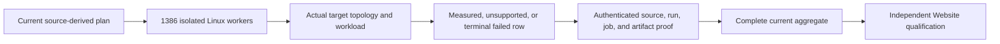

# ADR-056: Isolated Linux comparison cells and complete evidence aggregation

Status: Accepted; current source implementation and delivered-source qualification remain separate. Owner: KeyLoad lead. Original decision date: 2026-10-03; current contract: 2026-10-06. Related requirements: REQ-BC-050..058 / AC-ISO-001..009 and the current cohort and Website requirements in [BenchmarkComparisons](../Features/BenchmarkComparisons.md). Current cohort publication is governed by [ADR-076](ADR-076-current-cohort-publication.md), failure disposition by [ADR-080](ADR-080-benchmark-failure-isolation.md), and independent Website publication by [ADR-112](ADR-112-independent-website-publication.md).

## Decision

Every current benchmark worker is a separate Linux GitHub Actions runner with its own database topology, load generator and evidence. The source-derived current plan contains **1,386 worker identities**: 330 unchanged control cells, 264 scale cells, and 792 vector cells. The scale inventory uses exactly 100,000 or 1,000,000 actual records and at least 100,000 measured operations for each applicable workload. Vector profiles use the same two record counts and at least 100,000 measured queries. The control family keeps its existing workload contract. The separate 30-cell TimeSeries family is governed by ADR-059 and is not counted in these 1,386 workers.

The 11 targets are KeyLoad, PostgreSQL with pgvector, Qdrant, RabbitMQ, Redis, Neo4j, MongoDB, OpenSearch, KurrentDB, SurrealDB and HelixDB. Actual supported node counts are 1, 2 or 3. A cell proves its own native membership, copies, acknowledgement/durability behavior, resource envelope and workload result. If a target cannot provide the required native topology, its slot records an explicit unsupported disposition; independent standalone processes are never presented as a cluster.

Each worker retains its original result and native observations, bound to the exact source revision, run, attempt, job, target, profile and options. The aggregate validates the canonical plan, every required slot, artifact bytes and provider identity. It never synthesizes a metric, infers a zero, combines independent throughput or percentiles, or treats parser fixtures as measurements. A measured row must pass its caller-visible correctness, fairness, native topology, resource and provenance checks. A terminal workload failure retains the failed job and a fixed safe reason with `report: null`; explicit unsupported topology is a different disposition. Missing, skipped, canceled without a valid terminal result, duplicate, corrupt, expired, mixed-source or unauthenticated inputs fail the relevant completeness gate.

For KeyLoad comparison cells, benchmark-only RF1/RF2/RF3 selection is trusted startup configuration, never a client option. Each selection uses a fresh fixed voter set and separate storage directories. RF1 has no replica fault tolerance; RF2 needs both voters and has no single-voter-loss availability; RF3 preserves the product's existing majority, current-term read barrier, ordered apply and acknowledgement contracts. RF1/RF2 timing does not qualify those configurations for production. The normal AppHost and production server remain RF3. Native .NET SDK and official MCP SDK flows, persisted authorization, stable command outcomes, restart/quorum-loss checks and unchanged RF3 recovery proofs remain required; timing cells do not replace recovery or correctness gates.

## Acceptance and evidence ownership

The feature specification is the canonical source for the plan, profiles, per-cell oracles, evidence schemas, workflow steps, site gates and detailed test mapping. This ADR retains the stable mapping:

| Requirement | Acceptance |
|---|---|
| REQ-BC-050: Linux-only complete qualification | AC-ISO-001: every required current cell and gate executes on Linux against the exact delivered source. |
| REQ-BC-051: one isolated worker per target/topology/workload identity | AC-ISO-002: source-derived inventory and native resource ownership match the complete plan. |
| REQ-BC-052: actual native topology and honest unsupported states | AC-ISO-003: observed native membership, copies and acknowledgements match each supported cell. |
| REQ-BC-053: safe benchmark-only KeyLoad fixed membership | AC-ISO-004: invalid/changed membership rejects; SDK/MCP restart, quorum-loss and RF3 contracts remain intact. |
| REQ-BC-054: shared workload correctness and failure retention | AC-ISO-005: deterministic inputs, disjoint setup/warmup/measurement, full result oracles, attempt/failure accounting and settled operations are retained. |
| REQ-BC-055: exact worker envelope and provenance | AC-ISO-006: each original versioned worker report matches its exact target, scenario, run and native observations. |
| REQ-BC-056: complete authenticated aggregation | AC-ISO-007: all source-planned slots and original artifacts are strictly validated before aggregation. |
| REQ-BC-057: site metrics derive from validated current evidence | AC-ISO-008: the derived projection preserves source values and passes the specified site/browser/coverage gates. |
| REQ-BC-058: only fresh eligible evidence may publish metrics | AC-ISO-009: selected evidence and source remain unchanged through final freshness checks and actual provider publication. |

The current cohort contract is REQ/AC-BC-CURRENT-001..004; the independent content-only, optional-metrics, final-dispatch and Website publication contract is REQ/AC-BC-WEB-001..007. ADR-076, ADR-080 and ADR-112 own those details; this ADR does not add a second collector, executor or publication path. Current aggregate and site contracts preserve failed/null and unsupported rows while withholding metrics when evidence is incomplete or ineligible.

The following supplemental predicates remain active. The concise contracts here preserve details not fully restated in the current feature tables; BenchmarkComparisons and the named tests remain the canonical automated-evidence owners.

### Native workload and ownership

- **AC-KC-030-001..003 / AC-KO-001..005 (KurrentDB):** Native 1/2/3-member fixtures use the checked complete capacity `4096 + 5 * (256 + 10000) + 2 = 55378` and unique stream identities. Seed and readback use at most 16 original workers and one original operation per item. Every tracked deletion identity must come from an actual successful native NoStream append ACK; reserve before each append, transition to deletable only after that same operation succeeds, and never retry an uncertain append or deletion. Unknown, rejected, pending and foreign identities are never deleted. Cleanup submits the exact ACK-owned set once, at concurrency at most 16, under one 120-second delete allowance and 180-second total cleanup allowance. Success requires tracked=submitted=acknowledged=55378, faulted=pending=0, no cancellation/deadline/disposal failure, then actual readback of every tombstone and byte/ID preservation of an independently owned foreign event. Fixture setup/readback remains within its existing 900-second bound. Each topology retains all five 10,000-operation native StreamAppend repetitions and the original workload evidence. Any failed or uncertain effect stays failed even if cleanup of known ACKs succeeds. The existing cleanup timeout branch does not yet prove unconditional original-task settlement, native quorum-loss/cancellation recovery, or parent kill/reap; those fault claims remain pending until the owned process boundary is actually qualified.
- **AC-MR-031-001..005 (MongoDB):** Native 1/2/3-member admission validates every peer’s exact `(id=index, name=host)` member bijection and self identity, health=1, intended first member as writable PRIMARY, all others SECONDARY, consistent primary/member/vote/priority tuples, votes=1, priorities=2/1 (or 2/1/1), and no arbiter, hidden, delayed or non-voting shortcut. Actual voting and writable counts must equal N and each satisfy its majority. Native status/config/hello fields must agree on membership and version/term relationships. BSON integral observations retain exact native signed-Long identity; only the specified config-version fields permit validated Int32 fallback, while election term must be native Long. No lossy number/JSON/coercion path is admitted. Readiness requires two complete fresh, identical valid rounds separated by 500 ms, resetting on invalid/exception, inside one 120-second bootstrap budget. Existing direct connect/selection/socket/command bounds are 2 seconds and every stage/poll consumes remaining budget. The one-node case proves actual authenticated writable hello/ping without fabricated replica metadata. The real three-node election uses the ordinary 20-second native step-down fixture (force is permitted only in this untimed election fixture), observes the actual lower-priority writable primary and its term, then the intended primary’s automatic return and two-round admission; the whole parent stays within 300 seconds and its child readiness within 120 seconds. Original child stdout, stderr and exit are joined. Domain tests for Long extrema/values above 2^53 do not qualify native election. Uncooperative-child cancellation/kill/reap/healthy-follow-up remains pending until proven through the actual owned process.
- **AC-ISO-006L (replay diagnostics):** Preserve the fixed 13 protected configuration/sender/pool records and the existing UTF-8 line/byte budgets. Exact validated UTC-prefix and seven-space grammar is required for protected configuration/capacity records; malformed, truncated, secret-bearing or trailing data remains ordinary bounded tail or is rejected as specified. Keep only closed counters and safe categories: never record identity, payload, nonce, MAC, secret, address or exception text. Evict ordinary oldest entries before protected observations; never exceed the configured caps.

### Original operations, process ownership, and evidence

- **AC-IMAGE-006 ([ADR-034](ADR-034-cluster-comparisons.md)):** Build exact-source Linux product and load-generator images with Buildx into the job-owned loopback registry. Before allocating consumers, validate actual manifest bytes, digest headers and source-revision labels. Use the native Aspire image annotations and retain owned resource cleanup. Required server and load-generator image references fail safely when absent/invalid and never select a host-process fallback. Keep credentials and private payloads out of report metadata. Image import retains the exact image/manifest/source/output and cleanup oracles; this does not change a public database API or persisted format.
- **AC-IMAGE-LIFE-001..004 / REQ-BC-PROCESS-IDENTITY-001:** The existing 30-second HTTP/readiness lifetime owns and observes the original request through terminal body work. Abort, success, fault and invalid-bound flows retain their original result/reason/exception, real child exit, no late abort and strict PID plus captured start-time identity. Keep the original bounded cleanup and owned stdout/stderr/process-tree joins; no detached race, replacement process, or PID-only success inference. Native image import separately preserves exact manifest/image/source/output and cleanup oracles.
- **AC-HT-032-001..003 (native HTTP timer):** The original referenced lifetime timer remains owned until the original promise and post-abort callback settle, and is cleared in `finally`. Preserve the existing 30-second HTTP/readiness bounds and original outcome; do not use a detached race, retry, global keepalive or abandon original work after timeout.
- **AC-KF-034-001..003 (failure aggregation):** Preserve actual original error objects and fatal-runtime precedence through nested/aggregate failures. Deduplicate by reference; the first actual fatal captured by exception dispatch information outranks an ordinary primary, without cloning or synthesizing exceptions. Keep original failure stage/status, counters, locks, cancellation and lifecycle settlement.
- **AC-PQ-036-001..002 / AC-MP-012:** Every AppHost-owned TUnit invocation has its own named results directory so one invocation cannot overwrite another's original report. Retain every unmodified report and associated original logs, then match each to the exact source, case, summary, run, job and artifact identity. Coverage merging checks the real report set and source association; no rewritten report, synthetic count or log-count substitute is accepted. Keep workflow invocation, filters, ordering, permissions, native boundaries and publication gates intact.

These criteria do not assert that a pending cancellation, fault or native qualification has passed. Original immutable run artifacts retain their historical source and outcomes and are not active-plan fallback evidence.

Local Aspire builds and test runs are permitted development evidence only. They must use the owner-required AppHost entry point, with AppHost owning resources, readiness, execution and shutdown. Delivered-source qualification is Linux GitHub Actions at one exact source SHA with original reports and artifacts. The applicable build, format, TUnit, scalar, process-recovery, RF3 SDK/MCP, native comparison, source-closure, coverage, browser, archive, freshness and provider gates remain distinct and mandatory. A source review, resource model, partial cohort, old receipt or development run cannot substitute for its runtime gate.

## Rollout and rollback

This decision changes benchmark execution and evidence accounting, not database format or public operation contracts. Deploy producer, aggregate, Website consumer and workflow joins as one source-reviewed checkpoint. Publish metrics only from the complete eligible current cohort after all applicable gates and provider evidence pass. A source rollback restores the last qualified Website artifact and does not rewrite or relabel immutable historical measurements. Historical receipts keep their original source and settings outside the active plan; they are never fallback evidence for current metrics.

The ADR remains Accepted until the required implementation and exact-source Linux evidence are complete. The canonical feature documents and status records remain the authority for which gates have actually passed.

## Measurement scheduling and ingestion contract, 2026-10-09

Related requirements: REQ/AC-SCALE-024..028 and TASK-SCALE-MEASUREMENT-SCHEDULING-001,
TASK-SCALE-INGESTION-001, TASK-SCALE-MIXED-LOAD-001 in
[ScalingQualification](../Features/BenchmarkComparisons/ScalingQualification.md#functional-scheduling-and-ingestion-clarification-2026-10-09).
[NativeTUnitEntry](../Features/TestInfrastructure/NativeTUnitEntry.md)
REQ/AC-TUNIT-ENTRY-013/014 govern serial benchmark execution and exclusive heavy
functional selection while preserving original outcomes and joined resource cleanup; [ADR-117](ADR-117-native-tunit-ci-entry.md)
retains direct native TUnit invocation and fixture-owned Aspire lifetimes.

Independent functional tests use the ordinary 20-slot default, with a measured
increase up to 50. Measurements execute one native test/scenario at a time inside
each benchmark job. The measurement case may itself execute the declared number
of workload clients concurrently: client concurrency never represents native
TUnit scheduling. Independent benchmark jobs may execute concurrently only on
separate Linux runners with their own native topology, clients, containers,
volumes and joined cleanup. No arbitrary cross-job serialization is introduced.
Heavy functional mixed-ingestion cases execute exclusively on owned RF3 resources,
separately from ordinary cases and other heavy cases in the runner; they qualify
correctness and contribute neither timing metrics nor coverage totals.

The new ingestion contract contains a one-client baseline and separate 10-client
and 500-client cases. Each creates exactly 1,000,000 distinct total records, using
real clients, deterministic disjoint identity allocation, bounded admission,
original cancellation/drain/disposal and complete untimed independent stored-data
validation. Retain genuine SDK receipts, official MCP interoperability, persisted
authorization and RF3. Freeze actual startup/per-call/drain bounds and original
failure handling in the typed policy before implementation; no million-task
materialization, sampled final validation or unjoined shutdown is accepted.

Owner reiteration2026-10-09 requires one canonical shared scenario inventory for
all comparison databases under REQ/AC-SCALE-029. Target adapters preserve identical
datasets, seed/payload, operation schedules/counts, client concurrency, measured
boundaries and correctness oracles with equivalent effective resources and
acknowledgement/durability. Planner/aggregate joins reject missing, substituted or
incomparable cells; unsupported native capabilities remain explicitly unavailable.
The new ingestion inventory is shared across targets rather than a KeyLoad-only
performance workload. It remains unimplemented/unqualified in this checkpoint.

Implementation order and ownership are the three task rows in ScalingQualification:
root joins the native selector and existing typed execution options first;
BenchmarkComparisons owners then freeze and implement feature-local ingestion
contracts/execution/reporting with real ComparisonTests flows; DocumentStorage
integration ownership specifies and implements bounded mixed-load cases through
the existing ClusterFixture and SDK/MCP owners. Root integrates exclusive heavy
selection, coverage exclusion and isolated Linux acceptance. No new resource
harness, public API, dependency or database format is introduced.

Rollout changes scheduling only in this checkpoint. New load cases are **not
implemented or qualified**; they enter dispatch only after their selector,
report, inventory, correctness and provenance contracts are implemented and
verified together. Preserve existing c16 profiles, 100K/1M inventory, native
matrix identities and original immutable reports. Rollback of this scoped work
may remove its scheduling/doc change or unqualified future routes; it never
rewrites historical results or presents overlapping measurements as qualified.
This ADR remains Accepted and adds no successful ingestion, load or publication
evidence.
