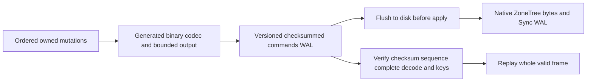

# ADR-057: Native Orleans binary atomic WAL

Status: Accepted implementation contract2026-10-03 under owner serializer direction; source implemented; exact-SHA qualification pending. Owner: KeyLoad integration lead. Related REQ-STORAGE-015..019, AC-WAL-001..005, TASK-WAL-001..005. Extends the storage format matrix of ADR-011 only for this private journal transition; no broader migration approval.

## Decision

commands.wal mutation payload uses private generated Orleans DTOs with permanent field IDs and type aliases and a cached typed serializer. Fields0/1 carry key/nullable value; mandatory field2 is Put1 or Delete2, with default0 invalid. This prevents absent version-tolerant fields from implying deletion. Validate exact kind/value pairing before apply. A direct Microsoft.Orleans.Serialization reference uses the already pinned10.3.1 version. Native ZoneTree Memory<byte> ByteArraySerializer and Sync WAL remain. No duplicate custom serializer, permissive JSON fallback or application-owned serialization loop. Serialized output is bounded by the existing configured MaxFrameBytes; exact binary length is checked before writing.

Journal header layout stays52bytes with SHA256, payload length and sequence; journal magic advances from1 to2. Store identity advances to3 so the old binary's identity validator refuses writes. Checkpoint format2, raw record keys/values, replication log, authority/incarnation and ACK ordering stay. Decode and validate complete payload/records before any frame apply; errors are sanitized Corruption. Current binary torn-tail, poisoned unknown-outcome and durable-flush behavior stays. Every full legacy52-byte frame header is refused even if its payload is torn; only shorter-than-header tail bytes retain truncation for the offline transition.

## Upgrade and rollback matrix

|Source|Target|Contract|
|---|---|---|
|New empty directory|Identity3 plus frame2|Create current binary store|
|Identity1/2 empty journal or complete verified checkpoint2 only|Identity3 plus frame2|Offline stop all RF3 writers, verify backup, recover existing checkpoint, atomically publish identity3 before accepting writes|
|Identity1/2 with any full JSON frame1 header, including a torn payload|None|FormatUnsupported with old-binary Compact guidance, authoritative journal unchanged; no runtime compatibility reader|
|Identity3 with checkpoint2 plus frame2|Same|Normal recovery/Compact/InstallSnapshot/native backup/restore; never lower identity to2|
|Unknown magic/identity or malformed complete binary|None|Fail closed; no reinterpretation/reset|
|Identity3 after first frame2 write|Old executable|Unsupported; use compatible binary or restore complete verified pre-upgrade backup with explicit operational data-loss decision|

Before rollout use the old binary to Compact every stopped node's journal, verify backups and checkpoints, then deploy identical new binaries to all RF3 members before serving traffic. There is no mixed-version rolling write contract. No direct production/database access is requested or authorized. Upgrade tests use owned local fixtures executed in GitHub.

## Implementation and join contract

1. Lead freezes requirements/acceptance and keeps shared docs/dependencies/existing-file edits.
2. Codec worker owns new StorageRecovery DTO/codec/bounded-writer files; regression worker owns StorageRecovery unit tests. Writes are disjoint, lead integrates aliases/package reference.
3. Lead switches PreparePayload/recovery, replaces JSON stage estimates with binary-safe accounting, preserves cache/reset/rejected-stage invariants, sets new journal magic and identity guard, promotes only recovered legacy checkpoint/empty state, and preserves identity3 in CheckpointGeneration.
4. Lead verifies restore returns current identity, old executables fail before writes, and no corrupt frame is partially accepted. Existing SDK/MCP contracts remain.
5. Qualify build/analyzers/format/governance and real TUnit unit/process/RF3 exact-SHA GitHub gates. Keep ADR Accepted until all required source/tests/docs/evidence exists. Measured speed, power-loss and endurance remain separate unproven gates.

Canonical slice: src/KeyLoad.Storage.ZoneTree/Features/StorageRecovery and tests/KeyLoad.UnitTests/Features/StorageRecovery; existing real RecoveryTests and RF3 integration suites are mandatory. Frontend/client API:N/A, private durable payload only. No authored public model change. The working task graph and test mapping are in the root WAL plan/acceptance.
