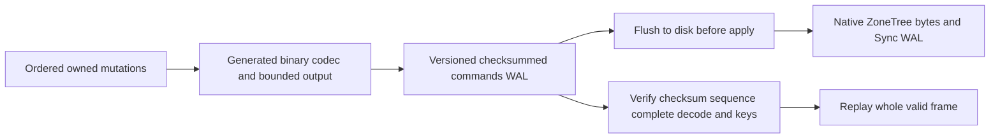

# ADR-057: Native Orleans binary atomic WAL

Status: Accepted implementation contract2026-10-03 under owner serializer direction; source implemented; mandatory exact-SHA unit/process/RF3 gates qualified at cf630751e0f24e4d8183e55510add9c7207e377f. Independent migration/resource and performance evidence remains open. Owner: KeyLoad integration lead. Related REQ-STORAGE-015..019, AC-WAL-001..005, TASK-WAL-001..005. Extends the storage format matrix of ADR-011 only for this private journal transition; no broader migration approval.

## Decision

commands.wal mutation payload uses private generated Orleans DTOs with permanent field IDs and type aliases and a cached typed serializer. Fields0/1 carry key/nullable value; mandatory field2 is Put1 or Delete2, with default0 invalid. This prevents absent version-tolerant fields from implying deletion. Validate exact kind/value pairing before apply. A closed native IFieldCodec<ReadOnlyMemory<byte>> registration to ReadOnlyMemoryOfByteCodec avoids generic per-byte serialization for nullable values. A direct Microsoft.Orleans.Serialization reference uses the already pinned10.3.1 version. Native ZoneTree Memory<byte> ByteArraySerializer and Sync WAL remain. No duplicate custom serializer, permissive JSON fallback or application-owned serialization loop. Serialized output is bounded by the existing configured MaxFrameBytes; exact binary length is checked before writing.

Journal header layout stays52bytes with SHA256, payload length and sequence; journal magic advances from legacy1/2 to current3. Store identity advances to4 so the old binary's identity validator refuses writes. Checkpoint format2, raw record keys/values, replication log, authority/incarnation and ACK ordering stay. Decode and validate complete payload/records before any frame apply; errors are sanitized Corruption. Current binary torn-tail, poisoned unknown-outcome and durable-flush behavior stays. Every full legacy frame1/2 52-byte frame header is refused even if its payload is torn; only shorter-than-header tail bytes retain truncation for the offline transition.

## Upgrade and rollback matrix

|Source|Target|Contract|
|---|---|---|
|New empty directory|Identity4 plus frame3|Create current binary store|
|Identity1/2/3 empty journal or complete verified checkpoint2 only|Identity4 plus frame3|Offline stop all RF3 writers, verify backup, recover existing checkpoint, atomically publish identity4 before accepting writes|
|Identity1/2/3 with any full JSON frame1 or generic binary frame2 header, including a torn payload|None|FormatUnsupported with old-binary Compact guidance, authoritative journal unchanged; no runtime compatibility reader|
|Identity4 with checkpoint2 plus frame3|Same|Normal recovery/Compact/InstallSnapshot/native backup/restore; never lower identity to2|
|Unknown magic/identity or malformed complete binary|None|Fail closed; no reinterpretation/reset|
|Identity4 after first frame3 write|Old executable|Unsupported; use compatible binary or restore complete verified pre-upgrade backup with explicit operational data-loss decision|

Before rollout use the old binary to Compact every stopped node's journal, verify backups and checkpoints, then deploy identical new binaries to all RF3 members before serving traffic. There is no mixed-version rolling write contract. No direct production/database access is requested or authorized. Upgrade tests use owned local fixtures executed in GitHub.

## Implementation and join contract

1. Lead freezes requirements/acceptance and keeps shared docs/dependencies/existing-file edits.
2. Codec worker owns new StorageRecovery DTO/codec/bounded-writer files; regression worker owns StorageRecovery unit tests. Writes are disjoint, lead integrates aliases/package reference.
3. Lead switches PreparePayload/recovery, replaces JSON stage estimates with binary-safe accounting, preserves cache/reset/rejected-stage invariants, sets new journal magic and identity guard, promotes only recovered legacy checkpoint/empty state, and preserves identity4 in CheckpointGeneration.
4. Lead verifies restore returns current identity, old executables fail before writes, and no corrupt frame is partially accepted. Existing SDK/MCP contracts remain.
5. Qualify build/analyzers/format/governance and real TUnit unit/process/RF3 exact-SHA GitHub gates. Keep ADR Accepted until all required source/tests/docs/evidence exists. Measured speed, power-loss and endurance remain separate unproven gates.

Canonical slice: src/KeyLoad.Storage.ZoneTree/Features/StorageRecovery and tests/KeyLoad.UnitTests/Features/StorageRecovery; existing real RecoveryTests and RF3 integration suites are mandatory. Frontend/client API:N/A, private durable payload only. No authored public model change. The working task graph and test mapping are in the root WAL plan/acceptance.

## Preserving recovery successor refinement

REQ-STORAGE-017 / AC-WAL-003 also rejects an overflowing successor before decode,
apply, truncation or identity promotion. A verified checkpoint at long.MaxValue
remains a valid terminal cut; MaxValue-1 followed by frame MaxValue remains valid.
The header predicate short-circuits at terminal position before `position + 1`,
returning the existing sanitized Corruption. OrleansWalSuccessorTests constructs
and fully verifies real checkpoint bytes, uses the official generated frame
fixture, checks whole recovered values and authoritative-byte preservation,
probes released handles, and reopens the same failed-attempt derived tree after
removing only the corrupt tail to detect premature apply. TASK-WAL-SUCCESSOR-
TEST/JOIN-R15 in this ADR's implementation contract trace those cases
to exact-SHA GitHub gates.
This preserving reader fix introduces no format, ACK or serializer change.

Independent source review identified remaining decoded-memory/work admission,
fixed legacy/binary compatibility fixtures and complete-envelope/torn-header
proof gaps. They remain open and do not gain qualification from this sequence
guard or a development build. The ADR remains Accepted until its full original
unit/process/RF3 and migration/resource evidence exists.

## Native codec refinement from exact-source CI

Run37077856823 at6ad4741a7 disproved the authored1024-byte size assertion and overflow-rejection protocol fixture. Orleans10.3.1 NullableCodec's generic codec resolution uses ReadOnlyMemoryCodec<byte> with per-byte tagged fields. Accept the framework's closed native IFieldCodec<ReadOnlyMemory<byte>> → ReadOnlyMemoryOfByteCodec registration, with no custom wire codec. Nullable nonnull values then use native length-prefixed raw bytes. The original size/4096-byte assertions remain unchanged and pass in the native qualification below.

That inner wire encoding is incompatible with the first unqualified frame2/identity3 source. The final contract supersedes frame2/identity3 references above with frame3/identity4, rejects all complete legacy frame1/2 headers including torn payloads, and permits offline verified checkpoint-only/empty identities1/2/3 to promote4. Both old writer generations refuse identity4 before writes. Aliases, fields0/1/2, explicit kinds, checkpoint2, raw tree bytes, flush order and authority remain. Use the previous binary matching each legacy journal to Compact while all RF3 writers are stopped; verify its backup, then upgrade all nodes. No JSON or binary fallback decoder.

## Current mandatory-gate evidence

The [native receipt](../implementation/atomic-wal-qualification-37084177131.json) joins authenticated run37084177131, exact source cf630751e0f24e4d8183e55510add9c7207e377f, original ZIP digests and terminal successful jobs. Full Release restore/build, formatter/governance and118 analyzer cases pass; units1407/1407 in normal and scalar modes, recovery136/136 and genuine RF3 SDK/MCP63/63 pass with no skips. All66 WAL cases pass in each mode; their19 source methods and native expanded signatures match the earlier independently joined c10c source, with this storage/test slice unchanged. All1000 real process-kill receipts retain atomic cuts and values at every observed cut at or after journal flush.

This qualifies the specified mandatory WAL gates. The overall workflow still runs the separate isolated comparative cohort at receipt capture; it is not a full green workflow or an acceleration result. ADR status stays Accepted while numeric coverage, decoded-memory/work amplification, independent matching old-executable upgrade/rollback and remaining malformed-envelope/header proof are open. Process-kill recovery does not establish power-loss durability, endurance or production readiness.
