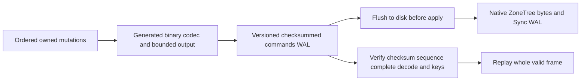

# ADR-057: Native Orleans binary atomic WAL

Status: Accepted; the native serializer source stage and its mandatory unit/process/RF3 gates were qualified at exact SHA cf630751e0f24e4d8183e55510add9c7207e377f. The current persisted format and current-source qualification are governed by [StorageRecovery CurrentFormat](../Features/StorageRecovery/CurrentFormat.md). Owner: KeyLoad integration lead. Related REQ-STORAGE-015..019, AC-WAL-001..005, TASK-WAL-001..005.

## Decision

commands.wal mutation payload uses private generated Orleans DTOs with permanent field IDs and type aliases and a cached typed serializer. Fields0/1 carry key/nullable value; mandatory field2 is Put1 or Delete2, with default0 invalid. This prevents a missing field from implying deletion. Validate exact kind/value pairing before apply. A closed native IFieldCodec<ReadOnlyMemory<byte>> registration to ReadOnlyMemoryOfByteCodec avoids generic per-byte serialization for nullable values. A direct Microsoft.Orleans.Serialization reference uses the centrally pinned version. Native ZoneTree Memory<byte> ByteArraySerializer and Sync WAL remain. No duplicate custom serializer, permissive JSON fallback or application-owned serialization loop. Serialized output is bounded by the existing configured MaxFrameBytes; exact binary length is checked before writing.

Use only the current WAL, identity and checkpoint contracts recorded in CurrentFormat. Generated Orleans DTOs, permanent field IDs/type aliases, explicit operation kinds, complete payload validation, sanitized corruption errors, durable flush ordering, poisoned unknown outcomes and node-local ZoneTree byte storage remain mandatory. Unsupported identity/checkpoint/WAL values and corrupt complete frames fail closed before state publication. Current torn-tail handling follows the current reader contract; this ADR defines no alternate-format path.

## Current-format admission and rollback

Fresh stores use the current identity, WAL and checkpoint contracts. Valid current
identity and complete frames recover through the current reader. Unknown versions,
malformed headers, invalid checksums or corrupt complete frames fail closed before
state publication or mutation. Rollback preserves the current stored format and
requires a source release that can validate it; no conversion or alternate reader
is defined here.

## Implementation and join contract

1. Lead freezes requirements/acceptance and keeps shared docs/dependencies/existing-file edits.
2. Codec worker owns new StorageRecovery DTO/codec/bounded-writer files; regression worker owns StorageRecovery unit tests. Writes are disjoint, lead integrates aliases/package reference.
3. Lead integrates PreparePayload/recovery with the current identity, WAL and checkpoint contracts; preserves cache/reset/rejected-stage invariants and binary-safe accounting; validates current state before publication; and keeps checkpoint generations aligned with the current identity.
4. Lead verifies restore returns the current identity and no corrupt frame is partially accepted. Existing SDK/MCP contracts remain.
5. Qualify build/analyzers/format/governance and real TUnit unit/process/RF3 exact-SHA GitHub gates. Keep ADR Accepted until all required source/tests/docs/evidence exists. Measured speed, power-loss and endurance remain separate unproven gates.

Canonical slice: src/KeyLoad.Storage.ZoneTree/Features/StorageRecovery and tests/KeyLoad.UnitTests/Features/StorageRecovery; existing real RecoveryTests and RF3 integration suites are mandatory. Frontend/client API:N/A, private durable payload only. No authored public model change. The working task graph and test mapping are in the root WAL plan/acceptance.

## Preserving recovery successor refinement

REQ-STORAGE-017 / AC-WAL-003 also rejects an overflowing successor before decode, apply or truncation. A verified checkpoint at long.MaxValue
remains a valid terminal cut; MaxValue-1 followed by frame MaxValue remains valid.
The header predicate short-circuits at terminal position before `position + 1`,
returning the existing sanitized Corruption. OrleansWalSuccessorTests constructs
and fully verifies real checkpoint bytes, uses the official generated frame
fixture, checks whole recovered values and authoritative-byte preservation,
probes released handles, and reopens the same failed-attempt derived tree after
removing only the corrupt tail to detect premature apply. TASK-WAL-SUCCESSOR-
TEST/JOIN-R15 in this ADR's implementation contract trace those cases
to exact-SHA GitHub gates.
This preserving reader fix introduces no format, ACK or serializer change.

Independent source review identified remaining decoded-memory/work admission and
complete-envelope/current-header proof gaps. They remain open and do not gain
qualification from this sequence guard or a development build. The ADR remains Accepted until its full original
unit/process/RF3 and current resource evidence exists.

## Native codec refinement from exact-source CI

Run37077856823 at6ad4741a7 disproved the authored1024-byte size assertion and overflow-rejection protocol fixture. centrally pinned Orleans NullableCodec's generic codec resolution uses ReadOnlyMemoryCodec<byte> with per-byte tagged fields. Accept the framework's closed native IFieldCodec<ReadOnlyMemory<byte>> → ReadOnlyMemoryOfByteCodec registration, with no custom wire codec. Nullable nonnull values then use native length-prefixed raw bytes. The original size/4096-byte assertions remain unchanged and passed in that native qualification. The current generated Orleans codec uses the accepted closed native memory codec; no custom JSON or alternate-format decoder is supported. The active identity/WAL/checkpoint values and exact bytes remain those frozen in CurrentFormat.

## Current mandatory-gate evidence

The native receipt (report removed from repository) joins authenticated run37084177131, exact source cf630751e0f24e4d8183e55510add9c7207e377f, original ZIP digests and terminal successful jobs. Full Release restore/build, formatter/governance and118 analyzer cases pass; units1407/1407 in normal and scalar modes, recovery136/136 and genuine RF3 SDK/MCP63/63 pass with no skips. All66 WAL cases pass in each mode; their19 source methods and native expanded signatures match the earlier independently joined c10c source, with this storage/test slice unchanged. All1000 real process-kill receipts retain atomic cuts and values at every observed cut at or after journal flush.

This qualifies the specified WAL gates at that exact source SHA. The overall workflow still ran the separate isolated comparative cohort at receipt capture; it was not a full green workflow or an acceleration result. ADR status stays Accepted while numeric coverage, decoded-memory/work amplification and remaining malformed-envelope/current-header proof are open. Process-kill recovery does not establish power-loss durability, endurance or production readiness.
