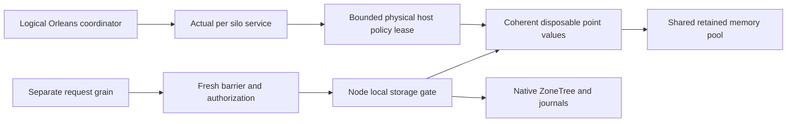
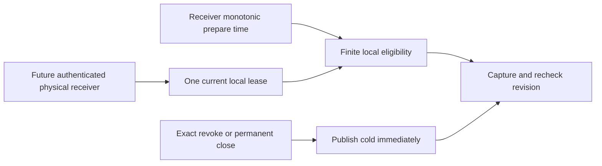

# ADR-058: Orleans-coordinated disposable cache memory

Status: Accepted, staged implementation contract; no runtime/performance claim.
Related requirements: REQ-CACHE-001..007 / AC-CACHE-001..012 in
[ResourceExecution](../Features/ResourceExecution.md), REQ-MP-002/005,
AC-MP-002/011/012 and [ResourceExecution](../Features/ResourceExecution.md).

## Decision and boundaries

Use one node-local modeled retained-byte/entry pool for disposable cache families.
Native ZoneTree and its Sync WAL plus atomic/replication journals remain the data
authority. Start with a positive-value point cache, preserving the original gate,
private key/value ownership, exact-key Apply invalidation, snapshot generation
fencing, observer order and fresh authorization. Pins and in-flight fills remain
charged until their owned bytes are no longer held. Index capacity has a distinct
reservation; eviction/admission work is bounded and may bypass acceleration.

Orleans logical policy/coordinator grains and direct per-silo services must bind
actual host/store IDs and runtime generation through authenticated bounded
messages. Cluster acceleration stays disabled until its exact local policy and
lease are accepted. Storage ownership never moves with an activation. Hot reads
are local; asynchronous discovery/control work never runs under storage gates.
No complete private StoreIdentity, credentials or payloads enter remote metadata.

This common infrastructure uses the ResourceExecution slice across Abstractions,
Core, Storage.ZoneTree, Orleans, Server and tests. Domain operations keep their
existing feature owners. No public HTTP/SDK/MCP cache administration or UI is added
by the initial stage. Existing caller-visible operations prove unchanged behavior.

## Ordered implementation contract

1. Lead freezes scope, acceptance, test strategy, shared modeled-memory contracts
   and task graph; historical native baseline and current queued full-SHA run are
   kept distinct. Lead alone owns shared contracts, config, DI, docs and CI joins.
2. TASK-CACHE-MEMORY-R26 owns only the real Core ResourceExecution budget/lease and
   new acceptance-led TUnit files. Shared interface validates positive modeled
   bytes, nonnegative entries; exact capacity succeeds, overflow/full fails without
   accounting changes; release is idempotent, close retains outstanding charges.
3. Before provider writes, lead joins independent R24 critique and freezes exact
   key/value/index/pin/fill limits, invalidation/snapshot/poison ordering and bypass
   behavior. Provider tests use real ZoneTree/files/callbacks, no fake provider.
4. Before Orleans writes, lead freezes exact HMAC domain/version/message bounds,
   nonce/expiry/generation and physical-ID handshake, fixed-voter bounded fanout,
   coalescing/backpressure, lifecycle/drain and authenticated policy acceptance.
   No implementation may fill these decisions with a caller-supplied trusted ID.
5. Join actual RF3 SDK/MCP authorization/restart/migration tests, closed metrics and
   repeated cache-on/off cold/warm/mixed profiles. Quantify native resources before
   advertising speed, scalability or RAM bounds. Complete required source/native
   gates and actual compatible coverage before marking this ADR Implemented.

Dependencies and joins: no new package; Abstractions interfaces avoid a Storage to
Core dependency cycle. Core pool is node-owned and shared by actual stores/cache
families, not allocated per request/grain. The provider stage is approved under
its explicit contract below; coordinator implementation is not approved until
its separate exact contract is joined. Agent roles,
exact first write paths, tests and escalation conditions are recorded below.
Local acceptance/plan scaffolds remain ignored under the owner's Git policy.
Any architecture/security expansion stops
for lead contract refinement; no worker changes shared wire/config/governance.

Verification is GitHub Actions only. First budget stage has real public capacity,
overflow, index, concurrent/disposal tests. Later stages have exact native
key/overlay/snapshot/pin and forged/expired/stale/partial-control tests. The full
normal/scalar/recovery/RF3 and matched resources retain source/run/job/native ZIP
provenance; missing coverage or measurements stay open.

## Rollout, migration and rollback

No persisted-format or ACK migration. Model budget defaults64MiB/4096 entries,
bounded configurable ceilings up to1GiB/65536 entries, are source admission
settings rather than measured performance/RSS acceptance values. Pool disposal
closes new admission and retains existing reservation charges until their owner
returns them. Cluster cache is initially cold and gated by validated control
leases. Expiry/failure/deactivation causes bypass, never stale access or data loss.
Rollback disables admission, drains readers/fills, releases ephemeral entries and
removes acceleration joins together; native records/journals remain unchanged.

Unresolved qualification: actual provider duplication benefit, cross-cache memory
mix, decoded/runtime/native memory, auth/migration/fault cases, whole-process RSS,
numeric coverage, repeated throughput/latency and endurance. No current source
build or architecture choice resolves those gates.

## Accepted provider stage (R28)

The R24 independent critique is joined. Only explicit embedded opt-in is enabled
in this stage; RF3 server composition remains cold until the authenticated control
stage is frozen and delivered. One externally owned pool is shared by opted-in
stores. No pool is constructed per store, model, grain or database engine.

- Options default to1024 charged entries,16MiB modeled bytes,4096 encoded-key
  bytes,64KiB logical-value bytes and1024 pins per entry. Hard maxima are4096
  entries,256MiB,16384 key bytes,1MiB values and4096 pins. Empty positive values
  are eligible; absent/deleted keys have no entries. Invalid options reject before
  opening files. These are source admission limits, not measured RSS/speed budgets.
- Reserve a fixed modeled index charge1024+64*MaxEntries before constructing a
  Dictionary preallocated for MaxEntries, using complete byte content equality and
  HashCode.AddBytes process-randomized hashing. Never grow beyond that live count.
  Keep the index charge across Clear/Disable until the index is actually detached.
  One entry/candidate charges320 bytes of modeled metadata plus each key/value
  length rounded up to8bytes, before copying any owned candidate array. Index and
  all live/retired-pinned/in-flight entries count in both owner and shared limits.
  The metadata allowance includes the overlapping entry, fill candidate, LRU node,
  reservation and array headers during publication; it is a recorded model rather
  than an independently measured managed-heap or RSS limit.
- On an eligible miss, native lookup runs first with no user callback. Before
  the observer, reserve and copy the exact lookup key; the observer then charges
  existing logical bytes. Only after it succeeds may a value copy be published.
  A callback mutating its captured input key cannot change the entry binding.
  Duplicate/failed/disabled-generation candidates release exactly once. Pins are
  existing-entry counters, with no per-hit heap lease; callbacks run outside cache
  and budget locks and every pin/candidate unwinds in finally.
- StoreGate -> CacheGate -> budget gate is the only nested order. No callback,
  network, file I/O, reverse-order acquisition or cross-store eviction occurs in
  cache/budget locks. Each preparation attempts at most16 local LRU victims total,
  including pinned victims which retire but remain charged. Full, oversized,
  disabled, pin-limited or unavailable-index reads use the original native path.
- Root joins invalidate-before-mutation at every Runtime.Apply and Clear before
  replacement Prepare, including snapshot keys absent from the new image. Cache
  identity is one physical runtime and ReadGeneration. Pure same-cut compaction
  and export retain entries. Startup recovery does not warm; failed-open/dispose
  releases ephemeral ownership even if native cleanup throws. Known poison and
  disposal checks always precede access. Unexpected invalidation errors poison the
  store before a later read; pressure is never a catch-all for provider errors.
- All raw positive encoded namespaces are eligible, including principal, API-key,
  catalog/schema, watermarks and persisted StoredOutcome record bytes. Existing
  current-time authorization, replay fingerprint/incarnation/policy validation,
  fresh quorum barriers and response projections remain mandatory. No grant,
  OperationResult, authorized response object or negative lookup is retained.
- Closed diagnostics distinguish hit/miss/read bypass/native lookup/native miss,
  admission bypass/admission/eviction/attempt and modeled ownership. Logical read
  counters/observer charges are unchanged. No metric includes keys, secrets or
  payloads, and no native lookup count is labeled as disk I/O.

| Task | Criteria | Owner and exact write scope | Join and required verification |
|---|---|---|---|
| TASK-CACHE-MEMORY-R26 | AC001/002 | Luna; only Core budget/reservation and new public-budget TUnit tests | Root reviewed; combined source/native qualification pending |
| TASK-CACHE-CI-BASELINE-R27 | AC010 | Independent reviewer; authenticated logs/artifacts, private TXT only |63ac run37082449440 failed two website style diagnostics; normal/scalar/recovery/comparisons skipped; fix shapes reviewed in current source |
| TASK-CACHE-PROVIDER-R28 | AC003..006 | Luna; only new Storage.ZoneTree/Features/ResourceExecution private cache helpers, excluding the two root-owned public option/snapshot contracts | Shared root contracts above; no local tests/build/Git; root reviews every diff |
| TASK-CACHE-PROVIDER-TESTS-R28 | AC003..006/008 | Luna; only new UnitTests/Features/ResourceExecution/ZoneTreePointCache*Tests.cs and bounded real-file test helpers | Real ZoneTree, actual synchronization and caller outcomes; no doubles or local qualification |
| TASK-CACHE-INTEGRATION-R28 | AC003..006/010 | Root; existing provider facade/read/runtime/snapshot joins, shared contracts, docs and final delivery | Complete Release source build/format/governance, exact-SHA Linux native unit/scalar/recovery/RF3 |
| TASK-CACHE-REVIEW-R35 | AC001..006/008/010 | Independent high-capability reviewer; read-only provider/pool/join/test inspection, private TXT evidence only | Root joins every finding before delivery; source review cannot replace GitHub qualification |
| TASK-CACHE-TEST-ORACLES-R36 | AC003/005 | Luna; only ReadTests and CoherenceTests plus a new ZoneTreePointCacheDeletionTests.cs in the same UnitTests slice | R35 F1/F2 require mutation of a warm returned array, actual warm-key overlays and committed delete/reinsert; no production or shared contract change |

The lead must join both bounded workers and full-current-source checks before
ordinary main delivery. Orleans lease/controller writes and numerical performance
claims remain outside this approved provider stage. Refinement of the frozen
helpers or public contract must return to the lead rather than be invented by a
worker. Rollback removes only optional acceleration and leaves journals/ACK intact.

## Accepted local permit stage (R47)

Root approves only the local eligibility primitive needed by AC-CACHE-007/008.
This does not approve any Orleans message, enable server caches or replace the
separate signed-protocol freeze. Abstractions owns `ICacheReadPermit` with
`TryCapture(out long revision)` and `IsCurrent(long revision)`, plus immutable
`CacheReadPermitAcceptance(Revision, PreviousRevision, Continuous)` and fixed
prepare10s/lease15s ceilings. These are local capabilities, never wire DTOs,
persisted grants or read/authorization authority.

Core owns `CacheReadPermit(TimeProvider clock)`. It starts cold, keeps one
immutable volatile lease and one last accepted positive sequence, and implements
`TryAccept(Guid grantId, long sequence, long preparedTimestamp, out acceptance)`.
The trusted receiver must already have authenticated the exact current physical
binding/policy and complete RF3 certificate. The primitive independently rejects
empty IDs, nonpositive/repeated/decreasing sequences, closed state, negative
elapsed time and prepare age >=10s without changing accepted state. A valid
acceptance consumes its sequence; eligibility ends at receiver prepare age >=15s,
including when no control loop runs. It never adds15s at grant receipt. Renewal
returns continuity only if the previous local lease is still eligible at the
acceptance point. Captured revisions from an earlier acceptance never validate
under a later acceptance.
The receipt's PreviousRevision is the last accepted sequence even after an
explicit withdrawal; it is zero only before the first acceptance. Continuous
is independently false when the previous current lease is absent or expired.

`TryWithdraw(Guid grantId, long revision)` matches the exact current grant and
revision, publishes cold state first and returns false for stale withdrawal;
`Dispose` permanently closes acceptance and publishes cold without waiting for
readers. No method invokes provider callbacks, storage gates, networking, timers,
HMAC work or authorization under its small writer lock. Hot checks read one
immutable state and receiver monotonic time without locks or heap allocation.
Clock arithmetic anomalies fail cold. Sequence exhaustion cannot wrap: accepting
the final Int64 sequence permits no later acceptance; the future receiver must
stop generating prepares rather than reset a live physical owner.

Ordered stages: root writes these exact shared interfaces; Luna writes
acceptance-led tests first, then only new Core ResourceExecution
`CacheReadPermit.cs` and, if necessary, `CacheReadPermitState.cs`; tests own only
new UnitTests ResourceExecution `CacheReadPermit*Tests.cs` and optional one real
clock helper. Prove cold/accept/reject/sequence/old-revision/exact-withdraw/closed/
concurrent behavior and actual elapsed expiry using `TimeProvider.System` and
bounded real synchronization. No fake clock, provider/control doubles, reflection,
local test execution, package/config/Git/CI/shared-doc edits or invented API is
authorized. Root reviews every diff and combined enabled source gates. Exact-SHA
GitHub normal/scalar tests qualify only this primitive; native RF3 signed-control,
provider integration, coverage and matched resource profiles remain open.

## Accepted local provider binding stage (R69)

Root joins the complete R56 and R61 independent critiques and approves only this local stage. R61 final report SHA-256: `e8575b3eab1572aef7a5c7e98a757cfe98852b5e6c04d82943eb0c0a1efb2fc0`. The original injected-control draft is superseded by this exact factory contract. Signed Orleans receiver, production RF3 composition and native qualification remain open.

Accepted R69 local provider binding stage; signed Orleans protocol remains a separate contract.
Related: REQ-CACHE-002/003/004/007, AC-CACHE-003..008/010 and AC-CACHE-011/012.

Public local capability contract (root-owned)
- Extend ICacheReadPermit with bool IsCurrentAcceptance(CacheReadPermitAcceptance acceptance).
  Core Lease owns the complete accepted immutable receipt; validate all fields and the existing 15-second
  prepare-origin lease eligibility. The 10-second prepare ceiling applies only at initial acceptance.
  A forged Continuous/PreviousRevision with the correct current Revision is rejected. No wire/auth role.
- Enum ZoneTreePointCacheControlResult: Created, Applied, AlreadyApplied, AlreadyConfigured,
  Busy, Rejected, Unavailable, Closed. Created is factory success; Applied/AlreadyApplied are bind success.
- ZoneTreeStore.TryCreateCoordinatedPointCache(options, fixedPermit, out control) returns that enum.
  Validate null/options; out is nonnull only for Created. No public control constructor or IDisposable.
- ZoneTreePointCacheControl has fresh local Guid RuntimeId, TryApply(receipt), Retire(withdrawnRevision),
  CloseAdmission(), GetDiagnostics(). This Guid is not silo readiness or a remotely trusted identity.
  It holds one actual runtime, immutable options and externally-owned permit/pool. Manual Disable is permanent Close.
  GetDiagnostics returns the existing ZoneTreePointCacheSnapshot, with exactly its current member names;
  ZoneTreeStore.GetPointCacheDiagnostics observes the same effective owner snapshot.
- Factory result subset: Created/AlreadyConfigured/Busy/Closed. Apply subset:
  Applied/AlreadyApplied/Busy/Rejected/Unavailable/Closed. Exceptions remain exceptions as specified below.
  Retire returns true only when it publishes a new retired binding; repeated/already-retired calls return false.

Factory/store lifecycle
- Only successfully opened stores can create control. Metadata-only control creation allocates no index.
- Detect current-thread read/write ownership and return Busy; otherwise acquire real StoreWrite with timeout zero.
  Zero wait describes only acquiring StoreWrite, not allocation/transition/cache/budget work afterwards.
- Factory publication and pre-drain Dispose closing share one small runtime lifecycle gate.
  Under it: reject embedded cache/another control, reject closing, publish exactly one control.
  Dispose atomically marks closing and captures installed control there; release lifecycle gate, CloseAdmission,
  then acquire StoreWrite/drain and close physical handles. Never acquire StoreGate from lifecycle gate.
- Guard gate-disposal race with closing precheck and narrowly catch ObjectDisposedException for Closed outcome.
  RecoveryRequired/other native failures are not converted to Busy/pressure. Store Check is still mandatory.
- Existing embedded API and baseline are preserved. Existing cache maintenance resolves the one current helper,
  including a cold/retired helper; Apply invalidates and snapshot replacement clears under actual StoreWrite.

Binding and publication
- Immutable binding carries exact receipt, helper and retired flag. Volatile reference is the admission epoch.
  A small transition gate serializes binding/final publish and permanent close/retire publication.
- TryApply gets actual StoreWrite zero-wait. Recheck closing/exact receipt at transitions and final publication.
  For exact same eligible bound receipt+enabled helper return AlreadyApplied. Same receipt with unavailable
  helper may retry once per explicit call; never reenable a terminal disabled helper.
  A still-current receipt with a non-ready/disabled helper may cold-replace it with a NEW helper after
  actual old-helper disposal; no existing disabled helper or permanently closed control is reopened.
- Continuous reuse requires exact old nonretired binding Revision == receipt.PreviousRevision,
  authentic Continuous=true, exact current acceptance and enabled helper. Publish a new binding reference
  retaining helper/entries/counters. Skipped predecessor, expiry, withdrawal or retired helper requires cold replacement.
- Cold replacement publishes detached/retired admission first, then disposes old helper under StoreWrite
  BEFORE reserving any new index, so a pool fitting one index can progress. New helper construction occurs
  outside transition gate but still under StoreWrite. Final publish rechecks exact prior state/open/receipt.
  Dispose a losing candidate; unexpected construction failures remain visible and admission stays cold.
  Final-check classification: Closed for permanent close, Rejected for ineligible/altered receipt,
  Busy for a changed base binding while the same receipt remains eligible (bounded later retry).
- Unavailable means valid receipt but real budget could not reserve index. Keep configured-cold state for
  explicit later same-receipt retry. No timer/task/background retry or per-read helper construction.
- Retire(actualWithdrawnRevision) requires positive revision, bound Revision <= withdrawn revision and
  binding's exact receipt no longer eligible. It publishes retired admission under transition gate, then
  disables captured old helper outside it. Never disable a newer binding/helper via a delayed old revoke.
- CloseAdmission permanently publishes closed+retired before disabling captured helper, without StoreGate wait.
  Actual disposal under StoreWrite detaches/releases helper/index after all scoped reads/fills have drained.
  A failure in admission-close cannot skip the original native-handle/helper drain; collect its failure and
  independently attempt both cleanup owners, retaining primary and independent cleanup failures.
  Collect physical gate exit/disposal failures independently as well; waiting gate users may cause actual
  gate disposal to fail, and that cannot mask already-collected admission/native/helper errors.
- Passive expiry rejects admission immediately when checked. It may retain helper/index charges until an
  explicit transition/drain; no expiry timer, immediate release or process-RSS ceiling is claimed.

Read integration (root-owned)
- Value-only read admission holds captured binding/cache/state refs; no per-hit allocation.
- Check exact current binding+complete accepted receipt before optional pin and recheck AFTER pin, before
  logical counter/observer/copy/reader. If rejected, unpin and perform the one original native lookup.
- A read admitted before renewal/revoke/close may finish its already-scoped callback. It never authorizes access.
- Native point lookup and logical counters/observer occur exactly once. Prepare freezes the key before observer.
  Only eligible captured binding prepares; after observer, PublishIfCurrent holds transition gate and validates
  exact binding+receipt/open before helper.Publish. Revocation in observer drops fill, never repeats lookup/charges.
- StoreGate -> transition gate -> cache gate -> pool is the only permitted nested order. Transition->Store forbidden.
  No callbacks/network/native file I/O under cache/pool/transition/lifecycle gates; native gate stays authoritative.

Diagnostics
- Configured cold control is distinguishable from no opt-in. Enabled includes effective binding/permit eligibility.
  Closed means permanent control closure; charges and active pins remain visible until actual release.
- Counters belong to the currently bound/last disposed helper and reset on cold replacement; continuous reuse
  retains them. Hits count successful pins, including a pin later rejected by admission recheck, not served reads.
  Provider read counters retain cumulative logical read work (hits and native reads) across replacements;
  current-helper NativeLookups has no-helper gaps and resets, so it is not a store-lifetime native-attempt count.
  Pool counts actual ownership. An old still-current permit may be bound locally after reopening; this seam does
  not certify physical readiness. Future receiver composition must create/bind a fresh physical permit lifecycle.
- No private identity, keys/payloads, wire endpoint, server enablement, RSS/performance/coverage assertion.

Acceptance-led genuine tests
AC-CACHE-012: exact receipt fields, cold/old/default/forged/withdrawn/closed and real prepare-based expiry reject.
AC-CACHE-011: actual cold ZoneTree factory allocates no index; embedded/duplicate factories reject;
  factory/apply in a real read/write callback return Busy without recursion; closed store/controller is terminal.
  Valid apply/warm native data/read independently owned result; continuous renewal retains entries/counters;
  skipped predecessor and withdrawn lease replace cold; stale revoke cannot retire newer helper;
  a real one-index-budget can replace, real pressure can release and same receipt retry can succeed;
  held real read yields Busy apply then succeeds after release; newly accepted revision makes old helper reads cold;
  revoke during actual native observer charges/calls once and publishes no fill;
  pinned actual reader keeps charges through Retire/Close and releases on callback completion/throw;
  real elapsed lease expires while warm and subsequent native lookup returns identical data;
  actual Dispose closes admission BEFORE waiting for pinned reader and finally releases all owned charges;
  snapshot/mutation coherence and reopen remain covered by actual existing provider suites.
  Concurrent factory/disposal uses real registered tasks plus source review of exact shared lifecycle publication.
- Tests use real ZoneTree/files, CacheMemoryBudget, CacheReadPermit(TimeProvider.System), native callbacks and
  finite synchronization. No fake clocks/providers, reflection, test-only production hooks or local execution.
- Manual independent-source exceptions: tiny between-pin/recheck and create/close interleavings cannot be
  deterministically forced without forbidden production hooks; inspect the mandatory state/lock order and join
  actual callback/pressure/revoke/close native tests. This does not close signed RF3/migration qualification.

Task graph
Root shared integration: exact public contracts/permit validation/facade/runtime/lifecycle/read admission and docs.
Luna control writer: only new ResourceExecution ZoneTreePointCacheBinding.cs and ZoneTreePointCacheControlState.cs,
  plus bounded private helper files if needed; no existing cache helpers/runtime/facade/contracts/tests/config/docs/Git.
  Internal state hooks: ctor(options,permit), MaintenanceCache, Snapshot(), ApplyUnderWrite(receipt), Retire(revision),
  CloseAdmission(), DisposeUnderWrite(), CaptureReadAdmission(), IsCurrent(binding), PublishIfCurrent(binding,candidate,value,generation).
  Root supplies admission struct and public control facade. State receives no gate/host authority; root ensures StoreWrite.
  Exact hook types: MaintenanceCache is ZoneTreePointCache?; Snapshot returns ZoneTreePointCacheSnapshot;
  ApplyUnderWrite returns ZoneTreePointCacheControlResult; Retire returns bool; CloseAdmission/DisposeUnderWrite/PublishIfCurrent return void.
  CaptureReadAdmission returns ZoneTreePointCacheReadAdmission constructed as new(this, binding?);
  IsCurrent accepts ZoneTreePointCacheBinding? and returns bool. Binding has immutable Acceptance,
  Cache and Retired members (CacheReadPermitAcceptance, ZoneTreePointCache and bool).
  PublishIfCurrent accepts a nonnull binding, ZoneTreePointCacheCandidate, ReadOnlySpan<byte> value, long generation.
Luna tests writer: only new UnitTests ResourceExecution ZoneTreeCoordinatedPointCache*Tests.cs, real fixture/support,
  CacheReadPermitAcceptanceTests.cs. No existing tests/source/config/docs/Git. Write tests first from this contract.
Strong read-only join: inspect all production/test diffs and exact-SHA native artifacts, not invented runtime results.
Start condition: root joins R61 critique and accepts durable ADR058/feature/acceptance/plan before writes.
Join condition: all worker results complete; root reviews every diff and combined enabled source gates.
Qualification: GitHub only full normal/scalar/recovery/RF3; actual coverage and matched resource profiles stay open.
Rollback: remove optional local control joins after reader drain; no persisted format, native WAL or authority migration.

## Accepted R75 disposal-entry repair

Related REQ-CACHE-002/003/007 and AC-CACHE-011/010. R71 actual-source review
found that Dispose inside its current thread's Read/Commit callback publishes
permanent closing before EnterWriteLock throws. This can orphan native handles
and retained cache charges because a later close is rejected as already closing.

Before closing publication, root validates actual current-thread read, write or
upgradeable-read ownership and rejects with LockRecursionException. If physical
closure is already in progress/completed, retain idempotent return. A narrow
ObjectDisposedException filter applies only when the lifecycle is actually
closing. Validation must not acquire the writer or move the mandatory admission
close after reader drain. Recoverable multi-owner close bookkeeping is out of
scope; this fixes the known invalid same-thread entry without changing public
data, formats, cache authority, successful close or signed RF3 controls.

Ordered implementation: Luna writes genuine callback regressions and bounded
same-directory reopen fixture support; root joins the private StoreGate helper
and runtime entry; independent review checks actual lock/ownership order; root
performs complete enabled source gates, commits/pushes the coherent authorized
scope and qualifies that exact SHA in GitHub. Tests must assert read and write
callback rejection leaves current cache/data/charges intact, subsequent native
and warm reads work, ordinary external close releases charges and actual reopen
recovers the committed value. No doubles or local test execution.

TASK-CACHE-DISPOSE-ENTRY-TESTS-R75 owns only the new matching test and fixture;
TASK-CACHE-DISPOSE-ENTRY-INTEGRATION-R75 is root-only. Rollback removes this
entry-validation unit together with its tests; no persisted/wire migration.
ADR remains Accepted while native and coverage/resource evidence is open.

R75 test-lifetime join also enforces the existing original-failure contract at
the outer real-file fixture boundary. Every R69/R75 fixture-owned body runs in
its explicit collector; final fixture disposal is independently collected before
throwing the retained primary/cleanup failures. Dispose drains ownership once and
is then idempotent, attempting each store, directory and shared pool independently.
Implicit using-finally must not overwrite an earlier assertion/timeout with a
cleanup AggregateException. Luna owns this preserving join in its twelve new
files; no test-only product hooks, suppressed failures or framework substitutes.
Unforced simultaneous filesystem failures remain a source-review exception;
real borrower exception, callback, close and reopen regressions remain mandatory.

The bounded maintainability split may move the complete delayed-retirement case
and its coherent evidence/assertion helpers to the one additional matching
ZoneTreeCoordinatedPointCacheRetirementTests.cs. All original withdrawal/warm/
counter/error assertions and the fixture collector remain; no test is duplicated,
compressed or omitted to meet the type limit. The final twelve-file manifest
binds this source-only test join before combined build and native qualification.

R77 makes fixture ownership explicit with `using var fixture` while keeping
every actual store/open/assertion inside RunAsync. Its collector independently
attempts and records Dispose before rethrowing; Dispose marks the attempt once
before any physical cleanup, so subsequent using-finally cleanup is a no-op.
This satisfies CA2000 without allowing an outer cleanup to mask the retained
scenario/cleanup report. No assertion, failure collection or diagnostic is
suppressed; combined enabled source and native gates remain mandatory.
