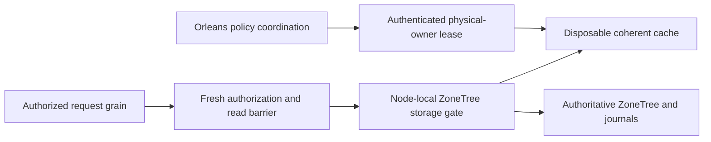

# ADR-058: Orleans-coordinated disposable cache memory

Status: Accepted; local cache source is partially implemented, while authenticated RF3 control, complete qualification and measured benefit remain open.
Related: REQ-CACHE-001..007 / AC-CACHE-001..015 and REQ-MP-002/005 / AC-MP-002/011/012 in [ResourceExecution](../Features/ResourceExecution.md); [CacheControlV1](../Features/ResourceExecution/CacheControlV1.md); ADR-035, ADR-041, ADR-056, ADR-081, ADR-113.

## Decision and boundaries

A node-local, bounded RAM pool may accelerate eligible reads from canonical ZoneTree state. ZoneTree, its native WAL and atomic/replication journals remain authoritative. Cache content is disposable across restart and activation movement. Orleans coordinates policy only through authenticated, bounded, current physical-owner messages; storage handles and authority never move with an activation. Cache admission never replaces persisted authorization, a committed read cut, a quorum barrier or an acknowledged write.

The local provider cache starts opt-in and cold. A shared node-owned reservation pool accounts for retained bytes and entries across opted-in cache families. Keys and values are privately owned; exact-key mutation invalidation and snapshot-generation fencing occur under the existing storage gate. Pins, in-flight fills, index reservation, eviction and release remain bounded and charged until actual ownership ends. Pressure or stale/uncertain coordination bypasses acceleration and uses the original native path.

## Acceptance and source of truth

The ResourceExecution feature is the normative criterion matrix and source map:

- AC-CACHE-001/002 bound shared reservation accounting and lifetime.
- AC-CACHE-003..006 cover exact-key coherence, store-generation/recovery fencing, owned results, pin/fill cleanup, bounded eviction and lock order.
- AC-CACHE-007/011/012/013/014 cover authenticated bounded Orleans policy, local permit/binding, owner identity, and the closed generated wire/crypto contract.
- AC-CACHE-008 preserves current authorization, revocation and tenant/field policy.
- AC-CACHE-009 requires private low-cardinality diagnostics and repeated matched cache-on/off measurements.
- AC-CACHE-010 requires complete delivered-source build, analyzers, governance, unit/scalar/recovery/RF3 and collected coverage.
- AC-CACHE-015 preserves actual fixture identity, ownership, original errors and healthy reopen behavior.

The acceptance source specifies the exact option bounds and provider lifecycle. CacheControlV1 owns the stable generated aliases, field IDs, byte limits, correlation and authentication format. This ADR does not authorize another wire format, public cache administration API, data migration, cache authority, or a performance/RSS claim.

## Ownership and verification

Storage.ZoneTree owns provider integration and the existing StoreGate/cache path. Core owns the bounded reservation and permit primitives. Orleans owns the generated control contract and receiver/coordinator integration. ResourceExecution TUnit tests use real ZoneTree files, callbacks and finite joined tasks; no fake provider, test-only production hook or reflection substitutes for those cases. Root owns shared contracts, options registration, DI, server lifecycle, AppHost/RF3 fixtures, docs and final joins.

Ordered implementation: complete current provider source and normal/scalar regressions; review and join authenticated Orleans receiver/service/control lifecycle; run actual RF3 authorization, revocation, activation movement, restart, recovery and healthy-follow-up flows; collect cache-on/off resource measurements on the exact delivered Linux source. Until those gates pass, keep RF3 caches disabled and report numeric benefits as unavailable. Rollback disables acceleration after readers/fills drain; native data and journals remain untouched.
