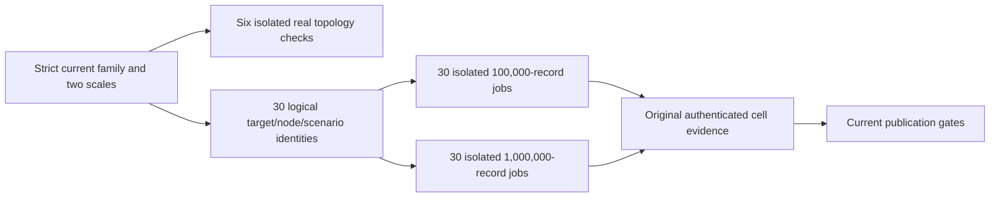

# ADR-059: Isolated intensive TimeSeries comparison

Status: Accepted target contract; current source profile is below the required scale and native qualification remains pending.
Related: REQ-BC-059..064 / AC-TSI-001..008; REQ-TSC-001..006 / AC-TSC-001..006; REQ-SERIES-007 / AC-SERIES-007; [BenchmarkComparisons](../Features/BenchmarkComparisons.md), [TimeSeries](../Features/TimeSeries.md), ADR-034, ADR-050, ADR-056, ADR-071, ADR-076, ADR-080, ADR-112.

## Decision

Keep intensive TimeSeries work in its own source-derived family, separate from the main comparison plan and its aggregate. A logical family cell is one target, native node count and scenario: KeyLoad or TimescaleDB; one, two or three actual nodes; Append, RawRangeRead, Latest, Aggregate or Windows. This yields six topology preflights and 30 logical target/node/scenario identities. Each logical cell has two distinct scale-specific workload and measurement identities: 100,000 actual records and 1,000,000 actual records, each with at least 100,000 measured operations. Therefore dispatch 60 scale-specific workload jobs, each on its own isolated Linux runner/measurement session, plus six isolated topology-preflight jobs. The two scales for a logical cell must never share a runner, process, native resource session or measurement identity. They add no target or scenario and remain outside the canonical 1,386-worker main cohort. The strict current source plan must represent the 60 jobs and six preflights explicitly before qualification; the present plan does not yet do so.

The current source and embedded contract still select 4,096 samples and 10,000 operations. Those values do not meet the current scale target and must not be presented as current qualification. The implementation change, per-scale corpus/readback budgets, profile identity and evidence projection remain pending. No result at either required size is claimed by this ADR.

## Workload and correctness contract

Each target performs the same real family operation over actual UTC sample records. Preserve the existing operation meanings: acknowledged append; inclusive ordered raw-range read; latest by timestamp/sequence with an optional inclusive cut; complete half-open aggregate; dense windows anchored at From, with bounded sample/window counts and correct final clamping. Use an independent oracle for identities, timestamps, sequence, values, tags, ordering, bucket boundaries and empty cases. Actual responses are decoded, validated and released within the configured response bound; validation work is included consistently in measured throughput.

KeyLoad calls its public operations through the real .NET SDK, with authorization and unique request grains, persisted state, node-local stores, RF3 quorum acknowledgement and process cleanup intact. TimescaleDB uses native PostgreSQL/Timescale operations and actual primary/standby topology. The current planned acknowledgement vector is 1/2/2 and observed copies are 1/2/3 for one/two/three members; qualify them through native flush/replay/data readback. A client count or standalone server is never relabeled as a cluster. The ManagedCode.TimeSeries library remains an explicitly in-memory primitive in its separate comparison profile; it is not an intensive native target.

Dataset size means actual committed seed records verified by full bounded readback and independent aggregate/count checks. Each scale must have at least 100,000 measured operations per cell; warmups and setup do not count. Keep operation outcomes, native acknowledgement/copies, latency, validation cost, client/server resource facts and provenance distinct. Incomplete, failed, unsupported or unobserved fields cannot be converted into successful values or zeros.

## Bounded execution and ownership

Retain the family’s existing independent per-cell execution, authenticated selection and input contract. Source-derived settings must validate before resource allocation. Preserve 16-way concurrency, five repetitions, the existing 30-second per-call deadline, 90-minute cell and 30-minute preflight bounds, bounded teardown, at most 16 decoded responses, no measured retries and complete original-task settlement. The present 50,000-attempt storage contract only covers the old 10,000-operation profile across five repetitions; the reviewed source update must derive finite attempt/evidence capacity from the at-least-100,000 operation target before dispatch. Any adjustment to a timeout, byte or allocation limit requires an explicit bounded review; no silent increase is permitted.

Root owns the family plan/schema, shared target selection, AppHost/ComparisonHost composition, workflow/collector/site integration and current source documentation. Target owners modify only the new/current intensive TimeSeries target files and matching real TUnit cases. The six preflights and all 60 scale-specific jobs run on separate isolated Linux GitHub jobs with real SDK, official MCP where applicable, Npgsql, Docker/Aspire and native resources. Source/model tests do not prove replication or performance.

## Retained current acceptance details

The stable acceptance IDs below retain their existing source and test contracts; this section replaces superseded implementation history, not current bounds or ownership.

- **REQ-STORAGE-015 / AC-SG009-001..004:** the guarded original-store inspector rejects absent original files or changed identity before provider recovery, calls native `Open` rather than `OpenOrCreate`, and checks actual identity, data and position without changing the ordinary public open/codecs. Native-file tests cover missing, mismatch, locked and invalid cases, then ordinary reopen. Primary and cleanup failures remain independently observable. Any separate-process inspection must retain exclusive ownership of the original store until the actual child exits and both original output readers settle; only then may it release the outer lock, reopen or remove files. This is process-settlement evidence, not a power-loss or copy-durability claim. See [StorageRecovery](../Features/StorageRecovery.md#guarded-original-store-inspection).
- **AC-SG009P-001..004:** retain lexical ordinal equality of the normalized full directory path, reject dot/dotdot variants before ownership, and make no symlink/rename-resistance claim. Every guarded case runs in the genuine Release CrashHost. The parent holds the fixture's existing outer lock and the child owns the canonical lock. Strict case-sensitive `System.Text.Json` requires exactly the known directory/node/incarnation/variant fields, rejects unknown/duplicate/missing fields and integer/undefined enum values, and drains stdin to EOF while retaining at most 4,096 characters; overflow rejects before parsing/guard execution. Valid guard rejection returns one safe JSON line no longer than 8,192 characters after cleanup; malformed/oversized requests exit 2 with no receipt. Receipts contain bounded actual identity/position/value/failure facts only (at most 64 original exception type names), never exception messages/stacks, paths, keys or credentials. The native value edge returns the complete 256-byte record and rejects a 257-byte record as actual `InvalidDataException`, without truncation; after settlement, ordinary reopen preserves original identity/journal bytes and complete record data. The child suppresses ordinary console writers for the whole inspection mode; only the fixed readiness marker and safe receipt use captured original writers. Parent stdout/stderr readers each retain at most 8,192 characters, and one child is admitted per fixture. Its execution bound is 30 seconds; cancellation/deadline kills the actual process tree. Neither EOF nor a canceled/faulted wait proves exit: release/reopen/delete requires positive original-process exit/reap plus both original readers. The 10-second cleanup bound is warning-only; on expiry ownership remains held until authentic settlement, with the GitHub job timeout as final external bound. The cancellation case waits for the actual ready marker, cancels, settles the original process/input/readers/lock, then verifies ordinary reopen/data. No detached task or fabricated parent exception is evidence of settlement. See [StorageRecovery](../Features/StorageRecovery.md#guarded-original-store-inspection).
- **AC-TB009-001:** derive KeyLoad incarnation and canonical voter addresses from the shared cluster resource authority, not duplicated addresses; preserve the current native configuration and identity tests. This source/model identity check is not a native membership, copy or acknowledgment result.
- **AC-TSM009-001:** the pinned Aspire model clears `Tag` when `SHA256` is set. Assert null native tag, exact registry/image/digest and rendered digest-qualified identity while preserving source reference and all native placement, credentials and bootstrap checks. The model test is not native readiness/replication evidence.
- **AC-TW009-001..003:** retain the 1,280 warmup slots (5 repetitions × 256 operations), initialized before timing with actual repetition/index/worker identity and `NotStarted`; each executor writes only its original 256-slot slice. Keep warmup separate from the 50,000 measured slots and their boundaries. Preserve actual attempt, ACK, sequence, error and latency outcomes; never infer a successful sequence from an operation ordinal or overwrite earlier slots. Publish the same live-owned read-only view only after workers settle. Current unit tests exercise actual ledger/value contracts; they do not substitute for the required warmup receipt oracle in each of the 60 future native workload jobs.

The current source still implements only 4,096 samples and 10,000 measured operations, and its accepted warmup storage is sized to that older profile. The 100,000/1,000,000-record datasets, 100,000 measured operations per scale-specific job, finite per-scale corpus/readback/evidence budgets and corresponding actual runner identities remain source work. The criteria above preserve existing acceptance; they do not qualify the missing plan or permit an unreviewed bound increase.

## Acceptance and verification

- AC-TSI-001: exact selected family, topology, image and source inputs validate before allocation.
- AC-TSI-002: independent corpus, workload/result digests and full oracle match actual results.
- AC-TSI-003: KeyLoad uses public authorized SDK/RF3 and Timescale uses genuine native operations.
- AC-TSI-004: attempts retain actual outcomes and timing; failures/cancellation settle original work and cleanup.
- AC-TSI-005: the bounded runner preserves response, concurrency and storage ownership.
- AC-TSI-006: node/image identity, acknowledgement, physical copies and isolation are observed natively.
- AC-TSI-007: current family evidence is complete, authenticated and scale/source bound.
- AC-TSI-008: delivered-source tests, coverage, aggregate, browser and publication gates pass without skips.

The feature and canonical coverage catalog map each criterion to exact tests and evidence. Complete enabled source build, formatter, governance/analyzers, normal/scalar TUnit, process recovery, RF3 SDK/MCP, six real preflights, all current family cells, coverage and Website provider evidence are required. Rollback disables this separate family only; production TimeSeries APIs and established operation semantics remain unchanged. The ADR remains Accepted until both scales and every required delivery gate pass.
