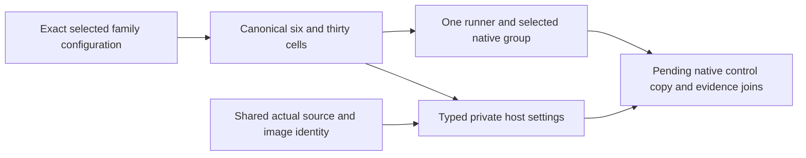
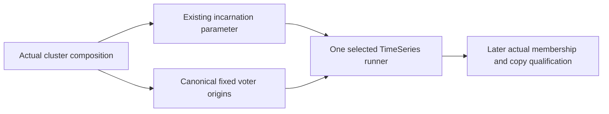
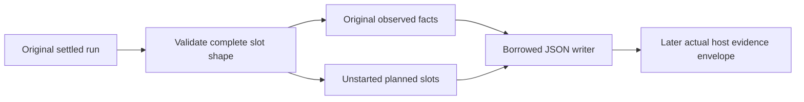
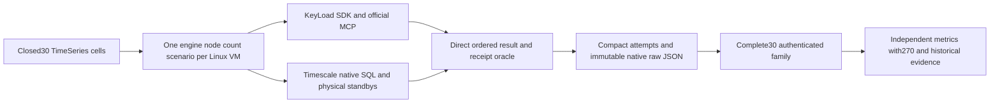
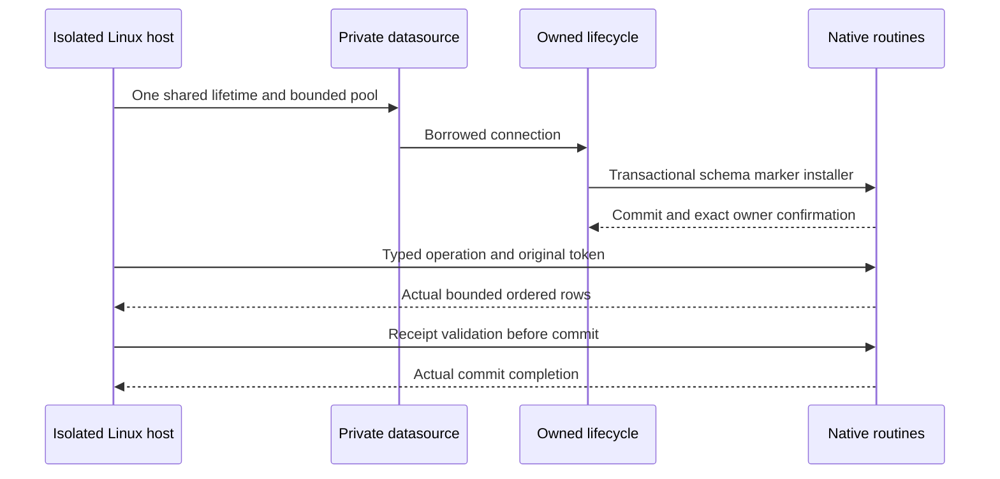
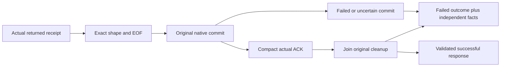
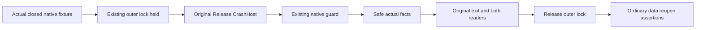

# ADR-059: separate native intensive TimeSeries family

## TS009C-G implementation stage: guarded original native store

Accepted AC-SG009-001..004 / REQ-STORAGE-015 / REQ-BC061/064. Exact provider
ZoneTree1.9.8 commit13ee11e19007301fdea72b9210de62f6257f4929 has a public Open
and provider-owned ZoneTreeMetaWAL.Exists; its recovery-capable loader has no
general partial-open unwind. The sealed source proposal and primary byte hashes
are /private/tmp/keyload-ts009c-g-r-existing-store-proposal.md SHA256
1e6ed969e2cbd113909472edf99e51f757d9ed078678f57f0be94679453e98c3.
This private guard is never a standalone native-copy proof.

Ordered implementation contract:
1. Author real native-file TUnit cases under tests/KeyLoad.UnitTests/Features/
   StorageRecovery/ before production. Cover successful original current-format
   identity/data/position, missing canonical directory/owner/identity/journal/tree/
   provider metadata without recreation, wrong expected node ID, unsupported identity
   epoch or mismatched incarnation, occupied ownership, invalid options and normal
   reopen after guard close.
2. NEW ZoneTreeExistingStore and ZoneTreeExistingStoreCleanup under StorageRecovery
   validate and own guarded runtime/handoff; original fault first, independent
   cleanup causes retained, no discarded cleanup or false provider settlement.
3. Modify only private ZoneTreeStoreRuntime, ZoneTreeStoreInitializer,
   ZoneTreeIdentityFile, ZoneTreeStoreFiles and ZoneTreeTreeFactory in that slice.
   Optional internal expectedNodeId on runtime selects guarded mode; null keeps
   ordinary open unchanged. Guard owns constructor unwind and successful disposal;
   starts no maintainer/reclaimer/cache. Guarded allocation cleanup starts
   before CacheLifecycle/View/checkpoint/backup allocations, retaining original
   failure and settling the field-allocated gate; ordinary initialization remains
   unchanged. Reuse actual serializer/comparer/tombstone/
   Sync-WAL factory configuration once, with ordinary OpenOrCreate unchanged and
   guarded existing tree/metadata then provider Open. Identity OpenExisting reuses
   bounded Read/private Validate and requires identity epoch7, a GUID node ID and
   incarnation.
   Existing journal helper has an internal FileMode parameter defaulting to
   OpenOrCreate; guard passes Open. No provider metadata filename/codec duplication.
4. Root alone adds internal ZoneTreeStore(ZoneTreeStoreRuntime runtime, Guid expectedNodeId);
   guard handoff verifies the already captured node ID. Two arguments preserve
   existing target-typed new(options) overload resolution in friend callers.
   no public contract/central package/project/friend edits in worker scope. Root
   checks every original-file baseline hash and integrations, build/format/limits,
   then actual GitHub normal/scalar/full recovery. Retain all failed baseline cases.
5. Before native use root must approve/deliver a separate original inspector process
   and parent control contract. Parent owns existing node.owner.lock; child owns
   existing canonical owner.lock. Every call, healthy or failed, uses original
   delivered executable/image/source/PID/args. Original exit/reap and both readers
   must settle before outer lock release/restart. Native1/2/3 seed/final business
   oracle and actual LastApplied versus validated ACK remain separately required.

No signing material output; rollback removes additive private mode/classes/
constructor and retains ordinary opens. Provider recovery is
explicitly permitted to replay/modify derived WAL, not claimed forensic immutability
or power-loss durability. Guard source/lifetime review covers exceptional partial
provider open and cleanup/handoff/fatal failure until genuine process fault tests;
no doubles and no invented executed gate. All source limits64/200/400/depth3 apply.

```mermaid
flowchart LR
    Parent[Parent owns original node lock] --> Child[Separate original inspector]
    Child --> Owner[Existing canonical owner lock]
    Owner --> Identity[Original format and identity]
    Identity --> Journal[Existing canonical journal]
    Journal --> Provider[Existing metadata and provider Open]
    Provider --> Recovery[Permitted original recovery]
    Recovery --> Read[Actual data and applied cut]
    Read --> Close[Independent original cleanup]
    Close --> Join[Actual process exit and readers]
    Join --> Restart[Release outer lock then restart]
```

## TS009H staged executable input contract

Accepted TH009001..004, REQ-BC059/061/064 and TSI001/003/007/008. Root owns all
existing files, shared identity method, friend/project reference, dispatches,
control protocol/native copy and durable/Git/workflow joins. Two disjoint workers
own temporary NEW files only; no repository, Git, build/test/native/provider or
package action. Stop on missing signatures, shared overlap or design expansion.

H-A: IsolatedTimeSeriesBenchmarkResources.Add(IDistributedApplicationBuilder)
under AppHost BenchmarkComparisons. Selection.Read then explicit Enabled, Current
contract/FamilyPlan unique matching Selection; require private full-qualified
root/output if explicitly supplied (missing uses fresh private root/reports).
If configured CellId/ContractSha256 are supplied, reject contradictory values
before allocation; absence uses exact computed identities. Require Root/native
to be absent (file or directory) before runner/directory allocation; reject and
preserve existing native inputs. Parent-owned reports/control may already exist.
Bind selection keys replacing ':' with '__', omit Preflight Scenario, and NEW
Benchmarks:TimeSeries:CellId/ContractSha256. Benchmarks:Storage equals exactly "Fresh TimeSeries cell-owned native directories; no shared database"
(a description, not a path). Reuse BenchmarkRunnerContainer.Create and existing
selected TimeSeries resources/context. No dispatch/host/native qualification yet.
Root later installs routing which rejects any partial intensive selection before
current/default allocation; that is a separate reviewed join.

H-S: NEW TimeSeriesIntensiveHostSettings(Selection, Cell, ContractSha256, Identity,
JobId, Image, OutputDirectory, Storage, RunId, Native), internal immutable record.
Read(IConfiguration) uses Current/FamilyPlan to resolve unique Cell, requires
configured CellId/ContractSha256 exact equality, new shared
ComparisonExecutionIdentity.ReadTimeSeriesIntensive(configuration, sourceRevision)
(nonnullable), positive canonical KEYLOAD_COMPARISON_JOB_ID and actual native image
(valid immutable; KeyLoad equals Identity.KeyLoadImage). Private RunId is fresh
Guid N, separate from actual GitHub RunId and workload hash. Root adds identity
entry to existing validator using the selection EvidenceProfile key and Current
family profile; missing runner identity rejects. Existing benchmark methods remain
unchanged.

NEW TimeSeriesIntensiveHostNativeSettings(Image, ImmutableArray<Uri> Endpoints,
ImmutableArray<string> VoterIds, Guid? Incarnation, string? AdminKey,
string? ConnectionString). Read(configuration, selection, image). Exact contiguous
0..N-1 arrays with no scalar/extra/duplicate/alias keys, URI authority restrictions
from TH009003. Incarnation canonical D GUID, nonempty; secret fields private
nonempty/no CRLF. Timescale Npgsql parser checks one Host (no comma), valid port,
nonempty Username/Password without connecting; malformed connection produces the
same safe code, never private parse message. Opposite-engine credentials reject.
Validate the Native section as a bounded closed key set before parsing: no scalar
root, unknown/opposite children or nested scalar fields. KeyLoad allowed roots:
Image/Endpoints/VoterIds/Incarnation; Timescale: Image/Endpoints/ConnectionString.
Use IConfiguration case-insensitive field semantics; index aliases still reject.
Read arrays from the merged IConfiguration view; reject nested indexed children,
while pre-merge duplicate/case-equivalent keys cannot be observed or certified.
Storage must equal the exact H-A description; only output/root are paths.
All required/invalid settings throw InvalidOperationException with fixed
TimeSeriesIntensiveHostSettingsInvalid; null IConfiguration ArgumentNullException.
Both positional records override ToString to the fixed type name, preventing
auto-generated private credential diagnostic echoes. Normalize expected selection,
shared identity and parser input exceptions to the fixed settings code without
private inner exceptions. Test safe ToString and both normalized boundaries.
Use named constants/helpers,400/200/64/depth3 limits and genuine TUnit inputs.

Stages: tests first temporary candidates; root every diff integration; development
build/scoped formatter/governance; exact-source GitHub normal/scalar/models; later
original native host/control/copy/SDK/MCP/6/30 joins. Root creates host internal
UnitTests friend and enables ReferenceOutputAssembly on its already existing
UnitTests ProjectReference; workers edit neither. Root adds the three genuine
unstarted model classes (native KeyLoad, Timescale and family composition) to
comparison-images with separate results directories, preserving every existing
invocation/assertion and upload glob. Normal/scalar includes the host input tests.
These are source/model gates; each real native6/30 cell still requires its own
independent runner. Every source stage remains
pending native qualification. No feature/interface/data/production behavior change;
rollback additive source and metadata only. ADR remains Accepted.

## TS009B native KeyLoad identity configuration join

Accepted REQ-BC059/061/063, AC-TSI001/003/006 and AC-TB009-001. Existing
ClusterResources.Origin(string node) becomes internal with identical body, so
the comparison composition consumes the canonical owner of voter addresses.
IsolatedTimeSeriesKeyLoadResources.Add binds Native Incarnation to the existing
incarnation ParameterResource created by ClusterResources, and binds indexed
Native VoterIds__i to ClusterResources.Origin(nodes[i].Resource.Name). Existing
HTTP endpoints/private admin, image, exact fixed group, waits/storage and default
RF3 remain. Incarnation is not synthesized from a resource name or run identity.

Root owns the existing ClusterResources visibility and shared docs/Git joins.
timeseries_resources_worker owns only temporary revised copies of existing
IsolatedTimeSeriesKeyLoadResources.cs and its matching resource tests under
/private/tmp/keyload-ts009b-candidate. Tests first extend the original three cases
with independent address values and actual node/runner incarnation reference
equality; retain every assertion. Source limits/constants apply. No repository,
other file, package, local test/native/Git or provider action. Root reviews every
diff, integrates and builds/formats/static-checks; exact-SHA GitHub models and
later genuine host/preflight/copy/ACK joins qualify behaviour. Rollback removes
only new bindings and restores private visibility; no data or public contract change.
Stop on an unspecified signature or source ownership overlap.

## TS009J explicit settled-run raw payload contract

TJ009003 source refinement: full pre-output validation also rejects undefined
run stage/failure origin/nullable ErrorCode enums and nonfinite values among the
six measurement doubles. Preserve all representable original values; no native
origin, outcome, count, ACK, receipt or phase predicate reclassification.
Reject uninitialized repetition arrays/null repetition records before output;
initialized empty/partial arrays remain valid original evidence, without requiring
all5 repetitions, positive ACKs or phase/native consistency here.

Accepted REQ-BC-059/060/064, TSI002/004/007/008 and TJ009001..004. Internal
TimeSeriesIntensiveRunJson.Write(Utf8JsonWriter writer,
TimeSeriesIntensiveRunResult result) borrows both objects. Validate full slot
shape before output. Root object: schemaVersion1/scenario/timestampFrequency/
seedVerified/workloadSucceeded/plannedSlotCount/observedAttemptCount/
unstartedSlotCount/nullable failure/repetitions/attempts. Run failure:
stage/repetition/outcome/failure. Repetition: repetition/warmup/measured/
finalVerified/failure. Phase: complete/succeeded/wallTicks/workersStarted/
peakClientCalls/peakDecodedResponses/nullable measurement. Measurement retains
all eight existing fields with their camelCase names and original values.
Attempt: slot/repetition/index/worker/observed; NotStarted ends there. Observed
attempt adds outcome/latencyTicks/validationTicks/resultCount/digest/
receiptSequence/acknowledgement/failure/cleanupFailure. ACK: nullable original
commandId/sequence. Structured failure: origin/keyLoadCode/httpStatus/sqlState;
exact declared enum names, original nullable packed UInt64 SQLSTATE. Digest uses
original ToHex. No native messages, invented defaults or reclassified failure.

Reject invalid scenario/nonpositive frequency/wrong50000 length/wrong planned
slot repetition-index-worker/undefined outcome/negative observed ticks before
WriteStartObject. No predicates, native adapters or ledger data change. A failed
attempt's observed count and ACK are independent facts. Outer source/job/image/
telemetry/native-copy/cleanup/publication envelope and atomic file lifetime belong
to later root integration; this inner writer cannot certify them.

Stages: root criteria/signature/schema; bounded worker tests-first prepares at
most four NEW source and two NEW test candidates in
/private/tmp/keyload-ts009j-candidate only; root every diff/canonical integration/
development build/formatter/governance; delivered-source normal/scalar GitHub
TUnit. Root owns all existing files, APIs, embedding and native/workflow/site/
coverage joins. Worker performs no repository/Git/build/tests/native/runtime/
package action and stops on unspecified contracts. Every file/type/function must
meet policy limits, with named implementation keys/diagnostics/shared values.
No product API or persistence behavior changes; rollback removes only the additive
writer and eventual caller. Keep ADR Accepted until native/coverage/site qualification.

## TS009P additive executable family plan contract

Accepted REQ-BC-059/064, TSI001/004/007/008 and TP009001..004. Root first freezes
NEW Features/BenchmarkComparisons/TimeSeries/Intensive/timeseries-contract.json
in KeyLoad.Comparisons and later embeds it with LogicalName
KeyLoad.Comparisons.TimeSeriesIntensiveContract. A small strict internal reader
retains the actual UTF8-byte SHA256 and immutable typed values. Do not modify
the established isolated-contract.json, 270 types/routes or existing profile values.

The exact JSON fields are schemaVersion1; family timeseries-intensive;
evidenceProfile intensive-timeseries-4096-c16; targets ordered KeyLoad,
TimescaleDB; nodeCounts1/2/3; scenarios Append/RawRangeRead/Latest/Aggregate/Windows;
sampleCount4096; operationCount10000; warmupCount256; repetitions5; concurrency16;
operationTimeoutSeconds30; cellTimeoutMinutes90; preflightTimeoutMinutes30;
teardownTimeoutSeconds30; clientDecodedResponseLimit16; rawAttemptCount50000;
expectedPreflightCells6; expectedIntensiveCells30; timestampUnit stopwatch-ticks;
throughputDenominator validation-inclusive-wall; percentileMethod
nearest-rank-per-repetition; measuredRetries0; quorumAcknowledgements1/2/2;
dataCopies1/2/3. These are guarded plan/configuration facts; observed native
facts and workload digest are produced only by their actual owners later.
Contract parsing is bounded at16384 bytes/max-depth4 and rejects duplicate,
unknown, missing, null, wrong-type or drifted fields/ordered arrays. Current
loads the actual embedded stream; Read consumes real UTF8 input data. Preserve
original parsing failures or a named validation failure; no native abstraction.

Approved internal signatures: TimeSeriesIntensiveFamilyContract.Current,
TimeSeriesIntensiveFamilyContract.Read(ReadOnlyMemory<byte>), immutable public
JSON properties with required presence and ContractSha256 derived from original
bytes; TimeSeriesIntensiveFamilyContractValidation.Validate(contract);
TimeSeriesIntensiveFamilyPlan.Create(contract) returning
TimeSeriesIntensiveFamilyCells(immutable Preflight, immutable Intensive arrays);
TimeSeriesIntensiveFamilyCell(string Id, TimeSeriesIntensiveSelection Selection).
Use existing target/phase/scenario enums and validated selections. IDs use
ts-, lowercase closed target, -n plus invariant decimal, then -preflight or
the exact scenario name. No run identity, timestamp or measurement is invented.

Ordered stages: root freezes JSON/spec; bounded worker tests-first prepares
complete NEW C# candidates under /private/tmp/keyload-ts009p-candidate only;
root every diff/source review, exact canonical integration and csproj embedding;
root development build/format/governance; delivered-SHA normal/scalar TUnit;
separate later native/raw/workflow/provider/site joins. The worker owns only
TimeSeriesIntensiveFamilyContract.cs, TimeSeriesIntensiveFamilyContractValidation.cs,
TimeSeriesIntensiveFamilyCell.cs, TimeSeriesIntensiveFamilyPlan.cs in the existing
Intensive namespace and NEW matching TimeSeriesIntensiveFamilyContractTests.cs
under UnitTests. No repository/package/shared-contract/host/workflow/Git/build/
test/native change by worker. Root owns JSON, embedding, all integration and
every shared boundary. Stop on a missing exact contract rather than inventing it.

No product persistence/API behavior changes. Rollback removes only additive plan
files and embedding; existing profiles/routes/test/qualification contracts stay intact.
Tests are actual embedded JSON and independent acceptance data/negative parsing,
not provider simulations. The temporary candidate and source review are not
delivery or qualification. This ADR stays Accepted until genuine full gates,
native6/30/270, coverage and publication finish.

Status: Accepted staged implementation contract; native evidence pending.
Owner: KeyLoad integration lead. Canonical feature: BenchmarkComparisons.
Related: ADR050/052/056, ADR007/034/035/039/054 and CodeQuality ADR033.
Requirements REQ-BC-059..064; criteria AC-TSI-001..008 in
[acceptance](ADR-059-isolated-intensive-timeseries.md); ordered roles/join/checklist
in [plan](ADR-059-isolated-intensive-timeseries.md). Owner directs serious isolated Linux
native1/2/3-node workloads, one database/scenario per runner and measured site data.

## Decision

Add a distinct30-cell family for KeyLoad and TimescaleDB ×native1/2/3 nodes ×
Append/RawRangeRead/Latest/Aggregate/Windows. Six private preflights establish
actual native image/topology/public correctness before the full measured family.
Keep the existing270-cell protocol and historical48-sample/library schema1 route
unchanged. An in-memory library is not a native node target; a single native
server is not relabelled as a cluster. Product default and release topology isRF3.

Shared seed is4096 exactly specified microsecond-aligned UTC samples with
out-of-order insertion, timestamp ties, gaps, quarter values and persisted
sequences1..4096. Compare actual returned timestamp/sequence order directly.
The accepted profile has16 workers,5 repetitions,256 warmups per repetition,
10000 measured operations and30s per-call deadlines. Append means one sample in
one acknowledged commit, with fresh warmup/measured series for each repetition;
concurrent revision comes from actual receipts. No measured retry.

Validate and release each actual decoded output after its latency clock, retaining
at most16 complete responses and50000 compact attempts. Repetition wall throughput
includes this bounded validation/backpressure; report validation overhead and the
different load model explicitly. Never buffer millions of returned samples or
reuse the270 family's excluded-validation throughput denominator. Input/oracle
construction, seeding, readiness and warmup remain outside the measured interval.

KeyLoad preserves benchmark RF1/RF2/RF3 opt-in/guard, node-local store/journal/apply
ownership, separate request grain and persisted authority. New public negatives
execute actual SDK/MCP operations. Client-synthesized error/hash behaviour
cannot qualify the new route and is retained only as historical regression.

Timescale uses the existing digest-pinned2.30.2-pg18 image. Native image
entrypoint/user-switch/PGDATA compatibility must be observed before bootstrap
implementation; current shared script assumptions are not proof of compatibility
or an observed defect. Root alone parameterizes primary DNS and native shared
bootstrap. One primary plus0/1/2 physical standbys, fsync/on and synchronous commit
establish ACK1/2/2; separately observe1/2/3 copies through flush/replay/data readback.
No automatic failover or read scaling claim. Reuse real private schema owner
marker, transaction/search-path and cleanup. Actual SQL implements inclusive raw,
latest tie order, complete half-open aggregates and dense/clamped anchored windows.
Native SQLSTATE/empty negative outcomes remain PostgreSQL facts, not fake KeyLoad
errors. Owned counter/identity SQL details are frozen before their worker starts.

## Ordered implementation contract

1. TS005 root freezes scope/acceptance/this ADR/map and reads the actual relevant
   full GitHub baseline after the plan is prepared. Every failing test becomes a
   tracked root-cause/fix item. Source builds do not satisfy runtime baseline.
2. TS006 root approves exact internal operation/result/target constructor packet;
   disjoint domain worker owns only NEW TimeSeriesIntensive* under Comparisons
   TimeSeries/Intensive and matching NEW UnitTests. Tests precede seed/oracle/bounded
   timing implementation; no public product API or existing comparison-family wire change.
3. TS007 genuine pinned-image facts precede native bootstrap writes. Disjoint NEW
   IsolatedTimeSeries* resources/tests; root serialized ownership of existing
   primary script/context/selector/image/host composition. Model tests accompany
   native role/copy/ACK/permission tests; models alone are not cluster proof.
4. TS008K NEW KeyLoadTimeSeriesIntensive*/public SDK/MCP files and TS008T NEW
   TimescaleTimeSeriesIntensive*/native SQL/ownership/tests consume the approved
   internal target contract. Root freezes native SQL identity/counter/transaction
   details before TS008T. Workers stop on missing contract/upstream defect/overlap.
5. TS009 root freezes a distinct closed family JSON/plan/raw/proof/projection and
   actual job/artifact/image/source contract before a disjoint NEW family tooling
   worker begins. Root owns shared selectors/workflows/collectors; all6 preflight
   and30 measured jobs receive independent Linux VMs. Nothing relaxes270 checks.
6. TS010 only starts from complete authenticated native30 evidence; bounded NEW
   family site modules/tests, root existing source/coverage/Pages joins. Retain
   all existing270 tests/thresholds, original hashes and independent source facts.
7. TS011 root reviews every complete diff and combined repository state, runs
   exact-SHA required native checks, separate genuine matched coverage, complete
  30/270/site/Chrome/no-skip/freshness/provider/live proof and honest status docs.

Every delegated packet includes goal/AC/exact files/model/permissions/dependencies,
approved APIs/test strategy/forbidden changes/artifacts/escalation conditions.
Workers are disjoint; root owns all shared files/central configuration/solution/
workflow/docs and integration. Completed source is not a completed task; blocked
or partial workers never unblock dependants. No local qualification, fake target,
test skip, unpublished dependency reference, suppressed rule or credential leak.

## Rollout, rollback and evidence

Add an explicit timeseries-intensive benchmark profile with typed target/node/
scenario/phase; product persistence/API behavior remains unchanged. Reject invalid
selections before allocation. Keep productionRF3, established TimeSeries, 270-cell
protocols and immutable evidence. Family namespace
and owned data are unique per cell; rollback stops/removes only new additive
routes/resources after owned cleanup. Missing/invalid family data blocks its
publication; no latest-pointer or guarantee rewrite. Publish only actual qualified
projection/source/hash facts with complete family freshness and least permissions.

Testing is acceptance-derived pure independent corpus/oracle plus real native
SDK/official MCP/Npgsql/Aspire/Docker/process/Node/browser flows in GitHub only.
Required solution/analyzer/format/governance/normal+scalar/recovery/RF3/coverage,
six preflights/all30/full site/provider/live evidence maps to AC-TSI-001..008.
Instrumentation is separate from measured images/cohorts. Retain exact SHA,
run/job/attempt URLs, images, raw JSON and receipts. Do not mark Implemented until
all tests/docs/implementation/evidence exist; no speed/SIMD/durability/readiness claim
from the design or source compilation.

## TS007F native image feasibility packet

Root approves only NEW TimeSeriesIntensivePinnedImage* TUnit/helper files under
tests/KeyLoad.ComparisonTests/Features/BenchmarkComparisons/TimeSeries/Intensive.
No shared product/resource/bootstrap changes. A separate Linux job uses only the
accepted Timescale image and real Docker CLI, with actual own-main GitHub SHA/run/
attempt/repository context. Pull the exact tag+digest; inspect its actual config
ID, RepoDigests, OS/architecture, entrypoint/cmd/default-user/env. Retain these
facts and native tool/path/OS/user observations in bounded JSON and command logs.
The real ephemeral probe overrides user0 only to test the required bootstrap
permissions, selects an actually present gosu or su-exec, invokes it as postgres,
creates the proposed PG18 path and proves the postgres user can write it. Require
actual PostgreSQL major18, executable native entrypoint, postgres/pg_basebackup/
pg_isready/timeout and a functioning user-switch command. These are image facts,
not native replication, mounted-volume readiness or performance qualification.
Use no fixture transport, host data bind, service double or inferred image lineage.

Pull deadline600s, other native commands30s, output at most1MiB per stream and
JSON at most1MiB. Every process is observed/reaped; each independent cleanup gets
30s. A unique cell-owned probe container is removed even when CLI cancellation
occurs; never prune or remove unrelated Docker resources. Preserve the original
failure and independent cleanup diagnostics. Missing actual GitHub/Docker/image
inputs fail, no skip. Root owns the dedicated workflow invocation/artifact receipt
and exact source verification; worker has no Git/local-runtime permission.
Source build/static diff is allowed. Genuine job/TRX/inspection/log artifacts are
required before root selects the bootstrap command or writes TS007 resources.

## TS006 internal domain packet

All new domain types remain internal in the existing Comparisons assembly.
Root alone adds a narrowly scoped KeyLoad.AppHost friend and routes
Benchmarks:Profile=timeseries-intensive before the established270 target selector;
EvidenceProfile=intensive-timeseries-4096-c16 is a distinct frozen load profile.
Separate target/node/scenario/phase enums reject drift before allocation; never
expand the existing Scenario or ComparisonWorkerSelection. The accepted selection carries
KeyLoad/TimescaleDB, node1..3, Append/RawRangeRead/Latest/Aggregate/Windows and
preflight/intensive. All existing routes retain their current bytes and semantics.

ITimeSeriesIntensiveTarget binds one private partition/schema, one set and actual
topology at construction. InitializeAsync/SeedAsync are untimed; SeedAsync accepts
logical series ID, an immutable SampleData array and canonical tags. AppendAsync
accepts that series, Guid command ID, one SampleData, tags and cancellation;
returns a TimeSeriesIntensiveAppendReceipt with actual command ID and sequence.
ReadAsync returns ImmutableArray<SampleRecord> for inclusive From/Until/limit;
LatestAsync returns SampleRecord? for optional inclusive AtOrBefore;
AggregateAsync returns SampleAggregate for From/UntilExclusive/MaxSamples;
WindowsAsync returns ImmutableArray<SampleAggregateWindow> for From/end/width/
MaxSamples/MaxWindows. These reuse current product result DTOs; real SDK errors
remain declared typed failures and native Npgsql errors preserve SQLSTATE.
No adapter may synthesize expected negative codes. DisposeAsync releases only
owned clients/schema through bounded lifecycle; root host owns actual resources.

Seeds and query oracles use the exact acceptance formulas. Appended value is
((k+1729)%31-15)+(k%16-8)/4.0, EventId a- plus five invariant decimal digits,
logical seed/warm-rN/measured-rN series and existing SHA-first16 Guid convention.
Warmup executes k0..255 using16 bounded clients per repetition. Intensive overall
deadline90min, preflight30min; outer jobs150/60min, every call30s/teardown30s.
Client CPU/allocations/RSS/GC are mandatory; server CPU/RSS/container observations
are native. Managed server allocations/GC may be unavailable with explicit reason
for nonmanaged/native targets, never fabricated zero. Return full arrays only
until synchronous assertion/digest completes, at most16 retained responses.

Digest v1 uses UTF8 domain/version framing, big-endian length-prefixed UTF8 strings,
Int64 UTC ticks/sequences/counts and IEEE754 bit-pattern Int64 numbers. Strings
have UInt32 byte lengths; arrays UInt32 element counts, optional values byte0/1.
Workload hash covers seed insertion order/event/ticks/value/sequence/canonical
tags and all measured/warmup logical plans including profile/caps. Exclude private
run, partition/schema and command GUID. Result hash covers actual returned order,
identities/timestamps/sequences/value/tags or aggregate/window fields. Aggregate
average uses numeric absolute1e-12 assertion; its actual bit digest is retained
and is not required to equal another engine's allowed rounded average digest.
Exact framing labels/field order are frozen in the worker packet before code.
Independent source-only tests derive expected data/digest independently and
exercise corrupted order/missing/extra/ties/empty/limits, never a fake target.

## TS008T native SQL and ownership packet

Root approves an internal InitializeOwnedAsync(connectionString,schemaName,
ownerId,Func<NpgsqlConnection,NpgsqlTransaction,CancellationToken,Task> installer,
cancellationToken) in the current TimescaleSchemaLifecycle. The original
InitializeAsync delegates to the same marker/extension/transaction/confirmation
flow with its unchanged standard sample installer. Only source-owned installers
are accepted; no caller/network SQL or guessed cleanup authority. Install tables
and function in that transaction; return ownership only after marker confirmation.
Keep existing search-path validation and locked marker check before DROP intact.

The new installer owns series_counter (set_name,series_id primary key and
nonnegative last_sequence), event_identity (scoped EventId primary key plus unique
scoped sequence and native timestamp/value/jsonb identity fields), and samples
hypertable (primary key set_name,series_id,sample_time,event_id; finite float8
value, sequence and tags). The query index starts with set_name,series_id,
sample_time,sample_sequence. No unsupported hypertable FK assumption or time/event-
only key. Prepare all eleven logical series counter rows untimed.

Source-controlled SECURITY INVOKER append function uses typed set/series/command
UUID/sample JSONB/tags parameters and a confined validated private search path.
Lock series_counter FOR UPDATE. Iterate input in supplied order; identical scoped
EventId with equal UTC timestamp/native float8/jsonb fields reuses its original
sequence without increment. Changed content raises actual SQLSTATE23505 with
fixed safe detail; invalid count/nonfinite/native bounds raise declared native
22023/check errors. Fresh events increment the checked counter and insert both
identity and sample. One Npgsql transaction covers the entire batch; rollback
restores counter/tables, including prior items in a conflicting batch. Return the
actual server-returned command UUID/sequence; acknowledge only after CommitAsync
success. Unknown commit outcome fails without retry. UUID is a correlation
parameter; this Timescale adapter does not claim durable command-ID replay.
Native per-event dedup equality is explicit and does not claim universal KeyLoad
fingerprint equivalence. Fresh measured appends always have unique event/command
identities, so each acknowledged receipt identifies its actual committed sequence.

Every reader is parameterized and scoped to the exact set/series. Raw uses native
inclusive >=From/<=Until, timestamp then sequence ORDER BY and LIMIT. Latest uses
optional inclusive cut and descending timestamp/sequence LIMIT1. Aggregate uses
half-open >=From/<Until and complete COUNT/SUM/MIN/MAX/AVG; only SUM defaults0,
empty extrema/average remain null. Windows computes native ceiling(span/width),
generates ordinal From-anchored slots, clamps each end, LEFT JOINs half-open
samples, COUNT(sample_value), groups/orders ordinal and keeps empty slots. No
epoch time_bucket substitute or extra slot at Until. Explicit positive plans
remain within their bounds; an overflow must fail rather than publish truncation.
Negative inverted native SQL ranges retain actual empty/native-error semantics.

Full seed readback is16 predetermined ranges of16 groups, each256 rows, ending
at each chunk's final group's minute3; never one4096-row raw request. Append
readback is10 disjoint1000-millisecond ranges per repetition, with exact event/
value/tags and sequence matched to the actual receipts. Warmup has one256-row
range per repetition. A4096-row full aggregate is allowed within the10000 cap.

Disjoint worker owns NEW TimescaleTimeSeriesIntensiveSchema/AppendSql/ReadSql/
Session/Target and matching native tests. Root alone edits the common initializer
and native topology/bootstrap/profile/host composition. Actual1/2/3 SQL negative,
transactional rollback/dedup/concurrency/ordering/marker/copy tests are required;
DDL and source compilation alone cannot authorize native performance claims.

TS007F actual pinned-image feasibility passes at890047996, run37086903497/
job111098989273,1/1 with no skips. The exact native evidence is
[image receipt](../implementation/timeseries-image-qualification-37086903497.json).
Observed image: Linux/amd64 Alpine3.23.6, PostgreSQL18.6, gosu at
/usr/local/bin/gosu, postgres UID70 and actual writable PGDATA18/docker. Owned
container removal and retained command hashes pass. This resolves the native
gosu/path assumption only; Timescale extension installation, real1/2/3 database
bootstrap/ACK/copies and complete intensive family remain unqualified.

## TS006C approved pure corpus, oracle and digest implementation packet

Root accepts AC-TSI-002/005/008 before writes. This source-only independent stage
may proceed while the separately tracked twelve270 native preflight failures
block adapters, measured-family and publication qualification. It cannot unblock
those native dependants. Internal pure types reuse existing SampleData,
SampleRecord, SampleAggregate and SampleAggregateWindow; no product/wire/selector
or established-family changes. Separate gRange=k%224 from gLatest=k%256. Inclusive seed
readback chunks cover16 groups/256 rows, and append chunks1000q..1000q+999ms.
Whole-series aggregate/count checks remain required because raw LIMIT can truncate.

Digest v1 labels are themselves UInt32-big-endian-length UTF8 strings. Every
string/array uses UInt32-big-endian byte length/element count; integers, ticks and
double IEEE754 bits use Int64-big-endian. Nullable values begin with byte0/1.
Header order: label domain, domain string, label version, string1. Domains are
keyload.timeseries-intensive.workload and keyload.timeseries-intensive.result.
raw/latest/aggregate/windows/append-receipt, with the suffix joined directly to
the result prefix. Every actual result preserves its returned array order.

Workload ordered labels: profile, randomSeed, epochUtcTicks, sampleCount,
operationCount, warmupCount, repetitionCount, concurrency, operationTimeoutTicks,
rawLimit, maxSamples, maxWindows, windowWidthTicks, averageToleranceBits,
seedInsertion, phasePlans, seedReadbacks, warmupReadbacks, measuredReadbacks.
Seed/sample ordered labels: seriesId, eventId, timestampUtcTicks, sequence,
valueBits, tags. This same order applies to seed insertion and result rows.
PhasePlans has51280 entries: repetition0..4, warmup then measured, ascending k.
Each entry binds labels repetition, phase, seriesId, index, commandPurpose,
appendSample, rawFromUtcTicks, rawUntilUtcTicks, latestAtOrBeforeUtcTicks,
aggregateFromUtcTicks, aggregateUntilExclusiveUtcTicks, windowsFromUtcTicks,
windowsUntilExclusiveUtcTicks. phase is warmup/measured; series is warm-rN/
measured-rN. commandPurpose=phase+":"+invariant repetition+":"+invariant index.
appendSample labels eventId, timestampUtcTicks, valueBits, tags. Query inputs
bind all five operations in one common hash; profile fields bind caps/width.
Readback entries bind seriesId, fromUtcTicks, untilUtcTicks, expectedCount;
seedReadbacks16, warmupReadbacks5, measuredReadbacks50, in natural q/repetition
order. No selected engine/node/scenario/private namespace/run/GUID/timing enters
the workload hash. Stream framing into IncrementalHash, retaining no full framed
workload or phase-plan array.

Raw result begins label samples/array count and sample fields. Latest begins
label sample/optional marker and sample fields. Aggregate fields: count, sumBits,
optional minimumBits, maximumBits, averageBits. Windows begins label windows/
array count; each row fields fromUtcTicks, optional untilExclusiveUtcTicks,
aggregate followed by aggregate fields. Receipt fields commandId lowercaseN
Guid string, sequence. Result hashes retain actual averages; allowed numerical
rounding does not imply cross-engine identical digest. Oracle aggregation uses
integer quarter-unit sums and compares finite actual statistics before tolerance.

Ordered stages and disjoint ownership: existing capable publisher_archive_review
authors acceptance-derived tests first and owns only NEW TimeSeriesIntensive*
files in Comparisons/Features/BenchmarkComparisons/TimeSeries/Intensive and NEW
TimeSeriesIntensive* tests/helpers in UnitTests/Features/BenchmarkComparisons/
TimeSeries/Intensive. Internal names are TimeSeriesIntensiveProfile, Corpus,
Plans, ReadPlan, Readback, Oracle, DigestWriter, ResultDigest, WorkloadDigest and
AppendReceipt. Split cohesive new prefixed helpers as numeric limits require.
No runner/target/interface/adapter/host/resource/shared file edits in this stage.
Root owns docs/integration/final review. Stop on framing/DTO/mathematical ambiguity,
shared-file need, upstream defect or scope change rather than guessing.

Tests independently derive seed formulas, exact endpoint counts and first/last
records; cover k224 independent latest/range, UTC/culture, direct raw order and
missing/extra/tie/corrupt/tag rejection, empty/null and finite tolerance. A separate
test reference framer verifies bytes/labels/endian/null/order and run independence;
it does not call production framing to construct expected digests. Existing
goldens include epoch639028224000000000, first s-004095/seq1/-13.25, last
s-000000/seq4096/7 and k0 aggregate512/84/-17/16.75/0.1640625, windows54/count512.
Source build/format/static review are permitted; all TUnit execution remains
GitHub full normal/scalar. No fake target, local test/load/runtime, Git/config/
package changes or exclusions. Native all30 later proves caller response flows.
Additive pure types make no product persistence change; rollback removes only this
coherent source/test unit. ADR remains Accepted until every required gate passes.

## TASK-ISO-TS006C-R accepted validation-cost and independent-oracle correction

AC-TSI-002/005/008 keep exact v1 bytes, formulas, ordering, finite numeric
semantics, seed/window boundaries and all caps. Source review identified repeated
JSONB whitespace normalization (two validator parses plus one framing parse
per row); this is a source cost estimate, not a measured performance claim.

NEW TimeSeriesIntensiveTagScope.cs retains only one last successfully validated
raw spelling and its canonical string within one synchronous validation/digest
call. Exact Profile.Tags returns directly; equivalent repeated spelling parses
once. Invalid/changed/extra tags or parse failure never replace a valid memo.
No dictionary/global cache/parser delegate/counter/retained JSON document/DTO.
RowVerifier accepts the scope and returns validated canonical tags after full
identity/order/sequence/time/value/finite checks. ResultFrames writes that exact
canonical result; no second parse. ResultDigest adds ValidatedRaw(expected,actual)
and ValidatedLatest(expected,actual), checking cardinality before streaming
validate/frame of each actual row. Standalone Oracle/digest methods use a local
scope. No response array/materialization/sort; future runner uses combined API
after latency stop, includes validation in wall time and releases response before
next call. Maximum16 live responses remains unchanged.

Disjoint same worker owns these NEW/previously authored TimeSeriesIntensive*
production and test files only. Introduce cohesive named frame/domain/version/
label/error/recipe constants within this owned new unit, preserving every
existing byte/formula; root literal/magic policy applies even without diagnostics.
No runner/interface/target/native host/shared or established-family writes.

Tests first: repeated516 JSONB spellings, alternating equivalent spellings,
corruption after memo hit, malformed/extra/changed tags, full identity/cardinality/
tie/default/null/NaN/Infinity failures, independent-reference combined hashes,
warmed genuine synchronous CI allocation comparison. NEW ReferenceOracle and
OracleReferenceTests independently derive every raw row/order over224 ranges,
all54 window absolute bounds/all statistics, latest256 groups/tie/gap/afterseed,
and all10000 append receipt identity/value/sequence mappings; reference code
must not call production profile/corpus/plans/oracle/framer for expected values.

Ordered source join: tests, bounded correction, root full review/scoped build/
format, exact-SHA full normal/scalar GitHub suites, later actual all30 native
responses. No local tests/runtime/benchmarks/Git or invented allocation/speed
result. Additive source rollback removes this coherent owned unit; product persistence
remains unchanged. ADR remains Accepted; source and native gates stay distinct.

## TASK-ISO-TS007B accepted compact runner implementation contract

Root accepts the completed read-only TS007R proposal for REQ-BC-060/062 and
AC-TSI-002/004/005/008. This is a bounded internal source stage; real SDK/Npgsql
adapters, native resources, family wire/host/workflow/site remain separate tasks.
The genuine source baseline is2f374fc34/run37093197474: full Release/format/
governance, normal/scalar units and63/63 RF3 currently pass; original recovery
counts and native preflights are still pending. Source success cannot unblock
missing native qualifications. Existing270 interfaces and bytes stay fixed.

The exact internal ITimeSeriesIntensiveTarget signatures are the DTO-returning
TS006 interface above, with InitializeAsync(CancellationToken),
SeedAsync(string seriesId, ImmutableArray<SampleData> samples, string tagsJson,
CancellationToken), AppendAsync(string seriesId, Guid commandId, SampleData,
string tagsJson, CancellationToken), ReadAsync(string seriesId, DateTimeOffset
from, DateTimeOffset until, int limit, CancellationToken), LatestAsync(string
seriesId, DateTimeOffset? atOrBefore, CancellationToken), AggregateAsync(string
seriesId, DateTimeOffset from, DateTimeOffset? untilExclusive, int maxSamples,
CancellationToken), WindowsAsync(string seriesId, DateTimeOffset from,
DateTimeOffset? untilExclusive, TimeSpan width, int maxSamples, int maxWindows,
CancellationToken). Return types remain Task, Task, Task<AppendReceipt>,
Task<ImmutableArray<SampleRecord>>, Task<SampleRecord?>, Task<SampleAggregate>,
Task<ImmutableArray<SampleAggregateWindow>> respectively. One real target binds
one private namespace/set/topology, supports16 concurrent calls, and implements
IAsyncDisposable. The runner borrows it; the host calls disposal and owns resources.
Runner.RunAsync(target, closed Scenario, string runId, CancellationToken
cellCancellation) returns Task<TimeSeriesIntensiveRunResult>. Scenario values are
Append, RawRangeRead, Latest, Aggregate, Windows. Reject unknown selection before
allocation. No fallback, delegate transport, Supports or runner changes.

Prepare one cell-local Expectations before timing:224 raw arrays/aggregates/window
arrays and256 latest values/cuts. Reuse exact pure oracles and separate range/latest
moduli. Prepare10000 append samples and one phase's command GUIDs outside clocks.
Initialize and seed16 sequential256-sample batches; verify all predetermined seed
readbacks plus whole-series aggregate/count. Each append phase starts with verified
empty raw/latest/count and uses its fresh warm-rN/measured-rN series. Other scenarios
read the same seed. Every phase releases exactly16 loops from one common start gate;
worker w owns indices w,w+16,... (625 measured or16 warmup calls each). No task per
attempt or detached verifier. A phase ledger publishes each completed compact value
once, directly to its unique index; duplicate/missing publication fails.

Retain one fixed50000 value-type attempt array; warmup uses a separate256-slot
phase ledger, verifies readbacks and discards it before measured timing. Attempt
fields are repetition/index/worker, monotonic latency and validation tick deltas,
closed outcome, nullable actual count, four-ulong32-byte digest, observed append
sequence and fixed failure value. No per-attempt retained response/hex/error/case
string. Temporary existing digest hex is consumed immediately; hex projection is
untimed/root-owned. Outcomes: NotStarted, Succeeded, TargetFailure, TransportFailure,
DeadlineExceeded, Cancelled, ValidationFailure, UnexpectedFailure. Fixed origin
values distinguish None, KeyLoad, PostgreSQL, HttpTransport, Client, Oracle,
Unexpected; optional ErrorCode/HTTP status are observed values only. Pack an actual
five-character ASCII0..9/A..Z SQLSTATE into a ulong; reject malformed codes instead
of guessing. Known exceptions map actual KeyLoadException.Code/StatusCode,
PostgresException.SqlState, HttpRequestException.StatusCode, native transport and
ComparisonFailureException facts. Generic failure stays unknown. No exception
message, credentials, SQL text or fabricated native code enters these records.

Directly await each original target Task under linked30-second cancellation.
Cancellation completion must include transport drain/decode/response release in
the real adapter. No WaitAsync-only timeout, detached client task or replacement
while a prior response remains live. If deadline/cell cancellation was signalled
before observed completion, a late success cannot be recorded as Succeeded. Stop
starting calls after cell cancellation and observe all original loops. The host's
90-minute lifetime includes readiness and is never restarted by the runner; real
adapters/owned resource teardown must resolve stalled transport. Independent
30-second teardown and primary-error preservation remain host obligations.

Stop latency after actual complete decode/receipt or observed failure, then do
synchronous full verification/digest. Raw/latest use combined validated digest;
aggregate/windows preserve full finite numeric/boundary checks and actual bits.
Append validates real command identity, positive in-phase sequence bound and
Interlocked atomic sequence uniqueness. Complete successful phases prove the
1..N bijection; incomplete phases are unpublishable. ReceiptView reconstructs
already validated command identity and observed sequence for the existing
untimed readback oracle, without retaining receipt objects. Each attempt helper
returns only its compact value and releases the complete response graph before
the worker's next call. Maximum16 live decoded responses remains mandatory.

Ordinary measured errors retain actual latency and allow remaining planned calls
without retry; setup/warmup/cell cancellation leaves explicit NotStarted slots
without invented latency. Stop repetition wall only after every loop's verification
and compact publication; useful throughput includes that validation/backpressure.
Nearest-rank percentiles include all actual attempted latencies per repetition,
five-repetition medians use sorted index2. Preserve accumulated concurrent validation
time separately; incomplete/error repetitions cannot produce publishable success.
Final append readbacks and whole-series count remain mandatory and untimed; native
copy/image/process/resource/public-negative proof belongs to the host/adapters.

Execution owner publisher_archive_review writes only NEW TimeSeriesIntensive*
TargetContracts/Scenario/Attempt/Failure/Hash/Expectations/RunResult/Runner/
PhaseExecutor/AttemptExecutor/AttemptLedger/Summary/AppendValidation/ReceiptView
files and cohesive prefixed helpers under the current Comparisons Intensive slice,
and NEW matching UnitTests/Intensive tests. All existing files/shared interfaces/
resources/Git/config/docs are root-owned and forbidden in this worker. Tests first
independently derive every16-worker index partition, expectation preparation,
ledger completeness/default/duplicate rejection, sequence bijection, fixed
hash/SQLSTATE encoding and failed-latency/nearest-rank/five-summary statistics.
Algorithm input values are allowed; fake targets/injected clocks/runtime/local
tests are prohibited. Genuine concurrency/lifetime/deadline/drain/readback/wall
proof is explicitly deferred to real native SDK/Npgsql tests, not claimed by
these pure cases. Escalate undefined framing/public DTO/upstream defects/overlap
or scope changes. Root reviews all diffs and joins full solution source checks,
exact-SHA normal/scalar/recovery/RF3, later6 preflights/all30/native coverage.
Rollback removes only this additive coherent source unit; no product persistence change.
ADR remains Accepted until the complete implementation/evidence chain passes.

TS007B boundary refinement before worker repair: only ordinary nonfatal
exceptions become compact target/transport/validation/unknown records.
OutOfMemoryException, StackOverflowException and AccessViolationException
propagate; the owned phase cancels remaining loops and observes every original
Task before preserving the primary failure. Use a meaningful named semantic
filter with pure exception-input regression, never blanket suppression or an
always-true filter. Capture deadline/cell cancellation at observed response
completion and latency stop: a deadline firing during later verification does
not reclassify an on-time call. Preserve observed cardinality/receipt sequence
when validation fails; never invent a successful digest for invalid output.

## TASK-ISO-TS007B-D accepted original-task deadline classification repair

Independent TS007B-R source review finds setup/readback Stop/RequireSuccess
only runs after successful original await. A native task canceled by its own30s
linked deadline throws OCE while cell remains live and is mislabeled Cancelled.
Measured ResponseReader already captures observed completion correctly.
REQ-BC-062/064, AC-TSI-004/008 require distinct deadline/caller/native facts.

Root approves gates_audit disjoint writes ONLY the NEW TS007B source files
TimeSeriesIntensiveSetupExecutor/VerificationReader/CallScope/Failure, plus
NEW TimeSeriesIntensiveObservedFailureException and matching NEW pure UnitTests.
Catch original completion, stop its clock on fault too, exclude fatal causes
from replacement, and preserve the actual primary error and native code/status
when observed own-deadline or cell-cancellation overrides outcome. A narrow
internal observed-failure exception may carry only the closed outcome and
original InnerException transiently; compact result retains enum/native numeric
values only. No native error string/wrapper is retained in attempts/results.

Always await the original task; no WaitAsync, fake target/clock, retry or new
timeout. On-time native errors keep original failure classification; late
completion is DeadlineExceeded, caller cancellation is Cancelled, underlying
KeyLoad/Npgsql/HTTP facts remain actual, and fatal runtime errors propagate.
Pure exception/outcome inputs test this mapping first; genuine native blocked
operation/cancellation cases remain later6/30 gates. Worker does not edit
measured reader, existing33 oracle files, other shared files, Git or runtime; root
reviews/full source gates and exact-SHA GitHub before qualification.

TS007B-D accepted independent review refinement before further writes: permit
also the NEW TS007B AttemptExecutor/ResponseReader/PhaseExecutor and existing
NEW pure SummaryTests. If cell cancellation is already observed at the reader's
pre-invocation entry decision, no target method is invoked and no clock starts;
return a nullable not-started result, stop that worker and retain initialized
NotStarted ledger slots with zero durations. Remove cancellation throw after
clock start and before invocation. Cancellation after the accepted entry
decision still invokes the original target with its linked token and records
that actual caller attempt/failure. Do not publish NotStarted as a completed
attempt or fabricate latency. Pure already-canceled token/state tests accompany
the bounded entry helper; real native boundary proof remains mandatory.

Strengthen the all-attempt percentile golden by placing the failed sample below
the asserted ranks (index17), so excluding it produces different p50/p95/p99
values. Current summarizer includes failures correctly; do not change its metric
contract. Native timing, budgets,16workers, compact storage and ownership stay
unchanged; root reviews the expanded frozen disjoint scope.

TS007B-D phase-evidence refinement before writes: also permit the NEW owned
RepetitionExecutor and narrowly scoped repetition-result/pure tests if needed.
After a measured phase has completed and original workers are drained, a
nonfatal append readback cancellation/failure must retain that already observed
wall/peak/measurement result with FinalVerified=false and actual failure. It
must not lose phase metadata merely because RunAsync throws before the runner
adds its repetition. Preserve warmup phase facts similarly where known; no
extra readback budget, retry, synthesized phase or successful verification.
Real cancellation/native proof remains required; pure phase-result/error inputs
can prove retention shape without a fake target/clock. Fatal faults propagate.
### TS007B-D root integration: known warmup evidence before measured entry

Final source review observes one additional instance of the same phase-evidence
finding: cancellation or failure during the empty measured-series readback can
occur after a successful warmup but before a measured phase result exists.
Root serially adds the acceptance-derived pure known-warmup/unknown-measured
criterion, then a nonfatal measured-entry boundary retaining the actual warmup
and original failure. Uncompleted measured metadata remains absent; existing
attempt storage and fatal original-task behavior remain unchanged. Root owns
only the frozen RepetitionExecutor and PhaseEvidenceTests join; the worker has
frozen those files and moved to read-only SQL planning. No service double or
new budget is introduced. AC-TSI-004/008, exact-SHA normal/scalar and native
SDK/Npgsql cancellation/phase evidence remain required.
### TS007B-D source exception contract

The real source compiler reports CA1032/CA1064 for the transient internal
observed-failure wrapper. Root keeps it internal as an InvalidOperationException
subtype with the three standard public constructors, consistent with internal
operation-failure exceptions. Standard construction has closed
UnexpectedFailure completion and no invented native facts; only Observe assigns
the accepted deadline/cancellation completion while retaining the real original
InnerException. A missing inner cause maps to Unexpected with null numeric
codes. Pure standard-constructor and original-cause tests precede the source
repair. No public contract, suppression, runtime filter bypass, deadline or
native failure semantics changes. Root owns these already frozen source/test
files during integration; exact-SHA native gates remain unchanged.

## TS008K-S accepted SDK adapter and compact-fact contract

Root accepts REQ-BC-060/061/062/063, AC-TSI-002/003/004/005/006/008
before any writes. This stage owns the real SDK adapter and pure actual-input
regressions only; native public/MCP/fault helpers, host/resources/evidence and
shared Failure/Attempt joins remain root-owned later stages. Existing SDK,
public contracts, existing RF3 target, production defaults and dependencies remain.

1. NEW internal KeyLoadTimeSeriesIntensiveContext/Peer records contain run ID,
   PartitionRef, private SeriesSet, nonempty actual incarnation and1..3 borrowed
   real SDK peers (index1..N, distinct voter IDs/endpoints/clients). Precompute
   AtomicPartitionId once outside timing. Host owns HTTP credentials/transports,
   actual endpoint pairing and30min preflight/90min cell authority; fresh HTTP
   owners use infinite transport timeout plus original linked30s call tokens.
   Context/DTO validation is shape proof, never native membership evidence.
2. Target borrows clients and owns only closed state, sequential seed ordinal and
   maximum fully validated positive ACK-cut scalar. No retry, timer, background
   Task, response collection, transport rewrite or client disposal. Dispose closes
   target admission after caller drain; calls afterward fail locally. Measured
   calls are stateless apart from that bounded atomic maximum.
3. Initialize directly awaits actual Status from all peers, validates exact count,
   distinct NodeId, common expected incarnation/leader, expected voter count,
   RoutingReady and QuorumProcessDurable, then real ConfigureResourceAsync for
   the private TimeSeries set/domain. Validate returned definition identity and
   policies required by the frozen tags. Host proves actual Dashboard local-voter
   pairing and private freshness before runner; no measured status/freshness call.
4. Seed receives unchanged supplied256 samples/tags,16 sequential batches from
   common descending4095..0 insertion. Seed purpose is invariant seed:b, b0..15,
   using Plans.CommandId. Advance ordinal only after real validated receipt;
   require actual terminal Revision256*(b+1). No seed retry/sort/recomposition.
5. Five methods each directly await exactly one original SDK operation using the
   original token: one-sample Commit/AppendSamples, ReadSamples, ReadLatestSample,
   AggregateSamples, AggregateSampleWindows. Preserve actual decoded outputs;
   transfer exclusive raw SampleRecord[] via ImmutableCollectionsMarshal without
   copy/sort. Null latest Sample is genuine absence; missing success wrapper or
   default windows/raw is validation failure. Pass ranges/caps/tags through; native
   public negative proof cannot be fabricated by adapter guards.
6. Receipt validation is O(1) inside latency: actual CommandId matches original
   command, exactly one nonnull matching appendSamples/set/series mutation,
   positive actual Revision, token with expected incarnation/partition/epoch1,
   positive commit Position and QuorumProcessDurable. Map actual CommandId and
   matching MutationReceipt.Revision; token Position/submission ordinal are never
   sample sequence. Only fully valid receipts advance maximum ACK cut. Common
   oracle still validates mapped identity/sequence after the timer.
7. NEW internal fixed-fact ProblemException and ReplyException derive from
   InvalidOperationException with standard constructors and named messages.
   Problem retains only nullable defined ErrorCode and actual positive returned
   Problem.StatusCode; unknown/missing/numeric/case-variant code stays null,
   status0 is unavailable, never recompute Errors.Status. No Title/Detail/DTO/raw
   HTTP status/original transport error is invented or retained. Reply retains
   only nullable observed Revision from exactly one actual matching mutation;
   missing/multiple/wrong identity has no sequence. Malformed authority never
   certifies applied count or advances ACK cut. Standard construction has no
   invented facts. Root later maps Problem to TargetFailure/KeyLoad origin and
   Reply to ValidationFailure/Oracle; original call deadline/cancellation wins.
   Pre-response failure has ResultCount=null, digest default; no inferred samples.
8. Root serially joins existing Failure/AttemptExecutor and pure join tests after
   these NEW types freeze. Preserve nullable numeric fields and any actual
   matching observed sequence through closed failure capture; no native strings.
   Existing Npgsql cancellation can contain actual QueryCanceled57014 in OCE's
   direct InnerException: a separate root join must retain that actual SQLSTATE
   while preserving the observed cancellation/deadline outcome; never fabricate
  57014 from an OCE alone. Native Npgsql proof is still required.
9. Tests first use actual CommitReceipt/Result/Problem/NodeStatus and independent
   common seed formulas; no target/client/clock/service doubles. Receipt positives
   include non-ordinal Revision; negatives cover missing/multiple/wrong mutation,
   command/authority/token/cut/durability/seed-boundary failures. Result tests cover
   actual known409/429/400/503, deliberately different returned status, unknown
   code forms/status0, missing wrappers versus true empty values. Topology guards
   cover1/2/3, duplicates/drift/mixed authority/readiness and leader membership;
   pure guards do not establish native quorum or endpoint pairing.
10. Native SDK/MCP/replay/negative/projection/revocation/cancellation/restart/loss
    helpers remain separately frozen before writes. SDK cancelled writes may be
    UnknownWriteOutcome; SDK completion does not prove remote RPC drain/rollback.
    Explicit untimed original-ID reconciliation belongs only to native fault tests.
    Official MCP disposal has no token: await the original uncancellable operation,
    mark completion beyond its30s cooperative cleanup budget as failure, retain
    primary error and continue independent cleanup, with actual outer job ceiling.
    Never detach disposal or claim guaranteed30s settlement from this API.
11. Exact NEW source ownership: KeyLoadTimeSeriesIntensiveContext, Target, Setup,
    Reads, Writes, Receipt, Result, ProblemException, ReplyException, Topology,
    Protocol under Comparisons/TimeSeries/Intensive; matching NEW UnitTests
    ReceiptTests/ResultTests/SeedTests/TopologyTests and narrowly cohesive prefixed
    actual-input helpers. Limits400/200/64/depth3; stop on missing contract/overlap/
    owning dependency defect. Root owns all existing files/docs/Git/workflows.

Root reviews complete diffs and joins before source build/format/governance and
exact-SHA GitHub normal/scalar/recovery/RF3; native6/30/coverage/site evidence
remains mandatory. Additive source rollback removes only the new adapter unit
after original calls settle; no public API or persistence behavior change. ADR stays Accepted.

TS008K root compact-fact join, before writes: root alone owns existing
TimeSeriesIntensiveFailure/AttemptExecutor plus NEW TimeSeriesIntensiveAttemptFailures
and NEW TimeSeriesIntensiveNativeFailureFactTests. The pure capture factory accepts
only known call completion/index/latency and actual Exception, preserves actual
matching Reply.ObservedSequence through observed-failure wrappers, and always
sets pre-response ResultCount=null/digest default/validation duration0. It never
infers applied cardinality. Problem maps actual nullable fields to KeyLoad origin/
TargetFailure; Reply maps Oracle/ValidationFailure. Original observed deadline or
caller cancellation wins over native classification while native facts remain.
An OCE with an actual direct PostgresException InnerException keeps that actual
packed SQLSTATE/PostgreSQL origin; bare OCE keeps Client/null SQLSTATE. Test actual
exception-input positives/unknowns, mismatched returned HTTP status, reply sequence
with no count/cut/digest, deadline precedence and inner57014 versus bare cancellation
before source implementation. No provider task, clock, role, retry or wire change.

## TS008TR root-approved native SQL refinement and implementation join

Root reviewed TS008TR-R and its independent TS008TR-IR source review on2026-10-03.
This paragraph explicitly replaces the earlier sample-JSONB parameter choice:
untimed seed uses typed parallel arrays; measured append uses scalar parameters.
No sample serializer, serializer speed claim or product contract change follows.
Related requirements BC060/061/062/064 and AC-TSI-002/003/004/005/008 remain mandatory.
The six source-owned routines have exactly the names, ordered types and returned
fields in the reviewed packet, reproduced here as the implementation contract:

| Routine | Ordered parameter types | Ordered returned fields |
|---|---|---|
|kld_tsi_append_batch|text set,text series,uuid command,text[] events,timestamptz[] times,float8[] values,jsonb tags|input_ordinal int4,command_id uuid,sample_sequence int8|
|kld_tsi_append_one|text set,text series,uuid command,text event,timestamptz time,float8 value,jsonb tags|command_id uuid,sample_sequence int8|
|kld_tsi_read|text set,text series,timestamptz from,timestamptz until,int4 limit|series_id text,event_id text,sample_time timestamptz,sample_value float8,sample_sequence int8,tags_text text|
|kld_tsi_latest|text set,text series,timestamptz nullable cut|same six sample fields|
|kld_tsi_aggregate|text set,text series,timestamptz from,timestamptz nullable until,int4 max_samples|sample_count int8,sample_sum float8,sample_min/max/avg nullable float8|
|kld_tsi_windows|text set,text series,timestamptz from,timestamptz until,interval width,int4 max_samples,int4 max_windows|window_ordinal int4,window_from/until timestamptz,sample_count int8,sample_sum float8,sample_min/max/avg nullable float8|

1. All routines are SECURITY INVOKER, CALLED ON NULL INPUT, PARALLEL UNSAFE;
   append is VOLATILE and reads STABLE. Each declares UTC and fixed search_path
   pg_catalog, quoted validated private schema, pg_temp; no public fallback.
   Use p_ parameters and qualified aliases to avoid output-variable ambiguity.
   Values are typed parameters; only validated source-owned schema identifiers
   enter installation SQL. Server encoding is UTF8 and its actual value is checked
   by the root native proof. Set/series/event IDs are nonnull1..256 UTF8 bytes;
   tags must be a nonnull jsonb object with native textual size<=4096 UTF8 bytes.
   These are declared benchmark native bounds, not universal product restrictions.
   Malformed JSON retains actual22P02; declared null/shape/byte/range guards22023.
2. Stored UTC times are finite, >=0001-01-01T00:00:00.000001Z and
   <=9999-12-31T23:59:59.999999Z. Exact MinValue sentinel is excluded. Measured
   timestamps/widths are microsecond aligned; Npgsql's actual conversion of
   submicroseconds is not claimed tick-equivalent. Raw/aggregate query infinities
   remain allowed for genuine MinValue/MaxValue verification. Latest null cut and
   aggregate null end remain supported. Windows requires finite nonnull endpoints,
   until>=from, finite positive fixed interval with no year/month components;
   UTC makes interval days fixed here. Null/infinite window bounds raise22023.
   Native interval/timestamp arithmetic overflows retain22015/22008 or the actual
   native code; no client clipping or substituted maximum.
3. Private series_counter uses exact set/series PK and nonnegative int8 counter;
   seed/warm-r0..4/measured-r0..4 are the eleven zero rows installed untimed.
   event_identity has scoped EventId PK and scoped unique positive sequence.
   Both identity and hypertable sample fields use finite time/value/object guards;
   samples PK includes set/series/time/event and range index starts set/series/
   time/sequence. No nextval/serial or unsupported hypertable FK/unique index.
4. Validate all required fields and rank1/lower1/equal cardinality1..256/non-null
   elements BEFORE unnest padding or mutation. Lock an existing exact counter
   FOR UPDATE; missing row22023. Iterate original ordinals; identical native
   timestamp/float8/jsonb EventId content reuses its sequence, changed content
   raises23505 with fixed safe text. Fresh items increment checked int8 and
   insert both identity/sample; update counter once at end. Native overflow22003
   or later conflict rolls back the entire batch and counter. Native +/-0/jsonb
   equality is explicit; UUID is echoed correlation, not durable command replay.
5. Batch results are ordered ordinal; scalar wrapper invokes the same routine
   with one-element typed arrays inside PostgreSQL. In the adapter, validate
   exact echoed UUID, positive sequence, expected seed ordinals/cardinality;
   scalar must decode EXACTLY one row, observe EOF and NextResult=false, and
   dispose reader BEFORE original CommitAsync. Only successful commit creates
   an ACK receipt. Decoded row count never becomes inserted cardinality; dedup
   can return an older sequence. Whole readback and fresh-sequence bijection
   remain required. Unknown commit is failed with no retry or guessed ACK.
6. Raw is inclusive, native time/sequence ascending LIMIT1..1000. Latest is
   descending time/sequence LIMIT1; absent/unknown series remains empty/null.
   Aggregate is half-open and scans at most max_samples+1 once into bounded
   native values, checks max1..10000/excess54000 before statistics, then returns
   actual count/sum/min/max/avg. Empty sum/count0 and null other stats; finite
   arithmetic overflow retains22003. Inverted raw/aggregate returns native empty.
7. Windows computes exact numeric microsecond span/width ceiling BEFORE int cast
   or generation; max_windows1..1000/excess54000. Equal endpoints yields0 slots.
   Select at most max_samples+1 rows once, reject excess, group each by native
   floor((time-from)/width), then dense LEFT JOIN generated From-anchored slots.
   Clamp each end, preserve half-open inclusion and empty0/nulls, ORDER BY ordinal.
   No sample-times-window cross join, time_bucket, extra terminal slot or sorting
   in CLR. Return actual tags_json::text; later TagScope validates native spelling.
8. Root owns TimescaleSchemaLifecycle's repair and borrowed NpgsqlDataSource
   overloads. CREATE SCHEMA, marker, extension and closed installer run in ONE
   transaction; the existing installer entry point retains its current behavior.
   Positive ownsSchema follows successful commit plus exact-one owner confirmation
   only. Existing
   marker lock and equality check precede DROP. Unknown commit/confirmation never
   permits guessed DROP or retry; root removes only actual owned container/files.
   Installer is InstallAsync(connection,transaction,schemaName,setName,token).
   Root exposes existing ValidateSchemaName internally; installer repeats that
   validation before quoted identifier interpolation. DDL search path may put
   the validated private schema first; every installed routine fixes pg_catalog
   first as above. The existing lifecycle path remains separately owned, with no
   global pool clear or dropping the public extension. Intensive lifecycle borrows
   the ONE target-owned datasource, rather than global connection-string PoolManager.
9. Future adapter owns datasource MaxPoolSize16/MinPoolSize0, Enlist=false,
   Multiplexing=false, NoResetOnClose=false, IncludeErrorDetail=false,
   LogParameters=false, CommandTimeout30s/CancellationTimeout2000ms and validated
private startup SearchPath. No timed set_config round trip or automatic retry.
   Original caller token flows through open/execute/read/next-result/commit;
   original readers/commands/transactions/connections and disposal are awaited.
   Primary exception facts survive cleanup failure by compact source-owned wrapper
   and original EDI, never error/SQL/parameter strings. After a genuine commit,
   cleanup failure retains only actual echoed UUID/sequence ACK facts separately,
   while the attempt remains failed and has no guessed count/digest. This adapter
   wrapper and root Failure/Attempt join must be frozen before adapter writes.
10. One root-owned30min preflight/90min cell token covers all readiness/schema/
   probes/seed/copy/readback. Call30s and independent teardown30s do not restart
   overall time. Native held-lock test owns two separate observer connections
   outside measured pool16: A holds actual FOR UPDATE; actual pg_blocking_pids/
   wait_event proves original B blocked, caller-linked1s cancel then await B and
   its disposal. Finally release A even on observer/assertion error. Same target
   must then append/read healthily with no partial mutation. A late commit keeps
   its actual facts and FAILS the required cancellation flow. Provider settings
   are cooperative bounds, not completed drain or hard lifetime proof.
11. Root native fixtures add explicitly separate counter rows for dedup scopes/
   int8 overflow, leaving eleven measured guards intact. Genuine rollback DDL
   test uses native restricted role denied extension creation after CREATE SCHEMA
   in a fresh owned database; no injected delegate fault or fake Npgsql. It
   observes schema absence from an independent privileged connection. Existing
   foreign schema42P06 and marker tamper/multiple-owner preservation remain real
   tests. Actual role privileges/database ownership and bootstrap are root-owned.

Ordered stage TS008TR-S owns ONLY six NEW SQL/schema files under the Intensive
slice: TimescaleTimeSeriesIntensiveSchema, AppendSql, AppendGuardSql, ReadSql,
AggregateSql, WindowsSql. No adapter/lifecycle/host/test/provider/Git edits.
Schema installer uses Npgsql typed set binding for counter rows and validated
schema interpolation for routine search paths. SQL constants/factories stay
within file400/type200/function50/nesting3; split cohesive new prefixed files if
the bounds require it, report exact ownership additions before writing them.
The complex native lock/rollback/snapshot SQL uses a capable implementation
worker; root keeps all shared/lifecycle/protocol decisions. TDD/native tests are
staged with separately owned actual native fixtures before qualification, never
synthetic service tests or local execution. Static SQL authoring/build is source
evidence only. Root inspects every SQL statement and full diff before integration.
Rollback removes additive routines/new native target after original tasks settle;
historical48/schema1/general270 and public APIs stay intact. Exact-SHA source,
normal/scalar/recovery/RF3, real native6/30, coverage/collector/site evidence are
still pending; ADR remains Accepted.

TS008TR-L exact root source allocation: existing TimescaleSchemaLifecycle,
NEW TimeSeries/TimescaleSchemaInstallation for cohesive transaction execution,
NEW ComparisonTests TimeSeries/Intensive/TimescaleTimeSeriesIntensiveSchemaFailureFixture
and TimescaleTimeSeriesIntensiveSchemaAtomicityRegression, and the existing
TimeSeriesAspireProfileTests adds that actual helper to its pinned-image flow.
Native regression source precedes lifecycle repair. Its independently owned
fresh database uses TEMPLATE template0 and a generated LOGIN role with database
ownership/CREATE but no superuser/extension privilege. Typed settings and native
format quote role/password; no credentials/error strings enter evidence. Require
actual42501 from extension install, then independently observe namespace absent.
The pre-repair code leaves it present. A privileged subsequent call to the
existing initializer and owner-checked drop must succeed. Fixture cleanup removes only its
positively CREATE-ACKed database/role, observes original disposal, and preserves
the first failure through subsequent cleanup. Private nonpooled fixture connections
avoid shared/global pool clearing. Existing foreign-owner test stays mandatory.

Fixture security refinement before native execution: use a generated NOLOGIN
role instead of constructing a role password in dynamic server SQL, whose native
error context could expose it. Authenticate with the owned native admin credential
and startup Options role=<generated role>; independently require actual current_user
equals that persisted restricted role before the initializer. The real database
owner has CREATE but no superuser/extension privilege. Only the generated role
identifier enters native format; no generated password or SQL credential value
exists. This refinement supersedes the fixture LOGIN/password choice above;
failure of native role activation blocks the test instead of guessing authority.

TS008TR-S-R exact arithmetic correction, approved before writes: PostgreSQL
numeric division rounds its scale before ceil/floor; native interval_mul also
uses float8 for its time field. Use exact nonnegative integer-microsecond div/mod
for slot ceiling (quotient plus nonzero remainder) and bucket quotient, with
budget check before cast. For each start/end, multiply ordinal by width_us as
numeric integer, clamp end offset to exact span_us BEFORE timestamp construction,
decompose offset by86400000000 into whole UTC days and sub-day integer micros,
then construct make_interval(days=>bounded int4 days) plus the exact small
remainder times INTERVAL '1 microsecond'. Preserve native overflow codes rather
than narrowing the accepted width domain. Native regression width_us=10^17,
span_us=2*10^17+1 must return3 slots and place offset2*10^17-1 in slot1;
width_us=10^17+1 in a native interval with Months0/Days0 must retain the exact
one-microsecond boundaries. Npgsql TimeSpan itself splits days and sub-day ticks;
that does not authorize rounding other accepted native interval representations.
Remove the installer's unjustified public search-path fallback; use validated
private schema, pg_catalog, pg_temp. Actual Timescale utility-hook installation
and these large finite-window cases require genuine native GitHub tests.

## Accepted TS008N compact completion and adapter implementation join

Before any adapter writes, root accepts REQ-BC-060/061/062/064 and
AC-TSI-002/003/004/005/008 with these internal contracts. Native SQL/lifecycle
remain frozen and root-owned. No existing measured protocol or public API changes.

`TimeSeriesIntensiveAcknowledgement` is a compact value `(Guid CommandId,
long Sequence)` retaining only an actual nonempty echoed UUID and positive
sequence AFTER original scalar CommitAsync returned success. A pending row,
unknown/failed commit, input UUID, inferred ordinal or malformed KeyLoad authority
cannot produce it. Successful or late returned validated target receipts retain
the same actual fact. It is independent from Count/digest/Outcome and never
certifies a successful call or fresh insertion by itself.

`TimeSeriesIntensiveAttempt` adds nullable Acknowledgement and value CleanupFailure
properties. On pre-response failure, Count remains null, digest/validation ticks
remain zero; ReceiptSequence may retain the positive ACK sequence or existing
explicitly observed malformed-reply revision. Those are distinct labels. The
future TS30 serializer MUST encode Acknowledgement and CleanupFailure explicitly;
no emitted TS30 protocol exists yet and none is retroactively qualified.

NEW root-owned `TimeSeriesIntensiveTargetCompletionException.Join(primary,
cleanup, acknowledgement)` chooses original primary fatal before original cleanup
fatal, otherwise primary before cleanup. Fatal exceptions remain original and
unwrapped; callers observe every original resource disposal even after failure.
For two nonfatal failures, selected original remains InnerException and the first
actual cleanup's compact native code/status/SQLSTATE is retained separately.
Constant wrapper messages contain no provider text, SQL, parameters or credentials.
Each operation has bounded resource owners; collect first cleanup failure, replacing
it only if a subsequent actual fatal must escape. Neither exception graph enters
attempt storage. Deadline/cancellation classification wrappers preserve these
facts without turning a late ACK into success. Native code fields describe the
selected actual exception; cleanup code fields describe actual cleanup separately.

Root owns these shared types, Failure/AttemptExecutor/AttemptFailures joins and
NEW completion/fact regression tests. Tests use actual exceptions/receipts only:
postcommit ACK plus failed disposal retains UUID/sequence without Count/digest;
unknown commit retains no ACK; primary native SQLSTATE survives different cleanup;
deadline/cancellation still dominate outcome while native and ACK facts survive;
fatal precedence returns the original; nonempty/positive ACK validation rejects
malformed values. Actual native cleanup/commit/cancellation proof remains mandatory.

TS008N-S worker owns ONLY NEW prefixed Npgsql intensive adapter/context/session/
parameter/reader/receipt/protocol files plus NEW prefixed pure UnitTests. One owned
private datasource freezes Timeout=30s, CommandTimeout=30s, CancellationTimeout=2s,
pool16/min0, no enlist/multiplex/no-reset/error-detail/parameter logging; lifecycle
borrows it. Generated schema validation precedes allocation. The initialization
positive marker alone authorizes target DROP; unknown installation never guesses
ownership. Independent teardown30s is cooperative and every original task joins.
All typed operation/row contracts are the read-only TS008N-R proposal and TS008TR
routine table. No retries or detached timeout wrappers. Seed additionally requires
exact sequence for each original ordinal `(seed batch offset + ordinal)` before
commit, so corpus1..4096 is a positive checked fact; replay/new insertion semantics
remain distinct. Seed ordinal advances only after commit and successful cleanup.

Stages: root criteria/ADR/tests/shared completion source; disjoint adapter tests
and source; full root diff and independent review; serial full solution build /
format / governance; scoped main delivery; exact-SHA normal/scalar/recovery/RF3 and
native six preflights/30 cells/coverage/collector/site. No dependency or product
storage behavior change; rollback restores source before any qualified TS30
publication.
Root alone owns host/resources/native fixtures/workflows/collector/site/evidence.
Workers stop and escalate any unspecified contract or required shared-file edit.
ADR remains Accepted until all native and publication joins actually qualify.

TS008TR installation/source refinement: full development build flags CA2100 on
generated schema-bound DDL. Preserve the closed five-stage templates and every
literal routine/guard; bind each complete bounded trusted template as a Text
parameter to transaction-local `keyload.tsi_install_sql`, then execute it through
constant `DO $$ BEGIN EXECUTE current_setting('keyload.tsi_install_sql'); END $$`
in the SAME original installation transaction. Only the closed InstallStage
switch constructs that setting; no public arbitrary-SQL API, identifier bypass,
user template, public search path or diagnostic suppression. Native PostgreSQL18
[SPI_execute](https://www.postgresql.org/docs/18/spi-spi-execute.html) accepts
multiple commands in a string; exact native installation/rollback proof remains
required. Installation is outside every timed operation. Owned connection
allocation/disposal belongs to NEW TimescaleSchemaConnection; installation borrows
that connection and owns its transaction. Every original disposal is awaited,
first original failure survives nonfatal cleanup, and no positive ownership is
returned after cleanup failure. No double-disposal ownership or global pool use.

TS008N query refinement: immutable datasource SearchPath supplies validated private
schema, pg_catalog, pg_temp. Each measured query uses constant unqualified private
routine names and explicitly typed positional values, avoiding string-generated
command text. The target owns its immutable private pool; clients cannot change
its search path. Routine definitions remain schema-qualified and fix their own
pg_catalog/private/pg_temp search path. No per-call configuration or lookup retry.
This preserves the accepted native routine ownership and timing boundary.

TS008TR-L fixture refinement before compiler repair: the genuine denied-DDL test
runs only inside its already verified pinned fresh Aspire Timescale container.
Use closed constant fixture database/NOLOGIN role names, with constant native
CREATE/DROP commands. Independent isolated jobs/resources provide their namespace;
creation refuses any pre-existing database/role, and only positive original
creation acknowledgement authorizes cleanup. No IF EXISTS/adoption/unknown DROP.
Keep random RunId/schema/owner marker identities for tested schema boundaries.
This removes arbitrary identifier-generated command text; no SQL interpolation,
quality suppression, password-bearing SQL or public management endpoint is added.
Each fixture's original primary survives nonfatal disposal through one explicit
async owner; remaining native fixtures and all6/30 qualification are still pending.

TS008N final allocation-owner refinement: owned projection r6 proves six CA2000 diagnostics on caller-side command construction passed into a generic resource registry. Root serially owns the integration repair in Operation/Reads/Writes/Setup plus missing Parameters namespace and DataReader formatting. Allocate the same closed six-enum command inside the existing operation owner, register it immediately in the bounded original resource array and return the already owned command. Validate registry capacity before allocation; retain the exact reverse disposal/reader-before-commit/actual postcommit ACK/fatal-primary-cleanup contract. This removes neither analyzer nor resource operation and adds no provider abstraction, retry or public SQL. Worker continues read-only TS009R; original frozen packet remains historical and root records new exact hashes after full build/format. Native proof remains pending.
## TS009S closed selection and TS007R physical resource packet

This accepted packet maps REQ-BC-059/060/062/063 and AC-TSI-001/002/003/006/008. The delivered5bbf30f checkpoint resolves the previous source-composition coordination dependency; original d45 failures and new push37104211481 remain separate qualification records.

Root owns NEW internal TimeSeriesIntensiveSelection, TimeSeriesIntensiveTargetKind and TimeSeriesIntensiveCellPhase under Comparisons TimeSeries/Intensive, plus corresponding selection UnitTests. Entry route is exactly Benchmarks:Profile=timeseries-intensive. Keys are Benchmarks:TimeSeries:Target, NodeCount, Phase, Scenario, EvidenceProfile. Target is exactly KeyLoad|TimescaleDB, Phase exactly Preflight|Intensive, NodeCount string exactly1|2|3, EvidenceProfile exactly intensive-timeseries-4096-c16. Scenario is absent only for Preflight, and exactly one declared existing TimeSeriesIntensiveScenario name for Intensive. Empty/whitespace/numeric/case drift, scenario supplied for preflight, missing intensive scenario, incompatible existing Benchmarks:Target/Scenario/NodeCount selection or invalid route reject before any allocation. No existing public enum, selection, report or wire behavior change.

Root NEW IsolatedTimeSeriesResourceContext under AppHost BenchmarkComparisons owns Builder, validated NodeCount, Runner and fresh Root. It exposes DataDirectory(name), BindEndpoint(index,node,endpointName), BindSetting(name,string|ParameterResource builder|ReferenceExpression), BindImage(reference), using the existing Benchmarks__Native__ environment prefix solely inside this new selected route. No general selector is fabricated to represent a time-series workload. Root separately owns KeyLoad resource composition and all shared host/workflow/JSON/collector/site/coverage integration.

Disjoint TS007R-S worker owns ONLY NEW IsolatedTimeSeriesTimescaleResources.cs and NEW IsolatedTimeSeriesTimescaleResourceTests.cs. Signature Add(IsolatedTimeSeriesResourceContext context) validates before resource creation. Primary resource isolated-timescale-1 is AddPostgres; n-1 genuine physical standbys are isolated-timescale-2/3. All use timescale/timescaledb:2.30.2-pg18 and exact sha256:e72689191e1c977892c53d6f2c344dbc4a9657a867dc8cc1899229f9d3672b2e. Each node has a GUID-private explicit container name, canonical DNS alias and distinct fresh0700 node directory. Exactly one secret parameter isolated-timescale-password, native TCP endpoints0..n-1, primary ConnectionString and exact docker.io image reference bind to runner; no credentials or connection strings become reports or logs. Primary plus standbys use fsync=on/synchronous_commit=on, original mounted scripts, physical slots and application names benchmark_standby1/2. Node data mounts, image and shared secret are genuine model assertions; models do not prove native startup/copies/ACK.

Root serially adds FindScripts(IDistributedApplicationBuilder builder) and an optional final primaryName argument to existing IsolatedPostgresBootstrap.Configure; existing signatures delegate/default to isolated-postgres-1 so existing general270 topology is preserved. Configure called by new resources uses isolated-timescale-1 explicitly; no shell rewrite, image fallback or replica relabelling. Quorum configuration occurs only after actual native roles/standbys are ready and before schema install/operations: closed native ANY1 config for2/3, empty for1, then readback. Initial bootstrap avoids synchronous-write deadlock before standbys exist; this phase is untimed and does not claim qualified ACKs. Root native verifier must separately inspect PostgreSQL18, actual Timescale extension, member/slot/app/sync state, actual flush/replay cuts and ordered data copies1/2/3 versus ACK1/2/2. Measured operations stay primary.

Ordered verification: selection acceptance input tests first, then closed selection/context and physical resource model assertions; root reviews every diff and source limits, builds/formats/governs source, delivers exact SHA, then runs real six Linux native preflights with actual SDK/official MCP/Npgsql. Native30/protocol/provider/coverage/site joins remain blocked until six genuine outputs pass. Rollback removes only additive new route/resources/context and restores optional common overload; default RF3, existing selectors and all immutable evidence remain. No local tests/build/container/native execution by worker, no source/Git/shared docs edits beyond its two files. Stop and escalate unspecified APIs, overlap or native contract drift.

## SG009P process-only test join (Accepted source contract)

AC-SG009P-001 refines SG009001: canonical means lexical ordinal equality of
Path.GetFullPath(options.Directory) and options.Directory, plus fully qualified
and existing directory. Reject dot/dotdot variants before ownership; this makes
no symlink, rename or hostile filesystem resistance claim.
AC-SG009P-002 refines SG009002/003: EVERY guarded call, including all valid,
missing, corrupt and invalid-option tests, executes in the genuine Release
KeyLoad.CrashHost process. Parent creates the fixture's original node.owner.lock
once and opens that existing file exclusively before child start. Child owns
canonical owner.lock. Preserve all original 16 cases and their file/data/failure
assertions; add lexical-path and actual cancellation/kill/reader settlement cases.
No fake exception object is reconstructed in the parent.
AC-SG009P-003: additive private existing-store-inspect mode uses bounded JSON
stdin (4096 chars); CLI contains only original assembly and mode. New internal
ExistingStoreInspectionVariant enum: Normal, NullOptions, EmptyNodeId,
MissingIncarnation, EmptyIncarnation, RelativeDirectory, EmptyDirectory,
NonCanonicalDirectory, ZeroFrameBudget, ZeroSnapshotBudget, Cache, Observer,
WaitBeforeOpen. Request(string Directory, Guid ExpectedNodeId, Guid? Incarnation,
Variant). Variant changes only actual guard inputs, not provider faults. Normal
reads fixed fixture key guard/committed, actual identity without signing key,
position and <=256-byte owned value, then double-disposes. Child constructs real
cache budget/recording observer only for their rejection cases. Receipt schema1
contains Success, NodeId, Incarnation, FormatVersion, Position, Value, bounded
FailureTypes (original top/nested types <=64), ErrorCode (enum name or null),
ObservedStages and RetainedBytes. No exception messages/stacks/path/keys/credentials
are echoed. Guard and cleanup failures preserve original exception objects in
child; bounded type receipt is evidence about them, never their replacement.
Malformed/oversized protocol fails without guard and no exception-secret output.
AC-SG009P-004: parent independently drains stdout/stderr retaining <=8192 chars
per pipe, keeps original PID/executable assembly SHA256/exit, and admits one
child per fixture. Execution deadline30s; cancellation/deadline kills actual
original child tree. Await actual exit/reap and BOTH original readers before
return, releasing owner, deleting files or normal reopen. Cleanup warning bound10s
cannot be mistaken for settlement: on overrun ownership remains retained while
actual exit/readers are awaited; the GitHub job timeout is the final external
bound, and no detached task/result claims successful cleanup. WaitBeforeOpen emits
only fixed stderr readiness then waits; parent cancellation test cancels after
that genuine readiness, verifies original process exit/readers/lock, and normal
reopen/data. Cancellation is an expected harness outcome with no successful guard
receipt. No local execution, mocks, provider corruption injection or weakened
ordinary recovery. These tests are not actual native node stop/restart/copy proof.

|Criterion|Automated proof|Required evidence|
|---|---|---|
|SG009P001|Lexical dot/dotdot rejected with original files retained|Exact-source normal/scalar TUnit|
|SG009P002|All original positive/missing/corrupt/invalid cases through owned real child|Original actual cases, no skipped/direct parent guard call|
|SG009P003|Actual identity/data/errors/cache/observer and bounded pipe protocol|Original Release child assembly and returned safe facts|
|SG009P004|Actual readiness/cancel/kill/exit/readers then ordinary reopen|Normal/scalar plus full recovery; no power-loss/native-copy claim|

Root accepts only this test infrastructure/private guard integration stage;
physical native inspector, node control, applied ACK/copy oracle and benchmark
lifecycle remain separately required. Rollback removes additive mode/helper/ref/
friend/guard branches; existing CrashHost protocols and public storage stay intact.

Ordered implementation/ownership: tests-first original guard candidates exist;
1. Root freezes this IPC and lexical/process boundary.
2. current_ci_audit owns only temp revised seven private guard candidates plus NEW
CrashHost StorageRecovery inspector/protocol files. No shared dispatch/projects.
3. timeseries_resources_worker owns only temp revised four guard test candidates
plus NEW UnitTests StorageRecovery genuine process/pipe/lifetime helpers. Both
workers exchange no shared-file edits; signatures below are frozen.
4. Root owns facade runtime ctor, CrashHost dispatch, StorageZoneTree friend,
UnitTests CrashHost reference, CrashHost UnitTests friend, local policies, global
map/docs and integration. Root compares original5 baselines, preserves concurrent
ordinary handle/checkpoint repair, reviews every diff and source build/formatter.
5. Root delivers stable source, then exact-SHA GitHub full normal/scalar/recovery/
RF3 qualification. Failed or source-only gates cannot unblock native stages.

Frozen child types namespace KeyLoad.CrashHost: internal
ExistingStoreInspectionRequest(string Directory, Guid ExpectedNodeId,
Guid? Incarnation, ExistingStoreInspectionVariant Variant);
ExistingStoreInspectionReceipt(int SchemaVersion, bool Success, Guid NodeId,
Guid Incarnation, int FormatVersion, long Position, byte[]? Value,
string[] FailureTypes, string? ErrorCode, int ObservedStages, long RetainedBytes).
ExistingStoreInspector.TryRunAsync(string[] args) -> Task<bool> recognizes only
one argument existing-store-inspect, writes one bounded receipt JSON after all
registered cleanup; invalid protocol sets ExitCode2 without secret diagnostics.
JSON uses System.Text.Json, strict unmapped member rejection; enum serialized as
names. Parent NEW ExistingStoreInspectorProcess.RunAsync(request, outerOwnerPath,
CancellationToken=default, bool cancelWhenReady=false) returns own typed exit facts
with PID, exit code, canceled flag, assembly SHA256 and original drained strings/
optional receipt. Root integration alone wires this additive mode before existing
ReplicaCrashScenario.TryRunAsync; existing CLI/modes stay byte-equivalent.

SG009P frozen wire clarification: internal ExistingStoreInspectorProtocol.JsonOptions
is the shared getter. System.Text.Json camelCase names, case-sensitive properties,
RespectRequiredConstructorParameters=true, RespectNullableAnnotations=true,
UnmappedMemberHandling.Disallow and JsonStringEnumConverter(allowIntegerValues:false).
Require each of directory/expectedNodeId/incarnation/variant exactly once; reject
unknown/duplicate/missing fields and undefined variants before guard. Nullable
incarnation is allowed only as explicit null to exercise the actual input guard.
Valid requests, including expected guard rejection, emit exactly one <=8192-char
JSON line after cleanup with process exit0; Success=false and original failure
facts distinguish rejection. Malformed/oversized protocol exits2 with no stdout
receipt and no exception-secret diagnostics. Stdout has no other text; fixed
stderr ready marker exists only for WaitBeforeOpen. Larger than256-byte read values
fail rather than truncating a successful record; malformed protocol tests retain
original identity/journal bytes and then genuine ordinary reopen.

SG009P type/path clarification: FailureTypes uses each original exception type's
FullName, original top first then actual nested/aggregate causes; ErrorCode is the
actual first KeyLoadException code name. A graph over64 cannot become a truncated
complete receipt: exit2 after available cleanup, no successful protocol evidence.
NonCanonicalDirectory constructs Path.Combine(request.Directory, "."); parent
also exercises dotdot as actual request Directory with Normal. This does not
change filesystem identity or introduce a provider fault callback.

SG009P console ownership: recognized dedicated inspector process captures its
original stdout/stderr writers once, then directs Console.Out/Error to
TextWriter.Null for its entire inspector mode through process exit. It emits
only the safe protocol JSON/fixed readiness directly through those captured
original writers. Do not restore console writers before exit, since native
background diagnostics could race the receipt. Actual exception objects/failure
facts and cleanup remain preserved. This changes only the dedicated inspector
mode, never native factory logging or other CrashHost modes; source-only logging
hygiene does not certify native process settlement.

SG009P stdin settlement clarification: child drains original stdin to EOF while
retaining at most4096 chars and an overflow flag. Overflow rejects before parsing
or native guard; no unbounded buffer or early pipe-close rejection. Parent's
original30s deadline/kill/exit/readers owns the entire read. Parent ready-or-exit
selection must not leave a faulting WaitAsync wrapper detached from actual owned
process/input/readers. A failed post-start handoff retains the started original
process until kill/reap and every initialized original stream task settle.

## SG009P-C2 owned cleanup classification (Accepted)

The source build exposed CA1031 in guarded gate cleanup and generic capture.
Preserve every diagnostic and all original faults: no suppression, severity
change or tautological catch filter. Use the existing source-owned throwing
callback boundary pattern, with a private OwnedCleanupFailureException holding
the same original reference/InnerException. Invoke catches and rethrows that
wrapper; Capture catches ONLY the private wrapper and records its Original,
without Flatten. Guarded gate acquisition runs through this synchronous capture;
ordinary open/dispose remains literal unchanged. Child operation uses that same
private capture for its synchronous actual work and cleanup. Its async dedicated
mode has an analogous private thrown mode-failure wrapper and specific outer
handler for protocol exit2, preserving original exception cause without diagnostics.
These internal wrapper types never replace actual failures in returned type facts.
No operation moves thread, detaches or skips cleanup; no public contract changes.
Allocation exhaustion during wrapper/list construction cannot certify complete
fatal cleanup continuation; original inspector process remains the final owner.
Source/lifetime review and actual corrupt-original process cases are the evidence;
no fake fatal objects/handles or numeric coverage claim. C1 packet remains sealed.
C2 worker owns only revised temp guard cleanup/runtime and child mode/operation
helpers (private nested wrappers allowed); root reviews original identity/flow,
limits/build/format and joins all C1 unchanged files plus parent12/shared5. Actual
normal/scalar/full recovery/RF3 qualification stays required before completion.

## SG009P-T2 process settlement corrections (Accepted)

Independent source review identified readiness matching after complete marker,
kill errors escaping before original joins, and two lexical-case assertions using
an exception type as an ErrorCode. Preserve T1 sealed packet. T2 temp revisions
may touch only parent pipe/session/start-failure/lifetime helpers and the lexical
case test as required. Once ready completes, stop further marker indexing.
Capture original kill failure but ALWAYS await original exit/input/stdout/stderr
under retained outer ownership before propagating all original causes; kill
failure cannot release a live child's owner. Original cleanup10s is warning only,
job timeout final external bound, no detached/fake settlement. Use specific owned
throw/catch boundaries if necessary; keep every analyzer enabled. Lexical failures
have actual ArgumentException type and null ErrorCode; never invented type-as-code.
Review every revised source/hash and actual flow tests in GitHub; source-only
rare kill failure review cannot be labelled a runtime or coverage gate.

SG009P-T2 bound/quality refinement: name the two fixed parent diagnostics, preserve
all configured analyzers and use legitimate owned throw/specific-catch boundaries
for captured cleanup failures rather than unfiltered nonrethrow generic catches.
AC-SG009P-003 includes two actual native-record edges: ordinary fixture commits a
256-byte value and original child returns all256 bytes; commits257 bytes and child
returns actual InvalidDataException/no ErrorCode/no value, without truncation.
After actual exit/readers/outer release, ordinary reopen must retain complete
original256/257 bytes, committed position and identity/journal bytes. These new
positive/negative cases live only in the existing parent data-test file; actual
GitHub normal/scalar execution is required, no fake store/provider or local run.

## SG009P-C3 framework-owned single wrapper (Accepted)

Complete C2 projection build reports CA1064 and three CA1032 diagnostics for the
private custom exception. Preserve all diagnostics/public API boundaries: replace
only those private custom wrappers with framework AggregateException containing
exactly one original exception, as in the existing throwing callback pattern.
Specific outer AggregateException catch extracts exactly its sole immediate
InnerExceptions[0], preserving the same original aggregate/fatal reference and
all nested causes; never Flatten, unwrap recursive native aggregates, or invent
public exception constructors. Private Invoke always creates that one outer
wrapper before its handler, including async dedicated mode. Ordinary runtime and
returned actual failure graph remain unchanged. C1/C2 sealed history remains;
C3 temp changes only guard cleanup and child mode files. Wrapper/list allocation
exhaustion limitation and original process final ownership remain explicit.
Parent T2 uses the same legitimate framework owned-callback classification
pattern where generic nonrethrow catches would violate CA1031, while actual exit/
input/readers remain independently joined before owner release/propagation.

## SG009P-T3 authentic exit and original-error join (Accepted)

AC-SG009P-004 requires positive native exit authority: the original registered
WaitForExitAsync must succeed, or its protected synchronous Process.WaitForExit
fallback must succeed. Faulted/canceled tasks and pipe EOF alone are not exit
proof. ObserveProcessExitAsync(Process,Task?,List<Exception>) returns Task<bool>;
all available original input/stdout/stderr tasks and the original WhenAll task
are independently observed, with reference-deduplicated original causes. Only
positive exit authority plus these joins permits originalTasksJoined and release.
If both authorized native exit observers fail, retain the actual Process, original
failures and outer owner in an explicit awaited fail-stop retention latch until
external GitHub job termination. The infinite delay is expressly UNSETTLED and
never substitutes for an exit task, success receipt or reaping evidence; no retry
or polling loop is authorized. Wrapper/list allocation exhaustion stays an
explicit limitation, and rare OS observer/release failures have source-review
exceptions rather than fabricated fault tests or numerical coverage claims.

Session.SettleAsync(List<Exception>,bool) retains the same original tasks and
records independently captured kill/exit/input/readers. Session.Release(List<Exception>)
releases the actual Process only after authentic joined settlement and preserves
its actual disposal cause. Existing fallback DisposeAsync collects settle/release
causes; no finally may replace a prior primary. Lifetime.RunAsync must explicitly
join its actual primary operation failure, session settlement/release and actual
outer owner release before throwing or returning. Its session async-using is
replaced by this owned join. Startup cleanup follows the same positive-exit rule
and never fills absent task slots with fake completions. WriteRequestAsync joins
actual WriteAsync/FlushAsync and independently captured stdin.Close, preserving
both original causes and actual EOF delivery.

One NEW private ExistingStoreInspectorFailureJoin helper owns Capture(Action,List<Exception>),
ObserveAsync(Task,List<Exception>)->Task<bool> and Throw(List<Exception>). Closed
Invoke/Await boundaries throw one framework AggregateException with the same
original; the outer specific handler extracts only that immediate object. Use
reference identity to deduplicate repeated observations, preserve a sole original
with EDI, and aggregate distinct originals without Flatten. No custom/public
exception type, suppressions, changed analyzer severity, provider doubles or
fake-process fault fixtures. Source-only review binds every rare error branch.

Compiler/style repairs are accepted in the same private parent boundary:
CancellationToken last in all parent/fixture signatures and call sites;
Convert.ToHexStringLower for the actual assembly digest; awaited CancelAsync;
auto-property pipe character count; actual instance-owned Process setup with
awaited startup cleanup and explicit ownership transfer/disposal, preserving all
original registrations; braces and method-group fixes; static fixture directory
helper with updated genuine calls; remove the unused using. These remove no
resource operation or diagnostic. Type/file/function/depth limits remain200/400/50/3.

Exact write ownership: effective T1+T2 Session, SessionStartFailure, Lifetime,
PipeCapture, Process, Fixture, MissingTests and ValidationTests, plus at most the
one NEW FailureJoin helper. All original22 TUnit cases, eight malformed IPC
payloads, lexical corrections and genuine256/257 record/identity/journal/reopen
assertions remain unchanged. Child, storage, shared projects, native benchmark,
workflow, dependencies and Git belong to root or other owners. Worker writes only
a separate temporary T3 packet; final all-source review/build/format/governance
and delivered-SHA Tests normal/scalar/full recovery/RF3 remain required.

## TS009W actual warmup receipts retained (Accepted source contract)

REQ-BC060/061/062 and AC-TSI003/004/005/008 require actual warmup receipt facts
for the later direct native final oracle. AC-TW009-001: create one fixed1280-slot
warmup backing array (5repetitions*256operations) before clocks, initialized with
correct repetition/index/worker and NotStarted. Preserve the same five warmup
workflows and real validated attempt/ACK/sequence/error/latency facts; never infer
successful receipt sequences from operation ordinals or discard completed warmup
ledgers. Each executor writes only its original dedicated256-slot slice using
the existing ledger's publication/duplicate/identity/concurrency contract.

AC-TW009-002: measured50000-slot storage and its original boundaries are unchanged
and separate from warmup1280; later repetition setup cannot overwrite earlier
warmup slots. Unexecuted/failed/canceled warmup slots stay explicit actual outcomes.
A completed RunState.Finish returns the same live-owned ReadOnlyMemory view as a
NEW internal init-only RunResult.WarmupAttempts property. All original workers
have settled before publication. Existing constructor/RunAsync/result schema1
writer behavior remains unchanged; no raw wire/host/native/site claim changes.

Exact library edits: TimeSeriesIntensiveAttemptLedger adds CreateWarmupStorage()
and factors its existing canonical initializer into a private bounded helper,
without changing CreateMeasuredStorage/Publish semantics; RunState adds one
WarmupStorage array and binds it on Finish; RepetitionExecutor receives the same
array (before final CancellationToken) and uses repetition*WarmupCount offset;
Runner passes that array. RunResult adds only the init-only property. No target,
callback, mock/fake, native adapter, failure classifier, timer or operation change.

AC-TW009-003 source-level TUnit tests use real ledger/value contracts as pure
acceptance data: all1280 initial identities/not-started positions; five disjoint
warmup slices retaining deliberately non-ordinal supplied sequences/ACKs; measured
storage byte/value equality and separation; missing/duplicate/wrong-identity
rejection and retained failed latency; RunState.Finish exposes exactly the owned
view without fabricating success. Pure inputs are not native executed receipts.
Actual end-to-end warmup receipt validation remains required in all30 later native
cells; no doubles or source tests count as that evidence.

Worker ownership is only the five library files named above and NEW
TimeSeriesIntensiveWarmupStorageTests.cs plus at most one NEW prefixed pure test
helper under the matching UnitTests Intensive slice. Temporary packet only;
original baseline hashes and delta preserved, tests first,200/400/50/3 limits.
Root owns shared docs, all source/build/format/Git and native host/proof/wire joins.
Exact-source Tests normal/scalar and later Benchmarks native6/30 remain gates.

SG009P-T3 original handle binding: borrow and retain the actual outer owner's
SafeFileHandle immediately after the live FileStream is assigned to its owner;
no additional handle ownership. After actual FileStream.DisposeAsync, read only
that retained handle's IsClosed. Never obtain FileStream.SafeFileHandle after
closing: [the .NET10 native strategy getter](https://raw.githubusercontent.com/dotnet/runtime/v10.0.0/src/libraries/System.Private.CoreLib/src/System/IO/Strategies/OSFileStreamStrategy.cs)
performs seek before returning the handle. An initial getter failure remains a
primary original and still joins actual FileStream disposal independently. Root
accepted this normal-path source correction before final T3 seal; no local probe.

AC-TSM009-001 / TASK-ISO-TSM009-O corrects only the independent Timescale
Aspire model test oracle under TSI001/003/008. Pinned Aspire13.6.0 intentionally
clears Tag when SHA256 is set, as its [source](https://raw.githubusercontent.com/dotnet/aspire/v13.6.0/src/Aspire.Hosting/ApplicationModel/ContainerImageAnnotation.cs)
shows. Assert null Tag, exact registry/image/digest and actual rendered
digest-qualified identity; keep the tag-plus-digest runner binding and every
native placement/credential/bootstrap check. Original real GitHub model failures
are the failing regression baseline. Scope is solely ComparisonTests
IsolatedTimeSeriesTimescaleResourceTests.cs, sealed temporary worker source then
root review/build/integration; no dependency or production change. Genuine
exact-SHA Benchmarks model reports remain required before claiming pass.
