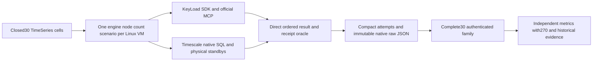

# ADR-059: separate native intensive TimeSeries family

Status: Accepted staged implementation contract; native evidence pending.
Owner: KeyLoad integration lead. Canonical feature: BenchmarkComparisons.
Related: ADR050/052/056, ADR007/034/035/039/054 and CodeQuality ADR033.
Requirements REQ-BC-059..064; criteria AC-TSI-001..008 in
[acceptance](../../isolated-timeseries.acceptance.md); ordered roles/join/checklist
in [plan](../../isolated-timeseries.plan.md). Owner directs serious isolated Linux
native1/2/3-node workloads, one database/scenario per runner and measured site data.

## Decision

Add a distinct30-cell family for KeyLoad and TimescaleDB ×native1/2/3 nodes ×
Append/RawRangeRead/Latest/Aggregate/Windows. Six private preflights establish
actual native image/topology/public correctness before the full measured family.
Keep the existing270-cell protocol and historical48-sample/library schema1 route
unchanged. An in-memory library is not a native node target; a single native
server is not relabelled as a cluster. Product default and release topology isRF3.

Shared seed is4096 exactly specified microsecond-aligned UTC samples with
out-of-order insertion, timestamp ties, gaps, quarter values and persisted
sequences1..4096. Compare actual returned timestamp/sequence order directly.
The accepted profile has16 workers,5 repetitions,256 warmups per repetition,
10000 measured operations and30s per-call deadlines. Append means one sample in
one acknowledged commit, with fresh warmup/measured series for each repetition;
concurrent revision comes from actual receipts. No measured retry.

Validate and release each actual decoded output after its latency clock, retaining
at most16 complete responses and50000 compact attempts. Repetition wall throughput
includes this bounded validation/backpressure; report validation overhead and the
different load model explicitly. Never buffer millions of returned samples or
reuse the270 family's excluded-validation throughput denominator. Input/oracle
construction, seeding, readiness and warmup remain outside the measured interval.

KeyLoad preserves benchmark RF1/RF2/RF3 opt-in/guard, node-local store/journal/apply
ownership, separate request grain and persisted authority. New public negatives
execute actual SDK/MCP operations. Legacy client-synthesized error/hash behaviour
cannot qualify the new route and is retained only as historical regression.

Timescale uses the existing digest-pinned2.30.2-pg18 image. Native image
entrypoint/user-switch/PGDATA compatibility must be observed before bootstrap
implementation; current shared script assumptions are not proof of compatibility
or an observed defect. Root alone parameterizes primary DNS and native shared
bootstrap. One primary plus0/1/2 physical standbys, fsync/on and synchronous commit
establish ACK1/2/2; separately observe1/2/3 copies through flush/replay/data readback.
No automatic failover or read scaling claim. Reuse real private schema owner
marker, transaction/search-path and cleanup. Actual SQL implements inclusive raw,
latest tie order, complete half-open aggregates and dense/clamped anchored windows.
Native SQLSTATE/empty negative outcomes remain PostgreSQL facts, not fake KeyLoad
errors. Owned counter/identity SQL details are frozen before their worker starts.

## Ordered implementation contract

1. TS005 root freezes scope/acceptance/this ADR/map and reads the actual relevant
   full GitHub baseline after the plan is prepared. Every failing test becomes a
   tracked root-cause/fix item. Source builds do not satisfy runtime baseline.
2. TS006 root approves exact internal operation/result/target constructor packet;
   disjoint domain worker owns only NEW TimeSeriesIntensive* under Comparisons
   TimeSeries/Intensive and matching NEW UnitTests. Tests precede seed/oracle/bounded
   timing implementation; no public product API or old wire change.
3. TS007 genuine pinned-image facts precede native bootstrap writes. Disjoint NEW
   IsolatedTimeSeries* resources/tests; root serialized ownership of existing
   primary script/context/selector/image/host composition. Model tests accompany
   native role/copy/ACK/permission tests; models alone are not cluster proof.
4. TS008K NEW KeyLoadTimeSeriesIntensive*/public SDK/MCP files and TS008T NEW
   TimescaleTimeSeriesIntensive*/native SQL/ownership/tests consume the approved
   internal target contract. Root freezes native SQL identity/counter/transaction
   details before TS008T. Workers stop on missing contract/upstream defect/overlap.
5. TS009 root freezes a distinct closed family JSON/plan/raw/proof/projection and
   actual job/artifact/image/source contract before a disjoint NEW family tooling
   worker begins. Root owns shared selectors/workflows/collectors; all6 preflight
   and30 measured jobs receive independent Linux VMs. Nothing relaxes270 checks.
6. TS010 only starts from complete authenticated native30 evidence; bounded NEW
   family site modules/tests, root existing source/coverage/Pages joins. Retain
   all legacy/270 tests/thresholds, original hashes and independent source facts.
7. TS011 root reviews every complete diff and combined repository state, runs
   exact-SHA required native checks, separate genuine matched coverage, complete
  30/270/site/Chrome/no-skip/freshness/provider/live proof and honest status docs.

Every delegated packet includes goal/AC/exact files/model/permissions/dependencies,
approved APIs/test strategy/forbidden changes/artifacts/escalation conditions.
Workers are disjoint; root owns all shared files/central configuration/solution/
workflow/docs and integration. Completed source is not a completed task; blocked
or partial workers never unblock dependants. No local qualification, fake target,
test skip, unpublished dependency reference, suppressed rule or credential leak.

## Migration, rollout, rollback and evidence

No product persistence/API migration. Add explicit timeseries-intensive profile,
typed target/node/scenario/phase; reject before allocation. Keep productionRF3,
legacy timeseries,270/old native schemas and immutable evidence. Family namespace
and owned data are unique per cell; rollback stops/removes only new additive
routes/resources after owned cleanup. Missing/invalid family data blocks its
publication; no latest-pointer or guarantee rewrite. Publish only actual qualified
projection/source/hash facts with complete family freshness and least permissions.

Testing is acceptance-derived pure independent corpus/oracle plus real native
SDK/official MCP/Npgsql/Aspire/Docker/process/Node/browser flows in GitHub only.
Required solution/analyzer/format/governance/normal+scalar/recovery/RF3/coverage,
six preflights/all30/full site/provider/live evidence maps to AC-TSI-001..008.
Instrumentation is separate from measured images/cohorts. Retain exact SHA,
run/job/attempt URLs, images, raw JSON and receipts. Do not mark Implemented until
all tests/docs/migration/evidence exist; no speed/SIMD/durability/readiness claim
from the design or source compilation.

## TS007F native image feasibility packet

Root approves only NEW TimeSeriesIntensivePinnedImage* TUnit/helper files under
tests/KeyLoad.ComparisonTests/Features/BenchmarkComparisons/TimeSeries/Intensive.
No product/resource/bootstrap/legacy changes. A separate Linux job uses only the
accepted Timescale image and real Docker CLI, with actual own-main GitHub SHA/run/
attempt/repository context. Pull the exact tag+digest; inspect its actual config
ID, RepoDigests, OS/architecture, entrypoint/cmd/default-user/env. Retain these
facts and native tool/path/OS/user observations in bounded JSON and command logs.
The real ephemeral probe overrides user0 only to test the required bootstrap
permissions, selects an actually present gosu or su-exec, invokes it as postgres,
creates the proposed PG18 path and proves the postgres user can write it. Require
actual PostgreSQL major18, executable native entrypoint, postgres/pg_basebackup/
pg_isready/timeout and a functioning user-switch command. These are image facts,
not native replication, mounted-volume readiness or performance qualification.
Use no fixture transport, host data bind, service double or inferred image lineage.

Pull deadline600s, other native commands30s, output at most1MiB per stream and
JSON at most1MiB. Every process is observed/reaped; each independent cleanup gets
30s. A unique cell-owned probe container is removed even when CLI cancellation
occurs; never prune or remove unrelated Docker resources. Preserve the original
failure and independent cleanup diagnostics. Missing actual GitHub/Docker/image
inputs fail, no skip. Root owns the dedicated workflow invocation/artifact receipt
and exact source verification; worker has no Git/local-runtime permission.
Source build/static diff is allowed. Genuine job/TRX/inspection/log artifacts are
required before root selects the bootstrap command or writes TS007 resources.

## TS006 internal domain packet

All new domain types remain internal in the existing Comparisons assembly.
Root alone adds a narrowly scoped KeyLoad.AppHost friend and routes
Benchmarks:Profile=timeseries-intensive before the old270 target selector;
EvidenceProfile=intensive-timeseries-4096-c16 is a distinct frozen load profile.
Separate target/node/scenario/phase enums reject drift before allocation; never
expand old Scenario or ComparisonWorkerSelection. The accepted selection carries
KeyLoad/TimescaleDB, node1..3, Append/RawRangeRead/Latest/Aggregate/Windows and
preflight/intensive. All existing old routes remain byte/semantic compatible.

ITimeSeriesIntensiveTarget binds one private partition/schema, one set and actual
topology at construction. InitializeAsync/SeedAsync are untimed; SeedAsync accepts
logical series ID, an immutable SampleData array and canonical tags. AppendAsync
accepts that series, Guid command ID, one SampleData, tags and cancellation;
returns a TimeSeriesIntensiveAppendReceipt with actual command ID and sequence.
ReadAsync returns ImmutableArray<SampleRecord> for inclusive From/Until/limit;
LatestAsync returns SampleRecord? for optional inclusive AtOrBefore;
AggregateAsync returns SampleAggregate for From/UntilExclusive/MaxSamples;
WindowsAsync returns ImmutableArray<SampleAggregateWindow> for From/end/width/
MaxSamples/MaxWindows. These reuse current product result DTOs; real SDK errors
remain declared typed failures and native Npgsql errors preserve SQLSTATE.
No adapter may synthesize expected negative codes. DisposeAsync releases only
owned clients/schema through bounded lifecycle; root host owns actual resources.

Seeds and query oracles use the exact acceptance formulas. Appended value is
((k+1729)%31-15)+(k%16-8)/4.0, EventId a- plus five invariant decimal digits,
logical seed/warm-rN/measured-rN series and existing SHA-first16 Guid convention.
Warmup executes k0..255 using16 bounded clients per repetition. Intensive overall
deadline90min, preflight30min; outer jobs150/60min, every call30s/teardown30s.
Client CPU/allocations/RSS/GC are mandatory; server CPU/RSS/container observations
are native. Managed server allocations/GC may be unavailable with explicit reason
for nonmanaged/native targets, never fabricated zero. Return full arrays only
until synchronous assertion/digest completes, at most16 retained responses.

Digest v1 uses UTF8 domain/version framing, big-endian length-prefixed UTF8 strings,
Int64 UTC ticks/sequences/counts and IEEE754 bit-pattern Int64 numbers. Strings
have UInt32 byte lengths; arrays UInt32 element counts, optional values byte0/1.
Workload hash covers seed insertion order/event/ticks/value/sequence/canonical
tags and all measured/warmup logical plans including profile/caps. Exclude private
run, partition/schema and command GUID. Result hash covers actual returned order,
identities/timestamps/sequences/value/tags or aggregate/window fields. Aggregate
average uses numeric absolute1e-12 assertion; its actual bit digest is retained
and is not required to equal another engine's allowed rounded average digest.
Exact framing labels/field order are frozen in the worker packet before code.
Independent source-only tests derive expected data/digest independently and
exercise corrupted order/missing/extra/ties/empty/limits, never a fake target.

## TS008T native SQL and ownership packet

Root approves an internal InitializeOwnedAsync(connectionString,schemaName,
ownerId,Func<NpgsqlConnection,NpgsqlTransaction,CancellationToken,Task> installer,
cancellationToken) in the current TimescaleSchemaLifecycle. The original
InitializeAsync delegates to the same marker/extension/transaction/confirmation
flow with its unchanged legacy sample installer. Only source-owned installers
are accepted; no caller/network SQL or guessed cleanup authority. Install tables
and function in that transaction; return ownership only after marker confirmation.
Keep existing search-path validation and locked marker check before DROP intact.

The new installer owns series_counter (set_name,series_id primary key and
nonnegative last_sequence), event_identity (scoped EventId primary key plus unique
scoped sequence and native timestamp/value/jsonb identity fields), and samples
hypertable (primary key set_name,series_id,sample_time,event_id; finite float8
value, sequence and tags). The query index starts with set_name,series_id,
sample_time,sample_sequence. No unsupported hypertable FK assumption or legacy
time/event-only key. Prepare all eleven logical series counter rows untimed.

Source-controlled SECURITY INVOKER append function uses typed set/series/command
UUID/sample JSONB/tags parameters and a confined validated private search path.
Lock series_counter FOR UPDATE. Iterate input in supplied order; identical scoped
EventId with equal UTC timestamp/native float8/jsonb fields reuses its original
sequence without increment. Changed content raises actual SQLSTATE23505 with
fixed safe detail; invalid count/nonfinite/native bounds raise declared native
22023/check errors. Fresh events increment the checked counter and insert both
identity and sample. One Npgsql transaction covers the entire batch; rollback
restores counter/tables, including prior items in a conflicting batch. Return the
actual server-returned command UUID/sequence; acknowledge only after CommitAsync
success. Unknown commit outcome fails without retry. UUID is a correlation
parameter; this Timescale adapter does not claim durable command-ID replay.
Native per-event dedup equality is explicit and does not claim universal KeyLoad
fingerprint equivalence. Fresh measured appends always have unique event/command
identities, so each acknowledged receipt identifies its actual committed sequence.

Every reader is parameterized and scoped to the exact set/series. Raw uses native
inclusive >=From/<=Until, timestamp then sequence ORDER BY and LIMIT. Latest uses
optional inclusive cut and descending timestamp/sequence LIMIT1. Aggregate uses
half-open >=From/<Until and complete COUNT/SUM/MIN/MAX/AVG; only SUM defaults0,
empty extrema/average remain null. Windows computes native ceiling(span/width),
generates ordinal From-anchored slots, clamps each end, LEFT JOINs half-open
samples, COUNT(sample_value), groups/orders ordinal and keeps empty slots. No
epoch time_bucket substitute or extra slot at Until. Explicit positive plans
remain within their bounds; an overflow must fail rather than publish truncation.
Negative inverted native SQL ranges retain actual empty/native-error semantics.

Full seed readback is16 predetermined ranges of16 groups, each256 rows, ending
at each chunk's final group's minute3; never one4096-row raw request. Append
readback is10 disjoint1000-millisecond ranges per repetition, with exact event/
value/tags and sequence matched to the actual receipts. Warmup has one256-row
range per repetition. A4096-row full aggregate is allowed within the10000 cap.

Disjoint worker owns NEW TimescaleTimeSeriesIntensiveSchema/AppendSql/ReadSql/
Session/Target and matching native tests. Root alone edits the common initializer
and native topology/bootstrap/profile/host composition. Actual1/2/3 SQL negative,
transactional rollback/dedup/concurrency/ordering/marker/copy tests are required;
DDL and source compilation alone cannot authorize native performance claims.

TS007F actual pinned-image feasibility passes at890047996, run37086903497/
job111098989273,1/1 with no skips. The exact native evidence is
[image receipt](../implementation/timeseries-image-qualification-37086903497.json).
Observed image: Linux/amd64 Alpine3.23.6, PostgreSQL18.6, gosu at
/usr/local/bin/gosu, postgres UID70 and actual writable PGDATA18/docker. Owned
container removal and retained command hashes pass. This resolves the native
gosu/path assumption only; Timescale extension installation, real1/2/3 database
bootstrap/ACK/copies and complete intensive family remain unqualified.
