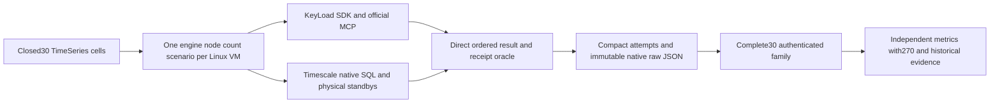

# ADR-059: separate native intensive TimeSeries family

Status: Accepted staged implementation contract; native evidence pending.
Owner: KeyLoad integration lead. Canonical feature: BenchmarkComparisons.
Related: ADR050/052/056, ADR007/034/035/039/054 and CodeQuality ADR033.
Requirements REQ-BC-059..064; criteria AC-TSI-001..008 in
[acceptance](../../isolated-timeseries.acceptance.md); ordered roles/join/checklist
in [plan](../../isolated-timeseries.plan.md). Owner directs serious isolated Linux
native1/2/3-node workloads, one database/scenario per runner and measured site data.

## Decision

Add a distinct30-cell family for KeyLoad and TimescaleDB ×native1/2/3 nodes ×
Append/RawRangeRead/Latest/Aggregate/Windows. Six private preflights establish
actual native image/topology/public correctness before the full measured family.
Keep the existing270-cell protocol and historical48-sample/library schema1 route
unchanged. An in-memory library is not a native node target; a single native
server is not relabelled as a cluster. Product default and release topology isRF3.

Shared seed is4096 exactly specified microsecond-aligned UTC samples with
out-of-order insertion, timestamp ties, gaps, quarter values and persisted
sequences1..4096. Compare actual returned timestamp/sequence order directly.
The accepted profile has16 workers,5 repetitions,256 warmups per repetition,
10000 measured operations and30s per-call deadlines. Append means one sample in
one acknowledged commit, with fresh warmup/measured series for each repetition;
concurrent revision comes from actual receipts. No measured retry.

Validate and release each actual decoded output after its latency clock, retaining
at most16 complete responses and50000 compact attempts. Repetition wall throughput
includes this bounded validation/backpressure; report validation overhead and the
different load model explicitly. Never buffer millions of returned samples or
reuse the270 family's excluded-validation throughput denominator. Input/oracle
construction, seeding, readiness and warmup remain outside the measured interval.

KeyLoad preserves benchmark RF1/RF2/RF3 opt-in/guard, node-local store/journal/apply
ownership, separate request grain and persisted authority. New public negatives
execute actual SDK/MCP operations. Legacy client-synthesized error/hash behaviour
cannot qualify the new route and is retained only as historical regression.

Timescale uses the existing digest-pinned2.30.2-pg18 image. Native image
entrypoint/user-switch/PGDATA compatibility must be observed before bootstrap
implementation; current shared script assumptions are not proof of compatibility
or an observed defect. Root alone parameterizes primary DNS and native shared
bootstrap. One primary plus0/1/2 physical standbys, fsync/on and synchronous commit
establish ACK1/2/2; separately observe1/2/3 copies through flush/replay/data readback.
No automatic failover or read scaling claim. Reuse real private schema owner
marker, transaction/search-path and cleanup. Actual SQL implements inclusive raw,
latest tie order, complete half-open aggregates and dense/clamped anchored windows.
Native SQLSTATE/empty negative outcomes remain PostgreSQL facts, not fake KeyLoad
errors. Owned counter/identity SQL details are frozen before their worker starts.

## Ordered implementation contract

1. TS005 root freezes scope/acceptance/this ADR/map and reads the actual relevant
   full GitHub baseline after the plan is prepared. Every failing test becomes a
   tracked root-cause/fix item. Source builds do not satisfy runtime baseline.
2. TS006 root approves exact internal operation/result/target constructor packet;
   disjoint domain worker owns only NEW TimeSeriesIntensive* under Comparisons
   TimeSeries/Intensive and matching NEW UnitTests. Tests precede seed/oracle/bounded
   timing implementation; no public product API or old wire change.
3. TS007 genuine pinned-image facts precede native bootstrap writes. Disjoint NEW
   IsolatedTimeSeries* resources/tests; root serialized ownership of existing
   primary script/context/selector/image/host composition. Model tests accompany
   native role/copy/ACK/permission tests; models alone are not cluster proof.
4. TS008K NEW KeyLoadTimeSeriesIntensive*/public SDK/MCP files and TS008T NEW
   TimescaleTimeSeriesIntensive*/native SQL/ownership/tests consume the approved
   internal target contract. Root freezes native SQL identity/counter/transaction
   details before TS008T. Workers stop on missing contract/upstream defect/overlap.
5. TS009 root freezes a distinct closed family JSON/plan/raw/proof/projection and
   actual job/artifact/image/source contract before a disjoint NEW family tooling
   worker begins. Root owns shared selectors/workflows/collectors; all6 preflight
   and30 measured jobs receive independent Linux VMs. Nothing relaxes270 checks.
6. TS010 only starts from complete authenticated native30 evidence; bounded NEW
   family site modules/tests, root existing source/coverage/Pages joins. Retain
   all legacy/270 tests/thresholds, original hashes and independent source facts.
7. TS011 root reviews every complete diff and combined repository state, runs
   exact-SHA required native checks, separate genuine matched coverage, complete
  30/270/site/Chrome/no-skip/freshness/provider/live proof and honest status docs.

Every delegated packet includes goal/AC/exact files/model/permissions/dependencies,
approved APIs/test strategy/forbidden changes/artifacts/escalation conditions.
Workers are disjoint; root owns all shared files/central configuration/solution/
workflow/docs and integration. Completed source is not a completed task; blocked
or partial workers never unblock dependants. No local qualification, fake target,
test skip, unpublished dependency reference, suppressed rule or credential leak.

## Migration, rollout, rollback and evidence

No product persistence/API migration. Add explicit timeseries-intensive profile,
typed target/node/scenario/phase; reject before allocation. Keep productionRF3,
legacy timeseries,270/old native schemas and immutable evidence. Family namespace
and owned data are unique per cell; rollback stops/removes only new additive
routes/resources after owned cleanup. Missing/invalid family data blocks its
publication; no latest-pointer or guarantee rewrite. Publish only actual qualified
projection/source/hash facts with complete family freshness and least permissions.

Testing is acceptance-derived pure independent corpus/oracle plus real native
SDK/official MCP/Npgsql/Aspire/Docker/process/Node/browser flows in GitHub only.
Required solution/analyzer/format/governance/normal+scalar/recovery/RF3/coverage,
six preflights/all30/full site/provider/live evidence maps to AC-TSI-001..008.
Instrumentation is separate from measured images/cohorts. Retain exact SHA,
run/job/attempt URLs, images, raw JSON and receipts. Do not mark Implemented until
all tests/docs/migration/evidence exist; no speed/SIMD/durability/readiness claim
from the design or source compilation.

## TS007F native image feasibility packet

Root approves only NEW TimeSeriesIntensivePinnedImage* TUnit/helper files under
tests/KeyLoad.ComparisonTests/Features/BenchmarkComparisons/TimeSeries/Intensive.
No product/resource/bootstrap/legacy changes. A separate Linux job uses only the
accepted Timescale image and real Docker CLI, with actual own-main GitHub SHA/run/
attempt/repository context. Pull the exact tag+digest; inspect its actual config
ID, RepoDigests, OS/architecture, entrypoint/cmd/default-user/env. Retain these
facts and native tool/path/OS/user observations in bounded JSON and command logs.
The real ephemeral probe overrides user0 only to test the required bootstrap
permissions, selects an actually present gosu or su-exec, invokes it as postgres,
creates the proposed PG18 path and proves the postgres user can write it. Require
actual PostgreSQL major18, executable native entrypoint, postgres/pg_basebackup/
pg_isready/timeout and a functioning user-switch command. These are image facts,
not native replication, mounted-volume readiness or performance qualification.
Use no fixture transport, host data bind, service double or inferred image lineage.

Pull deadline600s, other native commands30s, output at most1MiB per stream and
JSON at most1MiB. Every process is observed/reaped; each independent cleanup gets
30s. A unique cell-owned probe container is removed even when CLI cancellation
occurs; never prune or remove unrelated Docker resources. Preserve the original
failure and independent cleanup diagnostics. Missing actual GitHub/Docker/image
inputs fail, no skip. Root owns the dedicated workflow invocation/artifact receipt
and exact source verification; worker has no Git/local-runtime permission.
Source build/static diff is allowed. Genuine job/TRX/inspection/log artifacts are
required before root selects the bootstrap command or writes TS007 resources.

## TS006 internal domain packet

All new domain types remain internal in the existing Comparisons assembly.
Root alone adds a narrowly scoped KeyLoad.AppHost friend and routes
Benchmarks:Profile=timeseries-intensive before the old270 target selector;
EvidenceProfile=intensive-timeseries-4096-c16 is a distinct frozen load profile.
Separate target/node/scenario/phase enums reject drift before allocation; never
expand old Scenario or ComparisonWorkerSelection. The accepted selection carries
KeyLoad/TimescaleDB, node1..3, Append/RawRangeRead/Latest/Aggregate/Windows and
preflight/intensive. All existing old routes remain byte/semantic compatible.

ITimeSeriesIntensiveTarget binds one private partition/schema, one set and actual
topology at construction. InitializeAsync/SeedAsync are untimed; SeedAsync accepts
logical series ID, an immutable SampleData array and canonical tags. AppendAsync
accepts that series, Guid command ID, one SampleData, tags and cancellation;
returns a TimeSeriesIntensiveAppendReceipt with actual command ID and sequence.
ReadAsync returns ImmutableArray<SampleRecord> for inclusive From/Until/limit;
LatestAsync returns SampleRecord? for optional inclusive AtOrBefore;
AggregateAsync returns SampleAggregate for From/UntilExclusive/MaxSamples;
WindowsAsync returns ImmutableArray<SampleAggregateWindow> for From/end/width/
MaxSamples/MaxWindows. These reuse current product result DTOs; real SDK errors
remain declared typed failures and native Npgsql errors preserve SQLSTATE.
No adapter may synthesize expected negative codes. DisposeAsync releases only
owned clients/schema through bounded lifecycle; root host owns actual resources.

Seeds and query oracles use the exact acceptance formulas. Appended value is
((k+1729)%31-15)+(k%16-8)/4.0, EventId a- plus five invariant decimal digits,
logical seed/warm-rN/measured-rN series and existing SHA-first16 Guid convention.
Warmup executes k0..255 using16 bounded clients per repetition. Intensive overall
deadline90min, preflight30min; outer jobs150/60min, every call30s/teardown30s.
Client CPU/allocations/RSS/GC are mandatory; server CPU/RSS/container observations
are native. Managed server allocations/GC may be unavailable with explicit reason
for nonmanaged/native targets, never fabricated zero. Return full arrays only
until synchronous assertion/digest completes, at most16 retained responses.

Digest v1 uses UTF8 domain/version framing, big-endian length-prefixed UTF8 strings,
Int64 UTC ticks/sequences/counts and IEEE754 bit-pattern Int64 numbers. Strings
have UInt32 byte lengths; arrays UInt32 element counts, optional values byte0/1.
Workload hash covers seed insertion order/event/ticks/value/sequence/canonical
tags and all measured/warmup logical plans including profile/caps. Exclude private
run, partition/schema and command GUID. Result hash covers actual returned order,
identities/timestamps/sequences/value/tags or aggregate/window fields. Aggregate
average uses numeric absolute1e-12 assertion; its actual bit digest is retained
and is not required to equal another engine's allowed rounded average digest.
Exact framing labels/field order are frozen in the worker packet before code.
Independent source-only tests derive expected data/digest independently and
exercise corrupted order/missing/extra/ties/empty/limits, never a fake target.

## TS008T native SQL and ownership packet

Root approves an internal InitializeOwnedAsync(connectionString,schemaName,
ownerId,Func<NpgsqlConnection,NpgsqlTransaction,CancellationToken,Task> installer,
cancellationToken) in the current TimescaleSchemaLifecycle. The original
InitializeAsync delegates to the same marker/extension/transaction/confirmation
flow with its unchanged legacy sample installer. Only source-owned installers
are accepted; no caller/network SQL or guessed cleanup authority. Install tables
and function in that transaction; return ownership only after marker confirmation.
Keep existing search-path validation and locked marker check before DROP intact.

The new installer owns series_counter (set_name,series_id primary key and
nonnegative last_sequence), event_identity (scoped EventId primary key plus unique
scoped sequence and native timestamp/value/jsonb identity fields), and samples
hypertable (primary key set_name,series_id,sample_time,event_id; finite float8
value, sequence and tags). The query index starts with set_name,series_id,
sample_time,sample_sequence. No unsupported hypertable FK assumption or legacy
time/event-only key. Prepare all eleven logical series counter rows untimed.

Source-controlled SECURITY INVOKER append function uses typed set/series/command
UUID/sample JSONB/tags parameters and a confined validated private search path.
Lock series_counter FOR UPDATE. Iterate input in supplied order; identical scoped
EventId with equal UTC timestamp/native float8/jsonb fields reuses its original
sequence without increment. Changed content raises actual SQLSTATE23505 with
fixed safe detail; invalid count/nonfinite/native bounds raise declared native
22023/check errors. Fresh events increment the checked counter and insert both
identity and sample. One Npgsql transaction covers the entire batch; rollback
restores counter/tables, including prior items in a conflicting batch. Return the
actual server-returned command UUID/sequence; acknowledge only after CommitAsync
success. Unknown commit outcome fails without retry. UUID is a correlation
parameter; this Timescale adapter does not claim durable command-ID replay.
Native per-event dedup equality is explicit and does not claim universal KeyLoad
fingerprint equivalence. Fresh measured appends always have unique event/command
identities, so each acknowledged receipt identifies its actual committed sequence.

Every reader is parameterized and scoped to the exact set/series. Raw uses native
inclusive >=From/<=Until, timestamp then sequence ORDER BY and LIMIT. Latest uses
optional inclusive cut and descending timestamp/sequence LIMIT1. Aggregate uses
half-open >=From/<Until and complete COUNT/SUM/MIN/MAX/AVG; only SUM defaults0,
empty extrema/average remain null. Windows computes native ceiling(span/width),
generates ordinal From-anchored slots, clamps each end, LEFT JOINs half-open
samples, COUNT(sample_value), groups/orders ordinal and keeps empty slots. No
epoch time_bucket substitute or extra slot at Until. Explicit positive plans
remain within their bounds; an overflow must fail rather than publish truncation.
Negative inverted native SQL ranges retain actual empty/native-error semantics.

Full seed readback is16 predetermined ranges of16 groups, each256 rows, ending
at each chunk's final group's minute3; never one4096-row raw request. Append
readback is10 disjoint1000-millisecond ranges per repetition, with exact event/
value/tags and sequence matched to the actual receipts. Warmup has one256-row
range per repetition. A4096-row full aggregate is allowed within the10000 cap.

Disjoint worker owns NEW TimescaleTimeSeriesIntensiveSchema/AppendSql/ReadSql/
Session/Target and matching native tests. Root alone edits the common initializer
and native topology/bootstrap/profile/host composition. Actual1/2/3 SQL negative,
transactional rollback/dedup/concurrency/ordering/marker/copy tests are required;
DDL and source compilation alone cannot authorize native performance claims.

TS007F actual pinned-image feasibility passes at890047996, run37086903497/
job111098989273,1/1 with no skips. The exact native evidence is
[image receipt](../implementation/timeseries-image-qualification-37086903497.json).
Observed image: Linux/amd64 Alpine3.23.6, PostgreSQL18.6, gosu at
/usr/local/bin/gosu, postgres UID70 and actual writable PGDATA18/docker. Owned
container removal and retained command hashes pass. This resolves the native
gosu/path assumption only; Timescale extension installation, real1/2/3 database
bootstrap/ACK/copies and complete intensive family remain unqualified.

## TS006C approved pure corpus, oracle and digest implementation packet

Root accepts AC-TSI-002/005/008 before writes. This source-only independent stage
may proceed while the separately tracked twelve270 native preflight failures
block adapters, measured-family and publication qualification. It cannot unblock
those native dependants. Internal pure types reuse existing SampleData,
SampleRecord, SampleAggregate and SampleAggregateWindow; no product/wire/selector
or old-family changes. Separate gRange=k%224 from gLatest=k%256. Inclusive seed
readback chunks cover16 groups/256 rows, and append chunks1000q..1000q+999ms.
Whole-series aggregate/count checks remain required because raw LIMIT can truncate.

Digest v1 labels are themselves UInt32-big-endian-length UTF8 strings. Every
string/array uses UInt32-big-endian byte length/element count; integers, ticks and
double IEEE754 bits use Int64-big-endian. Nullable values begin with byte0/1.
Header order: label domain, domain string, label version, string1. Domains are
keyload.timeseries-intensive.workload and keyload.timeseries-intensive.result.
raw/latest/aggregate/windows/append-receipt, with the suffix joined directly to
the result prefix. Every actual result preserves its returned array order.

Workload ordered labels: profile, randomSeed, epochUtcTicks, sampleCount,
operationCount, warmupCount, repetitionCount, concurrency, operationTimeoutTicks,
rawLimit, maxSamples, maxWindows, windowWidthTicks, averageToleranceBits,
seedInsertion, phasePlans, seedReadbacks, warmupReadbacks, measuredReadbacks.
Seed/sample ordered labels: seriesId, eventId, timestampUtcTicks, sequence,
valueBits, tags. This same order applies to seed insertion and result rows.
PhasePlans has51280 entries: repetition0..4, warmup then measured, ascending k.
Each entry binds labels repetition, phase, seriesId, index, commandPurpose,
appendSample, rawFromUtcTicks, rawUntilUtcTicks, latestAtOrBeforeUtcTicks,
aggregateFromUtcTicks, aggregateUntilExclusiveUtcTicks, windowsFromUtcTicks,
windowsUntilExclusiveUtcTicks. phase is warmup/measured; series is warm-rN/
measured-rN. commandPurpose=phase+":"+invariant repetition+":"+invariant index.
appendSample labels eventId, timestampUtcTicks, valueBits, tags. Query inputs
bind all five operations in one common hash; profile fields bind caps/width.
Readback entries bind seriesId, fromUtcTicks, untilUtcTicks, expectedCount;
seedReadbacks16, warmupReadbacks5, measuredReadbacks50, in natural q/repetition
order. No selected engine/node/scenario/private namespace/run/GUID/timing enters
the workload hash. Stream framing into IncrementalHash, retaining no full framed
workload or phase-plan array.

Raw result begins label samples/array count and sample fields. Latest begins
label sample/optional marker and sample fields. Aggregate fields: count, sumBits,
optional minimumBits, maximumBits, averageBits. Windows begins label windows/
array count; each row fields fromUtcTicks, optional untilExclusiveUtcTicks,
aggregate followed by aggregate fields. Receipt fields commandId lowercaseN
Guid string, sequence. Result hashes retain actual averages; allowed numerical
rounding does not imply cross-engine identical digest. Oracle aggregation uses
integer quarter-unit sums and compares finite actual statistics before tolerance.

Ordered stages and disjoint ownership: existing capable publisher_archive_review
authors acceptance-derived tests first and owns only NEW TimeSeriesIntensive*
files in Comparisons/Features/BenchmarkComparisons/TimeSeries/Intensive and NEW
TimeSeriesIntensive* tests/helpers in UnitTests/Features/BenchmarkComparisons/
TimeSeries/Intensive. Internal names are TimeSeriesIntensiveProfile, Corpus,
Plans, ReadPlan, Readback, Oracle, DigestWriter, ResultDigest, WorkloadDigest and
AppendReceipt. Split cohesive new prefixed helpers as numeric limits require.
No runner/target/interface/adapter/host/resource/shared file edits in this stage.
Root owns docs/integration/final review. Stop on framing/DTO/mathematical ambiguity,
shared-file need, upstream defect or scope change rather than guessing.

Tests independently derive seed formulas, exact endpoint counts and first/last
records; cover k224 independent latest/range, UTC/culture, direct raw order and
missing/extra/tie/corrupt/tag rejection, empty/null and finite tolerance. A separate
test reference framer verifies bytes/labels/endian/null/order and run independence;
it does not call production framing to construct expected digests. Existing
goldens include epoch639028224000000000, first s-004095/seq1/-13.25, last
s-000000/seq4096/7 and k0 aggregate512/84/-17/16.75/0.1640625, windows54/count512.
Source build/format/static review are permitted; all TUnit execution remains
GitHub full normal/scalar. No fake target, local test/load/runtime, Git/config/
package changes or exclusions. Native all30 later proves caller response flows.
Additive pure types have no persistence migration; rollback removes only this
coherent source/test unit. ADR remains Accepted until every required gate passes.

## TASK-ISO-TS006C-R accepted validation-cost and independent-oracle correction

AC-TSI-002/005/008 keep exact v1 bytes, formulas, ordering, finite numeric
semantics, seed/window boundaries and all caps. Source review identified repeated
JSONB whitespace normalization (two validator parses plus one framing parse
per row); this is a source cost estimate, not a measured performance claim.

NEW TimeSeriesIntensiveTagScope.cs retains only one last successfully validated
raw spelling and its canonical string within one synchronous validation/digest
call. Exact Profile.Tags returns directly; equivalent repeated spelling parses
once. Invalid/changed/extra tags or parse failure never replace a valid memo.
No dictionary/global cache/parser delegate/counter/retained JSON document/DTO.
RowVerifier accepts the scope and returns validated canonical tags after full
identity/order/sequence/time/value/finite checks. ResultFrames writes that exact
canonical result; no second parse. ResultDigest adds ValidatedRaw(expected,actual)
and ValidatedLatest(expected,actual), checking cardinality before streaming
validate/frame of each actual row. Standalone Oracle/digest methods use a local
scope. No response array/materialization/sort; future runner uses combined API
after latency stop, includes validation in wall time and releases response before
next call. Maximum16 live responses remains unchanged.

Disjoint same worker owns these NEW/previously authored TimeSeriesIntensive*
production and test files only. Introduce cohesive named frame/domain/version/
label/error/recipe constants within this owned new unit, preserving every
existing byte/formula; root literal/magic policy applies even without diagnostics.
No runner/interface/target/native host/shared or old-family writes.

Tests first: repeated516 JSONB spellings, alternating equivalent spellings,
corruption after memo hit, malformed/extra/changed tags, full identity/cardinality/
tie/default/null/NaN/Infinity failures, independent-reference combined hashes,
warmed genuine synchronous CI allocation comparison. NEW ReferenceOracle and
OracleReferenceTests independently derive every raw row/order over224 ranges,
all54 window absolute bounds/all statistics, latest256 groups/tie/gap/afterseed,
and all10000 append receipt identity/value/sequence mappings; reference code
must not call production profile/corpus/plans/oracle/framer for expected values.

Ordered source join: tests, bounded correction, root full review/scoped build/
format, exact-SHA full normal/scalar GitHub suites, later actual all30 native
responses. No local tests/runtime/benchmarks/Git or invented allocation/speed
result. Additive source rollback removes this coherent owned unit; no persistence
migration. ADR remains Accepted; source and native gates stay distinct.

## TASK-ISO-TS007B accepted compact runner implementation contract

Root accepts the completed read-only TS007R proposal for REQ-BC-060/062 and
AC-TSI-002/004/005/008. This is a bounded internal source stage; real SDK/Npgsql
adapters, native resources, family wire/host/workflow/site remain separate tasks.
The genuine source baseline is2f374fc34/run37093197474: full Release/format/
governance, normal/scalar units and63/63 RF3 currently pass; original recovery
counts and native preflights are still pending. Source success cannot unblock
missing native qualifications. Existing270/legacy interfaces and bytes stay fixed.

The exact internal ITimeSeriesIntensiveTarget signatures are the DTO-returning
TS006 interface above, with InitializeAsync(CancellationToken),
SeedAsync(string seriesId, ImmutableArray<SampleData> samples, string tagsJson,
CancellationToken), AppendAsync(string seriesId, Guid commandId, SampleData,
string tagsJson, CancellationToken), ReadAsync(string seriesId, DateTimeOffset
from, DateTimeOffset until, int limit, CancellationToken), LatestAsync(string
seriesId, DateTimeOffset? atOrBefore, CancellationToken), AggregateAsync(string
seriesId, DateTimeOffset from, DateTimeOffset? untilExclusive, int maxSamples,
CancellationToken), WindowsAsync(string seriesId, DateTimeOffset from,
DateTimeOffset? untilExclusive, TimeSpan width, int maxSamples, int maxWindows,
CancellationToken). Return types remain Task, Task, Task<AppendReceipt>,
Task<ImmutableArray<SampleRecord>>, Task<SampleRecord?>, Task<SampleAggregate>,
Task<ImmutableArray<SampleAggregateWindow>> respectively. One real target binds
one private namespace/set/topology, supports16 concurrent calls, and implements
IAsyncDisposable. The runner borrows it; the host calls disposal and owns resources.
Runner.RunAsync(target, closed Scenario, string runId, CancellationToken
cellCancellation) returns Task<TimeSeriesIntensiveRunResult>. Scenario values are
Append, RawRangeRead, Latest, Aggregate, Windows. Reject unknown selection before
allocation. No fallback, delegate transport, Supports or legacy runner changes.

Prepare one cell-local Expectations before timing:224 raw arrays/aggregates/window
arrays and256 latest values/cuts. Reuse exact pure oracles and separate range/latest
moduli. Prepare10000 append samples and one phase's command GUIDs outside clocks.
Initialize and seed16 sequential256-sample batches; verify all predetermined seed
readbacks plus whole-series aggregate/count. Each append phase starts with verified
empty raw/latest/count and uses its fresh warm-rN/measured-rN series. Other scenarios
read the same seed. Every phase releases exactly16 loops from one common start gate;
worker w owns indices w,w+16,... (625 measured or16 warmup calls each). No task per
attempt or detached verifier. A phase ledger publishes each completed compact value
once, directly to its unique index; duplicate/missing publication fails.

Retain one fixed50000 value-type attempt array; warmup uses a separate256-slot
phase ledger, verifies readbacks and discards it before measured timing. Attempt
fields are repetition/index/worker, monotonic latency and validation tick deltas,
closed outcome, nullable actual count, four-ulong32-byte digest, observed append
sequence and fixed failure value. No per-attempt retained response/hex/error/case
string. Temporary existing digest hex is consumed immediately; hex projection is
untimed/root-owned. Outcomes: NotStarted, Succeeded, TargetFailure, TransportFailure,
DeadlineExceeded, Cancelled, ValidationFailure, UnexpectedFailure. Fixed origin
values distinguish None, KeyLoad, PostgreSQL, HttpTransport, Client, Oracle,
Unexpected; optional ErrorCode/HTTP status are observed values only. Pack an actual
five-character ASCII0..9/A..Z SQLSTATE into a ulong; reject malformed codes instead
of guessing. Known exceptions map actual KeyLoadException.Code/StatusCode,
PostgresException.SqlState, HttpRequestException.StatusCode, native transport and
ComparisonFailureException facts. Generic failure stays unknown. No exception
message, credentials, SQL text or fabricated native code enters these records.

Directly await each original target Task under linked30-second cancellation.
Cancellation completion must include transport drain/decode/response release in
the real adapter. No WaitAsync-only timeout, detached client task or replacement
while an old response remains live. If deadline/cell cancellation was signalled
before observed completion, a late success cannot be recorded as Succeeded. Stop
starting calls after cell cancellation and observe all original loops. The host's
90-minute lifetime includes readiness and is never restarted by the runner; real
adapters/owned resource teardown must resolve stalled transport. Independent
30-second teardown and primary-error preservation remain host obligations.

Stop latency after actual complete decode/receipt or observed failure, then do
synchronous full verification/digest. Raw/latest use combined validated digest;
aggregate/windows preserve full finite numeric/boundary checks and actual bits.
Append validates real command identity, positive in-phase sequence bound and
Interlocked atomic sequence uniqueness. Complete successful phases prove the
1..N bijection; incomplete phases are unpublishable. ReceiptView reconstructs
already validated command identity and observed sequence for the existing
untimed readback oracle, without retaining receipt objects. Each attempt helper
returns only its compact value and releases the complete response graph before
the worker's next call. Maximum16 live decoded responses remains mandatory.

Ordinary measured errors retain actual latency and allow remaining planned calls
without retry; setup/warmup/cell cancellation leaves explicit NotStarted slots
without invented latency. Stop repetition wall only after every loop's verification
and compact publication; useful throughput includes that validation/backpressure.
Nearest-rank percentiles include all actual attempted latencies per repetition,
five-repetition medians use sorted index2. Preserve accumulated concurrent validation
time separately; incomplete/error repetitions cannot produce publishable success.
Final append readbacks and whole-series count remain mandatory and untimed; native
copy/image/process/resource/public-negative proof belongs to the host/adapters.

Execution owner publisher_archive_review writes only NEW TimeSeriesIntensive*
TargetContracts/Scenario/Attempt/Failure/Hash/Expectations/RunResult/Runner/
PhaseExecutor/AttemptExecutor/AttemptLedger/Summary/AppendValidation/ReceiptView
files and cohesive prefixed helpers under the current Comparisons Intensive slice,
and NEW matching UnitTests/Intensive tests. All existing files/shared interfaces/
resources/Git/config/docs are root-owned and forbidden in this worker. Tests first
independently derive every16-worker index partition, expectation preparation,
ledger completeness/default/duplicate rejection, sequence bijection, fixed
hash/SQLSTATE encoding and failed-latency/nearest-rank/five-summary statistics.
Algorithm input values are allowed; fake targets/injected clocks/runtime/local
tests are prohibited. Genuine concurrency/lifetime/deadline/drain/readback/wall
proof is explicitly deferred to real native SDK/Npgsql tests, not claimed by
these pure cases. Escalate undefined framing/public DTO/upstream defects/overlap
or scope changes. Root reviews all diffs and joins full solution source checks,
exact-SHA normal/scalar/recovery/RF3, later6 preflights/all30/native coverage.
Rollback removes only this additive coherent source unit; no persistence migration.
ADR remains Accepted until the complete implementation/evidence chain passes.

TS007B boundary refinement before worker repair: only ordinary nonfatal
exceptions become compact target/transport/validation/unknown records.
OutOfMemoryException, StackOverflowException and AccessViolationException
propagate; the owned phase cancels remaining loops and observes every original
Task before preserving the primary failure. Use a meaningful named semantic
filter with pure exception-input regression, never blanket suppression or an
always-true filter. Capture deadline/cell cancellation at observed response
completion and latency stop: a deadline firing during later verification does
not reclassify an on-time call. Preserve observed cardinality/receipt sequence
when validation fails; never invent a successful digest for invalid output.

## TASK-ISO-TS007B-D accepted original-task deadline classification repair

Independent TS007B-R source review finds setup/readback Stop/RequireSuccess
only runs after successful original await. A native task canceled by its own30s
linked deadline throws OCE while cell remains live and is mislabeled Cancelled.
Measured ResponseReader already captures observed completion correctly.
REQ-BC-062/064, AC-TSI-004/008 require distinct deadline/caller/native facts.

Root approves gates_audit disjoint writes ONLY the NEW TS007B source files
TimeSeriesIntensiveSetupExecutor/VerificationReader/CallScope/Failure, plus
NEW TimeSeriesIntensiveObservedFailureException and matching NEW pure UnitTests.
Catch original completion, stop its clock on fault too, exclude fatal causes
from replacement, and preserve the actual primary error and native code/status
when observed own-deadline or cell-cancellation overrides outcome. A narrow
internal observed-failure exception may carry only the closed outcome and
original InnerException transiently; compact result retains enum/native numeric
values only. No native error string/wrapper is retained in attempts/results.

Always await the original task; no WaitAsync, fake target/clock, retry or new
timeout. On-time native errors keep original failure classification; late
completion is DeadlineExceeded, caller cancellation is Cancelled, underlying
KeyLoad/Npgsql/HTTP facts remain actual, and fatal runtime errors propagate.
Pure exception/outcome inputs test this mapping first; genuine native blocked
operation/cancellation cases remain later6/30 gates. Worker does not edit
measured reader, old33 oracle files, other shared files, Git or runtime; root
reviews/full source gates and exact-SHA GitHub before qualification.

TS007B-D accepted independent review refinement before further writes: permit
also the NEW TS007B AttemptExecutor/ResponseReader/PhaseExecutor and existing
NEW pure SummaryTests. If cell cancellation is already observed at the reader's
pre-invocation entry decision, no target method is invoked and no clock starts;
return a nullable not-started result, stop that worker and retain initialized
NotStarted ledger slots with zero durations. Remove cancellation throw after
clock start and before invocation. Cancellation after the accepted entry
decision still invokes the original target with its linked token and records
that actual caller attempt/failure. Do not publish NotStarted as a completed
attempt or fabricate latency. Pure already-canceled token/state tests accompany
the bounded entry helper; real native boundary proof remains mandatory.

Strengthen the all-attempt percentile golden by placing the failed sample below
the asserted ranks (index17), so excluding it produces different p50/p95/p99
values. Current summarizer includes failures correctly; do not change its metric
contract. Native timing, budgets,16workers, compact storage and ownership stay
unchanged; root reviews the expanded frozen disjoint scope.

TS007B-D phase-evidence refinement before writes: also permit the NEW owned
RepetitionExecutor and narrowly scoped repetition-result/pure tests if needed.
After a measured phase has completed and original workers are drained, a
nonfatal append readback cancellation/failure must retain that already observed
wall/peak/measurement result with FinalVerified=false and actual failure. It
must not lose phase metadata merely because RunAsync throws before the runner
adds its repetition. Preserve warmup phase facts similarly where known; no
extra readback budget, retry, synthesized phase or successful verification.
Real cancellation/native proof remains required; pure phase-result/error inputs
can prove retention shape without a fake target/clock. Fatal faults propagate.
### TS007B-D root integration: known warmup evidence before measured entry

Final source review observes one additional instance of the same phase-evidence
finding: cancellation or failure during the empty measured-series readback can
occur after a successful warmup but before a measured phase result exists.
Root serially adds the acceptance-derived pure known-warmup/unknown-measured
criterion, then a nonfatal measured-entry boundary retaining the actual warmup
and original failure. Uncompleted measured metadata remains absent; existing
attempt storage and fatal original-task behavior remain unchanged. Root owns
only the frozen RepetitionExecutor and PhaseEvidenceTests join; the worker has
frozen those files and moved to read-only SQL planning. No service double or
new budget is introduced. AC-TSI-004/008, exact-SHA normal/scalar and native
SDK/Npgsql cancellation/phase evidence remain required.
### TS007B-D source exception contract

The real source compiler reports CA1032/CA1064 for the transient internal
observed-failure wrapper. Root keeps it internal as an InvalidOperationException
subtype with the three standard public constructors, consistent with internal
operation-failure exceptions. Standard construction has closed
UnexpectedFailure completion and no invented native facts; only Observe assigns
the accepted deadline/cancellation completion while retaining the real original
InnerException. A missing inner cause maps to Unexpected with null numeric
codes. Pure standard-constructor and original-cause tests precede the source
repair. No public contract, suppression, runtime filter bypass, deadline or
native failure semantics changes. Root owns these already frozen source/test
files during integration; exact-SHA native gates remain unchanged.
