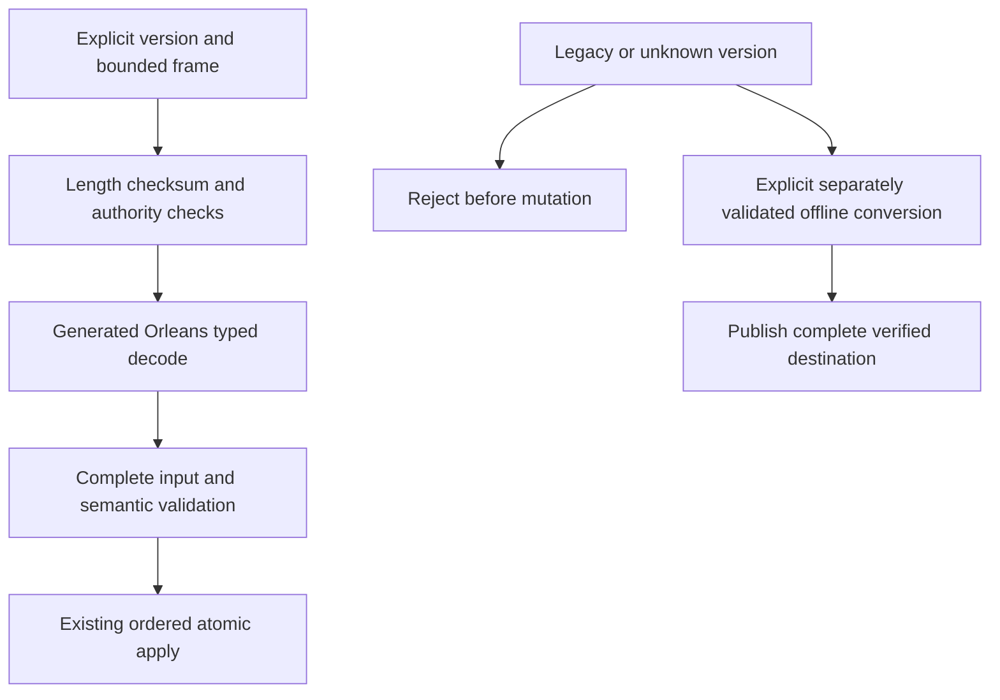

# ADR-060: generated native internal serialization

Status: Accepted. Date:2026-10-03. Owner: serialization integration lead.

## Decision and contracts

Implement REQ-IS-001..009 / AC-IS-001..009 using Orleans10.3.1 generated codecs, stable aliases and explicit immutable field IDs across all owned internal concrete DTOs. Use pooled native sessions and raw ReadOnlyMemory<byte> codecs; reject incomplete/trailing/malformed input and validate required semantic fields before effects. Do not use Orleans' optional JSON codec or a runtime JSON fallback. JSON DOM adapters represent structural ordered fields and original numeric lexemes; native DOM materialization is a concrete boundary, not a persisted JSON subtree.

Concrete contracts retained: public HTTP/MCP JSON; exact caller-owned JSON document strings; canonical operation/idempotency golden digests; sortable KeyCodec1; ZoneTree native ByteArraySerializer/WAL; fixed checksummed framing; raw blob chunks; HMAC/SHA; Cartograph archives. Native binary output must not be assumed canonical for unordered maps. Signed claims are versioned before changing signed bytes. Peer envelope field IDs/types remain stable; any changed meaning/authentication version is explicit.

## Ordered implementation and joins

TASK-IS-004: shared Abstractions native codec, generated DTO closure and JsonElement structural surrogate. TASK-IS-005: Core private records and every borrowed record/scalar reader/writer plus accounting and claims. TASK-IS-006: Replication native message/state/snapshot DTOs and exact batch accounting. TASK-IS-007: lead StorageRecovery checkpoint/identity and BackupRestore formats. TASK-IS-008: lead Orleans grain/membership/security joins. TASK-IS-009: explicit offline legacy conversion if required. TASK-IS-010/011: integrated enabled compile/static gates and exact-source canonical GitHub qualification. Shared contracts have one assigned owner; the lead reviews every join and retains unrelated changes.

## Format, migration and rollback

The old Compact operation preserves opaque JSON values; it is not a migration. New stores/metadata must have externally distinguishable format versions and fail closed on old identities before opening/mutating trees or truncating journals. Do not promote an old identity into the new record format. Retain stopped-source backups and exact matching old binaries. Any converter must classify every key/value, validate all source cuts/records, recalculate queue/topic/outbox encoded-byte charges and move replica hard state/entries/membership authority coherently into an independently staged destination. Unknown keys or failed/interrupted conversion prevent destination publication and preserve source. No converter means an explicit upgrade blocker, never silent recreation. Rollback uses untouched old copies before new writes; after new writes reverse conversion needs separate qualification.

## Security, tests and evidence

Authenticate exact peer scope and sender before replay-slot admission. Native header projection/skipping may not allocate decoded opaque payloads or grant a malformed message a nonce slot; control/data pools and all external capacity contracts stay exact. Existing state ownership, synchronous barriers, unknown outcomes, cancellation and caller-visible sanitized diagnostics remain.

Native codec/type-family/DOM tests, exact record byte accounting, actual metadata corruption/legacy fixtures, claims/tamper/version tests, replica admission allocation/malformed/scope tests, existing canonical hashes, real-process recovery and genuine RF3 SDK/MCP form the acceptance chain. Required commands are enabled solution restore/build and formatter/static governance, then canonical GitHub normal/scalar/recovery/analyzer/RF3 jobs. No local runtime tests, no removed assertions or invented load tests. Performance, full memory amplification, power-loss, endurance and production proof are separately unqualified. Publication is not attempted again without explicit approval after the previous automatic-review rejection.
