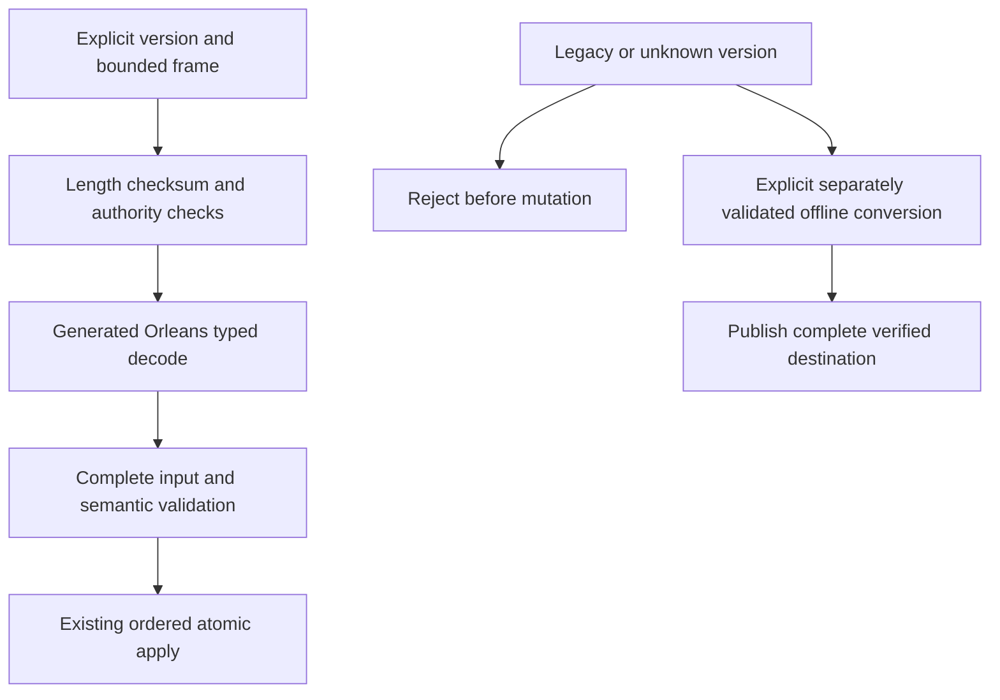

# ADR-060: generated native internal serialization

Status: Accepted. Date:2026-10-03. Owner: serialization integration lead.

## Decision and contracts

Implement REQ-IS-001..009 / AC-IS-001..009 using Orleans10.3.1 generated codecs, stable aliases and explicit immutable field IDs across all owned internal concrete DTOs. Use pooled native sessions and raw ReadOnlyMemory<byte> codecs; reject incomplete/trailing/malformed input and validate required semantic fields before effects. Do not use Orleans' optional JSON codec or a runtime JSON fallback. JSON DOM adapters represent structural ordered fields and original numeric lexemes; native DOM materialization is a concrete boundary, not a persisted JSON subtree.

Concrete contracts retained: public HTTP/MCP JSON; exact caller-owned JSON document strings; canonical operation/idempotency golden digests; sortable KeyCodec1; ZoneTree native ByteArraySerializer/WAL; fixed checksummed framing; raw blob chunks; HMAC/SHA; Cartograph archives. Native binary output must not be assumed canonical for unordered maps. Signed claims are versioned before changing signed bytes. Peer envelope field IDs/types remain stable; any changed meaning/authentication version is explicit.

## Ordered implementation and joins

TASK-IS-004: shared Abstractions native codec, generated DTO closure and JsonElement structural surrogate. TASK-IS-005: Core private records and every borrowed record/scalar reader/writer plus accounting and claims. TASK-IS-006: Replication native message/state/snapshot DTOs and exact batch accounting. TASK-IS-007: lead StorageRecovery checkpoint/identity and BackupRestore formats. TASK-IS-008: lead Orleans grain/membership/security joins. TASK-IS-009: explicit offline legacy conversion if required. TASK-IS-010/011: integrated enabled compile/static gates and exact-source canonical GitHub qualification. Shared contracts have one assigned owner; the lead reviews every join and retains unrelated changes.

## Format, migration and rollback

The old Compact operation preserves opaque JSON values; it is not a migration. New stores/metadata must have externally distinguishable format versions and fail closed on old identities before opening/mutating trees or truncating journals. Do not promote an old identity into the new record format. Retain stopped-source backups and exact matching old binaries. Any converter must classify every key/value, validate all source cuts/records, recalculate queue/topic/outbox encoded-byte charges and move replica hard state/entries/membership authority coherently into an independently staged destination. Unknown keys or failed/interrupted conversion prevent destination publication and preserve source. No converter means an explicit upgrade blocker, never silent recreation. Rollback uses untouched old copies before new writes; after new writes reverse conversion needs separate qualification.

## Security, tests and evidence

Authenticate exact peer scope and sender before replay-slot admission. Native header projection/skipping may not allocate decoded opaque payloads or grant a malformed message a nonce slot; control/data pools and all external capacity contracts stay exact. Existing state ownership, synchronous barriers, unknown outcomes, cancellation and caller-visible sanitized diagnostics remain.

Native codec/type-family/DOM tests, exact record byte accounting, actual metadata corruption/legacy fixtures, claims/tamper/version tests, replica admission allocation/malformed/scope tests, existing canonical hashes, real-process recovery and genuine RF3 SDK/MCP form the acceptance chain. Required commands are enabled solution restore/build and formatter/static governance, then canonical GitHub normal/scalar/recovery/analyzer/RF3 jobs. No local runtime tests, no removed assertions or invented load tests. Performance, full memory amplification, power-loss, endurance and production proof are separately unqualified. Publication is not attempted again without explicit approval after the previous automatic-review rejection.

## Resumption repair contract, 2026-10-03

The owner directs continuation, concrete implementation and GitHub qualification
after reviewing the held candidate. TASK-IS-R4A implements missing-identity
fail-closed creation with an actual acquired owner handle and real-file regressions
(AC-IS-004/008). TASK-IS-R4B verifies the complete backup journal and manifest cut
before destination publication, using existing checkpoint and atomic WAL readers,
no source modification/truncation and bounded per-frame memory (AC-IS-004).
The restore owner retains explicit new identity/incarnation/signing authority and
paused dispatch; malformed or incompatible backups leave destination unchanged.
Native scalar/count/type/reference/depth/work validation repairs stay in the shared
InternalSerialization slice and preserve official generated wire encoding.
No old-store conversion, running-cluster rollout or product release is inferred
from development-source installation. Existing required qualification remains.

TASK-IS-R4C shared preflight retains generated encoding and official scalar
readers. It validates expected root compatibility before dynamic dispatch, walks
wire tags iteratively, rejects invalid reference IDs and requires native collection
counts/completion before allocation. Wire depth is bounded at264 (four structural
array/property/node wrappers per existing64-level semantic depth plus8 envelope
levels); this is an explicit safety fence, not full heap qualification.
TASK-IS-R4D validates semantic graphs once per applicable nullability context,
rejects cycles/depth overflow and bounds DOM expansion before materialization.
DOM retains64 semantic levels and a32MiB encoded output ceiling corresponding to
the existing maximum configurable public HTTP body. Actual lower domain/public
admission and reply budgets still apply; these structural fences never grant
capacity or replace required heap, allocation and performance measurements.
Each worker owns disjoint code/tests; only lead owns this shared limits file.

Final source closure removes OperationResult.Get's internal JSON fallback. Typed
Core results and retained outcomes carry NativeValue; JSON-only or absent typed
results fail with Corruption, while stored domain errors retain precedence.
The already-applied/no-retained-outcome sentinel remains an empty internal result.
HTTP/MCP still materialize typed JSON at their existing boundaries. Existing
public JSON text/unicode/ownership/allocation regressions call JsonDefaults
directly with unchanged thresholds; native result rejection/roundtrip tests cover
the removed fallback under AC-IS-001/003. No test is skipped or removed.

Native v2 evolution accepts bounded unknown fields but rejects a known typed
reference to an opaque omitted-type unknown field. Orleans otherwise replays that
field under the later expected type, potentially bypassing the first count scan.
No homogeneous v2 generated producer requires this ambiguous deferred decode;
support for it requires a separately specified bounded replay contract. Ordinary
known-schema references remain supported. AC-IS-002 includes the concrete hidden
underfilled float-array reference regression before native allocation.

TASK-IS-R4E aligns replica inspection and malformed fixtures with Orleans10.3.1:
explicit property Ids are body members, preceded by the empty constructor scope.
The Server authentication projection follows the same genuine generated record
shape. Official generated writer-to-inspector positive tests cover these joins;
hand-authored malformed tests retain exactly their intended corruption and bounds.

The inspected native type closure is intentionally limited to owned generated
KeyLoad DTOs, existing scalar/date/byte/JSON DOM codecs, rank-one arrays, and the
exact collection/surrogate shapes used by the contracts (ImmutableArray, List,
Dictionary, KeyValuePair and Memory/ReadOnlyMemory). Other System surrogates and
derived collection codecs fail closed before generated allocation, even below an
object-typed field. Extending this closure requires a native shape specification,
preflight/count/reference tests and homogeneous compatibility qualification.
This is an internal concrete contract, not arbitrary Orleans codec compatibility.

## Accepted qualification repair contract

R11/R12 preserve AC-IS002/004/007 and the existing formats. Actual GitHub
run37120641864 revealed nullable metadata construction, native reader exhaustion
classification and stale fixtures. Native graph annotations must use .NET10's
already-unwrapped Nullable<T> metadata; only genuine Orleans Reader buffer
exhaustion joins coded corruption, while programming/session exceptions escape.

R12F validates the complete recoverable journal/checkpoint prefix before opening
ZoneTree's native provider. Under the already acquired node owner lock, use the
same owned journal handle and bounded current codecs to verify complete frames,
checksums, sequence, checkpoint metadata/footer and record semantics without apply,
truncation or tree writes. Leave a permitted incomplete current tail untouched
during preflight; ordinary ordered recovery alone applies/truncates it afterward.
Unsupported complete legacy frames and complete corruption must fail without
changing journal/identity/provider files. Reset the journal position before
ordinary recovery; keep startup preflight distinct from acknowledged write gates.

StorageRecovery owns the initializer and new preflight helper; UnitTests owns
NativeStoreOpenPreflight regressions using real files plus unchanged historical
file-preservation assertions. Root owns integration/docs; wire worker owns reader
normalization; no shared runtime/phase-file overlap. Verify valid checkpoint/tail,
torn-tail recovery, late complete corruption and legacy rejection through actual
GitHub normal/scalar/recovery/RF3 suites. No migration or old-store conversion is
introduced; rollback restores prior binaries for matching stores. Extra startup
validation cost requires actual recovery/performance evidence and cannot count
as a speed improvement. All fault assertions and numeric budgets remain.

R12G preserves the existing strict cold-term read contract: the exact stored
ReplicaEntry must pass the same bounded replica inspection as ordinary stored
entry reads before its term is observed. Pass the owning configuration's
MaxAppendEntries through the term reader; preserve its scoped storage identity,
cut cache, index/term checks and lookup counts. ClusterReplication owns the two
reader/caller files; the existing genuine-file malformed nested-operation
recovery test is the acceptance oracle. Unknown nested authority fields remain
corruption; ordinary bounded persistence evolution does not weaken this check.
The borrowed storage span is copied for inspection only on a cold miss because
the profile inspector requires owned ReadOnlyMemory for its borrowed proxies;
no proxy or storage buffer escapes the read gate. Warm cut observations still
perform no point lookup. Retain this ownership cost in performance accounting.
