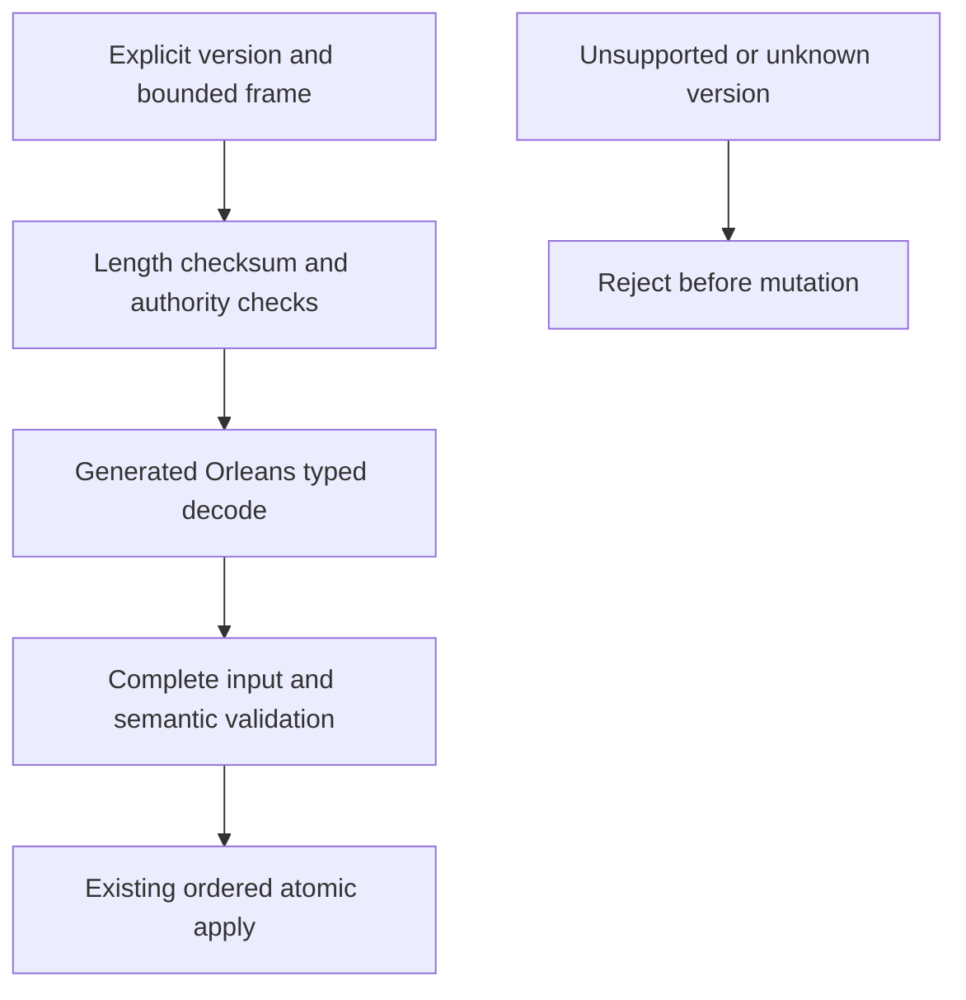

# ADR-060: generated native internal serialization

Status: Accepted. Date:2026-10-03. Owner: serialization integration lead.

Accepted2026-10-05 TASK-DSTORE-EXACT-TEXT repairs the existing exact caller-owned
document-string requirement under REQ/AC-DSTORE-008. Root separates validation
from PutDocument text rewriting: the same native canonical writer validates into
a discard sink and the record retains the original validated string. Public
JsonData.Validate output, canonical fingerprint digests, record aliases/field IDs,
and native data epochs remain unchanged. No automatic existing-record rewrite;
patch/redaction retain their derived-text contracts. Run real-store exact-text,
replacement/replay and invalid atomicity regressions, unchanged canonical golden
tests, and actual Aspire RF3 SDK/official MCP Unicode/restart cases before
qualification. This is a repair of the frozen contract, not a new data format.

## Decision and contracts

Implement REQ-IS-001..009 / AC-IS-001..009 using centrally pinned Orleans generated codecs, stable aliases and explicit immutable field IDs across all owned internal concrete DTOs. Use pooled native sessions and raw ReadOnlyMemory<byte> codecs; reject incomplete/trailing/malformed input and validate required semantic fields before effects. Do not use Orleans' optional JSON codec or a runtime JSON fallback. JSON DOM adapters represent structural ordered fields and original numeric lexemes; native DOM materialization is a concrete boundary, not a persisted JSON subtree.

Concrete contracts retained: public HTTP/MCP JSON; exact caller-owned JSON document strings; canonical operation/idempotency golden digests; sortable KeyCodec1; ZoneTree native ByteArraySerializer/WAL; fixed checksummed framing; raw blob chunks; HMAC/SHA; Cartograph archives. Native binary output must not be assumed canonical for unordered maps. Signed claims are versioned before changing signed bytes. Peer envelope field IDs/types remain stable; any changed meaning/authentication version is explicit.

## Ordered implementation and joins

TASK-IS-004: shared Abstractions native codec, generated DTO closure and JsonElement structural surrogate. TASK-IS-005: Core private records and every borrowed record/scalar reader/writer plus accounting and claims. TASK-IS-006: Replication native message/state/snapshot DTOs and exact batch accounting. TASK-IS-007: lead StorageRecovery checkpoint/identity and BackupRestore formats. TASK-IS-008: lead Orleans grain/membership/security joins. TASK-IS-010/011: integrated enabled compile/static gates and exact-source canonical GitHub qualification. Shared contracts have one assigned owner; the lead reviews every join and retains unrelated changes.

## Current format identity and rollback

Compaction preserves opaque JSON values. Current stores and metadata must use the required format identity and fail closed on unsupported identities before opening or mutating trees or truncating journals. Never promote or reinterpret an unsupported identity. Current backup and restore verify the complete source state before destination publication; unknown keys or failed verification prevent publication and preserve source. Rollback is a source checkpoint and never changes stored data or republishes a different format.

## Security, tests and evidence

Authenticate exact peer scope and sender before replay-slot admission. Native header projection/skipping may not allocate decoded opaque payloads or grant a malformed message a nonce slot; control/data pools and all external capacity contracts stay exact. Existing state ownership, synchronous barriers, unknown outcomes, cancellation and caller-visible sanitized diagnostics remain.

Native codec/type-family/DOM tests, exact record byte accounting, actual current metadata corruption and unsupported-version fixtures, claims/tamper/version tests, replica admission allocation/malformed/scope tests, existing canonical hashes, real-process recovery and genuine RF3 SDK/MCP form the acceptance chain. Required commands are enabled solution restore/build and formatter/static governance, then canonical GitHub normal/scalar/recovery/analyzer/RF3 jobs. No local runtime tests, no removed assertions or invented load tests. Performance, full memory amplification, power-loss, endurance and production proof are separately unqualified. Publication is not attempted again without explicit approval after the previous automatic-review rejection.

## Resumption repair contract, 2026-10-03

The owner directs continuation, concrete implementation and GitHub qualification
after reviewing the held candidate. TASK-IS-R4A implements missing-identity
fail-closed creation with an actual acquired owner handle and real-file regressions
(AC-IS-004/008). TASK-IS-R4B verifies the complete backup journal and manifest cut
before destination publication, using existing checkpoint and atomic WAL readers,
no source modification/truncation and bounded per-frame memory (AC-IS-004).
The restore owner retains explicit new identity/incarnation/signing authority and
paused dispatch; malformed or incompatible backups leave destination unchanged.
Native scalar/count/type/reference/depth/work validation repairs stay in the shared
InternalSerialization slice and preserve official generated wire encoding.
Development-source installation does not establish product release or running-cluster
qualification. Existing required qualification remains.

TASK-IS-R4C shared preflight retains generated encoding and official scalar
readers. It validates expected root compatibility before dynamic dispatch, walks
wire tags iteratively, rejects invalid reference IDs and requires native collection
counts/completion before allocation. Wire depth is bounded at264 (four structural
array/property/node wrappers per existing64-level semantic depth plus8 envelope
levels); this is an explicit safety fence, not full heap qualification.
TASK-IS-R4D validates semantic graphs once per applicable nullability context,
rejects cycles/depth overflow and bounds DOM expansion before materialization.
DOM retains64 semantic levels and a32MiB encoded output ceiling corresponding to
the existing maximum configurable public HTTP body. Actual lower domain/public
admission and reply budgets still apply; these structural fences never grant
capacity or replace required heap, allocation and performance measurements.
Each worker owns disjoint code/tests; only lead owns this shared limits file.

Final source closure removes OperationResult.Get's internal JSON fallback. Typed
Core results and retained outcomes carry NativeValue; JSON-only or absent typed
results fail with Corruption, while stored domain errors retain precedence.
The already-applied/no-retained-outcome sentinel remains an empty internal result.
HTTP/MCP still materialize typed JSON at their existing boundaries. Existing
public JSON text/unicode/ownership/allocation regressions call JsonDefaults
directly with unchanged thresholds; native result rejection/roundtrip tests cover
the removed fallback under AC-IS-001/003. No test is skipped or removed.

Native v2 evolution accepts bounded unknown fields but rejects a known typed
reference to an opaque omitted-type unknown field. Orleans otherwise replays that
field under the later expected type, potentially bypassing the first count scan.
No homogeneous v2 generated producer requires this ambiguous deferred decode;
support for it requires a separately specified bounded replay contract. Ordinary
known-schema references remain supported. AC-IS-002 includes the concrete hidden
underfilled float-array reference regression before native allocation.

TASK-IS-R4E aligns replica inspection and malformed fixtures with centrally pinned Orleans:
explicit property Ids are body members, preceded by the empty constructor scope.
The Server authentication projection follows the same genuine generated record
shape. Official generated writer-to-inspector positive tests cover these joins;
hand-authored malformed tests retain exactly their intended corruption and bounds.

The inspected native type closure is intentionally limited to owned generated
KeyLoad DTOs, existing scalar/date/byte/JSON DOM codecs, rank-one arrays, and the
exact collection/surrogate shapes used by the contracts (ImmutableArray, List,
Dictionary, KeyValuePair and Memory/ReadOnlyMemory). Other System surrogates and
derived collection codecs fail closed before generated allocation, even below an
object-typed field. Extending this closure requires a native shape specification,
preflight/count/reference tests and homogeneous compatibility qualification.
This is an internal concrete contract, not arbitrary Orleans codec compatibility.

## Owner performance extension, 2026-10-03

Accepted REQ-IS-010/AC-IS-010 and REQ-IS-PERF-001..004 / AC-IS-PERF-001..004 add baseline diagnostics
for all shared serialization consumers. Ordered stages NSP001 contracts; NSP002
authentic public generated BDN fixtures and TUnit cases; NSP003 original result
validation/provenance; NSP004 sole lead workflow integration; NSP005 exact-source
CI and Linux measurement; NSP006 only evidence-selected bounded optimization.
BenchmarkScenarios owns Features/BenchmarkComparisons/Native*Serialization*;
UnitTests mirrors BenchmarkComparisons; scripts owns new native-serialization-*
helpers; root alone owns shared benchmarks.yml/docs/acceptance. Existing ADR047
public/unsealed generated-child contract and central package pins remain. A
scoped UnitTests friend declaration permits direct corpus/manifest regressions;
generated consumers still use public fixture methods and concrete return types.

No database format/API/routing/authority change. JSON is benchmark-only historical
typed UTF8 baseline and does not replace native runtime or claim equal fault
contracts. Default workflow retains full matrix/aggregate/site proof; diagnostic
mode is explicitly separate and cannot refresh published website metrics.
Rollback removes additive diagnostics, without user data changes. Real generated
Dry execution and genuine24-case measured JSON/CSV plus executor/source/environment
receipts are required; local build or exit0 cannot qualify measurements.

## Accepted qualification repair contract

R11/R12 preserve AC-IS002/004/007 and the existing formats. Actual GitHub
run37120641864 revealed nullable metadata construction, native reader exhaustion
classification and stale fixtures. Native graph annotations must use .NET10's
already-unwrapped Nullable<T> metadata; only genuine Orleans Reader buffer
exhaustion joins coded corruption, while programming/session exceptions escape.

R12F validates the complete recoverable journal/checkpoint prefix before opening
ZoneTree's native provider. Under the already acquired node owner lock, use the
same owned journal handle and bounded current codecs to verify complete frames,
checksums, sequence, checkpoint metadata/footer and record semantics without apply,
truncation or tree writes. Leave a permitted incomplete current tail untouched
during preflight; ordinary ordered recovery alone applies/truncates it afterward.
Unsupported complete frames and complete corruption must fail without
changing journal/identity/provider files. Reset the journal position before
ordinary recovery; keep startup preflight distinct from acknowledged write gates.

The malformed nested-operation fixture must use the official specialized byte
writer for otherwise-valid native fields; positive controls from the same writer
prove that unknown/duplicate variants reach their intended guard. Preserve its
original8MiB budgets and both direct/stored corruption assertions.

StorageRecovery owns the initializer and new preflight helper; UnitTests owns
NativeStoreOpenPreflight regressions using real files plus unchanged historical
file-preservation assertions. Root owns integration/docs; wire worker owns reader
normalization; no shared runtime/phase-file overlap. Verify valid checkpoint/tail,
torn-tail recovery, late complete corruption and unsupported-current-format rejection
through actual GitHub normal/scalar/recovery/RF3 suites. Rollback restores the source
checkpoint without changing persisted data. Extra startup
validation cost requires actual recovery/performance evidence and cannot count
as a speed improvement. All fault assertions and numeric budgets remain.

R12G preserves the existing strict cold-term read contract: the exact stored
ReplicaEntry must pass the same bounded replica inspection as ordinary stored
entry reads before its term is observed. Pass the owning configuration's
MaxAppendEntries through the term reader; preserve its scoped storage identity,
cut cache, index/term checks and lookup counts. ClusterReplication owns the two
reader/caller files; the existing genuine-file malformed nested-operation
recovery test is the acceptance oracle. Unknown nested authority fields remain
corruption; ordinary bounded persistence evolution does not weaken this check.
The borrowed storage span is copied for inspection only on a cold miss because
the profile inspector requires owned ReadOnlyMemory for its borrowed proxies;
no proxy or storage buffer escapes the read gate. Warm cut observations still
perform no point lookup. Retain this ownership cost in performance accounting.

## Accepted pair-nullability repair contract

R13 preserves REQ-IS002 / AC-IS002 and the current binary formats. The supported
KeyValuePair shape must propagate an owning attributed member's key/value
nullability, including nullable pairs and collections of pairs, through the same
metadata slots already consumed by semantic validation. Dynamic/root pairs with
no owning nullable annotations retain their existing policy. No production DTO
currently owns pair fields; this repairs the declared native closure before it
is used by a future model.

Ordered stages: root accepts R13-AC001 required-null rejection in serialize,
measure and unchecked decode; R13-AC002 valid/absent/nullable-child roundtrips and
metadata-free root compatibility; one worker owns only NativeValueValidation's
pair metadata mapping and new InternalSerialization TUnit fixtures. Root owns
integration, scoped commit/push and exact-source normal/scalar/recovery/RF3 CI.
Do not change wire preflight, graph charge/depth/reference rules, profiles, error
classification, formats, policy or performance claims. Rollback restores the
source checkpoint without rewriting data; malformed required-null pairs remain
rejected until the corrected source passes its required gates. Native measurement
artifacts remain bound to their actual source and do not qualify this repair.

## Accepted exposed-fixture and auth-reader repair contract

R14 addresses the actual normal-unit failures from completed job111204377864 of
GitHub run37123589277, source366d3a8a. Preserve REQ/AC-IS002/004/007, current
formats and every admission, authorization, size, cut and fault assertion.
R14-AC001 requires MCP native auth's custom inspector to classify only the same
narrow official Reader exhaustion as malformed, preserving public Validation; owned/session/programming
exceptions must still escape. R14-AC002 requires malformed auth array fixtures
and read-probe fixtures to author actual native defects, with a valid twin from
the same writer. Concrete generated array codecs cannot be assumed to honor a
generic provider override. Invalid count/type/null/reference/identity cases keep
their original expected errors and before-materialization fences.

Ordered ownership: root owns this contract and all shared integration;
native_wire_fix owns only server MCP auth malformed classification and its
UnitTests auth malformed fixtures; native_codec_review owns only UnitTests
read-probe fixture writers and affected header/security tests. Root owns the
remaining sentinel, public-input expectation and quota/replay fixture joins.
Use the actual int0 no-body sentinel; construct expected native request graphs
from the same public JSON input instead of promising canonical reference bytes.
Quota boundaries must use actual native persisted/normalized byte costs and
retain exact/one-byte-short rejection; public changefeed JSON remains JSON.
Compare decoded record fields and contents, including immutable arrays, without
assuming allocation identity. Native membership test hosts must register their
real dependencies without altering production RF3, directory or current data contracts.

No runtime fallback, new role trust, wire version, storage ownership, size limit
or recovery-policy change. Root reviews every diff, development build/format,
then commits/pushes only scoped repairs and qualifies normal/scalar, recovery and
RF3 through GitHub. Earlier diagnostic results retain their actual source and
cannot qualify later repair source. Rollback restores matching-format binaries;
fixtures do not mutate production format or make a performance/durability claim.

## Accepted diagnostic API-visibility repair contract

R15 follows actual native run37124532025/job111208251984, sourcef403bf61e:
24 external measurements and both diagnostic test modes completed successfully,
but the in-job required-step check failed. The completed authenticated job now
reports those exact preceding steps successful. API visibility lag is an
inference until new raw inspection snapshots are retained; never substitute a
controlled receipt or relaxed success rule for authentic preceding-step proof.

R15-AC001: preserve every run/attempt/source/job/executor and completed-success
check. Only a uniquely matching required step whose status is pending/queued/in_progress
and conclusion null may trigger bounded visibility retries. A missing/duplicate,
failed/skipped/cancelled step or changed identity fails closed. Save every actual
inspection receipt before checking steps, including failed attempts. Retry at
10-second intervals for no more than a120-second monotonic deadline; propagate
one deadline cancellation through API subprocesses and timer waits so final
joins settle. R15-AC002: use the same strict report/corpus/generated validation
for all24 original cells; inspect and fix pinned exporter incompatibilities only
when actual artifacts prove them, retaining raw warmup/actual/result accounting.

Ordered scope: root accepts contract, owns cross-cutting integration and docs;
codec reviewer diagnoses original artifacts read-only; one bounded writer owns
native evidence/GitHub helpers and new pure contract TUnit tests. Root reviews,
builds/formats, scoped commits/pushes and reruns authentic Linux diagnostics.
No failed prior job becomes qualified by a script repair or replay. New source
must pass its own normal/scalar tests, external measurements, verification and
immutable artifact authentication. Full RF3 and database comparison gates stay
independent. Rollback removes this retry while retaining strict failure and raw
artifacts. No production codec/wire/format/limits or speed claims change.

R14 integration additionally repairs only compiler-reported analyzer/style hunks
in concurrent Kurrent diagnostics: Console error output catches IOException or
ObjectDisposedException only, actual fixture Capture accepts only its four thrown
exception families, cancellation is awaited, and two unused imports/lambdas are
removed. Preserve all target behavior, redaction, source assertions and ownership;
these unowned addition files are not silently included in the native commit.
The complete development build must succeed on the joined checkout; source-only
analyzer repair is not comparison or runtime qualification.

R14 SearchResourceTests retains the exact64×16384 added user JSON UTF8 corpus
assertion and unchanged allocation allowance computed from actual persisted
native byte growth. Native string length prefixes grow when padded JSON crosses
the pinned codec varint width, so content-only bytes cannot be asserted as total
record-byte growth. Decode owning DocumentRecord outside allocation measurement
to prove the exact user-content delta; keep raw native scans for the existing
allocation guard and all result/time/score checks. No allocation tolerance rises.

The retained original github-prepare.json proves GitHub's actual preceding-step
API also uses pending/null. Root includes that state among bounded retry-only
states; it never satisfies completed-success. The same strict invalid-state
and terminal-failure rules apply.

## Accepted stored-body fixture repair contract

R17-AC001 follows original ca22 run37124217640. Persisted native queue-body corruption is a storage fault and must retain Corruption, escaping the atomic-command domain-error catch as currently designed. Root owns only QueueBodyAccountingTests: replace its previous malformed-body Validation expectation with exact Corruption and no-effects assertions, retain missing-body controls, and restore the original native bytes to demonstrate the same failed operation ID can subsequently receive once. Check exact stored bytes, ready marker, counters, committed/applied position and absent outcome before repair. Native format, public invalid-JSON policy, durability/admission/authorization, quotas and FIFO remain unchanged. Unit/scalar qualification is GitHub-only and all recovery/RF3 gates still apply. Rollback restores the fixture only; no data-format change or performance claim follows. Unknown well-known header metadata requires a separately accepted narrow Reader design before runtime implementation.

## Accepted unknown well-known header metadata repair contract

R17-AC002 implements REQ-IS002/AC-IS002 at the actual official-header boundary,
following original ca22 BenchmarkTopologyMembershipCorruptionTests failure.
Unknown well-known type IDs in current native bytes raise Corruption without
leaking private bytes. Do not catch arbitrary KeyNotFound from generated, owned
or session code. No numeric decoder, global exception filter, fallback, wire
version or admission/profile change is permitted.

One worker owns new NativeFieldHeaderReader in Abstractions/InternalSerialization,
NativePayloadSyntax/NativeWireWalk header calls, the existing three MCP native
inspection files' header calls, and new NativeUnknownWellKnownHeader TUnit files.
Root owns contracts/integration/docs/GitHub. The helper saves the official Reader
before invoking its official ReadFieldHeader; only after that invocation throws
KeyNotFound may it inspect a saved SpanReaderInput copy using official Tag,
ReadByte/ReadVarUInt32 and WellKnownTypes.TryGetWellKnownType. Normalize only if
the same header proves an unregistered SchemaType.WellKnown ID; otherwise bare
throw. Check exact SpanReaderInput before any probe since copied I/O inputs may
share mutable state. No session type/reference changes or speculative typed decode.
Generated-phase/private replica header calls stay unchanged behind complete
shared preflight so their programming exceptions remain visible.

Tests require genuine native same-writer valid controls and invalid registered
metadata at envelope/root/value/nested scopes, both short and extended field IDs;
all supported span public Validate/Deserialize and MCP boundaries retain their
Corruption versus public Validation distinction. Known/null/encoded schemas,
owned same-family exceptions and other ReaderInput backends must not enter this
normalization. Retain exact stored authority/no-effects/private-canary fixture
checks. Strong review is selected because malformed-input classification crosses
storage and public trust boundaries; bounded coding does not justify relaxing it.

Stages: accepted design -> worker implementation/regressions -> independent
source/API/provenance review -> full development build/format/governance -> scoped
commit/push -> exact-source GitHub normal/scalar/recovery/RF3 SDK/MCP qualification.
No local runtime execution. Rollback restores prior same-format code; malformed
unknown metadata remains failclosed but error classification is unqualified.
Earlier runs never qualify this source or prove performance/power-loss durability.

## R17-AC002 supplemental genuine regression contract

AC-NHT-001..005 maps R17-AC002 / REQ-IS002 / AC-IS002 to new disjoint genuine
ClientApi NativeAuthenticationUnknownMetadata tests and BenchmarkComparisons
BenchmarkMembershipUnknownMetadataNoEffects tests. Root freezes acceptance and
task graph before a private cheaper-worker packet; root reviews/joins complete
bytes and owns full normal/scalar/static/main delivery gates. Four genuine auth
header scopes require exact fixed safe errors, complete same-writer positive
authority, actual request/pool/governor release and successful owner reuse.
Actual persisted malformed membership must survive owner close/reopen and both
denials byte-exactly, preserving hardstate and Position without initialization.
Existing moving helper/tests remain under their current ownership.

Automated-test exception: unrelated owned programming KeyNotFound propagation
is retained as source review of the exact official-header catch, span guard,
bare rethrow and unchanged global filter, using pinned upstream sources and the
independent stopped review. An injected throwing test codec is prohibited by
the repository's no-stubs rule and is removed after private archival. This
exception does not claim an executed genuine owned fault, change product error
semantics or weaken no-fakes policy. Genuine nonspan/known/null/encoded and all
new caller/storage tests remain required. Runtime/GitHub/coverage evidence stays
open until actual source-matched results; local checks follow the owner's later
development authorization and cannot produce website data. No API or
runtime change; rollback removes supplemental tests/docs only.

## Accepted pre-cancelled native membership read contract

R17-AC003 follows authenticated ca7 run37126562970: the compare-exchange cancellation assertion passed, while the subsequent read-barrier cancellation surfaced TaskCanceledException before ReadAsync reached its own cancellation guard. Root owns ReplicaMembershipStore.ReadAsync and its existing genuine membership test. Check the caller token before invoking the quorum barrier and retain the existing post-barrier cancellation check, so an already cancelled read performs no quorum work and raises the caller's original OperationCanceledException. Keep both existing exact cancellation assertions and all absent-row/log-state/committed-applied checks; assert original token identity and cancelled task state for the read. This is an owning entry-boundary repair, with unchanged successful read cut, authorization, placement, native bytes and public API. Normal/scalar/full recovery/RF3 run at delivered source; no speed claim follows from the guard. Rollback removes the new pre-check only and requires matching cancellation-contract requalification, without changing persisted data.

## Accepted native diagnostic credential isolation contract (R18)

R18-REQ001/AC001: the native diagnostic run37126408168 at bfb04d64 actually
succeeded and retains all24 original cells, six corpora and102/102 normal/scalar
results. Its original uploaded BDN build logs also exposed the ephemeral read-only
GitHub workflow token. Preserve original authenticated evidence and report this
defect; never print, copy, use or sanitize the credential into a rewritten
qualified original. No performance improvement is established by that baseline.

R18-AC002: remove native job-level GH_TOKEN and grant `${{ github.token }}` only
to the two actual API evidence prepare/verify steps. The measurement shell,
benchmark host, generated restore/build and external consumers must inherit no
GH_TOKEN/GITHUB_TOKEN from workflow/job/step env. Keep read-only job permissions,
pinned actions, exact24-case profile, source/corpus capture, generated originals,
strict verification, timeout/joins and upload-on-failure. This changes execution
environment scope, not storage/codec formats or benchmark configuration.

R18-AC003: real-workflow TUnit regression checks workflow/job env boundaries,
exactly two API token-bearing steps and no token bindings on every other native
step; preserve all existing original/source/runtime/performance gates. A new
authentic diagnostic run must complete successfully and its downloaded original
logs must pass a value-free credential-presence audit before admitting its
artifact. Original previous measurements remain their actual source facts,
while final artifact confidentiality qualification is pending.

Ordered graph: root accepts this contract and owns shared policy/docs; one bounded
worker owns only native job env hunks in benchmarks.yml plus a NEW native
workflow credential TUnit file; root reviews combined diff, runs newly owner-
authorized local normal/scalar tests, commits/pushes scoped repairs, captures
exact-source full CI and genuine external diagnostic artifacts. Other jobs and
concurrent raw-storage workflow edits stay with their owners. Rollback of this
change must not restore token inheritance; disable the native diagnostic until
an equivalent isolated API boundary is delivered if rollback is needed.
No package, public API, admission rule, durability or competitor claim changes.

## Accepted NSP006 terminal type admission optimization

Actual baseline37126408168/bfb04d64 contains24 authentic cells and six unchanged
corpora; all six NativeDecode means exceed their JSON diagnostic controls with
higher allocations. R18 credential isolation plus a fresh admitted artifact is
the start condition for runtime writes. This evidence selects avoidable scalar
type traversal collections; no sampled profiler attribution or speed claim is
made. REQ/AC-IS-PERF005 requires zero auxiliary allocation for normalized terminal
types using the existing scalar predicate; nullable Require must allocate exactly
the independently measured existing Normalize loop's bytes, without caches.

REQ/AC-IS-PERF006 preserves the exact admission domain: normalize the root once,
fast-return only when both !ContainsGenericParameters and !IsGenericType hold
and the current primitive/enum/IsScalar predicate holds. Enforce existing depth1
fence. Keep the complete iterative fallback structurally unchanged, including
depth264/265, generic-owner nested enum closures, visited tracking, generated
shape checks, field/value validation, session and reference guards. No scalar
registry, new supported shape, enum restriction, schema/profile/resource limit,
provider, persisted bytes, package or API changes. Rollback reverts only this
source shortcut; matching bytes remain readable.

REQ/AC-IS-PERF007 prospective budgets: command16384/1024 NativeDecode allocation
ratios <=0.40/0.60 and mean latency ratios <=0.75/0.85. Other ten native cells
allocation increase <=max(1%,256B) and mean ratio <=1.05. Same six corpus/hash/
byte receipts and original24-case BDN2launch/3warmup/6actual/200ms profile; same
SDK/runtime/JIT/architecture/CPU model/core count/config/package cohort. All12
JSON controls require mean within5%, allocations within max(1%,256B) and no
clear disjoint confidence drift. Cohort drift is an incomparable pair, not a win.

Retain all actual per-launch samples and exporter intervals (BDN0.15.8 Level12
is99.9%, not95%). For baseline interval[LB,UB], candidate[LC,UC] and latency
budget t, missing/nonfinite statistics or LB<=0 is invalid/indeterminate. A
passing mean plus UC/LB<=t supports the conservative target; LC/UB>t demonstrates
a violation; otherwise the latency result remains indeterminate. These marginal
interval bounds are not an exact-confidence ratio. At most two further complete
reference+candidate pairs may resolve uncertainty; keep every pair, never choose
best runs, discard samples, pool runs or alter profile to obtain a favorable
result. Persist unresolved uncertainty and accept a separate precision contract
before changing measurement settings. Allocation success does not prove latency.

Ordered ownership: root accepts this REQ/AC contract, owns docs/shared integration
and authentic pair arithmetic/evidence; bounded production worker owns only
NativeWireSupported.cs; separate test worker owns NEW NativeWireSupportedScalar
Tests/Fixtures/AllocationTests/DepthTests files. Read-only reviewer checks exact
admission and unchanged fallback. Tasks start after protected baseline admission;
combined fresh build/formatter/governance, local focused+full normal/scalar and
recovery, exact-source Linux CI including real RF3 SDK/MCP, candidate original
24-cell artifact and strict comparable before/after review complete the join.
Every allocation loop warms and constructs data before synchronous measured
windows. Existing malformed/header/null/type/depth/owned graph/DOM/count/UTF8/
reference/cancellation/recovery assertions remain unchanged. Real generated
scalar, collection and polymorphic positives preserve values and byte ownership.

Pair arithmetic is an explicit manual-review AC007 exception: retain authenticated
original report inputs, exact ratios/intervals/launch summaries, source diff and
independent reviewer signature. Controlled arithmetic cannot authenticate GitHub.
Local BDN experiments are owner-authorized development evidence with actual
source/machine/settings, and cannot qualify website/cluster results.

## NSP006 development verification and assigned scope

AC-IS-PERF005 measurement scheduling is explicitly isolated after the actual full
v7 report measured Normalize262480B and Require262144B while the focused exact
comparison passed. This demonstrates a context-dependent measurement difference;
it does not prove a specific CLR cache/GC cause or extra production allocation.
The two scalar allocation tests use the pinned TUnit1.72.10 no-key NotInParallel
class constraint, whose actual package XML specifies exclusion from every other
test. Preserve the same32 warmups,4096 iterations, synchronous current-thread
windows, outside-window data/assertions, exact0B and exact equality. No tolerated
bytes, min-of-retries, extra cache, GC manipulation, removed case or changed
production code. This follows the existing JsonTextAllocationTests scheduling
boundary; all other tests remain parallel. The scalar worker owns only the one
class scheduling attribute after root acceptance; root verifies the full normal/
scalar suite and retains the original failed report.

The latest owner instruction confines this delivery to native Orleans serialization
latency and allocations: NativeWireSupported and its four scalar regression files.
The R19 process-observation repair branch was cancelled; all eight exact task-owned
source edits were undone, with original sources and reports retained outside the
checkout. The existing process-lifetime failure remains reported as unrelated
verification evidence. No weakened assertion or process-helper change is delivered.

The historical native diagnostic run37129441460 at3ae408fe remains authenticated.
Do not dispatch its former internal mode through benchmarks.yml; that workflow
owns end-to-end database comparisons. Local full24-cell BDN pairs retain exact
corpora, profile, actual host, controls and original samples. A source image must
retain every tracked base file and only its declared overlays. Its results prove
only that image, not a green shared checkout or delivered GitHub qualification.
Images containing cancelled R19 overlays remain historical evidence and cannot
qualify the final five-source delivery. Required exact-source CI/RF3 gates remain.

## 2026-10-04 same-body nullable allocation warmup

TASK-IS-ALLOCATION-WARM-BODY is accepted under the owner's complete104-task
acceptance instruction. The original full Aspire normal report again measured
Normalize262480B and Require262144B on unchanged production serialization source,
while all other2885 cases passed. Scheduling isolation alone therefore does not
establish a repeatable warmed measurement. Preserve that original failed report;
no specific CLR/GC/cache cause is proven by its336B difference.

Root owns only NativeWireSupportedScalarAllocationTests and this mapped
REQ/AC-IS-PERF005 verification correction. Its nullable control uses two named,
non-inlined synchronous measurement helpers, each containing the original4096
iterations, existing types and current-thread allocation counters. Warm those
EXACT helper bodies32 times before measuring each once. This supersedes only the
old warmup-loop shape: it warms the actual measured IL instead of a separate
short loop. Terminal0B control, exact nullable equality, last-normalized type,
NotInParallel exclusion and all production code remain unchanged. Both counters,
data creation and assertions retain their original synchronous/outside-window
boundaries. No tolerance, inequality, min selection, retries, GC manipulation,
runtime switch, skip or package replacement is accepted.

Review the one-file diff, run the strict build/formatter/governance, then run the
focused allocation control and complete normal/scalar/recovery suites through
Aspire. Retain source/runtime before/after inventories and original reports;
exact delivered-source Linux qualification remains separate. Rollback restores
only the test helper/warmup shape. No persisted/public format or product boundary
changes, so the existing ADR is sufficient.

The [2026-10-04 development receipt](../implementation/keycodec-crud-development-2026-10-04.json)
retains the failed nullable allocation control and the same-body warmup repair.
Both original exact controls pass in full Aspire normal/scalar2889/2889 suites;
recovery228/228 passes with unchanged complete source/runtime inventories.
No tolerance, product cache, runtime switch or allocation bound was changed.
This is local development evidence; exact delivered-source Linux and RF3
qualification and comparative performance remain required.

TASK-DSTORE-EXACT-TEXT retains the original literal JSON in the existing native
operation-ownership, restored-record, canonical-retry and embedded-fixture
oracles. Only their obsolete normalized-document expectation changes; all
native authority, corruption, revision, canonical digest and no-second-effect
checks remain. This is the REQ/AC-DSTORE-008 contract already frozen above,
not a change to canonical fingerprint bytes or stored aliases/field IDs.
