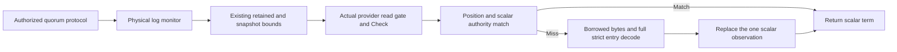

# ADR-061: bounded node-owned replica term metadata

Status: Accepted; source implementation/review and development checks complete;
native40f term cases17/18 pass, full qualification fails. Preserving lifecycle
repairs, complete exact-SHA qualification and measured performance remain open.
Owner: KeyLoad lead. Related [ClusterReplication](../Features/ClusterReplication.md),
[term feature contract](../Features/ClusterReplication/ReplicaTermMetadata.md),
[ADR-007](ADR-007-replica-consensus-bootstrap.md),
[ADR-035](ADR-035-memory-performance.md) and
[ADR-046](ADR-046-storage-private-owners.md).

## Decision and preserved boundaries

REQ-REP-052 / AC-DBHP-001..008 extend REQ-MP-001/002/005 and
AC-MP-001/004/006/011/012. Before this repair TermAt fully copied and strictly decoded the
last retained entry to read its scalar term. Application authentication and
operation each retain their own authorized quorum round; do not merge or cache
those boundaries here. The node-wide write pump, shared leader round gate,
transport JSON/HMAC and native/custom WAL remain separate profile targets.

Keep exactly ONE last-observed scalar term cell per DurableReplicaLog, owned by
that physical log under its existing monitor. Fields are index, term, local
storage position, ReadGeneration, incarnation and NodeId. Retain no entry,
payload, encoded key, StoreIdentity object or signing key. There is no capacity
configuration, distributed transfer, grain state, caller opt-in or eviction loop.

TermAt preserves existing zero/snapshot/invalid-retained-range checks before
lookup. For a retained entry it ALWAYS invokes actual IAtomicStore.Read. Inside
that read gate, compare current Position and all scalar identity fields with the
cell and requested index. Only an exact match returns its term without a point
lookup. A miss uses IKeyValueView.ReadValue and complete strict
ReplicaProtocolCodec.Deserialize<ReplicaEntry> while borrowed bytes are valid;
require exact index and0<term<=current hard-state term before publishing the cell.
Do not recursively invoke store.Read inside its callback or let borrowed bytes
escape. ReadEntry, suffix Read and startup validation retain full strict behavior.

The actual ZoneTree provider enters runtime.Check before the callback, fences
successful commits by Position, successful tree replacement by checked
ReadGeneration, and restore by a fresh NodeId. Failed publication/replacement
poisons the provider before another read can serve. Reopen creates a new empty
cell. Snapshot bounds logically hide compacted/truncated indices before any hit;
ordinary compaction preserves identical logical records. Tests must prove these
actual fences rather than trusting an ungated property observation. Alternative
providers that cannot honor this contract require a separate decision; no fake
provider is accepted as proof.

Required provider preconditions are explicit for this DurableReplicaLog use:
inside its Read callback, Position and the extracted Identity fields describe
the same protected cut as the view; every effective record-changing publication
advances Position before returning success; replacement that can reuse a local
position advances a nonreused ReadGeneration or changes incarnation/NodeId before
another read can observe it; failed or uncertain live journal/tree publication
or live replacement rejects subsequent reads until recovery. Pure validation,
compile or snapshot verification rejection before live publication preserves the
unchanged healthy cut. These are required provider semantics, not inferred from an interface
name. Root documents them in the existing shared storage contract and the log's
store parameter; signatures/wire/data do not change. Actual ZoneTree is the only
current inspected provider; real fence-test/native qualification is pending. An unknown/nonhonoring
provider is not silently qualified or enabled by this optimization and requires
a separate decision and real provider regressions before DurableReplicaLog use.

## Ordered implementation contract

1. Root freezes brainstorm, acceptance, task graph and this contract before
   delegated writes. Independent actual-provider review checks same-position
   replacement, restore, poison/disposal and gate order. Source findings are not
   native profile attribution.
2. R15 Luna owns ONLY NEW `ReplicaTermMetadata*.cs` tests/helpers under
   `tests/KeyLoad.RecoveryTests/Features/ClusterReplication/`. Author genuine
   ZoneTree tests first for exact term/errors, cold/warm/alternating indices,
   large retained payload logical reads, direct mutation/corruption/missing record,
   suffix replacement, snapshot cut and same-position valid install, real
   supported publication/installation failure, poison/disposal and reopen.
   Existing actual crash/process/snapshot and planning/publication gates remain.
   No fixture/public/project/source edits, fake storage or local execution.
3. After that test packet and root start instruction, dependency Luna owns ONLY
   `DurableReplicaLog.cs` and NEW `ReplicaTermObservation.cs` in the replication
   slice. Implement the fixed private cell and actual read-callback join exactly;
   preserve crash hooks, append/commit/term/vote/snapshot writes and public shapes.
   Stop on provider semantic uncertainty, new contract or ownership expansion.
4. Strong reviewer reads every joined product/test diff and exact current hash;
   root integrates code, fixes actionable findings and owns shared docs/config,
   Git and gates. No worker may run local tests or alter diagnostics/limits.
   Root alone owns the semantic documentation of the existing shared
   `src/KeyLoad.Abstractions/Storage/StorageContracts.cs` provider fields/read gate;
   the worker documents the accepted store preconditions in its already owned
   DurableReplicaLog constructor parameter without new signatures or interfaces.
5. Root runs enabled full development build, formatter/governance/static checks,
   commits ALL eligible current scope on main and ordinary pushes. Authenticate
   exact-SHA native CI artifacts for complete unit/scalar, process recovery and
   Docker/Aspire RF3 through .NET and official MCP clients. A prior/source/scoped
   pass cannot qualify the new helper.
6. Repeated native1/2/3 PointRead and complete cohort use identical workload,
   topology, concurrency, limits, read/durable ACK. Distinguish logical read
   elimination from actual database throughput and server/client resources.
   Keep absent server CPU/alloc/GC, gate/quorum/codec/WAL profiles and coverage
   explicit; do not claim maximum performance or causal percentages from source.

Native run37109874881 at40f87fc3c486718f4e4e3f916dc209e42e32a0ca exposed
post-install repeated maintainer disposal; preserve that error in the
[original receipt](../implementation/database-term-metadata-native-40f-r122.json).
REQ-STORAGE-020 / AC-DBHP-009 repair belongs to ADR-046 and its two existing
storage owners, not the term observation or a dependency workaround. AC-DBHP-010
only repairs the real-clock regression wait without changing the permit.
Both repairs require the same complete new-source native join; a partial pass
or a skipped scalar/comparison gate cannot close this decision.

## Migration, rollout, rollback and joins

No persisted-format, public protocol, package, security or topology migration.
The scalar cell begins empty on every node; physical storage remains node-owned
when Orleans activations migrate. A drained source rollback removes the helper
and caller together and retains every valid log/snapshot and both read barriers.
No mixed-version RPC change, weakened durable ACK, retry or fault oracle.

Related tests and evidence map one canonical ClusterReplication slice in the
feature contract. Root alone updates status and reports. This ADR remains
Accepted until every required implementation and qualification stage is proven;
process-kill evidence does not establish power-loss durability or endurance.
