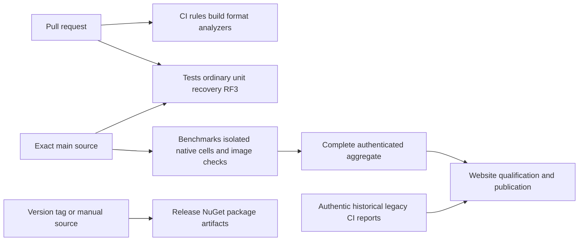

# ADR-062: CI, Tests, Benchmarks, Release and Website

Status: Accepted. Date: 2026-10-03. Owner: KeyLoad lead/integrator.
Requirements: REQ-WF-001..006. Acceptance: AC-WF-001..006.

## Decision

Use five plainly named pipelines with distinct responsibilities:
CI handles pull requests/manual build, format, analyzers and repository rules;
Tests handles main/PR/manual project unit/scalar, process recovery and Docker/Aspire
RF3 qualification; Benchmarks handles every comparative performance test,
including TimeSeries image checks; Release builds NuGet package artifacts from
version tags/manual source; Website separately qualifies and publishes the site.
Remove standalone governance and per-feature TimeSeries workflows.

## Implementation contract

1. Lead owns all five workflow YAML files, shared policies/contracts, site handoff,
   docs and delivery. The accepted task graph is in [execution plan](../implementation/workflow-layout-execution.md).
   Read-only provenance audit joins before disjoint C#/JS workers write; lead
   reviews every diff and owns combined evidence. Workers cannot commit/push.
2. CI retains an independent always-triggered repository-checks job, full Release/
   formatter checks and real analyzer regressions. It has PR/manual triggers and
   no push trigger. Tests retains all original ordinary main/PR qualification gates,
   including full Release, formatter, rules, analyzers, normal/scalar units,
   real-process recovery and genuine RF3 through real .NET/official MCP SDKs.
3. Move every existing native comparison job to benchmarks.yml unchanged except
   replacing the former verify prerequisite with a complete Release/format/rules
   build. Preserve all27 preflights,108 CRUD and162 specialized isolated Linux jobs,
   actual topology, load, schemas, steps and artifacts. Move the pinned TimeSeries
   image test/job/artifact there under the same build prerequisite.
4. New isolated contracts bind to exact Benchmarks/benchmarks.yml identity; C#
   native/fault/image admission and unit fixtures match. TimeSeries also validates
   the exact workflow ref without changing the retained receipt shape. Positive/negative
   provenance regressions remain; no producer-name fallback is introduced.
5. Historical legacy report producer runs retain KeyLoad CI/ci.yml identity.
   Current metadata is explicitly named CI via a separate workflowDisplayName
   contract. Legacy selection only queries own-main push runs; new CI PR/manual
   runs cannot enter that history. Original archive bytes are never relabelled.
   Website's current executor guard is Website. Its completion trigger follows
   Benchmarks; isolated measured source copy is benchmarks.yml while historical
   legacy measured source remains ci.yml. Preserve every source/hash/freshness/
   qualification/coverage/least-privilege publication gate.
6. Release reads the central source version or validates the v* tag version, uses
   one version for both Release build and dotnet pack, requires non-empty NuGet
   outputs and retains package hashes, source SHA, run and attempt. Package
   publishing credentials, NuGet feed publication and version-file changes are
   outside the owner's package-build request; this workflow performs no publish.
7. Lead reviews static syntax, exact original job preservation and policy inventory;
   commits only scoped work on current main and inspects actual GitHub jobs and
   artifacts. TUnit/MTP and real Docker qualification run only in GitHub. Existing
   baseline failures stay separate; incomplete cohorts cannot refresh metrics.

## Verification and rollout

AC-WF-001/002/005 map to focused TUnit source-role assertions, real workflow job
inventory and actual package artifacts. AC-WF-003 maps to existing positive/
negative provenance tests, current-CI versus authentic historical-run regression
and the real pinned image context. AC-WF-004 maps to SiteTests and exact producer
source/executor checks. AC-WF-006 maps to full scoped diff, static inventory and
GitHub SHA/run/job/artifact records. The [acceptance matrix](../implementation/workflow-layout-acceptance.md) records edge/error/
negative flows and the GitHub-only testing methodology. Keep Accepted until the
required evidence joins; configuration is never passing native qualification.

No database schema/storage/workload/native topology changes. Revert the scoped
layout commit to roll back; preserve immutable historical archives. There is no
qualified complete isolated historical cohort to migrate, and failed old cohorts
cannot become new measurements. No publishing secrets or permissions are added.
