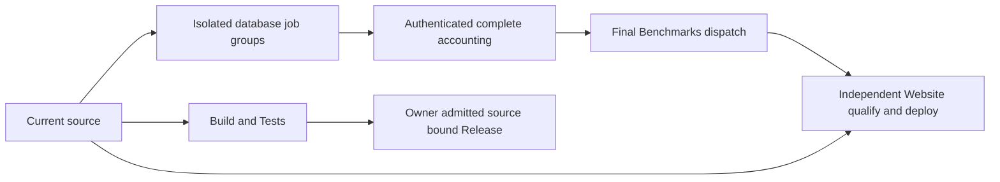

# ADR-062: Workflow responsibility and qualification boundaries

Status: Accepted; complete delivered-source qualification pending.
Requirements: REQ-WF-001..006. Acceptance: AC-WF-001..006.
Owner: KeyLoad integration lead. Features: RepositoryGovernance, BenchmarkComparisons.
Related: [ADR-064](ADR-064-workflow-release-delivery.md),
[ADR-112](ADR-112-independent-website-publication.md).

## Decision

Use exactly four workflows. Build and Tests owns full solution restore/build,
format, analyzers, governance, unit/scalar, process recovery and genuine RF3.
Benchmarks owns every performance/comparison workload, native images and isolated
Linux cells, original per-database results and one authenticated aggregation.
Website independently qualifies and publishes current source with optional
verified benchmark data. Release prepares source-bound versioned distributions;
publication waits for product readiness or a direct owner release instruction.

Every comparison database has its own readable job group and complete source-bound
matrix; each cell runs alone with that engine's actual native topology and loader.
One- and two-node benchmark profiles never replace production RF3. Preserve the
complete canonical planned inventory, exact scale/ACK/correctness/resource contracts,
all native image gates and every original result, including failures and unavailable cells.

## Implementation and acceptance

1. Lead freezes shared workflow identities, file ownership and REQ/AC before edits.
2. Infrastructure contributors own disjoint workflow/composite changes. Product
   contributors preserve actual native callers, image receipts and bounded shutdown.
3. Join exact workflow names/paths/events with native source/run/attempt/job/artifact
   validators, release context, source closure and all SDK/MCP test entry points.
   Never relabel originals, accept a different source cohort or bypass a failed gate.
4. Validate YAML/action contracts statically; source-shape assertions are infrastructure
   review. Actual native admission, wrong executor, corrupted artifact and healthy
   follow-up operations run through the Aspire-owned TUnit entry.
5. Lead reviews combined source, build/format/governance and original Linux runs.
   AC-WF-001/002/005 cover responsibilities and actual distribution artifacts;
   AC-WF-003 covers native provenance; AC-WF-004 covers Website qualification and
   fresh source/producer identities; AC-WF-006 covers complete traceable delivery.

Rollout is one source checkpoint containing workflows, validators, actual callers,
source maps and docs. Source rollback keeps the four mandatory responsibilities
and every required gate. Database bytes, credentials, RF3 and public operation
semantics are unchanged. Original evidence remains immutable; missing, failed,
skipped or mixed-source evidence cannot become current measurements or qualification.
