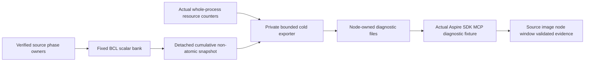

# ADR-063: bounded callback-free database phase profiling

Status: Accepted, implementation/native qualification pending. Date2026-10-03.
Owner: KeyLoad lead. REQ-RESOURCE-003..006 / AC-DBPROF-001..008; related
[ResourceExecution](../Features/ResourceExecution.md),
[profile contract](../Features/ResourceExecution/DatabasePhaseProfiling.md),
[ADR-035](ADR-035-memory-performance.md), [ADR-061](ADR-061-bounded-replica-term-metadata.md).
Working acceptance/ordered task graph: database-profiling.acceptance.md/.plan.md.

## Decision

Add one BCL-only solution-owned `src/KeyLoad.Diagnostics` project, owning
`Features/ResourceExecution/` generic phase bank, arithmetic and immutable snapshots.
The existing ServiceDefaults has an ASP.NET/OTel dependency graph inappropriate
for standalone ZoneTree/replication consumers. Abstractions remains contracts
without mutable telemetry; do not copy banks into producers or add a package.
Producer project references are root-owned and acyclic; Diagnostics references
no product project/framework/package beyond the existing central analyzer.

Mode is immutable for a physical process. Server opts in once before opening its
hosts; default is disabled. No public request/debug/role endpoint controls mode.
Embedded providers remain disabled unless their process explicitly initializes
profiling before work. No live reset/disposal while original follower tails run.
Initialize the static facade once; a different later mode is rejected at setup,
not from hot record calls. Primitive tests use independent real bank instances.

Hot path owns only a timestamp scalar and fixed phase/outcome. Begin/End have
no listener, logger, callback, exporter, async-ambient state, task, per-record
buffer or database gate. Actual counters use four finite stripes,32 phases,
6 outcomes,16 buckets and at most4 CAS attempts. Saturation/contention/invalid
input sets sticky quality; it cannot wrap or silently qualify lost data.
Busy admission has a separate fixed counter lane. Raw bank startup<=128KiB.
Independent cumulative snapshots are non-atomic; monotonic bounds and quality
are retained. Snapshot arithmetic overflow saturates/degrades. Derive counts
from buckets; no separately racing totals or reset. Inclusive boundary ticks
are integer floor(Frequency*microseconds/1000000), computed without overflow;
the final bucket is infinity. No per-request trace or exact percentile inference.

The cold exporter owns at most3 snapshots and256KiB detached buffers, with one
zero-queue export owner outside every database gate. Private node files and
whole-process resource samples are separate from histogram durations. Fixed5s
period, <=1800 frames, <=64MiB per node, <=64KiB per frame; reaching any limit or
missing/degraded record makes the profile incomplete. Export errors do not alter
DB results or stop a healthy database; they fail diagnostic qualification.
No fsync/durable ACK for diagnostic files. CPU/GC/allocated bytes/working-set/
private-byte observations have actual sampling bounds and availability markers.
File closure describes exporter closure, not proof every protocol tail drained.

## Frozen primitive API and file ownership

Root owns `KeyLoad.Diagnostics.csproj`, local AGENTS, `DatabasePhaseKind.cs`,
`DatabasePhaseOutcome.cs`, `DatabaseProfileQuality.cs`, `DatabasePhaseSnapshot.cs`
and friend assembly registration, plus solution/references/inventory/architecture.
All feature files live in its ResourceExecution slice; friend metadata is shared.
Snapshot exposes immutable arrays and Enabled/Frequency/Started/Finished/Quality.
Histogram has3072 merged counters (phase→outcome→bucket); BusyAttempts has32.

Worker bank API is `DatabasePhaseBank(bool enabled)`, `IsEnabled`, `Begin()`
(actual Stopwatch or disabled sentinel-1), `End(phase,outcome,started)`,
`RecordBusy(phase)` and `Capture()`. End does not throw or affect producer errors.
An invalid enabled start/dimension degrades; disabled End does no timing work.
Internal pure `DatabasePhaseArithmetic.BucketFor(elapsed,frequency)` and
`DatabasePhaseArithmetic.TryIncrement(ref long)` have fixed boundary/saturation
tests. Cold snapshot merging uses the same production-owned pure
`DatabasePhaseArithmetic.AddSaturating(left,right,out bool overflow)` helper:
nonnegative inputs sum exactly, overflow returns long.MaxValue and true; negative
inputs throw ArgumentOutOfRangeException before addition. Real counters cannot
be negative. Capture sets sticky SnapshotOverflow whenever this helper reports
overflow. Tests exercise this exact math without injecting bank state; source
review proves Capture uses it for every merged lane. No fake clock/provider or
test-only live fault injection is required.
BucketFor rejects negative elapsed/nonpositive frequency with -1. Wide threshold
values above long.MaxValue clamp to that ceiling; no representable elapsed can
exceed their exact value, so inclusive bucket selection stays correct. Thresholds
must remain nonnegative and nondecreasing at all valid frequencies.
TryIncrement returns None on ordinary successful increment, SaturatedCounter
both when a successful increment first reaches long.MaxValue and on an already
saturated/negative counter, and ContentionDropped after four failed CAS attempts.
The first ceiling-reaching increment is published exactly; quality degrades
immediately rather than waiting for another record. No return-value success
boolean or dropped-count inference is substituted for these quality semantics.
The static facade is root-owned after the bank packet; producer APIs do not
transport profiler state in RPCs. Immutable32 phase names/boundaries are frozen
in the feature table. Outcome initialization is Faulted, success/rejection is
set only from the actual owned result; existing cancellation tokens determine
CallerCancelled versus DeadlineOrStopping without guessed timing provenance.

### Branch-local outcome precedence

One scalar starts Faulted. Actual acquisition/normal generic work sets Completed;
actual typed accepted/true result sets Completed, typed non-ack/false sets
Rejected, and real zero-wait admission rejection sets Busy. A generic provider
or LockedAsync<T> does not inspect T or infer a domain failure from it.
Only an observed original OperationCanceledException can select cancellation:
an actually cancelled phase-local incoming token selects CallerCancelled;
otherwise an available existing owned deadline/stopping token selects
DeadlineOrStopping; otherwise it stays Faulted. Incoming low-level tokens can
already be linked, so CallerCancelled does not prove external SDK cancellation.
Do not transport origin, inspect error codes, or add timers to guess provenance.
At receiver catch(OCE), that token-proven causal outcome takes precedence over
the existing signed UnknownWriteOutcome reply; the reply remains unchanged.
Follower poison/fault branches stay Faulted before their existing false return;
other typed non-acks stay Rejected. Busy stays Busy. Preserve every original
result, catch/rethrow, timeout creation, gate release and outstanding task owner.

## Ordered execution and integration contract

### Root-owned process facade before producer start

`DatabasePhaseTelemetry` owns one initially disabled bank for the physical
process. Initialize(bool enabled) runs under a cold setup-only lock before
hosts/work; repeated same-mode setup is idempotent, a different later mode
throws only from setup. Publish the selected bank before marking setup complete.
Hot Begin/End/RecordBusy only read its published reference and invoke the
callback-free bank; they do not seal/change configuration or enter the setup
lock. There is no reset/dispose, live request configuration or public endpoint.
Calling setup after physical work began is prohibited; server composition must
initialize before resolving PartitionHost. Embedded callers must initialize
before their work, or retain the default disabled mode. Capture is cold.
CancellationOutcome(incoming,owned) is a pure helper used only in an observed
OCE branch: cancelled phase-local incoming token wins, then an actually
cancelled existing owned deadline/stopping token, otherwise Faulted.

1. Root reads actual policies/source, chooses this dependency/budget/API and
   freezes feature, acceptance, test strategy and task graph. Relevant full
   baseline is actual main CI (ci.yml) Actions; preserved failed/skipped suites stay open.
2. Root adds new local policy/project/schema. Test Luna authors NEW
   `tests/KeyLoad.UnitTests/Features/ResourceExecution/DatabasePhase*.cs` first;
   literal bounds/schema, real bank mode/record/concurrency/allocations and pure
   saturation/overflow tests. Root reads the stopped packet before product start.
   Private authoring packets may be integrated together to keep the shared
   checkout compilable; authorship order does not imply native execution.
3. Explicitly started Luna owns NEW bank/arithmetic/snapshot implementation
   helpers only. No project/shared/producer changes or local runtime execution.
   Root/strong review verifies all files and actual bounded/disabled behavior.
4. Root then freezes exact producer write scopes. Disjoint replication/provider
   workers preserve gates, real original tasks, both cuts and fault/ACK order.
   Root owns Orleans/public scopes, references, static setup and private exporter.
   No delegate wrappers or observer calls inside gates; no changed protocol/data.
5. Root freezes private capture schema and genuine native fixture before its
   implementation. Use existing Aspire resource builder/real private node
   directories; do not edit another app root's AppHost/benchmark/CI/site schema.
   Minimal ClusterFixture opt-in is separately serialized and documented before
   write. Test lifetime copies closed bounded files before deleting data roots.
6. Independent strongest review joins every product/test/capture diff. Root runs
   enabled full development compiler/formatter/static, commits ALL eligible main
   scope, ordinary pushes and authenticates full exact-SHA native unit/scalar/
   process recovery/RF3 SDK+official MCP and profile files. No skipped gate passes.
7. Repeat matched source1/2/3 disabled/enabled PointRead and actual resources.
   Derive numeric overhead/operation budgets from observed results before
   advertising benefit; full270 cohort/site and coverage remain separate gates.

## Rollout, rollback and interpretation

### Frozen provider producer packet: TASK-DBPROF-PROVIDER

AC-DBPROF-001/002/003 assigns one bounded worker exactly ZoneTreeStore.cs,
Features/StorageRecovery/ZoneTreeJournalPublication.cs and ZoneTreeStoreRuntime.cs
within KeyLoad.Storage.ZoneTree. First prepare private copies and an original/
candidate hash manifest; do not mutate the shared checkout while its preceding
primitive checkpoint is building. Root alone joins reviewed copies and the
Diagnostics project reference. No package, wire, stored format or facade API changes.

Phase27 brackets only the original Store.Read EnterReadLock; phase28 only the
original Commit EnterWriteLock. Completed means successful acquisition; failed
acquisition remains Faulted, with no invented cancellation or held scope.
Phase29 starts immediately after successful Commit acquisition and ends only
after the existing ExitWriteLock attempt. Actual normal Commit completion is
Completed; every compiler/publication/error or release failure is Faulted.
No-change commits still have their original held lifetime. Preserve checks,
compiler, preparation, publication, position and exact existing release order.

Phase30 brackets the original atomic header/payload writes and Flush(true),
including existing between-write fault hooks, inside the original poison/error
try. It ends immediately after successful Flush before JournalFlushed's existing
hook. Post-flush apply is outside this phase. Phase31 brackets the complete
original Runtime.Apply cache/native mutation behavior; no inferred native-fsync
duration or altered cache/value ownership. Begin/End are scalar callback-free
calls; no delegates, new business gates, observer, exporter, async owner or timer.
Initialize outcomes Faulted, set Completed only on actual normal completion;
finally bookkeeping must preserve the original error and release failure.
Private cohesive helper extraction in these same three files may meet numeric
limits without moving business behavior or adding an exception waiver.

The R130 pre-join review found concurrent guarded-existing-store work in the
runtime and store facade. Those current constructors, expected node identity,
guarded open and disposal remain owned by StorageRecovery and must survive the
join. The rebased private worker packet additionally owns exactly one new
internal static helper: `Features/ResourceExecution/ZoneTreePhaseGate.cs` for
the original Read/Commit gate telemetry. Runtime.Apply itself retains and
brackets its original cache invalidation/value wrapping/delete/upsert body
with phase31; no mutation caller is missed. Moving the three gate helpers out
of the runtime keeps its token-bearing type lines within the existing limit.
Gate telemetry calls the same ReaderWriterLockSlim instance, and changes neither
its acquisition/release order nor lifetime. No delegate, allocation, asynchronous
helper, extra gate, new public signature or limit waiver is permitted. Exact
current original hashes bind the rebased packet; root serializes every join and
rejects source drift. This is an ordered preserving extraction before producer
integration, mapped to the same AC-DBPROF-001/002/003 and real-store/native tests.

Worker artifact includes the complete proposed files, exact original hashes,
phase boundaries and preservation review. Existing real-store mutation/no-change/
poison/checkpoint/process-cut suites and literal bank tests are the criterion
mapping; root runs enabled integrated development gates and exact-source CI
normal/scalar/recovery/RF3. Producer-specific enabled native phase observations
remain required under the later physical-process capture fixture; source alone
does not close AC-DBPROF-001/003/006 or establish performance benefit.

### Frozen replication primitive packet: TASK-DBPROF-REPLICATION-A

One independent worker prepares private copies of exactly
Replication/Features/ClusterReplication/ReplicaState.cs, ReplicaRpcClient.cs,
ReplicaReadRoundExecutor.cs and ReplicaCanonicalApply.cs. Root joins only after
the preceding primitive checkpoint; root owns its Diagnostics project reference.
AC-DBPROF-001/002/003 maps to phase05 actual transport-ready await, phases15/16
original protocol-gate acquisition/held lifetime, phases17/18/19 original request
encoding/actual active.InvokeAsync/reply decoding, and phase26 original scheduling
ApplyBatch. Do not add leader/follower scopes, new transport, retries or tasks.

Gate hold starts only after actual acquisition and includes its original release
attempt; a release failure is Faulted. Original typed serialization/cap stays
before RPC deadline creation. Phase18 includes the original invocation expression's
UTF8 string conversion after deadline arming and inside its existing OCE catch;
phase19 reply-byte conversion/deserialization stays inside that SAME outer catch.
The non-caller OCE to OwnershipLost translation must retain its full original
scope. No conversion, validation, timeout or catch boundary moves. Normal
generic T work is Completed without inspecting T; existing rejected/error
classification remains with the actual typed owner. Only caught original OCE
uses the existing phase-local incoming/owned tokens via CancellationOutcome;
linked input provenance is not external SDK causality. Preserve every original
catch/rethrow, call/result, deadline, fault hook, gate and original task lifetime.
ApplyBatch is a scheduling batch, not a new WAL group commit.

Begin/End remain callback-free scalar work, without observer/delegate wrapper,
allocation, new gate/timer/ambient identity or exported payload. Same-file private
cohesive extraction may satisfy numeric limits. Existing genuine transport,
protocol-gate, apply/error/cancellation and process-recovery suites are regression
mapping; root's later enabled RF3 private capture must prove actual phase
observations. Worker supplies full proposed files and exact original/candidate
hashes; root reviews and runs enabled integrated development/CI gates. No package,
stored/public/wire contract, Orleans-request isolation or authorized-cut changes.

Diagnostics default off; source adds no stored/public/wire/package migration.
Host drain precedes removing exporter/facade/scopes/references together. Physical
storage and retained scalar metadata remain node-owned on activation migration.
Profile files are disposable siblings of storage, excluded from DB authority.
Incomplete files/nodes/identity/image/source/window, dropped counters, quality
flags or missing resources are unavailable evidence rather than zero.
Phase times overlap and include background/maintenance; followers can end after
quorum. Resource deltas include whole-process work between sampled bounds and
are brackets, not request cost or an additive latency decomposition. All required
ADR stages remain open until original native proof; source architecture provides
no performance supremacy, multi-host scale, endurance or power-loss durability.
