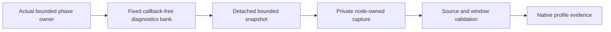

# ADR-063: Bounded database phase profiling

Status: Partially implemented in source; complete producer/capture and native measurement qualification remain pending.
Related: REQ-RESOURCE-003..006 / AC-DBPROF-001..008; [ResourceExecution](../Features/ResourceExecution.md), [DatabasePhaseProfiling](../Features/ResourceExecution/DatabasePhaseProfiling.md), ADR-035, ADR-061, ADR-113, ADR-076, ADR-080.

## Decision

Provide opt-in, process-local phase diagnostics for bounded database operations. Profiling is disabled by default and is initialized before the physical hosts begin work. Diagnostics are not database authority and do not change public requests, persisted records, wire formats, acknowledgements or operation results.

The callback-free BCL bank records scalar phase/outcome timings and counters. Keep its fixed 32 phases, six outcomes and 16 histogram buckets, four stripes by default (validated options allow 1, 2 or 4), and one-to-four bounded update attempts (default four). Startup options come from the centrally registered and validated DatabasePhaseExecutionOptions; do not create a second configuration owner or fallback. The bank's startup footprint remains at most 128 KiB. Saturation, contention, invalid input and overflow degrade quality; incomplete data cannot qualify a profile.

Capture is cold and bounded outside storage gates. It observes detached snapshots and actual process/resource counters, marks every file with source, image, node and sampling-window identity, and treats missing, degraded or incomplete data as unavailable. Profiling does not claim exclusive request latency: phase intervals may overlap and may include maintenance or independent tail work. No power-loss or durability claim follows.

## Preservation contract

The canonical phase inventory and exact source boundaries are in DatabasePhaseProfiling. Existing provider gates, lock order, native operation calls, RPC deadlines, cancellation classification, quorum/apply semantics and original task ownership stay unchanged. In particular, a scheduling batch is not a group commit; a transport await is not isolated network time; and process resource deltas are not attributed to one request.

Every update is callback-free and bounded. No logger, listener, exporter, async-ambient value, allocation, task or database gate is introduced into a producer's hot path. Snapshot counters are cumulative/non-atomic; all overflow and dropped-update quality indicators remain visible. The cold exporter uses bounded snapshots/buffers/files and cannot change healthy database results.

## Acceptance, ownership and verification

REQ-RESOURCE-003/004 map to AC-DBPROF-001..004 for preserving real phase ownership and bank correctness. REQ-RESOURCE-005 maps to AC-DBPROF-005/007 for private source-bound capture. REQ-RESOURCE-006 maps to AC-DBPROF-006/008 for correctness and measured overhead. The feature owns all exact phase boundaries, test mapping, source paths and profile file constraints.

Core diagnostics owns the bank/schema/arithmetic; producer feature owners add scalar scopes only at the original operation boundaries; Server owns private capture and lifecycle. Root owns project wiring, central options, AppHost fixture, shared schemas and integration. Tests use actual banks, ZoneTree/store operations, original tasks and Aspire resources; no fake clock/provider is used where the contract requires actual time or native state.

Qualification requires enabled full source checks and exact-source Linux unit/scalar/recovery/RF3 tests, real private capture verification, and repeated matched on/off profiles at current 100,000- and 1,000,000-record workloads where applicable. Existing BenchmarkComparisons current cohort, coverage and publication gates remain separate and mandatory. Source compilation does not establish measured overhead or benefit. Keep the ADR Accepted until every mapped implementation and evidence gate passes.

### TASK-DBPROF-INVALID-RESERVATION-ORACLE-001

REQ-RESOURCE-003/004 and AC-DBPROF-002 map `DatabasePhaseExecutionOptionsTests.StandaloneBclBoundaryRejectsBeforeEnabledOrDisabledCounterReservation` to actual BCL invalid stripe/CAS rejection with exact ArgumentOutOfRangeException.ParamName in BOTH enabled and disabled modes. Each measured rejected construction independently remains below the unchanged MinimumStripeCounterBytes counter-array lower bound. Runtime exception allocation need not be identical between modes; authentic eb0 normal4,-1 observed1088 versus1336 bytes, which does not establish counter reservation or a product defect. Preserve that failed original and every existing invalid-input case. No threshold growth, added prewarming, retry, skip or product/configuration change is permitted.

After both real rejected constructions, centrally bound valid disabled/enabled banks execute native Begin/End and RecordBusy and capture concrete counters: disabled remains empty/unavailable; enabled records exactly one completed scope and one admission rejection in the actual phase, with unchanged quality and detached cumulative capture. This is the invalid-to-healthy bank subflow only, not production startup, RF3, measured overhead or full AC qualification. ADR-063/113 retain the original ownership and fixed bounds. Root owns guarded join and fresh native normal/scalar/full required gates; this source-only oracle correction is unexecuted.
