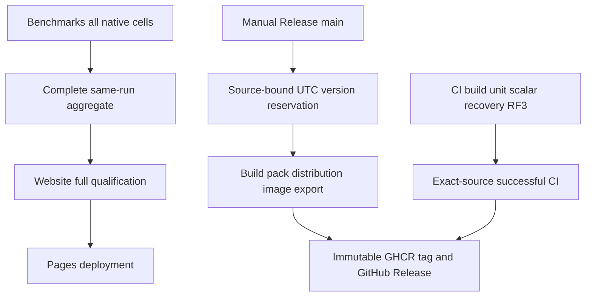

# ADR-064: Three pipelines and dated release delivery

Status: Accepted. Date: 2026-10-03. Owner: KeyLoad lead/integrator.
Requirements/acceptance: REQ/AC-PIPE-001..004 and REQ/AC-REL-001..003.
Supersedes ADR-062's five-workflow placement under explicit owner direction.
The later owner correction defers actual Release packaging/publication until product
readiness or an explicit release request; retain this implementation contract for
the prepared manual workflow. Provider qualification remains deferred.

## Decision and implementation contract

Exactly CI combines build/ordinary tests for PR/main/manual; Benchmarks owns all
load/native comparison measurement and downstream website qualification/deployment;
Release manually builds and publishes source-bound database distributions/images/
packages with `vM.m.yyMMdd.N`. Keep the existing RF3 topology, node-local storage,
workloads, isolated Linux cells and all product/site qualification requirements.

1. Lead owns workflow YAML, central version, Dockerfiles/distribution, policies,
   source-closure integration, durable docs, commits/pushes and final evidence.
   The [execution graph](../implementation/pipeline-release-v2-execution.md) defines
   disjoint read/write workers and lead join/review. Approved acceptance precedes
   write delegation. All tests run only in GitHub.
2. Move every original Tests job into CI, including analyzer/full build/format/
   rules/unit/scalar/recovery and genuine Docker/Aspire SDK/MCP RF3. Main/PR/manual
   triggers remain. Remove tests.yml. Preserve failing checks instead of bypassing.
3. Keep all existing Benchmarks image/27 preflight/108 CRUD/162 specialized/aggregate
   jobs, frozen names/steps/artifacts and actual native topology. Move complete
   Website qualify/deploy jobs unchanged in qualification strength behind successful
   aggregate and pinned TimeSeries image. Remove pages.yml. Keep job names qualify
   and deploy, read-only qualification and deployment-only Pages/OIDC writes.
4. Website executor is real Benchmarks/benchmarks.yml. The publication selection
   route authenticates only current run/attempt/SHA from actual GitHub environment,
   supports own-main push/manual, and replays/rechecks the exact same tuple during
   archive proof and deployment. No newer run or older attempt fallback; validation
   pins remain separate. Add explicit authenticated current-CI nonproducer inventory
   handling while historical selected KeyLoad CI producer/archives remain exact.
5. Central source configuration owns major/minor. Serialized Release freezes UTC
   date/run/source/version in an immutable same-run artifact. Daily N starts at 1,
   is >= actual daily run ordinal and > existing dated tag counters. Reruns recover
   the exact reservation; malformed/foreign/colliding/exhausted identity fails.
   Informational/image/tag use M.m.yyMMdd.N. NuGet retains the configured source
   development stage as M.m.yyMMdd.N-dev, because the existing third-party Cartograph
   dependency is alpha-only; do not suppress NU5104 or pretend it is stable. Freeze
   this derived package version in the reservation and inspect real nuspecs. CLR versions use M.m.0.0 and
   M.m.0.N so components remain <=65534. Never edit source version to count builds.
6. Read-only build restores/builds/formats/governs full source, packs actual projects,
   publishes Linux x64 server distribution, builds/exports existing server and
   benchmark images with version/source labels, verifies package versions and all
   asset hashes. RF3 distribution uses three persistent node-local Docker owners
   and the existing exact membership/routing configuration, with no local user data.
7. Write-limited publication verifies exact-source successful CI and actual assets,
   creates an annotated source/run/manifest-bound git tag without force, pushes
   only versioned GHCR image references, and creates GitHub Release with actual
   database/package/image assets and checksums. Reuse only matching owned existing
   identities; reject foreign/conflicting tags/images/assets. Failed publication
   retains recoverable evidence; do not mark partial output successful. Credentials
   stay in GitHub job context. No DNS or NuGet feed publication is added.
8. Integrate TUnit role/version/current-producer/legacy-nonproducer regressions;
   inspect all worker diffs and exact original native jobs; validate static scoped
   inventory, commit/push main, inspect actual CI/Benchmarks/Release jobs/artifacts.
   Current pre-existing SDK-status/RF3/Timescale/full-archive gaps remain explicit.
   Accepted cannot become Implemented without all required delivery evidence.

## Migration, rollback and evidence

No database storage/schema/public operation change. Historical report/tag bytes
remain immutable; no rewrite, force-push or protection bypass. Scoped source revert
rolls orchestration back, while published artifacts/tags remain recoverable records.
Missing complete benchmark inputs or failed CI block site/release publication rather
than supplying partial metrics or announcing a qualified database release. The
[acceptance matrix](../implementation/pipeline-release-v2-acceptance.md) maps every
criterion to TUnit, authentic provider/artifact proof or an explicit blocked review.
