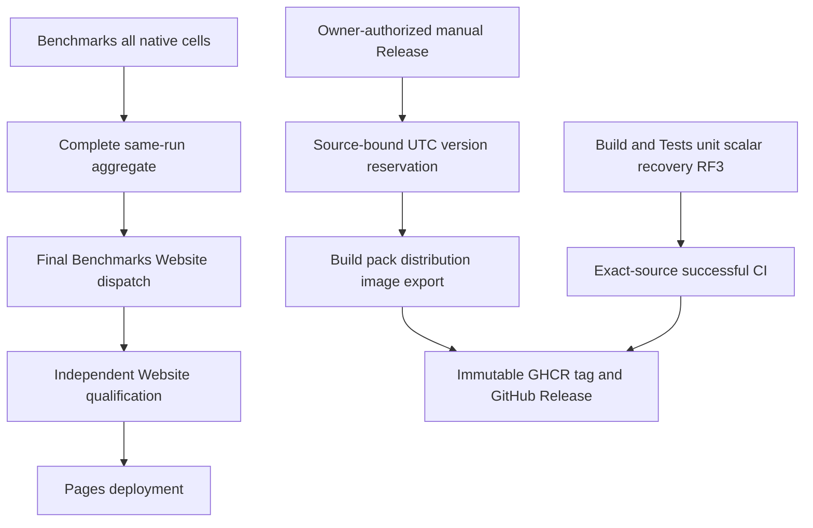
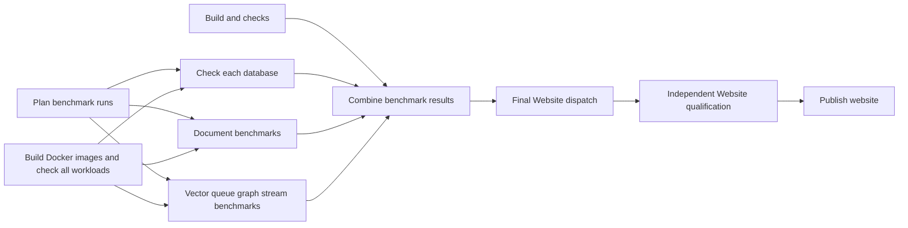

# ADR-064: Four workflows and source-bound release delivery

Status: Accepted. Date: 2026-10-03. Owner: KeyLoad lead/integrator.
Requirements/acceptance: REQ/AC-PIPE-001..004 and REQ/AC-REL-001..003.
Workflow responsibility follows ADR-062 and independent Website publication in ADR-112.
The later owner correction defers actual Release packaging/publication until product
readiness or an explicit release request; retain this implementation contract for
the prepared manual workflow. Provider qualification remains deferred.

## Decision and implementation contract

Build and Tests combines build/ordinary tests for PR/main/manual; Benchmarks owns
all load/native comparison measurement and its final dispatch to the independent
Website workflow; Website owns its qualification and Pages deployment;
Release is a prepared manual workflow; execute packaging or publication only
after product readiness or an explicit owner release request. When authorized, it
builds and publishes source-bound database distributions/images/packages with
`vM.m.yyMMdd.N`. Keep the existing RF3 topology, node-local storage, workloads,
isolated Linux cells and all product/site qualification requirements.

1. Lead owns workflow YAML, central version, Dockerfiles/distribution, policies,
   source-closure integration, durable docs, commits/pushes and final evidence.
   The [execution graph](../implementation/pipeline-release-v2-execution.md) defines
   disjoint read/write workers and lead join/review. Approved acceptance precedes
   write delegation. Local development uses only the Aspire-owned entry; exact-source Linux delivery gates remain required.
2. Build and Tests retains analyzer/full build/format/governance/unit/scalar/
   process recovery and genuine Docker/Aspire SDK/MCP RF3 under main/PR/manual.
   Every suite enters the intended AppHost and uses its discovered endpoints;
   failures remain visible and no required suite is skipped to publish a release.
3. Benchmarks retains the complete canonical per-database matrices, isolated Linux
   cells, native image checks, same-source original results and authenticated final
   aggregation. Each supported native topology and current 100K/1M scale has its
   declared ACK, accuracy, correctness, resource and workload contract.
4. Website is Website/website.yml, independently triggered by its own source push
   or manual dispatch. Benchmarks' final settled join dispatches it on trusted main.
   Current producer selection, complete optional metrics, content-only absence,
   source freshness and least-privilege Pages follow ADR-112. Build and Tests is
   not a benchmark producer or Website executor.
5. Central source configuration owns major/minor. Serialized Release freezes UTC
   date/run/source/version in an immutable same-run artifact. Daily N starts at 1,
   is >= actual daily run ordinal and > existing dated tag counters. Reruns recover
   the exact reservation; malformed/foreign/colliding/exhausted identity fails.
   Informational/image/tag use M.m.yyMMdd.N. NuGet retains the configured source
   development stage as M.m.yyMMdd.N-dev, because the existing third-party Cartograph
   dependency is alpha-only; do not suppress NU5104 or pretend it is stable. Freeze
   this derived package version in the reservation and inspect real nuspecs. CLR versions use M.m.0.0 and
   M.m.0.N so components remain <=65534. Never edit source version to count builds.
6. Read-only build restores/builds/formats/governs full source, packs actual projects,
   publishes Linux x64 server distribution, builds/exports existing server and
   benchmark images with version/source labels, verifies package versions and all
   asset hashes. RF3 distribution uses three persistent node-local Docker owners
   and the existing exact membership/routing configuration, with no local user data.
7. After the Release workflow is authorized, write-limited publication verifies
   exact-source successful CI and actual assets,
   creates an annotated source/run/manifest-bound git tag without force, pushes
   only versioned GHCR image references, and creates GitHub Release with actual
   database/package/image assets and checksums. Reuse only matching owned existing
   identities; reject foreign/conflicting tags/images/assets. Failed publication
   retains recoverable evidence; do not mark partial output successful. Credentials
   stay in GitHub job context. No DNS or NuGet feed publication is added.
8. Integrate TUnit role/version/current-producer/nonproducer regressions;
   inspect all worker diffs and exact original native jobs; validate static scoped
   inventory, commit/push main, inspect actual CI/Benchmarks/Release jobs/artifacts.
   Current pre-existing SDK-status/RF3/Timescale/full-archive gaps remain explicit.
   Accepted cannot become Implemented without all required delivery evidence.

## Readable shared Benchmarks repair contract

REQ-PIPE-005/006 / AC-UB-001..006 under [acceptance](../implementation/unified-benchmarks-workflow.md#acceptance)
and [task graph](../implementation/unified-benchmarks-workflow.md#execution) implement the owner's subsequent
job/step correction. The lead owns four workflow files, used composite labels,
policy and durable docs. A bounded test worker owns existing workflow-source tests
and new label regressions; a bounded contract worker owns only displayed-name
collector constants and matching independent oracles after the exact name map is
frozen. No topology, ACK, credentials, storage, package, workload or release change.

Stages: regression first; move actual pinned-image test/facts into common images;
rename every authored job/step with exact-source displayed-name validation updates;
review combined diffs; static governance; scoped main delivery; exact-SHA CI and
Benchmarks evidence. Preserve the complete canonical current planned-cell inventory and all preflights;
intensive TimeSeries and other native families retain their separate actual delivery gates. Failed/missing inputs still block publication. Rollback
reverts scoped source, retaining all historical raw records. ADR remains Accepted.
The latest parallelism correction removes mutual preparation dependencies and
cross-matrix sequencing/caps; aggregation explicitly includes build and every current database group. GitHub schedules independent isolated Linux jobs within account capacity.

## Rollback and evidence

No database storage/schema/public operation change. Historical report/tag bytes
remain immutable; no rewrite, force-push or protection bypass. Scoped source revert
rolls orchestration back, while published artifacts/tags remain recoverable records.
Missing complete metric inputs cannot supply partial metrics; Website may publish its
qualified content-only state under ADR-112. A failed exact-source Build and Tests
gate blocks Release publication. The
[acceptance matrix](../implementation/pipeline-release-v2-acceptance.md) maps every
criterion to TUnit, authentic provider/artifact proof or an explicit blocked review.
