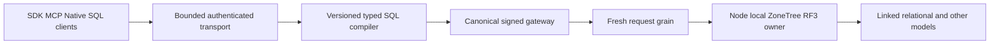

# ADR-065: Full SQL syntax and client protocol

Owner clarification 2026-10-03 requires full SQL for one composable database,
not merely independent per-model calls. [DatabaseComposition](../Features/DatabaseComposition.md)
and [ADR-067](ADR-067-composable-agent-database.md) define the first bounded atomic
queue-to-entity-to-graph and graph-to-queue derivation stage through existing CALL.
This is a prerequisite building block; full declarative sources, joins and
data-modifying statements across the models remain this ADR's required outcome.

Status: Accepted staged implementation contract; full execution/native protocol
and exact-source qualification pending. Date2026-10-03. Integration owner: KeyLoad
root planning agent. Related QueryExecution/ClientApi/RelationalStorage/Search;
REQ-SQLC-001–011 and AC-SQLC-001–011 in the root sql-client-compatibility acceptance.
This extends ADR-012/054; their initial Q1/CALL stage is historical, not the full
product. Existing SQL envelope1 and generated DTO IDs remain unchanged.

## Decision and conformance target

The owner requires full SQL syntax and a client connection protocol. Root selects
PostgreSQL18 as the working target after an optional unanswered dialect question;
this records a planning choice, not explicit owner selection or delivered support.
Maintain separate syntax, semantic execution and native client gates in
[conformance inventory](../implementation/sql-client-conformance.json). No parser
or package alone satisfies the requirement. Every required PostgreSQL18 grammar/
command family needs typed execution and real differential tests; any pending
family keeps the full SQL gate false. PostgreSQL wire3.0 is the first native
client target, with explicit3.2 negotiation fixtures before advertising that
version. Current HTTP/JSON plus official MCP remain their actual transports.

[Command inventory](../implementation/sql-client-commands-postgresql18.json)
enumerates all183 entries from the official version18 command index. Family
mapping is research inference;75 entries need explicit named coverage beyond
the ADMIN catch-all. All command semantic contracts and qualification remain
pending. This layer does not replace separate expression/type/function/operator/
clause/catalog/protocol inventories or authorize provider/session choices.

TASK-SQLC-R12 [pinned parser research](../implementation/sql-parser-candidate-review.md)
compares managed SqlParserCS and native PostgreSQL parser bindings. Tagged
libpg_query18.0.0 is the strongest inspected PG18 syntax reference, a planning
inference; existing wrapper/package PG18 provenance remains unverified. No parser
is selected or installed. Syntax structures do not provide catalog/type binding,
authorized execution or client sessions. Freeze native ABI/RIDs, ownership,
resource/cancellation/drain and typed-plan contracts before implementation; every
advertised family still requires real differential execution and RF3 proof.

Official targets: [PostgreSQL18 SQL](https://www.postgresql.org/docs/18/sql.html),
[syntax](https://www.postgresql.org/docs/18/sql-syntax.html),
[protocol](https://www.postgresql.org/docs/18/protocol.html),
[flow](https://www.postgresql.org/docs/18/protocol-flow.html),
[Npgsql types](https://www.npgsql.org/doc/types/basic.html).

## Ordered implementation contract

1. TASK-SQLC-R1/R2/R3/R4: actual grammar/executor/security/client baseline and
   pinned FullTextSearch review. Root joins source hashes and real GitHub reports.
2. TASK-SQLC-I1: requirements/acceptance/plan before code; root owns Abstractions
   `Features/QueryExecution/SqlTriviaReader.cs`, `SqlTriviaState.cs`, internal
   status/constants and Abstractions.csproj friend access. No public helper or
   dependency. Scanner interface: `Read(ReadOnlySpan<char> sql, ref int offset,
   ref SqlTriviaState state, int maximumDepth)` returns `More`, `Complete`,
   `UnterminatedComment` or `DepthLimitExceeded`. Valid callers supply a bounded
   offset and positive configured depth. One call consumes at most256 characters,
   leaves the first nontrivia character untouched and retains only scalar state.
   It recognizes whitespace, `--` through CR/LF/EOF, and nested `/* */` outside
   tokens. No quoted-content handling, text/token allocation, callback, effect or
   capability. Unterminated comments map to fixed Validation; excess nesting to
   BudgetExceeded; raw SQL UTF8 bytes still include comments. Callers check their
   original budget/cancellation before and between chunks.
3. TASK-SQLC-Q1: worker owns SqlTokenizer/SqlParser and new named SqlComment unit
   files only. First-author acceptance tests; apply helper only between tokens,
   using configured MaxQueryDepth. Existing quoted/parameter/number readers and
   query AST remain authoritative; comments cannot splice identifiers, operators
   or permit another statement. Real ZoneTree differential rows/explain and
   configured token/byte/depth/cancel cases prove AC002–004.
4. TASK-SQLC-S1: separate worker owns SqlOperationSyntaxReader, only its constructor
   join in SqlOperationCompiler, and new named SqlOperationComment unit files.
   First-author canonical catalog/ID/exact payload and invalid/single-statement
   tests. Pass existing configured depth to scanner; preserve sole catalog,
   argument/envelope bounds, persisted authority and actual fresh request gateway.
5. TASK-SQLC-C1: root owns Client `Features/QueryExecution/SqlWriteClassifier.cs`,
   SqlClient and new named SqlClientOutcome tests. First-author genuine Kestrel
   unknown-write regression. Classify only current exact unquoted SELECT or
   EXPLAIN SELECT roots as reads after bounded trivia. CALL, malformed/unknown/
   oversized/deep/quoted roots and future forms are conservatively possible
   writes. Default immutable DatabaseLimits bound SDK classification only;
   they do not grant server admission. SDK may finish one bounded prefix chunk
   to retain existing pre-cancelled SELECT/EXPLAIN SELECT read outcomes; cancellation
   before a continuation chunk yields conservative possible-write classification.
   The256-character cancelled-prefix allowance includes both EXPLAIN trivia gaps,
   keywords and boundary checks; it never restarts for a later gap.
   Query/Server still check their original budget before every chunk. Preserve
   original request body/IDs; no
   client retries or claimed rollback. Future grammar expansion must derive
   effects from actual typed plans or default conservatively to possible writes.
6. TASK-SQLC-I2: root reviews every worker diff against AC and joins actual RF3
   commented SDK/official MCP SELECT/CALL flows, architecture/status/README and
   scoped stable main delivery. Exact source development build/format/static
   checks precede actual GitHub CI normal/scalar/recovery/RF3 and Benchmarks.
7. TASK-SQLC-FULL: root freezes per-stage typed grammar/plan/type/metadata/session/
   auth/transaction/read-cut/error/admission/cancellation contracts before workers
   implement remaining command families and native transport. Bounded SQL joins,
   routines, aggregates/windows and all models must execute, not merely parse.
   Resource/lifetime/fault contracts and real native client fixtures are mandatory.
8. TASK-SQLC-NATIVE-JOIN / AC-SQLC-011 is a prerequisite of final delivery when
   current HEAD864aa378 omits the restore caller join for its new two-argument
   native backup verifier. Root reviews/joins only the existing
   Storage.ZoneTree Features/BackupRestore/ZoneTreeBackupRestoreRestore.cs;
   a disjoint worker first authors BackupRestoreStagingJoinTests in UnitTests.
   Existing ADR-060 TASK-IS-R4B / AC-IS-004 and REQ-BACKUP-002 / AC-BACKUP-002
   own private staging, exact source preservation, journal/cut verification,
   new identity/paused dispatch and publication cleanup. No format change or
   omitted verification shortcut is introduced. Actual valid absent/empty-target
   positives include normalized trailing separators so private staging remains
   a sibling. Rare chmod/delete/move/recreate failure identity and metadata
   rollback remain outside this bounded join's qualification; no broad filesystem
   fault-closure claim. Every delivered NativeBackupCut negative case must pass in
   GitHub after enabled build/format. Rollback follows the native owning slice.

Each scope's exact artifacts/start/dependencies/review gates are in the working
plan. Inherited capable workers have disjoint write scopes; root alone owns
contracts/config/docs/Git. No suitable cheaper route is established for the
shared lexical/outcome boundary; workers must escalate contract drift.

TASK-SQLC-R13 / AC006/007/008 source planning confirms that
[IAtomicStore](../../src/KeyLoad.Abstractions/Storage/StorageContracts.cs) exposes
callback-scoped reads/commits and
[the gateway](../../src/KeyLoad.Server/Features/ClientApi/CanonicalOperationGateway.cs)
dispatches one signed operation through an HTTP principal. A native session must
not retain a storage view, impersonate that HTTP context or treat separate CALL
commits as one SQL transaction. Freeze typed binding and same-cut model operators,
atomic set-DML/DDL, transport-neutral verified dispatch/original settlement, then
canonical session transaction read-cut/write-set/commit authority before wire
implementation. Simple-query implicit batches, explicit BEGIN and modifying CTEs
require their actual semantics and fault tests. Proposed API shapes remain
planning only. The70-input audit binds inspected working bytes at HEAD8071148c,
including undelivered composition work; it is not committed equality or runtime
proof. Packet SHA256 `10b154a3a3786152c8e821026c4919b4efea70a1e609fac8b0f33dff2ef9fb7a`.

## Native transport and search freezes

No handshake/listener/session implementation is authorized by the lexical
contract alone. The later native implementation contract must fix version/frame/
encoding, statement/result types and OIDs, simple/extended protocol, portal/cut,
implicit/explicit transaction state, SQLSTATE, startup/catalog client probes,
pipeline/connection/reply numeric limits and original execution drain. Every
command revalidates persisted principal/policy and uses a fresh request grain.
Current SHA256 API-key verifiers are not SCRAM verifiers. Do not invent SCRAM,
trusted roles or DefaultHttpContext to impersonate the HTTP gateway. Auth/TLS/
credential migration and transport-neutral gateway admission require explicit
review and their own real invalid/revoked/failover/cancel/recovery evidence.

[ZoneTree.FullTextSearch](https://github.com/ZoneTree/ZoneTree.FullTextSearch) is
the owner's search candidate under AC010/ADR-009; no package/replacement decision
yet. Its private query language cannot satisfy full SQL. Establish native tree
ownership, atomic index publication, rebuild/checkpoint/restart/collision/scoring,
partial cancellation, quotas and physical-replica proof before integration. Real
matched read/create/update/delete and fault/performance tests determine the choice.

## Migration, rollback and qualification

Stage1 is additive grammar/internal SDK classification only: no data, serializer,
SQL envelope version, API route, package or storage-format migration. Roll back
the shared reader and all consumers together. Preserve canonical execution and
native WAL/atomic/RF3 journals. Native transport or broader AST/data migrations
need separate stage contracts before implementation and explicit recovery proof.

First-author TUnit/MTP tests from AC; no mocks/doubles. Unit real-store/Kestrel,
process recovery and Docker/Aspire RF3 actual SDK plus official MCP qualify only
in GitHub. Local source checks do not prove runtime behavior. Missing collector/
coverage, native clients, full execution and complete isolated measurements stay
pending. No power-loss, full SQL, production or acceleration claim before the
corresponding complete exact-source evidence. Manual source review and DBeaver UI
login/query evidence are explicit review exceptions, not substitutes for driver
tests or numeric coverage. Dependencies: ADR-004/009/010/012/013/014/020/022/024/
035/036/039/042/054/055/056/059; root preserves independent benchmark work.
