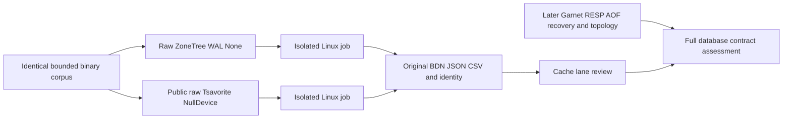

# ADR-066: Isolated Garnet/Tsavorite versus ZoneTree evaluation

Status: Accepted,2026-10-03. Implementation and native qualification pending.

Subsequent explicit owner correction on the same date permits local tests and BenchmarkDotNet development experiments, while website/global measurements remain exclusively authenticated GitHub-produced data. This supersedes earlier local-execution prohibitions for development checks, preserves the frozen correctness/resource contracts and requires separately labelled local source/machine/raw artifacts.

The owner requested actual Garnet versus ZoneTree performance tests and a measured choice or justified combination. KeyLoad's authoritative node-local ZoneTree/atomic WAL, Orleans requests and RF3 remain mandatory. A new engine must be assessed against matching caller-visible and fault contracts before product integration.

## Decision and capability boundary

Start GE001 with genuine public raw Tsavorite and raw ZoneTree resident cache operations, isolated in two Linux GitHub jobs. The full Garnet service is a subsequent required experiment. Raw Tsavorite is not Garnet RESP/AOF or KeyLoad. No production storage is changed by this ADR.

[Garnet2.2.0](https://github.com/microsoft/garnet/releases/tag/v2.2.0) is pinned to source0d585906eeb5dd77e130a8de6351683336cb168a and published Microsoft.Garnet2.2.0 package, actual NuGet SHA256 cc11bd69f27417f09c42e2927598efd834b4d03919ba0eb29ce6e1d3251b7230. ZoneTree1.9.8 remains pinned. Garnet's Provider/StorageSession/RESP session factories are internal; do not copy an internal bridge or assume StoreApi is a command-session API. Public Tsavorite2.2 uses byte records and store-function/allocator generics, not older generic key/value examples.

Public Tsavorite Read copies bytes. Compare raw ZoneTree using the same owned output copy, with native WAL None. KeyLoad's wrapper/journal is excluded from this diagnostic baseline. Tsavorite uses public KVSettings(baseDir:null), explicit128MiB resident log/4MiB index/1MiB page/128MiB segment/no read cache or recovery. Actually pinned immutable16-byte keys, two immutable value versions,4096records and32/1024-byte payloads remain alive through actual operation/close. One non-concurrent session/worker per fixture;65536 attempted-write bound includes seeding and cannot reset. Each measurement uses one launch/3warmups/5iterations/1024invocations, bounding transient-key churn.

Reads expose session-owned scratch only until the next read. Miss/overwrite/delete/recreate must have exact binary bytes and terminal native statuses. Unexpected pending, eviction, faults or missing artifacts fail the lane; no discarded observations. Vendor synchronous session Dispose may settle pending operations without a finite close API. Native job/process timeout is the final resource bound; it is not graceful-shutdown proof. Constructor/vendor-hidden cleanup limitations remain explicit pending fault evidence.

## Implementation contract

Requirements REQ-GE-001..006 and AC-GE-001..006 are defined in [GarnetStorageEvaluation](../Features/BenchmarkComparisons/GarnetStorageEvaluation.md) and root garnet-storage-evaluation.acceptance.md. Canonical slice BenchmarkComparisons; frontend N/A because these diagnostics are not yet qualified public service measurements. Existing270-cell comparisons and site publication are unchanged.

1. Root freezes criteria/API/task graph and retains actual native full baseline before implementation. Ordered test-first stage GE001-T owns only NEW UnitTests RawStorage-prefixed sources. GE001-E starts after root test review and owns only NEW BenchmarkScenarios RawStorage-prefixed sources. Root owns all shared config/workflow/ADR/status joins.
2. Frozen internal RawStorageEngineKind/RawStorageCorpus/RawStorageFixture API and public unsealed XML-documented RawStorageBenchmarks generated-consumer fixture are specified in the feature. No new product API. Real public Tsavorite sessions and native ZoneTree factories only; no reflection, vendor copy, unsafe epoch, global serializing gate or fake dependency.
3. Test binary CRUD fidelity, reserved missing/transient keys, first/last values, immutability, maximum-write precondition/cap, invalid/disposed contracts and idempotent owner close. Session/output/store/settings-directory ownership must be explicit. Body and independently observed close failures remain visible.
4. Root pins Microsoft.Garnet2.2.0 centrally, references it only in the nonpackable benchmark library, adds its internal friend UnitTests and integrates two matrix jobs inside existing benchmarks.yml. Each process selects one engine with KEYLOAD_RAW_STORAGE_ENGINE. Build before tests/run; real BDN generated consumer exports full JSON/CSV/stdout and immutable runtime/settings/package/execution identity. Existing public EmbeddedBenchmarks' three operations remain untouched.
5. Strong read-only review inspects exact combined source against API, pin, ownership, fairness and limits. Root runs full source gates and commits/pushes all requested eligible current changes on main. No stash, worktree, force or package locks.
6. Actual delivered-source GitHub normal/scalar TUnit and both raw native jobs are required. Preserve exact SHA/run/attempt/job/archives and real failure lists. Completed source/build or Dry alone does not satisfy performance/fault criteria. No skipped case passes.

The optional raw_storage_only boolean manual mode defaultsfalse and has a separate concurrency suffix. Its full-source check and unmeasured normal/scalar correctness job precede the two raw engine jobs, while service plan/images and their publication dependants remain skipped/unqualified. Normal push/default behavior and270 contract remain intact. NEW RawStorageEvaluation composite action has its local policy before code; source TUnit contracts and actual native full-JSON completeness guard map AC-GE-005.

GE005-V freezes a pure no-I/O raw-storage-report.mjs validateReport(report,engine) module and typed TUnit controlled-schema input/real bounded Node-process tests before its implementation. It checks all8parameter tuples, version, positive finite statistics, allocations and five actual Workload/Actual iterations plus exactly Statistics.N retained Workload/Result iterations; it never creates measurements/receipts. Root owns the separate raw-storage-evidence.mjs executor/package/original-file binding CLI and actual provider authentication. Parser vectors are not fake engine/runtime proof and cannot publish. Original bytes remain unchanged; actual V8 coverage/normal/scalar/native report acceptance must be retained. The feature/acceptance contains the exact shape and negative-flow contract.

GE005-V regression input crosses the existing bounded real Node-process boundary as one base64-encoded argument with a64KiB UTF-8 pre-launch cap. No temporary input file is owned by a second helper, so a deferred original-child close cannot race an unrelated directory cleanup or replace the primary failure. This is controlled parser test data only; the production executor continues to read original authenticated artifact files.

Temporary maintainability exception: the existing398-line benchmarks.yml composition root may grow to at most500lines for the three diagnostic job/input declarations. Root owns extraction of reused setup/measurement code into the new scoped composite action immediately; remaining job composition refactoring must preserve every service/site dependency/test and restore400lines by2026-10-10. This is limited migration debt, not a target-layout exception or permission to suppress diagnostics; all new C#/action/helper files retain ordinary limits.

Task graph/roles/permissions/dependencies/start/join conditions: root garnet-storage-evaluation.plan.md. Workers stop on API/ownership ambiguity and may not expand frozen scope. Root owns final integration/review and authentic CI evidence. Full relevant baseline is the actual observed c241 CI/Benchmarks state plus retained earlier exact-SHA receipts; local builds are explicitly not qualification.

## Migration, rollback and remaining decision

No data migration, authority/security change, credentials or storage replacement. Diagnostic rollback removes the new dependency/fixtures/jobs only. Full Garnet AOF/ACK/restart, ordered scans/range semantics, multi-operation atomicity and native replication differ from KeyLoad's quorum contract; separate experiments must qualify them before a durable-store choice. A possible disposable cache above authoritative ZoneTree additionally needs invalidation, read-cut fencing, bounded memory, Orleans movement and fault tests in its own ADR. Raw speed is insufficient justification.

The later multi-worker and multi-host stages must retain one session per non-concurrent worker, real resource/latency/throughput/backlog measurements, actual node/replica identities and equal correctness/fault contracts. They remain required and unimplemented here. Keep this ADR Accepted until source, all mapped tests, required evidence and decision record exist.

Observed native exporter correction2026-10-03: the real local BDN0.15.8 full report contains five Workload/Actual rows but only four Workload/Result rows when one outlier is removed. AC-GE-005 now validates five actual iterations and N retained result iterations separately; it must reject incomplete actual iterations, inconsistent retained counts and invalid stage identity. This corrects report semantics without changing measured values or publishing local evidence.

AC-GE-004 configuration correction before implementation: keep the default genuine job at one launch/3warmups/5iterations/1024invocations/unroll1, but set invocationCount in SimpleJob rather than an InvocationCount mutator attribute. The latter overrode the genuine CLI read-only duration override in the observed generated consumer. Metadata tests must assert unchanged default invocation/unroll settings; a real local read-only generated runner must show its requested1048576operations in actual job/rows before describing a long measurement. The frozen write quota and eight-cell GitHub lane remain unchanged. CLI-modified read-only reports are separate development diagnostics.

Local read duration refinement: the supported unroll-only ManualConfig and SimpleJob invocation default now produce genuine1048576-operation rows. Point-read iterations satisfy the100ms guidance, but missing-read iterations still warn at27ms. Root will compare both engines sequentially at4194304invocations/8warmups/10iterations, preserving4closed read-only cells and every original report separately. This is bounded development measurement, not the frozen8-cell/5iteration GitHub evidence contract or fault qualification.

Coverage join finding: NODE_V8_COVERAGE declared on the action does not reach the shared isolated Node child because its environment whitelist retains only PATH. Do not describe this as collected coverage or a passing numeric gate. Collector ownership and actual threshold evidence remain required/open.
