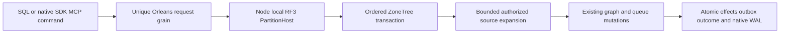

# ADR-067: One composable database for AI agents

Status: Accepted. Date: 2026-10-03. Owner: root integration agent.
REQ-COMP-001–007 / AC-COMP-001–009, [DatabaseComposition](../Features/DatabaseComposition.md).

## Decision

The product is one database whose documents, typed tables, graphs, blobs, queues,
events, vectors/search and time series can reference and use one another. SQL is
the familiar central language across them. A model/resource boundary is logical
organization, not a separate database or an obstacle to composition. Preserve
canonical EntityRef identity, persisted authority and explicit atomic partitions.
The target supports one SQL request reading queue messages, resolving linked
entities and writing a knowledge graph, and graph-driven queue workflows.

Extend ADR-054's invocation stage with two typed atomic composing mutations:
QueueToGraph and GraphToQueue. They run inside the existing CommandRequest apply
transaction and expand to existing primitive mutations, receipts and outbox.
SQL `CALL keyload_documents_commit(@arguments)` reaches the same operation through
the sole catalog and signed request gateway. Full declarative model sources,
joins and data-modifying SQL remain mandatory under ADR-065; this is a delivered
stage only after actual tests, never the completed full SQL product.

## Implementation contract

1. TASK-COMP-001 freezes requirements, DTOs, states, grants, bounds and errors in
   this ADR and [DatabaseComposition](../Features/DatabaseComposition.md). Root owns AGENTS, shared contracts, architecture/design,
   ADR/index/status and final evidence. No dependency or format substitution.
2. TASK-COMP-004 adds attributed native DTOs in Abstractions/Features/DatabaseComposition,
   stable v1 aliases/field IDs and additive JSON mutation discriminators. Root
   owns Contracts.cs and NativeContractAliases.cs joins exclusively.
3. TASK-COMP-002 worker first authors real-store acceptance regressions, then owns
   only new Core/Features/DatabaseComposition helpers and UnitTests matching
   slice. Freeze APIs: ExpandComposition(IAtomicTransaction, PrincipalRecord,
   PartitionRef, Mutation, DateTimeOffset, ReadExecutionBudget) ->
   IReadOnlyList<Mutation>; AuthorizeComposition(IKeyValueView, PrincipalRecord,
   PartitionRef, Mutation). Expand helper materializes before writes; no storage
   view/iterator or decoded body escapes the transaction. Noncomposing input
   returns one original mutation. Composition sources share one deterministic
   read-byte budget per ApplyMutations. Root joins expanded mutation count and
   ordinary outbox paths in AtomicMutationApplication, protocol owner/bounds,
   command source/target authorization and reauthorization before cached replay.
4. TASK-COMP-003 copy worker owns additive README intro, existing site HTML and
   matching TUnit content files, preserving unrelated edits and exact measured
   values. Copy names both directions and distinguishes the current stage.
5. TASK-COMP-004 root joins real Docker/Aspire RF3 through SQL .NET and official
   MCP clients, serialization, stable retry and safe-error cases. Root reviews
   every diff against requirements before shared final checks and Git delivery.
6. TASK-COMP-006 adds a private composition CrashHost mode and canonical
   DatabaseComposition recovery tests. Root owns the existing CrashHostApplication
   dispatch join; worker owns new matching feature files exclusively. Seed real
   catalog/documents/queue with observer disarmed, save the original command, arm
   its exact next commit position and run forward/reverse composition together.
   Parent kills the real child at HeaderWritten, PayloadWritten, JournalFlushed,
   MutationApplied and ApplyCompleted; reopen must recover one whole cut including
   edges, generated messages, outbox, outcome/private authority and stable replay.
   Use existing storage trial admission, bounded waits, file readiness and cleanup;
   do not weaken generic recovery cases or call this power-loss proof.
7. TASK-COMP-005 records development versus exact-source GitHub proof separately;
   build/analyzers/format/governance, normal/scalar, process recovery and RF3 gates
   remain mandatory. Full site publication waits on complete Benchmarks producer.
8. TASK-COMP-008 (root) owns the README and landing AI-native thesis copy and the
   SiteProductCopy/SiteProductThesis* content tests for REQ-COMP-007/AC-COMP-009.
   It changes no runtime contract, storage, serialization or topology.

Determinism: replicated apply cannot use a local elapsed deadline or caller
cancellation to choose effects. A frozen monotonic TimeProvider feeds the existing
read budget; numeric scan/read/expanded-effect/frame bounds remain enforced.
Public admission/deadline/unknown-write contracts remain with existing owners.
All resources share the exact catalog-bound atomic partition. Source Ready queue
projection does not claim, sweep or ACK; leased/scheduled/expired sources are not
converted. Source caps reject incomplete scans; derived IDs are prefix+source ID,
with create-only edges and ordinary duplicate-message rejection. Earlier staged
mutations are visible; errors reset the whole mixed transaction.

Authorization requires QueueInspect/GraphWrite or GraphRead/QueuePublish,
source raw-read/raw-use and target write grants and visible canonical rows.
Current authority is rechecked before receipt-only replay; no source rescan or
effect duplication on stable command retries. Payload mismatch still conflicts.
Receipts contain actual primitive effects, not raw copied source documents.

Current generated native DTOs persist a `CompositionOutcomeAuthority` containing
distinct authorized `EntityRef` endpoints selected by successful composition
(and the explicit reverse start) alongside `StoredOutcome` at stable field ID5.
The internal `MutationReceipt` uses stable field ID4, ignored by public JSON, with
an empty value for ordinary effects. Ordered apply marks expanded effects and
captures endpoints from already-authorized primitive operands after success,
then folds those references into the stored outcome. Do not infer origin from
prefixes or reread final target records: a later valid delete or unrelated
message must not break the command. Do not rescan sources or spend an extra
post-apply storage read budget. Current composition operations require authority
on replay, fail closed when it is absent or invalid, and recheck current
DocumentsRead/catalog/row visibility for saved endpoints. Source changes or
ACK/deletion do not select new effects on retries. Bound saved references by the
existing expanded-mutation limits. All RF3 voters run the same current serializer
contract before composition producers are enabled.

This stage accepts composition only in standalone CommandRequest batches. Handler,
subscription and projection inbox Effects explicitly reject these new mutation
types before dispatch with UnsupportedCapability; their existing primitive
effects remain available. A later lease/ACK composition stage must retain saved
authority through every inbox receipt and recheck it on new-command handler
replays before enabling those joins. Ready projection does not consume messages.

Dependencies: ADR-004/010/014/022/024/026/054/055/060/065. Current generated DTO
identities and public JSON contracts remain stable; primitive stored data and
existing digest format remain unchanged. Every active node must run the same
current contract before composition producers are enabled. Recovery continues to
use canonical graph/queue data and the existing journals. Agent ownership/start,
tests, error flows and join conditions are frozen in this implementation contract
and the durable feature acceptance below. Remain Accepted until required
implementation, tests and exact-source qualification evidence exist.

TASK-COMP-007 / AC-COMP-004/007/008 requires independent value oracles for
current document mutation images. Expected values are constructed independently
from the production canonicalizer; compare every decoded entry, receipt,
polymorphic mutation and before/after image, then require byte-exact native
reserialization of the actual decoded graph. Preserve actual store operations,
sequential same-ID mutations, tombstone/revision/outbox counts and failure/CAS
assertions. These checks do not authorize serializer or durability changes.

RF3 AC-COMP-007 fixture refinement: existing Enqueue canonicalizes the outer
payload JSON before projection. Compare the complete decoded QueueGraphLink
against the submitted link, including canonical endpoints, label and exact
AttributesJson string; preserve source Ready/Attempts and graph assertions.
Original property ordering is not a queue contract. Do not change queue storage
or invoke a second projection to bypass the failure. Root owns this RF3 test
join and must rerun the genuine SDK/MCP workflow before qualification.

## TASK-KL095-TOPIC-SQL-COMPOSITION-COLD-001 — actual composition cold/current-grant continuation

REQ-COMP and AC-COMP-004/007 retain the existing same-partition native QueueToGraph/GraphToQueue pipeline, fresh per-mutation persisted permissions, bounded staged source reads and atomic original receipts. AC-COMP-SQL-COLD-001 extends the SAME AC_COMP_007 real RF3 case, preserving AC_COMP_004 late invalid-reference rollback, all original arguments/assertions and the original two-minute caller lifetime. It retains the genuine forward AND reverse command/receipt before disposing clients, performs first same-volume cohort cold, compares complete original documents/graph/queue inspection records and replays both receipts through actual SDK, official MCP and both Q1 routes. A separate configured same-partition graph isolates current GraphWrite refusal for a mixed document+QueueToGraph operation. Exact PermissionDenied/no-value across the actual four routes leaves the marker absent, new graph empty and all original models unchanged. After actual persisted policy restoration, replay of the FAILED original command stays failed; a distinct command commits its actual marker plus two graph edges, full receipt/model checks hold, then a second same-volume cold and fresh credential session replay all original and healthy receipts.

Native authority remains unchanged: QueueInspect+GraphWrite for forward; GraphRead+QueuePublish+DocumentsRead for reverse, plus existing source field use/raw read and target write policies. No native provider, signing, activation, schema, dispatcher, source ACK/claim, quotas, clock, timeout, retries or distributed transaction is added. New purpose roles are CompositionSqlColdState/Capture/Assertions/Authority/Trial. Capturing actual public records does not replace independent literal edge/link checks already in the original case. Shared source snapshots and client cleanup reuse original owners/failure ledgers; narrow shared RF3 scheduling stays unchanged and Unit50 remains mandatory.

See QueryExecution TASK-KL095-TOPIC-SQL-COMPOSITION-COLD-001 for TopicEvents=2 using the same native cut, payload/header policy and public cold contracts. Root must compose its exact append with the earlier pending-DLQ SQL guard documents once, preserving both bodies. Source-only authored stage: coherent build, native typed UID discovery and delivered-source Linux normal/scalar/process/RF3 qualification remain OPEN. Declarative queue↔entity model JOIN/DML and full SQL/client-wire conformance remain explicitly unsupported/pending; existing procedural CALL composition is not relabelled as full SQL.

### TASK-KL095-TOPIC-SQL-COMPOSITION-COLD-001 — current Phase2/PendingDeadLetter source rebase

This finite successor preserves the original R1 source contract, all eight Topic query fields and unchanged source/position/generation, current Query+TopicsRead field privacy, original raw/result/cancel budgets, same-generation purge, four actual Unit declarations, four original RF3 route arguments and existing complete CALL composition/cold cases. Preserve the current PendingDeadLetter SQL documentation and Phase2 pending/parked/order/current capability semantics; Topic is a pure existing event-source reader, not a new queue decoder or a replacement query inventory. All original public aliases/field IDs/operation IDs and SQL/Q1 version declarations remain exact; TopicEvents appends after Events/QueueMessages, and full SQL/JOIN/DML/client-wire gates remain OPEN.

Native API preflight establishes SourceHead/SourceRecord in the same DatabaseEngine partial and SourceEventReader's exact Topic source+position validation; IKeyValueView.ReadOwnedValue is an instance member, while StorageRecords.GetRecord is the existing KeyLoad.Storage extension. SqlRf3Protocol belongs to KeyLoad.IntegrationTests.Features.QueryExecution, and original request/AST/event/data/row/permission constructors retain their current shapes. Correct the private composition tuple to global::KeyLoad.GraphTraversal so the sibling GraphTraversal namespace cannot capture the type; materialize the original direct-or-Q1 official MCP request into an explicitly bounded object before generic CallAsync<T>, preserving the exact DTO value and official Arguments serializer. No API/signing/transport/schema/lifetime behavior is changed by these compile-intent corrections.

Root alone joins, builds/analyzes, discovers native identities and executes current-source Linux normal/scalar plus real process and Aspire RF3. Focused canonical selections after coherent build are scripts/Features/TestInfrastructure/run-tests.mjs with Suite=unit or unit-scalar and Filter=/*/*/(TopicSqlNativeTests|TopicSqlNativeRecoveryTests)/*, and Suite=rf3 with Filter=/*/*/(TopicSqlRf3Tests|DatabaseCompositionRf3Tests)/*. Preserve native50 ordinary and existing exclusive RF3 fixture groups, original deadlines, every original required suite and exact source/DLL/PDB/runtime/cleanup artifacts. Declarations/arguments/previews are not native UIDs, compiler success or PASS.
