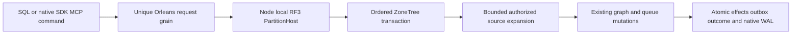

# ADR-067: One composable database for AI agents

Status: Accepted. Date: 2026-10-03. Owner: root integration agent.
REQ-COMP-001–006 / AC-COMP-001–008, [DatabaseComposition](../Features/DatabaseComposition.md).

## Decision

The product is one database whose documents, typed tables, graphs, blobs, queues,
events, vectors/search and time series can reference and use one another. SQL is
the familiar central language across them. A model/resource boundary is logical
organization, not a separate database or an obstacle to composition. Preserve
canonical EntityRef identity, persisted authority and explicit atomic partitions.
The target supports one SQL request reading queue messages, resolving linked
entities and writing a knowledge graph, and graph-driven queue workflows.

Extend ADR-054's invocation stage with two typed atomic composing mutations:
QueueToGraph and GraphToQueue. They run inside the existing CommandRequest apply
transaction and expand to existing primitive mutations, receipts and outbox.
SQL `CALL keyload_documents_commit(@arguments)` reaches the same operation through
the sole catalog and signed request gateway. Full declarative model sources,
joins and data-modifying SQL remain mandatory under ADR-065; this is a delivered
stage only after actual tests, never the completed full SQL product.

## Implementation contract

1. TASK-COMP-001 freezes requirements, DTOs, states, grants, bounds and errors in
   root acceptance/plan. Root owns AGENTS, shared contracts, architecture/design,
   ADR/index/status and final evidence. No dependency or format substitution.
2. TASK-COMP-004 adds attributed native DTOs in Abstractions/Features/DatabaseComposition,
   stable v1 aliases/field IDs and additive JSON mutation discriminators. Root
   owns Contracts.cs and NativeContractAliases.cs joins exclusively.
3. TASK-COMP-002 worker first authors real-store acceptance regressions, then owns
   only new Core/Features/DatabaseComposition helpers and UnitTests matching
   slice. Freeze APIs: ExpandComposition(IAtomicTransaction, PrincipalRecord,
   PartitionRef, Mutation, DateTimeOffset, ReadExecutionBudget) ->
   IReadOnlyList<Mutation>; AuthorizeComposition(IKeyValueView, PrincipalRecord,
   PartitionRef, Mutation). Expand helper materializes before writes; no storage
   view/iterator or decoded body escapes the transaction. Noncomposing input
   returns one original mutation. Composition sources share one deterministic
   read-byte budget per ApplyMutations. Root joins expanded mutation count and
   ordinary outbox paths in AtomicMutationApplication, protocol owner/bounds,
   command source/target authorization and reauthorization before cached replay.
4. TASK-COMP-003 copy worker owns additive README intro, existing site HTML and
   matching TUnit content files, preserving unrelated edits and exact measured
   values. Copy names both directions and distinguishes the current stage.
5. TASK-COMP-004 root joins real Docker/Aspire RF3 through SQL .NET and official
   MCP clients, serialization, stable retry and safe-error cases. Root reviews
   every diff against requirements before shared final checks and Git delivery.
6. TASK-COMP-006 adds a private composition CrashHost mode and canonical
   DatabaseComposition recovery tests. Root owns the existing CrashHostApplication
   dispatch join; worker owns new matching feature files exclusively. Seed real
   catalog/documents/queue with observer disarmed, save the original command, arm
   its exact next commit position and run forward/reverse composition together.
   Parent kills the real child at HeaderWritten, PayloadWritten, JournalFlushed,
   MutationApplied and ApplyCompleted; reopen must recover one whole cut including
   edges, generated messages, outbox, outcome/private authority and stable replay.
   Use existing storage trial admission, bounded waits, file readiness and cleanup;
   do not weaken generic recovery cases or call this power-loss proof.
7. TASK-COMP-005 records development versus exact-source GitHub proof separately;
   build/analyzers/format/governance, normal/scalar, process recovery and RF3 gates
   remain mandatory. Full site publication waits on complete Benchmarks producer.

Determinism: replicated apply cannot use a local elapsed deadline or caller
cancellation to choose effects. A frozen monotonic TimeProvider feeds the existing
read budget; numeric scan/read/expanded-effect/frame bounds remain enforced.
Public admission/deadline/unknown-write contracts remain with existing owners.
All resources share the exact catalog-bound atomic partition. Source Ready queue
projection does not claim, sweep or ACK; leased/scheduled/expired sources are not
converted. Source caps reject incomplete scans; derived IDs are prefix+source ID,
with create-only edges and ordinary duplicate-message rejection. Earlier staged
mutations are visible; errors reset the whole mixed transaction.

Authorization requires QueueInspect/GraphWrite or GraphRead/QueuePublish,
source raw-read/raw-use and target write grants and visible canonical rows.
Current authority is rechecked before receipt-only replay; no source rescan or
effect duplication on stable command retries. Payload mismatch still conflicts.
Receipts contain actual primitive effects, not raw copied source documents.

Reviewed TASK-COMP-004 refinement: persist a native generated
CompositionOutcomeAuthority containing distinct authorized EntityRef endpoints
selected by successful composition (and the explicit reverse start) alongside
the existing StoredOutcome. Append optional field ID5; preserve IDs0–4 and old
outcomes without composition. Append internal native MutationReceipt field ID4,
ignored by public JSON, with an empty default for ordinary effects. Ordered apply
marks expanded effects explicitly and captures endpoints from their already
authorized primitive operands after success, then folds those saved refs into the
outcome. Do not infer origin from prefixes or reread final target records: a later
valid delete or unrelated message must not break the command. No source rescan or
extra post-apply storage read budget. New composing operations require authority on
replay, fail closed if missing, and recheck current DocumentsRead/catalog/row
visibility for its saved endpoints. Source changes or ACK/deletion do not select
new effects on retries. This prevents unchanged-principal row-policy changes from
revealing a stale derived receipt. Bound saved refs by expanded mutation limits;
same homogeneous pre-producer rollout applies to the additive generated field.
Freeze actual native MutationReceipt/StoredOutcome bytes from the committed
pre-composition writer at8071148cd; current reader must decode absent appended
fields without losing ordinary receipt/outcome data. The internal receipt
reference getter normalizes an omitted legacy field to an empty collection:
generated Orleans decode does not run its property initializer. Validate all
present references normally; do not relax global default-collection validation. This tests that explicit
upgrade seam, not universal old-store or downgrade compatibility.

This stage accepts composition only in standalone CommandRequest batches. Handler,
subscription and projection inbox Effects explicitly reject these new mutation
types before dispatch with UnsupportedCapability; their existing primitive
effects remain available. A later lease/ACK composition stage must retain saved
authority through every inbox receipt and recheck it on new-command handler
replays before enabling those joins. Ready projection does not consume messages.

Dependencies: ADR-004/010/014/022/024/026/054/055/060/065. Rollout is additive public
JSON, but new native DTOs require homogeneous upgraded nodes before producers
issue them. Primitive stored data and existing digest format remain unchanged.
Rollback stops new producers/advertisement; committed graph/queue data remain
canonical. No old-store conversion or journal removal. Agent ownership/start,
tests, error flows and join conditions are frozen in this implementation contract
and the durable feature acceptance below. The local root plan tracks execution.
Remain Accepted until all required source/migration/tests/GitHub evidence exist.

TASK-COMP-007 / AC-COMP-004/007/008 preserves the existing AC-DSTORE-005
outbox-image regression after the native format change. Its independently
constructed expected object graph shares Resource/Collection strings and creates
separate RowAccess values, while actual canonical decode and document `with`
clones have different reference sharing. Orleans encodes those relationships;
value-equal graphs need not have identical bytes. The pre-composition writer
reproduces this failure. Test-only repair compares every decoded entry/receipt,
polymorphic mutation and before/after image value, then requires byte-exact native
reserialization of the actual decoded graph. Preserve the real store, sequential
same-ID mutations, tombstone/revision/outbox counts and failure/CAS assertions.
Worker owns only DocumentMutationImageTests.cs; root owns this contract and source
join. No serializer, production image path or durability behavior changes. Build
and focused native outbox/composition tests precede scoped delivery; complete
Linux CI remains required. This corrects a fixture reference-identity assumption,
not the exact user-content or frozen canonical digest contracts.

RF3 AC-COMP-007 fixture refinement: existing Enqueue canonicalizes the outer
payload JSON before projection. Compare the complete decoded QueueGraphLink
against the submitted link, including canonical endpoints, label and exact
AttributesJson string; preserve source Ready/Attempts and graph assertions.
Original property ordering is not a queue contract. Do not change queue storage
or invoke a second projection to bypass the failure. Root owns this RF3 test
join and must rerun the genuine SDK/MCP workflow before qualification.
