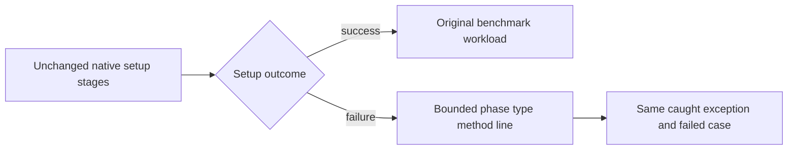
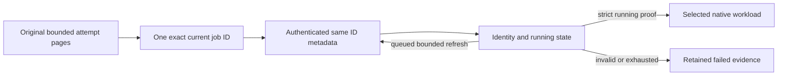

# ADR-068: Native benchmark gate repair

Status: Accepted bounded implementation contract; qualification pending.
Date: 2026-10-03. Root integration owns BenchmarkComparisons and all shared joins.

## Accepted stage D: bounded native setup diagnostics

TASK-NGR-R5 retained a second actual Kurrent n2 initialization NotLeaderException
at source366, run37123589283/job111205160819, after current-job verification
passed. No measurement or callsite is retained. Its sealed original packet
SHA256 `1971c6884d2d58989808e6084668b75d4709da2eec455dc8c19f500cf7b8df5b`
does not prove a routing or startup-election defect.

REQ-NGR-003 / AC-NGR-003D is approved for observability only. Ordered contract:
first-author genuine-thrown pure formatter tests; then bounded gpt-6-luna/high
worker changes only Comparisons Features/BenchmarkComparisons/KurrentTarget.cs
and NEW KurrentSetupDiagnostics.cs/KurrentSetupStage.cs plus NEW UnitTests
Features/BenchmarkComparisons/KurrentSetupDiagnostic-prefixed files; root reviews
every diff and owns frozen integrated build/format/static checks, receipts/Git
and exact-source GitHub qualification. The internal target-owned closed enum
tracks writer construction, membership, NoStream semantics, seeding, copy and
complete. Existing operations/order, cancellation, ownership, copies, ACKs and
timing remain. Extract a private setup core if needed to obey function/type limits.
NEW KurrentTargetProfile.cs may receive only the unchanged existing CreateProfile
method body as internal static Create, with the constructor join adjusted and
original method removed, to preserve the200-line type limit. Exact literal
profile/settings/branch/parameter parity is required; no additional behavior.

One failure-only best-effort ASCII stderr line emits phase, actual caught type
and type/method stack metadata; at most3 causes,8 frames/cause,64 characters per
identifier and4096 bytes. No Message/Data/ToString/raw stack/file path/line,
credentials, endpoints or user payload; only existing stderr output, no other
I/O, client, task, gossip, retry,
poll or wait. Diagnostic errors cannot replace the same caught exception,
rethrow preserves its stack. The existing captured runner stderr is the join,
with no public report/schema/interface/package change or successful setup log.

Tests prove safe formatting/bounds with real filesystem/arithmetic/cancellation
exceptions and bounded deep/inner chains, not mocked native failure. Existing
actual1/2/3 preflight proves success; any genuine initialization failure must
retain its original failed/null-measurement case plus the diagnostic. If no such
failure occurs, native failure-path proof stays pending. Earlier verifier
disposal can mask a primary exception; this stage observes the caught boundary
and does not close that separate lifetime defect or global stderr blocking.
Frame limits apply to emitted/accessed metadata and the linear InnerException
chain only. System.Diagnostics.StackTrace construction can materialize the full
runtime stack before those accesses; bounded total capture work/allocation is
unqualified. Owner: root BenchmarkComparisons integration. Before closing the
resource gate, measure the real failed setup capture or replace it with a bounded
metadata fallback; do not claim allocation/latency acceleration from this stage.
Aggregate branch enumeration/Flatten is intentionally absent, not claimed complete.
The development build rejected the initial broad diagnostic catch with CA1031.
Use the existing cleanup diagnostic's recoverable IOException,
InvalidOperationException (including ObjectDisposed), ArgumentException and
NotSupportedException, plus TypeLoadException/MemberAccessException metadata
failures. No warning suppression. Fatal runtime/allocation failures remain
outside this stage's qualified preservation/resource contract.
Rollback formatter/enum/target join together; full routing/cohort gates stay open.

Related REQ-NGR-001..004 / AC-NGR-001..004 in
benchmark-native-gates-repair.acceptance.md; existing REQ-BC-006/009/050..058,
ADR-056/062/064 and native ownership/ACK contracts remain mandatory.

## Decision and actual baseline

Original dbd01269 Bench37120639751 attempt1 exposes a stale current-job list
record for RabbitMQn2 DocumentDelete. The executing job is returned queued; the
strict existing running-state assertion rejects before any image/database/timing.
The original qualification ZIP11273123955 SHA256
`e95a08d07bfd7f53e22d8361b8911791032d0bf49e9010bea48d8fcd9813bace`
matches provider/upload proof. Accepting queued as running is forbidden.

Keep bounded attempt-page discovery and all existing source/job/attempt/main/
workflow and existing canonical-or-legacy URL checks. Corroborate only the discovered ID through the
authenticated exact jobs/{id} endpoint. A still-queued same-identity/null-result
record permits at most3 captures separated by1000ms. Any mismatch, terminal/
unknown state or network/parse failure rejects immediately; final queued state
rejects. Only exact in_progress/null-result authority permits native allocation.
No reselection, workload retry, invented runtime evidence or queued success.

## Implementation contract

1. TASK-NGR-R1/R2 root reviews immutable original RabbitMQ and Kurrent failed
   reports/logs/provider bindings; retain causes separately. Read-only discovery
   may not grant capability, rewrite measurements or qualify native behavior.
2. TASK-NGR-G1 bounded gpt-6-luna/high worker first authors NEW
   UnitTests Features/BenchmarkComparisons/IsolatedCurrentJob-prefixed TUnit/Node
   regressions from real retained provider records and controlled negative data.
   No HTTP service/handler or native substitute. Root verifies every test/diff.
3. The same worker owns only NEW scripts Features/BenchmarkComparisons/
   isolated-current-job.mjs and the necessary existing isolated-github-api.mjs /
   isolated-github-job.mjs joins. Use existing captureApi/requestNative byte,
   network, rate and original-child lifetime bounds. NEW private constants fix
   captures3/delay1000; no shared GH/transport/workflow changes. Preserve original
   pages and every exact request/response under current-job-refresh-NN files;
   final job.json and environment ID appear only after strict fresh validation.
   Existing validateJobIdentity remains authoritative, including optional attempt
   validation and its canonical-or-legacy URL forms; require same discovered ID,
   workflow/main and running/null-result state independently. No detached race,
   unbounded polling, stale successful fallback or new public evidence schema.
4. TASK-NGR-K1 metadata/leader work beyond accepted stageA below remains pending
   a separate root-frozen source contract. Existing Kurrent1/3 run actual workloads then fail
   metadata0-versus76; n2 fails native setup with NotLeaderException. Determine
   actual caller/custom/system metadata and supported SDK leader routing first.
   Do not discard metadata assertions, retry measured writes, infer membership/
   copies/quorum, alter55,378original ownership streams or reduce16worker cleanup.
5. Root joins disjoint results, reviews trust/lifetime/complexity, builds enabled
   full Release, canonical formatter and static governance. Deliver only scoped
   stable source on current main, preserving unrelated working changes.
6. TASK-NGR-Q1 exact source GitHub normal/scalar/recovery/RF3 and all27preflight/
   270scenario native jobs plus original artifact authentication/aggregation/site
   must pass. Unsupported Rabbit DocumentDelete remains explicit unavailable
   without timing; the observed startup failure is not an unsupported measurement.
   TimeSeries6/30 remains separately pending. Missing coverage/fault gates stay open.

## Migration, rollout and rollback

Only private startup capture files are additive. No public request/result/data,
image/package/credential/measurement change. Roll back helper and two source joins
plus their focused tests coherently; preserve historical original artifacts.
Full cohort publication stays blocked until every required original proof joins.
Kurrent rollout/rollback must be frozen before that stage's implementation.

Source review covers actual transport joining and absence of doubles. First-author
pure policy tests cover stale/valid/wrong-ID/source/attempt/terminal/error records;
Actual source review verifies the fixed three captures, two bounded waits, immediate
transport failure and absence of writes before final validation. Pure classifier
tests do not execute refresh exhaustion or authenticate HTTP. Actual GitHub
current-job startup must cover authenticated transport/exhaustion and original
same-ID running proof. Neither source/static checks nor supplied JSON authenticate
the provider. Every worker escalates contract/scope/lifecycle drift. This ADR stays
Accepted until all required implementation and genuine verification exist.

## Accepted Kurrent metadata stage A

The exact pinned1.4.0 DLL (SHA2560f19cb40551bd5b7548ea1ef3afb2e4326d9b2dc05ac4b0eef7baf3ffde816c2)
confirms custom metadata containing both $traceId/$spanId is preserved unchanged.
Its nuspec names upstream commit e041cf8f459d6abe05f39918ecd62a71038b9ddc. The
root-reviewed source correction records that canonical-volume events originally
omit metadata; the distinct ownership fixture is not their source. Original76
bytes remain unobserved and tracing cause is an inference, not qualified fact.

TASK-NGR-K1A / REQ-NGR-002 / AC-NGR-002 stageA is approved after this literal source
review. A bounded gpt-6-luna/high worker owns only the two existing ComparisonTests
IsolatedKurrentVolumeRegressionFixture/Native files. First strengthen the actual
full-volume readback assertion to complete original EventData.Metadata byte
equality; then construct canonical fixture events with nonempty owner metadata
and explicit valid $traceId/$spanId values so the SDK preserving branch gives an
independent exact expected value. Preserve all other ID/revision/payload/type/
content/55,378streams/16workers/foreign/cleanup assertions, deadlines and lifecycle.
No observed-length tolerance, property dropping, Activity disabling, target or
package workaround, workload retry or changed measurement. Existing actual native
preflight1/2/3 joins prove this stage; empty-caller ambient tracing and n2 routing
remain separate pending qualification. Root source build/format/review joins precede
stable delivery; rollback both fixture data/oracle coherently. Original failed
artifacts stay immutable. This partial stage cannot close complete AC002/003/004.

Root additionally retained the [exact official SDK source](https://github.com/kurrent-io/KurrentDB-Client-Dotnet/blob/e041cf8f459d6abe05f39918ecd62a71038b9ddc/src/KurrentDB.Client/Core/Common/Diagnostics/EventMetadataExtensions.cs)
at that nuspec commit. SHA256
`f7c0764bdcb611ec7a7b969dca2e114a66e96075fb969745124734905f32decf`
binds the inspected file; the both-properties preserving branch agrees with the
exact distributed binary. This confirms the stageA expectation, not the original
76-byte cause or any native test pass.
