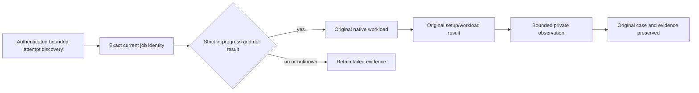

# ADR-068: Current benchmark gate and evidence repair

Status: Accepted; source repairs are present, while exact-source current-cohort qualification remains pending.
Related: REQ-NGR-001..005 / AC-NGR-001..005, REQ-BC-CURRENT-001..004, REQ-BC-FAIL-001..021, ADR-056, ADR-062, ADR-064, ADR-076, ADR-080, ADR-112.

## Decision

Repair native benchmark setup observation and evidence admission without changing target operations, topology, retries, acknowledgement, report meaning or any database contract. Keep actual source/job/attempt identity validation, original native failure, failed/null result accounting, and complete current plan requirements. Never treat queued as running, a setup failure as unsupported capability, or a diagnostic as proof of workload success.

Current-job validation may refresh only the exact authenticated job ID discovered from the bounded attempt pages. Require the expected workflow/source/attempt identity and a strict in-progress state with null result before native allocation. Exhaustion, identity drift, terminal/unknown state, transport or parse failure rejects. No reselection, stale fallback or workload retry is permitted.

Failure-only diagnostics remain private and bounded. Kurrent setup output is one line of at most 4,096 bytes, with at most three causes, eight frames per cause and 64 characters per identifier; it contains only closed phase, actual exception type and bounded type/method metadata. It excludes message, data, raw stack, paths, endpoints, credentials and payloads, then preserves the original caught exception. Outbox observation is allowed only after an exact resource-exhausted case and its session have settled; it is outside the measured clock, makes at most one read, validates at most 64 consumer heads, and must not change the original case or timing. Unknown and unavailable observations stay unavailable.

## Acceptance and responsibilities

AC-NGR-001 requires authenticated, bounded discovery followed by revalidation of the exact same own-repository workflow/source/attempt/job identity; only strict in-progress with a null result admits native setup. A queued response is not executing evidence. The original request bound is 120,000 ms; only after an exact queued response may one 60,000 ms stale-response window run at cancellation-aware 1,000 ms cadence, with at most 61 total captures. Mismatch, terminal/unknown state, exhaustion, cancellation, transport or parse failure rejects before allocation/timing; no reselection or workload retry occurs. AC-NGR-002 retains exact original/custom/system event metadata, a complete 55,378-item owned-stream oracle, foreign-resource noninterference and cleanup across genuine native one/two/three-node cases; empty tracing remains uncharacterized and must not be assumed empty. AC-NGR-003 retains SDK/advertised endpoint validation, genuine leader/follower routing, observed membership/copies/ACK, and no guessed leader, standalone substitute or measured write retry. AC-NGR-003D preserves the original thrown failure and emits only one failure-only line bounded to 4,096 bytes, at most three causes, eight frames per cause and 64-character identifiers; messages, stacks, paths, endpoints, credentials and payloads are excluded.

**AC-NGR-004 is the complete current publication predicate:** the authenticated source/run/attempt/job and uploaded archive must match the canonical 1,386-worker plan (330 controls, 264 scaled CRUD, 792 vector) and its required 2,530 unique regular-file evidence inputs (2,470 suite and 60 provider files), with exact paths, sizes and hashes, original archive bytes, and all source/provenance identities validated. Each slot is either a measured result, an authenticated explicit unsupported-topology disposition or an authenticated terminal workload failure with the required safe null report; failed, canceled, skipped, missing, mixed-cohort or unavailable evidence can never become numeric success. Native preflights, full source/normal/scalar/recovery/RF3, coverage, site/browser/freshness/provider gates remain separate required predicates. The TimeSeries family is separate and remains subject to its own ADR-050/059 scale-specific plan. AC-NGR-005 preserves the original failed case, timing and samples; only after an eligible exact resource-exhausted case and its session settle may one authenticated outbox-status read inspect at most 64 consumer heads, outside the measured clock. Unknown/unavailable remains unavailable; no quota, purge, retention or retry changes are implied. These criteria map to the current BenchmarkComparisons failure/null and Website selection contracts.

The benchmark source paths own current-job capture, target-specific diagnostics and comparison runner behavior. Unit tests cover real current source paths and native fixtures rather than fake executor or target behavior. Root owns workflow, schema, current cohort, Website, docs and final integration. The canonical current inventory is 330 control cells, 264 scaled cells, 792 vector cells across 11 targets; scaled profiles contain 100,000 and 1,000,000 records and applicable cells execute at least 100,000 measured operations. TimeSeries remains its separate family under ADR-050/059.

## Verification

Run enabled solution build, formatter, analyzer and governance checks before exact-source Linux qualification. Require original native preflight/workload processes, complete current cohort accounting, TUnit/no-skip, source and input immutability, native coverage, browser, freshness and provider evidence under the current feature. Preserve failed/null and unsupported dispositions distinctly. A bounded diagnostic or a previously successful partial run is not qualification. Keep this ADR Accepted until the exact-source gates pass.
