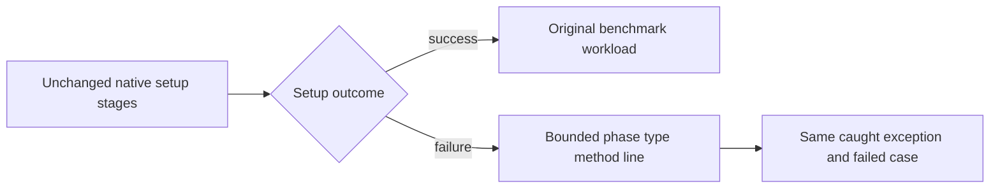
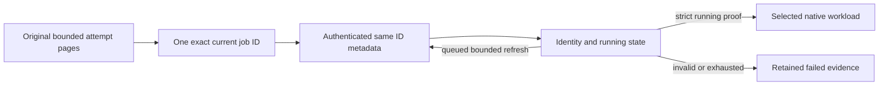

# ADR-068: Native benchmark gate repair

Status: Accepted bounded implementation contract; qualification pending.
Date: 2026-10-03. Root integration owns BenchmarkComparisons and all shared joins.

## Accepted stage D: bounded native setup diagnostics

TASK-NGR-R5 retained a second actual Kurrent n2 initialization NotLeaderException
at source366, run37123589283/job111205160819, after current-job verification
passed. No measurement or callsite is retained. Its sealed original packet
SHA256 `1971c6884d2d58989808e6084668b75d4709da2eec455dc8c19f500cf7b8df5b`
does not prove a routing or startup-election defect.

REQ-NGR-003 / AC-NGR-003D is approved for observability only. Ordered contract:
first-author genuine-thrown pure formatter tests; then bounded gpt-6-luna/high
worker changes only Comparisons Features/BenchmarkComparisons/KurrentTarget.cs
and NEW KurrentSetupDiagnostics.cs/KurrentSetupStage.cs plus NEW UnitTests
Features/BenchmarkComparisons/KurrentSetupDiagnostic-prefixed files; root reviews
every diff and owns frozen integrated build/format/static checks, receipts/Git
and exact-source GitHub qualification. The internal target-owned closed enum
tracks writer construction, membership, NoStream semantics, seeding, copy and
complete. Existing operations/order, cancellation, ownership, copies, ACKs and
timing remain. Extract a private setup core if needed to obey function/type limits.
NEW KurrentTargetProfile.cs may receive only the unchanged existing CreateProfile
method body as internal static Create, with the constructor join adjusted and
original method removed, to preserve the200-line type limit. Exact literal
profile/settings/branch/parameter parity is required; no additional behavior.

One failure-only best-effort ASCII stderr line emits phase, actual caught type
and type/method stack metadata; at most3 causes,8 frames/cause,64 characters per
identifier and4096 bytes. No Message/Data/ToString/raw stack/file path/line,
credentials, endpoints or user payload; only existing stderr output, no other
I/O, client, task, gossip, retry,
poll or wait. Diagnostic errors cannot replace the same caught exception,
rethrow preserves its stack. The existing captured runner stderr is the join,
with no public report/schema/interface/package change or successful setup log.

Tests prove safe formatting/bounds with real filesystem/arithmetic/cancellation
exceptions and bounded deep/inner chains, not mocked native failure. Existing
actual1/2/3 preflight proves success; any genuine initialization failure must
retain its original failed/null-measurement case plus the diagnostic. If no such
failure occurs, native failure-path proof stays pending. Earlier verifier
disposal can mask a primary exception; this stage observes the caught boundary
and does not close that separate lifetime defect or global stderr blocking.
Frame limits apply to emitted/accessed metadata and the linear InnerException
chain only. System.Diagnostics.StackTrace construction can materialize the full
runtime stack before those accesses; bounded total capture work/allocation is
unqualified. Owner: root BenchmarkComparisons integration. Before closing the
resource gate, measure the real failed setup capture or replace it with a bounded
metadata fallback; do not claim allocation/latency acceleration from this stage.
Aggregate branch enumeration/Flatten is intentionally absent, not claimed complete.
The development build rejected the initial broad diagnostic catch with CA1031.
Use the existing cleanup diagnostic's recoverable IOException,
InvalidOperationException (including ObjectDisposed), ArgumentException and
NotSupportedException, plus TypeLoadException/MemberAccessException metadata
failures. No warning suppression. Fatal runtime/allocation failures remain
outside this stage's qualified preservation/resource contract.
Rollback formatter/enum/target join together; full routing/cohort gates stay open.

Related REQ-NGR-001..004 / AC-NGR-001..004 in
ADR-068-native-benchmark-gate-repair.md; existing REQ-BC-006/009/050..058,
ADR-056/062/064 and native ownership/ACK contracts remain mandatory.

## Decision and actual baseline

Original dbd01269 Bench37120639751 attempt1 exposes a stale current-job list
record for RabbitMQn2 DocumentDelete. The executing job is returned queued; the
strict existing running-state assertion rejects before any image/database/timing.
The original qualification ZIP11273123955 SHA256
`e95a08d07bfd7f53e22d8361b8911791032d0bf49e9010bea48d8fcd9813bace`
matches provider/upload proof. Accepting queued as running is forbidden.

Keep bounded attempt-page discovery and all existing source/job/attempt/main/
workflow and existing canonical-or-legacy URL checks. Corroborate only the discovered ID through the
authenticated exact jobs/{id} endpoint. A still-queued same-identity/null-result
record originally permitted at most3 captures separated by1000ms; the accepted
G2 cache-window contract below replaces that insufficient refresh bound. Any mismatch, terminal/
unknown state or network/parse failure rejects immediately; final queued state
rejects. Only exact in_progress/null-result authority permits native allocation.
No reselection, workload retry, invented runtime evidence or queued success.

## Accepted failure-only resource observation stage E

REQ-NGR-005 / AC-NGR-005 / TASK-NGR-E1 is approved as private observability.
Original f403 update/delete fail before their final timed sample collection;
source arithmetic suggests retained outbox capacity, but actual counters/detail
were not exported. Preserve the unproven-cause distinction and all failures.

Ordered: first-author pure original-code classifier and typed OutboxStatus
privacy/bounds tests; then a gpt-6-luna/high worker owns only NEW Comparisons
Features/BenchmarkComparisons/IComparisonFailureDiagnostics.cs,
ComparisonFailureDiagnostics.cs, KeyLoadFailureDiagnostics.cs,
KeyLoadOutboxDiagnosticLine.cs and UnitTests matching OutboxFailureDiagnostic
prefix. Root alone joins ComparisonRunner.RunCaseAsync and owns docs, source
checks, delivery and exact native1/2/3 evidence. No public DTO/transport/schema,
packages, resource budgets, measured operations, retries or history purge.

An exact failed KeyLoad:ResourceExhausted case (optionally setup: prefix) permits
one existing authenticated SDK outbox-status read only after the original case
and session cleanup settle, outside the measured clock. Link the parent token
with a two-second observation deadline and await original SDK settlement. One
ASCII stderr line at most512bytes contains only closed scenario/repetition and
numeric head/count/minimum active checkpoint; no active consumers uses -1.
Exclude names/definitions/token/payload/endpoints/credentials/exception detail.
Nonmatching cases perform no call. Unavailable/cancelled or recoverable diagnostic
failures preserve the exact original ComparisonCase and emit only unavailable.
Fatal allocation/runtime/output behavior remains unqualified, not silently
claimed closed. The helper never changes case status/detail/samples/timings.

The existing actual intensive1/2/3 SDK workload and authentic runner/worker
originals qualify this stage; pure tests do not authenticate counters or prove
the old cause. Numeric coverage/fault/complete-cohort/site gates remain open.
Roll back interface/helper/adapter/single runner join/tests together; no product
data migration. This ADR remains Accepted.

## Implementation contract

1. TASK-NGR-R1/R2 root reviews immutable original RabbitMQ and Kurrent failed
   reports/logs/provider bindings; retain causes separately. Read-only discovery
   may not grant capability, rewrite measurements or qualify native behavior.
2. TASK-NGR-G1 bounded gpt-6-luna/high worker first authors NEW
   UnitTests Features/BenchmarkComparisons/IsolatedCurrentJob-prefixed TUnit/Node
   regressions from real retained provider records and controlled negative data.
   No HTTP service/handler or native substitute. Root verifies every test/diff.
3. The same worker owns only NEW scripts Features/BenchmarkComparisons/
   isolated-current-job.mjs and the necessary existing isolated-github-api.mjs /
   isolated-github-job.mjs joins. Use existing captureApi/requestNative byte,
   network, rate and original-child lifetime bounds. NEW private constants fix
   captures3/delay1000 was the original G1 contract; G2 below owns the narrow
   current-job transport extension. No unrelated GH/workflow changes. Preserve original
   pages and every exact request/response under current-job-refresh-NN files;
   final job.json and environment ID appear only after strict fresh validation.
   Existing validateJobIdentity remains authoritative, including optional attempt
   validation and its canonical-or-legacy URL forms; require same discovered ID,
   workflow/main and running/null-result state independently. No detached race,
   unbounded polling, stale successful fallback or new public evidence schema.
4. TASK-NGR-K1 metadata/leader work beyond accepted stageA below remains pending
   a separate root-frozen source contract. Existing Kurrent1/3 run actual workloads then fail
   metadata0-versus76; n2 fails native setup with NotLeaderException. Determine
   actual caller/custom/system metadata and supported SDK leader routing first.
   Do not discard metadata assertions, retry measured writes, infer membership/
   copies/quorum, alter55,378original ownership streams or reduce16worker cleanup.
5. Root joins disjoint results, reviews trust/lifetime/complexity, builds enabled
   full Release, canonical formatter and static governance. Deliver only scoped
   stable source on current main, preserving unrelated working changes.
6. TASK-NGR-Q1 exact source GitHub normal/scalar/recovery/RF3 and all27preflight/
   270scenario native jobs plus original artifact authentication/aggregation/site
   must pass. Unsupported Rabbit DocumentDelete remains explicit unavailable
   without timing; the observed startup failure is not an unsupported measurement.
   TimeSeries6/30 remains separately pending. Missing coverage/fault gates stay open.

## Migration, rollout and rollback

Only private startup capture files are additive. No public request/result/data,
image/package/credential/measurement change. Roll back helper and two source joins
plus their focused tests coherently; preserve historical original artifacts.
Full cohort publication stays blocked until every required original proof joins.
Kurrent rollout/rollback must be frozen before that stage's implementation.

Source review covers actual transport joining and absence of doubles. First-author
pure policy tests cover stale/valid/wrong-ID/source/attempt/terminal/error records;
Actual source review verifies the accepted G2 capture/deadline bounds, immediate
transport failure and absence of writes before final validation. Pure classifier
tests do not execute refresh exhaustion or authenticate HTTP. Actual GitHub
current-job startup must cover authenticated transport/exhaustion and original
same-ID running proof. Neither source/static checks nor supplied JSON authenticate
the provider. Every worker escalates contract/scope/lifecycle drift. This ADR stays
Accepted until all required implementation and genuine verification exist.

## Accepted G2: native current-job cache revalidation

REQ-NGR-001 / AC-NGR-001 / TASK-NGR-G2 addresses the retained genuine Benchmarks
run37320853130 attempt1 failure before workload setup. Two executing cells received
three exact queued responses with the same ETag and advertised
`Cache-Control: private, max-age=60, s-maxage=60`. These originals support a stale
provider-cache hypothesis; they do not authenticate running state or permit a
failed/null workload substitute. The site correctly rejected the incomplete
producer. Preserve that historical failure and every original capture.

Before code, freeze this ordered contract: first author captured-record/header
policy and actual-caller regressions; then extend only the existing current-job
helper, API/transport joins and native HTTP stream cancellation seam. Send
`Cache-Control: no-cache, max-age=0` only to the authenticated same discovered
`jobs/{id}` route. General metadata/download requests keep their existing header
and rate behavior. Do not add a query cache-buster, choose another job/run/route,
accept queued, drop a required cell or fall back to an older producer.

The initial current-job request retains the existing120,000ms metadata deadline.
After the first exact queued/null-result response, one monotonic60,000ms window
owns all further1,000ms cadence waits, native requests and permitted rate waits;
at most61 captures include the initial request. Each next native timeout is the
minimum of the existing bound and the positive remaining window. Do not start a
request/wait after exhaustion. Rate delays must fit both the existing accumulated
rate budget and the remaining window; otherwise reject. Network, parse, auth,
identity, terminal and unknown-state failures reject immediately at their existing
boundary. Only the unchanged exact in_progress/null-result proof authorizes
job.json/environment-ID finalization and database/timing allocation.

The current-job scope owns one cancellation signal, observes SIGTERM/SIGINT
during polling as well as HTTP, cancels the same original native child, and joins
its exit/readers before releasing files or returning. Preserve the existing
one-second TERM-to-KILL grace and original byte/file/privacy bounds. Abort is not
a successful capture or a replacement request. Timers/listeners are disposed and
original failures remain observable. The60s window bounds admitted work; actual
owned-child termination/join is retained after deadline, never WaitAsync-style
abandonment or timeout-as-settlement. No credential/raw response diagnostic text.

Ownership: root freezes these docs, reviews/joins source, owns Aspire gates,
receipts, commits/pushes and exact-source GitHub evidence. One gpt-6-luna/high
worker owns scripts/Features/BenchmarkComparisons/isolated-current-job.mjs,
isolated-github-api.mjs, isolated-github-transport.mjs and only the necessary
optional-signal join in isolated-github-stream.mjs, plus focused UnitTests
Features/BenchmarkComparisons IsolatedCurrentJob-prefixed cases/helpers. Keep
default callers byte/behavior compatible, fixed closed headers, original
authenticated transport and canonical-or-legacy URL/source/attempt/name checks.
Any required additional boundary is returned for freeze before implementation.

Tests retain captured identical-ETag queued/header sequences and the separate
authentic running record unchanged. No retained artifact currently shows that
same-ID transition. An explicitly constructed pure policy transition fixture
may test queued-to-running control flow, but is not provider/runtime evidence.
Actual same-ID queued-to-running proof remains pending real GitHub startup.
Tests map persistent queued to exact cutoff;
wrong ID/name/SHA/run/attempt/workflow/URL,
terminal/auth/parse states to rejection; cancellation while waiting and in the
real native child to joined cleanup; rate delays to both budgets; and the actual
captureCurrentJob caller to finalization only after strict running proof. Pure
records do not authenticate GitHub or qualify workload success. Local tests run
through the Aspire-owned entry under the root's later local-development
authorization; actual Linux GitHub startup must retain fresh source/job/provider
originals before G2 is qualified. Roll back the helper/optional transport joins and
tests together; no public schema, data, engine, image or website policy migration.

## Accepted Kurrent metadata stage A

The exact pinned1.4.0 DLL (SHA2560f19cb40551bd5b7548ea1ef3afb2e4326d9b2dc05ac4b0eef7baf3ffde816c2)
confirms custom metadata containing both $traceId/$spanId is preserved unchanged.
Its nuspec names upstream commit e041cf8f459d6abe05f39918ecd62a71038b9ddc. The
root-reviewed source correction records that canonical-volume events originally
omit metadata; the distinct ownership fixture is not their source. Original76
bytes remain unobserved and tracing cause is an inference, not qualified fact.

TASK-NGR-K1A / REQ-NGR-002 / AC-NGR-002 stageA is approved after this literal source
review. A bounded gpt-6-luna/high worker owns only the two existing ComparisonTests
IsolatedKurrentVolumeRegressionFixture/Native files. First strengthen the actual
full-volume readback assertion to complete original EventData.Metadata byte
equality; then construct canonical fixture events with nonempty owner metadata
and explicit valid $traceId/$spanId values so the SDK preserving branch gives an
independent exact expected value. Preserve all other ID/revision/payload/type/
content/55,378streams/16workers/foreign/cleanup assertions, deadlines and lifecycle.
No observed-length tolerance, property dropping, Activity disabling, target or
package workaround, workload retry or changed measurement. Existing actual native
preflight1/2/3 joins prove this stage; empty-caller ambient tracing and n2 routing
remain separate pending qualification. Root source build/format/review joins precede
stable delivery; rollback both fixture data/oracle coherently. Original failed
artifacts stay immutable. This partial stage cannot close complete AC002/003/004.

Root additionally retained the [exact official SDK source](https://github.com/kurrent-io/KurrentDB-Client-Dotnet/blob/e041cf8f459d6abe05f39918ecd62a71038b9ddc/src/KurrentDB.Client/Core/Common/Diagnostics/EventMetadataExtensions.cs)
at that nuspec commit. SHA256
`f7c0764bdcb611ec7a7b969dca2e114a66e96075fb969745124734905f32decf`
binds the inspected file; the both-properties preserving branch agrees with the
exact distributed binary. This confirms the stageA expectation, not the original
76-byte cause or any native test pass.

StageE review refinement before corrective implementation: the interface remains
internal and KeyLoad implements its method explicitly, with no new public callable
API. Eligible failed details equal only KeyLoad:ResourceExhausted or its exact
setup: prefix; arbitrary suffixes are forbidden. Exact failed sample codes also
qualify an already-failed measured case without discarding any samples/timing.
Validate closed scenario/nonnegative repetition before observation; malformed
case metadata is skipped rather than replacing the original failure.
Typed status aggregation checks at most64consumer heads (current canonical
server bound); default/oversized/invalid status is unavailable, never partial
counts. Count/minimum uses one bounded pass with no filtered-array allocation.
Every numeric field formats with InvariantCulture; tests include a nondefault
culture and default/oversized collections. One static unavailable line is the
private fallback for recoverable formatter failure. No original case mutation.

StageE corrective contract before implementation: observation implementation
belongs to the internal helper; KeyLoadTarget has only an explicit delegating
method so its combined partial type remains below the mandatory200-code-line
limit. Cache parsed CompositeFormat and preserve all analyzer severities.
Malformed null sample elements are skipped safely; typed consumer checkpoints
must be nonnegative and no greater than the observed tail. The -1 output sentinel
is reserved for no active consumers. Tests first cover null sample/head/consumer,
negative/future checkpoint and canonical empty/populated status shapes.
There is exactly one stderr WriteLine attempt. Select the static unavailable
line for recoverable SDK/formatter failure; a recoverable output failure is
swallowed without retry and preserves the original case. Broken output may emit
nothing or partial text; global stderr closure is not qualified. This avoids a
second line or partial-write-plus-fallback exceeding the observation budget.

Typed head validation follows the existing contiguous canonical outbox contract:
initial head is(0,1,0,0); FirstAvailable>=1; FirstAvailable-1<=Tail;
StoredRecords==Tail-(FirstAvailable-1), with nonnegative Tail/StoredBytes.
The subtraction avoids Tail+1 overflow. Pure golden fixture heads must be
possible canonical initial/populated/purged heads; counter maxima use
Tail=long.MaxValue, FirstAvailable=1, StoredRecords=long.MaxValue. This validates
only observed diagnostics, changes no canonical storage contract or limit.

StageE lifecycle review refinement before implementation: any original case whose
detail is ComparisonSessionCleanup.Failure is ineligible even when retained
samples contain ResourceExhausted. Existing CloseAsync can return false after a
DisposeAsync timeout while that original operation is still running. Skip the
observation rather than join/retry/replace the original cleanup or case. A pure
classifier regression retains the failed resource sample, measurement and exact
cleanup detail. Current KeyLoad session disposal is synchronously completed;
this guard keeps the optional diagnostic contract safe for future adapters.
