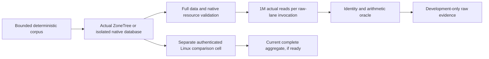

# ADR-069: representative scaled workload qualification

Status: Accepted contract; implementation and qualification remain open until the
current [ScaledWorkloads](../Features/BenchmarkComparisons/ScaledWorkloads.md)
acceptance and required exact-source evidence pass. Related REQ-SCALE-001..008 /
AC-SCALE-001..008 and
[ScaledRuntimeRepairs](../Features/BenchmarkComparisons/ScaledRuntimeRepairs.md).

## Decision and active data scales

Every active database/workload family uses exactly 100,000 and 1,000,000 actual
records, with at least 100,000 measured operations per applicable cell. Record
count, measured operation count and benchmark iterations are separate facts.
Qualify sequential/random and applicable ordered/range/index/complex-query
workloads using actual returned records and independent caller-visible oracles.
Preserve equal corpus, query/filter, schedule, accuracy, acknowledgement,
topology, durability and effective-resource contracts across comparable engines.
The canonical eleven-target inventory remains in the feature specification. Each
comparison database runs its real native server and loader in isolated Linux
GitHub runner/job cells; record native membership and mark unsupported native
capabilities/topologies explicitly unavailable. Local experiments, tiny controls,
source settings and parser fixtures never become database measurements or website
figures.

## ZoneTree raw resident-read lane

The internal raw-read development lane has exactly eight cells: one ZoneTree
engine, two record counts (100,000 and 1,000,000), two payload sizes (32 and
1,024 bytes) and two methods (sequential and deterministic shuffled). Each public
read-method invocation performs exactly 1,000,000 actual point reads,
`OperationsPerInvoke = 1,000,000`, one invocation and one unroll. Thus at 100,000
records it visits every key ten times (1,000,000 / 100,000 = 10); at 1,000,000
records it visits every key once (1,000,000 / 1,000,000 = 1). Both methods
validate and consume every returned full record identity and require the exact
sum oracle `((1,000,000 / N) * N * (N - 1) / 2)`; checksum-only or attribute-only
proof is insufficient.

Use .NET 10, one launch, eight warmups and ten actual iterations; retain 8..10
actual result samples as the native benchmark permits, and reject a measured row
below 100 ms. The read-order,
seed, payload bytes, key identity, full-value checks and settings are owned in
detail by ScaledWorkloads.md. Charge the oracle and validation work inside the
measurement; do not relabel this as lookup-only. The raw-read lane is an internal
ZoneTree diagnostic and never substitutes for a database-comparison cell or a
public metric.

The real native fixture verifies exactly N successful terminal seed writes,
reads all N distinct complete values before timing and afterward, and preserves
native record/residency observations. The reserved miss is not a seed. Each
successful read verifies actual identity. Preparation has the existing bounded
20-minute deadline with cancellation checks at least every 256 operations; the
whole native child has the current 12 GiB peak ceiling and 2 GiB total/cgroup
headroom requirement. Owners remain charged until original operations, readers,
and close settle. Preserve primary and independent cleanup failures. Unobserved
vendor constructor/close faults are explicit evidence gaps, not test-double proof.

## Full comparison and delivery gates

REQ-SCALE-007 requires the subsequent genuine authorized .NET SDK and official
MCP operations through Aspire RF3 for supported ordered/range, index and bounded
complex-query workloads, exact result/count/digest checks, error/cancel/recovery
flows, and at least 100,000 measured operations at both required scales. The raw
ZoneTree lane does not close this product gate. Native image, actual dataset,
membership, server resource, correctness and acknowledgement evidence must all
come from the original run and remain source/run/attempt/job/artifact bound. Retain
original raw JSON, CSV and stdout plus the exact settings, machine and hardware
observations; missing, mixed or unverifiable cell evidence cannot qualify.

Use the four canonical workflows only: Build and Tests, Benchmarks, Website and
Release. Benchmarks owns comparison jobs and authenticated aggregation; Website
receives only the bounded final dispatch and independently uses authenticated
ready metrics or a content-only path. Do not add internal/raw microbenchmark jobs,
dispatch modes or dependencies to the Benchmarks workflow. Website metrics
require the complete current cohort and all source/archive/freshness checks.

Automated acceptance remains mapped to the owning specification:

| Requirement | Required evidence |
|---|---|
| REQ-SCALE-001 / AC-SCALE-001 | Compact deterministic corpus, exact key/value format, independent goldens, order and uniqueness |
| REQ-SCALE-002 / AC-SCALE-002 | Real native seed/readback, complete distinct-value validation, owned scratch and successful cleanup |
| REQ-SCALE-003 / AC-SCALE-003 | Actual residency, process and preparation bounds; cancellation, cleanup and source-bound native observations |
| REQ-SCALE-004 / AC-SCALE-004 | Every measured call performs and validates one million native reads at exact 100K/1M scales |
| REQ-SCALE-005 / AC-SCALE-005 | Complete eight-cell ZoneTree profile, separate counts/operations/iterations, minimum duration and original reports |
| REQ-SCALE-006 / AC-SCALE-006 | Local raw originals stay development-only; full comparison evidence comes from authenticated isolated Linux GitHub cells |
| REQ-SCALE-007 / AC-SCALE-007 | Real RF3 SDK/MCP product workload cohort with equal native correctness and resource contracts; currently open until proven |
| REQ-SCALE-008 / AC-SCALE-008 | Full current-source build, normal/scalar/recovery/RF3, coverage, fault and required quality gates; no skipped or synthetic success |

Source review, a valid report parser, local BDN, or a completed child exit does not
qualify native data, process settlement, performance, coverage or durability.
The status and each open qualification boundary remain in the feature spec and
`docs/implementation/status.json`; no universal winner or production-readiness
claim follows from this diagnostic lane.

## Consequences and rollback

The raw lane can guide storage optimization while remaining separate from product
performance claims. Full product comparison continues to require comparable
native execution and public caller evidence. Rollback removes only the diagnostic
profile and its implementation after preserving source and original evidence; it
does not alter ZoneTree authority, WAL, Orleans request/partition ownership,
production RF3 topology, public APIs or stored data. It cannot remove correctness,
recovery, coverage or delivery gates.
