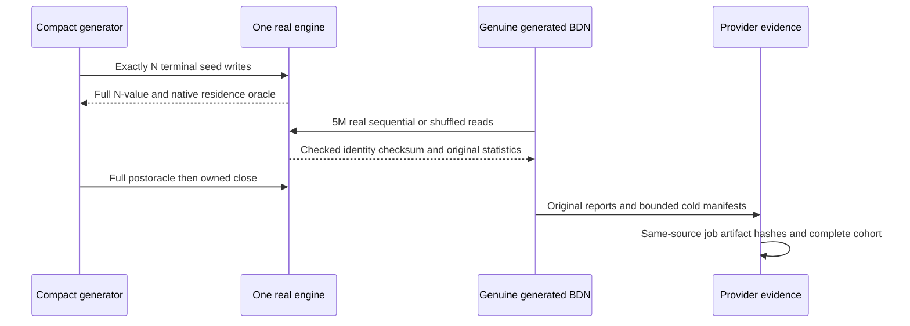

# ADR-069: Representative scaled workload qualification

Status: Accepted,2026-10-03. Source, tests and native qualification OPEN.
Related REQ-SCALE-001..008 / AC-SCALE-001..008:
[ScaledWorkloads](../Features/BenchmarkComparisons/ScaledWorkloads.md).
The actual runtime repair contract REQ/AC-SCALE-RT-001..003 is frozen in
[ScaledRuntimeRepairs](../Features/BenchmarkComparisons/ScaledRuntimeRepairs.md).

## Decision and implementation contract

Owner requires exactly100K and1M actual records and at least100K measured calls per
applicable workload cell. Remove5M from active profiles.
Current4096 hot-key/80Actual samples do not establish that scale; preserve them
as original controls. Current270-cell cohort has its own smaller frozen contract.
Add an independent BenchmarkComparisons raw resident read profile before the
mandatory actual public index/complex/RF3 workload stage. Do not change production
ZoneTree authority/WAL, Orleans request/partition ownership or RF3 topology.

Freeze compact scale-v1 BE16B keys and full64-bit identity32/1024B values from
[canonical feature contract](../Features/BenchmarkComparisons/ScaledWorkloads.md); one pinned key slab plus constant scratch, no per-record object
tables or second full payload corpus. ZoneTree retains its immutable4096-record
value chunks through original engine close. CountN successful
seed calls, full distinct payload checks plus reserved miss before/after timing;
Real immutable borrow/output-copy tests are mandatory. Every timed returned identity is checked and consumed.
The fixture constructor completes actual native full verification before it
returns (N verified records, one pass, N+1 reads). FullValueDigest is lowercase
SHA256 over actual complete read values in ascending index order. A generated
expected digest is only an independent oracle. ZoneTree's actual
immutable arena retains N*payload bytes. ScaledRawStorageSettings is the frozen
settings helper. Public Setup rejects an invalid qualification count before
acquisition; cleanup performs full postverification and retains independent
verification and owned-close errors.

Each public generated ScaledStorageReadBenchmarks method performs exactly5M
reads per invocation, OpsPerInvoke5M/invocation1/unroll1/.NET10/launch1/
warmup8/Actual10. Sequential and frozen SplitMix64/Fisher-Yates permutation
cover everyN key50/5 times for100K/1M. Same seed/order/one output copy,
two payload sizes/one selected engine per process. These counters/oracle costs
are included, not subtracted or called lookup-only. Native actual rows>=100ms,
retainedResults8..10 and exact complete12cell cohort are required.

ZoneTree mutable boundmax(1000,N+2)/WALNone/compressionNone/no
maintainer;1000 is its native mini-fixture minimum;100K/1M retainN+2.
Actual mutable/inmemoryN and no frozen/disk records. Source settings
do not prove5M residency or record stride. Record every actual native counter.

Whole-child peak ceiling12GiB with minimum total/cgroup capacity ceiling+2GiB
headroom and truthful total/available/RSS distinctions. Mini fixtures use a
computed bound. Original public synchronous calls cannot be safely detached or
preempted. Preparation20minute monotonic/incoming cancel checks in<=256-op
chunks; outer nativejob120minute bound. Retain owners through actual original
settlement/close and primary+independent cleanup errors. Unobserved vendor finite
close/constructor/pending failures remain explicit gaps, never injected proof.

AC-SCALE-003 source review correction freezes staged, one-shot acquisition and
one charged scaled-fixture ownership slot per diagnostic process in the linked
feature contract. Rooted managed owners precede native acquisition; successfully
returned handles remain charged through original settlement and successful close,
including a throwing constructor. Primary and close failures stay visible. A
second owner is rejected before acquisition, and explicit failed-owner repeat
close never disposes a healthy fixture or retries writes. Genuine live-owner,
rejection, readback, actual close/replacement and repeat-close tests precede the
private worker revision; source review then confirms the join. This corrects our
wrapper's lifetime and does not claim unobserved vendor-constructor fault proof
or change product/RF3/storage contracts. Root alone owns contract and integration.

Every successful full-value pass captures actual native bounds before publishing
oracle metadata, including the final pass before close. Cleanup preserves actual
nonfatal primary/independent close failures. Excluded fatal unwind does not invoke
test-owned cleanup; native/fatal fault occurrence remains unobserved manual proof.
The separately frozen pure report contract is
[ScaledReportQualification](../Features/BenchmarkComparisons/ScaledReportQualification.md),
REQ/AC-SCALE-RPT-001..004. Root owns that contract/integration; stopped test-first
candidates precede the bounded parser writer and strongest source review. Pure
parser success does not prove genuine cold manifests or native process settlement.

Ordered stages/task graph: SCALE-P contracts/source baseline; SCALE-T private
acceptance-derived literal/native tests, root-reviewed before implementation;
SCALE-D compact corpus/order/arena and independent SCALE-E native settings/
engines/fixture/BDN private candidates with disjoint NEW files; strongest SCALE-R
reads every stopped source/test/diff; root SCALE-I joins exact bytes and owns
build/normal+scalar/full/format/governance/all-current main delivery; SCALE-N
actual separate local100K->1M ZoneTree and12cell source/machine reconciliation.
Use the four canonical Build and Tests, Benchmarks, Website and Release workflows;
retain the ZoneTree-only report/profile and
complete native database comparison/site contract. The owner prohibits internal/raw
microbenchmark jobs, dispatch modes and dependencies in benchmarks.yml. PhaseA
optimization measurements run locally and ordinary correctness tests belong in
CI. This ADR does not authorize a separate internal GitHub performance context.
Root alone owns shared helpers/jobs.
Agents stop on API/ownership/lifetime/contract ambiguity rather than inventing it.

Source join2026-10-03: completed strongest R3 approved the exact thirteen E3
native files, three data files and ten current tests/support files. Root checked
all39 input hashes and joined the native files. Integrated build/tests/formatter,
actual native scale measurements and cold manifests remain pending; Accepted
does not mean implemented or qualified.

Frontend/public product API N/A in PhaseA because this is an independent
diagnostic; no public site projection until separate proven metrics/schema contract.
Mandatory PhaseB freezes actual authorized SDK/officialMCP index-build/indexquery/
bounded complex-Q1/ordered/range and supported-peer cohort with equal ACK/topology/
resource/correctness/error/cancel/fault contracts. No sorting emulator or fake SQL. Explain and exact independent
result digests are required. Existing max-scan/query/result/auth/RF3 limits remain.

Verification uses real native engines, bounded actual generated consumers and
TUnit/MTP .NET10 normal/scalar; literal parser vectors are not measurements or
provider authentication. Root retains machine/source/raw failures, original
JSON/CSV/stdout/cold counters and actual package/settings/source/machine bindings.
Local sequential experiments are development only. PhaseB website global metrics
exclusively use genuine complete GitHub database originals and authenticated
SHA/run/attempt/job/ZIP/file bindings with matched verified actual hardware,
resources, topology, durability and workloads. Coverage,
recovery/RF3/endurance/powerloss gates remain separately required and open.

No security, production dependency, or data-format change is in scope. Rollback
removes the diagnostic profile/helpers/tests/docs together and preserves original
control receipts. PhaseB requires its own workload contract before code. Keep
Accepted until required sources/tests/evidence and architectural assessment exist;
there is no universal-winner or product storage change here.
