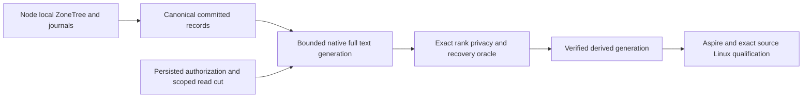

# ADR-071: Canonical ZoneTree storage and full-text providers

Status: Accepted owner decision; complete integration and qualification pending.
Owner: KeyLoad integration lead.
Related: KL-028/029/080, REQ/AC-ZT-001..003 in
[Search](../Features/Search.md) and [BenchmarkComparisons](../Features/BenchmarkComparisons.md).

## Decision

Use [ZoneTree](https://github.com/ZoneTree/ZoneTree) as the canonical storage for
all KeyLoad models and
[ZoneTree.FullTextSearch](https://github.com/ZoneTree/ZoneTree.FullTextSearch) as
the native full-text derived-index provider. Package/source/license identities
are centrally pinned. Native byte serializers and synchronous WAL remain below
the ordered atomic and replication journals. Vector/ANN algorithm choices retain
their own correctness, resource and performance contracts.

A node-local PartitionHost owns every native handle, journal, lock and apply gate.
Orleans request and capability grains route authorized operations to that owner;
activation movement never moves its open storage handles. Canonical records and
persisted authorization remain authoritative. Full-text generations are disposable,
bounded derived state validated against an authorized committed read cut.

## Implementation contract

1. TASK-ZT-CONTRACT: lead freezes provider identities, REQ/AC, slice/file owners,
   API/license/source review and caller-visible semantics before integration.
2. Canonical model owners use the actual native ZoneTree APIs and retain complete
   write/retry/read/backup/reopen/snapshot/recovery flows. Comparison databases use
   their own native stores and remain independent from KeyLoad provider selection.
3. TASK-ZT-FTS-CONTRACT: Search freezes exact scoring/tokenization, protected-field
   exclusion, projection generation/cut, bounded rebuild/replay, cancellation,
   publication, restart and corruption contracts under
   [ADR-078](ADR-078-native-full-text-projection.md).
4. Disjoint provider/test contributors implement only the frozen Search/storage
   responsibilities. Lead joins central packages, native host composition, SDK/MCP
   discovery and docs; dependency defects follow their owning repository's release policy.
5. TASK-ZT-REVIEW/EVIDENCE: review every join, execute enabled full build/format/
   governance, real TUnit operations, process recovery and Aspire RF3 with actual
   SDK and official MCP clients. Qualify exact Linux source and functional coverage.
   Comparable original GitHub measurements are required for any acceleration claim.

Frontend N/A for internal provider ownership. Caller capability documentation must
state delivered semantics and qualification separately. No current-format, signing,
authorization, acknowledgement, resource-bound or native topology gate is waived.

## Rollout and rollback

Construct a bounded full-text generation from committed authorized records,
validate its complete cut and exact independent ranking oracle, then publish the
verified generation. A failed build leaves the previous verified current generation
or exact fallback search usable under the same authority; it never publishes partial
results. Rollback drains derived work and restores one coherent source/generation
checkpoint. Canonical ZoneTree data and acknowledged journals remain intact.

