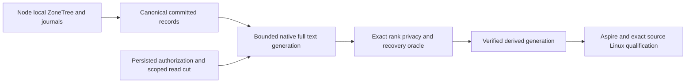

# ADR-071: Canonical ZoneTree storage and full-text providers

Status: Accepted owner decision; complete integration and qualification pending.
Owner: KeyLoad integration lead.
Related: KL-028/029/080, REQ/AC-ZT-001..003 in
[Search](../Features/Search.md) and [BenchmarkComparisons](../Features/BenchmarkComparisons.md).

## Decision

Use [ZoneTree](https://github.com/ZoneTree/ZoneTree) as the canonical storage for
all KeyLoad models and
[ZoneTree.FullTextSearch](https://github.com/ZoneTree/ZoneTree.FullTextSearch) as
the native full-text derived-index provider. Package/source/license identities
are centrally pinned. Native byte serializers and synchronous WAL remain below
the ordered atomic and replication journals. Vector/ANN algorithm choices retain
their own correctness, resource and performance contracts.

A node-local PartitionHost owns every native handle, journal, lock and apply gate.
Orleans request and capability grains route authorized operations to that owner;
activation movement never moves its open storage handles. Canonical records and
persisted authorization remain authoritative. Full-text generations are disposable,
bounded derived state validated against an authorized committed read cut.

## Implementation contract

1. TASK-ZT-CONTRACT: lead freezes provider identities, REQ/AC, slice/file owners,
   API/license/source review and caller-visible semantics before integration.
2. Canonical model owners use the actual native ZoneTree APIs and retain complete
   write/retry/read/backup/reopen/snapshot/recovery flows. Comparison databases use
   their own native stores and remain independent from KeyLoad provider selection.
3. TASK-ZT-FTS-CONTRACT: Search freezes exact scoring/tokenization, protected-field
   exclusion, projection generation/cut, bounded rebuild/replay, cancellation,
   publication, restart and corruption contracts under
   [ADR-078](ADR-078-native-full-text-projection.md).
4. Disjoint provider/test contributors implement only the frozen Search/storage
   responsibilities. Lead joins central packages, native host composition, SDK/MCP
   discovery and docs; dependency defects follow their owning repository's release policy.
5. TASK-ZT-REVIEW/EVIDENCE: review every join, execute enabled full build/format/
   governance, real TUnit operations, process recovery and Aspire RF3 with actual
   SDK and official MCP clients. Qualify exact Linux source and functional coverage.
   Comparable original GitHub measurements are required for any acceleration claim.

Frontend N/A for internal provider ownership. Caller capability documentation must
state delivered semantics and qualification separately. No current-format, signing,
authorization, acknowledgement, resource-bound or native topology gate is waived.

## Rollout and rollback

Construct a bounded full-text generation from committed authorized records,
validate its complete cut and exact independent ranking oracle, then publish the
verified generation. A failed build leaves the previous verified current generation
or exact fallback search usable under the same authority; it never publishes partial
results. Rollback drains derived work and restores one coherent source/generation
checkpoint. Canonical ZoneTree data and acknowledged journals remain intact.

## TASK-KL035-NATIVE-CHECKSUM-PROFILE-001 — current-format cross-profile graceful reopen

REQ-STORAGE-004/007/010, AC-STORAGE-007 and supporting AC-REP-004 under original KL035 under ADR-071/003. Preserve authentic published641 KL035 scalar checksum refusal as immutable historical evidence. Published native ZoneTree2.0.0 availability and a source pin are prerequisites, not execution or acceptance. Integration owner verifies exact official source/package/dependencies/current-format contract and changes the central pin separately. This test does not read previous KeyLoad/native WAL formats, migrate, accept legacy .wal_crc, fork checksums, or disable SIMD on a server. The existing real RF3 snapshot-install/ordered-tail/full public replay/cold gate remains separately mandatory.

Test-only source contract: reuse actual native CommandIdempotencyProcessChild, bounded pipe readers, original failure/cleanup owner, StorageTrialLease and existing original90-second execution/30-second cleanup budgets. Add one closed private CrashHost mode native-checksum-profile with phases seed/extend/cold. The two source arguments choose enabled→disabled→enabled and disabled→enabled→disabled child environments, both actual DOTNET_EnableHWIntrinsic and COMPlus_EnableHWIntrinsic set only on those fixture-owned children. Disabled child requires native Vector/Sse42/AdvSimd to be disabled; enabled remains actual native hardware eligibility, never an acceleration/throughput claim. The existing bounded original pipe reader requires the exact phase/profile completion signal emitted only after native store closure; it observes safe actual capability facts without exposing paths, credentials, bodies or exceptions. These consumed stdout lines are not claimed as independently uploaded telemetry.

Seed genuinely commits the existing independent document+event+queue mixed batch through native DatabaseEngine and stores its original full generated CommitReceipt/request/outbox seed evidence. All existing independent canonical effect/receipt assertions remain. Freeze every actual native key/value row in strict order, full record bytes/count, committed Store.Position and NodeId/incarnation plus current read generation in one strictly bounded native-generated TEST EVIDENCE envelope. It is not a new database format/provider or recovery authority. Existing MaxScanRecords and64KiB evidence ceiling admit all rows; no truncated/hash-only corpus substitutes. A complete generated comparison proves actual raw row bytes. Save occurs before genuine owned graceful close; parent waits actual exit+both readers, checks original native handles/locks and never starts another open before settlement.

Opposite-profile child reopens the SAME fresh current native root, verifies exact original store position/rows/node/incarnation and nondecreasing observed read generation before any effect/replay. Complete original receipt ResolveOutcome and public model/outbox literals are required. Actual original Apply replay and changed-body Conflict are then exercised; they may legitimately advance ordered applied metadata, so no old cut is copied as current authority. Commit the independent fresh follow-up document through an actual newly created native operation; retain that exact operation bytes before cold reuse, require its full effect and retained original receipt, replay that same native operation and its exact complete receipt and verify full healthy body/outbox result. Freeze the new actual complete native cut. Final opposite child proves that new whole cut and original/fresh receipts/literals survive another true same-root reopen, then closes normally. No process kill/power-loss/performance claim. Initiating/reader/exit/native close/lock cleanup failures remain joined through existing owner; cleanup kill is solely settlement of an unexpectedly failed child.

New private native test evidence identities: Alias keyload.test.native.checksum-profile-cut.v1 with fields NodeId0/Incarnation1/Position2/ReadGeneration3/Rows4; row alias keyload.test.native.checksum-profile-row.v1 with owned Key0/Value1. No product/signed/public/store IDs change or fallback reader. Owners: CrashHost StorageRecovery Contracts Protocol/Cut, Helpers Scenario, Assertions Evidence; existing CrashHostApplication only adds closed TryRun dispatch; Recovery StorageRecovery Cases NativeChecksumProfileRecoveryTests and Processes NativeChecksumProfileProcess. Docs first, root-only join/build/pin/discovery/runtime; no changes to existing modes, fixture defaults or qualification selectors. Rollback removes only this unqualified additive test mode/cases after exact guards.

Focused canonical selection: node scripts/Features/TestInfrastructure/run-tests.mjs --KeyLoadTests:Suite=recovery '--KeyLoadTests:Filter=/*/*/NativeChecksumProfileRecoveryTests/*' --KeyLoadTests:ReportTrx=true --KeyLoadTests:Execution:MaximumParallelTests=50. Source argument declarations are not compiled UIDs/counts. Actual Linux discovery, source/DLL/PDB/package/profile/process/cleanup receipts, complete focused directions and full recovery/RF3 gates remain OPEN. Current pinned1.9.9 binaries must not be credited as native2 tests.
