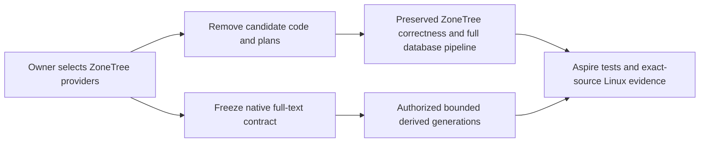

# ADR-071: Canonical ZoneTree providers and immediate candidate cleanup

Status: Accepted owner decision; provider integration and qualification pending.
Date: 2026-10-03. Owner: KeyLoad root integrator.
Related: KL-028/029/080, REQ/AC-ZT-001..003 in Search and BenchmarkComparisons.

## Decision

The owner selects [ZoneTree](https://github.com/ZoneTree/ZoneTree) for every
KeyLoad-owned canonical model and
[ZoneTree.FullTextSearch](https://github.com/ZoneTree/ZoneTree.FullTextSearch)
for full-text derived indexes. Garnet and Tsavorite are removed from active
dependencies, implementations, dispatch, configuration and evaluation plans.
This decision supersedes the discarded ADR-066/070 candidate plans and the
text-provider choice in ADR-009. Vector/ANN decisions in ADR-009 remain open.

ZoneTree ownership remains node-local. Orleans retains routing, separate
request grains and RF3 authority. Native WAL does not replace replication or
atomic recovery journals. Full-text indexes remain versioned derived state;
canonical records and persisted authorization remain authoritative. Selecting
the package does not qualify its scoring, cancellation, projection, replay,
privacy, resource or durability behavior.

## Ordered delivery and task graph

1. TASK-ZT-CONTRACT, root: freeze this decision and REQ/AC mappings before writes.
2. TASK-ZT-CLEANUP-CODE, Luna/high: remove Tsavorite implementations from raw and
   scaled fixtures; retain genuine ZoneTree data, workload, cleanup, memory and
   correctness contracts. Remove obsolete engine cases and their report tooling
   routes. Owned files: BenchmarkScenarios Features/BenchmarkComparisons/RawStorage*
   and ScaledRawStorage*, ScaledStorageReadBenchmarks, UnitTests matching raw/
   scaled cases and raw-storage report/evidence scripts. Preserve all foreign work.
3. TASK-ZT-CLEANUP-JOIN, root: remove central/package references and obsolete
   workflow modes/composite plus docs links. Keep full native database matrices,
   image checks, complete aggregation and website provenance. Remove discarded
   candidate plans immediately; retain immutable historical result bytes solely
   as historical evidence, never as current decision or dispatch authority.
4. TASK-ZT-FTS-CONTRACT, root: pin the published package/source/license, freeze
   supported scoring/tokenization, durable projection generation and cut,
   replay/rebuild/swap/recovery, protected-field exclusions and bounded work.
   Only then delegate provider implementation under Search's accepted contract.
5. TASK-ZT-REVIEW/EVIDENCE, root: inspect every worker diff; verify absence of
   active Garnet/Tsavorite dependencies and preserved ZoneTree correctness.
   Finish coherent source before Aspire-owned TUnit, Release, format/governance,
   process recovery, RF3 SDK/official MCP and exact-source Linux CI qualification.

Graph: CONTRACT -> parallel CLEANUP-CODE / CLEANUP-JOIN -> REVIEW -> EVIDENCE.
FTS-CONTRACT -> provider implementation -> privacy/replay/fault/RF3 qualification.
Workers may not change canonical model formats, shared packages, public database
contracts, foreign source, authorization, bounds, test outcomes or policies.
Escalate an ownership collision or required behavior loss before expanding scope.

## Migration and rollback

Candidate cleanup changes no KeyLoad persisted keys or formats. Preserve user
data, canonical ZoneTree files and acknowledged-write semantics. Unsupported
removed benchmark target labels fail explicitly; they cannot alias ZoneTree.
Full-text deployment will build a new derived generation before a verified swap;
its format/rollout/rollback contract must precede integration. The existing exact
search stays required for delivered semantics and the independent oracle, rather
than as an unused compatibility branch. No dependency release is requested here.
Frontend is N/A for candidate cleanup because these internal diagnostics never
qualified public website figures. Full-text caller capability and documentation
must distinguish source integration from measured or fault-qualified delivery.

