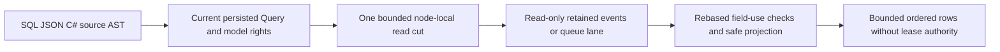
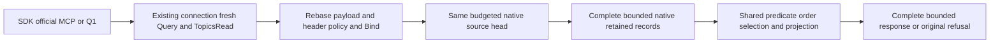

# ADR-072: Authorized SQL event and queue read views

Status: Accepted bounded implementation contract; qualification pending.
Date: 2026-10-03. Owner: KeyLoad root integrator. KL-095, KL-045..054;
REQ/AC-SQLVIEW-001..005 in [QueryExecution](../Features/QueryExecution.md).
Extends ADR-065/067; does not complete full SQL, JOIN or native client transport.

## Decision and scope

Extend the existing normalized SelectQuery with optional ModelSource at native
field7, omitted from public JSON when null. Collection remains the configured
resource name. ModelQuerySource has kind Events or QueueMessages, Item (stream
ID or the same queue resource name) and Generation (positive event generation;
exactly1 for queues). A queue lane is the existing `(Partition, Queue)` identity;
there is no separate SQL lane axis or new persisted queue identity.
All old AST fields, JSON meanings, native aliases and capability values remain.
This additive AST1 extension is advertised separately as modelViewsV1.

Grammar: `FROM EVENTS('streamSet', 'streamId' [, generation])` or
`FROM QUEUE_MESSAGES('queue')`. Arguments are bounded literal strings and
an optional positive integer; quoted identifiers named EVENTS/QUEUE_MESSAGES
remain ordinary collections. The existing projections, predicates, named value
parameters, ordering, LIMIT and EXPLAIN apply to the resulting row schema.
Source arguments do not accept caller authority or executable expressions.

Each request authorizes Query plus EventsRead or QueueInspect using current
persisted principal/resource metadata inside one node-local budgeted read cut.
No receive, sweep, lease, ACK or event append occurs. Queue dead-letter records
additionally require DeadLettersRead before body access. Generic UPDATE of these
sources remains UnsupportedCapability. The existing unique request/read grains,
quorum barrier and actual SDK/MCP adapters carry the complete request unchanged.

Event row JSON: eventId, eventType, schemaVersion, revision, eventSequence,
recordedAt, payload (JSON object) and headers (JSON object). QueryRow.EntityId is
EventId and Revision is stream revision. Queue row JSON: id, state, attempts,
stateVersion, notBefore, expiresAt, payload and headers; Revision is StateVersion.
Never include lease tokens, owner, delivery generation, lease version, internal
fingerprints or signing material. Terminal records may have null removed bodies;
missing nonterminal bodies are Corruption. Synthetic DocumentRecord values are
ephemeral query-operator rows, never stored or exposed as canonical EntityRefs.

Rebase payload/header field policies under /payload and /headers without changing
their grants. Bind every predicate/order field before touching records. The
existing safe projector applies those rebased policies to every row, including
star, alias and nested output. No raw protected values escape in errors/Explain.
Returned values must match independently projected SDK records for the same cut.

## Resource, error and continuation contract

Model scans require AllowFullScan. Use native borrowed ordered visits under one
ReadExecutionBudget for principal/catalog/head/metadata/body/lookahead and exact
output bytes. Scan <= configured MaxScanRecords; additional retained records
reject the complete request with BudgetExceeded rather than imply completeness.
LIMIT bounds final rows after filtering/sorting. Bounded PreparedQuery selection
remains reusable; no unbounded model materialization or callbacks under apply.
Cancellation/deadline failures leave the following authorized read healthy.

Events read only the selected retained generation. Head/key/record identities and
consecutive retained revisions must agree; missing or inconsistent mandatory
history fails Corruption, stale generation TokenInvalidated. Empty absent streams
are valid empty views. This SELECT is not historical replay across a removed cut.
Queue identity/key/body agreement is validated in its existing partition/queue
lane. Queue ModelSource.Item must equal Collection; a second queue argument and
an AST that invents another lane reject before scanning.
For this first complete source stage Cursor input is UnsupportedCapability and
the response Cursor is null; no continuation or distributed snapshot is promised.
EXPLAIN returns the authorized model scan and configured bounds without bodies.
Unknown source kind, arguments and mutations reject before scanning.

## Ordered implementation and ownership

1. TASK-104-SQLVIEW-CONTRACT, root: shared ModelQuerySource/native aliases and
   optional SelectQuery field; these accepted REQ/AC and source/format contracts.
2. TASK-104-SQLVIEW-CODE, Luna/high: Query SqlParser/QueryValidation/QueryEngine,
   new Query Features/QueryExecution/ModelQuery* helpers, new Core
   Features/QueryExecution/ModelQuery* read helpers and new UnitTests
   Features/QueryExecution/SqlModelView* real-store/parser/AST/security/budget tests.
   Core owns key/record interpretation. Query owns parsing/binding/evaluation.
   The worker may use public DatabaseEngine methods and partial feature methods;
   no other model writer, storage provider, central config or shared contracts.
3. Root inspects every diff, adds .NET/official MCP RF3 cases in the matching
   IntegrationTests slice and updates capability/conformance/status accurately.
   The Aspire-owned test entry point launches and cleans its real RF3 topology.
4. Finish code and tests plus self-review before runtime verification. Then run
   integrated Release/analyzer/format/governance, focused and full TUnit,
   process recovery, Docker/Aspire RF3 and exact-source Linux CI. No source-only
   worker assertion closes parent acceptance or measures performance.

Task graph: CONTRACT -> CODE -> root REVIEW/SURFACE/RF3 -> exact-source EVIDENCE.
This worker is independent of TimeSeries retention and EventStreams snapshots;
root exclusively owns shared contracts/config/docs/Git and transport joins.
Escalate public/schema/authorization drift or foreign file overlap immediately.

## Rollout and rollback

The native generated query DTOs use stable field identities. Roll back parser,
AST source metadata and executor together if this feature is withdrawn. Document
queries retain their defined semantics, and unsupported model sources fail
explicitly rather than being treated as document collections. Full SQL/native
session and cross-partition contracts remain required later ADR-065 stages.
UI: N/A, existing programmable SQL/SDK/MCP surfaces suffice. No new package.

### TASK-AUTH-KL015-MODEL-VIEW-DENIAL-001

REQ/AC-AUTH-005/006/009 and REQ/AC-SQLVIEW-002/003/005 require a failed event/queue SQL request to carry no partial page or protected payload/header metadata. Freeze before the test extension under unchanged ADR-014/015/022/072. The existing two real persisted model-authority cases check the SDK error code only at field-use denial and have no actual foreign model partition. Extend those same whole flows using a second genuinely administrator-seeded event/queue partition with its own tenant. The original non-admin persisted own-tenant credential must receive exact PermissionDenied/safe scope detail for both foreign SQL model sources through SDK and official MCP. Every failed SDK result must be IsFailed, Value null and contain no credential or any of the four literal event/queue payload/header canaries in complete native serialization; official MCP must retain its exact error envelope and omit those same canaries from the complete native result. Apply the complete privacy/no-page oracle to the original same-tenant denied sensitive predicate too.

Before and after foreign rejections, actual administrator native stream and message inspection plus SQL rows must equal the literal seeded histories and Ready/unclaimed queue state. Compare ordered logical rows and complete original native records, require positive cuts, and never infer equal cluster-wide cuts across separate calls. The original authorized redacted SDK/MCP read follows the denials, then a real persisted field grant exposes the literal selected value, followed by actual revocation. Original transport, topology, grant epoch, deadlines and cleanup stay unchanged. No product fix or new runtime hook is presumed from this coverage gap.

Ownership: existing QueryExecution Cases/SqlModelViewRf3QueueAuthorityTests.cs and SqlModelViewRf3EventAuthorityTests.cs; new feature-local Helpers/SqlModelViewRf3ForeignTenantFlow.cs and Assertions/SqlModelViewRf3DenialAssertions.cs; requirements here and Authorization/QueryExecution with ADR072. Root alone joins/compiles/formats/delivers. Stages: contract, guarded source-only test repair, coherent native build/discovery, both actual Aspire RF3 flows, exact-source original Linux TRX and source/image/artifact receipts. Native discovery, source review and historical weaker passes cannot qualify these stronger flows. Rollback removes these case extensions and private helpers together; wire, provider, public API, persisted format and UI are N/A. KL015 remains open until current repaired C1 and all required acceptance gates are proven.

# TASK-KL095-PENDING-DLQ-SQL-PARITY-001

REQ-SQLVIEW-002/003/005, AC-SQLVIEW-002/003/005, ADR072 and ADR125. Actual native ModelQueueQueryRows.Accept checks DeadLettersRead only for DeadLettered, while current DatabaseEngine.InspectMessage requires it also for PendingDeadLetter. This is an owning SQL authorization defect, not a new grant or registry. Change only that existing pre-body predicate to include PendingDeadLetter; no public/native IDs, routes, projection, dispatch, budgets or persisted format changes.

Meaningful regression reuses original full native lifecycle and four-route RF3 cold scenarios. AFTER their genuine first cold and genuine original parked-message cancellation, BEFORE ParkPending, the only retained DLQ body is PendingDeadLetter. This placement isolates the new guard: the old DeadLettered row cannot accidentally cause the expected refusal. Create an actual scoped persisted Query|QueueInspect reader; SQL and AST and corresponding SDK/official MCP/Q1 reads must refuse PermissionDenied, no page, with original lane image unchanged. Native Inspect has the same refusal. Grant actual DeadLettersRead through existing persisted policy update; independent complete expected pending row and cancelled row must agree with native inspected metadata/body, without any lease authority fields. Revoke only DeadLettersRead via new current policy epoch and repeat denial. Original lifecycle then parks/redrives/ACKs and preserves all receipts, healthy enqueue and second same-volume cold assertions.

Owned source: Core QueryExecution/Queries/ModelQueueQueryRows.cs; Unit QueryExecution/Helpers new SQL pending helper invoked in existing Messaging QueueLifecycleContinuation; Integration QueryExecution/Helpers+Assertions new pending flow invoked between existing cancel/park in QueueLifecyclePublicPhase.Continuation, passing existing fixture from QueueLifecyclePublicCold. No KL096 cached receive work, KL084 coverage map, new owner or duplicate scenario. Full SQL/JOIN/conformance/client wire and all original Event SQL tests remain mandatory separate gates.

Root-only native preview/apply/build/discovery/Linux normal+scalar Unit and genuine four-route RF3. Source assertions cannot close qualification. Exact old source identities and argument counts retained; no new blanket scheduling. Rollback all narrow predicate+test calls/helpers as one stage. Existing clocks/lifetimes/defaults/quota/read-cut and original primary/cleanup ledger remain unchanged.

## TASK-KL095-TOPIC-SQL-COMPOSITION-COLD-001 — guarded source stage

Freeze REQ-SQLVIEW-001..005 / AC-SQLVIEW-001..005 before the additive Topic source. AC-SQLVIEW-TOPIC-001 requires an actual persisted PublishTopic command, full literal SourceEventRecord parity in SQL and AST, current Query|TopicsRead, payload AND header field-use/projection, pure bounded one-cut reads, stale/missing/changed retained history refusal then exact owned repair and healthy continuation. The source contract approved for this stage is TOPIC_EVENTS('topic'[,positiveGeneration]) → ModelQuerySourceKind.TopicEvents=2. Preserve Events=0, QueueMessages=1, the existing alias and Id0/1/2, SelectQuery ModelSource Id7/InnerJoin Id8, Q1/AST1 transports and every original source grammar. Quoted source-like identifiers remain collections. No new persisted record, map, pin, cursor, connection activation, dispatcher or trusted role.

One existing WithModelQueryView reads current principal/resource and requires Query|TopicsRead. ModelQueryPolicies.Rebase includes BOTH /payload and /headers policies; existing Bind runs before head/body enumeration and Project applies to star/alias/nested outputs. A private DatabaseEngine topic visitor borrows the SAME budgeted view, SourceHead and SourceRecord/SourceEventReader. The retained count is checked with overflow-safe arithmetic against MaxScanRecords, every point read charges native key/value bytes before decoding, and the normal complete result budget/cancellation still applies. SQL LIMIT is not permission to omit retained history validation. Invalid head/data fails Corruption; actual missing retained positions retain HistoryUnavailable. Empty configured sources create no row or authority.

Native correction: actual PurgeTopicHistory preserves Generation while advancing FirstAvailablePosition. This stage tests that retained-history purge and a request whose explicit generation does not match the real persisted head. It does not invent a purge-created generation. Native publication/source identities and field IDs are unchanged. Readers borrow the same captured view; cross-request CutPosition equality is never assumed.

Authored complete operation identities (source-only, not discovered UIDs): TopicSqlNativeTests.ActualTopicPublishSqlAstRetainedPurgeAndOriginalReceiptReplayPreserveOneCut; ActualTopicCurrentGrantsPayloadAndHeaderUseRefusalRevokeThenHealthyProjectionLeaveNativeBytes; TopicSqlNativeRecoveryTests.ActualTopicMissingAndChangedRetainedRecordRefuseWithoutMutationThenExactRepairReadsHealthy; ActualTopicCompleteHistoryScanOverflowAndOriginalCancellationRejectThenPurgeMakesReadHealthy. Real ZoneTree store records and position are compared in full before/after reads and refusals. Missing/changed faults operate only on the original fixture-owned retained row, restore exact bytes, retain the original native command/receipt and require following healthy reads. This is supporting native-owner coverage, not Docker RF3 evidence.

TopicSqlRf3Tests.ActualTopicSqlAstCurrentPolicyOriginalReceiptAndUntouchedQueueSurviveTwoColdRestarts has typed route arguments0/1/2/3 for actual SDK/official MCP/Q1 SDK/Q1 MCP. Each drives SQL AND AST plus native source reads, fresh persisted Query/TopicsRead/field grant refusal→restore→revoke→healthy, complete literal topic data/heads and original command receipt across all four replay routes. A genuinely seeded queue's complete MessageInspection must remain unchanged. Dispose original SDK/MCP owners before two actual same-volume three-resource cold stops/restarts; retain original incarnation/storage authority and all original failures. The class shares the existing RF3 fixture and its cold resources, so its narrow scheduling remains exclusive; independent Unit cases use native ordinary concurrency. The existing original McpCallerDeadline remains unchanged.

AC-COMP-SQL-COLD-001 strengthens the EXISTING DatabaseCompositionRf3Tests.AC_COMP_007_SqlReadsQueuedLinksAndWritesGraphThenOfficialMcpEnqueuesGraphActions under ADR-067; AC_COMP_004 late invalid-reference rollback stays unchanged. Preserve its original four effects, forward/reverse SDK/MCP/Q1 receipts and literal source/derived queue links. Retain full original document results, graph vertices/edges and both queue inspections. After actual first cold, fresh minimally scoped GraphWrite refusal rejects the whole mixed marker+QueueToGraph command with all original models unchanged and the separate target graph/marker absent. Restore the actual principal at its next persisted policy epoch; the already failed command keeps its original failure, a DISTINCT healthy command commits and replays through all four public routes, then actual second cold preserves original and healthy receipts/models. No source claim/lease, cross-partition transaction or redispatch promise is added.

Source ownership: Abstractions QueryExecution ModelQuerySource; QueryExecution parser/source parser/syntax/validation/executor; Core QueryExecution scope/topic visitor/validation; Unit and Integration QueryExecution TopicSql roles; existing DatabaseComposition RF3 case plus its capture/assertion/authority/cold roles. Existing native Topic publication/purge/recovery APIs are reused unchanged; no storage format implementation or process recovery path changes. Existing native Topic/event process recovery remains mandatory together with these exact-source normal/scalar and Docker/Aspire RF3 flows.

Qualification OPEN: root-only coherent build/analyzers/formatter, native discovery and original Linux Source/DLL/PDB/typed-argument UID census, full normal/scalar/recovery/RF3 execution. This stage does not change strict selectors/status/counts or claim PASS. Dedicated Topic raw/result-byte and deadline edge qualification still requires original execution of the owning common budget cases and Topic corpus; malformed-head and foreign public-tenant cases beyond the authored native source checks remain explicitly unmapped to a new passing case. Declarative model JOIN/DML, full SQL conformance and native SQL client-wire interoperability stay OPEN/unsupported as currently declared; procedural CALL is not a JOIN implementation. Rollback source support and its regression stage together; preserve original public/persisted identities and all immutable historical evidence.

### TASK-KL095-TOPIC-SQL-COMPOSITION-COLD-001 — current Phase2/PendingDeadLetter source rebase

This finite successor preserves the original R1 source contract, all eight Topic query fields and unchanged source/position/generation, current Query+TopicsRead field privacy, original raw/result/cancel budgets, same-generation purge, four actual Unit declarations, four original RF3 route arguments and existing complete CALL composition/cold cases. Preserve the current PendingDeadLetter SQL documentation and Phase2 pending/parked/order/current capability semantics; Topic is a pure existing event-source reader, not a new queue decoder or a replacement query inventory. All original public aliases/field IDs/operation IDs and SQL/Q1 version declarations remain exact; TopicEvents appends after Events/QueueMessages, and full SQL/JOIN/DML/client-wire gates remain OPEN.

Native API preflight establishes SourceHead/SourceRecord in the same DatabaseEngine partial and SourceEventReader's exact Topic source+position validation; IKeyValueView.ReadOwnedValue is an instance member, while StorageRecords.GetRecord is the existing KeyLoad.Storage extension. SqlRf3Protocol belongs to KeyLoad.IntegrationTests.Features.QueryExecution, and original request/AST/event/data/row/permission constructors retain their current shapes. Correct the private composition tuple to global::KeyLoad.GraphTraversal so the sibling GraphTraversal namespace cannot capture the type; materialize the original direct-or-Q1 official MCP request into an explicitly bounded object before generic CallAsync<T>, preserving the exact DTO value and official Arguments serializer. No API/signing/transport/schema/lifetime behavior is changed by these compile-intent corrections.

Root alone joins, builds/analyzes, discovers native identities and executes current-source Linux normal/scalar plus real process and Aspire RF3. Focused canonical selections after coherent build are scripts/Features/TestInfrastructure/run-tests.mjs with Suite=unit or unit-scalar and Filter=/*/*/(TopicSqlNativeTests|TopicSqlNativeRecoveryTests)/*, and Suite=rf3 with Filter=/*/*/(TopicSqlRf3Tests|DatabaseCompositionRf3Tests)/*. Preserve native50 ordinary and existing exclusive RF3 fixture groups, original deadlines, every original required suite and exact source/DLL/PDB/runtime/cleanup artifacts. Declarations/arguments/previews are not native UIDs, compiler success or PASS.

### TASK-KL095-TOPIC-RETAINED-ORACLE-002

REQ-SQLVIEW-001/003/005 and AC-SQLVIEW-TOPIC-001 retain the original full publish, SQL/AST projection, replay/conflict, purge, stale-generation and healthy boundary flow. After genuine PurgeTopic through position1, the native default after-position0 MUST refuse HistoryUnavailable with the complete raw store image and commit position unchanged. The positive native oracle MUST explicitly start after position1 and return the sole retained position2 record before comparing the complete SQL result. Use the existing ReadEventSourceRequest.AfterPosition contract through a test-local overload; keep the original default reader unchanged. No production history fence, SQL limit, scan/read/result budget, deadline, generation, API or test identity changes.

Root owns the two existing QueryExecution test files and these requirement/ADR records. Stages: contract first; guarded native preview/apply; coherent build/formatter; execute the same original complete cases in normal/scalar; retain original failed report and current source/DLL/PDB/native UID/result artifacts. Linux recovery and Aspire RF3 remain mandatory and unqualified by this local repair. Rollback only this explicit native oracle and its additional negative/no-effect assertions together. The separate strict one-record scan fixture failure is unresolved and is not hidden by this repair.
