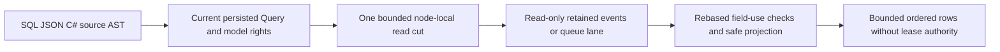

# ADR-072: Authorized SQL event and queue read views

Status: Accepted bounded implementation contract; qualification pending.
Date: 2026-10-03. Owner: KeyLoad root integrator. KL-095, KL-045..054;
REQ/AC-SQLVIEW-001..005 in [QueryExecution](../Features/QueryExecution.md).
Extends ADR-065/067; does not complete full SQL, JOIN or native client transport.

## Decision and scope

Extend the existing normalized SelectQuery with optional ModelSource at native
field7, omitted from public JSON when null. Collection remains the configured
resource name. ModelQuerySource has kind Events or QueueMessages, Item (stream
ID or the same queue resource name) and Generation (positive event generation;
exactly1 for queues). A queue lane is the existing `(Partition, Queue)` identity;
there is no separate SQL lane axis or new persisted queue identity.
All old AST fields, JSON meanings, native aliases and capability values remain.
This additive AST1 extension is advertised separately as modelViewsV1.

Grammar: `FROM EVENTS('streamSet', 'streamId' [, generation])` or
`FROM QUEUE_MESSAGES('queue')`. Arguments are bounded literal strings and
an optional positive integer; quoted identifiers named EVENTS/QUEUE_MESSAGES
remain ordinary collections. The existing projections, predicates, named value
parameters, ordering, LIMIT and EXPLAIN apply to the resulting row schema.
Source arguments do not accept caller authority or executable expressions.

Each request authorizes Query plus EventsRead or QueueInspect using current
persisted principal/resource metadata inside one node-local budgeted read cut.
No receive, sweep, lease, ACK or event append occurs. Queue dead-letter records
additionally require DeadLettersRead before body access. Generic UPDATE of these
sources remains UnsupportedCapability. The existing unique request/read grains,
quorum barrier and actual SDK/MCP adapters carry the complete request unchanged.

Event row JSON: eventId, eventType, schemaVersion, revision, eventSequence,
recordedAt, payload (JSON object) and headers (JSON object). QueryRow.EntityId is
EventId and Revision is stream revision. Queue row JSON: id, state, attempts,
stateVersion, notBefore, expiresAt, payload and headers; Revision is StateVersion.
Never include lease tokens, owner, delivery generation, lease version, internal
fingerprints or signing material. Terminal records may have null removed bodies;
missing nonterminal bodies are Corruption. Synthetic DocumentRecord values are
ephemeral query-operator rows, never stored or exposed as canonical EntityRefs.

Rebase payload/header field policies under /payload and /headers without changing
their grants. Bind every predicate/order field before touching records. The
existing safe projector applies those rebased policies to every row, including
star, alias and nested output. No raw protected values escape in errors/Explain.
Returned values must match independently projected SDK records for the same cut.

## Resource, error and continuation contract

Model scans require AllowFullScan. Use native borrowed ordered visits under one
ReadExecutionBudget for principal/catalog/head/metadata/body/lookahead and exact
output bytes. Scan <= configured MaxScanRecords; additional retained records
reject the complete request with BudgetExceeded rather than imply completeness.
LIMIT bounds final rows after filtering/sorting. Bounded PreparedQuery selection
remains reusable; no unbounded model materialization or callbacks under apply.
Cancellation/deadline failures leave the following authorized read healthy.

Events read only the selected retained generation. Head/key/record identities and
consecutive retained revisions must agree; missing or inconsistent mandatory
history fails Corruption, stale generation TokenInvalidated. Empty absent streams
are valid empty views. This SELECT is not historical replay across a removed cut.
Queue identity/key/body agreement is validated in its existing partition/queue
lane. Queue ModelSource.Item must equal Collection; a second queue argument and
an AST that invents another lane reject before scanning.
For this first complete source stage Cursor input is UnsupportedCapability and
the response Cursor is null; no continuation or distributed snapshot is promised.
EXPLAIN returns the authorized model scan and configured bounds without bodies.
Unknown source kind, arguments and mutations reject before scanning.

## Ordered implementation and ownership

1. TASK-104-SQLVIEW-CONTRACT, root: shared ModelQuerySource/native aliases and
   optional SelectQuery field; these accepted REQ/AC and source/format contracts.
2. TASK-104-SQLVIEW-CODE, Luna/high: Query SqlParser/QueryValidation/QueryEngine,
   new Query Features/QueryExecution/ModelQuery* helpers, new Core
   Features/QueryExecution/ModelQuery* read helpers and new UnitTests
   Features/QueryExecution/SqlModelView* real-store/parser/AST/security/budget tests.
   Core owns key/record interpretation. Query owns parsing/binding/evaluation.
   The worker may use public DatabaseEngine methods and partial feature methods;
   no other model writer, storage provider, central config or shared contracts.
3. Root inspects every diff, adds .NET/official MCP RF3 cases in the matching
   IntegrationTests slice and updates capability/conformance/status accurately.
   The Aspire-owned test entry point launches and cleans its real RF3 topology.
4. Finish code and tests plus self-review before runtime verification. Then run
   integrated Release/analyzer/format/governance, focused and full TUnit,
   process recovery, Docker/Aspire RF3 and exact-source Linux CI. No source-only
   worker assertion closes parent acceptance or measures performance.

Task graph: CONTRACT -> CODE -> root REVIEW/SURFACE/RF3 -> exact-source EVIDENCE.
This worker is independent of TimeSeries retention and EventStreams snapshots;
root exclusively owns shared contracts/config/docs/Git and transport joins.
Escalate public/schema/authorization drift or foreign file overlap immediately.

## Rollout and rollback

The native generated query DTOs use stable field identities. Roll back parser,
AST source metadata and executor together if this feature is withdrawn. Document
queries retain their defined semantics, and unsupported model sources fail
explicitly rather than being treated as document collections. Full SQL/native
session and cross-partition contracts remain required later ADR-065 stages.
UI: N/A, existing programmable SQL/SDK/MCP surfaces suffice. No new package.

### TASK-AUTH-KL015-MODEL-VIEW-DENIAL-001

REQ/AC-AUTH-005/006/009 and REQ/AC-SQLVIEW-002/003/005 require a failed event/queue SQL request to carry no partial page or protected payload/header metadata. Freeze before the test extension under unchanged ADR-014/015/022/072. The existing two real persisted model-authority cases check the SDK error code only at field-use denial and have no actual foreign model partition. Extend those same whole flows using a second genuinely administrator-seeded event/queue partition with its own tenant. The original non-admin persisted own-tenant credential must receive exact PermissionDenied/safe scope detail for both foreign SQL model sources through SDK and official MCP. Every failed SDK result must be IsFailed, Value null and contain no credential or any of the four literal event/queue payload/header canaries in complete native serialization; official MCP must retain its exact error envelope and omit those same canaries from the complete native result. Apply the complete privacy/no-page oracle to the original same-tenant denied sensitive predicate too.

Before and after foreign rejections, actual administrator native stream and message inspection plus SQL rows must equal the literal seeded histories and Ready/unclaimed queue state. Compare ordered logical rows and complete original native records, require positive cuts, and never infer equal cluster-wide cuts across separate calls. The original authorized redacted SDK/MCP read follows the denials, then a real persisted field grant exposes the literal selected value, followed by actual revocation. Original transport, topology, grant epoch, deadlines and cleanup stay unchanged. No product fix or new runtime hook is presumed from this coverage gap.

Ownership: existing QueryExecution Cases/SqlModelViewRf3QueueAuthorityTests.cs and SqlModelViewRf3EventAuthorityTests.cs; new feature-local Helpers/SqlModelViewRf3ForeignTenantFlow.cs and Assertions/SqlModelViewRf3DenialAssertions.cs; requirements here and Authorization/QueryExecution with ADR072. Root alone joins/compiles/formats/delivers. Stages: contract, guarded source-only test repair, coherent native build/discovery, both actual Aspire RF3 flows, exact-source original Linux TRX and source/image/artifact receipts. Native discovery, source review and historical weaker passes cannot qualify these stronger flows. Rollback removes these case extensions and private helpers together; wire, provider, public API, persisted format and UI are N/A. KL015 remains open until current repaired C1 and all required acceptance gates are proven.
