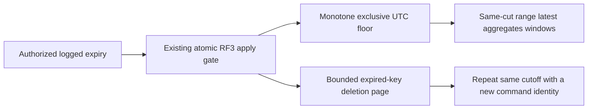

# ADR-073: Logged bounded time-series retention

Status: Accepted implementation contract, not qualified. Date: 2026-10-03.
Owner: KeyLoad root integrator. Scope: the expiry stage of KL-026;
REQ-SERIES-013..016 / AC-SERIES-013..016 in [TimeSeries](../Features/TimeSeries.md).
Rollups and KL-078 chunk encoding remain separate required stages.

## Decision and alternatives

Persist an exclusive UTC retention floor per canonical series. A replicated
`ExpireSamples` mutation advances that floor monotonically and deletes at most
the caller's bounded page of older sample records. Readers use the floor in the
same storage cut even when physical deletion needs further pages. This avoids
unbounded deletion under the apply gate and prevents partially purged history
from becoming visible. Reading the wall clock to expire records, deleting an
entire native segment, or deleting sample identity receipts is rejected: those
choices would weaken deterministic replay, scoped ownership or retry identity.

The cutoff must not exceed the operation's trusted logged EvaluatedAt. It is
normalized to UTC, applies to timestamps strictly before it, and cannot move
backwards. `SeriesManage` authorizes expiry; `SeriesRead` authorizes its status.
Append retains old sample-ID fingerprint checks. An identical retained ID may
deduplicate without resurrection; a new sample older than the floor is rejected.
All decisions occur inside the existing ordered atomic RF3 command path.

## Implementation and format contract

1. Root owns Abstractions `Features/TimeSeries/SampleRetentionContracts.cs`, the
   additive capability bit, mutation/native aliases, protocol validation,
   authorization, engine dispatch and Server/SDK/MCP/Orleans joins. Existing enum
   values and native field IDs are preserved.
2. TASK-104-SERIES-EXPIRY, Luna/high, owns Core `Features/TimeSeries/` retention
   helpers and the sample append region of GraphAndSeries.cs, plus matching new
   UnitTests `SampleRetention*` files. Author tests with code; finish and review
   implementation before runtime tests. No other GraphAndSeries region is owned.
3. New private generated record under `sample-retention-v1` is scoped by full
   partition, set and series. It stores format1, Before UTC ticks, cumulative
   PurgedCount and HasMore. Stable Alias/Id contracts are mandatory. Absent state
   means no retention; unknown format or corrupt state fails closed. Existing
   sample/sequence/ID bytes, native WAL and recovery journals are preserved.
4. Validate positive MaximumDeletes <=256 and configured MaxScanRecords. Traverse
   using native ordered range APIs, charge examined key/value bytes, copy only
   at most that many keys, and mutate only after traversal finishes. Persist
   floor, checked counts and delete page atomically. Same cutoff resumes purge;
   an older cutoff returns RevisionConflict. No background per-sample timers.
5. Range/latest/raw aggregate/dense-window reads apply the same floor, preserving
   their original inclusive/half-open windows and empty-window anchors. All
   metadata, scans, cancellation/deadline and complete result bytes remain under
   the operation budget. Existing store read leases protect an in-flight cut:
   expiry waits for that cut and cannot dispose its storage or borrowed buffers.
6. Root reviews every diff, joins real process reopen/recovery and SDK/official
   MCP RF3 tests through the Aspire-owned test entry point, then runs complete
   build/format/governance/CI gates. Source presence never closes KL-026.

### TASK-SERIES-RETENTION-RECOVERY frozen scope

Luna owns only new SampleRetention* files under CrashHost, RecoveryTests and
IntegrationTests Features/TimeSeries; root owns CrashHostApplication dispatch.
Persist the frozen ReplicatedOperation as native binary before arming the real
commit observer. Terminate the actual child at HeaderWritten, PayloadWritten,
JournalFlushed, MutationApplied and ApplyCompleted. Reopen must observe either
the old floor and all old points with no outcome, or the complete new floor,
bounded deleted page and matching durable outcome; JournalFlushed and later
must recover committed. Retry the same command returns the original receipt
without purging a second page. A new command at the same floor resumes exactly
the next page. Preserve sample-ID receipts, sequence and surviving point bytes.
Range/latest/aggregate/windows/status compare to an independent ordered raw
reference; only legitimate small exactly representable oracle values avoid
introducing a new floating-point tolerance.

Actual Aspire-owned RF3 public SDK and official MCP clients verify partial purge,
replay and complete logical hiding across all nodes. Stop an actual owned
follower, apply the next bounded expiry page through a live quorum, restart that
same container and await healthy routing plus public state convergence. Cover
persisted SeriesManage/SeriesRead denial and late new versus identical retained
IDs through existing APIs. Existing SampleRetentionRf3Tests remains unchanged;
new cohesive recovery helpers/tests use the same genuine fixture and serial
fault group. Restore every stopped container and join/clean each actual process
in finally. No direct Docker launch, mock, skip, changed numerical contract,
new transport or assertion weakening. Root serializes builds/tests and owns
original local and Linux evidence. This stage does not implement rollup buckets
or physical chunks, and process kill does not prove power-loss durability.

Start: root freezes public contracts and these criteria. Join: reviewed source,
new mapped tests, integrated build and genuine required evidence. Forbidden:
storage ownership changes, outcome pruning, provider substitutions, cross-partition
atomicity, concurrent-file overwrites or claims of power-loss qualification.

## Current record and rollout contract

The current native record is scoped to the canonical partition, set and series.
Its format discriminator is validated before use, and unknown or corrupt state
fails closed. The feature does not alter existing sample, sequence or identity
bytes. Rollback removes the feature only as a complete reviewed deployment change;
it must not silently remove a persisted retention floor.

