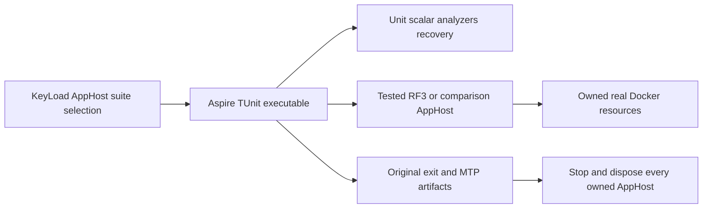

# ADR-074: One Aspire-owned test entry point

Status: Accepted owner implementation contract; runtime qualification pending.
Date: 2026-10-03. Related: REQ/AC-TEST-009..011 in TestInfrastructure, KL-080.

Accepted2026-10-05 settlement amendment: follow the exact original-process and
reader ownership contract in TestInfrastructure REQ/AC-TEST-015. Root joins image
cleanup after actual AppHost stop/producer/runner settlement and before output
join/disposal. Five-second cleanup escalation records failure and still awaits
actual exit plus original readers; native overflow/readiness-cancellation cases
retain primary and cleanup failures. No detached settlement or DirectoryInfo
using declaration. Runtime proof remains pending until Aspire suites run.

REQ/AC-TEST-010 increases only the Linux verify job's enclosing bound from30 to120
minutes after original run37349838022 cancelled recovery at the old job limit.
Keep unit, scalar and recovery sequential, every suite's native deadline and all
required source/runtime/artifact gates. No timeout or failed suite becomes green.

## Decision and boundaries

`KeyLoad.AppHost --KeyLoadTests:Suite=<suite>` composes one actual Aspire
executable resource invoking the already-built TUnit/MTP suite. Supported suites
are analyzers, unit, unit-scalar, recovery, rf3, comparison and site. Arguments
are individual native process arguments, never shell text. Test selection must
not silently launch the ordinary persistent server cluster or benchmark model.
The scalar runner alone receives DOTNET_EnableHWIntrinsic=0. Results remain
original MTP artifacts under TestResults/<suite> by default. A bounded optional
ResultsDirectory is resolved against the source root and forwarded as one native
argument. ReportTrx and the complete CoverageSettings/CoverageOutput pair preserve
the existing original TRX and Cobertura qualification receipts; coverage settings
without output, or output without settings, reject before adding resources.
Paths and filters are bounded to 4096 characters and contain no NUL characters;
no arbitrary command arguments or shell executable is accepted. Optional bounded
TUnit filters are development selection, never a complete qualification claim.
Explicit empty CLI suite selection fails before resources rather than starting
the default cluster. Empty inherited suite environment is the intentional child
AppHost reset and continues to select its real ordinary resource model.

The comparison suite alone may inherit Benchmarks:Target and its existing native
cell settings: these belong to the tested child AppHost, while the outer model
still contains only its runner. Other suites reject a benchmark target. A test
suite combined with Benchmarks:Enabled always rejects; this prevents composing
the ordinary benchmark graph alongside test resources. Native comparison jobs
retain their existing job deadlines and set the runner timeout within that bound.

RF3 and comparison suites continue to own their real tested child AppHost via
DistributedApplicationTestingBuilder. Their existing discovered endpoints,
SDK/official MCP callers, image identity, health checks, independent node files,
scoped fault injection and cleanup remain. The outer AppHost owns the runner;
the child tested AppHost owns its containers. No duplicate idle RF3 cluster is
created in the outer test model. Unit/recovery runners launch no database Docker
cluster; recovery still launches the genuine crash/reopen helper processes.

The runner terminal snapshot must supply its original exit code. FailedToStart,
missing exit status, cancellation, timeout and cleanup errors fail the command.
Always stop/dispose the owned AppHost. Forward native test output without
rewriting results; retain original artifacts. Do not infer test success from
AppHost startup or a container becoming healthy.

Required CI suites explicitly set `KeyLoadTests:ReportTrx=true` at their
Aspire caller. The optional setting still controls native child arguments;
omitting it cannot qualify original TRX retention. The exact55 run
37303831451 omitted it for full unit, scalar, recovery and RF3 execution,
so those missing TRX receipts are not counted as evidence. Native TUnit JSON
reports remain valid original test outcomes and are reviewed separately. Preserve failed native
output/artifacts and require original per-suite reports on the next exact SHA.

The AppHost project defaults to Release. The pinned Aspire CLI evaluates its
native RunCommand/TargetPath without forwarding the outer dotnet-run configuration,
so an implicit Debug default would launch stale or missing output after a Release
build. Use the ordinary project Configuration property; explicit MSBuild global
configuration still controls explicit builds. The native CLI/DCP launch remains
mandatory. Confirm the actual CLI-resolved AppHost path and genuine Release TUnit
results; model assertions alone cannot qualify launch configuration.

## Implementation task graph

### Local development RF3 image prerequisite (2026-10-05)

REQ/AC-TEST-015 adds the explicit `KeyLoadTests:LocalRf3Image:Enabled=true`
selector only for the RF3 suite with an explicit nonblank bounded development
filter. The outer AppHost composes one native executable
image-preparation resource; its TUnit runner `WaitForCompletion`s that resource.
The child AppHost retains the existing AddContainer RF3 model and all readiness,
membership, SDK/MCP, fault and shutdown contracts. Invalid or mixed selectors fail
before composing resources. There is no implicit fallback from missing GitHub proof.

The local producer owns a unique invocation tag, a bounded fingerprint of the
actual Dockerfile/build inputs and a custom input label. The
producer captures an invocation-owned immutable build-context snapshot and builds
from that exact snapshot, with a verified digest over names, modes and bytes.
It admits no more than 20,000 files and 512 MiB before reading their contents,
streams individual files and distinguishes the two accepted context COPY rules
from the exact internal build-stage copy. Unsupported Dockerfile/ignore rules
fail closed. Mutable checkout before/after hashes cannot prove captured inputs.
Its separate bounded receipt names provenance `local-development`, the actual Docker image config ID,
tag, input digest, pinned base references and producer version. It never fabricates
a Git revision, GitHub run or registry manifest digest. The child verifies this
receipt against current inputs and actual daemon metadata before startup, all
three modeled tags, and actual container image config IDs after startup. Existing
GitHub exact-source/manifest verification and ADR-034 publication remain unchanged;
this receipt is never accepted by qualification or website provenance validators.

Stages: root freezes this contract and TestInfrastructure acceptance first;
dependency_closeout supplies disjoint local settings, producer, image selection,
verification and real model/negative regressions; root joins the shared AppHost and
ClusterFixture composition, reviews ownership, builds and runs the canonical
Aspire RF3 entry. Relevant roles remain within Features/TestInfrastructure and
Features/ClusterReplication; scripts/Features/TestInfrastructure owns the producer.
No new database API, stored format, package or production topology applies.

Request admission is owned by TestInfrastructure/Validation and invocation
construction by Execution; retain no executable legacy copies in Models.
The two owned native termination helpers use generated LibraryImport, with
AllowUnsafeBlocks enabled narrowly in KeyLoad.AppHost.csproj and
KeyLoad.IntegrationTests.csproj. No global unsafe setting or diagnostic suppression
is authorized. Root joins LocalRf3ImageCleanup into TestSuiteApplication after
actual AppHost stop and owned process settlement, using a separate 45-second
cleanup token, before final output settlement and application disposal. Preserve
the original test/startup failure alongside any cleanup failure.

Every build/start/test/cancel path joins and releases its owned resources. After
owned nodes stop, cleanup rechecks the invocation tag's image ID and input label
before removing only that tag, without force/prune or unrelated-resource deletion.
Cleanup uses the immutable owned receipt and daemon identity rather than requiring
the checkout to remain unchanged; startup still checks current inputs. Any running
or stopped image user blocks deletion. Native cancellation, timeout and output
overflow arm bounded owned-process escalation immediately and join the actual
exit plus both original output readers. Dispose the context snapshot after that
settlement and retain a bounded original build-output tail with the receipt.
Keep original receipts/reports as development evidence. Rollback removes only the
explicit local selector and its owned helpers; the default GitHub path remains
fail closed. Model/parser checks do not prove real image creation or cleanup:
actual Docker/Aspire SDK/MCP execution and failure receipts are required. Local
comparison mode is deferred to its own accepted contract. Immutable prior-image
and mixed-image protocol cases keep their qualified historical image requirements;
if selected without those proofs they fail closed, with no skipping or local
receipt substitution. This development filter cannot qualify the complete RF3 suite.

1. TASK-TEST-CONTRACT, root: this contract and requirements precede implementation.
2. TASK-TEST-ENTRY, root: AppHost Features/TestInfrastructure owns closed suite
   selection, executable composition and bounded completion/exit handling;
   Program and Hosting/KeyLoadAppHostApplication are the sole composition joins.
3. TASK-TEST-LIFETIME, root: ClusterFixture must capture failures and dispose
   everything after any partially completed Build/image check/Start/profile or
   readiness failure; preserve original failure alongside cleanup failures.
4. TASK-TEST-CI, root: replace all CI, Benchmarks and QualifySite suite invocations with this entry point after
   building AppHost and the intended test projects. Keep every Linux normal,
   scalar, analyzer, recovery, Docker RF3, native comparison, website and coverage
   gate and original artifact paths. Complete comparison jobs, cohorts, native
   measurements, publication joins and provenance validators remain mandatory.
5. TASK-TEST-VERIFY, root: real Aspire model tests assert selection, arguments,
   scalar child environment, rejected modes/empty selection, complete original
   artifact and collector arguments, and absence of duplicate nodes, including
   the comparison child target case.
   Then actual entry runs verify TUnit results/exit and RF3 cleanup in local
   development and exact-source Linux CI. No mock process or fake Docker proof.

Graph: CONTRACT -> ENTRY / LIFETIME -> CI / MODEL TESTS -> runtime EVIDENCE.
Shared config/docs/workflows/Git remain root-owned; code workers cannot introduce
independent Docker lifecycle or change suite contents, outcomes or authorization.
Aspire is already centrally pinned; no new package, product DTO or stored format.

## Rollout and rollback

Deploy source and invoking CI commands together. Unknown suites/mixed modes fail
before resources are added. Existing unit/recovery/RF3 semantics stay mandatory.
Failure handling releases acquired resources before deleting owned test data;
never touch user data or unrelated running containers. No production migration.
Frontend N/A because the entry is developer/CI infrastructure.

