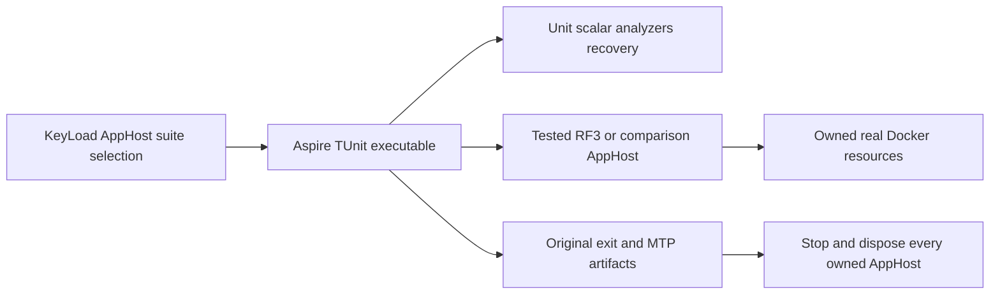

# ADR-074: One Aspire-owned test entry point

Status: Accepted owner implementation contract; runtime qualification pending.
Date: 2026-10-03. Related: REQ/AC-TEST-009..011 in TestInfrastructure, KL-080.

## Decision and boundaries

`KeyLoad.AppHost --KeyLoadTests:Suite=<suite>` composes one actual Aspire
executable resource invoking the already-built TUnit/MTP suite. Supported suites
are analyzers, unit, unit-scalar, recovery, rf3, comparison and site. Arguments
are individual native process arguments, never shell text. Test selection must
not silently launch the ordinary persistent server cluster or benchmark model.
The scalar runner alone receives DOTNET_EnableHWIntrinsic=0. Results remain
original MTP artifacts under TestResults/<suite> by default. A bounded optional
ResultsDirectory is resolved against the source root and forwarded as one native
argument. ReportTrx and the complete CoverageSettings/CoverageOutput pair preserve
the existing original TRX and Cobertura qualification receipts; coverage settings
without output, or output without settings, reject before adding resources.
Paths and filters are bounded to 4096 characters and contain no NUL characters;
no arbitrary command arguments or shell executable is accepted. Optional bounded
TUnit filters are development selection, never a complete qualification claim.
Explicit empty CLI suite selection fails before resources rather than starting
the default cluster. Empty inherited suite environment is the intentional child
AppHost reset and continues to select its real ordinary resource model.

The comparison suite alone may inherit Benchmarks:Target and its existing native
cell settings: these belong to the tested child AppHost, while the outer model
still contains only its runner. Other suites reject a benchmark target. A test
suite combined with Benchmarks:Enabled always rejects; this prevents composing
the ordinary benchmark graph alongside test resources. Native comparison jobs
retain their existing job deadlines and set the runner timeout within that bound.

RF3 and comparison suites continue to own their real tested child AppHost via
DistributedApplicationTestingBuilder. Their existing discovered endpoints,
SDK/official MCP callers, image identity, health checks, independent node files,
scoped fault injection and cleanup remain. The outer AppHost owns the runner;
the child tested AppHost owns its containers. No duplicate idle RF3 cluster is
created in the outer test model. Unit/recovery runners launch no database Docker
cluster; recovery still launches the genuine crash/reopen helper processes.

The runner terminal snapshot must supply its original exit code. FailedToStart,
missing exit status, cancellation, timeout and cleanup errors fail the command.
Always stop/dispose the owned AppHost. Forward native test output without
rewriting results; retain original artifacts. Do not infer test success from
AppHost startup or a container becoming healthy.

The AppHost project defaults to Release. The pinned Aspire CLI evaluates its
native RunCommand/TargetPath without forwarding the outer dotnet-run configuration,
so an implicit Debug default would launch stale or missing output after a Release
build. Use the ordinary project Configuration property; explicit MSBuild global
configuration still controls explicit builds. The native CLI/DCP launch remains
mandatory. Confirm the actual CLI-resolved AppHost path and genuine Release TUnit
results; model assertions alone cannot qualify launch configuration.

## Implementation task graph

1. TASK-TEST-CONTRACT, root: this contract and requirements precede implementation.
2. TASK-TEST-ENTRY, root: AppHost Features/TestInfrastructure owns closed suite
   selection, executable composition and bounded completion/exit handling;
   Program and Hosting/KeyLoadAppHostApplication are the sole composition joins.
3. TASK-TEST-LIFETIME, root: ClusterFixture must capture failures and dispose
   everything after any partially completed Build/image check/Start/profile or
   readiness failure; preserve original failure alongside cleanup failures.
4. TASK-TEST-CI, root: replace all CI, Benchmarks and QualifySite suite invocations with this entry point after
   building AppHost and the intended test projects. Keep every Linux normal,
   scalar, analyzer, recovery, Docker RF3, native comparison, website and coverage
   gate and original artifact paths. Complete comparison jobs, cohorts, native
   measurements, publication joins and provenance validators remain mandatory.
5. TASK-TEST-VERIFY, root: real Aspire model tests assert selection, arguments,
   scalar child environment, rejected modes/empty selection, complete original
   artifact and collector arguments, and absence of duplicate nodes, including
   the comparison child target case.
   Then actual entry runs verify TUnit results/exit and RF3 cleanup in local
   development and exact-source Linux CI. No mock process or fake Docker proof.

Graph: CONTRACT -> ENTRY / LIFETIME -> CI / MODEL TESTS -> runtime EVIDENCE.
Shared config/docs/workflows/Git remain root-owned; code workers cannot introduce
independent Docker lifecycle or change suite contents, outcomes or authorization.
Aspire is already centrally pinned; no new package, product DTO or stored format.

## Rollout and rollback

Deploy source and invoking CI commands together. Unknown suites/mixed modes fail
before resources are added. Existing unit/recovery/RF3 semantics stay mandatory.
Failure handling releases acquired resources before deleting owned test data;
never touch user data or unrelated running containers. No production migration.
Frontend N/A because the entry is developer/CI infrastructure.

