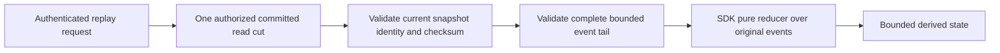

# ADR-075: Bounded aggregate snapshots and pure replay

Status: Accepted implementation contract under the owner-authorized KL-085 scope;
source and runtime qualification pending. Date: 2026-10-03.

Related: REQ/AC-EVENT-007..010, KL-084/085, ADR-002/011/015/024/025/029/030/060.

## Decision

Keep one latest snapshot slot per complete stream generation, keyed by
`aggregate-snapshot-v1 / partition / streamSet / streamId / generation` in the
canonical ZoneTree store. Each replacement atomically updates that one slot;
retained events remain the authority for rebuilding derived snapshot state.

The public snapshot contains StreamRef, monotonically increasing SnapshotVersion,
SourceRevision, exact ReducerVersion identifier, positive StateSchemaVersion,
StateJson and a SHA256 checksum from JsonData.Fingerprint over the public
AggregateSnapshotState with Checksum="". This exact frozen JSON identity,
including original state text, is independent of native serializer output.
A private generated
native envelope includes FormatVersion=1. Preserve original state JSON bytes
after bounded valid-JSON validation; native Orleans serializers and the existing
atomic/RF3 journals persist the envelope. Never persist executable reducer code.

`StoreAggregateSnapshot` is a normal atomic Batch mutation. It requires persisted
EventsSnapshotsManage plus EventsRead and complete raw worker-input grants.
ExpectedSnapshotVersion=0 requires an absent slot; otherwise compare the exact
prior version. SourceRevision must be nonnegative, no greater than the current
tail, no earlier than FirstAvailableRevision-1 and no earlier than the prior
snapshot source revision. Generation mismatch is TokenInvalidated; CAS or
backwards source conflicts are RevisionConflict. Successful replacement advances
SnapshotVersion by one. CommandId retry returns its original durable outcome.
Cross-partition snapshots are unsupported.

`ReadAggregateReplayRequest` includes StreamRef, exact ReducerVersion,
StateSchemaVersion, FromBeginning=false and MaximumEvents=100. One budgeted
Store.Read resolves current persisted principal, resource, head, snapshot and
entire needed tail under one read/apply gate; returned cut is Store.Position
inside that gate. It requires EventsReplay plus EventsRead. Before any snapshot
or event body, require RawReadGrant and RawUseGrant for every configured payload
and header policy, even when RequiredForProcessing is false. Snapshot state is
worker-only opaque derived data; no automatic public redaction or lineage-safe
user query is promised. Missing grants fail before body disclosure.

With an exact-compatible snapshot, return it and every event after SourceRevision
through the captured TailRevision. Without a snapshot, begin at revision zero.
FromBeginning=true explicitly ignores the slot and requires full retained history.
An incompatible reducer/state schema is FormatUnsupported; no implicit fallback.
History that cannot bridge the source revision is HistoryUnavailable. Wrong
generation is TokenInvalidated. Validate each event's stream identity, generation,
key, consecutive revision, positive sequence/schema version and generation-scoped
EventId identity. Gaps, malformed heads/envelopes or checksums are Corruption;
unknown stored formats are FormatUnsupported.

MaximumEvents must be positive and within configured MaxResults and MaxScanRecords.
The complete required tail must fit it or fail the whole request as BudgetExceeded.
Shared raw-byte/result/depth/deadline/cancellation bounds cover metadata/state and
events. No partial page/cursor, nested independent read cut or storage handle
across an await/grain movement. Replay reads never append, publish, enqueue, ACK,
invoke subscription handlers or send external output. Original event payload,
header and schema version remain exact replay inputs.

The .NET client provides an explicit worker-side reducer contract. The reducer
contains Version, StateSchemaVersion, EventSchemaVersion, InitialStateJson and
`Func<string, EventRecord, string> Apply`. The request selects one exact current
event schema; records with a different schema fail before caller code runs. The
worker validates the complete slice identity/order/floor/head before invoking
the pure reducer, then checks cancellation and bounded JSON for each payload and
resulting state. No reducer callback runs for an invalid slice. The server loads
no code and the SDK does not register or redrive a subscription. The typed read
calls `/v1/streams/replay`; official MCP name is `keyload_streams_replay`.
`AggregateReplayClient` owns the typed SDK read as an extension on `KeyLoadClient`,
using its existing internal `Send` transport. Caller syntax and HTTP contracts
stay the same; feature adapters remain separate bounded types rather than
extending the aggregate partial client beyond the mandatory 200-line type limit.

`AggregateReplayWorkerLimits` defaults to MaximumEvents=4096,
MaximumStateBytes=1048576, MaximumInputBytes=16777216 and MaximumJsonDepth=64.
Each is positive; hard ceilings are respectively 65536, 16777216, 67108864 and
64. Original payload/header/state UTF8 bytes share the complete input cap; every
intermediate state respects the state cap. These explicit worker bounds
complement server limits and do not authorize relaxing a server budget. Reduce
the original immutable events without duplicating each record into a second
object graph. Original valid DateTimeOffset metadata has no added SDK-only range.
Reducer callbacks are synchronous caller-owned pure functions; the SDK cannot
make impure callbacks safe or guarantee business correctness. No server
assembly/plugin installation.

## Ordered implementation and task graph

1. TASK-EVENT-REPLAY-CONTRACT, root/high-capability planning: ADR and ACs precede
   Abstractions Features/EventStreams DTOs/aliases, appended dedicated capability
   bits, mutation discriminator and canonical protocol joins.
2. TASK-EVENT-REPLAY-STORE, Luna worker: Core Features/EventStreams owns private
   native snapshot codec/checksum, bounded CAS writer and same-cut complete reader;
   real ZoneTree UnitTests Features/EventStreams cover reference state, CAS/retry,
   versions/history/generation/identity, privacy, corruption, bounds/cancel/reopen
   and unchanged source/store position on reads. Root owns IAuthorizationPolicy,
   Security implementation and shared mutation dispatch; worker uses frozen joins.
3. TASK-EVENT-REPLAY-CLIENT, root/disjoint worker: Client Features/EventStreams
   typed replay call and pure versioned helper with genuine worker regressions.
   Root owns Orleans read kind, Server route and official MCP catalog joins.
4. TASK-EVENT-REPLAY-RECOVERY, Luna worker: new AggregateReplay* files under
   CrashHost, RecoveryTests and IntegrationTests Features/EventStreams own the
   actual snapshot process-kill and public RF3 scenarios. CrashHost persists its
   frozen ReplicatedOperation through NativeSerialization before arming the
   existing commit observer. HeaderWritten, PayloadWritten, JournalFlushed,
   MutationApplied and ApplyCompleted exercise the existing real storage gate.
   Reopen must find either no snapshot/outcome or the complete committed pair;
   JournalFlushed and later must recover committed state. Stable retry creates
   exactly one version, preserves the original receipt and never changes source
   head, events or generation-scoped event identities. Root owns only the shared
   CrashHostApplication mode dispatch and McpCallerTools replay-name join.
   Actual Aspire Docker RF3 tests use the existing owned ClusterFixture and real
   .NET/official MCP clients: snapshot plus complete tail equals the independent
   reference, both transports agree, persisted worker/raw grants and revocation
   fail closed, incompatible versions/generation and complete-tail limits fail
   explicitly. Kill the elected owned leader, await real survivor routing,
   retry one frozen command through election, restart the same container and
   verify all three nodes converge through public clients. Always restart/clean
   every owned process/container in finally; no fake topology, skipped cases,
   independent Docker launch or altered production contracts. Split helpers to
   meet the ordinary file/type/method limits. Root serializes build and test runs.
5. TASK-EVENT-REPLAY-VERIFY, root: inspect every diff; strict build, formatter,
   governance, Aspire TUnit and exact-source Linux recovery/RF3/fault receipts.

Graph: CONTRACT -> STORE -> CLIENT / RECOVERY -> root integrated EVIDENCE.
Workers own disjoint files; shared contracts/config/security/transport/docs/Git
remain root-owned. Escalate contract/dependency defects; no invented fallback.

## Rollback and qualification

Run the accepted RF3 topology and recovery gates before treating snapshot
behavior as qualified. Rebuild a missing snapshot explicitly only while its
complete source history is retained. Deleting derived state never permits erasing
events, ID receipts or journals. Roll back code only through a reviewed deployment
change that preserves the current stored contract. UI N/A: programmable
EventStreams/worker infrastructure. Process-kill evidence does not qualify
power-loss durability; required fault/endurance gates remain.

## KL-085 AC-EVENT-009 authorized recovery continuation (2026-10-10)

The existing `AcEvent009RevocationReauthorizesReplayAndDurableSnapshotRetry` and
`AcEvent009PersistedRawGrantsAuthorizeExactInputsAndRevocationDeniesBothClients`
cases continue the original protected aggregate operation after persisted
revocation. They retain the original snapshot command, complete receipt and
complete snapshot/tail page; revocation refuses private reads and original-command
retry, then a strictly higher persisted policy epoch restores the same principal
and exact original grants. The repaired caller must receive the independently
expected snapshot state, complete ordered event data/headers and pure reducer
result, and the complete original full snapshot receipt remains an immutable local native authority oracle.
The original command stays PermissionDenied after an epoch-changing grant repair;
current authorization does not erase its captured policy-epoch fence. A NEW
authorized snapshot CAS command uses the actual existing source revision and
state, advances snapshot version exactly once and yields its independently
expected current-epoch receipt. That new command alone may success-replay.

Unit ownership reopens the same native store. RF3 ownership closes the original
SDK/MCP connections, restarts all three existing Aspire-owned nodes on the same
root, and acquires fresh SDK/official MCP callers. Direct SDK, official MCP, Q1
SDK and Q1 MCP must each return complete protected replay data and the NEW current-epoch
receipt before and after cold restart; the OLD epoch command remains denied
without protected output or aggregate effects on every route. Each observed owner retains NodeId and
incarnation, while read generation and applied authority may advance; every
new replay page acquires its own current cut, which must not precede the retained
original page. Full page equality excludes only that independently checked cut.
No old cursor, connection or captured authority is reused after restart.

This extends REQ-EVENT-007/008/009/010 and AC-EVENT-007/008/009/010 under TASK-085
and ADR-075. Snapshot CAS/source revision, original JSON/checksum, persisted raw
grants, strict stored outcome policy-epoch equality and pure bounded worker behavior
remain unchanged. Refusal creates no aggregate input/snapshot effects; authority
and command bookkeeping are not asserted to have an invariant physical cut.
There is no application schema transformation, internal-format fallback, clock,
quota, deadline, transport, serializer or product API change. Normal/scalar Unit,
real process recovery and RF3 caller qualification remain authentic runtime gates.

Ordered source ownership and join: (1) append this contract before source;
(2) preserve both existing case declarations and their original deadline/fixture
ownership; (3) retain original protected input, snapshot command/receipt/page;
(4) exercise persisted revoke and all public refusal routes; (5) repair the same
persisted principal at a higher epoch, require the OLD command denied and complete
all four fresh reads plus NEW current-epoch snapshot CAS/receipt retry routes;
(6) join old callers, capture actual owner statuses, restart the existing RF3
resources, acquire fresh callers, repeat complete results and compare native
owner identities. Root joins/tests this guarded proposal; rollback is source
rollback only and introduces no persistent format change.

Exact owning source map: Unit `Cases/AggregateReplayAuthorityTests.cs` and
`Helpers/AggregateReplayAuthorizationContinuation.cs`; Integration
`Cases/AggregateReplayRf3Tests.cs`, `Helpers/AggregateReplayRf3Scenario.cs`,
`Helpers/AggregateReplayAuthorizationContinuation.cs`,
`Contracts/AggregateReplayAuthorizationOriginal.cs` and
`Assertions/AggregateReplayAuthorizationRoutes.cs`, all within their existing
`Features/EventStreams` slices. The original process suite and independent
schema/history/concurrency/cancel cases remain required; this additive flow
closes no application schema transformation or endurance gate by source presence.

R2 native source correction: `DatabaseEngine.ValidateCachedResult` in
`CommandOutcomes.cs` rejects `previous.PolicyEpoch != principal.PolicyEpoch`.
`SaveAggregateSnapshot` admits equal existing SourceRevision with the exact
current ExpectedSnapshotVersion. This continuation preserves those production
fences unchanged. Unit captures the actual original StoredOutcome native row
bytes before revocation and checks them unchanged after repair, new CAS and
reopen; RF3 retains the full original receipt as evidence without treating a
reserialization as a persisted-node witness. The immutable R1 proposal is
unqualified and superseded for join; no original execution failure is rewritten.
