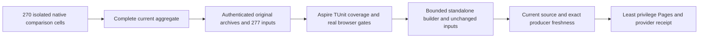

# ADR-076: Publish only the complete current comparison cohort

Status: Accepted implementation contract under the owner's immediate legacy
removal direction; source and runtime qualification pending. Date: 2026-10-03.
Related: REQ/AC-BC-CURRENT-001..004, KL-040/095/096, ADR-040/047/056/064/074.

## Decision and authority

The Benchmarks comparison-aggregate job is the sole live measurement producer.
Its genuine comparison-isolated-suite and original provider-evidence archives
must represent every one of the 270 required native cells, with all 277 input
files validated by the existing isolated GitHub and archive contracts. Preserve
engine/topology/scenario/repetition, correctness, acknowledgement, durability,
machine fairness and exact source/run/attempt/job/artifact identities. No workload
or isolated measurement job is removed by this publication change.

Retire the obsolete comparison-smoke/comparison-suite collector, twelve-file
historical archive dependency, three-profile current-site renderer and their
unused implementations, tests, hooks, environment settings and source inventories
in the same change. The old producer no longer exists in CI. Relabelling those
archives or bypassing their failed checks would not produce current evidence.
Immutable authentic historical evidence remains history, outside the live path.

The current publisher consumes the existing complete isolated cohort. Mandatory
authenticated capture, confined BCL ZIP preflight/extraction, original receipt
and archive hashes, all 277 input hashes, source closure, complete native TUnit,
analyzer/browser qualification, original coverage thresholds, and no-skip gates
remain. Removing obsolete sources removes only their obsolete coverage entries;
every remaining executable source retains native coverage and critical validators
retain the 90 percent requirement. Never substitute fabricated records or permit
partial, skipped, mixed, missing, expired or unauthenticated cohorts.

Use the standalone isolated builder and display all native dimensions with their
exact provenance. Keep website, measured and trusted-control revisions accurate.
The final builder verifies an immutable regular receipt of at most 4 MiB and all
original inputs before and after its bounded run. The emitted aggregate matches
the qualified bytes. Publication metadata schema version 2 contains these source
revisions, the complete isolated archive receipt and original qualification
test/coverage/job receipts; obsolete historical-profile fields are removed.
Immediately before deployment recheck current main and the authenticated exact
producer tuple. Keep needs-gated least-privilege Pages deployment and its actual
provider receipt. No credentials, DNS, database topology or persistence change.

## Ordered implementation graph and ownership

1. TASK-SITE-CURRENT-CONTRACT, root: this decision, measurable REQ/AC mappings and
   explicit owner-directed local-policy corrections precede delegated writes.
2. TASK-SITE-CURRENT-TOOLS, Luna: remove only collect-github-evidence.sh and the
   four github-evidence-*.mjs/entry modules, their dedicated SiteGitHubEvidence*
   and SiteGitHubArchive* test/helper family; reconcile SiteCoverageGate and
   SiteCoverageTokens to the actual isolated authority. Preserve all genuine
   SiteIsolatedGitHub* positive, corrupt-input, authority, expiry, freshness and
   confined extraction tests. Escalate references outside this exact scope.
3. TASK-SITE-CURRENT-ASSETS, disjoint Luna: retire historical-profile site assets
   and their dedicated rendering/build regressions after mapping each still
   relevant accessible, browser, vendor, budget and safety criterion to the
   standalone isolated surface. Preserve all complete-cohort arithmetic/oracles,
   keyboard, reduced-motion, scene lifecycle, source safety and metadata tests.
   Root freezes exact file ownership before starting this task.

   Frozen asset scope: site Features/BenchmarkComparisons build-site.mjs,
   index.html, bootstrap.mjs and styles.css; retire benchmark-lab.mjs,
   benchmark-chart.mjs and benchmark-profiles.mjs; trim measurement-loader.mjs
   to its actual shared SHA256 primitive and measurements.mjs/contracts.mjs to
   their current consumers. Preserve native median/selection/resource arithmetic,
   all isolated modules, vendor files, scene/brand/SEO assets and visual design.
   Test scope: dedicated SiteBuildTests, SiteEvidenceValidatorTests,
   SiteMeasurementOracleTests and their obsolete report-only helper graph;
   SiteBuildArtifacts/Support, SiteVendorBuildTests, SiteMetadataTests/RejectionTests,
   SiteBuilderDiagnosticsTests, SiteBrowserBehaviorTests and reusable browser
   assertion helpers, SiteIsolatedBuildTests/StandaloneBrowserTests. Preserve or
   adapt every real vendor/gzip budget, metadata/path, native browser, keyboard,
   reduced-motion, retina resize, pointer follow, page lifecycle and independent
   current-cohort numeric assertion. New cohesive helpers stay in the same slice.
   Any reference outside this scope escalates to root before editing.
   Root owns SiteTestSupport/SiteTestInputs and SitePublicationTokens plus coverage
   inventories/source closure, policies, contracts, workflows and docs.
4. TASK-SITE-CURRENT-JOIN, root: QualifySite, BuildIsolatedSite and DeploySite use
   only current isolated capture/receipt/build/freshness. Preserve original MTP
   and Cobertura paths, source/policy equality and dependency closure; update
   workflow source regressions and canonical site docs/README/status.
   The trusted-control closure retains all producer dependencies and includes
   every remaining authored builder/browser module plus the thin build entry
   (65 exact sorted paths for this source). The former 49-path producer-only
   inventory does not cover newly standalone builder consumers. Vendor bytes
   retain their separate original hash/license/manifest gate. Every one of the
   32 remaining native-covered sources and 25 critical sources retains its
   original 80/70/90 thresholds; removing seven retired sources is not a bypass.
5. TASK-SITE-CURRENT-VERIFY, root: inspect every diff and requirement mapping;
   strict solution build, formatter/governance, Aspire-owned complete site TUnit,
   genuine GitHub capture/coverage/browser qualification and final provider proof.

CONTRACT -> TOOLS / ASSETS -> JOIN -> exact-source EVIDENCE. Workers do not alter
shared contracts, workflow permissions, persisted data or qualification thresholds
and do not commit/push. Root owns integration and stable delivery. No synthetic
GitHub executor, old-producer fallback or test skipping is permitted.

## Rollout and rollback

Deliver capture, tests, builder and deployment joins as one coherent source.
Missing genuine current cohort fails closed and leaves published evidence intact.
Rollback restores the prior qualified site artifact; it cannot authenticate the
removed producer or refresh historical measurements. Source/build validation is
not publication evidence. No current database qualification or performance win is
claimed from a website change.

