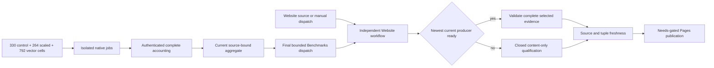

# ADR-076: Publish only the complete current comparison cohort

Status: Accepted implementation contract; current measured-source qualification remains pending.
Date: 2026-10-03; current publication contract updated 2026-10-06.
Related: REQ/AC-BC-CURRENT-001..004, REQ/AC-BC-WEB-001..007, ADR-040, ADR-056, ADR-062, ADR-064, ADR-109, ADR-112; original mapped work items [KL-040](../Features/ResourceExecution.md), [KL-095](../Features/QueryExecution.md), [KL-096](../Features/Authorization.md) remain linked through the canonical coverage catalog.

## Decision and authority

The canonical producer is the current `Benchmarks` workflow and its source-bound
composite plan. The plan contains 330 control cells, two 132-cell CRUD profiles
(100,000 and 1,000,000 records), and 24 vector profiles with 33 target/node
cells each: 1,386 workers total. Applicable scaled workloads retain at least
100,000 measured operations; vector profiles retain at least 100,000 measured
queries.

The current composite evidence inventory is derived from the canonical plan:
2,470 suite files and 60 provider files (2,530 total), including every planned
worker and required resource/proof/receipt input. The source contract computes
this inventory from the plans; validators require the exact expected paths,
unique regular files, sizes, hashes, source/run/attempt/job/artifact identities,
and original archive bytes. The source-defined inventory, not a copied count or
an older archive, is authoritative. Each slot must be a measured result, an
explicit unsupported-topology disposition, or an authenticated terminal workload
failure. A failed cell has a fixed safe reason and `report: null`; its original
failed job remains visible. No fabricated value, zero, winner, skipped cell,
partial cohort, mixed source, missing input or unauthenticated evidence can stand
in for a planned slot. Image/preflight, plan, provenance, archive, site, coverage,
browser, freshness and provider failures remain failures of their owning gates.

Benchmarks owns database preparation, isolated Linux workloads and one
source-bound aggregate. It does not build or qualify the website. Its final
bounded `Trigger Website` job dispatches the separate Website workflow after
aggregate dependencies settle, including when a workload or aggregate fails.
Website also runs independently on trusted own-main push or manual dispatch.
The Website workflow selects the newest ready completed own-main producer with a
successful authenticated aggregate and valid current evidence. Failed, canceled,
pending or incomplete producers provide no measurements. If no current producer
is ready, Website may qualify and publish content without figures. Corrupt,
expired, missing or mismatched evidence for a selected producer fails closed;
there is no older-evidence fallback. The optional dispatch run ID is only a
bounded completion-wait target and never chooses metric authority.

Measured qualification preserves the current original-input, archive/provenance,
source-closure, complete TUnit/no-skip, native coverage, browser, bounded-builder,
and predeployment source/selected-tuple freshness requirements in
[BenchmarkComparisons](../Features/BenchmarkComparisons.md) and [ADR-112](ADR-112-independent-website-publication.md).
Before the builder runs, it snapshots an immutable regular archive receipt no
larger than 4 MiB into a read-only owned file and verifies the snapshot identity.
It verifies every original current input before and after the bounded build and
checks the emitted aggregate bytes against the validated input. Measured
`data/publication.json` remains schema version 2 and records website/measured/
control revisions plus original test, coverage, job and isolated-archive receipts;
content-only publication remains its separately scoped schema version 3. All
current authored sources remain in the native source/coverage inventories and the
current thresholds remain 80% aggregate lines, 70% aggregate branches and 90%
for critical validators. Real browser assertions and no-skip checks remain
mandatory. Predeployment rechecks source and the exact selected tuple. Pages
deployment stays needs-gated, least-privilege and bound to its actual provider
receipt. Content-only publication is not measured qualification.

Historical measurements and their original source/run/attempt/archive identities
remain immutable and retain their original labels. They are not reinterpreted as
current-cohort evidence. Detailed historical receipts remain in the feature's
immutable evidence references, not as active producer or workflow instructions.

## Ordered implementation and verification contract

1. The feature contract and canonical plan define current cells, accepted terminal
   dispositions, current source and required evidence. Stable mappings are
   REQ/AC-BC-CURRENT-001..004 and REQ/AC-BC-WEB-001..007.
2. The benchmark producer owns the current plan, per-cell native jobs, authenticated
   aggregation and original result archives. The workflow contract is
   `.github/workflows/benchmarks.yml`; its source plan and composite inventory are
   `scripts/Features/BenchmarkComparisons/isolated-plan*.mjs`,
   `scaled-isolated-plan.mjs`, `vector-isolated-plan.mjs` and
   `composite-site-contract.mjs`. Preserve every current matrix, native image
   check, workload, acknowledgement/correctness/resource contract and failed/null
   accounting rule.
3. The Website producer-selection and bounded builder own optional metrics,
   exact evidence intake, closed qualification, source/tuple freshness and
   publication. Their entry points are `.github/workflows/website.yml`,
   `site-isolated-github-{capture,runs,proof,fresh}.mjs`, and
   `site/Features/BenchmarkComparisons/build-site.mjs`, and the existing
   `QualifySite`, `BuildIsolatedSite` and `DeploySite` composite actions under
   `.github/workflows/Features/BenchmarkComparisons/`. Preserve separate
   content-only and measured qualification, current archive/proof validation,
   original-input immutability, applicable TUnit/coverage/browser gates, and
   least-privilege Pages deployment.
4. The integration owner joins source, feature/ADR mappings, four workflow
   identities, workflow permissions, full native inventories and exact-source
   receipts. Verification includes static workflow/source checks, full build and
   formatting, complete Aspire-owned site tests with no skips, authenticated
   current-cohort evidence, Linux coverage/browser qualification, predeploy
   freshness and actual Pages provider evidence. Local source checks or old
   receipts do not close delivered-source qualification.

A missing current ready cohort permits only a fully qualified content-only
publication. A malformed or corrupt selected cohort rejects publication and
preserves the last published artifact. Rollback restores the last qualified
website source/artifact and does not rewrite measurement evidence. No benchmark
win, database recovery, durability or production-readiness claim follows from
website publication.

