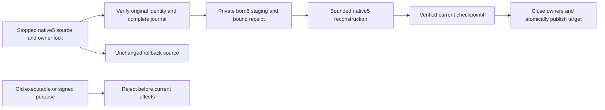
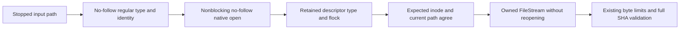

# ADR-077: Offline native data epoch and incompatible-peer fence

Status: Accepted implementation contract 2026-10-03 for KL-043 under the owner's
full acceptance instruction. Source and runtime qualification pending. Owner:
KeyLoad integration lead. Related REQ-STORAGE-007/021..024, AC-STORAGE-007 and
AC-EPOCH-001..006; EventStreams AC-EVENT-008/010, TimeSeries AC-SERIES-013/016.

Private RF3 control preflight additionally consumes the existing Storage.IO
regular-file primitive from AppHost under TASK-CRS-C1-APPHOST-REGULAR and
AC-CRS-004 in NativeCqrsRequestV2. Root owns the internal AppHost friend and
project-reference additions. Inspect/OpenWithIdentity binds bounded owner-file
reads to a real regular native handle without following links or blocking on
FIFO payloads. This adds only a trusted pre-start caller; the primitive's ABI,
locking/error contract, database formats, stopped upgrade protocol and required
Linux qualification remain unchanged. Rollback removes the private-control
consumer after owned AppHost resources and readers have joined, never user data.

TASK-OFFLINE-OWNER-UNLOCK-001 clarifies the existing REQ-STORAGE-025/026 and
AC-EPOCH-012 owner-release contract. A manually acquired native `flock` requires
explicit `LOCK_UN` after owned IO and before descriptor close, including a failed
pre-transfer open. A descriptor supplied to ordinary FileStream does not enter
the .NET native file-open lock initialization path. An outstanding dup/fork
reference must not extend the finished owner's lock lifetime. Preserve no-follow,
nonblocking open/lock, close-on-exec, regular type/identity, original error mapping
and stopped-operation authority. No retries, broader shares or lock bypass.

Root owns the frozen native ABI/lifecycle join. The IO worker owns
OfflineRegularFile, OfflineNativeHandleLease and a cohesive retained FileStream
lifecycle owner under StorageRecovery/Lifecycle. Sync and async disposal must
flush before unlock, close the original descriptor even after flush/unlock
failure, retain every original failure and be idempotent under the existing
ownership rules. Caller paths retain the same FileStream API and lifecycle joins;
no stream may unlock while its owned operation is still running. Do not bind
internal System.Native exports or alter private SafeFileHandle runtime fields.

The retained derived FileStream joins one actual disposal task. The pinned BCL
routes its base DisposeAsync through virtual Dispose(bool); a private per-owner
AsyncLocal reentry scope must allow only this lexical base cleanup to close the
borrowed view directly, avoiding a wait on its own completion. Restore that scope
in finally. External disposal still joins the actual owner task. Publish that task
under a short native Lock and start IO after releasing it. A closed original
descriptor invalidates the borrowed view before any buffered cleanup. The
pre-transfer lease directly disposes its retained field in exception-preserving
finally; transferred ownership belongs solely to the stream. These private joins
preserve the public FileStream API and every native failure/closure assertion.

The deterministic genuine-kernel regression duplicates the original retained
descriptor, proves a live owner excludes an independent opener, disposes the
owner, then requires immediate reopen while the duplicate is still alive. Test
sync/async disposal, shared/exclusive locks, original bytes and actual handle
closure; close every test-owned descriptor/library in finally. Public POSIX
interfaces suffice and no unsafe managed fork, delay, simulated provider or
production test-only capacity getter is allowed. This proves owner-release
semantics; it does not identify an original failed run's pre-exec process. The
existing C1 phases/original failures remain unchanged and must pass with all
Aspire normal/scalar/recovery/RF3 and final build/format/Linux gates. Rollback
reverts the coherent lifecycle repair without changing data or lock authority.

## Problem and supported formats

The exact previous executable at
`7784b6b46b98ce994dd98070dc1f58fe4e506b91` uses native identity5, WAL magic4,
checkpoint3 and native replica metadata/payload2. The old identity validator
requires5. Aggregate snapshots and retention floors change interpretation of
ordinary model keys: an unaware executable must not reopen their store, install
their image, or accept their signed peer work.

Its immutable source tree is `b03bf1301a03b3fe00f419c3c7bf5285a34b63f9`.
The owner-authorized removal of obsolete Git history changed commit ancestry;
this reachable commit has exactly the same complete source tree as the original
`2532f781fec8f2546a033c396a7dbce0e9b4b781`. The probe exporter verifies that
tree before building. Historical development receipts keep their actual original
commit, archive and binary hashes; they are not relabeled as a new execution.

TASK-EPOCH-PROBE-BIND corrects the overlaid probe's reported source revision to
the exact reachable archived revision above. CI recovery requires successful
probe preparation and retains the original probe receipt and binaries alongside
the recovery reports. A matching tree alone cannot make two different execution
receipts interchangeable; driver and executable file hashes remain verified.

ADR-057's identity4/WAL3/checkpoint2 matrix records its qualified historical
generation; it does not describe the current identity5/WAL4/checkpoint3 source.
This ADR adjudicates that difference without changing historical receipts.

|Source|Target|Supported behavior|
|---|---|---|
|New empty directory|Identity6, WAL4, checkpoint4|Current executable creates and owns the store|
|Verified stopped native identity5, WAL4, optional checkpoint3|Separate identity6 directory, WAL4/checkpoint4|Explicit offline copy upgrade; original remains byte-for-byte unchanged|
|Identity6, WAL4/checkpoint4|Same|Ordinary reopen, compaction, snapshot install and backup/restore|
|Identity5 in ordinary current open|None|FormatUnsupported before journal/tree access; invoke the explicit upgrade|
|Identity1..4, JSON identities, legacy WAL1..3, unknown identity/image|None|Fail closed; matching old binary and separate future conversion contract required|
|Identity6 or checkpoint4 opened by exact identity5 binary|None|Old executable refuses before materialized/authoritative mutation|
|Mixed binary epochs in live RF3|Unsupported|No rolling-write, cross-version availability or all-voter negotiation claim; stale signed traffic fails closed|

## Frozen storage implementation

Identity6 is the store data epoch. WAL4's byte encoding and generated mutation
contracts remain unchanged. Current checkpoint header/data/footer magic and
metadata Version advance together to4. Permanent aliases and field IDs do not
change. A checkpoint4 is therefore rejected by the prior checkpoint3 reader even
when copied independently of a store identity. Backup manifest2 already carries
and authenticates the complete native identity; a6 backup is rejected by the old
identity reader.

The public feature adapter is `ZoneTreeFormatUpgrade.Upgrade(string source,
ZoneTreeStoreOptions destinationOptions)`, returning the new StoreIdentity. Source and destination are
distinct normalized directories; neither may contain the other. Source must
exist, destination must not contain user data, and links/ambiguous staged paths
fail closed. Hold the source's existing canonical owner lock through validation,
copy, target verification and publication. Validate native identity5 checksum,
scope and complete WAL4/checkpoint3 before opening any tree. Do not use ordinary
current open as a compatibility reader, alter the original tree, truncate its
torn tail, or convert typed model values. An incomplete source journal is rejected
for this offline conversion; recover it first with its matching executable.

Failure codes are part of the upgrade contract. Native checksum, frame, footer,
ordering, incomplete or torn-source failures return `Corruption`. An unsupported
source epoch, unknown or missing required artifact, link, or unknown/mismatched
staging receipt returns `FormatUnsupported`. A supplied node authority that does
not match the source returns `TokenInvalidated`. An unrelated nonempty target
returns `Conflict`. An already-owned source keeps the native exclusive-lock
failure; never bypass that owner. Every failure preserves the source and any
unrecognized staging/target, and publishes no new target.

Only this explicit offline adapter may invoke the shared bounded parser with the
closed native5 checkpoint descriptor. Ordinary recovery, snapshot verification,
replication and restore accept only current6/checkpoint4. No JSON reader, guessed
format, runtime fallback, duplicate serializer or indefinitely dual write is
introduced. The native5 descriptor is required migration functionality with this
exact accepted source/target, rather than retained replaced product behavior.

The source descriptor is native identity5, WAL4, checkpoint header/data/footer3
and metadata Version3. The target uses identity6 and checkpoint header/data/footer4,
Version4. Current ordinary identity/journal validation requires6. Retire the
misleading `BinaryJournalIdentityVersion` name in favor of `CurrentDataEpoch`;
the migration-only descriptor names `SourceDataEpoch = 5`. The bounded receipt
file `format-upgrade.bin` uses native alias `keyload.zonetree.upgrade.receipt.v1`
with permanent IDs:0 FormatVersion1,1 normalized SourceDirectory,2 normalized
DestinationDirectory,3 original identity SHA256,4 original journal SHA256,
5 SourceNodeId,6 SourceIncarnation,7 SourceDataEpoch5,8 TargetDataEpoch6. Wrap it
in the existing checksummed native metadata envelope with its own named magic
`0x315055444C4B`. Staging is `destination + ".upgrade"`; reject mismatched or
unrecognized contents and links. Signing keys never enter a receipt or logs.
Check every path ancestor for links, including parents of an absent target or
staging directory, before opening owners or modifying files.
Destination options supply the existing native limits/fault observer; supplied
authority must match the source rather than silently rebinding it. Append fault
stages `UpgradeSourceVerified`, `UpgradePrepared`, `UpgradeRecovered`,
`UpgradeCheckpointFlushed`, `UpgradePublished` in that order after existing enums.

Build under a private destination staging directory. Its bounded checksummed
native receipt binds the normalized source/target, original identity digest,
original journal digest, node/incarnation and exact source/target epochs. Copies
are flushed before reconstruction. Reconstruct derived ZoneTree from the copied
verified journal using the existing bounded codecs, ordered recovery and native
WAL, then compact to a complete current checkpoint4. Preserve exact raw keys and
values, store position, replicated applied cut, node/incarnation/signing key,
dispatch pause and read generation. Only the data epoch changes. Close all owned
handles, reopen/verify the current target and its complete cut, recheck the source
digests, then atomically publish the staging directory. Never expose it to public
requests, consensus or background work before publication.

A recognized unpublished staging directory may be discarded and reconstructed
only while holding the source owner lock and after its receipt matches the same
unchanged source/target. Unknown or mismatched contents fail closed. A matching
already-published target makes upgrade retry idempotent and must not reset target
writes. Its authority, codec, durability and current epoch must still match,
and its validated journal cut and read generation cannot precede the original
source. Legitimate current writes or maintenance may advance the cut/generation
or change dispatch pause; retry preserves those changes without ordinary recovery,
truncation or rewriting. Initial publication still preserves the exact source
cut, generation and pause. Original source remains the pre-upgrade rollback authority. Process death
at source validation, prepared copy, reconstruction, current-checkpoint flush or
publication leaves the source intact and the target absent or fully current.
Append named fault stages without renumbering existing CommitStage values.

## Peer and rollout contract

Before deploying, stop every old RF3 writer/voter and verify complete native
backups. Upgrade every physical canonical/replica/bootstrap store using the
explicit copy adapter; put verified destinations in their configured locations,
deploy identical current binaries, and only then expose the RF3 API. Activation
movement never transfers storage handles. This is a homogeneous offline rollout,
not an online migration or a new physical placement scheme.

Change the five live signature purpose families to data-epoch6: native replica
request/reply/discovery MACs, the bodyless discovery GET MAC, and native Grain
request tokens. Preserve native aliases/IDs, transport Version2, persisted replica
metadata2, token framing KLT2 and operation identities. Old and current purposes
must not verify each other. Validation precedes nonce admission, payload dispatch,
vote/append/snapshot effects and request-grain routing. Remove declaration-only
superseded purpose constants. Valid current peers keep the existing bounded
transport, cancellation, replay protection, RF3 quorum and ordered apply rules.

Purpose separation treats an old peer as unreachable. Two compatible current
voters can retain their normal majority behavior; it does not prove every voter
has upgraded or supply cross-version rolling availability. Operator violation of
the stopped homogeneous rollout is outside the supported matrix and must never
be advertised as negotiated compatibility. Independent old/current-process
tests must document the actual refusal boundaries.

Before target writes, rollback uses the unchanged verified original. After any
target write, use a compatible current executable; restoring the original is an
explicit data-loss decision. Never downgrade epoch6, rewrite it to5 on compaction,
or install a checkpoint3 into a current store through the ordinary runtime API.

## Ordered ownership and integration

1. Root freezes this ADR, feature acceptance, task graph and current format
   inventory. Root owns the Server offline command, central configuration, workflow setup, status and
   shared peer-purpose joins.
2. TASK-EPOCH-STORE: Luna storage worker owns only the ZoneTree project's
   StorageRecovery/BackupRestore source required for strict6, checkpoint4 and the
   offline copy adapter, including its cohesive receipt/lifetime helpers. Existing
   gate/lock/flush/checksum/limit/cleanup contracts are mandatory.
3. TASK-EPOCH-UNIT: separate Luna worker owns new prefixed real-ZoneTree tests under
   UnitTests/StorageRecovery and stale signed-message tests under
   UnitTests/ClusterRouting and ClusterReplication. Root updates existing format
   fixtures/goldens. No worker edits contracts or another worker's source.
4. TASK-EPOCH-RECOVERY: separate Luna worker owns new prefixed CrashHost and
   RecoveryTests/StorageRecovery files for the five real process cuts, exact
   original-byte preservation, idempotent resumed conversion and ordinary6 reopen.
   Root joins CrashHost dispatch and the exact prior-executable probe.
5. Root builds the actual immutable previous source in an isolated owned export,
   producing a separate prior-binary probe; no simulation of its validator and no
   local package/workaround delivery. Exercise old and current processes against
   identical store/image bytes. Root reviews every diff and joins the Server offline command and its docs.
6. Run build/formatter/governance, native TUnit normal/scalar, real process upgrade
   recovery and genuine homogeneous Docker/Aspire RF3 SDK/official MCP snapshot,
   retention, replay, restart and restore gates through unified Aspire. Retain
   exact-source Linux CI and original artifacts before claiming acceptance.

All workers remain source-only until root's integrated validation. Every type,
method and nesting limit remains enforced. Failure is not bypassed by a skip,
broadened accepted version, weak assertion, increased bound or swallowed cleanup.
Power-loss, endurance and performance improvements require independent evidence.

## Real executable oracle and ordinary reopen

The actual previous immutable provider is compiled with its preexisting
CrashHost friend access. Its snapshot probe invokes the unchanged native
checkpoint reader before any store opens; checkpoint4 refusal therefore compares
the entire source and target byte inventory without replay effects. Ordinary
successful ZoneTree opens may replay into native metadata/WAL files. Those
positive reopen controls assert exact authority files, identity, committed cut,
applied cut and raw records rather than immutable materialized-tree bytes. All
upgrade, unsupported-open, snapshot-reader refusal and read-only published-target
retry comparisons retain the complete byte inventory. No previous provider or
serializer source is patched to produce the oracle.

The [bound local integration receipt](../implementation/native-async-search-development-2026-10-03.json)
rebuilds the actual reachable7784b6b source/tree with exactly the two declared
CrashHost driver overlays. All75 executable files and both driver source hashes
remain verified after the complete Aspire recovery suite:228/228 pass, including
all14 epoch cases, with1000 unique seeded atomic process-crash receipts retained.
Historical2532-bound artifacts are preserved separately without relabeling.
Exact delivered-source Linux originals and a genuine homogeneous Docker/Aspire
RF3 cold-upgrade fixture remain required; ordinary current-format RF3 startup
does not qualify the previous-to-current cold-upgrade contract.

## 2026-10-04 complete stopped native5 RF3 node upgrade

Owner instruction: full acceptance of KL-043, REQ-STORAGE-007/022/023, AC-EPOCH-002/003/004/006. Root accepts this implementation contract after independent storage, replica, lifecycle and consistency reviews; the prerequisite KeyCodec/CRUD checkpoint is delivered as e97bf30af7ecff5aff467385832ed89a70fe6ee7. Existing ADR-077 per-store contract and all native authority, error, checksum, ownership, durability and resource rules remain mandatory.

### Decisions

Support genuine prior nodes containing published checkpoint3 replica snapshots, including historical well-formed immutable GUID-named images. Do not narrow qualification to checkpointless nodes. Current ordinary open/install stays native6/checkpoint4 only. Convert complete source images exclusively through the existing migration-only native3 reader and current checkpoint writer; no compatibility fallback, JSON codec or patched prior provider. Raw ordered rows, incarnation, snapshot position/applied position and record count are unchanged. Target encoded length/SHA can change.

An offline source must be settled. Any fixed incoming manifest/image/temp or GUID snapshot temp causes RecoveryRequired before target publication; settle/recover it with the matching prior executable first. Incomplete, complete, malformed and orphan incoming cases are covered and remain byte-exact. Unknown entries, links or ambiguous names fail FormatUnsupported; malformed complete images/checksums/cuts fail Corruption; scope mismatch TokenInvalidated; occupied unrelated target Conflict. No migration deletes pending transfers, original images or originals.

Physical node conversion is atomic at one separately owned target directory. It does not create distributed atomic filesystem publication across machines. All3 old voters must stop; all3 node inventories must pass preflight before any target is published. If later conversion fails, published nodes are fully current and remain stopped; retry/resume all3 before starting a homogeneous current group. Never run mixed binaries or infer canonical state can exceed the genuine replica committed cut.

### Storage image adapter

Public migration-only source validation: ZoneTreeSnapshotFormatUpgrade.VerifySource(string sourcePath, Guid expectedIncarnation, ZoneTreeSnapshotUpgradeOptions? options = null), returning StorageSnapshot, with complete native3 frame/footer/EOF/semantic validation and no output.

Public migration-only adapter: ZoneTreeSnapshotFormatUpgrade.Upgrade(string sourcePath, string destinationPath, Guid expectedIncarnation, ZoneTreeSnapshotUpgradeOptions? options = null), returning StorageSnapshot. Distinct normalized paths; source regular existing, destination absent, ancestors without links; expectedIncarnation nonempty; finite existing frame/snapshot budgets validated before files are created. The new narrow options record contains only MaxFrameBytes/MaxSnapshotBytes (existing defaults) and the existing CommitStage observer; no Directory, signing key, store identity or cache. Hold source read FileShare.None for both passes and digest checks. The containing offline node owner is held by the caller. Output is a private CreateNew file with Flush(true); never overwrite unrelated output. A failure removes only this invocation's created unpublished output after handles settle, retaining primary and cleanup failures.

Two bounded passes are allowed: first existing ReadNative3ForUpgrade with a non-null no-op/digest callback fully validates header/data/footer/order/count/cut and gives metadata; explicitly require stream.Position == stream.Length after BOTH native3 passes. Rewind and stream logical StorageMutation rows into a shared current checkpoint streaming writer seam in bounded existing checkpoint batches. The seam takes snapshot incarnation/position/applied position, not a forged StoreIdentity or tree live-value header. Reuse shared frame/native serializer/footer machinery, not a duplicate codec. No complete-image byte array or full reconstructed image tree. Verify a current output with the current reader AND EOF; return identical semantic StorageSnapshot and compare source digest before/after. Compare an incremental semantic SHA over length-prefixed exact ordered key/value bytes across source pass1, source pass2 and current output; frame/checkpoint bytes may differ. Existing aliases/Ids/checkpoint4 bytes and ordinary writer semantics remain stable. Existing SnapshotWritten/SnapshotFlushed observer cuts remain, without enum renumbering. The output is always inside the caller-owned private node stage; process-kill remnants are removed only by its matching receipt owner, never treated as a published node or a standalone atomic image publication. Root review controls any writer refactor.

### Replica migration join

Replication owns a migration-only helper under Features/StorageRecovery, preserving dependency boundaries (no ZoneTree project reference). Frozen public migration entries: ReplicaSnapshotFormatUpgrade.Preflight(DatabaseEngine canonical, IAtomicStore replica, ReplicaConfiguration configuration, string sourceSnapshots, Func<string,StorageSnapshot> verifySourceImage), returning an immutable ReplicaSnapshotUpgradePlan; and ReplicaSnapshotFormatUpgrade.Upgrade(ReplicaSnapshotUpgradePlan plan, DatabaseEngine canonical, IAtomicStore replica, ReplicaConfiguration configuration, string destinationSnapshots, Func<string,string,StorageSnapshot> convertImage). Plan owns copied scalar metadata/paths/digests and an ImmutableArray of at most1024 image basenames, lengths, SHA and StorageSnapshot metadata; it stores no borrowed buffers, live stores, signing secrets, callbacks or ownership handles. Its bind includes both store NodeIds, incarnation, physical positions, read generations, canonical applied cut and the complete existing hard state. Upgrade receives borrowed stores again and revalidates every plan binding before output or metadata mutation. Stores are already current-format private COPIES, borrowed and disposed by the caller. Require existing persisted replica hard state; never initialize missing replica metadata or invent operations/log positions. Validate the genuine hard state, retained entries/authority and canonical applied interval with existing production components.

Inventory snapshot directory before conversion, with at most1024 published images and at most64GiB cumulative bytes, each within min(storage,replica) configured MaxSnapshotBytes (currently4GiB). Count/byte overflow is ResourceExhausted before publication, disk streams bounded by existing frame/batch budgets. Snapshot source may be absent only if no published descriptor and no sidecars. Validate every GUID filename and old image; verify descriptor's existing exact source length/SHA before conversion. Preserve every well-formed historical image name and content/cut. For Current.Snapshot retain TransferId, Incarnation, Index, Term, FileName; replace ONLY Length/Sha256 after converted target is complete and verified. Publish that same logical cut through the existing DurableReplicaLog API, permitting exactly one metadata-only replica-store commit when a pointer exists. Replica physical store Position advances by1; logical Term/Vote/LastIndex/CommittedIndex and canonical applied/position do not advance. No client acknowledgement or replicated mutation is fabricated. If no pointer, replica position remains unchanged. Verify current ReplicaSnapshotStore.Recover and unchanged retained entries/canonical rows after descriptor update.

### Root server operation and receipt

Root owns ServerNodeFormatUpgrade, offline command wiring, shared contracts/configuration and CI/Aspire fixture/image proof joins. Two offline commands prepare-native-node --source=<stopped-node> --destination=<new-node> and publish-native-node --source=<stopped-node> --destination=<new-node> uses the ordinary trusted KeyLoad startup configuration for fixed voter identities/incarnation/keys; config loading must not build/start server, Orleans, DI stores or background work. Load the same default WebApplication builder configuration (environment/appsettings) and bind the existing KeyLoad NodeOptions section without registering/building/starting application services. Validate existing NodeOptions before any source access; source/destination paths remain exactly the two explicit command arguments and destination DataDirectory is set by the command. Prepare leaves only a validated private stage and immutable prepared receipt; it NEVER renames the final node. Publish reacquires node/store ownership, revalidates original inventory and every prepared target, then renames exactly one absent final node. Operators must complete/verify all3 Prepare receipts before any Publish and must keep all voters stopped until all3 Publish validations pass; this is an explicit homogeneous offline operator barrier, not distributed atomic publication. The genuine RF3 fixture prepares all3 nodes before publishing any and proves a bad node3 yields no final target. No new private JSON persistence or CLI secrets. Root owns extraction/reuse of the common read/bind/validate configuration helper. Existing upgrade-native-store remains for independent embedded store directories; it cannot be described as a complete RF3 node upgrade.

Hold existing node.owner.lock and BOTH original stores' existing cooperative owner locks through complete immutable source inventory, minimal authoritative source capture, validation and final verification. Never create missing source locks/artifacts. Hash every original source entry, including derived trees. While holding original locks, copy exact identity.json and commands.wal bytes into private migration inputs; require all3 held owner lock files are regular zero-length artifacts, hash them through their already-held handles, and create new private empty placeholders in the inputs. Never second-open locked originals. Invoke existing per-store converters only on those minimal COPIES, avoiding lock reentry and duplicate derived trees. The whole-node receipt binds ORIGINAL directories/inventory/authority; nested per-store receipts describe only private migration inputs and cannot replace node-level retry validation. Verify each nested target first, then remove only those known owned nested receipts/private input copies before final TargetVerified; published node stores contain neither stale absolute staging receipts nor private converter inputs. Keep originals locked through publication. Enforce a512GiB total source byte limit in addition to the100000-file and64GiB snapshot limits. Private target staging destination.node-upgrade; checksummed native receipt binds normalized source/target, source complete inventory SHA, both source identities/journal digests, stable storage NodeIds/incarnation, source5/target6, source snapshot descriptor/image hashes and final target logical cuts. No keys or profile secrets in receipt/logs. Receipt <=1MiB; inventory max100000 regular files, paths <=4096 chars; full bytes hashed as streams, no full-file read for large stores/images. Bound deterministic inventory metadata in RAM: at most110000 total entries,100000 files,10000 directories,depth64,4096 chars per relative path and4194304 total path chars. Sort normalized relative paths using StringComparer.Ordinal; feed length-prefixed UTF-8 path, entry-kind, file length and32-byte content digest into incremental SHA256, streaming file bytes with a64KiB buffer. Validate path/count caps before retaining each entry. Directory entries are included; held zero-length locks are represented through their handles. Receipt contains fixed digests/cuts and bounded basenames, not the full inventory. File/directory modes stay private. Recognized staging cleanup requires exact matching original inventory/authority/receipt; unrecognized stages never deleted.

During Prepare, convert database+replica into staging, run the read-only replica/image preflight, then convert sidecars and the descriptor; verify current canonical/replica recovery and all source hashes, settle store handles, and leave the verified private stage with its checksummed receipt. Prepare does not rename the final node. Publish reacquires the original and prepared-target ownership locks, verifies the unchanged original and prepared inventory/cuts, settles stage handles, and atomically renames the complete node stage to the absent final destination. Retrying a published matching target validates at least original logical cuts, preserved authority and current image/pointer agreement without rewriting or erasing current writes. Hold target node/store locks too; never ordinary-open its native tree/WAL or call recovery against original target files. Inspect copied current identity/WAL in a separate private retry-owned verifier root, using current readers only; inspect original current image descriptors/files via read-only streams with complete EOF/SHA checks. Any pending current incoming transfer is refused RecoveryRequired read-only; no reset/delete/completion. Full original target inventory is compared before/after inspection, while target validity is monotone (not equal to its initial prepared inventory). Subsequent current snapshots may replace the original converted pointer; valid later progress is preserved. Original rollback applies only before target writes; later rollback is explicit data loss. Derived search-indexes are not authority: preserve immutable source; target starts with no disposable search-index cache and production NativeTextProjection rebuilds from committed canonical state. Historical node-local backups are counted/hashed and retained unchanged under the original source backups directory, explicitly recorded as native5 archives; they are NOT relabeled or copied into the current target backup list and need their matching executable for restore. Current target backups begin empty and later new backups use current format. No old user archive is deleted. The private local-profile.json lives OUTSIDE nodes; the RF3 coordinator separately copies/verifies the same0600 profile into the new private data root, without logging or persisting its secrets in a migration receipt.

Add separate NodeFormatUpgradeStage enum (no renumbering CommitStage): SourceVerified, StoresConverted, ImagesConverted, DescriptorFlushed, TargetVerified, Published. Actual process cuts at every stage leave source unchanged and destination absent or complete current; root handles cleanup failures and final publication receipt checks.

### Genuine Linux RF3 oracle and image provenance

Build the unmodified prior SERVER at commit7784b6b46b98ce994dd98070dc1f58fe4e506b91/treeb03bf1301a03b3fe00f419c3c7bf5285a34b63f9 in a distinct immutable source export inside the CURRENT RF3 Linux job. Record producerSourceSHA=current GITHUB_SHA separately from imageSourceSHA=prior, real run/attempt/repository/job/ref, old Docker revision label, pinned bases, manifest/config/image digests and prior source inventory. Never fake GITHUB_SHA, reuse/relabel the current image receipt, modify old provider/serializer, or substitute a current binary. A separate strict prior proof verifier checks all3 Aspire container annotations before startup; current image verifier stays unchanged.

Two sequential homogeneous actual Docker RF3 waves, both lifecycle-owned by current Aspire. Old trio uses its genuine old image and one persisted private profile; SDK+official MCP seed documents/CAS, time series raw timestamp offsets/value bits/event IDs/sequences/tags/dedup and persisted authorization. Commit beyond snapshot threshold16, verify published native3 descriptors/images and real applied/committed cuts. Stop/dispose ALL old containers before file capture; preserve original three node roots and exact profile privately. Preflight all nodes; whole-node converter creates separate current targets. Current wave uses its existing exact-current-image proof and same profile/physical identities. SDK/MCP assert original content, replay/dedup/retention semantics, valid/revoked auth, new writes, native4 snapshot publication, genuine follower stop/restart/catch-up and all3 healthy actual voters/quorum. Capture exact source inventory/binaries/manifests and final original-source immutability. No direct Docker topology start/stop, forged standalone seed, identical copied node identities, ignored snapshot pointer, skipped suite or local public-performance claim.

### Bounded delegation after canonical release

query_wave Luna: only Storage.ZoneTree image adapter/writer/helper implementation; no shared contracts/central/project/Server/replication edits. lifecycle_wave Luna: new prefixed detached-image unit/recovery oracles and CrashHost helpers, root owns dispatch and actual prior driver rebuild. cluster_wave Luna: only Replication migration join + new prefixed replica/unit oracles, no Server/fixture/CI edits. Root: server coordinator/receipt/CLI, fixture/profile/prior image producer/proof/CI, review/integration/full gates. Escalate any signature/schema/limit/alias/authority uncertainty before implementation; no invented architecture or bound increase.

### Root receipt and process field freeze

New generated native alias keyload.server.node.upgrade.receipt.v1 uses permanent Ids:0 FormatVersion=1;1 normalized original Source;2 intended final Destination;3 OriginalInventorySha256;4 CanonicalSourceIdentitySha256;5 CanonicalSourceJournalSha256;6 ReplicaSourceIdentitySha256;7 ReplicaSourceJournalSha256;8 CanonicalNodeId;9 ReplicaNodeId;10 Incarnation;11 SourceEpoch=5;12 TargetEpoch=6;13 CanonicalPosition;14 CanonicalAppliedPosition;15 ReplicaPhysicalPositionBefore;16 CanonicalReadGeneration;17 ReplicaReadGeneration;18 OriginalReplicaHardState (existing permanent replica alias/Ids);19 PreparedTargetInventorySha256 (excluding ONLY the node receipt);20 SourceBackupDirectoryCount. A separate generated envelope alias keyload.server.node.upgrade.envelope.v1 has Id0 Payload bytes and Id1 SHA256 bytes. NativeSerialization only, with a fixed8-byte magic0x31554E444C4B and bounded length prefix/checksum envelope, <=1MiB before allocation/deserialization. Prepared content is checksummed/copy-bound, not claimed cryptographically signed or power-loss-qualified. No source key/profile material enters the receipt.

Root owns these exact receipt/envelope contracts and any common encoding helper. Replica worker does not persist its in-memory plan or add native wire aliases. Storage worker owns the narrow image options type only, with no change to existing native aliases/Ids. Future node-stage process tests must use actual prior-provider files; genuine majority/old server RF3 proof remains the separate actual prior-image Aspire gate. Component fixture logs must be explicitly labeled and never substituted for quorum evidence.

### Final root joins after consistency review

The prepared receipt cannot authorize an early interrupted stage by itself. Add a separate source-bound native stage-owner receipt at node root `node-upgrade.owner.bin`, generated alias `keyload.server.node.upgrade.owner.v1`, permanent Ids0 FormatVersion=1,1 normalized OriginalSource,2 intended FinalDestination,3 OriginalInventorySha256,4 CanonicalIdentitySha256,5 CanonicalJournalSha256,6 ReplicaIdentitySha256,7 ReplicaJournalSha256. Reuse the bounded checksummed envelope shape with its distinct fixed8-byte magic0x31574F444C4B and1MiB preallocation cap. CreateNew/private0600/Flush(true) before source-copy/conversion mutations or the first SourceVerified observer. An early owner receipt deliberately claims only exact raw original bindings, no invented store IDs/hard state/cuts. A fully checksummed matching owner receipt plus reverified unchanged original inventory authorizes deleting/rebuilding only this exact known private stage; missing/torn/mismatched receipts or unknown contents fail closed. The completed immutable node-upgrade.bin receipt remains the already frozen0..20 schema with a required64-hex PreparedTargetInventorySha256, written/flushed after private target semantic verification. Both receipts remain at the published node root; prepared digest includes the owner receipt and excludes ONLY node-upgrade.bin. Nested per-store receipts/private inputs are removed before digest finalization. Before all named process cuts the owner receipt is durable; no arbitrary-instruction/power-loss recovery claim is inferred from those cuts.

Root owns a narrow read-only preflight entry in the existing store adapter: ZoneTreeFormatUpgrade.VerifySource(ZoneTreeStoreOptions sourceOptions), returning the actual verified old StoreIdentity from the existing ZoneTreeFormatUpgradeSource.Open/journal validation and disposing its copied-input owner. It validates the ordinary finite source options, actual native5 identity/scope/key/checksum and complete WAL4/checkpoint3, without constructing a tree, modifying files or accepting current/unknown source epochs. This runs exclusively on the already private minimal source COPY; original owners remain held, no lock reentry or duplicate codec. Its returned identity is used only inside the trusted offline coordinator and never logged or included as a secret-bearing receipt object. SourceVerified fires after both private source-copy preflights and the raw original inventory/incoming refusal pass; stores/image semantic validation still completes before a prepared receipt can exist. Root owns this existing adapter entry and its focused oracle; query_wave keeps only the separately frozen image adapter/writer seam scope.

Reject every fixed incoming.json/incoming.snapshot/incoming.json.tmp/incoming.snapshot.tmp and GUID.snapshot.tmp directly from the held original inventory BEFORE any ReplicaSnapshotStore constructor/Recover on either originals or private current copies. Current Recover is permitted only after refusal, all image conversion and same-cut descriptor publication; it cannot be used to clear original transfer evidence. Preserve all refusal original bytes.

PreparedTargetInventorySha256 is a PRE-PUBLISH private-tree equality gate only. Publish checks it before any verifier could modify private stage files and validates through a separate current identity/WAL verifier copy and read-only image streams, then rechecks stage bytes and renames. It never ordinary-opens/replays the prepared stage after digest freeze. Published matching-target retry uses only source/receipt binding and semantic monotone current validation in private copies, with original target before/after inventory equality for retry's own read-only behavior; it does not compare a later live tree with the prepared digest.

The all-three Prepare barrier is an explicit operator condition, enforced and evidenced by the genuine Aspire RF3 coordinator fixture. A per-node Publish CLI does not inspect other host files and does not enforce distributed readiness. The fixture validates all3 prepared receipts before any publish and proves invalid node3 leaves all final targets absent. All old/current voters remain stopped through all3 publications and validation; subsequent startup is homogeneous. No distributed atomic publication claim.

### Root coordinator callable seam

The internal ServerNodeFormatUpgrade API is frozen for operator/tests: Prepare(string source, NodeOptions destinationOptions, Action<NodeFormatUpgradeStage>? observer = null), VerifyPrepared(string source, NodeOptions destinationOptions), and Publish(string source, NodeOptions destinationOptions, Action<NodeFormatUpgradeStage>? observer = null) return the completed ServerNodeUpgradeReceipt. DestinationOptions.DataDirectory is the explicit final destination; configuration validation precedes source access. Methods never start services. NodeOptions and node receipts remain internal server/test-friend surfaces; no new database SDK operation is introduced. Root owns all ServerNode*/NodeFormatUpgrade* helpers and the existing public per-store adapter at src/KeyLoad.Storage.ZoneTree/Features/StorageRecovery/Recovery/ZoneTreeFormatUpgrade.cs. The standalone image adapter retains its separately frozen APIs.

### Actual prior component-node oracle

The two already-declared prior CrashHost overlays may add createNode to the existing bounded stdin driver, using an optional EpochPriorNodeProfile(Incarnation, SigningKey, AdminKey, LocalId, Voters). No source/provider/serializer/project dependency is patched. The genuine old production APIs create independent canonical and replica ZoneTree owners, bootstrap persisted authorization, initialize DurableReplicaLog, append three sequential term1 null-operation entries, commit through ReplicaMaterializer.Commit and await its real canonical apply, then publish a native3 ReplicaSnapshotStore image at each cut. Actual hard state, positions and three immutable GUID images come from those production paths, never manual metadata, an invented applied73 or a current-image header rewrite. The resulting node is a component oracle with three configured voter identities and zero network/quorum acknowledgements; only the separate old-image Docker/Aspire fixture proves genuine RF3. Rebuild and bind every prior executable file and both exact driver hashes after this overlay change; preserve original prior artifacts separately.

### Owned nested-receipt removal join

Root may add ZoneTreeFormatUpgrade.VerifyOwnedReceipt(string source, ZoneTreeStoreOptions destinationOptions) and RemoveOwnedReceipt with the same arguments. They use the existing native receipt decoder/creation and source lease to validate exact actual identity/WAL/scope/source-target binding and known provider staging contents; only then may Remove delete the one format-upgrade.bin file. They do not open a tree, replace an engine or duplicate the native codec. Whole-node cleanup validates minimal input inventories against original source digests; prepared stage reset requires its complete immutable target digest, and unknown nested files or mismatched native store receipt fail closed before any recursive cleanup. Publish retains prepared node/store owner handles during the atomic directory rename.

### Exact interrupted-stage ownership and closed image phase

Root consistency review requires a third bounded native progress receipt, node-upgrade.stage.bin, to distinguish a fully captured private stage from arbitrary nested files. Alias keyload.server.node.upgrade.progress.v1 has permanent Ids0 FormatVersion1,1 SourceOwner (the existing secret-free owner record),2 InventorySha256,3 StageCode (the frozen NodeFormatUpgradeStage integer0..5). Distinct magic0x315453444C4B, the same1MiB envelope cap, and CreateNew0600/Flush(true) temporary write plus atomic replacement apply. Its inventory excludes only itself and the final prepared receipt. Both exclusions are fixed names; all other entries are included. The prepared target digest still excludes ONLY node-upgrade.bin and therefore binds the completed progress receipt. The progress receipt stays as immutable initial-upgrade evidence after publication; matching published retry never requires later live files to equal this historical digest.

Capture the complete closed private stage and flush this progress receipt before SourceVerified, StoresConverted and ImagesConverted observations. Preflight replica stores, capture the source-bound immutable plan/actual cuts and close both stores; convert images into private node-upgrade-images using the bounded adapter with no open store handles. ImagesConverted is now a real closed-image boundary before any pointer commit. Reopen only private current stores, revalidate the plan, and have the existing replica helper move the verified prepared images into its absent destination; it verifies current bytes/cuts and performs its same-cut descriptor update. Close stores before DescriptorFlushed, seal progress again, then remove only verified minimal inputs/nested native receipts, seal the final closed stage and write the immutable prepared receipt. No ordinary original/target open is introduced.

Stage reset requires exact source-owner binding and either a verified completed prepared digest or the last completely captured progress digest. Any inserted/changed nested file fails before recursive deletion. Before the first complete progress receipt, cleanup is limited to the exact recognized minimal copied authority paths (an incomplete copy must be an exact byte prefix of its held original); no constructed store/tree or image directory may be removed without captured ownership. Interrupted receipt replacement or arbitrary instruction cuts outside the named durable boundaries fail closed if ownership cannot be proven. Named process recovery is not arbitrary-instruction or power-loss qualification. Root owns this consistency join; frozen node/image/replica APIs and prepared receipt0..20 remain unchanged.

Source/target store-level layout is a KeyLoad protocol boundary: directly under database and replica accept only regular identity.json, commands.wal, zero-length owner.lock, and the configured native engine directory tree. Unknown siblings or a file in place of tree fail closed without creating a target. The native tree namespace and original backup/search-index namespaces are fully inventoried, bounded, hashed and preserved in the immutable original; they are opaque engine-owned/archival/derived artifacts, not additional node-protocol authority. Do not guess ZoneTree WAL/segment filenames or recursively delete originals. Private interrupted stages may additionally contain the existing nested format-upgrade.bin receipt until its already specified semantic verification/removal. Root owns ServerNodeUpgradeSourceLayout; real-prior recovery tests cover foreign database/replica siblings and exact preservation.

Matching published retry requires the immutable initial progress receipt to remain present and pass the same bounded checksum/source-owner/schema validation with StageCode TargetVerified. It does not compare that receipt's historical tree digest with later current writes. Missing/corrupt progress metadata refuses read-only; root owns this join and real-prior recovery tests cover both cases.

### Regular-file opening correction (accepted before implementation, 2026-10-04)

AC-EPOCH-012 closes a demonstrated Unix FIFO blocking gap in AC-EPOCH-007/008. `FileAttributes` does not expose every Unix entry type; a normal read FileStream may block in open before size limits run. The shared internal primitive belongs to new `src/KeyLoad.Storage.IO/Features/StorageRecovery/`, whose local policy precedes implementation. It depends only on BCL and existing Abstractions errors. Server, ZoneTree and Replication reference that project; Replication still does not reference ZoneTree. Ordinary provider/runtime opening, formats, public SDK/MCP, profiles and receipt aliases/Ids remain unchanged.

Frozen internal entries are `OfflineRegularFile.RequireRegular(string path)`, `Open(string path, FileAccess access, FileShare share, int bufferSize)` returning an owned FileStream, `Inspect(string path)` returning immutable internal `OfflineFileIdentity`, and `OpenWithIdentity(string path, OfflineFileIdentity expected, FileAccess access, FileShare share, int bufferSize)`. The last entry is the same production identity join used by Open and permits deterministic replacement tests without a runtime callback. Only Read/ReadWrite, Share.Read/None and a positive buffer at most64KiB are accepted. Inspect uses no-follow metadata, rejects every type except a regular file and returns device/inode/length identity. Open inspects first; OpenWithIdentity opens once with public native O_NONBLOCK/O_NOFOLLOW/O_CLOEXEC, no create/truncate flags, checks the retained descriptor's regular type, obtains nonblocking shared/exclusive flock, and verifies the no-follow path still has the expected descriptor identity and length. FileStream takes this exact SafeFileHandle; it never reopens the path. Both locks and reads retain their descriptor until disposed. Cooperative locks use the same flock semantics as existing .NET FileShare owner locks and fail on any inability to acquire a lock. Source ancestor-link checks and before/after full inventory SHA remain mandatory. This is a stopped cooperative-owner contract, not protection against an adversarial namespace replacing ancestors after validation.

Bind only documented public OS interfaces on little-endian x64/arm64 Linux or macOS. Linux uses libc statx with explicit256-byte public UAPI layout, TYPE/INO/SIZE required mask0x301, AT_SYMLINK_NOFOLLOW for paths and AT_EMPTY_PATH for retained descriptors; missing result fields fail closed. Critical offsets are mask0, mode28, inode32, size40, device major136/minor140. Open flags are nonblock0x800, nofollow0x20000, cloexec0x80000. macOS uses the public144-byte64-bit-inode stat layout (device0, mode4, inode8, size96), lstat/fstat, with the documented INODE64 symbols on x64 and ordinary symbols on arm64; flags nonblock4, nofollow0x100, cloexec0x1000000. Both use flock SH1/EX2/NB4. These ABI facts are defined by [Linux stat UAPI](https://github.com/torvalds/linux/blob/v6.12/include/uapi/linux/stat.h), [Linux open flags](https://github.com/torvalds/linux/blob/v6.12/include/uapi/asm-generic/fcntl.h), [Apple stat ABI](https://github.com/apple-oss-distributions/xnu/blob/main/bsd/sys/stat.h) and [Apple open flags](https://github.com/apple-oss-distributions/xnu/blob/main/bsd/sys/fcntl.h). The existing lock interoperability is confirmed by the pinned [.NET10 FileShare implementation](https://github.com/dotnet/runtime/blob/v10.0.0/src/libraries/System.Private.CoreLib/src/Microsoft/Win32/SafeHandles/SafeFileHandle.Unix.cs). Do not bind internal System.Native exports or infer support for other ABI layouts. Missing symbols, unsupported OS/architecture/endianness, or unsupported metadata fields are FormatUnsupported, with no BCL fallback. Linux delivered-source tests qualify the actual runtime/OS; macOS checks remain development evidence. Windows offline migration remains unavailable until a separately specified no-follow handle/type contract is qualified; no ordinary Windows provider behavior changes.

Unsupported entry types and a final symlink are FormatUnsupported; an expected path replaced by another regular inode/length is Corruption; ordinary filesystem/lock failures remain IOException (missing inputs may remain FileNotFoundException). No content/path containing secrets enters native failure messages. LibraryImport-generated unsafe code is enabled only in this new project; no diagnostics are suppressed. SafeFileHandle/FileStream ownership must transfer exactly once, close on every failing validation and preserve primary plus cleanup failures. Private CreateNew outputs retain their existing known-handle contract.

Ordered ownership: root freezes project/policy/references, this contract and AC/task mapping; query_wave implements only the new primitive and existing image-source lease join; cluster_wave changes only ReplicaSnapshotUpgradeInventory's input/digest joins; root changes only ServerNodeUpgrade input readers/inventory/lock joins and the existing CrashHost dispatch; lifecycle_wave adds disjoint NodeEpochRegularFile subprocess fixture/tests and OfflineRegularFile unit oracles. No worker may add packages, change the ABI/error contract or weaken bounds. Root reviews all diffs, runs full Release/formatter/governance, then Aspire unit/scalar/recovery and genuine Linux Docker/Aspire RF3. FIFO subprocesses have a parent deadline, are killed/reaped on timeout and drain both pipes before outer cleanup; a hang is a test failure, never a skip. Test actual FIFO ordinary inventory, image and owner inputs, directory/symlink/socket/device controls where available, exact unchanged regular originals/absent target, deterministic checked-path replacement and actual .NET lock interoperability. Rollback affects only new migration code/project references and cannot modify originals or downgrade current native formats. Completion requires actual original reports; architecture/source alone is not qualification.

Root's read-only current-image verification also uses the guarded retained handle: copy each bounded original image into the already-owned private verifier root, compare its copied length/SHA with the original full inventory entry, then invoke the existing current snapshot reader on that known private copy. No ordinary current reader reopens an operator-provided original image, and no new public snapshot API or codec is introduced. Copies remain within existing per-image4GiB/cumulative64GiB limits, stream in64KiB and are removed only with the verifier root after all readers settle. This additional bounded scratch I/O is migration verification, not a performance claim; original files remain unchanged.

The test-only CrashHost handler NodeEpochRegularFileScenario accepts `node-epoch-regular-file` for whole-node negative controls and `node-epoch-regular-file-replacement` for deterministic saved-identity replacement. Both use Source/Destination/Mode arguments and the same bounded private stdin profile. The replacement case inspects an actual regular file, moves it to its owned retained path, creates a real FIFO at its former path using a bounded test-only mkfifo child, and invokes the production OpenWithIdentity. The Recovery parent must prove FormatUnsupported under its bounded watchdog, settle/reap/drain every child, and preserve exact retained original bytes before deleting only owned FIFO fixtures. The product never invokes a utility or gains a test mode.

The same test-only handler also accepts `node-epoch-regular-image` with the identical bounded argument/profile contract and invokes the actual public image Upgrade adapter on the owned FIFO source. This independently proves the image-source lease rejects before reading or creating an output; refusal by the whole-node inventory alone is not evidence for that join. All utility/CrashHost pipes are redirected and bounded, and the parent checks actual file-output absence in addition to node-directory absence.

Whole-node test teardown must check the distinct canonical `database/` and replica `replica/` storage owners and the enclosing `node.owner.lock` after every owned child has exited. A whole node is not a store root: the existing per-store readiness helper must not receive the node directory. Extend the shared cleanup helper through an explicit node-scoped entry, preserving existing per-store callers, bounded settlement, every release assertion and primary-plus-cleanup failures. Node process-kill readiness uses the same exact two-store and enclosing-owner checks before retry.

After process-kill, the actual old executable's ordinary Inspect runs on a private, SHA-verified copy of the canonical identity and full authoritative WAL with its own empty owner file. Native ZoneTree open can update engine metadata even when the logical operation only reads. Never reopen the immutable original node for this oracle. The old executable, provider and serializer remain unmodified; the parent compares the returned epoch, identity and committed/applied cuts and rechecks the complete original inventory before prepared verification/retry.

### Whole-node development verification (2026-10-04)

The [original development receipt](../implementation/node-epoch-development-2026-10-04.json) records the strict 27-project Release build and formatter, full Aspire unit/scalar 2908/2908 each, full process recovery 257/257, 42 new component cases including six actual node-stage kills, and 1000 unique atomic crash trials. Source and all executed runtime inventories stayed identical across the three full suites. Native5 component binaries and both declared driver overlays were independently rehashed after recovery. This is local development evidence for AC-EPOCH-007/008/009/012, with failed earlier oracle/cleanup attempts preserved. AC-EPOCH-006/010/011 still require a genuine homogeneous prior-to-current Linux Docker/Aspire RF3 run and its exact-source original artifacts; no power-loss, endurance, production-readiness or performance claim follows.

### Exact genuine cold-RF3 implementation contract (2026-10-04)

Root reviewed the independent prior-source, lifecycle and caller plans and releases the following disjoint implementation scopes under REQ-STORAGE-027 / AC-EPOCH-010/011. Existing image schema1/current-SHA verification, ordinary ClusterFixture lifecycle, production node/store ownership, formats and native aliases/Ids remain mandatory.

**Prior source and evidence.** Serving prior nodes use ONLY unmodified commit `7784b6b46b98ce994dd98070dc1f58fe4e506b91`, tree `b03bf1301a03b3fe00f419c3c7bf5285a34b63f9`, with zero overlays. Export through `git -c tar.umask=0022 archive --format=tar <fixed-revision>` into a newly owned0700 directory under RUNNER_TEMP. Resolve/check the exact commit/tree and regular Git blobs (100644/100755) first; fetch only the fixed revision if missing, without changing HEAD/workspace/history. Reject links, nonregular files, unknown/duplicate/traversing paths and source content/mode mismatches. Every extracted file must match its Git blob ID and canonical0644/0755 mode before building and again immediately before Buildx. Archive bytes and source files are streamed in64KiB chunks. Caps: archive and expanded total4GiB,100000 files, depth64,4096 UTF8 path bytes,16MiB aggregate path bytes, tree listing1MiB, process stderr64KiB, source inventory JSON1MiB. Archive/git/extraction deadline60s and owned process kill/reap/pipe settlement10s; existing Docker/Buildx/push/read/cleanup limits still apply. Never delete an export while its child remains unsettled.

The deterministic inventory hashes a raw UTF8-byte-sorted sequence of uint32LE path-byte-length, path bytes, uint32LE canonical permission mode, uint64LE length and32 raw SHA256 bytes. Root independently matched every actual tar file to its Git blob/mode:2557 files,22520638 expanded bytes, inventory SHA256 `2d60112c44b55fdbcfd36bdeb14bf821e38d55e43df09c0c85f10558a5e332d0`. These fixed values are required by producer and verifier. Root's normalized tar had24606720 bytes/SHA256 `3ebe633c065bf623a9e1a13eca3eabbc5135635e7ddd2cbe127911bd527b12fb`; archive byte representation is recorded and independently hashed, while the source inventory/blob proof is the canonical content contract. This is a separate zero-overlay serving image, never the component probe's two-driver-overlay archive.

The prior producer runs only in the actual Linux docker-rf3 job after existing current images have been prepared. Reuse only its currently running registry after the existing run/attempt/repository/image/name/loopback ownership checks; do not create a second registry or change ownership. Root adds buildProductImage(context, kind, taggedReference, imageSource?) with explicit optional {workspace, sourceSha}, defaulting to the current context. Prior builder passes its private export and fixed prior SHA; context/sourceSha and GITHUB_SHA retain the current producer. Native command evidence stays bound to that current context. Root adds a requireRunningOwnedRegistry(context) read-only export reusing existing ownership checks. Preserve current image outputs/schema1 and current cleanup; prior tooling cleans only its own settled export.

New tooling lives only in scripts/Features/StorageRecovery/native5-server-*.mjs and prepare-native5-server-image.mjs / verify-native5-server-image.mjs. The public helper parseNative5ServerProof(receiptBytes, manifestBytes, expectedProducer, expectedReference) validates bounded exact schemas, types and duplicate keys, producer values, pinned bases, prior source/tree/inventory, zero overlays, manifest/config/digests/revision and immutable reference. verifyNative5ServerProof(receiptPath, expectedProducer, expectedReference) additionally reads confined adjacent evidence, validates source-inventory metadata/transcript and actual retained archive bytes. The prepare entry accepts no positional args; the verifier entry accepts no positional args and validates actual GitHub environment, not caller-supplied producer fields. Duplicate-property detection covers escaped keys and manifest objects while native JSON.parse remains the grammar parser. Failures are fatal; no warning/skip/current-image fallback or relabeled producer.

The exact prior receipt is schemaVersion1, kind keyload.prior-server-image-proof.v1, with only producer, imageSource, bases and image besides those two fields. producer has sourceSha, runId, runAttempt, repository, ref, workflow and job (exact docker-rf3), all bounded nonempty strings from actual current GitHub environment. imageSource has revision, treeSha, archiveFile=prior-server-source.tar, archiveSha256, archiveBytes, inventoryFile=prior-server-source-inventory.json, inventoryFileSha256, sourceInventorySha256, fileCount, expandedBytes and overlayCount0. bases has sdk/runtime/registry equal to existing image-contracts pinned values. image has name=server, taggedReference, reference, manifestFile=prior-server-manifest.json, manifestSha256, registryDigest, contentType (existing OCI-v1 or Docker-v2 single-manifest types only), configId and revisionLabel=fixed prior SHA. All hashes and revisions are lowercase; file counts/bytes are exact safe nonnegative integers. Receipt<=64KiB; manifest<=1MiB. Adjacent filenames are literal confined names, never receipt-chosen paths. Inventory sidecar is schemaVersion1 plus files array; each row has only path, mode (0644/0755 numeric), bytes and sha256, in the canonical order. Validate exact2557 rows/total/transcript against the fixed values before trusting it. Archive stream length/SHA must match the receipt. The tagged reference is existing local registry/server repository with fixed prior SHA-current run-current attempt tag; the final reference includes the actual manifest digest. Config ID agrees with actual build inspection and manifest config descriptor and differs from manifest digest. Exact registry manifest bytes are retained unchanged.

CI exports KEYLOAD_PRIOR_IMAGE_RECEIPT, KEYLOAD_PRIOR_SERVER_MANIFEST and KEYLOAD_PRIOR_SERVER_IMAGE from the prior step; all current variables remain current. Retain prior receipt, manifest, source inventory and original tar under the existing private keyload-images evidence directory, uploaded in the same run/attempt original image artifact. The verification CLI writes only the verified immutable image reference plus newline to stdout; errors are bounded safe stderr and nonzero exit. Root's NodeEpochRf3ImageProof invokes this exact checked-in CLI inside the Aspire-owned TUnit runner, bounds/joins the process, and verifies all3 model annotations before start. It calls the existing current verifier for the current wave; it never duplicates or relaxes schema1.

**Offline CLI and receipt observation.** Root adds verify-native-node with the same three-argument source/destination parsing and trusted ReadOfflineNode configuration as prepare/publish, dispatching ServerNodeFormatUpgrade.VerifyPrepared before any server/Orleans/DI startup. Existing successful human messages stay; verification emits a fixed secret-free success line. Recognized offline KeyLoad failures emit only the canonical ErrorCode name on stderr and exit1, preserving exact negative controls without exposing startup secrets. Unknown/unexpected failures still fail. Root's NodeEpochRf3OfflineUpgrade.RunAsync(operation, source, destination, profile, nodeName, cancellationToken) invokes only prepare-native-node / verify-native-node / publish-native-node in the already-built current Release Server DLL, with argv arrays and private trusted KeyLoad environment. No serving server is launched by that child. Each child has60s deadline, stdout/stderr each64KiB, kills/reaps and joins both drains on failure, and preserves primary plus cleanup failures. Actual serving DB resources always start/stop/restart through Aspire.

NodeEpochRf3Profile is a test-only record with Incarnation, SigningKey, PeerSecret and AdminKey; lifecycle worker owns its bounded read/private exact-copy helper. Source local-profile.json is read/captured only after prior shutdown, bounded4096 bytes, and copied CreateNew0600 into the current root; compare bytes/digest and incarnation without recording secret values. Offline node configuration uses exact node1/2/3 http://nodeN:8080 peers, same keyload-incarnationN cluster ID/incarnation/signing/peer/admin material, private-network HTTP and existing validated defaults. Root alone owns shared server/test references, the read-only native prepared-receipt adapter and CLI/process helper. Integration test friend access permits observing the existing secret-free native receipt; it adds no format/public wire contract. Lifecycle worker must not invent a receipt codec.

**Two-wave fixture and oracles.** lifecycle_wave owns only new IntegrationTests/Features/StorageRecovery/NodeEpochRf3* except root-owned ImageProof, OfflineUpgrade, OfflineProcess and ReceiptReader helpers. It owns specialized trial/wave lifecycle/profile/inventory/caller/test helpers; ordinary ClusterFixture is unchanged. Root adds McpCallerHttp.Create(DistributedApplication,node) and McpOfficialClient.ConnectAsync(DistributedApplication,node,key,token) overloads forwarding to the same actual Aspire HttpClient, official MCP C# SDK and shared serialization/disposal. No hand-written MCP or substitute endpoint. Root provides NodeEpochRf3ImageProof.ReadPriorReferenceAsync(token), VerifyPriorModelAsync(app, reference, token), and NodeEpochRf3ReceiptReader.Read(directory) returning the existing generated ServerNodeUpgradeReceipt. Parent lifetime12min, each wave startup2min and stop/dispose60s; all cleanup joins and owner-release checks precede data deletion. Unsettled resources retain mounted roots and fail; append cleanup failures to the active primary failure.

Create one unique trial root with prior/current/negative subroots. Prior actual Aspire RF3 uses the verified old image override, ephemeral allocated endpoints and snapshot threshold16. SDK and official MCP seed unique document collection and time-series resource in one partition; create actual persisted read-only principal/key before snapshot. Use deterministic exact JSON/CAS and at least20 separate sequential quorum series commands with independent event IDs, finite binary-exact values, timestamps (including equal UTC ticks with different offsets), sequences and canonical tags. Signed zero is included only if both actual old public roundtrips preserve its raw bit; do not infer it from equality. Assert old SDK/MCP range/latest/aggregate/windows and accepted same-command/event replay; exact RevisionConflict for stale document CAS. Record all3 actual node IDs/incarnation/voter membership/applied cuts and real published native3 descriptors/images. SDK Applied alone is not a snapshot-pointer oracle.

Stop and dispose all3 old Aspire resources before captures/reads/conversion. Capture complete bounded source inventories and exact profile; preserve them through the entire test. Negative invalid-third oracle uses a PRIVATE complete copy of actual node3 plus an owned unknown entry, not mutation of a positive original. Prepare original node1/2 and the invalid copy into separate negative destinations, require exact FormatUnsupported for third and no final destination for any voter, and compare all3 positive originals unchanged. Positive Prepare/Verify all3 BEFORE any Publish. Read/compare secret-free native receipts with real pre-stop IDs/cuts/source pointer authority. Publish node1, insert an owned unknown file only into node2's private prepared stage, require its publication refusal and no node2/3 final target while all voters remain stopped; remove only that owned fault, retry remaining Publish/Verify, then require all3 valid final targets before current start. No distributed atomic-rename claim.

Current wave uses exact current image verifier and byte-identical profile/physical identities. Both clients on real different endpoints compare every seeded raw document/sample literal, offsets/ticks/value bits/event IDs/sequences/tags; old stable command/event replay remains exact and changed ID-content rejects without state change. Persisted read-only credentials remain functional; current retention pages apply only now with exact floor/HasMore/raw/latest/aggregate/windows oracles and denied read-only write. Revoke persisted principal/key and require the real next SDK/MCP denial with healthy admin follow-up. Commit at least20 new sequential current commands to require actual native4 snapshot publication. Choose a real follower from shared actual leader status, kill only through ContainerRuntimeControl, commit through surviving quorum with stable command ID and existing bounded recognized ambiguous-outcome retries, restart through Aspire and prove all3 healthy, same identities/membership and exact caught-up data/floor/auth. Original prior roots/profile digests still match at completion. No equality of unrelated cross-node read cuts is asserted.

Ordered graph: root contract/shared helpers -> query_wave zero-overlay source/builder/proof modules -> cluster_wave independent TUnit parser/inventory controls -> lifecycle_wave genuine cold fixture/oracles using frozen helper APIs -> root complete diff review, strict solution build/formatter/governance/full Aspire normal/scalar/recovery and actual Linux Docker RF3 original artifacts. Workers do not build/start/test/commit concurrently, change shared contracts/limits/policies, weaken existing tests, or mutate foreign scopes. All additional C# helpers meet numeric analyzer limits without suppressions. Rollback deletes only unstarted owned temporary trial exports/stages; after current writes old-source rollback remains explicit data loss. AC-EPOCH-006/010/011 and KL-043 stay open until genuine original exact-source results pass.

Root also owns focused `UnitTests/Features/StorageRecovery/NodeEpochOfflineCliTests.cs`: launch the already-built actual current Release Server DLL for each of the four recognized offline commands with invalid argument count, inside the Aspire-owned TUnit runner. Reuse the existing bounded process start/lifetime owner; assert real exit1, empty stdout and exactly `Validation` plus the native newline on stderr. No source/database path is supplied, no server/Orleans runtime starts, no parent Console or ExitCode is mutated, and no unexpected operation is allowed to fall through to serving startup. This verifies the typed secret-free failure boundary separately from the cold-RF3 conversion negatives.

The prior manifest is a runnable single image as defined by the [OCI image manifest](https://github.com/opencontainers/image-spec/blob/main/manifest.md) or [Docker schema2](https://distribution.github.io/distribution/spec/manifest-v2-2/). Native JSON remains the grammar parser; duplicate-key preflight runs on the manifest before the existing digest/config verifier. Required root keys are schemaVersion2, config and layers; optional mediaType must match the exact response type and optional annotations must be a bounded string map. Unknown root keys, indexes and artifact/subject manifests fail this serving-image profile. Each config/layer descriptor requires mediaType, nonnegative safe-integer size and lowercase SHA256 digest; only the optional bounded annotations map is additionally allowed. Config type is the corresponding native runnable config type. Layer types retain native OCI tar/gzip/zstd and Docker gzip forms; URLs/embedded data and foreign/non-distributable layers are outside this owned Linux serving profile. The complete manifest1MiB bound limits annotation/layer metadata. These checks tighten only the new prior proof; current schema1 and its existing parser are unchanged. Producer strings retain existing image-contracts bounds/control/ref/repository validation and must identify a current source different from the immutable prior revision. Recorded archive digest/positive safe-integer bytes (up to4GiB) are actual observations, while canonical source content stays fixed by inventory/blob proof.

The exact runnable profile is OCI config `application/vnd.oci.image.config.v1+json` with layers in `application/vnd.oci.image.layer.v1.tar`, `application/vnd.oci.image.layer.v1.tar+gzip`, `application/vnd.oci.image.layer.v1.tar+zstd`, or Docker config `application/vnd.docker.container.image.v1+json` with layers `application/vnd.docker.image.rootfs.diff.tar.gzip`, according to the manifest response type. Require1..1024 layers. An optional annotations object has at most256 own entries; each key is a nonempty string of at most256 UTF8 bytes, each value a string of at most4096 UTF8 bytes. Native JSON duplicate detection applies to every object, including annotations. These are explicit finite bounds for this owned image profile; no constraint is silently inferred by a worker.

Root extends the existing Storage.IO friend boundary only to IntegrationTests and owns `NodeEpochRf3OfflineFiles`: `OpenRead(path)` returns a retained no-follow/nonblocking validated regular-file stream with shared nonblocking flock and64KiB buffer; `RequireRegular(path)` validates native type, and `AssertExclusive(path)` opens the actual existing regular owner file with exclusive nonblocking flock. Lifecycle profile/inventory/copy/post-stop owner checks reuse this primitive rather than opening a possible FIFO/socket through ordinary FileStream or duplicating OS bindings. No product API, ABI, format or package changes are introduced. This frozen join retains the existing public-native Linux/macOS ABI qualification requirement.

Root owns the stopped-current snapshot observation join in `ServerNodeUpgradeVerifier.cs`, `NodeEpochRf3ReceiptReader.cs` and `NodeEpochRf3OfflineOptions.cs`. The existing private-copy verifier returns its actual immutable `ReplicaHardState` only after current store, authority, monotone cut and every native4 image/published-pointer check succeeds; its ordinary callers discard this internal result. No public contract, receipt schema or codec changes. `NodeEpochRf3ReceiptReader.VerifyCurrentSnapshot(source, destination, profile, nodeName)` validates the existing published upgrade first, holds original source/target owner locks, captures their complete inventories, invokes that same verifier over private copies, confirms both inventories unchanged and returns the real non-null published `ReplicaSnapshot`. This test-only seam is called only after all current-wave resources are stopped/disposed. Native3 source and native4 current images are in each physical node's `snapshots/` directory. The fixture requires each current snapshot index to advance at least16 beyond its actual original pointer; status or filenames cannot stand in for native image validation. Both offline CLI settings and this seam use the same validated private profile, actual voter origins and threshold16 as the Aspire waves. Preserve primary and lock-cleanup failures and never open either original ZoneTree engine.

The native `git archive --format=tar` export includes one leading POSIX global PAX metadata entry, observed independently in the genuine retained archive: name `pax_global_header`, type `g`, payload exactly `52 comment=7784b6b46b98ce994dd98070dc1f58fe4e506b91\n`, size52, ordinary zero block padding. The pre-extraction verifier recognizes only this bounded first metadata entry and validates its complete literal commit comment; it is metadata, never an extracted source file or inventory row. Repeated, non-leading, unknown or path/size-override PAX metadata remains rejected. The canonical2557 regular file and Git-blob/mode proof is unchanged; representation hashes and length stay actual archive observations.

The cold caller oracle retains the actual original last-command `CommitReceipt`, and both post-upgrade clients must reproduce its complete serialized public value/token. An accepted same-event replay uses a fresh command ID with the exact original sample/tags; both old and current waves must preserve the entire independently expected raw series, including sequence values. Current retention uses four bounded pages of at most3 records for the10 expired records: exact cumulative counts3/6/9/10, HasMore true/true/true/false and the same exclusive floor through both clients. Each page is replayed across callers with its stable command ID/token; failed/replayed commands cannot advance counts twice. Raw/latest/aggregate/window oracles remain independent and verify complete latest records plus canonical UTC From/UntilExclusive window bounds. These are explicit positive and edge/error acceptance controls within the existing lifecycle worker's disjoint NodeEpochRf3 ownership, with no public API or data-format expansion.

The [cold-RF3 development receipt](../implementation/node-epoch-cold-rf3-development-2026-10-04.json) retains the reviewed dirty-source inventory and original full Aspire reports: normal2918/2919, scalar2919/2919 and process recovery257/257, with no skipped/cancelled/timed-out cases. All11 new prior archive/proof/offline-CLI cases and the repaired original prepare-age thresholds pass in both unit reports. The sole normal failure is the unchanged exact nullable-allocation control (Normalize262480B versus Require262144B); no production code, measurement assertion, tolerance or runtime switch was changed to conceal it. The complete normal gate remains failed. Source and every ordinary solution executable/runtime entry remain identical across these invocations; the full output inventory additionally records194 changed files under two existing generated BenchmarkDotNet build directories. That failed whole-output guard is retained explicitly. Genuine previous-image construction, both homogeneous Docker/Aspire RF3 waves, AC-EPOCH-010/011 and complete delivered-source Linux qualification remain open.

## Delivered-source cold RF3 sample-conflict oracle correction, 2026-10-04

Run37179484629 at exact source0d78eb43dceac2f386dca7bbccb11f9d1e3d43a3 actually builds the zero-overlay prior serving image and executes the cold two-wave fixture. Its original RF3 report is87/88 with no skips; the cold case reaches post-upgrade changed-sample replay and fails because its fixture expected DuplicateEventId while receiving Conflict. The complete run remains failed. Original reports/image proof are retained separately; an accepted old/current startup or partial fixture is not AC-EPOCH-010/011 completion.

The existing canonical GraphAndSeries.Append contract explicitly rejects reused sample identity with changed content as ErrorCode.Conflict. SampleAggregateIdempotencyTests.AcSeries009ChangedSampleIdContentConflictsWithoutMutationAndAllowsNextAppend, SampleRetentionAppendTests and SampleChunkStoreOracleTests independently assert that same code and unchanged state. DuplicateEventId belongs to another event contract; the time-series fixture must not invent a different public error or change production behavior.

TASK-NODE-EPOCH-COLD-SAMPLE-CONFLICT-ORACLE maps AC-EPOCH-010/011 to the root-owned NodeEpochRf3CurrentWorkload.RejectChangedEventReplayAsync join. Replace only the SDK and official MCP expected code with exact Conflict. Preserve the fresh command ID, original sample ID/timestamp/tags, changed value, both actual dispatched caller failures and the complete prior-series unchanged oracle, then continue every original retention/revocation/current-write/follower-recovery/snapshot/source-integrity assertion. No broader accepted-code set, retry, skip, tolerance or production change is authorized by this repair.

Verification is root strict solution build/format/governance and renewed genuine Docker/Aspire RF3 on the delivered source, retaining full original reports. Normal/scalar/recovery gates remain required. Source correction alone does not qualify the cold fixture. Rollback changes only this test oracle; there is no public/data/schema/topology migration.
## Delivered-source cold RF3 revocation oracle correction, 2026-10-04

Related TASK-NODE-EPOCH-COLD-REVOCATION-ORACLE and existing AC-EPOCH-010/011: run37206566970 on377886f35928866f083806062b446056d64539e3 recorded87/88 with a failed ConfigureApiKey success assertion after its principal had been revoked. Source tracing independently confirms ExecuteConfigureApiKey requires an active persisted principal; the original report did not retain the safe error code. Preserve canonical database behavior. Root first adds an independent real secondary-key revocation oracle while the principal remains active, then revokes the principal while its original key remains active and requires the later key update to fail Unauthenticated. Preserve later follower loss/restart, SDK/official MCP denial, administrator health, migration/retention/snapshot/source checks and all immutable original receipts. Root owns the two StorageRecovery oracle files and the shared ClientApi success-assertion helper. Assert only a named defined ErrorCode in diagnostic text, never raw detail/body/credential. Full renewed Aspire Docker RF3 and exact-source Linux gates remain mandatory; this correction does not close the acceptance criteria or change a product contract.
