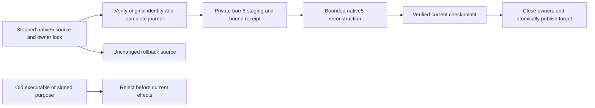

# ADR-077: Offline native data epoch and incompatible-peer fence

Status: Accepted implementation contract 2026-10-03 for KL-043 under the owner's
full acceptance instruction. Source and runtime qualification pending. Owner:
KeyLoad integration lead. Related REQ-STORAGE-007/021..024, AC-STORAGE-007 and
AC-EPOCH-001..006; EventStreams AC-EVENT-008/010, TimeSeries AC-SERIES-013/016.

## Problem and supported formats

The exact previous executable at
`7784b6b46b98ce994dd98070dc1f58fe4e506b91` uses native identity5, WAL magic4,
checkpoint3 and native replica metadata/payload2. The old identity validator
requires5. Aggregate snapshots and retention floors change interpretation of
ordinary model keys: an unaware executable must not reopen their store, install
their image, or accept their signed peer work.

Its immutable source tree is `b03bf1301a03b3fe00f419c3c7bf5285a34b63f9`.
The owner-authorized removal of obsolete Git history changed commit ancestry;
this reachable commit has exactly the same complete source tree as the original
`2532f781fec8f2546a033c396a7dbce0e9b4b781`. The probe exporter verifies that
tree before building. Historical development receipts keep their actual original
commit, archive and binary hashes; they are not relabeled as a new execution.

TASK-EPOCH-PROBE-BIND corrects the overlaid probe's reported source revision to
the exact reachable archived revision above. CI recovery requires successful
probe preparation and retains the original probe receipt and binaries alongside
the recovery reports. A matching tree alone cannot make two different execution
receipts interchangeable; driver and executable file hashes remain verified.

ADR-057's identity4/WAL3/checkpoint2 matrix records its qualified historical
generation; it does not describe the current identity5/WAL4/checkpoint3 source.
This ADR adjudicates that difference without changing historical receipts.

|Source|Target|Supported behavior|
|---|---|---|
|New empty directory|Identity6, WAL4, checkpoint4|Current executable creates and owns the store|
|Verified stopped native identity5, WAL4, optional checkpoint3|Separate identity6 directory, WAL4/checkpoint4|Explicit offline copy upgrade; original remains byte-for-byte unchanged|
|Identity6, WAL4/checkpoint4|Same|Ordinary reopen, compaction, snapshot install and backup/restore|
|Identity5 in ordinary current open|None|FormatUnsupported before journal/tree access; invoke the explicit upgrade|
|Identity1..4, JSON identities, legacy WAL1..3, unknown identity/image|None|Fail closed; matching old binary and separate future conversion contract required|
|Identity6 or checkpoint4 opened by exact identity5 binary|None|Old executable refuses before materialized/authoritative mutation|
|Mixed binary epochs in live RF3|Unsupported|No rolling-write, cross-version availability or all-voter negotiation claim; stale signed traffic fails closed|

## Frozen storage implementation

Identity6 is the store data epoch. WAL4's byte encoding and generated mutation
contracts remain unchanged. Current checkpoint header/data/footer magic and
metadata Version advance together to4. Permanent aliases and field IDs do not
change. A checkpoint4 is therefore rejected by the prior checkpoint3 reader even
when copied independently of a store identity. Backup manifest2 already carries
and authenticates the complete native identity; a6 backup is rejected by the old
identity reader.

The public feature adapter is `ZoneTreeFormatUpgrade.Upgrade(string source,
ZoneTreeStoreOptions destinationOptions)`, returning the new StoreIdentity. Source and destination are
distinct normalized directories; neither may contain the other. Source must
exist, destination must not contain user data, and links/ambiguous staged paths
fail closed. Hold the source's existing canonical owner lock through validation,
copy, target verification and publication. Validate native identity5 checksum,
scope and complete WAL4/checkpoint3 before opening any tree. Do not use ordinary
current open as a compatibility reader, alter the original tree, truncate its
torn tail, or convert typed model values. An incomplete source journal is rejected
for this offline conversion; recover it first with its matching executable.

Failure codes are part of the upgrade contract. Native checksum, frame, footer,
ordering, incomplete or torn-source failures return `Corruption`. An unsupported
source epoch, unknown or missing required artifact, link, or unknown/mismatched
staging receipt returns `FormatUnsupported`. A supplied node authority that does
not match the source returns `TokenInvalidated`. An unrelated nonempty target
returns `Conflict`. An already-owned source keeps the native exclusive-lock
failure; never bypass that owner. Every failure preserves the source and any
unrecognized staging/target, and publishes no new target.

Only this explicit offline adapter may invoke the shared bounded parser with the
closed native5 checkpoint descriptor. Ordinary recovery, snapshot verification,
replication and restore accept only current6/checkpoint4. No JSON reader, guessed
format, runtime fallback, duplicate serializer or indefinitely dual write is
introduced. The native5 descriptor is required migration functionality with this
exact accepted source/target, rather than retained replaced product behavior.

The source descriptor is native identity5, WAL4, checkpoint header/data/footer3
and metadata Version3. The target uses identity6 and checkpoint header/data/footer4,
Version4. Current ordinary identity/journal validation requires6. Retire the
misleading `BinaryJournalIdentityVersion` name in favor of `CurrentDataEpoch`;
the migration-only descriptor names `SourceDataEpoch = 5`. The bounded receipt
file `format-upgrade.bin` uses native alias `keyload.zonetree.upgrade.receipt.v1`
with permanent IDs:0 FormatVersion1,1 normalized SourceDirectory,2 normalized
DestinationDirectory,3 original identity SHA256,4 original journal SHA256,
5 SourceNodeId,6 SourceIncarnation,7 SourceDataEpoch5,8 TargetDataEpoch6. Wrap it
in the existing checksummed native metadata envelope with its own named magic
`0x315055444C4B`. Staging is `destination + ".upgrade"`; reject mismatched or
unrecognized contents and links. Signing keys never enter a receipt or logs.
Check every path ancestor for links, including parents of an absent target or
staging directory, before opening owners or modifying files.
Destination options supply the existing native limits/fault observer; supplied
authority must match the source rather than silently rebinding it. Append fault
stages `UpgradeSourceVerified`, `UpgradePrepared`, `UpgradeRecovered`,
`UpgradeCheckpointFlushed`, `UpgradePublished` in that order after existing enums.

Build under a private destination staging directory. Its bounded checksummed
native receipt binds the normalized source/target, original identity digest,
original journal digest, node/incarnation and exact source/target epochs. Copies
are flushed before reconstruction. Reconstruct derived ZoneTree from the copied
verified journal using the existing bounded codecs, ordered recovery and native
WAL, then compact to a complete current checkpoint4. Preserve exact raw keys and
values, store position, replicated applied cut, node/incarnation/signing key,
dispatch pause and read generation. Only the data epoch changes. Close all owned
handles, reopen/verify the current target and its complete cut, recheck the source
digests, then atomically publish the staging directory. Never expose it to public
requests, consensus or background work before publication.

A recognized unpublished staging directory may be discarded and reconstructed
only while holding the source owner lock and after its receipt matches the same
unchanged source/target. Unknown or mismatched contents fail closed. A matching
already-published target makes upgrade retry idempotent and must not reset target
writes. Its authority, codec, durability and current epoch must still match,
and its validated journal cut and read generation cannot precede the original
source. Legitimate current writes or maintenance may advance the cut/generation
or change dispatch pause; retry preserves those changes without ordinary recovery,
truncation or rewriting. Initial publication still preserves the exact source
cut, generation and pause. Original source remains the pre-upgrade rollback authority. Process death
at source validation, prepared copy, reconstruction, current-checkpoint flush or
publication leaves the source intact and the target absent or fully current.
Append named fault stages without renumbering existing CommitStage values.

## Peer and rollout contract

Before deploying, stop every old RF3 writer/voter and verify complete native
backups. Upgrade every physical canonical/replica/bootstrap store using the
explicit copy adapter; put verified destinations in their configured locations,
deploy identical current binaries, and only then expose the RF3 API. Activation
movement never transfers storage handles. This is a homogeneous offline rollout,
not an online migration or a new physical placement scheme.

Change the five live signature purpose families to data-epoch6: native replica
request/reply/discovery MACs, the bodyless discovery GET MAC, and native Grain
request tokens. Preserve native aliases/IDs, transport Version2, persisted replica
metadata2, token framing KLT2 and operation identities. Old and current purposes
must not verify each other. Validation precedes nonce admission, payload dispatch,
vote/append/snapshot effects and request-grain routing. Remove declaration-only
superseded purpose constants. Valid current peers keep the existing bounded
transport, cancellation, replay protection, RF3 quorum and ordered apply rules.

Purpose separation treats an old peer as unreachable. Two compatible current
voters can retain their normal majority behavior; it does not prove every voter
has upgraded or supply cross-version rolling availability. Operator violation of
the stopped homogeneous rollout is outside the supported matrix and must never
be advertised as negotiated compatibility. Independent old/current-process
tests must document the actual refusal boundaries.

Before target writes, rollback uses the unchanged verified original. After any
target write, use a compatible current executable; restoring the original is an
explicit data-loss decision. Never downgrade epoch6, rewrite it to5 on compaction,
or install a checkpoint3 into a current store through the ordinary runtime API.

## Ordered ownership and integration

1. Root freezes this ADR, feature acceptance, task graph and current format
   inventory. Root owns the Server offline command, central configuration, workflow setup, status and
   shared peer-purpose joins.
2. TASK-EPOCH-STORE: Luna storage worker owns only the ZoneTree project's
   StorageRecovery/BackupRestore source required for strict6, checkpoint4 and the
   offline copy adapter, including its cohesive receipt/lifetime helpers. Existing
   gate/lock/flush/checksum/limit/cleanup contracts are mandatory.
3. TASK-EPOCH-UNIT: separate Luna worker owns new prefixed real-ZoneTree tests under
   UnitTests/StorageRecovery and stale signed-message tests under
   UnitTests/ClusterRouting and ClusterReplication. Root updates existing format
   fixtures/goldens. No worker edits contracts or another worker's source.
4. TASK-EPOCH-RECOVERY: separate Luna worker owns new prefixed CrashHost and
   RecoveryTests/StorageRecovery files for the five real process cuts, exact
   original-byte preservation, idempotent resumed conversion and ordinary6 reopen.
   Root joins CrashHost dispatch and the exact prior-executable probe.
5. Root builds the actual immutable previous source in an isolated owned export,
   producing a separate prior-binary probe; no simulation of its validator and no
   local package/workaround delivery. Exercise old and current processes against
   identical store/image bytes. Root reviews every diff and joins the Server offline command and its docs.
6. Run build/formatter/governance, native TUnit normal/scalar, real process upgrade
   recovery and genuine homogeneous Docker/Aspire RF3 SDK/official MCP snapshot,
   retention, replay, restart and restore gates through unified Aspire. Retain
   exact-source Linux CI and original artifacts before claiming acceptance.

All workers remain source-only until root's integrated validation. Every type,
method and nesting limit remains enforced. Failure is not bypassed by a skip,
broadened accepted version, weak assertion, increased bound or swallowed cleanup.
Power-loss, endurance and performance improvements require independent evidence.

## Real executable oracle and ordinary reopen

The actual previous immutable provider is compiled with its preexisting
CrashHost friend access. Its snapshot probe invokes the unchanged native
checkpoint reader before any store opens; checkpoint4 refusal therefore compares
the entire source and target byte inventory without replay effects. Ordinary
successful ZoneTree opens may replay into native metadata/WAL files. Those
positive reopen controls assert exact authority files, identity, committed cut,
applied cut and raw records rather than immutable materialized-tree bytes. All
upgrade, unsupported-open, snapshot-reader refusal and read-only published-target
retry comparisons retain the complete byte inventory. No previous provider or
serializer source is patched to produce the oracle.

The [bound local integration receipt](../implementation/native-async-search-development-2026-10-03.json)
rebuilds the actual reachable7784b6b source/tree with exactly the two declared
CrashHost driver overlays. All75 executable files and both driver source hashes
remain verified after the complete Aspire recovery suite:228/228 pass, including
all14 epoch cases, with1000 unique seeded atomic process-crash receipts retained.
Historical2532-bound artifacts are preserved separately without relabeling.
Exact delivered-source Linux originals and a genuine homogeneous Docker/Aspire
RF3 cold-upgrade fixture remain required; ordinary current-format RF3 startup
does not qualify the previous-to-current cold-upgrade contract.
