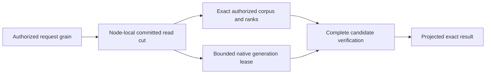

# ADR-078: Bounded native full-text candidate generations

Status: Accepted implementation contract 2026-10-03 under the owner's complete
104-task instruction. Source implemented and locally verified; exact-source Linux
and Docker RF3 qualification pending. Owner: integration lead.
Related KL-029/039/097, REQ-ZT-003, REQ-FTS-001..006 / AC-FTS-001..006 in
[NativeFullTextProjection](../Features/Search/NativeFullTextProjection.md).

## Native provider and authority

Pin the actual MIT ZoneTree.FullTextSearch1.0.9 package, release source
`c0993e2c65186708f3b087741082545bf49224fd`, package SHA256
`7ea1fbb7aba0ad00391d78d2f414166b500335f5b1affe43c305d861b55719ff`.
ZoneTree remains centrally pinned1.9.8. Use its real public
`IndexOfTokenRecordPreviousToken<ulong,ulong>` and primary native ZoneTree iterator;
do not copy its implementation or use its unbounded/partial-cancellation search.
Canonical records, policy, exact BM25 statistics/ranks, vector/RRF accumulation,
selected payload projection, synchronous WAL and RF3 remain unchanged.

This first provider generation is a correctness integration: canonical authorized
corpus visitation remains the exact scoring and completeness oracle. Native
postings contribute bounded candidate verification. No acceleration follows from
this wiring. Removing the canonical pass, global ranking, CDC incremental replay,
managed ANN, async rebuild barriers and performance claims need their own accepted
contracts and evidence; this stage does not close those distinct acceptance gates.

## Closed generation contract

One physical PartitionHost owns one disposable native projection manager under
`<node-directory>/search-indexes`. Query code borrows a gate-scoped lease and never
owns native storage handles. One manager admits one lease/build at a time with
nonblocking admission; saturation returns `BudgetExceeded`, never holds an
unbounded queue while the canonical read gate is held. One complete current and
one unpublished generation may coexist. Retire the old generation after the new
verified generation becomes current. Never move storage into an Orleans grain.

The generation scope binds source physical NodeId, Incarnation, data epoch,
ReadGeneration, committed Position, logical PartitionRef, collection, exact JSON
field, principal ID, policy epoch, schema version, tokenizer and hash versions.
Capture it within `WithQueryView`, after persisted capability/row/field-use checks.
Every canonical write, authority/schema change, snapshot installation or source
cut change invalidates reuse. No grant, role, scope or trusted source cut comes
from an external client. An empty/missing field still participates in the exact
visible corpus statistics; hidden/deleted rows never enter the generation.

Tokenization remains one canonical NFKC, Rune letter/digit, invariant-lowercase,
short-token/repeated-token and bounded algorithm. Query enumerates each token once
through SearchTerms and supplies that very token to the native lease. Hash bytes
are SHA256 of UTF8 normalized token, first8 bytes interpreted little-endian,
`sha256-le64-v1`. Collisions may add candidates; exact canonical counts remove
false positives. A collision must never remove a canonical positive. Native
record IDs are nonzero monotone ordinal UInt64 values in canonical visitation
order, with bounded identity/revision metadata and no retained document JSON.

The Query-owned internal cross-assembly contract is `ITextProjection.Acquire(scope,
budget)` -> IDisposable `ITextProjectionLease`. It observes each canonical record
with `BeginRecord(reference,revision)`, each enumerated token with `ObserveToken`,
and validates the completed exact positive set with `VerifyCandidates(terms,
references,budget)`. Cached generations verify the complete canonical identity /
revision visitation and full native token union; any unmapped record, missing
canonical positive, source-scope mismatch or malformed generation fails closed.
Known hash-collision false positives remain internal and never alter rank/output.
Neither Limit nor provider paging can truncate branch ranks before RRF.

Use the actual native primary iterator with `NoRefresh`, no block-cache
contribution, per-token lower-bound seeks, and a checked unique record-ID union.
Charge each examined posting's key/value bytes to the same ReadExecutionBudget;
check cancellation/deadline before iterator advances and allocations. Corpus
records and tokens obey existing MaxScanRecords/MaxSearchTextTokens. Bound unique
candidates by MaxScanRecords, retained metadata bytes by MaxQueryReadBytes, native
generation files to512, directories to32, relative depth to8, combined entries
and owner-ledger paths to544, and actual temporary/current disk bytes to256MiB each.
Reject excess with BudgetExceeded; no partial results or increased hidden limit.
Use small native mutable segments and synchronous native WAL, and disable unused
secondary indexes / inactive-cache maintenance. Disable the optional mutable
Bloom filter for the FTS composite key: this pinned integration does not supply
a compatible composite KeyHasher and must use the provider's supported zero-bit
setting rather than rely on an implicit default. This is not an acceleration
claim. Native errors cannot become a
successful empty result. Cancellation retains canonical position and releases
the lease/handles; a subsequent healthy call can rebuild.

Generation directories have fresh UUID leaf names and private permissions. A
checksummed generated-Orleans owner receipt is flushed before native writes;
only recognized own receipts may be removed after failure/restart. The completed
layout is `.native-text.root.bin` at the private manager root and
`generation-<GuidN>/owner.bin`, `manifest.bin`, and `native/` for actual native
FTS files. The root receipt binds normalized root and source NodeId; each leaf
receipt binds that root, leaf name, node and scope. Owner receipt Id5 is a bounded,
ordered `NativeTextOwnedPath[]` ledger. Each generated
`keyload.server.native-text.owned-path.v1` record fixes Id0 normalized generation-
relative path and Id1 directory flag. A per-generation wrapper over the actual
ZoneTree `IFileStreamProvider` durably publishes path/type intent before native
create or replacement, uses exclusive creation for new paths and verifies every
existing native path against the ledger. Its `DurableFileWriter` uses that same
wrapper; it does not delegate around ownership checks. Preserve the native
optional backup contract of `IFileStreamProvider.Replace`: a null backup is
passed through without resolving or creating a path; a supplied backup must
pass the same closed path/type/intent checks as its destination. Real native
cached reopening and regular-file replacement regressions cover both forms.
Link or untracked entries,
even plausible native filenames, never become owned through directory scanning.
Complete current files remain
recognized after disposal so restart can validate owners and manifests before
discard/rebuild; malformed manifests fail closed and stay preserved.
The completed
manifest binds the exact scope and ordered identity/revision metadata, format1,
tokenizer/hash versions and completed native source cut. Its generated contracts
use stable aliases/IDs and an SHA256 payload checksum; no internal JSON fallback.
Manifest Id5 adds a bounded ordered native-file inventory. Each generated
`keyload.server.native-text.file.v1` record fixes Id0 normalized relative path,
Id1 byte length and Id2 SHA256. Capture actual native files after synchronous
flush and handle settlement before complete publication; no static guessed
native filename allowlist is used. Restart validates the exact bounded regular
path/length/digest inventory before cleanup. Reopening a completed generation
must preserve or atomically refresh its recognized inventory at settlement.
An owner receipt alone cannot authorize arbitrary recursive deletion. A completed
generation requires both an exact tracked layout and a verified closed inventory.
An unpublished generation without a complete manifest may be discarded only
after every present native entry matches its durable path/type ledger; absent
declared paths are permitted because intent precedes creation. Malformed or
ambiguous owner publication, untracked entries and invalid manifests stay
preserved and fail closed. Preflight all restart leaves before deleting any of
them, and reject a third generation before creation. The process-cut/rebuild
gate must prove settlement of recognized interrupted generations before
AC-FTS-004 can close.
Unpublished, unsupported, malformed or mismatched generations never serve.
Source/journal/credentials/signing keys are never copied or logged. Restart
discards recognized disposable generations and rebuilds from committed canonical
data; do not mistake that reconstruction for incremental CDC replay. Unknown
directories/links fail closed and are preserved; cleanup never reaches canonical
or replica stores. Disposal preserves primary and cleanup failures.
The manager retains one active or unsettled generation until its actual release
finishes. A failed settlement rejects subsequent admission and retains the handle
for shutdown; an unpublished handle must not disappear from ownership merely
because Dispose throws. Shutdown observes both the current and retained generation
once when they are the same object, preserving every terminal failure. Record a
cancellation or deadline failure before unbudgeted, bounded inventory settlement;
if that settlement also fails, retain both exception identities.

Process recovery compares the complete logical key/value authority in one gated
native scan, using a length-framed SHA256 and record count with maximum4096 records
and1MiB examined bytes. The receipt retains only this count/digest, alongside exact
selected raw document/policy bytes, credential digest and immutable top-level
journal/identity checks. Compare the complete logical digest before and after
derived-index reconstruction. Native canonical tree files may legitimately change
through reopen and maintenance; their physical byte identity is not the logical
authority oracle, and no claim of immutable native file layout follows.

## Delivery and integration

1. Root freezes scope/protocol/interfaces, dependency pins, feature/ADR/task graph.
2. TASK-FTS-QUERY: Luna owns SearchEngine/TextRanker joins only. Acquire and dispose
   inside the same authorized cut; observe the already enumerated tokens and
   verify all exact candidates. Default direct construction remains the explicit
   exact oracle; deployed RF3 SearchEngine always receives the native manager.
3. TASK-FTS-NATIVE: Luna owns new Server/Features/Search NativeText* files only,
   actual native generation, bounded metadata/postings, receipts, lifetime,
   cancellation and cleanup. Root owns PartitionHost / DI / csproj joins.
4. TASK-FTS-TEST: Luna owns new UnitTests/Features/Search NativeText* real-store
   tests and no source. Unicode/digits/empty/repeated terms, deliberate native
   hash collisions, exact scores/ties, writes/deletes/policy changes, restart,
   malformed metadata, saturation/cancel/bounds and healthy next request.
5. Root reviews every diff, runs integrated build/formatter/governance and native
   TUnit via Aspire. Add process-cut and genuine Docker RF3 .NET/official MCP
   restart/failover parity evidence. Native Linux package-signature verification
   and source/package provenance remain delivery gates.
6. TASK-FTS-RECOVERY: Luna owns new CrashHost/RecoveryTests Features/Search
   `NativeText*` files only. Root owns CrashHost dispatch, project references and
   `Server/Features/Search/NativeTextFaultProtocol.cs`. The manager's optional
   internal `Action<NativeTextFaultStage>` observer follows the optional token
   hash argument and has no externally configurable effect. Five actual cuts
   are OwnerFlushed, first NativePostingWritten, NativeInventoryFlushed after
   native close and durable inventory, ManifestPublished after atomic rename,
   and GenerationActivated before obsolete cleanup. First build and replacement
   build process kills must preserve canonical authority/cut/raw records and
   permit recognized ledger-based restart cleanup, native rebuild and exact
   healthy search. Unknown/link/malformed ownership still fails closed without
   deletion. Recovery trials run only as real TUnit processes under Aspire;
   helper seeding/querying is test infrastructure, never an in-memory server.
7. TASK-FTS-RF3: Luna owns new IntegrationTests/Features/Search `NativeTextRf3*`
   cases and helpers only, using the actual Aspire Docker ClusterFixture,
   KeyLoadClient and official MCP client. Independent expected branch ranks for
   three persisted documents/vectors establish exact text and hybrid RRF scores,
   Unicode normalization, updates/deletes and no premature Limit. Persisted row
   and field-use denial, projected sensitive output and principal revocation
   must agree across clients. Real inspected leader container loss and restart
   preserve updated results through surviving clients and healthy following
   operations. Separate read cuts are not falsely equated. Reuse existing bounded
   fixture/client/leader-discovery infrastructure without weakening deadlines or
   adding a standalone Docker entry. This source is not RF3 evidence until run.
8. TASK-FTS-LIFETIME-REPAIR and TASK-FTS-SETTLEMENT-TEST use disjoint lifecycle
   source and real native test ownership. Preserve failed-release ownership and
   cancellation/settlement exception identities; root runs their actual Aspire
   regression. TASK-FTS-CANONICAL-ORACLE extends only the real-process receipt and
   assertions with the complete bounded canonical-state digest defined above.

Join conditions: source files obey400/type200/method50/depth3; no worker runs
runtime checks or edits another scope. Root owns checks and milestone commits.
Retain exact-SHA Linux/original test artifacts before accepting this stage.
Rollback drops only recognized derived generations and deploys a compatible
epoch6 binary using the exact oracle; canonical native records do not migrate.
No production readiness, power-loss guarantee or performance winner is claimed.

## Development evidence

[Original local receipt](../implementation/native-full-text-development-2026-10-03.json)
records the full Release build and formatter, actual Aspire native unit26/26 and
process-recovery10/10 results, source/binary/report hashes, and the real package
signature check. These bounded filtered development suites do not qualify the
complete Linux/RF3 release gates or close KL-029/039/097.
