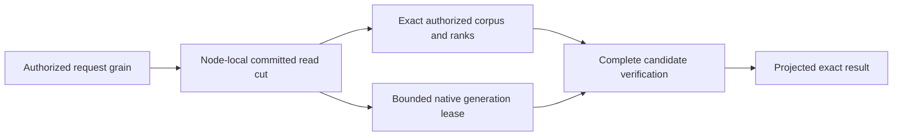

# ADR-078: Bounded native full-text candidate generations

Status: Accepted implementation contract 2026-10-03 under the owner's complete
104-task instruction. Source implemented and locally verified; exact-source Linux
and Docker RF3 qualification pending. Owner: integration lead.
Related KL-029/039/097, REQ-ZT-003, REQ-FTS-001..006 / AC-FTS-001..006 in
[NativeFullTextProjection](../Features/Search/NativeFullTextProjection.md).

## Native provider and authority

Pin the actual MIT ZoneTree.FullTextSearch1.0.9 package, release source
`c0993e2c65186708f3b087741082545bf49224fd`, package SHA256
`7ea1fbb7aba0ad00391d78d2f414166b500335f5b1affe43c305d861b55719ff`.
ZoneTree remains centrally pinned1.9.8. Use its real public
`IndexOfTokenRecordPreviousToken<ulong,ulong>` and primary native ZoneTree iterator;
do not copy its implementation or use its unbounded/partial-cancellation search.
Canonical records, policy, exact BM25 statistics/ranks, vector/RRF accumulation,
selected payload projection, synchronous WAL and RF3 remain unchanged.

This first provider generation is a correctness integration: canonical authorized
corpus visitation remains the exact scoring and completeness oracle. Native
postings contribute bounded candidate verification. No acceleration follows from
this wiring. Removing the canonical pass, global ranking, CDC incremental replay,
managed ANN, async rebuild barriers and performance claims need their own accepted
contracts and evidence; this stage does not close those distinct acceptance gates.

## Closed generation contract

One physical PartitionHost owns one disposable native projection manager under
`<node-directory>/search-indexes`. Query code borrows a gate-scoped lease and never
owns native storage handles. One manager admits one lease/build at a time with
nonblocking admission; saturation returns `BudgetExceeded`, never holds an
unbounded queue while the canonical read gate is held. One complete current and
one unpublished generation may coexist. Retire the old generation after the new
verified generation becomes current. Never move storage into an Orleans grain.

The generation scope binds source physical NodeId, Incarnation, current storage identity,
ReadGeneration, committed Position, logical PartitionRef, collection, exact JSON
field, principal ID, policy epoch, schema version, tokenizer and hash versions.
Capture it within `WithQueryView`, after persisted capability/row/field-use checks.
Every canonical write, authority/schema change, snapshot installation or source
cut change invalidates reuse. No grant, role, scope or trusted source cut comes
from an external client. An empty/missing field still participates in the exact
visible corpus statistics; hidden/deleted rows never enter the generation.

Tokenization remains one canonical NFKC, Rune letter/digit, invariant-lowercase,
short-token/repeated-token and bounded algorithm. Query enumerates each token once
through SearchTerms and supplies that very token to the native lease. Hash bytes
are SHA256 of UTF8 normalized token, first8 bytes interpreted little-endian,
`sha256-le64-v1`. Collisions may add candidates; exact canonical counts remove
false positives. A collision must never remove a canonical positive. Native
record IDs are nonzero monotone ordinal UInt64 values in canonical visitation
order, with bounded identity/revision metadata and no retained document JSON.

The Query-owned internal cross-assembly contract is `ITextProjection.Acquire(scope,
budget)` -> IDisposable `ITextProjectionLease`. It observes each canonical record
with `BeginRecord(reference,revision)`, each enumerated token with `ObserveToken`,
and validates the completed exact positive set with `VerifyCandidates(terms,
references,budget)`. Cached generations verify the complete canonical identity /
revision visitation and full native token union; any unmapped record, missing
canonical positive, source-scope mismatch or malformed generation fails closed.
Known hash-collision false positives remain internal and never alter rank/output.
Neither Limit nor provider paging can truncate branch ranks before RRF.

Use the actual native primary iterator with `NoRefresh`, no block-cache
contribution, per-token lower-bound seeks, and a checked unique record-ID union.
Charge each examined posting's key/value bytes to the same ReadExecutionBudget;
check cancellation/deadline before iterator advances and allocations. Corpus
records and tokens obey existing MaxScanRecords/MaxSearchTextTokens. Bound unique
candidates by MaxScanRecords, retained metadata bytes by MaxQueryReadBytes, native
generation files to512, directories to32, relative depth to8, combined entries
and owner-ledger paths to544, and actual temporary/current disk bytes to256MiB each.
Reject excess with BudgetExceeded; no partial results or increased hidden limit.
Use small native mutable segments and synchronous native WAL, and disable unused
secondary indexes / inactive-cache maintenance. Disable the optional mutable
Bloom filter for the FTS composite key: this pinned integration does not supply
a compatible composite KeyHasher and must use the provider's supported zero-bit
setting rather than rely on an implicit default. This is not an acceleration
claim. Native errors cannot become a
successful empty result. Cancellation retains canonical position and releases
the lease/handles; a subsequent healthy call can rebuild.

Generation directories have fresh UUID leaf names and private permissions. A
checksummed generated-Orleans owner receipt is flushed before native writes;
only recognized own receipts may be removed after failure/restart. The completed
layout is `.native-text.root.bin` at the private manager root and
`generation-<GuidN>/owner.bin`, `manifest.bin`, and `native/` for actual native
FTS files. The root receipt binds normalized root and source NodeId; each leaf
receipt binds that root, leaf name, node and scope. Owner receipt Id5 is a bounded,
ordered `NativeTextOwnedPath[]` ledger. Each generated
`keyload.server.native-text.owned-path.v1` record fixes Id0 normalized generation-
relative path and Id1 directory flag. A per-generation wrapper over the actual
ZoneTree `IFileStreamProvider` durably publishes path/type intent before native
create or replacement, uses exclusive creation for new paths and verifies every
existing native path against the ledger. Its `DurableFileWriter` uses that same
wrapper; it does not delegate around ownership checks. Preserve the native
optional backup contract of `IFileStreamProvider.Replace`: a null backup is
passed through without resolving or creating a path; a supplied backup must
pass the same closed path/type/intent checks as its destination. Real native
cached reopening and regular-file replacement regressions cover both forms.
Link or untracked entries,
even plausible native filenames, never become owned through directory scanning.
Complete current files remain
recognized after disposal so restart can validate owners and manifests before
discard/rebuild; malformed manifests fail closed and stay preserved.
The completed
manifest binds the exact scope and ordered identity/revision metadata, format1,
tokenizer/hash versions and completed native source cut. Its generated contracts
use stable aliases/IDs and an SHA256 payload checksum; no internal JSON fallback.
Manifest Id5 adds a bounded ordered native-file inventory. Each generated
`keyload.server.native-text.file.v1` record fixes Id0 normalized relative path,
Id1 byte length and Id2 SHA256. Capture actual native files after synchronous
flush and handle settlement before complete publication; no static guessed
native filename allowlist is used. Restart validates the exact bounded regular
path/length/digest inventory before cleanup. Reopening a completed generation
must preserve or atomically refresh its recognized inventory at settlement.
An owner receipt alone cannot authorize arbitrary recursive deletion. A completed
generation requires both an exact tracked layout and a verified closed inventory.
An unpublished generation without a complete manifest may be discarded only
after every present native entry matches its durable path/type ledger; absent
declared paths are permitted because intent precedes creation. Malformed or
ambiguous owner publication, untracked entries and invalid manifests stay
preserved and fail closed. Preflight all restart leaves before deleting any of
them, and reject a third generation before creation. The process-cut/rebuild
gate must prove settlement of recognized interrupted generations before
AC-FTS-004 can close.
Unpublished, unsupported, malformed or mismatched generations never serve.
Source/journal/credentials/signing keys are never copied or logged. Restart
discards recognized disposable generations and rebuilds from committed canonical
data; do not mistake that reconstruction for incremental CDC replay. Unknown
directories/links fail closed and are preserved; cleanup never reaches canonical
or replica stores. Disposal preserves primary and cleanup failures.
The manager retains one active or unsettled generation until its actual release
finishes. A failed settlement rejects subsequent admission and retains the handle
for shutdown; an unpublished handle must not disappear from ownership merely
because Dispose throws. Shutdown observes both the current and retained generation
once when they are the same object, preserving every terminal failure. Record a
cancellation or deadline failure before unbudgeted, bounded inventory settlement;
if that settlement also fails, retain both exception identities.

Process recovery compares the complete logical key/value authority in one gated
native scan, using a length-framed SHA256 and record count with maximum4096 records
and1MiB examined bytes. The receipt retains only this count/digest, alongside exact
selected raw document/policy bytes, credential digest and immutable top-level
journal/identity checks. Compare the complete logical digest before and after
derived-index reconstruction. Native canonical tree files may legitimately change
through reopen and maintenance; their physical byte identity is not the logical
authority oracle, and no claim of immutable native file layout follows.

## Delivery and integration

1. Root freezes scope/protocol/interfaces, dependency pins, feature/ADR/task graph.
2. TASK-FTS-QUERY: Luna owns SearchEngine/TextRanker joins only. Acquire and dispose
   inside the same authorized cut; observe the already enumerated tokens and
   verify all exact candidates. Default direct construction remains the explicit
   exact oracle; deployed RF3 SearchEngine always receives the native manager.
3. TASK-FTS-NATIVE: Luna owns new Server/Features/Search NativeText* files only,
   actual native generation, bounded metadata/postings, receipts, lifetime,
   cancellation and cleanup. Root owns PartitionHost / DI / csproj joins.
4. TASK-FTS-TEST: Luna owns new UnitTests/Features/Search NativeText* real-store
   tests and no source. Unicode/digits/empty/repeated terms, deliberate native
   hash collisions, exact scores/ties, writes/deletes/policy changes, restart,
   malformed metadata, saturation/cancel/bounds and healthy next request.
5. Root reviews every diff, runs integrated build/formatter/governance and native
   TUnit via Aspire. Add process-cut and genuine Docker RF3 .NET/official MCP
   restart/failover parity evidence. Native Linux package-signature verification
   and source/package provenance remain delivery gates.
6. TASK-FTS-RECOVERY: Luna owns new CrashHost/RecoveryTests Features/Search
   `NativeText*` files only. Root owns CrashHost dispatch, project references and
   `Server/Features/Search/NativeTextFaultProtocol.cs`. The manager's optional
   internal `Action<NativeTextFaultStage>` observer follows the optional token
   hash argument and has no externally configurable effect. Five actual cuts
   are OwnerFlushed, first NativePostingWritten, NativeInventoryFlushed after
   native close and durable inventory, ManifestPublished after atomic rename,
   and GenerationActivated before obsolete cleanup. First build and replacement
   build process kills must preserve canonical authority/cut/raw records and
   permit recognized ledger-based restart cleanup, native rebuild and exact
   healthy search. Unknown/link/malformed ownership still fails closed without
   deletion. Recovery trials run only as real TUnit processes under Aspire;
   helper seeding/querying is test infrastructure, never an in-memory server.
7. TASK-FTS-RF3: Luna owns new IntegrationTests/Features/Search `NativeTextRf3*`
   cases and helpers only, using the actual Aspire Docker ClusterFixture,
   KeyLoadClient and official MCP client. Independent expected branch ranks for
   three persisted documents/vectors establish exact text and hybrid RRF scores,
   Unicode normalization, updates/deletes and no premature Limit. Persisted row
   and field-use denial, projected sensitive output and principal revocation
   must agree across clients. Real inspected leader container loss and restart
   preserve updated results through surviving clients and healthy following
   operations. Separate read cuts are not falsely equated. Reuse existing bounded
   fixture/client/leader-discovery infrastructure without weakening deadlines or
   adding a standalone Docker entry. This source is not RF3 evidence until run.
8. TASK-FTS-LIFETIME-REPAIR and TASK-FTS-SETTLEMENT-TEST use disjoint lifecycle
   source and real native test ownership. Preserve failed-release ownership and
   cancellation/settlement exception identities; root runs their actual Aspire
   regression. TASK-FTS-CANONICAL-ORACLE extends only the real-process receipt and
   assertions with the complete bounded canonical-state digest defined above.

Join conditions: source files obey400/type200/method64/depth3; no worker runs
runtime checks or edits another scope. Root owns checks and milestone commits.
Retain exact-SHA Linux/original test artifacts before accepting this stage.
Rollback drops only recognized derived generations and uses the current binary and the exact oracle; canonical native records do not migrate.
No production readiness, power-loss guarantee or performance winner is claimed.

## Development evidence

Original local receipt (report removed from repository)
records the full Release build and formatter, actual Aspire native unit26/26 and
process-recovery10/10 results, source/binary/report hashes, and the real package
signature check. These bounded filtered development suites do not qualify the
complete Linux/RF3 release gates or close KL-029/039/097.

## Native-text recovery dispatch correction

TASK-FTS-RECOVERY-DISPATCH implements the existing REQ/AC-FTS-003/004/005
process-cut contract. The private CrashHost protocol has exactly five arguments:
canonical source directory, receipt path, native fault stage, replacement flag,
and mode. `NativeTextCrashScenario.TryRunAsync` reads the mode from the end of
that array before the ordinary commit-stage fallback. The former forward index
missed the native mode and sent the receipt path into commit-stage parsing.

Root freezes this protocol, repairs only that index in the owning CrashHost
Search helper, reviews it, builds current Release source and runs all ten existing
first/replacement native-cut cases through Aspire recovery. Their real kill,
complete canonical digest/bytes, recognized cleanup, rebuild and healthy search
oracles remain unchanged. No package, canonical format, public operation,
migration or alternate dispatcher is introduced. Retain original failed and
passing native receipts; local execution alone does not close Linux/RF3 gates.

## TASK-KL029-INCREMENTAL-TEXT-CHECKPOINT-001 — draft implementation contract

# KL029 incremental native text prerequisite

Source-only draft, 2026-10-08. No runtime or acceptance claim. Root owns join, build, generated contracts, native Linux qualification and status.

Original KL029: index worker, checkpoint, deletes, analyzer generations, initial maintenance rebuild; removal plus replay restores expected results; a checkpoint crash cannot hide missing updates; a stale revision cannot resurrect. Existing ADR078 format1 native generations explicitly reconstruct the complete source cut. Their ten process cuts are retained and are not incremental replay evidence.

## Authority and ownership

REQ-FTS-INCREMENTAL-001 / AC-FTS-INCREMENTAL-001: canonical documents and persisted projection consumer remain authority. A PartitionHost-owned explicit native text maintenance operation is invoked through the existing separately authorized request grain. Fresh persisted cluster-administrator authority is required for every seed, page, publication, ACK, restore and release. Internal services never manufacture a principal or commit directly around the protected database capability. No background dispatcher or implicit query-time ACK.

Reuse ANN's additive ReadProjectionBatchRequest Id3 ThroughSequence and native validation as an explicit dependency; do not independently modify shared contracts. Consumer generation/resources/kinds are immutable, resources select the actual collection, kinds exactly putDocument/patchDocument/deleteDocument. Fixed upper bound is obtained from the actual same-cut canonical snapshot/head/active-consumer authority; missing retained history returns HistoryUnavailable. A released or replaced consumer cannot authorize old work.

The initial seed is a bounded complete current canonical corpus at a pinned upper sequence. Bootstrap ACKs may cover only native batches through that same captured upper after seed completeness is independently verified; they are not incremental application evidence. Subsequent pages must apply their actual chronological Before/After changes. Current source/corpus/policy/schema verification is mandatory before publication; no seed based on an unrelated read cut.

REQ-FTS-INCREMENTAL-002 / AC-FTS-INCREMENTAL-002: a distinct generated-Orleans current-format incremental generation lives in a separate owned text-projections root. No reinterpretation or fallback to ADR078 format1. Its receipt binds physical NodeId/incarnation/data epoch, atomic partition, collection, field, analyzer/hash versions, consumer/name/generation, canonical upper/dependency digest, stable native record IDs, revisions/deleted tombstones, checkpoint and actual tracked native paths/inventory. IDs are positive, unique, monotonic and never reused within generation; bounded metadata including tombstones obeys existing MaxScanRecords. No retained JSON body copy. Existing query generation/default container behavior remain unchanged until explicit query integration is joined.

## Actual native update and crash order

REQ-FTS-INCREMENTAL-003 / AC-FTS-INCREMENTAL-003: serialize one page and generation mutation under the node-local owner gate; no mutation while a borrowed query lease exists. Before the first posting change, durably persist a checksummed typed pending intent with exact consumer/generation/after/through, signed native batch token, stable references/revisions and bounded old/new hashed token triples. Derive triples with the existing canonical NFKC/Rune tokenizer and SHA256-le64-v1; charge the same budget before retained allocation. Actual native IndexOfTokenRecordPreviousToken<ulong,ulong>.DeleteRecord(token,id,previousToken) and UpsertRecord(token,id,previousToken) implement updates/deletes. Do not call DeleteRecord(id): pinned source scans the complete index without the caller budget. No repeated full rebuild for ordinary page application.

Apply exact deletions then additions, idempotently. Preserve deleted record revision tombstones; older revisions fail closed rather than overwrite. Native WAL is synchronous. Close/join native handles and capture actual inventory before durable complete generation checkpoint publication. Only then issue the canonical CommitProjectionBatchRequest with exact original command ID/token/empty effects. Retain its exact full receipt; after ACK joins, retire pending intent. Checkpoint never advances beyond durable native publication; source bytes and projection effects remain distinct.

On crash before publication, the original durable intent owns partially applied native postings; reopen and replay those exact deletions/additions, never serve the partial generation. Crash after publication/before ACK resumes only the exact original canonical ACK; fresh authorization still applies. Crash after ACK/before intent removal uses the immutable existing receipt and stable checkpoint. Mismatched intent/receipt/generation/checksum/native inventory fails closed and is preserved. No generic retry loop, fresh command ID, source-history guess, legacy format or missing-update success.

REQ-FTS-INCREMENTAL-004 / AC-FTS-INCREMENTAL-004: public search always uses fresh canonical row/field authorization and complete literal source/revision validation under one read cut. Native index contains derived hashes, never authorizes output or ranking. Preserve existing exact lexical/RRF arithmetic, token/deadline/read/grant owner and no partial result. Policy/schema/incarnation/cut mismatch cannot reuse old publication. A replaced/deleted document cannot reappear from stale native postings. Query hookup requires an explicit stable-ID lookup lease; current ordinal-only NativeTextProjectionLease cannot be silently reused.

## Verification and files

REQ-FTS-INCREMENTAL-005 / AC-FTS-INCREMENTAL-005: real native bilingual fixture seeds Ukrainian/English literal documents; actual same-ID update/delete receipts, chronological bounded pages and generation checkpoint. Real CrashHost pauses at intent flush, first native deletion, first native addition, native inventory settled, checkpoint publication, canonical ACK completed and pending retirement. Existing process ownership kills only that child, joins its stdout/stderr/exit and every native handle/store lock; reopen canonical ZoneTree and selected native FTS, resume original intent, compare complete canonical document/outbox/consumer/receipt state and literal current results. Exact same command replay never duplicates effects or advances receipt position; healthy subsequent append/update/search and final reopen remain literal. Negative stale revision, expired/released consumer, original token cancellation, budget and malformed intent preserve state; repair then healthy continuation. Process-kill only, no power-loss claim.

Source ownership: Server/Search/{Contracts,Serialization,Validation,Storage,Lifecycle,Execution} NativeTextIncremental*; Query/Search contracts/execution stable-ID lease adapter only when integrated; Orleans/ClusterRouting typed maintenance capability and existing request-grain composition; PartitionHost lifecycle/registration joins root-owned; UnitTests/Search real operation fixtures; CrashHost/RecoveryTests/Search new native incremental mode and cases; docs NativeFullTextProjection/ADR078 + required storage-fault ADR030 append. Shared ANN ChangeFeeds files are dependencies, not independently authored replacements. Type200/method64/file400, existing bounded caps/deadlines/cancellation and joined primary+cleanup policy remain mandatory.

Ordered stage: freeze source/dependency/API contract; implement owned typed generation/intent + exact native page writer; route explicit protected maintenance/checkpoint/ACK through original request capability; integrate source-verified stable-ID query lease; implement native unit and real-process whole flows; peer review; root guarded join/full build/native discovery/normal/scalar/recovery/RF3. Rollback releases exact consumer and removes only verified disposable owned generation after handles join; canonical outbox/receipts unchanged. No task closure until original criteria receive genuine bound Linux PASS.

## Pinned API evidence

NuGet package1.0.9 nuspec source c0993e2c65186708f3b087741082545bf49224fd. Official source:
https://raw.githubusercontent.com/koculu/ZoneTree.FullTextSearch/c0993e2c65186708f3b087741082545bf49224fd/src/ZoneTree.FullTextSearch/Index/IndexOfTokenRecordPreviousToken.cs
Public exact-triple deletion lines226–243; public upsert203–219; complete-index delete249–263/270–273; native background cancel/join167–180. Implementation must use actual tracked IFileStreamProvider, pinned synchronous WAL and existing joined provider lifecycle. Original current package/DLL hashes will be guarded in final manifest; no generated image identity invented.

## Explicit protected parent API amendment

`TextIndexMaintenanceRequest` is the single shared public DTO: Id0 original CommandId; Id1 exact persisted Consumer; Id2 Collection; Id3 canonical Field; Id4 positive IndexGeneration; Id5 actual Guid NodeId; Id6 immutable PhysicalShardRecord placement; Id7 explicit Build/Restore/Release mode. Build captures a bounded complete canonical seed. Restore loads the existing native generation and applies retained canonical outbox updates; it never silently rebuilds. Release fences the generation and releases only its exact canonical pin through a distinct fresh authorized child. The parent itself has no atomic CommitToken; results expose actual canonical child checkpoint receipts separately.

Shared authenticated route is `/v1/search/text/maintain`; on-demand official MCP tool is `keyload_search_text_maintain`. It is a write/effectful maintenance command, not a read DTO or WaitForIndex effect. SDK, official MCP and versioned SQL CALL decode the same DTO through the existing signed unique request parent. Each configure/read/commit/release effect is a fresh signed native child request with original bounded cancellation/frame admission; no parallel dispatcher. Catalog additions layer after ANN without changing initial discovery tools, existing read-DTO counts or selectors.

The exact-through prerequisite is immutable `/private/tmp/keyload-ann-exact-through-dependency-r2-20261008`; its genuine existing applyVectorProjection filter correction is ANN-owned. FTS consumes only putDocument, patchDocument, deleteDocument for one exact collection, with one fixed captured upper U per parent. Native canonical tombstones are included in the initial map so a later resurrection must match the previous revision/digest rather than allocate an unrelated identity.

The original per-readcut format1 native text generation remains untouched. Incremental files live under a distinct `text-projections` root and use new typed manifest/intent aliases. The existing strict native filesystem ledger, real LocalFileStreamProvider, index API and checksummed native envelope may be composed without calling restart-retiring `NativeTextFiles.InitializeRoot`. New startup validates retained complete inventory/pending intent and current ownership rather than deleting all generations. No fallback accepts the old ordinal manifest as incremental metadata.

## Original work budget and current child cancellation

REQ-FTS-INCREMENTAL-007 / AC-FTS-INCREMENTAL-007: one maintenance session retains one original ReadExecutionBudget timestamp, counters, token, grants and byte/result constraints across signed child phases. Each ordered child phase adds its actual current cancellation token through an internal disposable stage scope; Check always preserves original cancellation and deadline and also checks that additional token. Scope removal occurs only after all original stage work joins. Concurrent/nested stage admission is rejected; scope disposal restores the prior no-stage state, never a new budget or deadline. Ordinary query budgets do not allocate the optional stage owner. This is native long-operation composition, not a test hook. The same actual cancellation byte boundary must prove original during-work OCE, no partial publication/ACK, retained original intent and healthy exact immutable recovery.

### Owned publication interruption boundary

A complete checksummed `intent.bin` is required before any posting mutation. A pending manifest file is an uncommitted publication artifact, never a readable index or a format fallback. During replay of that exact persisted original intent, the owner may retire only the exact regular `incremental.pending` artifact after validating the complete intent, native root/generation ownership and unchanged authority. Its original byte bound still applies. It then reapplies the idempotent exact native posting triples, joins flush/disposal, captures the actual inventory and publishes a newly complete current-format manifest. It must not delete an invalid current manifest, normalize corrupt committed intent, or consume arbitrary names. An incomplete `intent.pending` without a complete committed intent is not admitted as replay authority. Canonical checkpoint ACK remains after complete native publication; intent retirement requires the same original canonical ACK and fresh persisted pin/authority/applied-cut verification.

### Generation enrollment and rebuild admission

This bounded first incremental stage admits exactly one durable generation leaf for each exact persisted consumer/generation identity. A complete checksummed generation enrollment binds its initial source scope, physical placement and original Build command before native index work. Build must reject an already enrolled identical consumer/generation rather than creating ambiguous same-identity leaves or silently rebuilding. A released consumer identity is not reusable under the existing canonical consumer contract: an explicit new Build uses a new canonical consumer identity and positive generation. Restore selects the one exact enrolled identity, never ordinal/latest-directory inference. Incomplete enrollment/publication cuts remain truthful rejection boundaries until their explicit fault matrix is qualified; completed-intent replay is the supported process recovery boundary.

### Exact original Build reconciliation

The same immutable original Build command and native payload digest may resume its one enrolled native generation and original persisted checkpoint intent. This is original operation reconciliation, not a second seed or a new mutation identity. A different Build identity or changed native payload on an enrolled consumer/generation is rejected. Restore uses a separately explicit native recovery request. Neither path refreshes a persisted original page token or manufactures ACK success: an expired unACKed original token is still rejected; an actually committed original receipt may be replayed only through the existing canonical exact-intent contract. Enrollment stores only the fixed SHA256 native input identity, not a duplicate user document body.

### Parent admission ceiling

`KeyLoad:TextIndexMaintenance` admits a default maximum of 32 actual replay pages and a hard maximum of 64, further reduced by the existing original CQRS total-frame allowance. It uses existing database page/result bytes, original parent execution/cancellation and native inventory/workspace ceilings. This is a new bounded feature admission policy, not an increase to any existing native timeout, corpus, result, disk or frame cap. Exhaustion rejects with the actual safe bounded failure and retained original intent/checkpoint; it never loops until green or raises the owner deadline.

Native process boundary reuse (owner-approved 2026-10-08): reuse existing feature-owned Action<NativeTextFaultStage> observation only at actual OwnerFlushed after complete native ownership/enrollment durability, first real NativePostingWritten per admitted owner after delete/upsert, NativeInventoryFlushed after native flush/disposal and bounded inventory capture, and ManifestPublished after actual atomic complete publication. No new fault framework, fake storage, per-read callback, test-specific branch, environment hook or deadline change. Existing genuine CrashHostPause/NativeTextCrashBoundary owns typed observation→parent process kill→original readers/exit/store locks. Durable original intent is required before the first actual posting; recovery replays that exact intent and original canonical ACK before retirement. These process-kill trials do not claim power-loss durability.

Parent execution contract: one fresh signed native child per Configure/read-page/local-capability/Checkpoint/release stage under the original CQRS writer token and validated parent expiry; every child reloads current persisted administrator authority. At most one admitted memory session owns an exact generation leaf. Global active-lease/retained-generation/native disk ceilings remain unchanged. Parent page ceiling is the minimum of TextIndexMaintenanceOptions.MaximumReplayPages and the original remaining CQRS frame capacity divided by the exact three per-page progress frames; reserve eight existing-parent terminal/start/recovery frames, never increase limits. An original pending intent is physically replayed/published BEFORE its exact original canonical checkpoint command is reconciled, then fresh acknowledged state settles intent. Historical bootstrap pages ACK without applying older document revisions; only after their original upper is acknowledged does incremental replay advance. Empty pages still create the actual empty native generation when no manifest exists. Terminal success requires no pending intent, completed bootstrap, exact admitted upper/checkpoint and verified actual native inventory; no fabricated parent atomic receipt or hidden write in WaitForIndex.

Release contract: the protected parent first invokes the existing immutable ReleaseProjectionConsumer child and retains its actual ProjectionConsumerInfo result, then a fresh independently signed local capability verifies the exact current released consumer/generation/definition and actual physical source authority. Only that exact tracked native generation may be retired; all registered native owners for its verified leaf must dispose before a bounded strictly validated native directory deletion. Unknown files/reparse/ownership/locks or incomplete deletion are failures with retained roots, not suppressed cleanup or permissive restart. New optional TextIndexMaintenanceResult Id8 ReleasedConsumer carries the genuine existing canonical release result; no parent atomic receipt/token is invented. Partial-file release crash recovery is explicitly unqualified; required incremental posting/publication/ACK crash trials remain distinct.

### Incremental process-cut verification stage

REQ-FTS-INC-009 / AC-FTS-INC-009: the native process case first commits the bilingual seed, original projection pin, native generation and its canonical ACK through the real replica journal/materializer. It then commits one exact revision-2 Ukrainian update and English deletion. The admitted incremental page persists its complete original intent before the actual first posting mutation; the owned child is stopped only at NativePostingWritten, NativeInventoryFlushed or ManifestPublished. Reopen uses the original complete intent, original immutable checkpoint command and actual native index; it must never seed from a replacement complete corpus to conceal incremental recovery. Every case proves complete literal revision-2 documents/tombstone, exact updated postings with no old Ukrainian/English postings, original write receipt replay, actual checkpoint ACK, healthy revision-3 append and final cold reopen. This is process-kill evidence only, not power-loss, RF3 or incremental public query-path qualification.

The exact child owns ReplicaCrashNode canonical/replica stores, a native ReplicaMaterializer and the node-local text maintenance service. Normal exit joins service, materializer, DI owner and all stores while retaining primary plus cleanup errors. The parent owns the actual child, both bounded readers, exact three native lifecycle modes and every known target-store lock through exit; failure retains the original root/evidence. Existing process admission/deadline/output caps are unchanged. No manually written AppliedBytes, alternate journal, new fault framework, timeout extension or owner-name substitution is admitted.

### KL029 process evidence bounds and exact recovery oracle

The private incremental crash stage retains one immutable original two-effect update/delete command and full native receipt, and bounds every typed evidence sidecar at 1,048,576 bytes before allocating or serializing. The fixed corpus admits at most 16 native command entries (resource/seed/consumer/initial ACK/update/recovered ACK/healthy write/healthy ACK); exceeding this closed fixture bound fails rather than truncating. A retained command resumes its original native index, never appends a second index. Existing process-run, cleanup, pipe and storage-trial limits remain unchanged.

`NativeTextIncrementalProcessRecoveryTests.AcFtsInc009DurableIncrementalReplaySurvivesRealPostingInventoryAndPublicationCuts` has three native arguments: NativePostingWritten, NativeInventoryFlushed, ManifestPublished. The owned child first acknowledges a committed initial generation and an actual canonical bilingual update/delete; the next child stops only at the selected actual incremental boundary. Recovery must settle the original durable intent and original canonical checkpoint ACK, retain stable English record 1 (revision 2 tombstone) and Ukrainian record 2 (revision 2), and expose exactly the independently literal two new-token native postings with no original English/Ukrainian postings. Full public document value and the original native receipt are checked independently. Healthy revision 3 then a separate cold child must preserve the complete canonical record digest/count, store position, applied index, all mapped records/postings, original healthy receipt and index identity. Every original child/pipe is joined, both known canonical/replica ownership files checked, and the root retained on failure. This is process-kill evidence only and does not qualify public incremental query selection, RF3, endurance, performance or power loss.

### REQ/AC-FTS-INC-011: observed source versus indexed prefix

A completed immutable original Build remains tied to its original upper U even if canonical head later advances to U′. The public result must explicitly expose nullable native Id9 `IndexedThroughSequence`: Build/Restore return the actual published manifest/checkpoint upper, Release returns null. `Source.ThroughSequence` separately reports the actual fresh authorized canonical observation; it must never be relabelled as the indexed prefix. Completion means the requested immutable bounded prefix settled, not that U′ was indexed. An exact original Build replay after an actual update/delete must preserve the old indexed upper and unchanged canonical cut; a fresh Restore must reach U′ and expose the literal updated/deleted native state. Query selection must reject an index whose indexed upper/authority does not match its required canonical cut; public incremental-query selection remains an explicit subsequent gate. No old receipt is changed or new updates silently claimed from an old index.

REQ/AC-FTS-INC-012: after a real initial native generation and canonical ACK, corrupt one byte of the actual current-format checksummed manifest. A real fresh Restore must throw exact fatal Corruption before checkpoint/native publication, preserve the complete canonical bytes/position and the damaged evidence file, and never fall back to an implicit rebuild. Restore the exact original bytes through an owned repair stage that retains primary plus repair failure; the same Restore identity then completes healthy against the original generation. The test is NativeTextIncrementalCorruptionTests.DamagedNativeManifestRejectsWithoutCanonicalEffectsThenExactRepairRestoresHealthy. Native process/RF3 gates remain separately required.

### REQ/AC-FTS-INC-013 protected parent Core boundary

MaintainTextIndex is an Orleans parent, not a Core atomic payload. The exact mapping oracle classifies it alongside existing parent-only kinds, retaining every genuine Core kind. The actual configured fixture rejects standalone CreateNativeOperation with UnsupportedCapability and exact safe detail before any canonical bytes/position change, then completes protected native maintenance. No invented atomic DTO; execution pending.

#### AC-FTS-INC-010 canonical owner root boundary correction
The maintenance service accepts the physical canonical directory and owns only its exact text-projections child. Strict generation-root validation never scans canonical node files as generation leaves. Unit, CrashHost and PartitionHost all pass the same original physical-root convention; no relaxation of root/layout verification. Actual native lifecycle execution remains required.

### REQ/AC-FTS-INC-014–016 selected maintained query generation

## Exact additive public/provider boundary
SearchRequest Id13 optional TextIndexSelectionV1(consumer,generation), JSON omitted null; no new operation/route/tool. Selection requires an actual nonempty text branch and exact same logical partition. Existing SDK/MCP/Q1 bind the same request/schema. Query calls feature-owned ISelectedTextProjection.AcquireSelected with original IKeyValueView, freshly admitted principal/resource and original budget; selected provider cannot fall back to bootstrap. Existing unselected Acquire signature/behavior unchanged. Selected lease implements same canonical token visitation/candidate verification contract, using stable manifest IDs rather than visitation ordinals. Physical index is owned by a generation reader slot with bounded readers; maintenance waits original readers before mutation/retirement, shutdown joins them. Required cut/corpus captured in the same view, never external cached authority.

Actual update/delete makes selected prefix stale: reject HistoryUnavailable/no partial/full canonical state unchanged; explicit Restore returns literal bilingual updated/deleted results. Cold reopen and same-ID replay, genuine native-work cancellation, release/publication/shutdown with a retained original reader are mandatory actual-operation tests. No native evidence yet.

### REQ/AC-FTS-INC-017 genuine selected native work observation
The feature-owned slot records readonly successful original native posting iterator advances, keyed internally by exact persisted consumer/generation. Increment once after actual NoRefresh Next succeeds, before inspecting/copying its key. No callback, payload, public endpoint or fake progress. Existing operation TimeProvider may observe this counter for genuine cancellation/diagnostic accounting. Every advance retains original budget charge and token/deadline checks; cancellation must return original token/no partial after actual native work, join lease/index owners, preserve complete canonical state/cut and permit literal healthy follow-up. Counter lifetime is the actual slot, not budget reset or authority.

Shared composite admission uses the SAME validated MaximumActiveLeases ceiling across unselected bootstrap readers and selected maintained readers. Bootstrap provider retains its existing scope/build/ranking behavior; composite acquires the partition-owned shared read admission before delegating and transfers it into the original bootstrap lease wrapper. Maintenance cannot overlap native reader physical owners, and shutdown joins both original reader kinds before files. No duplicated per-provider aggregate allowance.

Selected query process evidence uses the existing original incremental process cuts and cold recover/verify children. Native result evidence adds exact full selected Ukrainian page plus both removed-term queries; each child opens the maintained generation through the same shared admission/slot ownership and fresh original canonical query view, never rebuilds it. Recovered update is literal revision 2; healthy/cold verification is literal revision 3; deleted English and old Ukrainian terms stay empty. Original canonical/native receipt/checkpoint/inventory/cut assertions remain intact. Selected native index ownership stays in its slot; borrowers retain a non-disposable iterator-owner interface and directly join/dispose their original iterator.

Fresh-caller acceptance persists an ordinary Query/DocumentsRead principal before generation build, proves a literal selected page, then genuinely revokes that same principal with increasing policy epoch. Exact Unauthenticated/no partial, unchanged complete canonical image/cut precedes a legitimate root healthy call. Authorization rejection must precede generation lookup; a missing generation cannot turn that rejection into source-history information. No cached generation principal authorizes the caller.

Explicit release acceptance uses the original canonical ReleaseProjectionConsumer command and byte-identical same-ID receipt replay, then the original protected local maintenance Release capability. After all original selected readers settle, selected generation lookup fails exact HistoryUnavailable with no partial/canonical changes; the current unselected API remains a legitimate literal healthy control. The separate actual held-reader shutdown flow verifies native reader lease settlement before generation-owner cleanup.

### Stage XVII combined integration

The initial combined catalog and unpublished native read-kind order are frozen in docs/Features/ClientApi.md, Stage XVII composed native integration contract. Preserve all existing REQ/AC gates, default-off/opt-in admission, original operation budgets, scoped witnesses and node-owned joined lifetimes. Root-reviewed shared seams, full native compile/format and genuine normal/scalar/process/public RF3 tests remain required before acceptance. This appendix is an implementation contract, not an Implemented or runtime qualification claim.

### Selected-generation safe MCP failure parity

REQ-FTS-SELECT-014 / AC-FTS-SELECT-014: the bounded native MCP writer admits exactly ErrorCode.HistoryUnavailable paired with the fixed literal `The native text projection does not match the authorized source cut.`. Actual selected stale reads across official MCP and MCP Q1 retain the same error, null result, unchanged canonical state and explicit Restore healthy continuation. Arbitrary/private text, missing detail, or this literal paired with any other code remains the existing generic safe failure. No tool/catalog/admission/resource limits change. The unit writer operation exercises full five-field problem, null result and actual execution identity at the inclusive native byte boundary. R632 direct worker disposal and all original reader/slot/session joins are retained.

## TASK-KL029-INCREMENTAL-SEVEN-CUTS-001 — exact incremental process boundaries

Related REQ/AC-FTS-INCREMENTAL-003/005 and REQ/AC-FTS-INC-009/017 remain unchanged. The three previously authored incremental arguments are retained. Five appended diagnostic stages independently identify the durable intent, first native deletion, first native addition, validated original canonical ACK and actual intent retirement. Together with native inventory and manifest publication these cover all seven required boundaries; the original generic first-posting boundary remains an additional supporting control. Eight source-authored arguments are not an observed native census or execution result.

| Required boundary | Actual owner event | CrashHost stage |
| --- | --- | --- |
| Intent flush | `PersistIntent` completes before the owner observer | `IncrementalIntentFlushed` |
| First deletion | First actual exact-triple `DeleteRecord` returns | `NativeDeletionWritten` |
| First addition | First actual exact-triple `UpsertRecord` returns | `NativeAdditionWritten` |
| Native inventory | Actual native handles flush/join and inventory is captured | `NativeInventoryFlushed` |
| Checkpoint publication | Complete native manifest publication finishes | `ManifestPublished` |
| Canonical ACK | Actual journal/materializer receipt passes fresh checkpoint, original intent and native inventory validation | `CanonicalCheckpointAcknowledged` |
| Intent retirement | Actual original pending `File.Delete` returns | `PendingIntentRetired` |

Existing fault-stage ordinals 0 through 4 are preserved; appended stages occupy 5 through 9 in the listed appended order. They are source diagnostics, never authority or a public operation. The optional null observer retains the normal execution path and allocates no callback. Deletion and addition observations occur once per actual owner after their own native effects; no additional effect, provider, retry or deadline is introduced.

The owning real-process trial retains its acknowledged bilingual update/delete, literal selected and removed queries, stable native IDs/revisions/tombstones/token triples, canonical record digest, actual applied/store positions and joined original child/readers/locks. A bounded private sidecar records the actual immutable checkpoint command before its existing preparation and its actual canonical result before settlement. This sidecar is test evidence, never intent authority. Recovery still uses the native persisted intent; after retirement, identical native command replay resolves its genuine retained outcome and must leave the journal index, applied position and store position unchanged. Complete receipt equality, original command/consumer/token scope and monotone receipt position are checked before healthy revision 3 and after final cold reopen. Neither a new command ID nor a synthetic receipt can fill the post-retirement result.

Implementation order and ownership: docs/ADR freeze; Server Search protocol/page preparation/native writer/owner/checkpoint settlement/session observer; CrashHost Search actual boundary selection and immutable command/receipt evidence; Recovery Search exact eight arguments and full checkpoint continuation assertions; root guarded join, complete build, genuine native census, Linux normal/scalar recovery and required RF3 qualification. Rollback removes only these additive diagnostic hooks/test evidence; canonical formats, public DTO aliases/Ids, storage providers, budgets and the original three cases remain unchanged. Existing broader negative/released-consumer/corruption and RF3 gates remain mandatory. This source checkpoint claims no runtime PASS, power-loss durability or KL029 acceptance closure.

## TASK-KL029-PERSISTED-INTENT-CORRUPTION-001

REQ/AC-FTS-INCREMENTAL-005 and AC-FTS-INCREMENTAL-003 require a genuine
malformed durable intent refusal, not just a damaged completed manifest. The
Unit Search NativeTextIncrementalIntentCorruptionTests flow configures persisted
authority/consumer, commits the original bilingual canonical seed, begins the
actual native maintenance owner and prepares a real page with its original
canonical checkpoint command. After that owner joins, damage exactly one byte
of its actual checksummed intent.bin; a new native owner with the same original
Build identity must reject Corruption with no partial result, unchanged complete
canonical bytes/position and the damaged evidence preserved. Restore only the
exact original bytes in an owning finally retaining primary+repair failures.

Healthy continuation reopens that same enrolled generation and requires its
complete original checkpoint intent bytes, applies those actual native postings,
commits and settles the original command/receipt, verifies the original prefix,
and replays the same checkpoint command without canonical cut/image change.
Complete independently literal selected Ukrainian/English pages, scores and
references are checked before and after another native-owner reopen. No fresh
ACK ID, fabricated intent/receipt, rebuild fallback, clock advance, provider
replacement or new timeout. Existing eight incremental process arguments and
ten full-generation cuts remain mandatory. This is Unit real-owner operation
evidence, not process-kill or RF3 qualification.

Stages: docs/ADR freeze; feature-local Cases and Helpers implementation; root
guarded join/full build/fresh native census; normal/scalar Linux Unit and unchanged
required recovery/RF3 gates. Root owns runtime/source/image/Git integration.
Rollback removes only this regression/docs; product formats/contracts unchanged.
Expired original unACKed token qualification remains explicit pending evidence;
released-consumer rejection does not substitute for expiry.

## TASK-KL029-ORIGINAL-PAGE-NATURAL-EXPIRY-001

REQ/AC-FTS-INCREMENTAL-005 requires original unACKed token expiry separately
from released-consumer rejection. NativeTextIncrementalExpiryTests obtains a
real canonical page, durable original PreparePage and verified native signed
ProjectionBatchClaims through DatabaseEngine.Verify with the persisted key.
Join the original maintenance owner, then await that actual signed ExpiresAt
using the unchanged actual owner TimeProvider and original TUnit cancellation.
No clock advance, lifetime override or new deadline: the existing default is
five minutes. No live maintenance session/budget is retained across the wait.

A new original-identity owner may physically replay its durable native intent;
it must never renew the token or invent an ACK. The original native checkpoint
command returns exact TokenInvalidated, null payload and the fixed expiry detail;
canonical documents/outbox/consumer checkpoint remain unchanged. Its first real
failed native command may persist its own failure outcome and advance the native
apply/store cut; that is retained evidence, not an index ACK or model effect.
Full immutable failure-result replay must leave the complete canonical image/cut
unchanged. Original intent bytes stay present; Verify cannot return partial success.

The operator then genuinely releases the original canonical consumer and native
generation under fresh persisted authority. A distinct actual canonical consumer
with the same original validated definition receives a fresh Build and original
checkpoint ACK; complete literal selected bilingual pages, full receipt replay,
and another native-owner reopen prove healthy continuation. No token re-signing,
fake expiry/receipt/provider, ignored failure, timing retry or timeout increase.
This is native Unit operation evidence; existing SDK/MCP/Q1 RF3 and all18 process
cuts plus mandatory global Linux gates remain separate and required. Root owns
guarded integration, fresh metadata/execution and source-image evidence.
