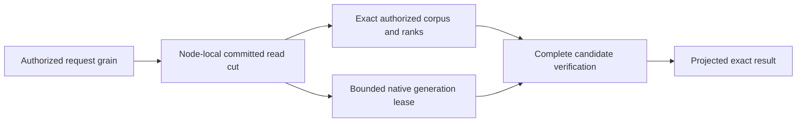

# ADR-078: Bounded native full-text candidate generations

Status: Accepted implementation contract 2026-10-03 under the owner's complete
104-task instruction. Source implemented and locally verified; exact-source Linux
and Docker RF3 qualification pending. Owner: integration lead.
Related KL-029/039/097, REQ-ZT-003, REQ-FTS-001..006 / AC-FTS-001..006 in
[NativeFullTextProjection](../Features/Search/NativeFullTextProjection.md).

## Native provider and authority

Pin the actual MIT ZoneTree.FullTextSearch1.0.9 package, release source
`c0993e2c65186708f3b087741082545bf49224fd`, package SHA256
`7ea1fbb7aba0ad00391d78d2f414166b500335f5b1affe43c305d861b55719ff`.
ZoneTree remains centrally pinned1.9.8. Use its real public
`IndexOfTokenRecordPreviousToken<ulong,ulong>` and primary native ZoneTree iterator;
do not copy its implementation or use its unbounded/partial-cancellation search.
Canonical records, policy, exact BM25 statistics/ranks, vector/RRF accumulation,
selected payload projection, synchronous WAL and RF3 remain unchanged.

This first provider generation is a correctness integration: canonical authorized
corpus visitation remains the exact scoring and completeness oracle. Native
postings contribute bounded candidate verification. No acceleration follows from
this wiring. Removing the canonical pass, global ranking, CDC incremental replay,
managed ANN, async rebuild barriers and performance claims need their own accepted
contracts and evidence; this stage does not close those distinct acceptance gates.

## Closed generation contract

One physical PartitionHost owns one disposable native projection manager under
`<node-directory>/search-indexes`. Query code borrows a gate-scoped lease and never
owns native storage handles. One manager admits one lease/build at a time with
nonblocking admission; saturation returns `BudgetExceeded`, never holds an
unbounded queue while the canonical read gate is held. One complete current and
one unpublished generation may coexist. Retire the old generation after the new
verified generation becomes current. Never move storage into an Orleans grain.

The generation scope binds source physical NodeId, Incarnation, current storage identity,
ReadGeneration, committed Position, logical PartitionRef, collection, exact JSON
field, principal ID, policy epoch, schema version, tokenizer and hash versions.
Capture it within `WithQueryView`, after persisted capability/row/field-use checks.
Every canonical write, authority/schema change, snapshot installation or source
cut change invalidates reuse. No grant, role, scope or trusted source cut comes
from an external client. An empty/missing field still participates in the exact
visible corpus statistics; hidden/deleted rows never enter the generation.

Tokenization remains one canonical NFKC, Rune letter/digit, invariant-lowercase,
short-token/repeated-token and bounded algorithm. Query enumerates each token once
through SearchTerms and supplies that very token to the native lease. Hash bytes
are SHA256 of UTF8 normalized token, first8 bytes interpreted little-endian,
`sha256-le64-v1`. Collisions may add candidates; exact canonical counts remove
false positives. A collision must never remove a canonical positive. Native
record IDs are nonzero monotone ordinal UInt64 values in canonical visitation
order, with bounded identity/revision metadata and no retained document JSON.

The Query-owned internal cross-assembly contract is `ITextProjection.Acquire(scope,
budget)` -> IDisposable `ITextProjectionLease`. It observes each canonical record
with `BeginRecord(reference,revision)`, each enumerated token with `ObserveToken`,
and validates the completed exact positive set with `VerifyCandidates(terms,
references,budget)`. Cached generations verify the complete canonical identity /
revision visitation and full native token union; any unmapped record, missing
canonical positive, source-scope mismatch or malformed generation fails closed.
Known hash-collision false positives remain internal and never alter rank/output.
Neither Limit nor provider paging can truncate branch ranks before RRF.

Use the actual native primary iterator with `NoRefresh`, no block-cache
contribution, per-token lower-bound seeks, and a checked unique record-ID union.
Charge each examined posting's key/value bytes to the same ReadExecutionBudget;
check cancellation/deadline before iterator advances and allocations. Corpus
records and tokens obey existing MaxScanRecords/MaxSearchTextTokens. Bound unique
candidates by MaxScanRecords, retained metadata bytes by MaxQueryReadBytes, native
generation files to512, directories to32, relative depth to8, combined entries
and owner-ledger paths to544, and actual temporary/current disk bytes to256MiB each.
Reject excess with BudgetExceeded; no partial results or increased hidden limit.
Use small native mutable segments and synchronous native WAL, and disable unused
secondary indexes / inactive-cache maintenance. Disable the optional mutable
Bloom filter for the FTS composite key: this pinned integration does not supply
a compatible composite KeyHasher and must use the provider's supported zero-bit
setting rather than rely on an implicit default. This is not an acceleration
claim. Native errors cannot become a
successful empty result. Cancellation retains canonical position and releases
the lease/handles; a subsequent healthy call can rebuild.

Generation directories have fresh UUID leaf names and private permissions. A
checksummed generated-Orleans owner receipt is flushed before native writes;
only recognized own receipts may be removed after failure/restart. The completed
layout is `.native-text.root.bin` at the private manager root and
`generation-<GuidN>/owner.bin`, `manifest.bin`, and `native/` for actual native
FTS files. The root receipt binds normalized root and source NodeId; each leaf
receipt binds that root, leaf name, node and scope. Owner receipt Id5 is a bounded,
ordered `NativeTextOwnedPath[]` ledger. Each generated
`keyload.server.native-text.owned-path.v1` record fixes Id0 normalized generation-
relative path and Id1 directory flag. A per-generation wrapper over the actual
ZoneTree `IFileStreamProvider` durably publishes path/type intent before native
create or replacement, uses exclusive creation for new paths and verifies every
existing native path against the ledger. Its `DurableFileWriter` uses that same
wrapper; it does not delegate around ownership checks. Preserve the native
optional backup contract of `IFileStreamProvider.Replace`: a null backup is
passed through without resolving or creating a path; a supplied backup must
pass the same closed path/type/intent checks as its destination. Real native
cached reopening and regular-file replacement regressions cover both forms.
Link or untracked entries,
even plausible native filenames, never become owned through directory scanning.
Complete current files remain
recognized after disposal so restart can validate owners and manifests before
discard/rebuild; malformed manifests fail closed and stay preserved.
The completed
manifest binds the exact scope and ordered identity/revision metadata, format1,
tokenizer/hash versions and completed native source cut. Its generated contracts
use stable aliases/IDs and an SHA256 payload checksum; no internal JSON fallback.
Manifest Id5 adds a bounded ordered native-file inventory. Each generated
`keyload.server.native-text.file.v1` record fixes Id0 normalized relative path,
Id1 byte length and Id2 SHA256. Capture actual native files after synchronous
flush and handle settlement before complete publication; no static guessed
native filename allowlist is used. Restart validates the exact bounded regular
path/length/digest inventory before cleanup. Reopening a completed generation
must preserve or atomically refresh its recognized inventory at settlement.
An owner receipt alone cannot authorize arbitrary recursive deletion. A completed
generation requires both an exact tracked layout and a verified closed inventory.
An unpublished generation without a complete manifest may be discarded only
after every present native entry matches its durable path/type ledger; absent
declared paths are permitted because intent precedes creation. Malformed or
ambiguous owner publication, untracked entries and invalid manifests stay
preserved and fail closed. Preflight all restart leaves before deleting any of
them, and reject a third generation before creation. The process-cut/rebuild
gate must prove settlement of recognized interrupted generations before
AC-FTS-004 can close.
Unpublished, unsupported, malformed or mismatched generations never serve.
Source/journal/credentials/signing keys are never copied or logged. Restart
discards recognized disposable generations and rebuilds from committed canonical
data; do not mistake that reconstruction for incremental CDC replay. Unknown
directories/links fail closed and are preserved; cleanup never reaches canonical
or replica stores. Disposal preserves primary and cleanup failures.
The manager retains one active or unsettled generation until its actual release
finishes. A failed settlement rejects subsequent admission and retains the handle
for shutdown; an unpublished handle must not disappear from ownership merely
because Dispose throws. Shutdown observes both the current and retained generation
once when they are the same object, preserving every terminal failure. Record a
cancellation or deadline failure before unbudgeted, bounded inventory settlement;
if that settlement also fails, retain both exception identities.

Process recovery compares the complete logical key/value authority in one gated
native scan, using a length-framed SHA256 and record count with maximum4096 records
and1MiB examined bytes. The receipt retains only this count/digest, alongside exact
selected raw document/policy bytes, credential digest and immutable top-level
journal/identity checks. Compare the complete logical digest before and after
derived-index reconstruction. Native canonical tree files may legitimately change
through reopen and maintenance; their physical byte identity is not the logical
authority oracle, and no claim of immutable native file layout follows.

## Delivery and integration

1. Root freezes scope/protocol/interfaces, dependency pins, feature/ADR/task graph.
2. TASK-FTS-QUERY: Luna owns SearchEngine/TextRanker joins only. Acquire and dispose
   inside the same authorized cut; observe the already enumerated tokens and
   verify all exact candidates. Default direct construction remains the explicit
   exact oracle; deployed RF3 SearchEngine always receives the native manager.
3. TASK-FTS-NATIVE: Luna owns new Server/Features/Search NativeText* files only,
   actual native generation, bounded metadata/postings, receipts, lifetime,
   cancellation and cleanup. Root owns PartitionHost / DI / csproj joins.
4. TASK-FTS-TEST: Luna owns new UnitTests/Features/Search NativeText* real-store
   tests and no source. Unicode/digits/empty/repeated terms, deliberate native
   hash collisions, exact scores/ties, writes/deletes/policy changes, restart,
   malformed metadata, saturation/cancel/bounds and healthy next request.
5. Root reviews every diff, runs integrated build/formatter/governance and native
   TUnit via Aspire. Add process-cut and genuine Docker RF3 .NET/official MCP
   restart/failover parity evidence. Native Linux package-signature verification
   and source/package provenance remain delivery gates.
6. TASK-FTS-RECOVERY: Luna owns new CrashHost/RecoveryTests Features/Search
   `NativeText*` files only. Root owns CrashHost dispatch, project references and
   `Server/Features/Search/NativeTextFaultProtocol.cs`. The manager's optional
   internal `Action<NativeTextFaultStage>` observer follows the optional token
   hash argument and has no externally configurable effect. Five actual cuts
   are OwnerFlushed, first NativePostingWritten, NativeInventoryFlushed after
   native close and durable inventory, ManifestPublished after atomic rename,
   and GenerationActivated before obsolete cleanup. First build and replacement
   build process kills must preserve canonical authority/cut/raw records and
   permit recognized ledger-based restart cleanup, native rebuild and exact
   healthy search. Unknown/link/malformed ownership still fails closed without
   deletion. Recovery trials run only as real TUnit processes under Aspire;
   helper seeding/querying is test infrastructure, never an in-memory server.
7. TASK-FTS-RF3: Luna owns new IntegrationTests/Features/Search `NativeTextRf3*`
   cases and helpers only, using the actual Aspire Docker ClusterFixture,
   KeyLoadClient and official MCP client. Independent expected branch ranks for
   three persisted documents/vectors establish exact text and hybrid RRF scores,
   Unicode normalization, updates/deletes and no premature Limit. Persisted row
   and field-use denial, projected sensitive output and principal revocation
   must agree across clients. Real inspected leader container loss and restart
   preserve updated results through surviving clients and healthy following
   operations. Separate read cuts are not falsely equated. Reuse existing bounded
   fixture/client/leader-discovery infrastructure without weakening deadlines or
   adding a standalone Docker entry. This source is not RF3 evidence until run.
8. TASK-FTS-LIFETIME-REPAIR and TASK-FTS-SETTLEMENT-TEST use disjoint lifecycle
   source and real native test ownership. Preserve failed-release ownership and
   cancellation/settlement exception identities; root runs their actual Aspire
   regression. TASK-FTS-CANONICAL-ORACLE extends only the real-process receipt and
   assertions with the complete bounded canonical-state digest defined above.

Join conditions: source files obey400/type200/method64/depth3; no worker runs
runtime checks or edits another scope. Root owns checks and milestone commits.
Retain exact-SHA Linux/original test artifacts before accepting this stage.
Rollback drops only recognized derived generations and uses the current binary and the exact oracle; canonical native records do not migrate.
No production readiness, power-loss guarantee or performance winner is claimed.

## Development evidence

Original local receipt (report removed from repository)
records the full Release build and formatter, actual Aspire native unit26/26 and
process-recovery10/10 results, source/binary/report hashes, and the real package
signature check. These bounded filtered development suites do not qualify the
complete Linux/RF3 release gates or close KL-029/039/097.

## Native-text recovery dispatch correction

TASK-FTS-RECOVERY-DISPATCH implements the existing REQ/AC-FTS-003/004/005
process-cut contract. The private CrashHost protocol has exactly five arguments:
canonical source directory, receipt path, native fault stage, replacement flag,
and mode. `NativeTextCrashScenario.TryRunAsync` reads the mode from the end of
that array before the ordinary commit-stage fallback. The former forward index
missed the native mode and sent the receipt path into commit-stage parsing.

Root freezes this protocol, repairs only that index in the owning CrashHost
Search helper, reviews it, builds current Release source and runs all ten existing
first/replacement native-cut cases through Aspire recovery. Their real kill,
complete canonical digest/bytes, recognized cleanup, rebuild and healthy search
oracles remain unchanged. No package, canonical format, public operation,
migration or alternate dispatcher is introduced. Retain original failed and
passing native receipts; local execution alone does not close Linux/RF3 gates.

## TASK-KL029-INCREMENTAL-TEXT-CHECKPOINT-001 — draft implementation contract

# KL029 incremental native text prerequisite

Source-only draft, 2026-10-08. No runtime or acceptance claim. Root owns join, build, generated contracts, native Linux qualification and status.

Original KL029: index worker, checkpoint, deletes, analyzer generations, initial maintenance rebuild; removal plus replay restores expected results; a checkpoint crash cannot hide missing updates; a stale revision cannot resurrect. Existing ADR078 format1 native generations explicitly reconstruct the complete source cut. Their ten process cuts are retained and are not incremental replay evidence.

## Authority and ownership

REQ-FTS-INCREMENTAL-001 / AC-FTS-INCREMENTAL-001: canonical documents and persisted projection consumer remain authority. A PartitionHost-owned explicit native text maintenance operation is invoked through the existing separately authorized request grain. Fresh persisted cluster-administrator authority is required for every seed, page, publication, ACK, restore and release. Internal services never manufacture a principal or commit directly around the protected database capability. No background dispatcher or implicit query-time ACK.

Reuse ANN's additive ReadProjectionBatchRequest Id3 ThroughSequence and native validation as an explicit dependency; do not independently modify shared contracts. Consumer generation/resources/kinds are immutable, resources select the actual collection, kinds exactly putDocument/patchDocument/deleteDocument. Fixed upper bound is obtained from the actual same-cut canonical snapshot/head/active-consumer authority; missing retained history returns HistoryUnavailable. A released or replaced consumer cannot authorize old work.

The initial seed is a bounded complete current canonical corpus at a pinned upper sequence. Bootstrap ACKs may cover only native batches through that same captured upper after seed completeness is independently verified; they are not incremental application evidence. Subsequent pages must apply their actual chronological Before/After changes. Current source/corpus/policy/schema verification is mandatory before publication; no seed based on an unrelated read cut.

REQ-FTS-INCREMENTAL-002 / AC-FTS-INCREMENTAL-002: a distinct generated-Orleans current-format incremental generation lives in a separate owned text-projections root. No reinterpretation or fallback to ADR078 format1. Its receipt binds physical NodeId/incarnation/data epoch, atomic partition, collection, field, analyzer/hash versions, consumer/name/generation, canonical upper/dependency digest, stable native record IDs, revisions/deleted tombstones, checkpoint and actual tracked native paths/inventory. IDs are positive, unique, monotonic and never reused within generation; bounded metadata including tombstones obeys existing MaxScanRecords. No retained JSON body copy. Existing query generation/default container behavior remain unchanged until explicit query integration is joined.

## Actual native update and crash order

REQ-FTS-INCREMENTAL-003 / AC-FTS-INCREMENTAL-003: serialize one page and generation mutation under the node-local owner gate; no mutation while a borrowed query lease exists. Before the first posting change, durably persist a checksummed typed pending intent with exact consumer/generation/after/through, signed native batch token, stable references/revisions and bounded old/new hashed token triples. Derive triples with the existing canonical NFKC/Rune tokenizer and SHA256-le64-v1; charge the same budget before retained allocation. Actual native IndexOfTokenRecordPreviousToken<ulong,ulong>.DeleteRecord(token,id,previousToken) and UpsertRecord(token,id,previousToken) implement updates/deletes. Do not call DeleteRecord(id): pinned source scans the complete index without the caller budget. No repeated full rebuild for ordinary page application.

Apply exact deletions then additions, idempotently. Preserve deleted record revision tombstones; older revisions fail closed rather than overwrite. Native WAL is synchronous. Close/join native handles and capture actual inventory before durable complete generation checkpoint publication. Only then issue the canonical CommitProjectionBatchRequest with exact original command ID/token/empty effects. Retain its exact full receipt; after ACK joins, retire pending intent. Checkpoint never advances beyond durable native publication; source bytes and projection effects remain distinct.

On crash before publication, the original durable intent owns partially applied native postings; reopen and replay those exact deletions/additions, never serve the partial generation. Crash after publication/before ACK resumes only the exact original canonical ACK; fresh authorization still applies. Crash after ACK/before intent removal uses the immutable existing receipt and stable checkpoint. Mismatched intent/receipt/generation/checksum/native inventory fails closed and is preserved. No generic retry loop, fresh command ID, source-history guess, legacy format or missing-update success.

REQ-FTS-INCREMENTAL-004 / AC-FTS-INCREMENTAL-004: public search always uses fresh canonical row/field authorization and complete literal source/revision validation under one read cut. Native index contains derived hashes, never authorizes output or ranking. Preserve existing exact lexical/RRF arithmetic, token/deadline/read/grant owner and no partial result. Policy/schema/incarnation/cut mismatch cannot reuse old publication. A replaced/deleted document cannot reappear from stale native postings. Query hookup requires an explicit stable-ID lookup lease; current ordinal-only NativeTextProjectionLease cannot be silently reused.

## Verification and files

REQ-FTS-INCREMENTAL-005 / AC-FTS-INCREMENTAL-005: real native bilingual fixture seeds Ukrainian/English literal documents; actual same-ID update/delete receipts, chronological bounded pages and generation checkpoint. Real CrashHost pauses at intent flush, first native deletion, first native addition, native inventory settled, checkpoint publication, canonical ACK completed and pending retirement. Existing process ownership kills only that child, joins its stdout/stderr/exit and every native handle/store lock; reopen canonical ZoneTree and selected native FTS, resume original intent, compare complete canonical document/outbox/consumer/receipt state and literal current results. Exact same command replay never duplicates effects or advances receipt position; healthy subsequent append/update/search and final reopen remain literal. Negative stale revision, expired/released consumer, original token cancellation, budget and malformed intent preserve state; repair then healthy continuation. Process-kill only, no power-loss claim.

Source ownership: Server/Search/{Contracts,Serialization,Validation,Storage,Lifecycle,Execution} NativeTextIncremental*; Query/Search contracts/execution stable-ID lease adapter only when integrated; Orleans/ClusterRouting typed maintenance capability and existing request-grain composition; PartitionHost lifecycle/registration joins root-owned; UnitTests/Search real operation fixtures; CrashHost/RecoveryTests/Search new native incremental mode and cases; docs NativeFullTextProjection/ADR078 + required storage-fault ADR030 append. Shared ANN ChangeFeeds files are dependencies, not independently authored replacements. Type200/method64/file400, existing bounded caps/deadlines/cancellation and joined primary+cleanup policy remain mandatory.

Ordered stage: freeze source/dependency/API contract; implement owned typed generation/intent + exact native page writer; route explicit protected maintenance/checkpoint/ACK through original request capability; integrate source-verified stable-ID query lease; implement native unit and real-process whole flows; peer review; root guarded join/full build/native discovery/normal/scalar/recovery/RF3. Rollback releases exact consumer and removes only verified disposable owned generation after handles join; canonical outbox/receipts unchanged. No task closure until original criteria receive genuine bound Linux PASS.

## Pinned API evidence

NuGet package1.0.9 nuspec source c0993e2c65186708f3b087741082545bf49224fd. Official source:
https://raw.githubusercontent.com/koculu/ZoneTree.FullTextSearch/c0993e2c65186708f3b087741082545bf49224fd/src/ZoneTree.FullTextSearch/Index/IndexOfTokenRecordPreviousToken.cs
Public exact-triple deletion lines226–243; public upsert203–219; complete-index delete249–263/270–273; native background cancel/join167–180. Implementation must use actual tracked IFileStreamProvider, pinned synchronous WAL and existing joined provider lifecycle. Original current package/DLL hashes will be guarded in final manifest; no generated image identity invented.

## Explicit protected parent API amendment

`TextIndexMaintenanceRequest` is the single shared public DTO: Id0 original CommandId; Id1 exact persisted Consumer; Id2 Collection; Id3 canonical Field; Id4 positive IndexGeneration; Id5 actual Guid NodeId; Id6 immutable PhysicalShardRecord placement; Id7 explicit Build/Restore/Release mode. Build captures a bounded complete canonical seed. Restore loads the existing native generation and applies retained canonical outbox updates; it never silently rebuilds. Release fences the generation and releases only its exact canonical pin through a distinct fresh authorized child. The parent itself has no atomic CommitToken; results expose actual canonical child checkpoint receipts separately.

Shared authenticated route is `/v1/search/text/maintain`; on-demand official MCP tool is `keyload_search_text_maintain`. It is a write/effectful maintenance command, not a read DTO or WaitForIndex effect. SDK, official MCP and versioned SQL CALL decode the same DTO through the existing signed unique request parent. Each configure/read/commit/release effect is a fresh signed native child request with original bounded cancellation/frame admission; no parallel dispatcher. Catalog additions layer after ANN without changing initial discovery tools, existing read-DTO counts or selectors.

The exact-through prerequisite is immutable `/private/tmp/keyload-ann-exact-through-dependency-r2-20261008`; its genuine existing applyVectorProjection filter correction is ANN-owned. FTS consumes only putDocument, patchDocument, deleteDocument for one exact collection, with one fixed captured upper U per parent. Native canonical tombstones are included in the initial map so a later resurrection must match the previous revision/digest rather than allocate an unrelated identity.

The original per-readcut format1 native text generation remains untouched. Incremental files live under a distinct `text-projections` root and use new typed manifest/intent aliases. The existing strict native filesystem ledger, real LocalFileStreamProvider, index API and checksummed native envelope may be composed without calling restart-retiring `NativeTextFiles.InitializeRoot`. New startup validates retained complete inventory/pending intent and current ownership rather than deleting all generations. No fallback accepts the old ordinal manifest as incremental metadata.

## Original work budget and current child cancellation

REQ-FTS-INCREMENTAL-007 / AC-FTS-INCREMENTAL-007: one maintenance session retains one original ReadExecutionBudget timestamp, counters, token, grants and byte/result constraints across signed child phases. Each ordered child phase adds its actual current cancellation token through an internal disposable stage scope; Check always preserves original cancellation and deadline and also checks that additional token. Scope removal occurs only after all original stage work joins. Concurrent/nested stage admission is rejected; scope disposal restores the prior no-stage state, never a new budget or deadline. Ordinary query budgets do not allocate the optional stage owner. This is native long-operation composition, not a test hook. The same actual cancellation byte boundary must prove original during-work OCE, no partial publication/ACK, retained original intent and healthy exact immutable recovery.

### Owned publication interruption boundary

A complete checksummed `intent.bin` is required before any posting mutation. A pending manifest file is an uncommitted publication artifact, never a readable index or a format fallback. During replay of that exact persisted original intent, the owner may retire only the exact regular `incremental.pending` artifact after validating the complete intent, native root/generation ownership and unchanged authority. Its original byte bound still applies. It then reapplies the idempotent exact native posting triples, joins flush/disposal, captures the actual inventory and publishes a newly complete current-format manifest. It must not delete an invalid current manifest, normalize corrupt committed intent, or consume arbitrary names. An incomplete `intent.pending` without a complete committed intent is not admitted as replay authority. Canonical checkpoint ACK remains after complete native publication; intent retirement requires the same original canonical ACK and fresh persisted pin/authority/applied-cut verification.

### Generation enrollment and rebuild admission

This bounded first incremental stage admits exactly one durable generation leaf for each exact persisted consumer/generation identity. A complete checksummed generation enrollment binds its initial source scope, physical placement and original Build command before native index work. Build must reject an already enrolled identical consumer/generation rather than creating ambiguous same-identity leaves or silently rebuilding. A released consumer identity is not reusable under the existing canonical consumer contract: an explicit new Build uses a new canonical consumer identity and positive generation. Restore selects the one exact enrolled identity, never ordinal/latest-directory inference. Incomplete enrollment/publication cuts remain truthful rejection boundaries until their explicit fault matrix is qualified; completed-intent replay is the supported process recovery boundary.

### Exact original Build reconciliation

The same immutable original Build command and native payload digest may resume its one enrolled native generation and original persisted checkpoint intent. This is original operation reconciliation, not a second seed or a new mutation identity. A different Build identity or changed native payload on an enrolled consumer/generation is rejected. Restore uses a separately explicit native recovery request. Neither path refreshes a persisted original page token or manufactures ACK success: an expired unACKed original token is still rejected; an actually committed original receipt may be replayed only through the existing canonical exact-intent contract. Enrollment stores only the fixed SHA256 native input identity, not a duplicate user document body.

### Parent admission ceiling

`KeyLoad:TextIndexMaintenance` admits a default maximum of 32 actual replay pages and a hard maximum of 64, further reduced by the existing original CQRS total-frame allowance. It uses existing database page/result bytes, original parent execution/cancellation and native inventory/workspace ceilings. This is a new bounded feature admission policy, not an increase to any existing native timeout, corpus, result, disk or frame cap. Exhaustion rejects with the actual safe bounded failure and retained original intent/checkpoint; it never loops until green or raises the owner deadline.

Native process boundary reuse (owner-approved 2026-10-08): reuse existing feature-owned Action<NativeTextFaultStage> observation only at actual OwnerFlushed after complete native ownership/enrollment durability, first real NativePostingWritten per admitted owner after delete/upsert, NativeInventoryFlushed after native flush/disposal and bounded inventory capture, and ManifestPublished after actual atomic complete publication. No new fault framework, fake storage, per-read callback, test-specific branch, environment hook or deadline change. Existing genuine CrashHostPause/NativeTextCrashBoundary owns typed observation→parent process kill→original readers/exit/store locks. Durable original intent is required before the first actual posting; recovery replays that exact intent and original canonical ACK before retirement. These process-kill trials do not claim power-loss durability.

Parent execution contract: one fresh signed native child per Configure/read-page/local-capability/Checkpoint/release stage under the original CQRS writer token and validated parent expiry; every child reloads current persisted administrator authority. At most one admitted memory session owns an exact generation leaf. Global active-lease/retained-generation/native disk ceilings remain unchanged. Parent page ceiling is the minimum of TextIndexMaintenanceOptions.MaximumReplayPages and the original remaining CQRS frame capacity divided by the exact three per-page progress frames; reserve eight existing-parent terminal/start/recovery frames, never increase limits. An original pending intent is physically replayed/published BEFORE its exact original canonical checkpoint command is reconciled, then fresh acknowledged state settles intent. Historical bootstrap pages ACK without applying older document revisions; only after their original upper is acknowledged does incremental replay advance. Empty pages still create the actual empty native generation when no manifest exists. Terminal success requires no pending intent, completed bootstrap, exact admitted upper/checkpoint and verified actual native inventory; no fabricated parent atomic receipt or hidden write in WaitForIndex.

Release contract: the protected parent first invokes the existing immutable ReleaseProjectionConsumer child and retains its actual ProjectionConsumerInfo result, then a fresh independently signed local capability verifies the exact current released consumer/generation/definition and actual physical source authority. Only that exact tracked native generation may be retired; all registered native owners for its verified leaf must dispose before a bounded strictly validated native directory deletion. Unknown files/reparse/ownership/locks or incomplete deletion are failures with retained roots, not suppressed cleanup or permissive restart. New optional TextIndexMaintenanceResult Id8 ReleasedConsumer carries the genuine existing canonical release result; no parent atomic receipt/token is invented. Partial-file release crash recovery is explicitly unqualified; required incremental posting/publication/ACK crash trials remain distinct.

### Incremental process-cut verification stage

REQ-FTS-INC-009 / AC-FTS-INC-009: the native process case first commits the bilingual seed, original projection pin, native generation and its canonical ACK through the real replica journal/materializer. It then commits one exact revision-2 Ukrainian update and English deletion. The admitted incremental page persists its complete original intent before the actual first posting mutation; the owned child is stopped only at NativePostingWritten, NativeInventoryFlushed or ManifestPublished. Reopen uses the original complete intent, original immutable checkpoint command and actual native index; it must never seed from a replacement complete corpus to conceal incremental recovery. Every case proves complete literal revision-2 documents/tombstone, exact updated postings with no old Ukrainian/English postings, original write receipt replay, actual checkpoint ACK, healthy revision-3 append and final cold reopen. This is process-kill evidence only, not power-loss, RF3 or incremental public query-path qualification.

The exact child owns ReplicaCrashNode canonical/replica stores, a native ReplicaMaterializer and the node-local text maintenance service. Normal exit joins service, materializer, DI owner and all stores while retaining primary plus cleanup errors. The parent owns the actual child, both bounded readers, exact three native lifecycle modes and every known target-store lock through exit; failure retains the original root/evidence. Existing process admission/deadline/output caps are unchanged. No manually written AppliedBytes, alternate journal, new fault framework, timeout extension or owner-name substitution is admitted.

### KL029 process evidence bounds and exact recovery oracle

The private incremental crash stage retains one immutable original two-effect update/delete command and full native receipt, and bounds every typed evidence sidecar at 1,048,576 bytes before allocating or serializing. The fixed corpus admits at most 16 native command entries (resource/seed/consumer/initial ACK/update/recovered ACK/healthy write/healthy ACK); exceeding this closed fixture bound fails rather than truncating. A retained command resumes its original native index, never appends a second index. Existing process-run, cleanup, pipe and storage-trial limits remain unchanged.

`NativeTextIncrementalProcessRecoveryTests.AcFtsInc009DurableIncrementalReplaySurvivesRealPostingInventoryAndPublicationCuts` has three native arguments: NativePostingWritten, NativeInventoryFlushed, ManifestPublished. The owned child first acknowledges a committed initial generation and an actual canonical bilingual update/delete; the next child stops only at the selected actual incremental boundary. Recovery must settle the original durable intent and original canonical checkpoint ACK, retain stable English record 1 (revision 2 tombstone) and Ukrainian record 2 (revision 2), and expose exactly the independently literal two new-token native postings with no original English/Ukrainian postings. Full public document value and the original native receipt are checked independently. Healthy revision 3 then a separate cold child must preserve the complete canonical record digest/count, store position, applied index, all mapped records/postings, original healthy receipt and index identity. Every original child/pipe is joined, both known canonical/replica ownership files checked, and the root retained on failure. This is process-kill evidence only and does not qualify public incremental query selection, RF3, endurance, performance or power loss.

### REQ/AC-FTS-INC-011: observed source versus indexed prefix

A completed immutable original Build remains tied to its original upper U even if canonical head later advances to U′. The public result must explicitly expose nullable native Id9 `IndexedThroughSequence`: Build/Restore return the actual published manifest/checkpoint upper, Release returns null. `Source.ThroughSequence` separately reports the actual fresh authorized canonical observation; it must never be relabelled as the indexed prefix. Completion means the requested immutable bounded prefix settled, not that U′ was indexed. An exact original Build replay after an actual update/delete must preserve the old indexed upper and unchanged canonical cut; a fresh Restore must reach U′ and expose the literal updated/deleted native state. Query selection must reject an index whose indexed upper/authority does not match its required canonical cut; public incremental-query selection remains an explicit subsequent gate. No old receipt is changed or new updates silently claimed from an old index.

REQ/AC-FTS-INC-012: after a real initial native generation and canonical ACK, corrupt one byte of the actual current-format checksummed manifest. A real fresh Restore must throw exact fatal Corruption before checkpoint/native publication, preserve the complete canonical bytes/position and the damaged evidence file, and never fall back to an implicit rebuild. Restore the exact original bytes through an owned repair stage that retains primary plus repair failure; the same Restore identity then completes healthy against the original generation. The test is NativeTextIncrementalCorruptionTests.DamagedNativeManifestRejectsWithoutCanonicalEffectsThenExactRepairRestoresHealthy. Native process/RF3 gates remain separately required.

### REQ/AC-FTS-INC-013 protected parent Core boundary

MaintainTextIndex is an Orleans parent, not a Core atomic payload. The exact mapping oracle classifies it alongside existing parent-only kinds, retaining every genuine Core kind. The actual configured fixture rejects standalone CreateNativeOperation with UnsupportedCapability and exact safe detail before any canonical bytes/position change, then completes protected native maintenance. No invented atomic DTO; execution pending.

#### AC-FTS-INC-010 canonical owner root boundary correction
The maintenance service accepts the physical canonical directory and owns only its exact text-projections child. Strict generation-root validation never scans canonical node files as generation leaves. Unit, CrashHost and PartitionHost all pass the same original physical-root convention; no relaxation of root/layout verification. Actual native lifecycle execution remains required.

### REQ/AC-FTS-INC-014–016 selected maintained query generation

## Exact additive public/provider boundary
SearchRequest Id13 optional TextIndexSelectionV1(consumer,generation), JSON omitted null; no new operation/route/tool. Selection requires an actual nonempty text branch and exact same logical partition. Existing SDK/MCP/Q1 bind the same request/schema. Query calls feature-owned ISelectedTextProjection.AcquireSelected with original IKeyValueView, freshly admitted principal/resource and original budget; selected provider cannot fall back to bootstrap. Existing unselected Acquire signature/behavior unchanged. Selected lease implements same canonical token visitation/candidate verification contract, using stable manifest IDs rather than visitation ordinals. Physical index is owned by a generation reader slot with bounded readers; maintenance waits original readers before mutation/retirement, shutdown joins them. Required cut/corpus captured in the same view, never external cached authority.

Actual update/delete makes selected prefix stale: reject HistoryUnavailable/no partial/full canonical state unchanged; explicit Restore returns literal bilingual updated/deleted results. Cold reopen and same-ID replay, genuine native-work cancellation, release/publication/shutdown with a retained original reader are mandatory actual-operation tests. No native evidence yet.

### REQ/AC-FTS-INC-017 genuine selected native work observation
The feature-owned slot records readonly successful original native posting iterator advances, keyed internally by exact persisted consumer/generation. Increment once after actual NoRefresh Next succeeds, before inspecting/copying its key. No callback, payload, public endpoint or fake progress. Existing operation TimeProvider may observe this counter for genuine cancellation/diagnostic accounting. Every advance retains original budget charge and token/deadline checks; cancellation must return original token/no partial after actual native work, join lease/index owners, preserve complete canonical state/cut and permit literal healthy follow-up. Counter lifetime is the actual slot, not budget reset or authority.

Shared composite admission uses the SAME validated MaximumActiveLeases ceiling across unselected bootstrap readers and selected maintained readers. Bootstrap provider retains its existing scope/build/ranking behavior; composite acquires the partition-owned shared read admission before delegating and transfers it into the original bootstrap lease wrapper. Maintenance cannot overlap native reader physical owners, and shutdown joins both original reader kinds before files. No duplicated per-provider aggregate allowance.

Selected query process evidence uses the existing original incremental process cuts and cold recover/verify children. Native result evidence adds exact full selected Ukrainian page plus both removed-term queries; each child opens the maintained generation through the same shared admission/slot ownership and fresh original canonical query view, never rebuilds it. Recovered update is literal revision 2; healthy/cold verification is literal revision 3; deleted English and old Ukrainian terms stay empty. Original canonical/native receipt/checkpoint/inventory/cut assertions remain intact. Selected native index ownership stays in its slot; borrowers retain a non-disposable iterator-owner interface and directly join/dispose their original iterator.

Fresh-caller acceptance persists an ordinary Query/DocumentsRead principal before generation build, proves a literal selected page, then genuinely revokes that same principal with increasing policy epoch. Exact Unauthenticated/no partial, unchanged complete canonical image/cut precedes a legitimate root healthy call. Authorization rejection must precede generation lookup; a missing generation cannot turn that rejection into source-history information. No cached generation principal authorizes the caller.

Explicit release acceptance uses the original canonical ReleaseProjectionConsumer command and byte-identical same-ID receipt replay, then the original protected local maintenance Release capability. After all original selected readers settle, selected generation lookup fails exact HistoryUnavailable with no partial/canonical changes; the current unselected API remains a legitimate literal healthy control. The separate actual held-reader shutdown flow verifies native reader lease settlement before generation-owner cleanup.

### Stage XVII combined integration

The initial combined catalog and unpublished native read-kind order are frozen in docs/Features/ClientApi.md, Stage XVII composed native integration contract. Preserve all existing REQ/AC gates, default-off/opt-in admission, original operation budgets, scoped witnesses and node-owned joined lifetimes. Root-reviewed shared seams, full native compile/format and genuine normal/scalar/process/public RF3 tests remain required before acceptance. This appendix is an implementation contract, not an Implemented or runtime qualification claim.

### Selected-generation safe MCP failure parity

REQ-FTS-SELECT-014 / AC-FTS-SELECT-014: the bounded native MCP writer admits exactly ErrorCode.HistoryUnavailable paired with the fixed literal `The native text projection does not match the authorized source cut.`. Actual selected stale reads across official MCP and MCP Q1 retain the same error, null result, unchanged canonical state and explicit Restore healthy continuation. Arbitrary/private text, missing detail, or this literal paired with any other code remains the existing generic safe failure. No tool/catalog/admission/resource limits change. The unit writer operation exercises full five-field problem, null result and actual execution identity at the inclusive native byte boundary. R632 direct worker disposal and all original reader/slot/session joins are retained.

## TASK-KL029-INCREMENTAL-SEVEN-CUTS-001 — exact incremental process boundaries

Related REQ/AC-FTS-INCREMENTAL-003/005 and REQ/AC-FTS-INC-009/017 remain unchanged. The three previously authored incremental arguments are retained. Five appended diagnostic stages independently identify the durable intent, first native deletion, first native addition, validated original canonical ACK and actual intent retirement. Together with native inventory and manifest publication these cover all seven required boundaries; the original generic first-posting boundary remains an additional supporting control. Eight source-authored arguments are not an observed native census or execution result.

| Required boundary | Actual owner event | CrashHost stage |
| --- | --- | --- |
| Intent flush | `PersistIntent` completes before the owner observer | `IncrementalIntentFlushed` |
| First deletion | First actual exact-triple `DeleteRecord` returns | `NativeDeletionWritten` |
| First addition | First actual exact-triple `UpsertRecord` returns | `NativeAdditionWritten` |
| Native inventory | Actual native handles flush/join and inventory is captured | `NativeInventoryFlushed` |
| Checkpoint publication | Complete native manifest publication finishes | `ManifestPublished` |
| Canonical ACK | Actual journal/materializer receipt passes fresh checkpoint, original intent and native inventory validation | `CanonicalCheckpointAcknowledged` |
| Intent retirement | Actual original pending `File.Delete` returns | `PendingIntentRetired` |

Existing fault-stage ordinals 0 through 4 are preserved; appended stages occupy 5 through 9 in the listed appended order. They are source diagnostics, never authority or a public operation. The optional null observer retains the normal execution path and allocates no callback. Deletion and addition observations occur once per actual owner after their own native effects; no additional effect, provider, retry or deadline is introduced.

The owning real-process trial retains its acknowledged bilingual update/delete, literal selected and removed queries, stable native IDs/revisions/tombstones/token triples, canonical record digest, actual applied/store positions and joined original child/readers/locks. A bounded private sidecar records the actual immutable checkpoint command before its existing preparation and its actual canonical result before settlement. This sidecar is test evidence, never intent authority. Recovery still uses the native persisted intent; after retirement, identical native command replay resolves its genuine retained outcome and must leave the journal index, applied position and store position unchanged. Complete receipt equality, original command/consumer/token scope and monotone receipt position are checked before healthy revision 3 and after final cold reopen. Neither a new command ID nor a synthetic receipt can fill the post-retirement result.

Implementation order and ownership: docs/ADR freeze; Server Search protocol/page preparation/native writer/owner/checkpoint settlement/session observer; CrashHost Search actual boundary selection and immutable command/receipt evidence; Recovery Search exact eight arguments and full checkpoint continuation assertions; root guarded join, complete build, genuine native census, Linux normal/scalar recovery and required RF3 qualification. Rollback removes only these additive diagnostic hooks/test evidence; canonical formats, public DTO aliases/Ids, storage providers, budgets and the original three cases remain unchanged. Existing broader negative/released-consumer/corruption and RF3 gates remain mandatory. This source checkpoint claims no runtime PASS, power-loss durability or KL029 acceptance closure.

## TASK-KL029-PERSISTED-INTENT-CORRUPTION-001

REQ/AC-FTS-INCREMENTAL-005 and AC-FTS-INCREMENTAL-003 require a genuine
malformed durable intent refusal, not just a damaged completed manifest. The
Unit Search NativeTextIncrementalIntentCorruptionTests flow configures persisted
authority/consumer, commits the original bilingual canonical seed, begins the
actual native maintenance owner and prepares a real page with its original
canonical checkpoint command. After that owner joins, damage exactly one byte
of its actual checksummed intent.bin; a new native owner with the same original
Build identity must reject Corruption with no partial result, unchanged complete
canonical bytes/position and the damaged evidence preserved. Restore only the
exact original bytes in an owning finally retaining primary+repair failures.

Healthy continuation reopens that same enrolled generation and requires its
complete original checkpoint intent bytes, applies those actual native postings,
commits and settles the original command/receipt, verifies the original prefix,
and replays the same checkpoint command without canonical cut/image change.
Complete independently literal selected Ukrainian/English pages, scores and
references are checked before and after another native-owner reopen. No fresh
ACK ID, fabricated intent/receipt, rebuild fallback, clock advance, provider
replacement or new timeout. Existing eight incremental process arguments and
ten full-generation cuts remain mandatory. This is Unit real-owner operation
evidence, not process-kill or RF3 qualification.

Stages: docs/ADR freeze; feature-local Cases and Helpers implementation; root
guarded join/full build/fresh native census; normal/scalar Linux Unit and unchanged
required recovery/RF3 gates. Root owns runtime/source/image/Git integration.
Rollback removes only this regression/docs; product formats/contracts unchanged.
Expired original unACKed token qualification remains explicit pending evidence;
released-consumer rejection does not substitute for expiry.

## TASK-KL029-ORIGINAL-PAGE-NATURAL-EXPIRY-001

REQ/AC-FTS-INCREMENTAL-005 requires original unACKed token expiry separately
from released-consumer rejection. NativeTextIncrementalExpiryTests obtains a
real canonical page, durable original PreparePage and verified native signed
ProjectionBatchClaims through DatabaseEngine.Verify with the persisted key.
Join the original maintenance owner, then await that actual signed ExpiresAt
using the unchanged actual owner TimeProvider and original TUnit cancellation.
No clock advance, lifetime override or new deadline: the existing default is
five minutes. No live maintenance session/budget is retained across the wait.

A new original-identity owner may physically replay its durable native intent;
it must never renew the token or invent an ACK. The original native checkpoint
command returns exact TokenInvalidated, null payload and the fixed expiry detail;
canonical documents/outbox/consumer checkpoint remain unchanged. Its first real
failed native command may persist its own failure outcome and advance the native
apply/store cut; that is retained evidence, not an index ACK or model effect.
Full immutable failure-result replay must leave the complete canonical image/cut
unchanged. Original intent bytes stay present; Verify cannot return partial success.

The operator then genuinely releases the original canonical consumer and native
generation under fresh persisted authority. A distinct actual canonical consumer
with the same original validated definition receives a fresh Build and original
checkpoint ACK; complete literal selected bilingual pages, full receipt replay,
and another native-owner reopen prove healthy continuation. No token re-signing,
fake expiry/receipt/provider, ignored failure, timing retry or timeout increase.
This is native Unit operation evidence; existing SDK/MCP/Q1 RF3 and all18 process
cuts plus mandatory global Linux gates remain separate and required. Root owns
guarded integration, fresh metadata/execution and source-image evidence.

## TASK-KL029-ORIGINAL-EXPIRY-AND-PERSISTED-PRIVACY-002

REQ/AC-FTS-INCREMENTAL-005 retains the original signed five-minute page expiry,
original owner TimeProvider and original cancellation. Await the actual absolute
ExpiresAt by a native ceil-millisecond delay and owner-clock recheck; native
Task.Delay completion alone is not an absolute UTC witness. No margin, new
deadline, renewal, fake clock or operation retry is permitted. Retain the exact
expiry assertion, original failed ACK/result replay, unchanged documents/outbox/
intent, genuine Release, distinct fresh consumer Build and healthy cold reopen.
NativeTextIncrementalExpiryTests.OriginalUnacknowledgedPageNaturallyExpiresWithoutRenewalThenFreshConsumerBuildReturnsLiteralHealthy
is the complete real-store operation oracle.

REQ/AC-FTS-002/005/007 retains current persisted field authorization independently
of text/vector use authorization. The native RF3 reader has the actual text and
vector use grants, but no pii.read or private raw-read grant. Full expected JSON
is therefore owner-only, with exact ordered redactions /text, /embedding, /secret.
Preserve every reference, revision, score, rank and complete SDK/official MCP/Q1
comparison, original grants, deleted exclusion, leader-loss/restart, Wait prefix
and receipt replay. NativeTextRf3LeaderLossTests and NativeTextWaitRf3Tests retain
their existing whole negative/healthy flows; raw administrator receipt documents
remain complete and unchanged. Product projection and authority do not change.

Original source9c/run37920436876 normal/scalar failures remain immutable evidence.
The observed wrong-owner maintenance UnknownWriteOutcome is unresolved; retain
its OwnershipLost assertion and all original no-effect/replay checks. This
test-only correction requires a fresh coherent build, actual native metadata
and original normal/scalar Linux reports plus full required recovery/RF3 gates.
No source packet, timer source audit or privacy derivation qualifies runtime.
Root owns live integration/build/discovery/Git; rollback removes only these
test-oracle changes. No public contract, data format or provider migration.

## TASK-KL029-NATIVE-MAINTENANCE-FAILURE-CATEGORY-003

REQ/AC-FTS-INCREMENTAL-005 and REQ/AC-FTS-005 preserve the real wrong-owner
maintenance rejection, exact OwnershipLost/InvalidRequest, null result, canonical
no-effect and complete original SDK/official MCP/Q1 Build/Restore/replay/release
continuation. Only the existing initial direct SDK ErrorCode assertion in
NativeTextMaintenanceRf3Denied.OwnerAsync gains failure-only Because context.

Derive from its actual bounded native Problem.ErrorCode and Problem.Detail only.
Output the actual canonical defined ErrorCode name or fixed Absent/Other, plus
one fixed detail category: InvalidRequest, ServerResponseUnavailable,
WriteResponseUnavailable, OrleansCommandInterrupted, TextMaintenanceInterrupted,
Absent or Other. Match only the existing exact static native messages. Never
output arbitrary code/detail/text, payloads, bodies, credentials, principal,
headers, endpoints, tool inventories or inferred native phase. The categories
identify boundary candidates, not the cause or an accepted unknown outcome.

All original operation/assertions/grants/cancellation/deadlines remain. No retry,
fallback, mutation, protocol/validator change or success from diagnostics.
Original9c/run37920436876 failure remains; fresh exact-source normal/scalar Linux
originals and native stage evidence are required. Root owns append-only canonical
Search/ADR integration before source join, build/discovery/test/Git.

## TASK-KL029-NATIVE-MAINTENANCE-RECONCILIATION-004

REQ/AC-FTS-INCREMENTAL-005 and REQ/AC-FTS-005 preserve exact wrong-owner
OwnershipLost/null/InvalidRequest before the complete existing SDK/official MCP/
Q1 Build, update/delete, old-prefix rejection, explicit Restore, original receipt
and same Restore replay, Release and literal healthy continuation. Four existing
ProtectedNativeTextMaintenanceReplaysBilingualUpdateDeleteAcrossAllPublicPaths
instances retain every original request, original cancellation and deadline.

Capture actual deterministic persisted OutboxStatus.Head(Tail, FirstAvailable,
StoredRecords, StoredBytes) and all Consumers: exact consumer reference, original
definition IndexGeneration/Resources/MutationKinds, Checkpoint, Released and
LastProgressReservationCut.
Native key scan ordering remains exact. Fresh scenario initially has no consumers.
Compare complete serialized native SDK and official MCP outbox status and the
original before/after bytes. Independently require both full literal Ukrainian
and English DocumentResult references, revisions, original JSON, redaction flag
and redacted-field list through SDK and official MCP. No regenerated projection
token/expiry/clock or whole applied-position equality is an oracle. Genuine failed
command journal/outcome metadata is outside this business/outbox comparison,
never erased or misrepresented as unchanged journal state.

NativeTextMaintenanceRf3Reconciliation owns only those original deterministic
values; existing Denied.OwnerAsync owns exact SDK then official rejection. Case
NativeTextMaintenanceRf3Tests owns one ordered failure ledger shared through
Flow and Denied with all actual client/deadline cleanup. After either rejection
assertion failure, observe each bounded original SDK/MCP reconciliation read
under the SAME original cancellation, retain every primary/read/cleanup failure,
then stop before another wrong-owner call or any maintenance mutation. No
unknown-as-rollback, wrong command resend, renewed token/deadline or ignored
failure. Only exact definitive rejection and genuine no-effect proof permit
unchanged existing healthy operations. Existing canonical search checks stay.

Root owns fresh build/native metadata/source-image binding and Linux normal/
scalar/full gates; four existing source instances are not new UID/runtime proof.
Original9c/run37920436876 failed cohorts remain authentic and their initiating
uncertainty stage is still unproven. No production/provider/public contract
changes; rollback removes only additive reconciliation and shared-ledger wiring.

## TASK-KL028-MANIFEST-REPAIR-HEALTHY-001

REQ/AC-FTS-AUDIT-001 and REQ/AC-FTS-004 require a complete real selected-provider format failure→exact fixture repair→cold healthy operation. Existing `NativeTextProjectionRestartTests.CorruptManifestIsRejectedAndPreservedForDiagnosis` retains its genuine corruption, preserved damaged bytes and generation checks. It additionally captures the original manifest and full canonical logical bytes/cut before damage; after rejected native owner construction unwinds, the feature-owned assertion component restores only that exact fixture-owned disposable manifest. Two separately disposed/reopened actual native projection owners must return the independent complete literal needle document (reference/revision1/JSON/redaction/score1/61/null explanation), with canonical bytes/cut unchanged before repair and after each search. This is fixture repair of recognized derived metadata, never automatic production repair or canonical recovery.

Ownership: Search/Cases/NativeTextProjectionRestartTests.cs and Search/Assertions/NativeTextProviderManifestRecovery.cs in UnitTests. Ordered stages are original native generation→captured original/canonical cut→actual corruption/rejection/preservation→exact closed-owner fixture restoration→native search→dispose→native reopen/search→complete canonical no-effect. Same original cancellation and options, no retry/limit/token renewal/new public API. Existing provider, bilingual/delete/replay, privacy, resource, process and public RF3 gates remain mandatory. Fresh native case UID/location/outcome and delivered-source normal/scalar/Linux qualification are pending; historical passing original corruption case did not exercise this continuation. Rollback removes only this additional fixture oracle and audit docs; canonical bytes, package versions, provider formats and runtime behavior are unchanged.

### TASK-FTS-NATIVE-PHYSICAL-FILE-JOIN-001: original write and physical cleanup ownership

REQ/AC-LEASE-001/002/003 and REQ/AC-ONLINE-003/004, retaining REQ/AC-FTS-003/004/005 retain native physical files, exact disk reservations and genuine joined shutdown. Before implementation, freeze this owning correction: one short native Lock protects active write/position work, closing and retained settlement failure. Concurrent mutation returns existing Busy immediately; close marks admission closed and joins the actual existing completion Task without a new timeout, semaphore, configuration or background writer. Completion occurs only after original native work and reservation settlement; closing cannot release an unjoined file.

NativeTextBoundedStreamWrites, NativeTextBoundedFileStream, NativeTextFileStreamProvider.Open, NativeTextOnlineManifestDigest and NativeTextResourceOwnership.Files retain initiating, fatal and cleanup exception identities through the existing ServerFailureObserver ledger. Original physical mutation failures mark ambiguity before later layout checks; bookkeeping failures cannot replace the original mutation failure. Failed open joins the exact created stream before its initial reservation settles, and unsuccessful native close retains ownership. Stream.DisposeAsync invokes the native base implementation even after joined close failure; duplicate observation of the same cached close exception is not a second physical failure. Digest uses the original native FileStream and SHA256 with direct visible cleanup, no fallback/copy.

Automated operation mapping: NativeTextOnlineFileOwnershipTests.OriginalCancelledWriteAndAsyncJoinedClosePreserveBytesThenFreshHandleReadsCompleteHealthyFile and the original genuine unlinked-handle disk denial, full byte write/read and joined close; NativeTextFileStreamProviderTests real replacement/no-effects/healthy operations remain intact. Add meaningful native cancelled-write/DisposeAsync/complete healthy file continuation and actual failed physical mutation/full cleanup aggregation controls using existing real file ownership. No mock provider, suppressions, payload/format/limit/time changes. Root owns coherent build, normal/scalar native execution and exact-source Linux recovery/RF3 qualification; source alone grants no PASS. Rollback restores these five owners and removes only additive tests/contract before release.

### TASK-KL029-MCP-WRONG-OWNER-SAFE-DETAIL-001

REQ/AC-FTS-INCREMENTAL-005 and REQ/AC-FTS-005 retain the complete wrong-owner maintenance rejection, OwnershipLost, null result, original canonical bytes/cut, following healthy maintenance and original four transport scenario instances. The SDK preserves its actual internal invalid-request detail. The official MCP response uses the existing closed McpReplyProtocol.SafeDetail ownership projection: an internal invalid-request detail is not one of the explicit OwnershipLost disclosures, so CodeDetail returns the independently expected literal `The database operation could not be completed.`. Preserve the exact MCP five-field problem, dispatched request identity, error envelope and no protected result; do not change server disclosure or import its production formatting function into the test oracle.

The original df75 scalar Linux KL029 four failures are retained as failures; source-backed oracle repair does not claim runtime success. Ordered implementation: this feature/ADR078 appendix first; only NativeTextMaintenanceRf3Denied adds the independent safe public literal and changes its official-MCP detail expectation. All SDK checks and both complete before/after canonical reconciliation calls stay. Root builds and executes exact-source Linux normal/scalar native-source/DLL/PDB/TUnit UID and genuine Aspire RF3 through real SDK, official MCP and both Q1 paths before acceptance. No product schema, policy, option, deadline, disclosure or topology change. Rollback removes only this test expectation and appendix together.

## TASK-KL029-CURRENT-POLICY-REPAIR-COLD-004

REQ/AC-FTS-002/004/005 retain the SAME original NativeTextProjectionAuthorityTests.PersistedFieldAndRowPolicyRemainAuthoritativeAcrossNativeReuseAndMutation case/UID and every original grant, hidden-row, update/delete, generation/policy and revocation assertion. Capture complete bounded canonical key/value bytes and committed cut AFTER actual persisted revocation; the original Unauthenticated result must preserve both. Then repair only Revoked with a genuinely higher persisted policy epoch through the existing ConfigurePrincipal path, keeping the same scoped query/document and use-only field grants.

A fresh authorized root Batch inserts one independently literal protected healthy row. Require full original command identity, partition/cut and exact sole putDocument MutationReceipt, full binary same-ID receipt replay and unchanged complete canonical bytes/cut. The repaired original reader must return the complete independent redacted JSON/reference/revision/rank/ordered-field page and no deleted or hidden old terms. Dispose/join the actual original native projection and canonical store; reopen the same physical directory through the existing native ZoneTreeStore/DatabaseEngine APIs. Persisted NodeId/incarnation stay exact, read generation may only advance, original repaired receipt bytes and cut remain exact. Fresh current persisted authorization supplies the same complete literal healthy result after cold.

Ordered stages: this feature/ADR078 appendix, unchanged original-case call plus feature-owned NativeTextAuthorityContinuation helper, native guarded preview, isolated normal/scalar original full-case execution and complete mapped KL029 Unit/recovery; root integration and genuine Linux normal/scalar/RF3/coverage gates. No product, schema/alias/Id, storage format, quota, deadline, grant promotion, fake clock or caller authority change. Original failures/cleanup are retained by the existing native failure ledger. Local results are development evidence only; historical df75 failures and current public RF3 qualification remain separate. Rollback removes only this test continuation/helper and appendix; all original assertions and persisted contracts remain.

### KL029 signed long-maintenance stream admission correction (2026-10-10)

REQ-FTS-002/004/005 and AC-FTS-002/004/005 retain exact source U, current persisted administrator and independent SDK/official MCP/Q1 result, receipt, replay, cold and resource oracles. Actual Build/Restore emits Configure, Capture, repeated NativeIndex/Publish/Checkpoint and Completed progress. The short-only native admission previously rejected its first Progress before yielding it; this source defect does not classify unrelated unknown outcomes.

Ordered integration: a call-local purpose binds the original verified signed request immediately after existing connection validation; the independent consumer verifies that same signed request only on first Started. Only typed MaintainTextIndex Build/Restore enables the long profile. Release, early Failed and ordinary requests retain their existing two-frame contract. No public alias, field ID, option, quota, deadline, policy, read cut or storage format changes. Full progress identity/sequence/event/message/typed phase and terminal validation precedes native serialization admission. Each progress uses MaximumStartedBytes; every frame contributes to existing MaximumTotalFrames and MaximumAggregateBytes. Successful final requires Completed, while failure may terminate an admitted phase. Existing producer/enumerator cancellation and joined cleanup preserve initiating/fatal/cleanup failures.

Owning source: ClusterRouting Streaming purpose/admission/lifetime/consumer, ConnectionGrain and Server OrleansNodeRequestExecutor, Search TextMaintenanceProgress and phase validation. Ordinary malformed two-frame tests remain; real native CQRS producer regressions exercise Configure through Final and malformed/extra/after-final refusal followed by joined healthy work. Original nine Aspire RF3 cases and both profiles remain mandatory. Source and local development proof do not qualify Linux coverage, RF3 durability or performance. Rollback reverts this coherent profile together, without persisted-data migration.

### Original typed-validation boundary correction (2026-10-10)

The pre-Started call-local purpose binds only the same successfully verified signed envelope kind and operation. It does not deserialize an additional typed command. The producer enables the Build/Restore profile only after the existing TextMaintenanceExecution typed payload, current administrator, request identity, node and mode checks, before its original Configure progress. The consumer may resolve Build/Restore lazily on the first Progress from the same original verified payload; no frame field or ambient mode selects the profile. Release and every other operation retain exactly Started/Final. Early Failed performs no additional typed validation. A signed malformed maintenance payload preserves the original Started→Failed shape, safe error, no effects and joined cleanup, followed by a fresh healthy operation. Unexpected Progress refuses without fallback. Wire aliases, IDs, limits and original execution authorization remain unchanged.

## KL029 settled checkpoint / prior parent current-format contract

# KL029 last-settled checkpoint replay contract

Status: approved owning direction; exact serializer/current-format proposal frozen before production edits; source/runtime qualification OPEN.

## Proven original failure and native APIs

R8 original normal and scalar each 1/9 pass, 8/9 fail. First original SDK maintenance case retains its original Build checkpoint; same-command replay returns null at NativeTextMaintenanceRf3OriginalPrefix line18. Later BudgetExceeded cases remain unclassified shared-fixture outcomes. No limits/deadlines/retry/assertions change.

TextMaintenanceParentFlow starts checkpoint=null; TextMaintenanceReplay returns it when original prefix is already complete. NativeTextIncrementalSessionOperations.Settle clears pending Intent/Target after successful acknowledged native checkpoint. NativeTextIncrementalCheckpointSettlement deletes intent.bin after exact acknowledged receipt validation. NativeTextIncrementalManifest has no settled request. ResolveOutcome/ValidateCachedResult require complete original operation, current persisted authorization/policy/incarnation/fingerprint/scope and original projection claims; CommandOutcome alone contains only CommitReceipt, not full ProjectionBatchResult. Reuse the actual existing signed CommitProjectionBatch child path, not a new lookup endpoint or invented receipt.

## Frozen fields and current native format

- Existing NativeTextIncrementalManifest alias and Id0..13 remain exact. Append nullable LastSettledCheckpointRequest at Id14, type CommitProjectionBatchRequest. It stores only the exact last successfully acknowledged original request, not result bytes or an arbitrary caller receipt.
- Existing TextMaintenanceCapabilityResult alias and Id0..7 remain exact. Append nullable LastSettledCheckpointRequest at Id8. Existing pending OriginalCheckpointIntent at Id5 is unchanged and has distinct recovery semantics.
- Existing enrollment/intent format1 and aliases/IDs remain unchanged. Introduce named ManifestFormatVersion=2 for the manifest only; every genuine constructor and strict validator uses it. Manifest version1/unknown/missing mandatory settled evidence refuses; no legacy reader, JSON fallback, conversion, migration, newest-directory fallback or automatic repair.
- Bootstrap and a genuine currently pending intent may legitimately have no settled request. A settled non-bootstrap manifest with no pending intent requires the exact last settled request, matching consumer/generation and through-prefix. Do not interpret missing evidence as absence of canonical outcome or permission to retire files.

## Ordered settlement and resource/privacy ownership

1. Preserve all actual current receipt/token/incarnation/partition/placement/policy/schema/resource/corpus checks and current owner/inventory proof.
2. Verify the original pending intent bytes/checksum against the actual original request.
3. Only after genuine canonical acknowledgement, form completed manifest with the exact original CheckpointCommand at Id14, Bootstrap=false when originally justified. Charge the additional retained typed command/index/buffer work under the same original ReadExecutionBudget and native resource grant before retention/serialization; retain limits unchanged.
4. Always publish this completed manifest through existing checksummed generated envelope, same incremental.pending write/flush and owning rename path. Retain pending intent until this publication succeeds.
5. Only then delete the original pending intent through owning resources. Publication/delete faults preserve original failures, pending recovery evidence, charges and original owned files; no uncertain success.
6. Cold acquisition validates manifest version, generated envelope checksum, full current native inventory, same owner/read-cut/consumer authority and last original request before returning it through the bounded capability result. No public errors, logs, schema or discovery export token/body fields.

## Original replay, admission and authority

Parent pending recovery remains first and unchanged. If no pending recovery supplied a checkpoint, and settled evidence matches the exact deterministic TextMaintenanceChildIdentity(parent CommandId, Checkpoint, original ThroughSequence), replay ONLY that original existing signed CommitProjectionBatch request. Do not call ApplyIntent or PreparePage; do not construct a fresh token/cut/checkpoint, choose another parent, or synthesize receipt. The existing native ordered command/replay gate and persisted current projection authorization yield the exact canonical full ProjectionBatchResult, preserving its original receipt/mutations/token/AlreadyProcessed/checkpoint bytes. Genuine ordered replay may advance physical Applied; logical original index prefix and index digest remain immutable.

A different fresh parent does not borrow the old request; its genuine replay/checkpoint behavior remains unchanged. Policy/incarnation/generation/current source refusal produces no protected result or new index effects. Missing/corrupt settled authority fails closed and preserves pending/owned evidence; repair is restoration of the fixture's exact originally retained current-format bytes or a genuine newly authorized operation, never compatibility.

## Source ownership and complete tests

REQ/AC-FTS-002/004/005; docs/Features/Search/NativeFullTextProjection.md and ADR-078 append current-format/checkpoint replay traceability before source. Owners: NativeTextIncrementalManifest/Protocol and all actual constructor/strict validator sites; NativeTextIncrementalCheckpointSettlement; NativeTextIncrementalSession/CapabilityResult and TextMaintenanceCapabilityResult; TextMaintenanceParentFlow/Replay exact child recovery; existing Core/ResolveOutcome checks unchanged.

Retain original nine RF3 declarations/Args/UIDs and full literals/receipts/source-prefix/revoke/cold/Release assertions. First execute only the authentic initiating SDK Arg by current native discovery to prove complete successful stream, original same-ID full checkpoint equality, healthy operation and genuine Release/owner cleanup. Then all original9 normal/scalar. Extend actual signed Unit Build/Restore cases with full original same-ID checkpoint value and read-only literal model/no-effect brackets; actual cold Build/Restore plus missing/corrupt refusal→exact repair→healthy, changed/revoked current policy denial/no protected result and new authorized healthy generation. Preserve original real-process checkpoint fault stages and exact native cold cut/bytes. Qualification requires canonical source/DLL/PDB/image/UID receipts and original Linux profiles; local proof is development only.

## Join and rollback

READY17 remains immutable and unjoined; this successor explicitly depends on its reviewed purpose/frame implementation plus actual-maintenance test composition successor. Root alone joins live source/build/test/Git. Original R7/R8 failure reports and prior packet hashes remain immutable. Rollback removes only unjoined proposal; no runtime migration/rewrite of stored metadata and no source-only PASS claim.

# R4 preserve the genuine successful empty-prefix contract

R3 is retained as an unaccepted broad-refusal proposal for its fresh no-op paragraph. The approved corrective branch retains the existing Configure full canonical result and compares its original checkpoint with fresh Begin checkpoint. Lower original checkpoint is positive prior-parent evidence: unless the exact deterministic child for this parent is present in the real pending intent or last settled request, refuse HistoryUnavailable before index effects. Higher original checkpoint refuses corrupt/mismatched current authority. Exact matching pending/settled original child preserves full canonical recovery/replay.

When original Configure.Checkpoint equals fresh Begin.Checkpoint, the unchanged consumer cut plus the actual existing empty-prefix branch proves no new source prefix was committed by this invocation. A genuine completed no-op Build/Restore with no matching original child preserves its original successful nullable checkpoint result; it does not manufacture a receipt or new checkpoint. An existing matching last child is replayed to recover its original full non-null checkpoint, even at an empty original cut. No broad no-op refusal, new capability phase/wire field/history or outcome absence proof is added.

Whole control: original nonempty Restore B → genuine later Restore C advances consumer cut → old B same ID must HistoryUnavailable/full no-effects before and after cold; C exact full checkpoint replay remains healthy. Fresh no-op D at unchanged C cut returns the existing nullable checkpoint and complete original literal page; D same-ID retry remains nullable with unchanged complete image/cut. Original Build/Restore same-ID checkpoint equality and all existing API/Args/deadline/privacy/index inventory oracles remain mandatory.

Other R2 shared-online format/charged-field closure and approved original Id14/Id8/publish-before-retire/native canonical checkpoint request contract remain unchanged. Runtime gates OPEN.

# R5 actual online checkpoint settlement closure

The R2 statement that online maintenance never executes a ProjectionBatch checkpoint is incorrect and is superseded by this source-proven closure. NativeTextOnlineCheckpointSettlement.ExecuteAsync joins session.RequireOriginalCheckpointAsync, then calls the same NativeTextIncrementalCheckpointSettlement.Complete before its actual subsequent manifest publication. Thus online also retains the exact acknowledged original checkpoint request when that actual shared settlement occurs. Canonical online publication35 and original checkpoint completion remain separate authorities; the new metadata does not replace either.

NativeTextOnlineSeed initially constructs its genuine bootstrap manifest before a checkpoint exists, so the nullable field is legitimately absent there. Every shared manifest constructor and common validator uses ManifestFormatVersion2. Common validation checks any present original request's consumer/nonempty command/token/empty effects and original budget; it does not require an explicit op29 parent identity or checkpoint at an online phase before one exists. Explicit incremental Begin requires the field only for its own actual completed non-bootstrap/no-pending generation. Online acquisition/pointer reconciliation keeps its existing original35/checksum/corpus/current-authority/pin/lease/fence rules, including actual checkpoint15 settlement when present. No inference from freshness, no new lookup/cached authority or synthesized receipt.

Both callers of Complete preserve the same publish-last-original-before-intent-retire ordering and initiating/cleanup failures. The later online AppliedPosition publication keeps its exact native current-source meaning and must preserve the appended original request rather than drop it. Original online full-flow regression suite remains a required compiler/runtime gate for this shared change; no source-only PASS.

Native proof: native-online-settlement-current-r1.original.json (both actual callers plus full online settlement body), native-production-fresh-r1.original.json (shared constructors/validator/Complete), native-production-validators-r1.original.json (online page checkpoint intent/current phase and original request shape).

## Actual native signed-maintenance fixture composition and qualified local scope

# KL029 actual signed maintenance regression successor

Root-reviewed test-only composition. Existing NativeTextMaintenanceTestRuntime owns actual NativeTextIncrementalMaintenanceService over TestDatabase.ZoneTreeStore; that service already implements INativeTextMaintenance/ISelectedTextProjection. RequestCqrsClusterFixture/SiloConfigurator optionally register that SAME instance; default services/graph/options/deadlines unchanged. No new provider/adapter, role cache or public/persisted ID.

REQ-FTS-002/004/005; existing ADR078/native-CQRS ADR082; exact source owners: RequestCqrsFixture.cs fixture and configurator own optional factory/runtime initialization and disposal; RequestCqrsTextMaintenanceTests retains every existing declared case/Arguments; RequestCqrsTextMaintenanceFlow owns actual signed Build/Restore/full result/literal index/unchanged refusal-cut/healthy sequence; RequestCqrsTextProducer remains bounded malformed-frame validator support, never original maintenance receipt proof. Existing malformed signed-payload helper retains its actual Started→Failed path and receives actual typed healthy maintenance if applicable.

Initialize runtime from the SAME fixture database before original silo deployment; DI registers externally owned native instance under its original interface, no duplicate owner. The actual signed current-admin envelope uses the original codec/ConnectionGrain/independently signed child operations and fresh persisted authorization. Capture genuine emitted frames without manufacturing progress; validate complete typed maintenance result/current source/consumer/generation/index digest and independently literal projected documents/revisions/expected ranks. Build and Restore execute actual native indexing; Restore has genuine authorized update/delete inputs and original receipt replay. Malformed controlled frames remain only shape-failure support, followed by real signed healthy maintenance over the same operation fixture/store/current principal.

Lifetime: actual stream/producer/connection work joined → original cluster stopped → same native runtime disposed successfully → original Store disposed/root deleted. Original initiating/fatal and cleanup failures retained; uncertain native cleanup must retain database root/owner charges rather than delete them. No limits/clocks/timeouts/default graph change. TUnit/AppHost original native50 and exact source/DLL/PDB/UID observations; local proof separate from mandatory Linux/RF3/coverage. Old READY17/56+56 remains immutable validator support, unjoined/unqualified for maintenance.

# Optional actual-maintenance fixture registration closure

R2 normal/scalar each executed nine authentic declared cases and failed during TestCluster deployment with native NodeOptions origins validation, before any maintenance operation. The demonstrated cause is fixture composition: AddRuntimeOptions registers all production node/RF3 projections inside this original in-process CQRS fixture. NativeTextMaintenanceTestRuntime already owns its separate native owner options/validated grants; the actual ConnectionGrain parent needs only TextIndexMaintenanceOptions. Replace the optional silo registration with that exact centrally defined typed section, native IsValid/ValidationMessage and ValidateOnStart; leave every default fixture graph/options/deadline and original service/runtime ownership unchanged. This is test-only narrowing of optional DI, not a product origin/authority fallback. Original startup failures remain immutable. Subsequent genuine maintenance cases must still complete full typed result/literal page and joined cleanup.

# KL029 optional real maintenance fixture native admission

Native get_symbol_body TestDatabase proves SubmitIssuedEmbedded requires its actual fixture-owned TestDatabaseReplicaAdmission; false throws before any operation. NativeTextMaintenanceSeed/Commit uses that existing path. The optional native-enabled RequestCqrs composition therefore passes nativeReplicaAdmission=true to its original TestDatabase constructor. The ordinary shared fixture passes false exactly as before. This creates the existing canonical catalog-configured DatabaseEngine and native ordered admission, not a substitute/forged owner. Original options/default limits/clock/connection/caller/deadlines remain unchanged; the original fixture owns and joins those existing resources before deletion. R4 image is immutable and has the prior false input; this correction requires a distinct image with exact overlay/source/DLL evidence before operation proof.

# KL029 optional signed-maintenance fixture coordinator

Source-linked REQ/AC FTS002/004/005 and ADR078/ADR082: the optional actual native text maintenance fixture must share its existing TestDatabase ordered replica admission with all original signed checkpoint children. Ordinary RequestCqrs fixture composition remains EmbeddedCoordinator. This is test-only; production RF3 coordinator, current public/persisted IDs, original options and deadlines are unchanged.

The observed primary Corruption remains unqualified until the same failed original ResolveOutcome/applied-cut observation proves the actual predicate. No failure is reclassified from phases alone.

Ordered composition: (1) existing optional nativeFactory creates the same TestDatabaseReplicaAdmission; (2) native child submission creates/validates the original native authority through DatabaseEngine then submits through SubmitIssuedEmbedded; (3) the same existing log appends, commits and waits for the actual ReplicaMaterializer under its original CommandTimeout/caller token; (4) read barrier holds the existing admission lock and waits for the actual current committed index, with the same original timeout and caller token; (5) original connection/request work joins before cluster shutdown, native projection disposal and TestDatabase replica/store close. No fabricated applied marker, new coordinator quota or new physical owner.

The optional coordinator supplies only ICommitCoordinator's four existing methods. SubmitVerifiedAsync retains VerifyOperationAuthority before the owning log; SubmitNativeAsync retains CreateNativeOperation; ordinary JSON submission retains the existing ReplicatedOperation/public JSON representation. ReadBarrier must observe genuine materializer completion and retain cancellation/apply faults.

Verification: the SAME original two Build/Restore cases and six malformed-progress controls must terminate in actual signed Configure/Capture/native index/publication/checkpoint full ProjectionBatchResult, independent bilingual literals, exact same-ID original result/no effects, newer parent/current replay/older HistoryUnavailable, fresh nullable no-op replay, genuine Release and joined ownership. Native normal/scalar controls remain mandatory. Actual RF3 SDK1 then full9 profiles and Linux image/UID/coverage remain open.

Rollback: remove only optional coordinator registration and this test-only adapter; original fixture defaults/product persistence remain unchanged. Private source must be guarded against actual live ancestors at final seal; diagnostic-only observation is not acceptance closure.

## Original numeric gate and corrected execution

R10 normal/scalar each ran the two original parameterized case instances through the canonical Aspire-owned Unit entry. All four failed at their initial actual signed Build. The bounded original retained outcome read showed checkpoint=2, canonical acknowledged physical position=7 and captured replication Applied=3, with error null and complete native key/value bytes unchanged before/after observation. This proves the optional fixture violates the existing settlement predicate; it does not prove a Linux/RF3/transport cause.

Correction ownership is restricted to the optional coordinator adapter, TestDatabase native read barrier delegate, existing replica admission's genuine WaitForApply barrier, and optional fixture registration. Main proposals preserve the current TestDatabase engine factory/mixed-restore/recovery/fatal-cleanup bodies; isolated earlier-source overlays are separately recorded and cannot overwrite them. The corrected image must execute the SAME original two full cases normal/scalar first, then all nine signed-maintenance full flows; malformed validator support alone is not acceptance. Physical store position and replication applied index remain distinct; counters, receipts and production settlement predicates are unchanged.

Actual coherent private R11 execution: original two signed Build/Restore instances passed normal2/2 and scalar2/2; every original RequestCqrsTextMaintenanceTests case passed normal9/9 and scalar9/9. This is local development evidence only. The original R10 ACK physical position7 versus replication Applied3 failures remain immutable. Delivered Linux, actual process/cold and public RF3 SDK/MCP/Q1 qualification remain OPEN. The main fixture overlay preserves current mixed restore and ordinary EmbeddedCoordinator defaults; only explicit native maintenance composition selects the same native replica admission coordinator and joined committed-index read barrier.

## Original explicit maintenance current/prior/no-op parent across real RF3 cold

# KL029 explicit maintenance original-parent cold continuation

REQ/AC-FTS-002/004/005/007, REQ/AC-FTS-INCREMENTAL-005 and ADR078/082. Test-only owning extension to the SAME NativeTextMaintenanceRf3Tests.ProtectedNativeTextMaintenanceReplaysBilingualUpdateDeleteAcrossAllPublicPaths four existing SDK/official MCP/SDK-Q1/MCP-Q1 arguments; no new DTO/alias/field, topology, quota, deadline or current-format change.

Dependencies: READY39 settled-original checkpoint/current-format/prior-parent marker and signed-long real operation composition; retained verified local image Selection restart packet for local execution only. Delivered GitHub SHA/source/image admission remains unchanged. Process-kill native eight cuts remain separately mandatory.

Original Build B, update/delete, original-prefix replay, Restore C, exact independent canonical and selected pages, original mutation replay and complete C result replay remain intact. Before actual owned Kill, capture C's complete public result/receipt bytes and independent literal current pages plus the actual current NodeStatus. Capture these from the original completed operation; no fresh checkpoint/result construction. B after C must fail HistoryUnavailable without a result and with complete same QueryAst/outbox/literal images unchanged. No general refusal for fresh unchanged-cut no-op.

Kill/restart the SAME fixture-owned RF3 nodes/volumes through existing ClusterFixture APIs. Join every actual stop and restart outcome before readiness. Fresh signed RequestCqrsRf3Callers on the SAME owner uses its actual discovered endpoints and persisted principal. Require exact NodeId/incarnation and nondecreasing current read generation/applied cut relative to actual pre-stop status; never reuse old snapshot/cursor/request cut.

Replay original C with exact full retained result/receipt, full current literal pages; old B is HistoryUnavailable/no protected body/no effects. Fresh Restore D at unchanged current cut yields the original successful nullable-checkpoint/full result; same-ID D replay preserves every public field and no new model effect. Genuine Release and full unselected healthy continuation run through these fresh official callers, preserving existing Release assertions. Join/dispose fresh streams/callers before original parent fixture cleanup; retain initiating and cleanup failures in existing ServerFailureObserver ledger. No retries, polls, deadline extension, accepted UnknownWriteOutcome, synthetic receipt, root identity from ambient environment or extra native reader.

Owning paths: existing Search/Cases/NativeTextMaintenanceRf3Tests.cs and Helpers/NativeTextMaintenanceRf3Flow.cs; finite feature-owned Helpers/NativeTextMaintenanceRf3Cold.cs and Assertions/NativeTextMaintenanceRf3ReplayAssertions.cs as required to keep method64/class200 limits. Docs append only to NativeFullTextProjection feature/ADR078. Root solely joins live source/build/Git. Source declarations and private green outcomes are not native Linux/RF3 acceptance; exact original four cases must actually run normal/scalar with source/DLL/PDB/image/UID/cleanup receipts.

# Explicit current Source cut and canonical original checkpoint

Native TextIndexSourceCut Id2 Position is native store position, Id3 AppliedPosition is replication applied index, and Id5 ReadGeneration is current read-generation authority. NodeStatus exposes Applied/ReadGeneration, not store Position. Never equate the two positions or copy an old Source into an actual response. The canonical original ProjectionBatchResult Checkpoint, complete stable issued identity/result fields and all nullable result members remain exact. The original prefix replay-after-mutation Source.ThroughSequence remains the actual new logical horizon rather than the original indexed prefix.

Each actual maintenance caller is bracketed by its own real NodeStatus before/after. Validate all nine actual Source fields: exact node/incarnation and stable schema/policy/resource plus expected logical through horizon; AppliedPosition and ReadGeneration within that call's before/after statuses and nondecreasing from the original actual observed cut; native Position positive/nondecreasing from the original actual observed native position. There is no fabricated NodeStatus store-position field. Complete stable wrapper equality is checked with Source absent from both comparison images solely because its nine fields are independently asserted in full; no reconstructed/cached Source is returned, no actual wrapper is rewritten, and the actual checkpoint/receipt bytes stay exact.

Across cold, compare against actual pre-stop NodeStatus and the actual separately observed source cut before Kill, retaining both observations. Fresh no-op D's initial actual Source must match C's expected logical horizon/schema/policy/resource, not itself as an expected value; same-ID D replay has exact stable full nullable result with separately current Source authority. Through/checkpoint/native digest/literal pages must remain unchanged. This follows the owner-reviewed existing contract; no public/persisted format, timeout, quota or product assertion was weakened.

### Complete QueryAst no-effect bracket

The old-B refusal is additionally bracketed by actual SDK and official MCP QueryAst reads of the full current collection. Use the native wildcard selection (Path/Alias both `*`), the same persisted administrator and explicit bounded positive original fixture row limit. Independently expect the complete changed Ukrainian row at revision2, no removed English row, full JSON/redaction/source members and null cursor; retain exact AccessPath across this unchanged query. QueryPage.CutPosition is independently observed positive/nondecreasing across real reads and the original replay, rather than copying an old physical cut into a response or requiring journal replay not to advance. Preserve all existing document/search/selected/outbox literals on both sides. This adds a real bounded public operation to the existing four original cases, not a new case or provider.

# KL029 original SDK body phase-time observation

Related REQ/AC-FTS-002/004/005/006, ADR-078 and REQ/AC-TUNIT-ENTRY-010/ADR-117. R17 original SDK1 failed at the final original old-English empty read after earlier original operations, body120.037; actual provider/HTTP phase remains unknown. Observation only, not a product fix or qualification.

Owning integration source: existing NativeTextMaintenanceRf3Tests, NativeTextMaintenanceRf3Flow and NativeTextMaintenanceRf3Assertions; a feature-local diagnostic helper and closed phase enum. Existing ClusterFailureReceipts.Save and BoundedDiagnosticLog.Bound are reused, with diagnostics6 run-owned source selection as an explicit predecessor. No ClusterFixture, logger, server, transport, public/persisted field or storage changes.

The same actual original case creates one call-local monotonic observer immediately after its existing McpCallerDeadline is created, before its original official-client connection. Closed phases cover Connection, Seed, Request, DeniedOwner, Build, original canonical/selected reads, Mutation, StaleSelected, OriginalPrefix, Restore, changed canonical/selected reads, MutationReplay, RestoreReplay, FinalCanonical, Release. Start/end elapsed ticks arise only from the original TimeProvider.System monotonic timestamps around the original awaited operation; a completed phase is marked only after its original full assertions complete. No waiting, polling, new token, task scheduling, altered request, cloned authority or phase inferred from frame/payload.

Immediately before and after each original final canonical SDK empty SearchAsync, capture only the explicit callsite's closed FinalEmptyUkrainian/FinalEmptyEnglish label, monotonic elapsed from the same case owner and the SAME token.IsCancellationRequested. After-state records in finally even when original operation throws; the original exception/result and all original assertions remain unchanged. This distinguishes already-cancelled entry from cancellation observed inside that call, not HTTP/server admission or provider cause.

On original initiating failure, the existing ServerFailureObserver ledger retains it first. Bound closed diagnostic rows through existing80-line/8192-byte behavior, save via the same existing run-owned receipt mechanism, then preserve original MCP/HTTP/deadline and fixture shutdown/cleanup. Capture/save/disposal failures join the original ledger. No diagnostics on success. No payload, principal, token bytes, endpoint, identity, command IDs, document/query fields, headers, arbitrary exception/message/Data or raw server details are exported.

Same existing Test/four Args/UIDs, original2m/body and all image/startup/runner deadlines/native50/heavy1, full original receipts/results/private-field assertions and source/image/cleanup qualification remain exact. No duplicated case, getter control, provider workaround, retry or deadline increase. Original R17 and phase10/cold6/diagnostics6 seals remain immutable. One newly observed original complete SDK UID may execute after coherent private build/native discovery and supports only its actual outcome; all9 normal/scalar/Linux remain mandatory.

Ordered stages: native current owners -> frozen contract -> guarded docs/source with exact native previews/new path NS -> coherent isolated build -> one original SDK1 measured run -> original failure/cause/cleanup analysis. Root remains sole main writer/joins/Git; rollback removes only observation plumbing and retains originals.

Exact pending-cold ancestry correction: same existing Tests/Flow bases are the sealed cold6 predicted postimages. Preserve its actual fixture parameter and same-volume cold continuation; measure that unchanged original await as closed ColdContinuation. Original Release remains inside the unchanged cold helper. Existing Assertions base is current main. Documentation appendix composes after cold6; run-owned sink requires diagnostics6. No cold request, result, token, authority or disposal changes.

Timing refinement: use the original TimeProvider.System monotonic timestamps; final SDK start/end and cancellation booleans are distinct from full phase success. Mark full empty completion only after both unchanged SDK and official MCP empty assertions succeed. Preserve actual call timestamps on returned Cancelled results and all initiating/cleanup failures.

R19 output-ownership correction: the actual observer mistakenly passed the shared repository artifact path directly to Save. Preserve original captured rows, but bind this same original observer at construction to the existing diagnostics6 ClusterFailureReceipts.RequireRunOutput(TestContext.ResultsDirectory). Save only that immutable same-run owned namespace under unchanged80/8192 limits, original failure ledger and cleanup. No ambient reread, payload, new endpoint/logger/provider or request/timer change. R19 earlier final SDK+MCP reads passed; cold pre-stop old-B refusal instead returned Corruption. Neither finding closes whole RF3 acceptance or proves R17 cancellation cause.

## Original Build prior-parent boundary (R19)

REQ/AC-FTS-002/004/005/006: original SDK body completed final original public reads with the SAME unexpired2m token, then old Build B after successfully settled Restore C received Corruption before the approved prior-parent marker. Native RequireAdmittedUpper returns exact enrolled Build upper B after original command/hash validation; NativeTextIncrementalSession rejects upper B below actual canonical checkpoint C. This is a prior-parent refusal before session/index ownership, not corrupt canonical state and not evidence about the separate R17 cancellation.

After current persisted administrator/scoped capture, existing exact enrolled Build ID/hash/resource/upper validation, retain Corruption when the actual checkpoint exceeds actual current upper. Only an existing complete original native image plus actual canonical checkpoint above immutable enrolled original Build upper yields the existing safe HistoryUnavailable/Mismatch. It neither validates the current index nor supplies a retained original receipt; the next current-C operation must still perform all original checksum/inventory/current policy checks. Do not reinterpret U, reset checkpoint, choose newer directory, mutate native files or synthesize success. Restore/fresh/no-op/current-C, true corrupt/missing image and original pending-at-or-below upper remain unchanged. No aliases/IDs/schema/limits/provider/clock/deadline changes.

Ordered verification: docs -> guarded NativeTextIncrementalRecoveryIdentity predicate -> same original SDK whole UID through original B refusal/no-effects/current C replay/same-volume cold/full literal/new no-opD/release/healthy and joined cleanup -> full9 normal/scalar/Linux gates. Preserve original R19 failure and R17 separately. All original case/Args/UIDs and every receipt/page/cut predicate remain. Source-only until actual runtime.

## Original Build refusal after actual Restore, source-only regression

TASK-FTS-ORIGINAL-BUILD-REFUSAL maps REQ/AC-FTS-002/004/005 and the frozen prior-parent boundary to the existing `SignedTextMaintenanceCarriesEveryPhaseAndFullOriginalReceiptThenHealthy(Restore)` operation. Preserve its Test/Arguments/native identity and original cancellation token. After actual signed Build B and Restore C, complete checkpoint/result replay and literal changed/deleted pages, invoke the SAME original Build B. Require HistoryUnavailable, empty protected payload and complete unchanged canonical bytes. Then replay current C with its original checkpoint bytes and literal healthy pages before the existing prior Restore parent, genuine fresh no-op and Release/join sequence. No new case, clock, quota, product/public/persisted seam or synthesized success. The owning early Build predicate is a separate immutable prerequisite; this extension does not qualify RF3 cold or Linux until authentic original execution.
